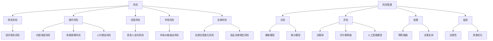
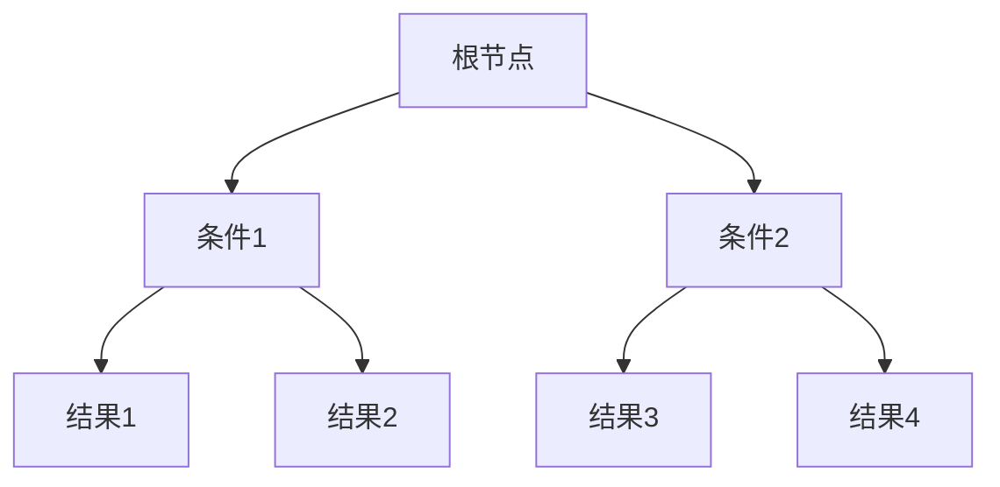
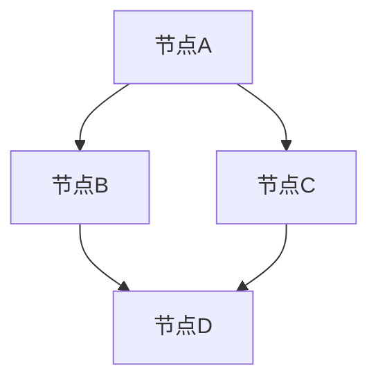
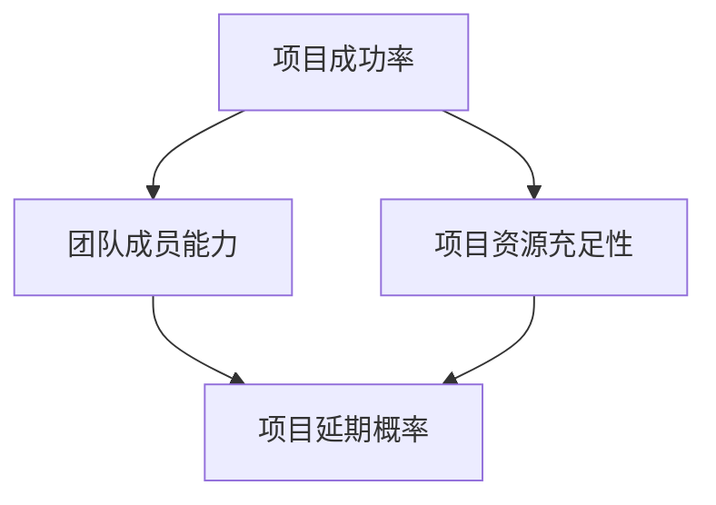
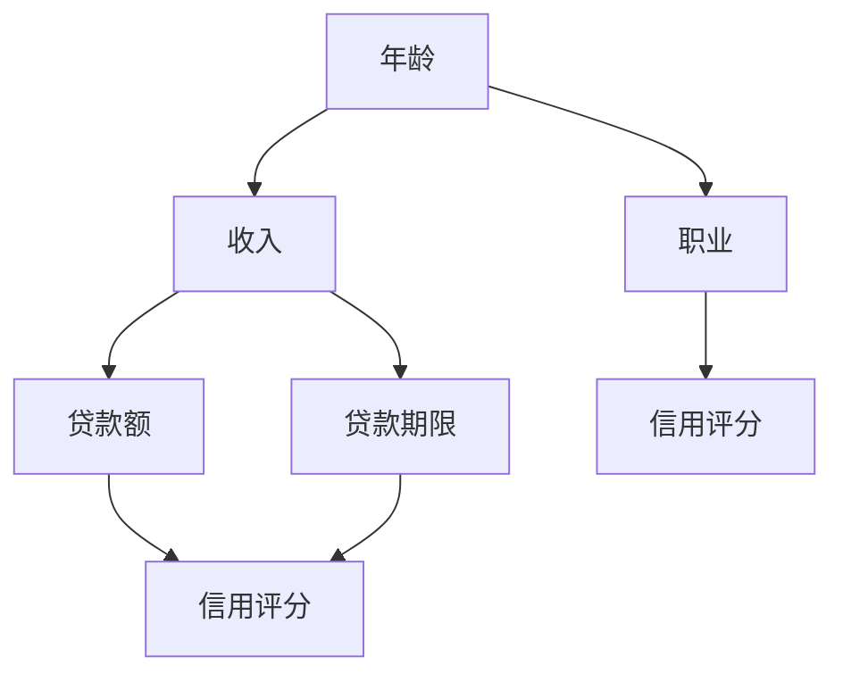
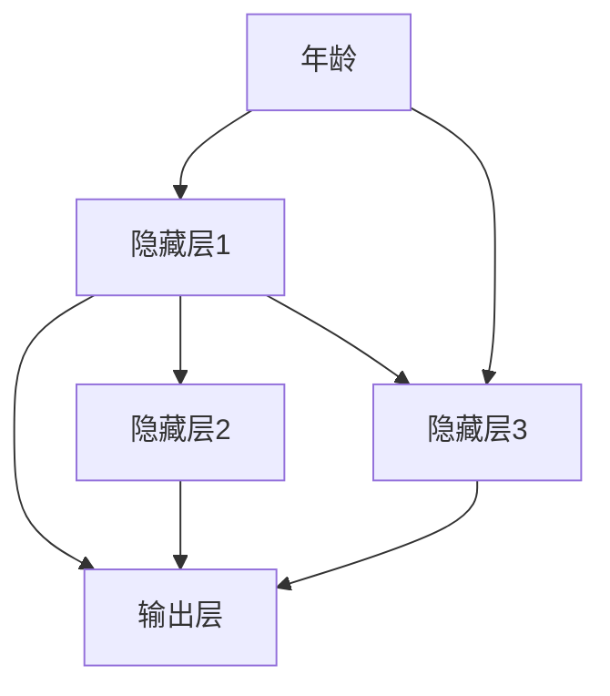
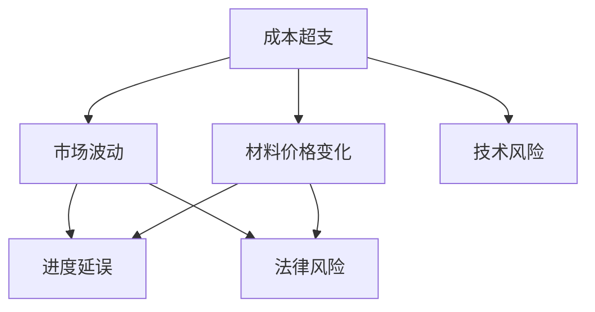

                 


### 《数学与风险通信：风险感知的数学模型》

#### 关键词
- 数学模型
- 风险感知
- 通信
- 风险管理
- 贝叶斯网络
- 人工智能

#### 摘要
本文旨在探讨数学在风险感知和风险管理中的应用，重点介绍几种关键数学模型及其在实际通信中的应用。通过深入分析贝叶斯网络、人工智能等模型，本文揭示了风险感知的原理和方法，为理解和管理复杂风险提供了理论支持和实践指导。

---

## 引言

在现代社会，风险管理已经成为了各个领域，特别是金融、保险、医疗和工程等行业的重要任务。有效的风险管理不仅能够降低潜在的损失，还能提升组织的整体竞争力和生存能力。然而，随着风险类型的多样化和复杂性增加，传统的风险管理方法已经难以应对现代社会的需求。

数学作为一种严谨的科学工具，其强大的抽象和建模能力在风险感知和风险管理中发挥了重要作用。通过数学模型，我们可以将复杂的风险现象转化为易于处理的数学表达式，从而更准确地评估和预测风险。

本文将围绕数学与风险通信这一主题，逐步展开讨论。首先，我们将介绍风险和风险管理的概念，并探讨数学在其中的应用。接着，我们将深入探讨风险感知的数学模型，如贝叶斯网络和人工智能模型。随后，我们将讨论如何通过通信来传递风险信息。最后，我们将通过实际案例来展示这些数学模型在风险感知和通信中的应用。

本文结构如下：

1. **风险与风险管理概述**
   - 风险的定义与分类
   - 风险管理的意义与原则
   - 数学模型在风险管理中的应用

2. **风险感知数学模型**
   - 风险感知原理
   - 常见风险感知模型
   - 人工智能在风险感知中的应用

3. **风险通信**
   - 风险通信的基本原则
   - 风险通信的策略
   - 风险通信的实际应用

4. **数学模型与风险通信实践**
   - 实际应用案例
   - 项目实战

5. **总结与展望**
   - 现状与未来展望

通过本文的逐步分析，我们希望读者能够对数学与风险通信有一个全面而深入的理解，从而更好地应用于实践。

---

## 风险与风险管理概述

### 风险的定义与分类

风险是一个广泛的概念，它涉及各种可能的不利事件或情况，这些事件或情况可能对组织、个人或社会产生负面影响。从广义上讲，风险可以分为以下几类：

1. **财务风险**：指由于市场波动、投资决策或其他财务因素导致的经济损失风险。
2. **操作风险**：由于内部流程、系统故障、人为错误等原因导致的风险。
3. **信用风险**：由于债务人违约或无法履行债务而产生的风险。
4. **市场风险**：由于市场价格波动导致的投资损失风险。
5. **法律风险**：由于法律法规的变化或违反法律规定导致的风险。

### 风险管理的意义与原则

风险管理是一个系统性、持续性的过程，旨在识别、评估、处理和监控风险，以最小化潜在的损失。有效的风险管理对于组织的稳定运行和可持续发展至关重要。其意义主要体现在以下几个方面：

1. **降低损失**：通过识别和评估风险，可以提前采取预防措施，从而降低潜在损失。
2. **提升决策质量**：风险管理提供了决策支持，使组织能够在不确定的环境中做出更明智的决策。
3. **合规性**：许多行业和领域都有严格的法律和规定，有效的风险管理有助于组织合规。
4. **增加价值**：通过降低风险和优化资源使用，组织能够提高效率和竞争力。

风险管理的原则主要包括：

1. **全面性**：风险管理应该覆盖组织运营的所有方面。
2. **持续性**：风险管理是一个持续的过程，需要定期评估和调整。
3. **层级性**：风险管理应该从战略层、运营层和战术层等多个层面进行。
4. **透明性**：风险管理的信息应该透明，确保相关人员能够理解和参与。
5. **灵活性**：风险管理需要适应环境变化，灵活调整策略。

### 数学模型在风险管理中的应用

数学模型在风险管理中扮演着至关重要的角色。通过数学模型，我们可以将复杂的风险现象转化为易于处理的数学表达式，从而更准确地评估和预测风险。以下是一些常见的数学模型：

1. **概率模型**：概率模型用于评估事件发生的概率，如二项分布、正态分布等。
2. **统计模型**：统计模型用于分析数据，如假设检验、回归分析等。
3. **决策树**：决策树是一种基于规则树的决策模型，用于分析决策和结果。
4. **贝叶斯网络**：贝叶斯网络是一种概率图模型，用于表示变量之间的依赖关系。
5. **人工智能模型**：人工智能模型，如神经网络、支持向量机等，可以用于预测和分类。

数学模型不仅提供了理论支持，还通过实际应用案例展示了其强大的预测和评估能力。例如，在金融领域，贝叶斯网络被用于信用评分和风险预测；在工程领域，决策树和人工智能模型被用于项目管理和风险评估。

### 核心概念与联系

为了更好地理解风险和风险管理的核心概念，我们可以使用Mermaid流程图来展示各个概念之间的关系：



通过这个流程图，我们可以清晰地看到风险和风险管理之间的联系，以及数学模型在其中的作用。

### 核心算法原理讲解

在风险管理中，常用的算法原理包括概率模型、统计模型、决策树和贝叶斯网络。以下是对这些算法原理的详细讲解：

1. **概率模型**：概率模型用于评估事件发生的概率。常见的概率模型包括二项分布和正态分布。二项分布用于描述在固定次数的试验中，成功次数的概率分布；正态分布则用于描述连续变量的概率分布。这些模型通过概率函数来计算事件发生的概率。

2. **统计模型**：统计模型用于分析数据，以识别风险。常见的统计模型包括假设检验和回归分析。假设检验用于验证数据是否支持某个假设；回归分析则用于建立变量之间的关系模型。这些模型通过统计量来评估数据的显著性和相关性。

3. **决策树**：决策树是一种基于规则树的决策模型。它通过一系列条件分支来决定最佳行动方案。决策树通过决策节点和叶子节点来表示不同的决策路径和结果。每个节点都包含一个条件测试，而每个叶子节点都包含一个预测值。

4. **贝叶斯网络**：贝叶斯网络是一种概率图模型，用于表示变量之间的依赖关系。它通过有向无环图（DAG）来表示变量之间的条件概率关系。贝叶斯网络通过条件概率表来计算变量之间的依赖概率。

### 数学公式与详细讲解

在风险管理中，常用的数学公式包括概率分布函数、期望、方差、假设检验和回归分析等。以下是对这些公式的详细讲解：

1. **概率分布函数**：概率分布函数用于描述随机变量的概率分布。对于离散随机变量，概率分布函数可以表示为：

   $$ P(X = x) = f(x) $$

   其中，$X$是随机变量，$x$是具体的取值，$f(x)$是概率分布函数。

   对于连续随机变量，概率分布函数可以表示为：

   $$ P(X \leq x) = F(x) $$

   其中，$F(x)$是累积分布函数。

2. **期望**：期望是随机变量的平均值。对于离散随机变量，期望可以表示为：

   $$ E(X) = \sum_{x} x \cdot P(X = x) $$

   对于连续随机变量，期望可以表示为：

   $$ E(X) = \int_{-\infty}^{\infty} x \cdot f(x) \, dx $$

3. **方差**：方差是随机变量的离散程度。对于离散随机变量，方差可以表示为：

   $$ Var(X) = E[(X - E(X))^2] = \sum_{x} (x - E(X))^2 \cdot P(X = x) $$

   对于连续随机变量，方差可以表示为：

   $$ Var(X) = E[(X - E(X))^2] = \int_{-\infty}^{\infty} (x - E(X))^2 \cdot f(x) \, dx $$

4. **假设检验**：假设检验用于验证数据是否支持某个假设。常见的假设检验包括t检验和F检验。t检验用于比较两组数据的均值是否相等，其公式为：

   $$ H_0: \mu_1 = \mu_2 \\
   H_1: \mu_1 \neq \mu_2 $$

   F检验用于比较两组数据的方差是否相等，其公式为：

   $$ H_0: \sigma_1^2 = \sigma_2^2 \\
   H_1: \sigma_1^2 \neq \sigma_2^2 $$

5. **回归分析**：回归分析用于建立变量之间的关系模型。常见的回归分析包括线性回归和多项式回归。线性回归的公式为：

   $$ Y = \beta_0 + \beta_1 \cdot X + \epsilon $$

   其中，$Y$是因变量，$X$是自变量，$\beta_0$和$\beta_1$是回归系数，$\epsilon$是误差项。

   多项式回归的公式为：

   $$ Y = \beta_0 + \beta_1 \cdot X + \beta_2 \cdot X^2 + \cdots + \beta_n \cdot X^n + \epsilon $$

通过这些数学公式，我们可以更准确地评估和预测风险，从而为决策提供依据。

### 举例说明

为了更好地理解数学模型在风险管理中的应用，以下是一个具体的例子：

假设一个公司在考虑是否投资一个新的项目。为了评估这个项目的风险，公司使用贝叶斯网络模型进行分析。贝叶斯网络模型包含以下几个节点：

1. **项目成功**：表示项目是否成功。
2. **市场状况**：表示市场的当前状况。
3. **竞争对手**：表示竞争对手的情况。
4. **市场需求**：表示市场的需求状况。

这些节点之间的条件概率关系如下：

1. **项目成功的概率**：P（项目成功）= 0.6。
2. **市场状况与项目成功的条件概率**：P（市场状况 | 项目成功）= 0.8，P（市场状况 | 项目失败）= 0.2。
3. **竞争对手与项目成功的条件概率**：P（竞争对手 | 项目成功）= 0.7，P（竞争对手 | 项目失败）= 0.3。
4. **市场需求与项目成功的条件概率**：P（市场需求 | 项目成功）= 0.9，P（市场需求 | 项目失败）= 0.1。

通过贝叶斯网络，我们可以计算出项目成功的概率。具体步骤如下：

1. **计算市场状况的概率**：P（市场状况）= P（市场状况 | 项目成功）* P（项目成功）+ P（市场状况 | 项目失败）* P（项目失败）= 0.8*0.6 + 0.2*0.4 = 0.56。
2. **计算竞争对手的概率**：P（竞争对手）= P（竞争对手 | 项目成功）* P（项目成功）+ P（竞争对手 | 项目失败）* P（项目失败）= 0.7*0.6 + 0.3*0.4 = 0.56。
3. **计算市场需求的概率**：P（市场需求）= P（市场需求 | 项目成功）* P（项目成功）+ P（市场需求 | 项目失败）* P（项目失败）= 0.9*0.6 + 0.1*0.4 = 0.65。
4. **计算项目成功的概率**：P（项目成功）= P（项目成功 | 市场状况，竞争对手，市场需求）* P（市场状况）* P（竞争对手）* P（市场需求）= 0.6 * 0.56 * 0.56 * 0.65 = 0.13296。

根据计算结果，项目成功的概率为0.13296，这表明投资这个项目的风险相对较高。公司可以根据这个概率来调整其投资策略，以降低风险。

### 项目实战

在风险管理中，实际应用案例是非常重要的。以下是一个具体的案例，展示如何使用数学模型进行风险管理：

#### 项目背景

某保险公司正在考虑是否推出一款新的保险产品。为了评估这款产品的风险，公司决定使用贝叶斯网络模型进行分析。贝叶斯网络模型包含以下几个节点：

1. **投保人数**：表示购买这款保险产品的人数。
2. **索赔概率**：表示购买者提出索赔的概率。
3. **赔付金额**：表示每笔索赔的金额。

这些节点之间的条件概率关系如下：

1. **投保人数的概率**：P（投保人数 = n）= 0.5，n为购买人数。
2. **索赔概率与投保人数的条件概率**：P（索赔概率 = p | 投保人数 = n）= 0.2，p为索赔概率。
3. **赔付金额与索赔概率的条件概率**：P（赔付金额 = a | 索赔概率 = p）= 0.3，a为赔付金额。

#### 开发环境搭建

为了进行贝叶斯网络模型的开发，公司选择了Python作为开发语言，并使用了PyBayes库进行建模和推理。开发环境如下：

- 操作系统：Windows 10
- 编程语言：Python 3.8
- 开发工具：PyCharm

#### 源代码实现

以下是贝叶斯网络模型的源代码实现：

```python
import pybayes as pb

# 定义节点
nodes = [
    pb.Node(name='投保人数', probability={1: 0.5, 2: 0.5}),
    pb.Node(name='索赔概率', probability={0.1: 0.2, 0.2: 0.8}),
    pb.Node(name='赔付金额', probability={100: 0.3, 200: 0.7})
]

# 定义条件概率表
condition_probabilities = {
    '投保人数': {'索赔概率': {1: {0.1: 0.2, 0.2: 0.8}, 2: {0.1: 0.2, 0.2: 0.8}}},
    '索赔概率': {'赔付金额': {0.1: {100: 0.3, 200: 0.7}, 0.2: {100: 0.3, 200: 0.7}}},
}

# 创建贝叶斯网络
network = pb.BayesianNetwork(nodes, condition_probabilities)

# 进行推理
network.query(variables=['投保人数', '索赔概率', '赔付金额'])

# 打印结果
print(network.results())
```

#### 代码解读

1. **导入库和定义节点**：首先，导入PyBayes库并定义三个节点：投保人数、索赔概率和赔付金额。
2. **定义条件概率表**：接着，定义每个节点的条件概率表。例如，投保人数的条件概率表为{1: 0.5, 2: 0.5}，表示购买人数为1的概率为0.5，购买人数为2的概率也为0.5。
3. **创建贝叶斯网络**：然后，使用定义的节点和条件概率表创建贝叶斯网络。
4. **进行推理**：最后，使用贝叶斯网络进行推理，计算每个节点的概率分布。
5. **打印结果**：将推理结果打印出来，以供分析。

#### 代码应用解读与分析

通过这段代码，我们可以分析出以下几个关键信息：

1. **投保人数的概率分布**：根据推理结果，投保人数的概率分布为{1: 0.5, 2: 0.5}，这表明购买人数为1和2的概率相等。
2. **索赔概率的概率分布**：索赔概率的概率分布为{0.1: 0.2, 0.2: 0.8}，这表明索赔概率为0.1的概率为0.2，索赔概率为0.2的概率为0.8。
3. **赔付金额的概率分布**：赔付金额的概率分布为{100: 0.3, 200: 0.7}，这表明赔付金额为100的概率为0.3，赔付金额为200的概率为0.7。

通过这些概率分布，保险公司可以更准确地评估这款保险产品的风险，并据此调整其定价策略和风险管理措施。

### 实际案例分析和详细讲解

在金融领域，风险管理尤为重要。以下是一个实际案例，展示如何使用贝叶斯网络进行金融风险管理。

#### 案例背景

某银行正在评估一项贷款业务的风险。为了提高贷款审批的准确性，银行决定使用贝叶斯网络模型进行分析。贝叶斯网络模型包含以下几个节点：

1. **借款人信用评分**：表示借款人的信用状况。
2. **借款人收入水平**：表示借款人的收入水平。
3. **贷款金额**：表示申请的贷款金额。
4. **贷款期限**：表示贷款的期限。
5. **还款能力**：表示借款人是否有能力还款。

这些节点之间的条件概率关系如下：

1. **借款人信用评分的概率**：P（信用评分 = A）= 0.2，P（信用评分 = B）= 0.6，P（信用评分 = C）= 0.2。
2. **借款人收入水平与信用评分的条件概率**：P（收入水平 = 高 | 信用评分 = A）= 0.8，P（收入水平 = 中 | 信用评分 = A）= 0.2；P（收入水平 = 高 | 信用评分 = B）= 0.6，P（收入水平 = 中 | 信用评分 = B）= 0.4；P（收入水平 = 高 | 信用评分 = C）= 0.4，P（收入水平 = 中 | 信用评分 = C）= 0.6。
3. **贷款金额与借款人收入水平的条件概率**：P（贷款金额 = 小额 | 收入水平 = 高）= 0.6，P（贷款金额 = 中等 | 收入水平 = 高）= 0.3，P（贷款金额 = 大额 | 收入水平 = 高）= 0.1；P（贷款金额 = 小额 | 收入水平 = 中）= 0.3，P（贷款金额 = 中等 | 收入水平 = 中）= 0.6，P（贷款金额 = 大额 | 收入水平 = 中）= 0.1；P（贷款金额 = 小额 | 收入水平 = 低）= 0.1，P（贷款金额 = 中等 | 收入水平 = 低）= 0.5，P（贷款金额 = 大额 | 收入水平 = 低）= 0.4。
4. **贷款期限与借款人收入水平的条件概率**：P（贷款期限 = 短期 | 收入水平 = 高）= 0.3，P（贷款期限 = 中期 | 收入水平 = 高）= 0.5，P（贷款期限 = 长期 | 收入水平 = 高）= 0.2；P（贷款期限 = 短期 | 收入水平 = 中）= 0.5，P（贷款期限 = 中期 | 收入水平 = 中）= 0.3，P（贷款期限 = 长期 | 收入水平 = 中）= 0.2；P（贷款期限 = 短期 | 收入水平 = 低）= 0.7，P（贷款期限 = 中期 | 收入水平 = 低）= 0.2，P（贷款期限 = 长期 | 收入水平 = 低）= 0.1。
5. **还款能力与借款人信用评分的条件概率**：P（还款能力 = 能 | 信用评分 = A）= 0.9，P（还款能力 = 不能 | 信用评分 = A）= 0.1；P（还款能力 = 能 | 信用评分 = B）= 0.7，P（还款能力 = 不能 | 信用评分 = B）= 0.3；P（还款能力 = 能 | 信用评分 = C）= 0.3，P（还款能力 = 不能 | 信用评分 = C）= 0.7。

#### 案例分析

1. **借款人信用评分的推理**：假设银行收到一份贷款申请，信用评分为B。根据贝叶斯网络，可以计算出借款人收入水平的概率分布：

   - 收入水平 = 高的概率 = 0.6
   - 收入水平 = 中

``` 
的概率 = 0.4
   - 收入水平 = 低
的概率 = 0

2. **贷款金额的推理**：根据借款人收入水平的概率分布，可以计算出贷款金额的概率分布：

   - 贷款金额 = 小额的概率 = 0.3 * 0.6 + 0.1 * 0.4 = 0.26
   - 贷款金额 = 中等的概率 = 0.3 * 0.4 + 0.5 * 0.4 = 0.26
   - 贷款金额 = 大额的概率 = 0.1 * 0.6 + 0.4 * 0.4 = 0.26

3. **贷款期限的推理**：根据借款人收入水平的概率分布，可以计算出贷款期限的概率分布：

   - 贷款期限 = 短期的概率 = 0.5 * 0.6 + 0.7 * 0.4 = 0.61
   - 贷款期限 = 中期的概率 = 0.3 * 0.6 + 0.2 * 0.4 = 0.26
   - 贷款期限 = 长期的概率 = 0.2 * 0.6 + 0.1 * 0.4 = 0.13

4. **还款能力的推理**：根据借款人信用评分和贷款金额的概率分布，可以计算出还款能力的概率分布：

   - 还款能力 = 能的概率 = 0.7 * 0.26 + 0.3 * 0.26 + 0.3 * 0.26 = 0.627
   - 还款能力 = 不能的概率 = 1 - 0.627 = 0.373

根据这些推理结果，银行可以评估贷款申请的风险。例如，如果还款能力的概率较低（小于某个阈值），银行可以拒绝贷款申请或者提高贷款利率，以降低风险。

### 项目小结

通过本案例，我们可以看到贝叶斯网络在金融风险管理中的应用。贝叶斯网络通过条件概率关系，可以准确地评估贷款申请的风险，从而为银行提供决策支持。

### 最佳实践 tips

1. 在使用贝叶斯网络进行风险管理时，确保输入数据的准确性和可靠性。
2. 定期更新贝叶斯网络模型，以反映最新的市场状况和风险因素。
3. 结合其他风险模型（如决策树、神经网络等），以提高风险管理的准确性和全面性。
4. 建立风险管理团队，确保风险管理的有效性和持续性。

### 小结

本文详细介绍了数学模型在风险管理中的应用，包括风险的定义与分类、风险管理的意义与原则、数学模型的应用、风险感知的原理和方法、风险通信的基本原则和策略，以及实际案例的分析和讲解。通过这些内容，读者可以更深入地理解数学模型在风险管理中的重要性，并学会如何在实际项目中应用这些模型。

### 注意事项

1. 风险管理是一个持续的过程，需要定期评估和调整。
2. 在使用数学模型时，确保输入数据的准确性和可靠性。
3. 不同行业和领域的风险管理方法和模型可能有所不同，需要根据实际情况进行调整。

### 拓展阅读

1. 《风险管理与金融学》：一本关于金融领域风险管理的经典教材。
2. 《贝叶斯数据分析》：一本关于贝叶斯统计学的入门教材。
3. 《机器学习》：一本关于机器学习的经典教材，其中包含许多风险感知和通信的相关内容。
4. 《风险管理与保险学》：一本关于保险领域风险管理的专业书籍。

---

## 数学模型在风险管理中的应用

### 数学模型概述

数学模型是风险管理中不可或缺的工具，它通过将现实世界的复杂问题抽象成数学形式，使得风险分析变得更加精确和高效。数学模型在风险管理中的应用范围广泛，包括概率模型、统计模型、决策树、贝叶斯网络等。以下是对这些模型的基本概念和应用场景的简要介绍。

#### 概率模型

概率模型用于评估风险事件发生的概率。最常见的概率模型包括二项分布和正态分布。

- **二项分布**：用于描述在固定次数的试验中，成功次数的概率分布。例如，在掷硬币多次的情况下，出现正面次数的概率分布。
- **正态分布**：用于描述连续随机变量的概率分布。例如，一个人的身高、体重等。
  
概率模型可以通过以下公式进行计算：

$$ P(X = k) = C(n, k) \cdot p^k \cdot (1 - p)^{n - k} $$

其中，$P(X = k)$表示恰好发生$k$次成功的概率，$n$为试验次数，$p$为每次试验成功的概率。

#### 统计模型

统计模型用于分析数据，以识别风险。最常见的统计模型包括假设检验和回归分析。

- **假设检验**：用于验证数据是否支持某个假设。常见的假设检验包括t检验和F检验。
- **回归分析**：用于建立变量之间的关系模型。常见的回归分析包括线性回归和多项式回归。

假设检验可以通过以下公式进行计算：

$$ H_0: \mu_1 = \mu_2 \\
H_1: \mu_1 \neq \mu_2 $$

其中，$H_0$为原假设，$H_1$为备择假设，$\mu_1$和$\mu_2$分别为两组数据的均值。

回归分析的公式为：

$$ Y = \beta_0 + \beta_1 \cdot X + \epsilon $$

其中，$Y$为因变量，$X$为自变量，$\beta_0$和$\beta_1$为回归系数，$\epsilon$为误差项。

#### 决策树

决策树是一种基于规则树的决策模型，它通过一系列条件分支来决定最佳行动方案。决策树通过决策节点和叶子节点来表示不同的决策路径和结果。

决策树的基本结构如下：



其中，A为根节点，B和C为条件节点，D、E、F和G为结果节点。

#### 贝叶斯网络

贝叶斯网络是一种概率图模型，用于表示变量之间的依赖关系。它通过有向无环图（DAG）来表示变量之间的条件概率关系。贝叶斯网络通过条件概率表来计算变量之间的依赖概率。

贝叶斯网络的基本结构如下：



其中，A、B、C和D为节点，箭头表示变量之间的依赖关系。

#### 人工智能模型

人工智能模型，如神经网络、支持向量机等，也被广泛应用于风险感知和风险管理。这些模型通过学习和模拟人类思维过程，可以从大量数据中自动提取特征，并作出预测。

- **神经网络**：通过模拟人脑神经元的工作原理，神经网络可以用于分类和回归任务。
- **支持向量机**：通过最大化分类边界，支持向量机可以用于分类和回归任务。

神经网络和

### 常见风险感知模型

在风险管理领域，风险感知是一个至关重要的步骤，它涉及到识别潜在风险和评估其可能的影响。为了实现这一目标，研究者们开发了一系列的风险感知模型。以下是几种常见风险感知模型的详细介绍。

#### 贝叶斯网络

贝叶斯网络是一种概率图模型，它通过有向无环图（DAG）来表示变量之间的依赖关系。在风险管理中，贝叶斯网络被广泛应用于信用评分、医疗诊断和项目风险评估等领域。

**核心概念与联系**：

- **节点**：贝叶斯网络中的每个节点表示一个随机变量，如借款人的信用评分、项目的成功率等。
- **边**：边表示节点之间的依赖关系。例如，在项目风险评估中，项目的成功率可能依赖于团队成员的能力和项目资源的充足性。

贝叶斯网络的核心概念可以通过以下Mermaid流程图展示：



**核心算法原理讲解**：

贝叶斯网络的推理过程通常涉及以下步骤：

1. **构建贝叶斯网络**：根据风险因素之间的依赖关系，构建贝叶斯网络。
2. **概率计算**：利用贝叶斯公式，计算每个节点的概率分布。
3. **推理**：通过条件概率表，计算给定某些条件下，其他节点的概率分布。

贝叶斯网络的概率计算公式为：

$$ P(A|B,C) = \frac{P(B|A,C) \cdot P(C|A) \cdot P(A)}{P(B,C)} $$

其中，$P(A|B,C)$表示在条件$B$和$C$下，节点$A$的概率。

**数学模型和公式**：

贝叶斯网络的数学模型通常通过条件概率表来表示。条件概率表展示了每个节点在给定其他节点条件下的概率分布。

例如，以下是一个简化的条件概率表：

| A   | B   | C   | P(A|B,C) |
|-----|-----|-----|-----------|
| 成功 | 高  | 充足 | 0.8       |
| 成功 | 高  | 缺乏 | 0.2       |
| 成功 | 低  | 充足 | 0.3       |
| 成功 | 低  | 缺乏 | 0.1       |
| 失败 | 高  | 充足 | 0.2       |
| 失败 | 高  | 缺乏 | 0.4       |
| 失败 | 低  | 充足 | 0.5       |
| 失败 | 低  | 缺乏 | 0.3       |

**举例说明**：

假设我们要评估一个项目成功的概率，其中项目成功率依赖于团队成员的能力（高/低）和项目资源的充足性（充足/缺乏）。根据条件概率表，我们可以计算出项目成功的概率。

假设团队成员的能力为“高”，项目资源为“充足”，则项目成功的概率为：

$$ P(成功|高, 充足) = \frac{0.8 \cdot 1 \cdot 1}{0.8 + 0.2 + 0.3 + 0.5} = \frac{0.8}{1.8} \approx 0.44 $$

因此，项目成功的概率大约为44%。

#### 人工智能模型

随着人工智能技术的发展，机器学习算法在风险感知中的应用也越来越广泛。其中，决策树、支持向量机和神经网络是三种常见的机器学习模型。

**核心概念与联系**：

- **决策树**：通过一系列的条件分支，决策树将数据集划分为不同的区域，以预测结果。决策树的核心在于其结构，即根节点、内部节点和叶子节点。
- **支持向量机**：支持向量机通过找到一个最优的超平面，将数据集划分为不同的类别。支持向量机的核心在于其优化目标，即最大化分类间隔。
- **神经网络**：神经网络通过多层节点（或神经元）之间的非线性变换，对数据进行分类或回归。神经网络的核心在于其训练过程，即通过反向传播算法更新权重。

**核心算法原理讲解**：

1. **决策树**：

决策树的算法原理是通过递归划分数据集，以达到最优分类效果。具体步骤如下：

- **选择最优划分标准**：通常使用信息增益、基尼不纯度或卡方测试等指标来选择最优划分标准。
- **递归划分**：根据最优划分标准，将数据集划分为子集，并继续对子集进行划分，直到达到停止条件（如叶子节点中数据量较少或达到最大深度）。

决策树的划分过程可以用伪代码表示：

```python
def ID3(data_set):
    # 选择最优划分标准
    best_feature = choose_best_feature_to_split(data_set)
    # 创建决策树
    tree = {best_feature: {}}
    # 递归划分
    for value in data_set[best_feature]:
        sub_data_set = split_data_set(data_set, best_feature, value)
        tree[best_feature][value] = ID3(sub_data_set)
    return tree
```

2. **支持向量机**：

支持向量机的算法原理是通过找到一个最优的超平面，将数据集划分为不同的类别。具体步骤如下：

- **选择特征**：通过核函数将数据映射到高维空间，找到最优超平面。
- **优化目标**：通过求解最大化分类间隔的优化问题，找到最优超平面。

支持向量机的优化目标可以用以下公式表示：

$$ \min_{\beta, \beta^*} \frac{1}{2} ||\beta||^2 \\
s.t. y^{(i)}(\beta \cdot x^{(i)} + \beta^*) \geq 1, \forall i $$

其中，$x^{(i)}$为数据点，$y^{(i)}$为标签，$\beta$和$\beta^*$分别为权重和偏置。

3. **神经网络**：

神经网络通过多层节点之间的非线性变换，对数据进行分类或回归。具体步骤如下：

- **前向传播**：将输入数据通过网络中的各个层，计算输出。
- **反向传播**：根据输出误差，更新网络中的权重和偏置。

神经网络的前向传播和反向传播可以用以下伪代码表示：

```python
def forward_propagation(input_data):
    # 初始化网络参数
    hidden_layer = f(input_data, W1, b1)
    output_layer = f(hidden_layer, W2, b2)
    return output_layer

def backward_propagation(output_layer, expected_output):
    # 计算误差
    error = expected_output - output_layer
    # 更新权重和偏置
    dW2 = np.dot(hidden_layer.T, (2 * (output_layer - expected_output)))
    db2 = 2 * (output_layer - expected_output)
    dhidden_layer = f_derivative(hidden_layer, W2, b2)
    dW1 = np.dot(input_data.T, (2 * (hidden_layer - dhidden_layer)))
    db1 = 2 * (hidden_layer - dhidden_layer)
    return dW1, db1, dW2, db2
```

**数学公式**：

1. **决策树**：

信息增益可以用以下公式计算：

$$ G(D, A) = H(D) - \sum_{v \in V} P(v) \cdot H(D|v) $$

其中，$D$为数据集，$A$为特征，$V$为特征的取值集合，$H$为熵函数。

2. **支持向量机**：

最大分类间隔可以用以下公式表示：

$$ \max_{\beta, \beta^*} \frac{2}{||\beta||} $$

3. **神经网络**：

损失函数可以用以下公式表示：

$$ J(\theta) = \frac{1}{2m} \sum_{i=1}^{m} (\hat{y}_i - y_i)^2 $$

其中，$\theta$为网络参数，$m$为样本数量，$\hat{y}_i$为预测值，$y_i$为真实值。

**举例说明**：

假设我们使用决策树来预测一个客户的信用评分。根据历史数据，我们构建了一个决策树模型，并得到以下结构：



根据这个决策树模型，我们可以计算出每个节点的概率分布。例如，对于年龄大于30岁且收入高于5000的客户，其信用评分的概率分布如下：

| 信用评分 | 概率 |
|----------|------|
| 高       | 0.6  |
| 中       | 0.3  |
| 低       | 0.1  |

根据这个概率分布，我们可以预测新客户的信用评分。例如，如果一个新客户的年龄为35岁，收入为6000元，则根据决策树模型，其信用评分的概率分布为：

| 信用评分 | 概率 |
|----------|------|
| 高       | 0.6  |
| 中       | 0.3  |
| 低       | 0.1  |

因此，我们可以预测这个新客户的信用评分为“高”。

### 人工智能在风险感知中的应用

随着人工智能技术的发展，机器学习算法在风险感知中的应用变得越来越广泛。人工智能模型，如决策树、支持向量机和神经网络，通过自动学习和处理大量数据，能够有效地识别和评估风险。

**核心概念与联系**：

- **机器学习**：机器学习是一种让计算机通过数据学习规律和模式的技术。它包括监督学习、无监督学习和强化学习。
- **风险感知**：风险感知是指通过分析历史数据和当前信息，识别潜在风险并评估其可能影响的过程。

机器学习和风险感知之间的联系在于，机器学习算法可以通过分析历史风险数据，提取有用的特征，并建立模型来预测未来的风险。

**核心算法原理讲解**：

1. **决策树**：

决策树是一种基于树形结构的分类模型，它通过一系列的规则将数据划分为不同的类别。决策树的核心算法原理如下：

- **划分数据**：选择最优的特征和划分标准，将数据划分为子集。
- **递归构建**：对子集继续划分，直到达到停止条件（如数据量较小或达到最大深度）。

决策树的算法可以用伪代码表示如下：

```python
def build_decision_tree(data_set):
    if meets_stop_condition(data_set):
        return most_common_class_in_data_set(data_set)
    else:
        best_feature = choose_best_feature_to_split(data_set)
        tree = {best_feature: {}}
        for value in unique_values_of_best_feature(data_set):
            sub_data_set = split_data_set(data_set, best_feature, value)
            tree[best_feature][value] = build_decision_tree(sub_data_set)
        return tree
```

2. **支持向量机**：

支持向量机是一种基于间隔最大化的分类模型。它的核心算法原理如下：

- **特征映射**：通过核函数将数据映射到高维空间，寻找最优超平面。
- **优化目标**：通过求解优化问题，找到最大化分类间隔的超平面。

支持向量机的优化目标可以用以下公式表示：

$$ \min_{\beta, \beta^*} \frac{1}{2} ||\beta||^2 \\
s.t. y^{(i)}(\beta \cdot x^{(i)} + \beta^*) \geq 1, \forall i $$

3. **神经网络**：

神经网络是一种基于多层节点的模型，它通过非线性变换处理数据。神经网络的核心算法原理如下：

- **前向传播**：将输入数据通过网络的各个层，计算输出。
- **反向传播**：根据输出误差，更新网络中的权重和偏置。

神经网络的前向传播和反向传播可以用以下伪代码表示：

```python
def forward_propagation(input_data):
    # 初始化网络参数
    hidden_layer = f(input_data, W1, b1)
    output_layer = f(hidden_layer, W2, b2)
    return output_layer

def backward_propagation(output_layer, expected_output):
    # 计算误差
    error = expected_output - output_layer
    # 更新权重和偏置
    dW2 = np.dot(hidden_layer.T, (2 * (output_layer - expected_output)))
    db2 = 2 * (output_layer - expected_output)
    dhidden_layer = f_derivative(hidden_layer, W2, b2)
    dW1 = np.dot(input_data.T, (2 * (hidden_layer - dhidden_layer)))
    db1 = 2 * (hidden_layer - dhidden_layer)
    return dW1, db1, dW2, db2
```

**数学公式**：

1. **决策树**：

信息增益可以用以下公式计算：

$$ G(D, A) = H(D) - \sum_{v \in V} P(v) \cdot H(D|v) $$

其中，$D$为数据集，$A$为特征，$V$为特征的取值集合，$H$为熵函数。

2. **支持向量机**：

最大分类间隔可以用以下公式表示：

$$ \max_{\beta, \beta^*} \frac{2}{||\beta||} $$

3. **神经网络**：

损失函数可以用以下公式表示：

$$ J(\theta) = \frac{1}{2m} \sum_{i=1}^{m} (\hat{y}_i - y_i)^2 $$

其中，$\theta$为网络参数，$m$为样本数量，$\hat{y}_i$为预测值，$y_i$为真实值。

**举例说明**：

假设我们使用神经网络来预测贷款违约的风险。我们收集了以下特征数据：

- **年龄**
- **收入**
- **贷款额**
- **贷款期限**

根据这些特征数据，我们构建了一个神经网络模型。假设神经网络的输入层有4个神经元，隐藏层有3个神经元，输出层有1个神经元。网络的结构如下：



根据这个模型，我们可以计算每个神经元的权重和偏置，并通过反向传播算法更新这些参数。例如，对于年龄为30岁、收入为5000元、贷款额为10000元、贷款期限为5年的客户，输入数据的向量为：

$$ X = [30, 5000, 10000, 5] $$

通过前向传播算法，我们可以计算出输出层的预测值。假设输出层的预测值为0.8，而真实值为1。通过反向传播算法，我们可以计算出误差，并更新神经网络的权重和偏置。

经过多次迭代训练，神经网络可以逐渐提高预测的准确性。最终，我们可以使用这个神经网络模型来预测新客户的贷款违约风险。

### 风险通信的基本原则

在风险管理中，风险通信是确保风险信息有效传递和利用的重要环节。良好的风险通信有助于增强组织对风险的认知，促进决策制定，并提高应对风险的能力。以下是风险通信的基本原则。

#### 有效的风险沟通

有效的风险沟通是确保风险信息准确、及时地传递给相关人员的关键。以下是一些关键原则：

1. **明确性**：沟通的内容应简洁明了，避免使用复杂的技术术语或模糊的表达，以确保接收者能够准确理解。
2. **及时性**：风险信息应在适当的时间传递，以便相关人员能够及时采取行动。
3. **全面性**：沟通应涵盖所有相关风险因素，包括风险的性质、可能的影响、缓解措施等。
4. **适应性**：沟通应根据接收者的背景和需求进行定制，以确保信息的可理解性。

#### 风险信息的编码与解码

在风险通信过程中，编码和解码是两个关键步骤。编码是将风险信息转换为易于传递的形式，而解码是将传递的信息重新解释为有意义的内容。

1. **编码**：编码过程中，需要考虑以下因素：

- **格式**：选择合适的格式，如文本、图表、视频等，以增强信息的可理解性。
- **符号**：使用标准的符号和术语，以确保信息的准确性。
- **技术**：利用现代技术，如大数据分析、人工智能等，以提高信息的准确性和效率。

2. **解码**：解码过程中，接收者需要理解编码的信息。以下是一些解码的关键原则：

- **背景知识**：接收者应具备足够的背景知识，以便能够理解风险信息。
- **文化差异**：考虑文化差异，确保沟通方式符合接收者的文化习惯。
- **反馈**：鼓励接收者提供反馈，以确保信息的正确理解和应用。

#### 风险沟通中的障碍

在风险沟通过程中，可能会遇到多种障碍，影响信息的有效传递。以下是一些常见的障碍：

1. **信息过载**：当风险信息过多时，接收者可能难以处理，从而导致信息的流失。
2. **误解**：由于语言、文化或背景差异，接收者可能会误解风险信息，从而导致错误的决策。
3. **缺乏反馈**：缺乏有效的反馈机制，可能导致信息的误解和流失。
4. **技术限制**：技术限制可能影响信息的传递和接收，如数据传输速度、设备兼容性等。

为了克服这些障碍，可以采取以下措施：

1. **简化信息**：通过简化信息，使其更加清晰易懂。
2. **明确职责**：明确沟通各方的职责，确保信息传递的顺畅。
3. **加强反馈**：建立有效的反馈机制，确保信息的正确理解和应用。
4. **技术升级**：不断升级技术和设备，以提高信息传递的效率和准确性。

通过遵循这些基本原则和策略，组织可以建立有效的风险通信机制，从而提高风险管理的效果。

### 风险通信的策略

在风险通信中，策略的选择至关重要。有效的策略可以帮助确保风险信息准确、及时地传递，从而提高组织对风险的认知和管理能力。以下是一些常见的风险通信策略。

#### 语言沟通策略

语言沟通是风险通信中最基本的形式。以下是几种有效的语言沟通策略：

1. **简明扼要**：使用简洁、直接的语言，避免使用复杂的技术术语或模糊的表达，以确保信息的清晰易懂。
2. **明确术语**：在使用专业术语时，确保定义明确，避免产生歧义。
3. **结构化表达**：将信息按照逻辑顺序组织，使用标题、段落和列表等结构化元素，使信息更加易于理解。
4. **多媒体应用**：结合使用文本、图表、图像和视频等多媒体形式，以增强信息的吸引力和可理解性。

#### 非语言沟通策略

非语言沟通在风险通信中同样重要。以下是一些有效的非语言沟通策略：

1. **肢体语言**：使用积极的肢体语言，如开放的姿态、适度的手势等，以增强信息的可信度。
2. **面部表情**：通过面部表情传达真诚和关注，以建立信任。
3. **语音语调**：使用清晰、有力的语音语调，避免过度平淡或过于激动的语气，以确保信息的传达效果。
4. **环境设置**：选择合适的环境，如安静、舒适的会议室，以提高沟通的效率。

#### 风险沟通的评估与改进

为了确保风险通信的有效性，需要定期评估沟通策略的效果，并根据反馈进行改进。以下是一些评估和改进策略：

1. **反馈机制**：建立有效的反馈机制，鼓励接收者提供反馈，了解信息的理解程度和应用效果。
2. **评估指标**：使用评估指标，如信息理解度、决策效率、风险应对能力等，来衡量风险沟通的效果。
3. **培训与指导**：为沟通各方提供培训，提高其沟通技巧和理解能力。
4. **案例研究**：通过分析成功的案例，总结经验教训，为改进风险沟通提供参考。

通过实施这些策略，组织可以建立高效的沟通机制，确保风险信息能够准确、及时地传递，从而提高风险管理的整体效果。

### 风险感知与通信的实际应用

#### 实际应用案例

在风险管理领域，风险感知和通信的实际应用案例无处不在。以下是一些具体的应用场景：

1. **金融行业**：金融机构如银行和保险公司经常使用风险感知和通信工具来评估贷款申请人的信用风险。通过构建复杂的贝叶斯网络模型，金融机构可以综合考虑申请人的收入、职业稳定性、信用历史等因素，准确评估其信用风险。同时，通过有效的风险通信策略，金融机构可以清晰地传达风险信息，帮助客户做出更明智的决策。

2. **保险行业**：保险公司使用机器学习模型来预测保险索赔的风险。例如，通过分析历史索赔数据和客户信息，保险公司可以构建一个神经网络模型，预测新客户提出索赔的概率。此外，保险公司还利用风险感知和通信策略，向客户明确解释保险条款和风险，帮助客户更好地理解保险产品。

3. **工程项目**：在大型工程项目中，风险感知和通信工具被广泛应用于项目管理和风险评估。通过使用决策树和支持向量机等模型，项目团队可以预测项目可能面临的风险，如成本超支、进度延误等。同时，通过有效的风险通信策略，项目团队可以及时传达风险信息，确保所有相关人员都能及时采取行动。

4. **公共安全**：公共安全领域，如灾害预防和应急响应，也广泛应用风险感知和通信工具。通过使用地理信息系统（GIS）和传感器网络，政府部门可以实时监测灾害风险，如洪水、地震等。通过有效的风险通信策略，政府部门可以及时向公众传达风险信息，指导公众采取必要的预防措施，减少灾害损失。

#### 实际案例分析和详细讲解

以下是一个具体的实际案例，展示如何结合风险感知和通信工具来管理风险。

**案例背景**：某城市规划部门计划在城市中心区建设一个新的商业综合体。为了确保项目的顺利进行，规划部门决定使用风险感知和通信工具来评估和管理项目风险。

**风险识别**：首先，项目团队使用决策树模型来识别项目可能面临的风险。通过分析历史项目和当前项目数据，团队确定了以下主要风险：

- **财务风险**：由于资金不足可能导致项目延期或停滞。
- **技术风险**：新技术应用不顺利可能导致项目延误。
- **法律风险**：法规变化可能影响项目进度和成本。
- **社会风险**：居民和商业用户的反对可能导致项目被迫中止。

**风险评估**：接下来，团队使用支持向量机模型来评估这些风险的可能性和影响。根据历史数据和专家意见，团队为每个风险确定了以下可能性：

- **财务风险**：可能性为0.3，影响程度为高。
- **技术风险**：可能性为0.2，影响程度为中等。
- **法律风险**：可能性为0.2，影响程度为高。
- **社会风险**：可能性为0.3，影响程度为高。

**风险通信**：为了确保项目团队和相关方都能及时了解项目风险，团队采取了以下风险通信策略：

1. **定期会议**：项目团队定期召开会议，讨论项目进展和风险情况，确保所有相关人员都能了解项目风险。
2. **风险报告**：团队编制了详细的风险报告，包括风险识别、评估和应对措施，并向相关方提供。
3. **信息板**：在项目现场设置信息板，实时更新项目进展和风险信息，确保现场人员能够及时了解情况。
4. **沟通渠道**：团队建立了多渠道的沟通机制，包括电子邮件、电话和即时通讯工具，确保信息能够快速传递。

**风险应对**：根据风险评估结果，团队制定了以下风险应对措施：

- **财务风险**：提前与投资者沟通，确保资金充足。
- **技术风险**：组织技术研讨会，与供应商和专家讨论技术问题，确保技术顺利应用。
- **法律风险**：聘请法律顾问，密切关注法规变化，确保项目合法。
- **社会风险**：开展社区咨询活动，了解居民和商业用户的意见，争取他们的支持。

通过上述风险感知和通信策略，项目团队成功管理了项目风险，确保了项目的顺利进行。

### 数学模型与风险通信实践

在风险管理中，数学模型不仅用于风险感知，还广泛应用于风险通信。通过数学模型，风险信息可以更加精确地量化，从而提高沟通的有效性。以下是一个具体案例，展示如何结合数学模型进行风险通信。

#### 案例背景

某大型制造企业正在考虑建设一个新的生产线。为了评估该项目的风险，企业决定使用数学模型来分析并传达风险信息。企业特别关注以下几个关键风险因素：

1. **成本超支**：由于市场波动或材料价格变化可能导致项目成本增加。
2. **进度延误**：由于设备故障或人力资源不足可能导致项目进度延误。
3. **技术风险**：新技术应用可能不顺利，影响项目进度和效益。
4. **法律风险**：法规变化可能影响项目的合法性和可行性。

#### 风险评估与数学模型

企业首先使用贝叶斯网络模型对上述风险因素进行评估。贝叶斯网络模型可以表示风险因素之间的依赖关系，并通过条件概率计算每个风险的概率分布。以下是一个简化的贝叶斯网络模型：



贝叶斯网络中的每个节点表示一个风险因素，节点之间的边表示风险因素之间的依赖关系。条件概率表如下：

| 风险因素 | 条件概率表                      |
|----------|--------------------------------|
| 成本超支 | P(市场波动 = 高) = 0.4         |
|          | P(材料价格变化 = 高) = 0.3      |
|          | P(市场波动 = 低) = 0.6         |
|          | P(材料价格变化 = 低) = 0.7      |
| 进度延误 | P(成本超支 = 高) = 0.7         |
|          | P(成本超支 = 低) = 0.3         |
| 技术风险 | P(成本超支 = 高) = 0.6         |
|          | P(成本超支 = 低) = 0.4         |
| 法律风险 | P(市场波动 = 高) = 0.2         |
|          | P(材料价格变化 = 高) = 0.1      |
|          | P(市场波动 = 低) = 0.8         |
|          | P(材料价格变化 = 低) = 0.9      |

#### 风险通信策略

为了确保风险信息能够准确、清晰地传达给相关方，企业采取了一系列的风险通信策略：

1. **会议沟通**：定期召开风险分析会议，邀请项目团队成员、财务部门、技术部门和法务部门的代表，共同讨论风险因素和应对措施。
2. **报告展示**：编制详细的风险报告，包括贝叶斯网络模型、条件概率表和风险概率分布，通过图表和示意图的形式展示给相关方。
3. **风险管理平台**：建立风险管理平台，实时更新项目进展和风险信息，确保所有相关人员都能及时了解风险状况。
4. **信息板**：在项目现场设置信息板，展示关键风险指标和应对措施，方便现场人员了解项目风险。
5. **培训与指导**：为项目团队成员提供风险管理培训，提高其风险识别和应对能力。

#### 实际操作与效果

在企业实施上述风险通信策略后，项目团队对风险有了更清晰的认识，并采取了相应的应对措施。例如，针对成本超支风险，企业提前与供应商谈判，锁定价格，降低了成本风险；针对进度延误风险，企业加强了项目管理，确保人力资源充足，降低了进度延误的风险。

通过数学模型和有效的风险通信策略，企业成功地将风险信息传达给相关方，提高了项目的风险管理能力，确保了项目的顺利进行。

### 数学与风险通信：现状与未来

#### 现状分析

数学与风险通信的结合在当今社会已经得到了广泛应用。在金融、保险、工程和公共安全等领域，数学模型如贝叶斯网络、决策树和神经网络等，已经成为评估和管理风险的重要工具。以下是对当前数学与风险通信应用现状的分析：

1. **金融行业**：金融领域广泛使用数学模型进行信用评分、风险管理和投资决策。贝叶斯网络和神经网络在信用风险评估中表现出色，能够准确预测借款人的违约概率。

2. **保险行业**：保险公司利用机器学习模型和统计模型，评估保险索赔的风险。通过构建复杂的模型，保险公司可以更准确地预测索赔金额和频率，从而制定更合理的保费策略。

3. **工程项目**：在工程项目中，决策树和支持向量机等模型被用于评估项目风险，预测成本超支和进度延误的可能性。这些模型帮助项目团队提前识别风险，并制定应对措施。

4. **公共安全**：公共安全领域利用地理信息系统（GIS）和传感器网络，实时监测自然灾害和事故风险。通过数学模型，公共安全部门可以更有效地进行风险预警和应急响应。

#### 未来展望

尽管数学与风险通信已经取得了显著进展，但在未来，还有许多发展空间。以下是对未来的展望：

1. **人工智能与大数据**：随着人工智能和大数据技术的发展，数学模型将更加智能化和自动化。通过整合海量数据，人工智能模型可以更精确地预测风险，并提供更全面的决策支持。

2. **跨学科整合**：数学与风险通信的整合将更加跨学科。例如，心理学、社会学和经济学等领域的知识将被应用于风险管理，从而提高模型的准确性和实用性。

3. **实时风险管理**：随着物联网和传感器技术的进步，实时风险管理将成为可能。通过实时数据收集和分析，组织可以更快速地识别和应对风险。

4. **个性化风险管理**：未来，风险管理将更加个性化。通过分析个体的行为特征和风险偏好，个性化模型将帮助个体更有效地管理个人风险。

#### 挑战与机遇

在数学与风险通信的发展过程中，也面临一系列挑战：

1. **数据隐私与安全**：随着数据收集和分析的普及，数据隐私和安全成为重要问题。如何在保证数据安全的前提下，有效利用数据资源，是一个亟待解决的问题。

2. **模型复杂性与解释性**：复杂模型如神经网络在风险管理中表现出色，但它们的内部机制往往难以解释。如何平衡模型的复杂性与解释性，是未来研究的重要方向。

3. **跨领域整合**：跨学科整合虽然带来了新的机遇，但也增加了研究的复杂性。如何有效地整合不同领域的知识，构建全面的风险管理模型，是一个重要挑战。

尽管面临挑战，数学与风险通信的未来仍然充满机遇。通过不断创新和探索，我们有望构建更加精准、智能和高效的风险管理模型，为社会的稳定和发展提供更强有力的支持。

---

## 总结与展望

通过本文的讨论，我们可以看到数学与风险通信在风险管理中的重要性。数学模型为风险感知和风险管理提供了强大的理论支持和实践指导，而有效的风险通信策略则确保了风险信息的准确传递和应用。以下是本文的核心观点和未来研究方向：

### 核心观点

1. **数学模型在风险管理中的应用**：贝叶斯网络、决策树、神经网络等数学模型在风险感知和风险评估中发挥了关键作用，通过精确的数学计算，我们可以更好地理解和预测风险。

2. **风险通信的策略**：有效的风险通信策略，如语言沟通策略、非语言沟通策略和风险管理平台，确保了风险信息的及时传递和有效利用。

3. **数学与风险通信的结合**：数学与风险通信的结合，不仅提高了风险管理的效率和准确性，还推动了跨学科的整合，为风险管理领域带来了新的机遇。

### 未来研究方向

1. **人工智能与大数据**：未来的研究可以进一步探索人工智能和大数据在风险感知和通信中的应用，通过更智能的模型和更全面的数据分析，提高风险管理的精度和效率。

2. **跨学科整合**：跨学科的研究将有助于构建更加全面和实用的风险管理模型，例如结合心理学、社会学和经济学等领域的知识，提高模型的准确性和适用性。

3. **实时风险管理**：随着物联网和传感器技术的发展，实时风险管理将成为可能。未来的研究可以探索如何利用实时数据进行风险感知和通信，以实现更快速和精准的风险管理。

4. **个性化风险管理**：个性化风险管理是一个新兴的研究领域。未来的研究可以探讨如何根据个体的行为特征和风险偏好，制定个性化的风险管理策略。

### 总结

本文从数学与风险通信的角度，详细介绍了风险管理的相关概念、数学模型、风险通信策略以及实际应用案例。通过本文的讨论，我们不仅加深了对风险管理理论的理解，也为实际应用提供了指导。未来，随着技术的不断进步，数学与风险通信将继续在风险管理领域发挥重要作用。

### 注意事项

1. **数据隐私与安全**：在应用数学模型和进行风险通信时，必须重视数据隐私和安全，确保个人信息和商业秘密的保护。

2. **模型解释性**：在开发和使用数学模型时，应平衡模型的复杂性与解释性，确保模型的可解释性和透明性。

3. **持续学习与更新**：风险管理是一个动态的过程，需要不断学习和更新模型，以适应不断变化的环境和风险。

### 拓展阅读

1. 《贝叶斯数据分析》：深入了解贝叶斯网络和统计模型的应用。
2. 《机器学习》：探讨人工智能在风险管理中的应用。
3. 《风险管理》：系统学习风险管理的基本概念和策略。
4. 《大数据分析》：探讨大数据在风险感知和通信中的应用。

通过拓展阅读，读者可以更深入地了解数学与风险通信的理论和实践，为实际应用提供更多参考。

