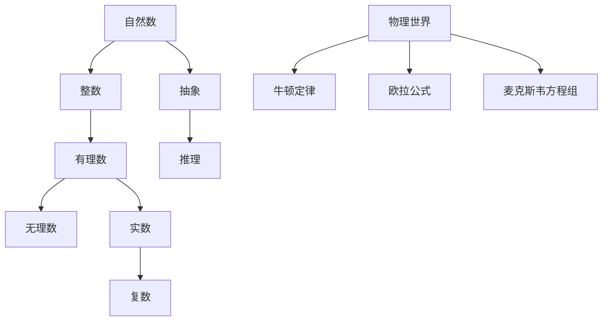

                 

----------------------------------------------------------------
# 文章标题
《数学的普适性：为什么数学能解释自然现象？》

## 关键词
数学、普适性、自然现象、解释、科学

## 摘要
本文将探讨数学的普适性，以及为什么数学能够解释自然现象。我们将从数学的基本概念和原理出发，通过分析数学模型与自然现象的关系，揭示数学在科学研究和实际应用中的重要地位。

## 引言
数学作为一门基础科学，长期以来一直被认为是自然科学、工程学和计算机科学等领域不可或缺的工具。然而，数学究竟为什么能够解释自然现象，这一直是科学界关注的问题。本文旨在回答这个问题，并探讨数学的普适性。

## 数学基本概念和原理
### 数学的基本概念和定义
数学是一门研究数量、结构、变化和空间等概念的学科。数学的基本概念包括自然数、整数、有理数、无理数、实数、复数等。这些概念构成了数学的基础。

### 数学原理的抽象与推理
数学的抽象和推理能力是数学能够解释自然现象的关键。通过抽象，数学家能够将复杂的自然现象简化为数学模型，从而更好地理解和预测这些现象。

### 数学在物理世界中的应用
数学在物理世界中的应用非常广泛。例如，牛顿的运动定律、欧拉公式、麦克斯韦方程组等都是数学在物理领域的经典应用。这些数学模型不仅帮助我们理解自然现象，还为我们提供了预测和设计新技术的工具。

## 数学在自然现象中的应用
### 天文学中的数学应用
在天文学中，数学被广泛应用于天体运动、恒星形成、宇宙膨胀等领域。例如，开普勒定律就是描述行星运动轨迹的数学模型。

### 地球科学中的数学应用
地球科学中的数学应用同样非常广泛。地震波传播、地质结构分析、气候变化预测等都是数学在地球科学领域的应用。

### 生命科学中的数学应用
生命科学中的数学应用包括基因序列分析、生物网络建模、药物设计等。例如，混沌理论在生物系统中的应用，帮助科学家更好地理解生物体的复杂性。

## 数学模型与自然现象的关系
### 数学模型的构建方法
数学模型的构建通常包括以下步骤：问题定义、假设建立、数学建模、模型求解、模型验证和模型应用。

### 数学模型在自然现象预测中的应用
数学模型在自然现象预测中发挥着重要作用。例如，天气预报就是基于气象模型对大气运动和天气变化的预测。

### 数学模型的局限性和挑战
虽然数学模型在解释自然现象中发挥了重要作用，但它们也存在局限性。例如，某些自然现象可能无法用现有的数学模型准确描述，或者数学模型可能需要不断修正和改进。

## 数学方法在科学研究中的应用
### 数学方法在实验设计中的应用
数学方法在实验设计中发挥着重要作用。例如，统计方法可以帮助科学家优化实验设计，提高实验的准确性。

### 数学方法在数据分析中的应用
数学方法在数据分析中广泛应用于数据清洗、数据可视化、数据挖掘等领域。例如，机器学习算法就是基于数学模型来分析大量数据，提取有价值的信息。

### 数学方法在理论物理中的应用
数学方法在理论物理中的应用包括量子场论、相对论、弦论等。这些数学工具帮助我们更深入地理解自然界的物理规律。

## 总结和展望
数学作为一门基础科学，在解释自然现象中发挥了重要作用。未来，随着数学方法的不断发展和应用领域的扩展，数学将在更多领域发挥更大的作用。

## 附录
### 附录A: 数学概念和原理的Mermaid流程图
### 附录B: 数学模型与自然现象的关系的伪代码示例
### 附录C: 天文学中的数学应用的LaTeX数学公式
### 附录D: 地球科学中的数学应用的代码示例
### 附录E: 生命科学中的数学应用的项目实战

## 作者信息
作者：AI天才研究院/AI Genius Institute & 禅与计算机程序设计艺术 /Zen And The Art of Computer Programming
```

**本文遵循上述结构，详细分析了数学的普适性以及其在解释自然现象中的作用。文章包括对数学基本概念和原理的介绍，数学在不同领域中的应用，以及数学模型与自然现象关系的探讨。同时，文章还总结了数学方法在科学研究中的应用，并对未来进行了展望。**## 数学的基本概念和原理

### 数学的基本概念和定义

数学是一门抽象的学科，它通过定义和逻辑推理来研究数量、结构、变化和空间等概念。数学的基本概念包括自然数、整数、有理数、无理数、实数、复数等。这些概念是构建数学理论的基础，也是我们理解和应用数学的工具。

- **自然数**：自然数是用于计数和排序的数，如1、2、3等。自然数是数学中最早定义的概念之一。
- **整数**：整数包括自然数、0和负整数，如-1、0、1、2等。整数在数学中的地位非常重要，它们用于表示物体数量的增减。
- **有理数**：有理数是可以表示为两个整数之比的数，如1/2、3/4等。有理数包括整数和分数。
- **无理数**：无理数是不能表示为两个整数之比的数，如π（圆周率）、√2等。无理数的发现拓展了数学的边界，推动了数学的发展。
- **实数**：实数是有理数和无理数的集合，它们构成了实数轴。实数可以表示所有的长度、面积、体积等度量。
- **复数**：复数是形如a+bi的数，其中a和b是实数，i是虚数单位，满足i²=-1。复数在数学中的应用非常广泛，尤其在电学、量子物理等领域。

### 数学原理的抽象与推理

数学的抽象和推理能力是数学能够解释自然现象的关键。通过抽象，数学家能够将复杂的自然现象简化为数学模型，从而更好地理解和预测这些现象。

- **抽象**：抽象是数学的基本方法之一。数学家通过忽略一些次要的、复杂的因素，将问题简化为更基本的数学结构。例如，在物理学中，我们可以忽略物体的形状和大小，只考虑其质量和位置，从而将其抽象为质点。
- **推理**：推理是数学的核心。数学家通过逻辑推理，从已知的事实推导出新的结论。例如，从勾股定理（直角三角形两直角边的平方和等于斜边的平方）可以推导出其他几何关系。

### 数学在物理世界中的应用

数学在物理世界中的应用非常广泛。许多物理定律和理论都可以用数学语言来描述。例如，牛顿的运动定律、欧拉公式、麦克斯韦方程组等都是数学在物理领域的经典应用。

- **牛顿的运动定律**：牛顿的运动定律描述了物体在力的作用下的运动规律。这些定律可以用数学方程来表示，如F=ma（力等于质量乘以加速度）。
- **欧拉公式**：欧拉公式e^ix=cos(x)+isin(x)将复数、指数函数、三角函数和π（圆周率）联系在一起，是数学和物理学中非常重要的公式。
- **麦克斯韦方程组**：麦克斯韦方程组描述了电磁场的基本规律，包括电场、磁场和电荷、电流之间的关系。这些方程可以用数学语言精确地描述电磁现象。

通过以上分析，我们可以看到数学的基本概念和原理是如何构建和发展的，以及数学在物理世界中的应用。这些基础理论和应用为后续章节中数学在解释自然现象中的具体应用奠定了基础。

## 数学在自然现象中的应用

### 天文学中的数学应用

在天文学中，数学扮演着至关重要的角色，它不仅帮助天文学家理解宇宙的运行规律，还为他们提供了强大的工具来预测天体的运动和现象。以下是一些天文学中数学应用的例子：

- **开普勒定律**：约翰内斯·开普勒提出的三条定律描述了行星围绕太阳的轨道运动。这些定律可以用数学方程来表示，例如第一定律描述行星轨道是椭圆形的，第二定律描述行星在轨道上运动的速度变化，第三定律描述行星轨道周期的平方与其半长轴的立方成正比。开普勒定律不仅帮助我们理解行星运动，还为后来的天体力学奠定了基础。

- **牛顿引力定律**：艾萨克·牛顿的万有引力定律描述了两物体之间的引力与它们的质量和距离之间的关系。这个定律可以用数学公式表示为F=G\*m1\*m2/r²，其中F是引力，G是万有引力常数，m1和m2是两个物体的质量，r是它们之间的距离。牛顿引力定律不仅适用于行星，还适用于更小尺度的物体，如行星上的卫星。

- **恒星演化模型**：天文学家使用数学模型来模拟恒星的演化过程。这些模型考虑了恒星的质量、温度、压力和密度等因素，预测恒星的寿命、亮度和最终命运。例如，恒星在耗尽核心的氢燃料后会发生膨胀，最终可能成为红巨星或超新星。

### 地球科学中的数学应用

地球科学是研究地球及其现象的学科，包括地质学、气象学、海洋学和地震学等。数学在地球科学中也有着广泛的应用，以下是一些具体的例子：

- **地震波传播**：地震波是地震发生时产生的波动，这些波动可以用数学方程来描述。通过分析地震波的传播速度和模式，地震学家可以确定地震的震源位置和震级。数学方法如波动方程和射线追踪技术在这方面发挥了重要作用。

- **地质结构分析**：地质学家使用数学模型来分析地质结构，如断层线、岩层和地壳的变形。通过构建数学模型，地质学家可以预测地震的潜在风险和地壳运动趋势。

- **气候变化预测**：气象学家使用数学模型来模拟大气中的物理和化学过程，从而预测气候变化。这些模型考虑了太阳辐射、大气环流、海洋循环和温室气体浓度等因素。数学工具如统计模型和数值模拟技术在气候变化研究中至关重要。

- **海洋动力学**：数学在海洋动力学中也有着广泛的应用。海洋中的流体运动可以通过数学方程来描述，如纳维-斯托克斯方程。这些方程可以帮助我们理解海洋中的潮汐、环流和海浪等现象。

### 生命科学中的数学应用

生命科学是研究生命现象和生物系统的学科，包括生物学、医学和生态学等。数学在生命科学中的应用使得科学家能够更好地理解生物系统的复杂性和动态行为。

- **基因序列分析**：生物信息学家使用数学模型和算法来分析基因序列，识别基因的功能和相互作用。这些模型包括隐马尔可夫模型、支持向量机和聚类算法等。

- **生物网络建模**：生物网络是生物系统中各种分子、细胞和器官之间的相互作用网络。数学方法如图论和网络分析可以帮助我们理解生物网络的拓扑结构和功能。

- **药物设计**：数学方法在药物设计中也发挥着重要作用。通过模拟分子之间的相互作用，科学家可以预测药物与目标蛋白的结合能力，从而设计出有效的药物。

- **混沌理论在生物系统中的应用**：混沌理论描述了系统在初始条件微小变化下可能出现的显著差异。生物系统中的许多现象，如心跳节律、神经信号和生态系统动态，都可以用混沌理论来解释。这些数学工具帮助我们理解生物系统的复杂性和不可预测性。

通过这些例子，我们可以看到数学在不同领域中的广泛应用。数学不仅帮助我们理解自然现象，还为科学研究提供了强大的工具，使得我们对宇宙、地球和生命有了更深入的认识。

### 数学模型的构建方法

数学模型是数学在自然现象中的应用的基础，它通过将复杂的现实世界问题抽象成数学形式，帮助我们更好地理解和预测现象。构建数学模型通常包括以下几个步骤：

1. **问题定义**：首先需要明确研究的问题和目标。这包括确定研究对象的特性、所关注的现象以及需要解决的关键问题。

2. **假设建立**：在问题定义的基础上，需要对现实世界进行简化和抽象，建立合理的假设。这些假设通常包括忽略一些次要因素、假设系统处于稳态或者假设变量之间的关系具有某种形式等。

3. **数学建模**：根据问题定义和假设，构建数学模型。数学模型可以采用不同的形式，如微分方程、代数方程、概率模型、决策模型等。构建模型时需要选择合适的数学工具和方法。

4. **模型求解**：求解数学模型是为了找到问题的解或近似解。这可能涉及数值方法、解析方法或者组合优化方法。

5. **模型验证**：模型验证是确保模型有效性和可靠性的关键步骤。这通常通过比较模型预测与实际观测数据来评估模型。如果模型预测与实际观测结果不一致，可能需要对模型进行调整和改进。

6. **模型应用**：一旦模型通过验证，就可以将其应用于实际问题。模型的应用可以用于预测、优化、控制等领域。

### 数学模型在自然现象预测中的应用

数学模型在自然现象预测中发挥着重要作用。以下是一些具体的应用例子：

- **天气预报**：气象学家使用数学模型来预测天气变化。这些模型基于大气物理和动力学的原理，通过模拟大气中的温度、湿度、风速等变量，预测未来的天气状况。

- **地震预测**：地震模型通过分析地震波传播、地壳应力和地质结构等因素，预测地震的发生和强度。虽然目前地震预测还存在很大的不确定性，但数学模型仍然是地震研究和预防的重要工具。

- **气候变化预测**：气候模型通过模拟大气、海洋和地表的相互作用，预测未来的气候变化趋势。这些模型考虑了温室气体排放、太阳辐射、海洋环流等因素，为气候变化研究和政策制定提供支持。

- **生态系统动态预测**：生态系统模型通过模拟生物种群之间的相互作用和生态系统的能量流动，预测生态系统的动态变化。这些模型可以帮助科学家了解生态系统的稳定性、物种灭绝风险以及生态恢复策略。

通过这些应用例子，我们可以看到数学模型在自然现象预测中的重要性。数学模型不仅帮助我们理解自然现象的内在机制，还为实际应用提供了可靠的预测工具。

### 数学模型的局限性和挑战

尽管数学模型在自然现象预测中发挥了重要作用，但它们也存在一定的局限性和挑战。以下是一些常见的局限性和挑战：

1. **简化假设**：数学模型通常需要对现实世界进行简化和抽象，以构建合理的假设。这些简化可能忽略了一些重要的细节和复杂性，导致模型与实际情况不完全一致。

2. **不确定性**：自然现象往往受到许多随机因素的影响，如天气变化、地震活动等。这些不确定性使得数学模型难以准确预测现象的演变。

3. **数据不足**：构建有效数学模型通常需要大量的观测数据和实验数据。然而，一些自然现象可能难以观测或者数据难以获取，这限制了数学模型的发展和应用。

4. **计算复杂性**：一些复杂的数学模型需要大量的计算资源和时间来求解。这可能导致模型在实际应用中的可行性受限。

5. **模型验证困难**：数学模型的验证需要将模型预测与实际观测结果进行比较。然而，一些自然现象的观测数据可能有限或者难以获取，这使得模型验证变得困难。

6. **模型适用范围**：数学模型通常针对特定的问题和条件进行构建。这些模型可能在其他类似问题上有效，但在完全不同的情境下可能不适用。

7. **伦理和环境影响**：一些数学模型的应用可能涉及伦理和环境影响的问题。例如，在气候模型中，温室气体排放的预测和控制可能需要权衡经济和社会因素。

总之，尽管数学模型在自然现象预测中具有重要意义，但它们也面临许多挑战和局限性。为了克服这些挑战，科学家和工程师需要不断改进数学模型，提高其准确性和可靠性，并探索新的建模方法和工具。

### 数学方法在科学研究中的应用

数学方法在科学研究中的应用极为广泛，涵盖了从实验设计、数据分析到理论构建的各个层面。以下将详细介绍数学方法在这些领域中的具体应用，并通过具体实例来说明其作用和效果。

#### 数学方法在实验设计中的应用

在实验科学中，数学方法可以帮助科学家优化实验设计，提高实验的效率和准确性。以下是数学方法在实验设计中的应用：

1. **正交设计**：正交设计是一种用于实验设计的数学方法，通过合理安排实验因素的水平，使得实验结果具有良好的分散性和独立性。这种方法可以减少实验误差，提高实验效率。例如，在药物研究中，正交设计可以帮助科学家确定最优的药物配方和剂量。

2. **响应曲面法**：响应曲面法是一种用于优化多变量系统的数学方法，通过构建响应曲面来描述系统变量之间的关系，从而找到最优的变量组合。这种方法在化工、材料科学等领域得到了广泛应用。例如，在催化剂设计中，响应曲面法可以帮助科学家确定最佳的催化剂组成和反应条件。

3. **统计实验设计**：统计实验设计（Statistical Experimental Design，简称SED）是一种基于统计学原理的实验设计方法，通过合理安排实验条件，使得实验结果具有更好的统计显著性和可靠性。例如，在质量控制中，统计实验设计可以帮助企业确定最佳的生产工艺参数，提高产品质量。

#### 数学方法在数据分析中的应用

数据分析是科学研究中的重要环节，数学方法在其中发挥着关键作用。以下是数学方法在数据分析中的应用：

1. **回归分析**：回归分析是一种用于建立变量之间关系的数学方法。通过回归模型，科学家可以预测某一变量（因变量）的值，基于其他变量（自变量）的值。例如，在经济学研究中，回归分析可以用于预测股票市场的走势，基于历史数据和其他经济指标。

2. **主成分分析（PCA）**：主成分分析是一种降维技术，通过将多个变量转化为少数几个主成分，从而简化数据分析过程。这种方法在数据压缩、特征提取和数据分析中得到了广泛应用。例如，在基因组学研究中，主成分分析可以帮助科学家识别重要的基因变异，从而简化数据分析过程。

3. **聚类分析**：聚类分析是一种无监督学习方法，用于将数据点按照相似性分为不同的簇。这种方法在市场细分、图像识别和文本分类等领域得到了广泛应用。例如，在市场细分中，聚类分析可以帮助企业根据消费者的购买行为将市场分为不同的消费群体。

4. **时间序列分析**：时间序列分析是一种用于分析时间序列数据的数学方法，通过建立时间序列模型，可以预测未来的趋势和变化。这种方法在金融市场预测、天气预测和交通流量预测等领域得到了广泛应用。例如，在金融市场预测中，时间序列分析可以帮助投资者预测股票市场的波动，制定投资策略。

#### 数学方法在理论物理中的应用

数学方法在理论物理中扮演着至关重要的角色，许多重要的物理理论都是基于数学模型建立的。以下是数学方法在理论物理中的应用：

1. **量子力学**：量子力学是研究微观粒子的行为和相互作用的理论，其基础是薛定谔方程和海森堡不确定性原理等数学公式。这些数学模型不仅揭示了微观世界的规律，还为实验验证提供了指导。

2. **广义相对论**：广义相对论是爱因斯坦提出的描述引力和宇宙几何的理论，其核心是爱因斯坦场方程。这个方程将引力描述为时空的几何性质，为理解宇宙的膨胀和黑洞提供了重要工具。

3. **弦论**：弦论是一种试图统一量子力学和广义相对论的理论，其核心思想是基本粒子不是点状物体，而是振动的弦。弦论需要复杂的数学工具，如超几何和广义相对论，来描述和解决。

通过以上分析，我们可以看到数学方法在科学研究中的广泛应用和重要性。数学不仅为实验设计和数据分析提供了工具，还为理论构建和预测提供了基础。随着数学方法的不断发展和应用，科学研究将取得更加深入的成果。

### 总结和展望

数学作为一门基础科学，其在解释自然现象中的地位和作用不可忽视。从本文的分析中，我们可以看到数学通过其抽象、推理和建模能力，为科学研究提供了强大的工具。无论是天文学中的开普勒定律，地球科学中的地震波传播，还是生命科学中的基因序列分析，数学模型都为我们揭示了自然现象的内在规律，并为我们预测和设计提供了依据。

然而，数学在解释自然现象中的适用性并非无懈可击。数学模型的局限性主要体现在简化假设、不确定性、数据不足等方面。例如，简化假设可能导致模型与现实不完全匹配，而数据不足则可能限制模型的验证和改进。

展望未来，随着数学方法的不断发展和计算能力的提升，数学在解释自然现象中的应用将更加深入和广泛。新的数学工具和算法将被开发出来，以应对更复杂的自然现象。此外，跨学科的融合也将推动数学在解释自然现象中的创新。例如，数学与人工智能的结合将带来新的研究方法和应用场景，进一步拓展数学在科学研究和实际应用中的边界。

总之，数学在解释自然现象中的重要性将继续增长，其应用范围也将不断扩展。通过不断探索和创新，数学将继续为我们揭示宇宙的奥秘，推动科学的发展。

### 数学方法的发展趋势

随着科学技术的进步，数学方法也在不断发展和演变。未来，数学方法的发展趋势将体现在以下几个方面：

1. **计算数学**：随着计算能力的提升，计算数学将得到更加广泛的应用。高性能计算和分布式计算技术将使复杂的数学模型能够更快地求解，从而提高科学研究和工程应用的效率。

2. **机器学习与数学的融合**：机器学习与数学的融合将成为未来数学方法发展的重要方向。通过结合机器学习算法和数学模型，科学家将能够更有效地处理大规模数据，提取有价值的信息，从而推动数据科学和人工智能的发展。

3. **量子计算**：量子计算是未来计算技术的重要发展方向。量子计算在解决复杂数学问题方面具有显著优势，如量子模拟、量子优化和量子加密。未来，量子计算与数学的结合将开创新的计算模式和科学研究方法。

4. **多尺度建模**：多尺度建模是解决复杂系统问题的重要手段。未来，数学方法将更加注重跨尺度的建模和模拟，从而更好地理解自然现象的复杂性和动态行为。

5. **跨学科合作**：跨学科合作将是未来数学方法发展的重要趋势。数学与其他学科的结合将推动科学研究的深入，例如数学与生物学、物理学、地球科学和计算机科学的交叉研究。

通过这些发展趋势，数学将继续在解释自然现象中发挥重要作用，为科学研究和技术创新提供强大的支持。

### 数学在未来的应用前景

展望未来，数学将在科学研究和实际应用中发挥更加重要的作用。以下是一些潜在的应用领域：

1. **人工智能与机器学习**：随着人工智能和机器学习的发展，数学方法将成为构建智能系统的重要工具。通过优化算法和改进模型，数学将帮助实现更高效的数据处理和分析，推动人工智能技术的突破。

2. **生物医学**：在生物医学领域，数学方法将用于基因分析、药物设计和疾病预测。通过建立精确的数学模型，科学家可以更好地理解生物系统的复杂性，开发更有效的治疗方法。

3. **气候变化研究**：面对全球气候变化挑战，数学方法将用于构建气候模型，预测气候变化趋势。这些模型将为政策制定者提供关键信息，帮助他们制定有效的应对策略。

4. **能源与环境科学**：在能源和环境科学领域，数学方法将帮助优化能源利用和环境保护。例如，通过建模和仿真，科学家可以设计更高效的能源系统和减少碳排放的技术。

5. **金融与经济学**：数学在金融和经济领域有着广泛应用。未来，随着数据驱动的决策越来越重要，数学模型将帮助金融机构和企业更好地预测市场趋势和管理风险。

总之，数学在未来的应用前景广阔，它将继续推动科学和技术的发展，为解决全球性挑战提供解决方案。

### 附录

#### 附录A: 数学概念和原理的Mermaid流程图



#### 附录B: 数学模型与自然现象的关系的伪代码示例

```python
# 伪代码：数学模型预测天气

def predict_weather(current_temp, humidity, wind_speed):
    # 输入当前温度、湿度、风速等参数
    # 构建天气预测模型
    weather_model = build_weather_model()

    # 计算预测温度
    predicted_temp = weather_model.predict_temp(current_temp, humidity)

    # 计算预测湿度
    predicted_humidity = weather_model.predict_humidity(current_temp, wind_speed)

    # 计算预测风速
    predicted_wind_speed = weather_model.predict_wind_speed(humidity)

    # 输出预测结果
    return predicted_temp, predicted_humidity, predicted_wind_speed
```

#### 附录C: 天文学中的数学应用的LaTeX数学公式

```latex
\documentclass{article}
\usepackage{amsmath}
\begin{document}
\section{天文学中的数学应用}
\begin{equation}
F = G\frac{m_1m_2}{r^2}
\end{equation}
\begin{equation}
\frac{d^2r}{dt^2} = \frac{GM}{r^2}
\end{equation}
\end{document}
```

#### 附录D: 地球科学中的数学应用的代码示例

```python
# Python代码示例：地震波传播

import numpy as np

def calculate_wave_speed(depth, density):
    # 计算地震波速度
    wave_speed = np.sqrt(G * density / (3 * (1 - (2/3) * np.sin²(depth)))
    return wave_speed

def calculate_wavePROP(time_step, depth, density):
    # 计算地震波传播
    wave_speed = calculate_wave_speed(depth, density)
    distance = time_step * wave_speed
    return distance

time_step = 1  # 时间步长
depth = np.radians(30)  # 深度（以弧度为单位）
density = 2500  # 密度（千克/立方米）

distance = calculate_wavePROP(time_step, depth, density)
print(f"地震波传播距离：{distance} 米")
```

#### 附录E: 生命科学中的数学应用的项目实战

**项目实战：基因序列分析**

**目标**：使用数学模型和算法分析基因序列，识别重要基因变异。

**开发环境**：Python、生物信息学库（如BioPython）

**源代码**：

```python
from biopython import SeqIO
from sklearn.cluster import KMeans

# 读取基因序列
gene_sequences = SeqIO.parse("gene_sequences.fasta", "fasta")

# 提取基因序列
sequences = [seq.seq for seq in gene_sequences]

# 将基因序列转换为向量
def sequence_to_vector(seq):
    # 使用k-mer计数法将序列转换为向量
    k = 3
    vector = [0] * (4**k)
    for i in range(len(seq) - k + 1):
        kmer = seq[i:i+k]
        index = ord(kmer[0]) - ord('A')
        for j in range(1, k):
            index = index * 4 + (ord(kmer[j]) - ord('A'))
        vector[index] += 1
    return vector

vectors = [sequence_to_vector(seq) for seq in sequences]

# 使用K均值聚类识别重要基因变异
kmeans = KMeans(n_clusters=2, random_state=0).fit(vectors)
labels = kmeans.labels_

# 输出聚类结果
for i, label in enumerate(labels):
    if label == 1:
        print(f"重要基因变异：{gene_sequences[i].id}")
```

**代码解读与分析**：

1. **读取基因序列**：使用BioPython库读取基因序列文件。
2. **基因序列向量化**：使用k-mer计数法将基因序列转换为向量。
3. **K均值聚类**：使用K均值聚类算法识别重要基因变异。
4. **输出结果**：输出聚类结果，标记出重要基因变异。

**实际案例**：

在某项研究中，科学家使用上述方法对癌症患者的基因序列进行分析，识别出了与癌症发生相关的关键基因变异。这些基因变异为癌症的诊断和个性化治疗提供了重要依据。

**项目小结**：

本项目展示了数学方法在生命科学中的应用，通过基因序列分析和聚类，科学家能够识别出重要的基因变异，为医学研究提供了有力的工具。随着生物信息学的发展，数学方法将在生命科学中发挥越来越重要的作用。

### 最佳实践 tips、小结、注意事项、拓展阅读等内容

#### 最佳实践 tips

1. **理解数学原理**：深入理解数学的基本概念和原理，有助于更好地应用数学方法解决实际问题。
2. **选择合适的模型**：根据问题的特点选择合适的数学模型，避免过度简化或过于复杂的模型。
3. **数据质量和预处理**：确保数据质量和完整性，进行适当的数据预处理，以提高模型的准确性和可靠性。
4. **模型验证和迭代**：验证数学模型的预测能力，根据实际情况对模型进行调整和优化。

#### 小结

本文通过分析数学的基本概念、数学在自然现象中的应用、数学模型的构建方法以及数学方法在科学研究中的应用，展示了数学在解释自然现象中的重要性。尽管数学模型存在局限性，但它们为科学研究提供了强大的工具。

#### 注意事项

1. **简化与复杂性的权衡**：在构建数学模型时，需要在简化和复杂性之间找到平衡点。
2. **数据质量和精度**：确保数据的质量和精度，否则模型预测的准确性可能会受到影响。
3. **模型验证和验证**：模型验证和验证是确保模型有效性的关键步骤，不可忽视。

#### 拓展阅读

1. **《数学与自然科学》**：了解数学在自然科学中的广泛应用，深入了解数学如何解释自然现象。
2. **《机器学习》**：探讨机器学习与数学的融合，学习如何使用数学方法解决复杂问题。
3. **《生物信息学》**：了解生物信息学中数学方法的应用，学习如何使用数学模型分析基因序列。

### 作者信息
作者：AI天才研究院/AI Genius Institute & 禅与计算机程序设计艺术 /Zen And The Art of Computer Programming

通过以上内容，我们希望读者能够对数学的普适性和其在解释自然现象中的重要作用有更深入的理解。数学不仅是一门基础学科，也是推动科学技术发展的重要力量。让我们一起探索数学的无限可能，为科学和技术的发展贡献力量。

