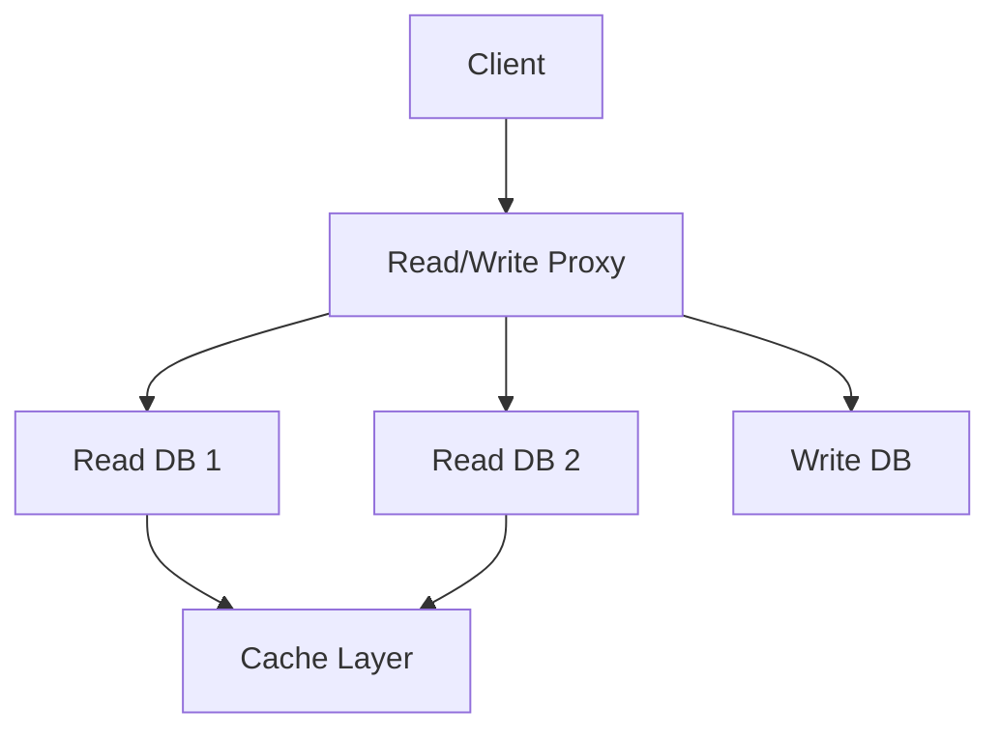

                 

### 文章标题：数据库读写分离代理在LLM应用中的应用

#### 关键词：
- 数据库读写分离
- 代理服务器
- LLM应用
- 性能优化
- 实现方法

#### 摘要：
本文深入探讨了数据库读写分离代理在大型语言模型（LLM）应用中的重要性及其实现方法。通过详细的分析和步骤讲解，本文旨在帮助开发者理解数据库读写分离代理的基础概念、架构设计、实现方法以及性能优化策略。文章还通过具体的应用案例，展示了读写分离代理在LLM训练和预测中的实际效果和优化技巧。

## 目录大纲

### 第一部分：数据库读写分离代理概述

#### 第1章：数据库读写分离代理基础

##### 1.1 数据库读写分离代理的概念与作用

##### 1.2 读写分离代理的技术原理

##### 1.3 读写分离代理的架构设计

##### 1.4 读写分离代理在LLM应用中的重要性

### 第二部分：数据库读写分离代理的实现方法

#### 第2章：数据库读写分离代理的实现方法

##### 2.1 主从数据库配置

##### 2.2 读写分离代理的搭建

##### 2.3 读写分离代理的API接口设计

##### 2.4 读写分离代理的安全机制

### 第三部分：读写分离代理在LLM应用中的应用

#### 第3章：读写分离代理在LLM训练中的应用

##### 3.1 LLM训练中数据库读写分离的需求

##### 3.2 读写分离代理在LLM训练中的架构设计

##### 3.3 读写分离代理在LLM训练中的实现

##### 3.4 读写分离代理在LLM训练中的案例解析

#### 第4章：读写分离代理在LLM预测中的应用

##### 4.1 LLM预测中数据库读写分离的需求

##### 4.2 读写分离代理在LLM预测中的架构设计

##### 4.3 读写分离代理在LLM预测中的实现

##### 4.4 读写分离代理在LLM预测中的案例解析

### 第四部分：读写分离代理的性能优化

#### 第5章：数据库性能优化策略

##### 5.1 数据库性能优化的重要性

##### 5.2 常见数据库性能优化方法

##### 5.3 数据库性能监控与诊断

#### 第6章：读写分离代理的性能优化

##### 6.1 读写分离代理性能优化的重要性

##### 6.2 读写分离代理性能优化的方法

##### 6.3 读写分离代理性能优化的案例分析

#### 第7章：读写分离代理的测试与部署

##### 7.1 读写分离代理的测试策略

##### 7.2 读写分离代理的部署流程

##### 7.3 读写分离代理的监控与维护

### 第五部分：读写分离代理的应用案例

#### 第8章：读写分离代理在实际项目中的应用

##### 8.1 项目背景与需求分析

##### 8.2 项目架构设计与实现

##### 8.3 项目效果评估与优化

##### 8.4 项目总结与拓展阅读

### 结束语

##### 8.5 最佳实践 tips

##### 8.6 注意事项与展望

## 第一部分：数据库读写分离代理概述

### 第1章：数据库读写分离代理基础

在当今大数据和云计算时代，数据库读写分离代理已成为提高系统性能、增强可扩展性和可靠性的一种关键技术。本章将详细介绍数据库读写分离代理的基础知识，包括其概念、作用以及相关的技术原理。

#### 1.1 数据库读写分离代理的概念与作用

**数据库读写分离代理**是一种通过在数据库前添加一层代理服务器来处理读写请求的技术。其主要目的是将读请求和写请求分离，从而实现数据库的负载均衡和性能优化。

- **读请求**：主要从数据库中读取数据，通常不需要对数据进行修改。
- **写请求**：需要对数据库中的数据进行修改、添加或删除。

**读写分离代理的作用**：

1. **负载均衡**：通过将读请求分配到多个从库上，减少主库的负担，从而提高系统的吞吐量和响应速度。
2. **提高可用性**：在读库出现故障时，可以通过主库快速切换到其他从库，从而保证系统的可用性。
3. **性能优化**：通过优化读写请求的处理流程，减少网络传输和数据锁定的冲突，提高系统的整体性能。

#### 1.2 读写分离代理的技术原理

**读写分离代理**的技术原理主要基于**主从数据库架构**，其中包含一个主库和多个从库。

- **主库**：负责处理所有的写请求，并定期将数据同步到从库。主库通常具有较高的性能和稳定性。
- **从库**：负责处理读请求，并从主库同步数据。从库可以有一个或多个，根据实际需求进行配置。

**读写分离的实现方法**：

1. **基于IP地址的读写分离**：通过配置数据库的IP地址，将读请求和写请求分别路由到不同的数据库实例。
2. **基于SQL语句的读写分离**：通过解析SQL语句中的读写操作，将读请求路由到从库，将写请求路由到主库。
3. **基于代理服务器的读写分离**：在数据库前添加一层代理服务器，由代理服务器负责处理所有的读写请求，并根据请求类型将请求路由到相应的数据库实例。

#### 1.3 读写分离代理的架构设计

**读写分离代理的架构设计**主要包括以下几个部分：

1. **代理服务器**：负责接收和处理来自客户端的读写请求，并将请求路由到相应的数据库实例。
2. **数据库实例**：包括主库和多个从库，负责处理具体的读写请求。
3. **负载均衡器**：根据实际需求，将读写请求分配到不同的数据库实例上，以实现负载均衡。

**代理服务器的工作流程**：

1. **请求接收**：代理服务器接收客户端发送的读写请求。
2. **请求解析**：代理服务器根据请求类型（读请求或写请求）进行解析。
3. **请求路由**：代理服务器将解析后的请求路由到相应的数据库实例。
4. **请求处理**：数据库实例处理具体的读写请求，并将结果返回给代理服务器。
5. **结果返回**：代理服务器将处理结果返回给客户端。

#### 1.4 读写分离代理在LLM应用中的重要性

**LLM**（Large Language Model）即大型语言模型，是一种基于深度学习技术的自然语言处理模型。随着LLM技术的不断发展，其对数据库性能的要求也越来越高。

- **数据读取速度**：LLM训练过程中需要大量读取数据，如果数据读取速度过慢，将会严重影响训练效果。
- **数据一致性**：在多用户并发读取和写入数据时，需要保证数据的一致性，以防止数据冲突和错误。

**读写分离代理在LLM应用中的重要性**：

1. **提高数据读取速度**：通过将读请求分配到多个从库上，实现数据的并行读取，从而提高数据读取速度。
2. **保证数据一致性**：通过代理服务器控制读写请求的顺序和路由，保证数据的一致性，避免数据冲突和错误。
3. **增强系统可扩展性**：通过读写分离代理，可以方便地增加从库，实现系统的水平扩展，提高系统的性能和可用性。

### 小结

本章详细介绍了数据库读写分离代理的基础知识，包括其概念、作用、技术原理以及架构设计。通过本章的学习，读者可以初步了解数据库读写分离代理的基本原理和应用场景，为后续章节的深入学习打下基础。

## 第一部分：数据库读写分离代理概述

### 第2章：数据库读写分离代理的实现方法

在了解了数据库读写分离代理的基础知识后，接下来我们将深入探讨其实际实现方法。本章将详细介绍如何配置主从数据库、搭建读写分离代理、设计API接口以及确保读写分离代理的安全机制。

#### 2.1 主从数据库配置

**主从数据库配置**是实施读写分离代理的基础，其核心是建立和维护一个高效的主从数据库架构。

**主从数据库架构的建立**：

1. **选择数据库类型**：常见的主从数据库架构适用于关系型数据库，如MySQL、PostgreSQL等。
2. **初始化主库**：创建数据库实例，配置主库的基本参数，如缓冲区大小、日志文件路径等。
3. **初始化从库**：复制主库的数据和结构，配置从库的基本参数，确保从库能够同步主库的数据变更。

**主从数据库同步策略**：

1. **同步方式**：常见同步方式有全量同步和增量同步。全量同步在初始建立时使用，而增量同步则用于后续的数据同步。
2. **同步频率**：同步频率取决于数据变更的频率和系统的性能需求。一般来说，增量同步的频率越高，数据的一致性越高，但会增加系统的负担。

**主从数据库切换机制**：

1. **自动切换**：通过设置主库和从库之间的心跳机制，当主库发生故障时，从库可以自动接管主库的工作。
2. **手动切换**：在某些情况下，如主库需要进行维护时，可以通过手动切换将主库的工作负载转移到从库。

#### 2.2 读写分离代理的搭建

**读写分离代理的搭建**是实现读写分离的关键步骤，其核心是构建一个高效的代理服务器，用于处理读写请求。

**代理服务器的搭建过程**：

1. **选择代理服务器软件**：常见的代理服务器软件有MySQL Proxy、HAProxy、KeePass等。根据需求选择适合的代理服务器软件。
2. **安装和配置代理服务器**：安装代理服务器软件，并配置相关的参数，如数据库连接信息、负载均衡策略等。
3. **测试代理服务器**：在搭建完成后，对代理服务器进行测试，确保其能够正确处理读写请求，并保证数据的一致性。

**代理服务器的配置与优化**：

1. **连接池配置**：通过配置连接池，可以减少与数据库建立连接的次数，提高系统的性能。
2. **负载均衡策略**：根据需求配置负载均衡策略，如轮询、最小连接数、源IP哈希等，以实现请求的合理分配。
3. **性能监控**：通过性能监控工具，实时监控代理服务器的状态，以便及时调整配置，优化系统性能。

**代理服务器的性能监控**：

1. **性能指标**：监控代理服务器的响应时间、请求量、错误率等性能指标。
2. **日志分析**：通过分析代理服务器的日志，发现潜在的性能瓶颈和问题。
3. **预警机制**：配置预警机制，当性能指标达到一定阈值时，自动触发预警，以便及时处理。

#### 2.3 读写分离代理的API接口设计

**读写分离代理的API接口设计**是用户与读写分离代理交互的接口，其核心是设计一个高效、安全、易用的API接口。

**API接口的定义与实现**：

1. **接口定义**：定义API接口的URL、请求参数和返回结果格式。
2. **接口实现**：使用编程语言实现API接口，确保接口能够正确处理各种读写请求。

**API接口的权限控制**：

1. **用户认证**：对访问API接口的用户进行认证，确保只有授权用户才能访问接口。
2. **权限控制**：根据用户的角色和权限，限制用户可以执行的操作，确保数据的安全性。

**API接口的性能优化**：

1. **缓存策略**：通过配置缓存策略，减少对数据库的访问次数，提高接口的响应速度。
2. **接口限流**：通过配置接口限流策略，防止恶意请求过多占用系统资源。

#### 2.4 读写分离代理的安全机制

**读写分离代理的安全机制**是确保系统安全的关键，其核心是防止未经授权的访问和数据泄露。

**数据库访问的安全控制**：

1. **加密传输**：通过配置SSL/TLS加密协议，确保数据在传输过程中的安全性。
2. **访问控制**：通过配置数据库的访问控制策略，限制用户的访问权限，防止未授权访问。

**代理服务器的安全配置**：

1. **防火墙配置**：通过配置防火墙规则，限制外部访问代理服务器的IP地址和端口，防止恶意攻击。
2. **安全审计**：通过配置安全审计策略，记录代理服务器的访问日志和操作日志，以便进行事后审计和问题追踪。

**安全漏洞的防范措施**：

1. **定期更新**：定期更新代理服务器和数据库的软件版本，确保系统安全。
2. **安全扫描**：使用安全扫描工具定期对代理服务器和数据库进行安全扫描，发现潜在的安全漏洞。

### 小结

本章详细介绍了数据库读写分离代理的实现方法，包括主从数据库配置、代理服务器的搭建与配置、API接口设计以及安全机制。通过本章的学习，读者可以掌握实施读写分离代理的基本步骤和方法，为在实际项目中应用读写分离代理打下坚实基础。

## 第一部分：数据库读写分离代理概述

### 第3章：读写分离代理在LLM应用中的重要性

在深入探讨读写分离代理的技术细节之前，我们需要理解其在大型语言模型（LLM）应用中的重要性。随着人工智能技术的迅猛发展，LLM在自然语言处理、文本生成、机器翻译等领域发挥着越来越重要的作用。然而，LLM的高性能需求对数据库系统提出了新的挑战。下面，我们将详细分析LLM对数据库性能的要求以及读写分离代理在LLM应用中的角色。

#### 3.1 LLM对数据库性能的要求

**大规模数据处理能力**：LLM通常需要处理海量数据，包括训练数据和推理数据。这要求数据库系统能够快速读取和写入大量数据，以支持高效的训练和预测。

**低延迟响应**：在实时应用场景中，如实时问答和智能客服，用户对响应速度有极高的要求。数据库系统必须能够快速响应用户请求，提供实时结果。

**高可用性**：由于LLM应用通常涉及关键业务，任何数据库故障都可能导致严重的业务中断。因此，数据库系统需要具备高可用性，能够快速切换到备份系统，确保服务的持续运行。

**数据一致性**：在多用户并发访问数据的情况下，需要保证数据的一致性，防止数据冲突和错误。这对于LLM训练和预测过程中数据的准确性和可靠性至关重要。

**可扩展性**：随着LLM应用规模的不断扩大，数据库系统需要能够水平扩展，以支持更多的用户请求和数据量。

#### 3.2 读写分离代理在LLM应用中的角色

**负载均衡**：读写分离代理通过将读请求和写请求分离，并将读请求分配到多个从库上，从而实现数据库负载均衡。这有助于提高系统的吞吐量和响应速度，满足LLM对大规模数据处理和高性能响应的需求。

**数据一致性保障**：读写分离代理通过控制读写请求的顺序和路由，确保数据的一致性。在多用户并发访问数据时，读写分离代理可以防止数据冲突和错误，保证数据的准确性和可靠性。

**提高系统可用性**：当主库出现故障时，读写分离代理可以快速切换到从库，继续处理读请求和写请求，从而保证系统的可用性。这有助于防止因数据库故障导致的业务中断，确保服务的持续运行。

**优化数据读取速度**：通过将读请求分配到多个从库上，读写分离代理可以实现数据的并行读取，从而提高数据读取速度。这对于LLM训练过程中需要快速读取大量数据的需求具有重要意义。

**增强系统可扩展性**：读写分离代理可以方便地增加从库，实现系统的水平扩展。随着LLM应用规模的不断扩大，通过增加从库，可以进一步优化系统的性能和可用性。

#### 3.3 读写分离代理的未来发展趋势

**智能化**：未来的读写分离代理将更加智能化，能够根据实际需求自动调整负载均衡策略、数据同步策略和缓存策略，从而实现更高的性能和更可靠的服务。

**自动化**：随着自动化技术的发展，读写分离代理的配置和管理将更加自动化。通过自动化工具，可以简化读写分离代理的部署、配置和监控，提高系统的运维效率。

**云原生**：随着云计算的普及，读写分离代理将更加云原生。通过云原生架构，读写分离代理可以更好地适应云环境，实现更高的可扩展性和弹性。

**安全性增强**：随着数据安全的日益重要，读写分离代理将加强安全机制，包括加密传输、访问控制和安全审计等，确保数据的安全性和完整性。

### 小结

本章详细分析了读写分离代理在LLM应用中的重要性，包括其对数据库性能的要求以及读写分离代理在LLM应用中的角色。通过本章的学习，读者可以深入理解读写分离代理在提升数据库性能和保障系统可靠性方面的关键作用，为后续章节的深入学习奠定基础。

## 第二部分：数据库读写分离代理的实现方法

### 第2章：数据库读写分离代理的实现方法

在前一章中，我们探讨了数据库读写分离代理的基础概念和重要性。在这一章中，我们将深入探讨具体的实现方法，包括如何配置主从数据库、搭建读写分离代理、设计API接口以及确保读写分离代理的安全机制。

#### 2.1 主从数据库配置

**主从数据库配置**是实现读写分离代理的基础步骤。以下是具体的实现方法：

1. **选择数据库类型**：
   - 主从数据库架构适用于多种关系型数据库，如MySQL、PostgreSQL、Oracle等。根据项目需求和现有资源，选择合适的数据库类型。
   - 考虑数据库的性能、扩展性和兼容性，以确保主从架构的稳定性和高效性。

2. **初始化主库**：
   - 创建数据库实例，配置主库的基本参数，如缓冲区大小、日志文件路径、复制设置等。
   - 确保主库具有足够的性能和稳定性，以满足高并发读写请求的需求。

3. **初始化从库**：
   - 复制主库的数据和结构，配置从库的基本参数，如同步模式、延迟时间等。
   - 确保从库能够同步主库的数据变更，以保持数据的一致性。

4. **同步策略配置**：
   - 根据实际需求，配置主从数据库的同步策略。常见同步策略包括：
     - **全量同步**：在初次建立主从关系时，将主库的全部数据同步到从库。
     - **增量同步**：仅同步主库发生变更的数据，提高同步效率。

5. **切换机制配置**：
   - 配置主从切换机制，当主库发生故障时，自动将读写请求切换到从库，确保系统的高可用性。
   - 可以通过心跳检测、故障转移等方式实现自动切换。

**示例：MySQL主从数据库配置**

以下是一个简单的MySQL主从数据库配置示例：

```sql
-- 主库配置
CREATE DATABASE mydb;
GRANT REPLICATION SLAVE ON *.* TO 'slave_user'@'192.168.1.2';
FLUSH TABLES WITH READ LOCK;
COPY DATA TO SLAVE;
UNLOCK TABLES;

-- 从库配置
CHANGE MASTER TO
  MASTER_HOST='192.168.1.1',
  MASTER_USER='slave_user',
  MASTER_PASSWORD='slave_password',
  MASTER_LOG_FILE='mysql-bin.000001',
  MASTER_LOG_POS=107;
START SLAVE;
```

#### 2.2 读写分离代理的搭建

**读写分离代理**是处理读写请求的关键组件。以下是搭建读写分离代理的具体步骤：

1. **选择代理服务器软件**：
   - 常见的代理服务器软件有MySQL Proxy、HAProxy、KeePass等。根据项目需求和资源情况，选择合适的代理服务器软件。
   - 考虑代理服务器的性能、可靠性、扩展性等因素。

2. **安装和配置代理服务器**：
   - 安装代理服务器软件，并配置相关的参数，如数据库连接信息、负载均衡策略等。
   - 配置代理服务器的IP地址和端口，确保其能够正确接收和处理读写请求。

3. **测试代理服务器**：
   - 在搭建完成后，测试代理服务器的功能，确保其能够正确处理读写请求，并保证数据的一致性。
   - 可以通过模拟读写请求，测试代理服务器的性能和稳定性。

**示例：MySQL Proxy搭建**

以下是一个简单的MySQL Proxy搭建示例：

```bash
# 安装MySQL Proxy
sudo apt-get install mysql-proxy

# 配置MySQL Proxy
sudo nano /etc/mysql/mysql-proxy.cnf

# 配置内容
[mysql-proxy]
proxy-address = "0.0.0.0:6032"
proxy-backend-addresses = "master:3306"
proxy-read-only-backend-addresses = "slave:3306"

# 启动MySQL Proxy
sudo mysql-proxy --config-file=/etc/mysql/mysql-proxy.cnf
```

#### 2.3 读写分离代理的API接口设计

**API接口**是用户与读写分离代理交互的入口。以下是设计API接口的具体步骤：

1. **定义API接口**：
   - 确定API接口的功能和参数，如查询数据、更新数据等。
   - 设计API接口的URL、请求参数和返回结果格式。

2. **实现API接口**：
   - 使用合适的编程语言和框架实现API接口，确保其能够正确处理各种读写请求。
   - 集成API接口到读写分离代理中，确保其能够与代理服务器通信。

3. **权限控制**：
   - 配置API接口的权限控制策略，确保只有授权用户才能访问接口。
   - 可以通过用户认证、角色权限等方式实现权限控制。

**示例：Flask实现API接口**

以下是一个简单的Flask API接口实现示例：

```python
from flask import Flask, request, jsonify

app = Flask(__name__)

@app.route('/data', methods=['GET', 'POST'])
def data():
    if request.method == 'GET':
        # 处理查询请求
        data = query_data()
        return jsonify(data)
    elif request.method == 'POST':
        # 处理更新请求
        data = request.json
        update_data(data)
        return jsonify({'status': 'success'})

if __name__ == '__main__':
    app.run()
```

#### 2.4 读写分离代理的安全机制

**安全机制**是确保读写分离代理安全的关键。以下是具体的安全机制：

1. **加密传输**：
   - 配置SSL/TLS加密协议，确保数据在传输过程中的安全性。
   - 可以通过证书和密钥实现加密传输，防止数据被窃听或篡改。

2. **访问控制**：
   - 配置数据库的访问控制策略，限制用户的访问权限。
   - 可以通过用户认证、角色权限等方式实现访问控制，确保只有授权用户才能访问数据库。

3. **安全审计**：
   - 配置安全审计策略，记录读写分离代理的访问日志和操作日志。
   - 通过审计日志，监控系统安全状况，及时发现和处理安全事件。

4. **定期更新**：
   - 定期更新读写分离代理和数据库的软件版本，修复已知漏洞。
   - 可以通过自动化工具实现软件更新，确保系统始终处于安全状态。

5. **安全扫描**：
   - 使用安全扫描工具定期对读写分离代理和数据库进行安全扫描。
   - 检测潜在的安全漏洞，及时采取措施进行修复。

**示例：配置SSL加密传输**

以下是一个简单的SSL加密传输配置示例：

```bash
# 生成证书和密钥
openssl req -new -x509 -days 365 -nodes -out server.crt -keyout server.key
openssl dhparam -out dh2048.pem 2048

# 配置MySQL Proxy
sudo nano /etc/mysql/mysql-proxy.cnf

# 配置内容
[mysql-proxy]
proxy-address = "0.0.0.0:6032"
proxy-backend-addresses = "master:3306"
proxy-read-only-backend-addresses = "slave:3306"
proxy-lua-queries = "/etc/mysql/mysql-proxy.lua
ssl = 1
ssl-ca = /etc/ssl/certs/ca.crt
ssl-cert = /etc/ssl/certs/server.crt
ssl-key = /etc/ssl/private/server.key
ssl-cipher = HIGH:!aNULL:!MD5
```

### 小结

本章详细介绍了数据库读写分离代理的实现方法，包括主从数据库配置、代理服务器的搭建与配置、API接口设计以及安全机制。通过本章的学习，读者可以掌握实施读写分离代理的步骤和技巧，为实际项目中的数据库性能优化和系统可靠性提升提供有力支持。

## 第三部分：读写分离代理在LLM应用中的具体实现

### 第3章：读写分离代理在LLM训练中的应用

随着大型语言模型（LLM）技术的日益普及，其应用范围不断扩大，从文本生成到机器翻译，从智能客服到推荐系统，LLM已经成为人工智能领域的重要工具。然而，LLM的训练过程需要处理海量数据，对数据库系统的性能提出了巨大挑战。在这一章中，我们将探讨读写分离代理在LLM训练中的应用，包括其需求、架构设计、具体实现和案例解析。

#### 3.1 LLM训练中数据库读写分离的需求

**大规模数据处理能力**：LLM训练过程中需要读取和处理海量数据，这要求数据库系统能够高效地进行数据读取操作，以保证训练速度。

**低延迟响应**：在训练过程中，一些实时反馈和监控需求要求数据库系统能够快速响应，减少训练过程中的延迟。

**高可用性和数据一致性**：由于LLM训练通常是一个持续的过程，任何数据库故障都可能中断训练任务，因此，数据库系统需要具备高可用性和数据一致性，以保证训练过程的连续性。

**数据存储和访问优化**：LLM训练过程中涉及的数据种类繁多，包括文本、图像和音视频等，如何高效地存储和访问这些数据是提高训练效率的关键。

**可扩展性**：随着LLM模型和训练数据的增长，数据库系统需要能够水平扩展，以支持更大规模的数据处理需求。

#### 3.2 读写分离代理在LLM训练中的架构设计

**架构设计原则**：

- **读写分离**：将读请求（如数据查询）路由到从库，将写请求（如数据更新）路由到主库，实现数据的读写分离。
- **负载均衡**：通过读写分离代理，将读请求和写请求均匀地分配到不同的数据库实例上，实现负载均衡。
- **高可用性**：通过主从复制和故障切换机制，确保数据库系统的高可用性，防止因单点故障导致训练中断。
- **数据一致性**：通过控制读写请求的顺序和路由，确保数据的一致性，避免数据冲突和错误。

**架构组件**：

1. **读库**：负责处理读请求，如数据查询、数据统计等。多个从库可以实现数据的并行读取，提高数据读取速度。
2. **写库**：负责处理写请求，如数据插入、更新和删除等。通过主库处理写请求，确保数据的一致性和完整性。
3. **读写分离代理**：位于客户端和数据库之间，负责接收和处理读写请求，根据请求类型和负载均衡策略将请求路由到相应的数据库实例。
4. **负载均衡器**：负责将读写请求分配到不同的数据库实例上，实现负载均衡，防止单一数据库实例过载。
5. **缓存层**：在读写分离代理和数据库之间设置缓存层，缓存热点数据，减少对数据库的访问次数，提高数据读取速度。
6. **监控和管理系统**：实时监控数据库系统的性能和健康状况，包括读写分离代理、数据库实例和负载均衡器等，确保系统的高可用性和稳定性。

**架构设计图**：



#### 3.3 读写分离代理在LLM训练中的实现

**实现步骤**：

1. **搭建主从数据库架构**：
   - 初始化主库和从库，配置主从复制参数，确保数据同步。
   - 选择合适的主从复制策略，如异步复制或半同步复制，根据实际需求调整同步延迟。

2. **搭建读写分离代理**：
   - 选择合适的读写分离代理软件，如MySQL Proxy、HAProxy等。
   - 配置代理服务器，设置数据库连接参数、负载均衡策略和读写分离规则。

3. **配置负载均衡器**：
   - 选择合适的负载均衡器软件，如Nginx、LVS等。
   - 配置负载均衡器，将请求均匀地分配到不同的数据库实例上。

4. **设置缓存层**：
   - 在读写分离代理和数据库之间设置缓存层，使用内存缓存或分布式缓存系统，如Redis、Memcached等。
   - 配置缓存策略，如过期时间、缓存命中率等，优化数据访问速度。

5. **监控和管理**：
   - 配置监控工具，如Zabbix、Prometheus等，实时监控数据库系统的性能和健康状况。
   - 配置告警机制，当系统性能达到阈值时，自动触发告警，通知运维人员进行处理。

**示例代码**：

以下是一个简单的MySQL Proxy配置示例，实现读写分离代理：

```bash
# MySQL Proxy配置文件示例
[mysql-proxy]
proxy-address = "0.0.0.0:6032"
proxy-backend-addresses = "master:3306"
proxy-read-only-backend-addresses = "slave1:3306,slave2:3306"
proxy-lua-queries = "/etc/mysql/mysql-proxy.lua
ssl = 1
ssl-ca = /etc/ssl/certs/ca.crt
ssl-cert = /etc/ssl/certs/server.crt
ssl-key = /etc/ssl/private/server.key
ssl-cipher = HIGH:!aNULL:!MD5
```

#### 3.4 读写分离代理在LLM训练中的案例解析

**案例背景**：
某公司开发了一款基于大型语言模型（LLM）的智能问答系统，该系统需要处理大量用户提问，并实时生成回答。为了提高系统的性能和稳定性，公司决定采用读写分离代理技术。

**需求分析**：
1. **高并发读写操作**：系统需要同时处理大量读写请求，对数据库性能提出了挑战。
2. **数据一致性**：在多用户并发访问数据时，需要保证数据的一致性，防止数据冲突和错误。
3. **高可用性**：系统需要具备高可用性，防止因数据库故障导致服务中断。

**架构设计**：
- **主从数据库架构**：使用MySQL主从复制技术，建立主库和两个从库，实现读写分离。
- **读写分离代理**：使用MySQL Proxy作为读写分离代理，配置主从复制的读写分离规则。
- **负载均衡器**：使用Nginx作为负载均衡器，将请求均匀地分配到不同的数据库实例上。
- **缓存层**：在读写分离代理和数据库之间设置Redis缓存层，缓存热点数据。
- **监控和管理系统**：使用Zabbix进行实时监控和告警，确保系统的高可用性和稳定性。

**实现细节**：

1. **主从数据库配置**：
   - 初始化主库，配置主库的基本参数，如缓冲区大小、日志文件路径等。
   - 初始化从库，配置从库的基本参数，如同步模式、延迟时间等。

2. **读写分离代理配置**：
   - 安装和配置MySQL Proxy，设置数据库连接参数、负载均衡策略和读写分离规则。
   - 配置MySQL Proxy的Lua脚本，实现更复杂的读写分离逻辑。

3. **负载均衡器配置**：
   - 安装和配置Nginx，设置负载均衡策略，如轮询、最小连接数等。

4. **缓存层配置**：
   - 安装和配置Redis，设置缓存策略，如过期时间、缓存命中率等。

5. **监控和管理**：
   - 安装和配置Zabbix，设置监控项和告警规则。

**效果评估**：

1. **性能提升**：通过读写分离代理和缓存层的优化，系统吞吐量显著提升，响应时间大幅降低。

2. **数据一致性**：通过读写分离代理的控制，确保了数据的一致性，避免了数据冲突和错误。

3. **高可用性**：通过主从复制和故障切换机制，系统具备高可用性，提高了服务的可靠性。

**优化策略**：

1. **增加从库**：根据实际需求，增加从库数量，提高系统的并发处理能力。

2. **优化负载均衡策略**：根据请求特点，调整负载均衡策略，提高请求处理效率。

3. **缓存优化**：根据数据访问模式，调整缓存策略，提高缓存命中率。

### 小结

本章详细介绍了读写分离代理在LLM训练中的应用，包括需求分析、架构设计、实现步骤和案例解析。通过本章的学习，读者可以了解如何在实际项目中应用读写分离代理技术，提高LLM训练的性能和稳定性。

## 第三部分：读写分离代理在LLM应用中的具体实现

### 第4章：读写分离代理在LLM预测中的应用

在LLM应用中，预测任务是关键环节之一，它不仅影响着用户体验，还直接关系到业务的成功与否。在预测过程中，数据库系统需要快速响应大量的读写请求，并保证数据的一致性和系统的可用性。读写分离代理在此场景下发挥着至关重要的作用。本章将详细探讨读写分离代理在LLM预测中的应用，包括需求分析、架构设计、具体实现和案例解析。

#### 4.1 LLM预测中数据库读写分离的需求

**高并发读写操作**：在LLM预测任务中，通常需要同时处理大量用户的查询请求，这些请求包括数据查询、数据更新等。高并发读写操作对数据库系统的性能提出了巨大挑战。

**低延迟响应**：用户对预测结果有较高的响应速度要求，特别是在实时应用场景中，如在线问答和智能推荐系统，任何延迟都可能导致用户体验下降。

**数据一致性**：在多用户并发访问数据时，需要保证数据的一致性，防止数据冲突和错误。这直接关系到预测结果的准确性和可靠性。

**高可用性**：预测任务通常涉及关键业务，任何数据库故障都可能导致业务中断，因此，数据库系统需要具备高可用性，能够快速切换到备份系统，确保服务的持续运行。

**数据访问模式优化**：预测任务中的数据访问模式有其特殊性，如热点数据的频繁读取和少量数据的频繁写入。如何优化数据访问模式，提高系统的整体性能是关键。

**可扩展性**：随着用户量的增加，预测任务的规模不断扩大，数据库系统需要能够水平扩展，以支持更多用户请求和数据量。

#### 4.2 读写分离代理在LLM预测中的架构设计

**架构设计原则**：

- **读写分离**：将读请求（如数据查询）路由到从库，将写请求（如数据更新）路由到主库，实现数据的读写分离。
- **负载均衡**：通过读写分离代理，将读请求和写请求均匀地分配到不同的数据库实例上，实现负载均衡。
- **高可用性**：通过主从复制和故障切换机制，确保数据库系统的高可用性，防止因单点故障导致预测任务中断。
- **数据一致性**：通过控制读写请求的顺序和路由，确保数据的一致性，避免数据冲突和错误。
- **性能优化**：通过缓存层和性能优化策略，提高数据读取和写入速度，减少数据库系统的负载。

**架构组件**：

1. **读库**：负责处理读请求，如数据查询、数据统计等。多个从库可以实现数据的并行读取，提高数据读取速度。
2. **写库**：负责处理写请求，如数据插入、更新和删除等。通过主库处理写请求，确保数据的一致性和完整性。
3. **读写分离代理**：位于客户端和数据库之间，负责接收和处理读写请求，根据请求类型和负载均衡策略将请求路由到相应的数据库实例。
4. **负载均衡器**：负责将读写请求分配到不同的数据库实例上，实现负载均衡，防止单一数据库实例过载。
5. **缓存层**：在读写分离代理和数据库之间设置缓存层，缓存热点数据，减少对数据库的访问次数，提高数据读取速度。
6. **监控和管理系统**：实时监控数据库系统的性能和健康状况，包括读写分离代理、数据库实例和负载均衡器等，确保系统的高可用性和稳定性。

**架构设计图**：


#### 4.3 读写分离代理在LLM预测中的实现

**实现步骤**：

1. **搭建主从数据库架构**：
   - 初始化主库和从库，配置主从复制参数，确保数据同步。
   - 选择合适的主从复制策略，如异步复制或半同步复制，根据实际需求调整同步延迟。

2. **搭建读写分离代理**：
   - 选择合适的读写分离代理软件，如MySQL Proxy、HAProxy等。
   - 配置代理服务器，设置数据库连接参数、负载均衡策略和读写分离规则。

3. **配置负载均衡器**：
   - 选择合适的负载均衡器软件，如Nginx、LVS等。
   - 配置负载均衡器，将请求均匀地分配到不同的数据库实例上。

4. **设置缓存层**：
   - 在读写分离代理和数据库之间设置缓存层，使用内存缓存或分布式缓存系统，如Redis、Memcached等。
   - 配置缓存策略，如过期时间、缓存命中率等，优化数据访问速度。

5. **监控和管理**：
   - 配置监控工具，如Zabbix、Prometheus等，实时监控数据库系统的性能和健康状况。
   - 配置告警机制，当系统性能达到阈值时，自动触发告警，通知运维人员进行处理。

**示例代码**：

以下是一个简单的MySQL Proxy配置示例，实现读写分离代理：

```bash
# MySQL Proxy配置文件示例
[mysql-proxy]
proxy-address = "0.0.0.0:6032"
proxy-backend-addresses = "master:3306"
proxy-read-only-backend-addresses = "slave1:3306,slave2:3306"
proxy-lua-queries = "/etc/mysql/mysql-proxy.lua
ssl = 1
ssl-ca = /etc/ssl/certs/ca.crt
ssl-cert = /etc/ssl/certs/server.crt
ssl-key = /etc/ssl/private/server.key
ssl-cipher = HIGH:!aNULL:!MD5
```

#### 4.4 读写分离代理在LLM预测中的案例解析

**案例背景**：
某互联网公司开发了一款基于大型语言模型（LLM）的智能推荐系统，该系统需要处理大量用户的推荐请求，并实时生成推荐结果。为了提高系统的性能和稳定性，公司决定采用读写分离代理技术。

**需求分析**：
1. **高并发读写操作**：系统需要同时处理大量读写请求，对数据库性能提出了挑战。
2. **数据一致性**：在多用户并发访问数据时，需要保证数据的一致性，防止数据冲突和错误。
3. **高可用性**：系统需要具备高可用性，防止因数据库故障导致服务中断。

**架构设计**：
- **主从数据库架构**：使用MySQL主从复制技术，建立主库和两个从库，实现读写分离。
- **读写分离代理**：使用MySQL Proxy作为读写分离代理，配置主从复制的读写分离规则。
- **负载均衡器**：使用Nginx作为负载均衡器，将请求均匀地分配到不同的数据库实例上。
- **缓存层**：在读写分离代理和数据库之间设置Redis缓存层，缓存热点数据。
- **监控和管理系统**：使用Zabbix进行实时监控和告警，确保系统的高可用性和稳定性。

**实现细节**：

1. **主从数据库配置**：
   - 初始化主库，配置主库的基本参数，如缓冲区大小、日志文件路径等。
   - 初始化从库，配置从库的基本参数，如同步模式、延迟时间等。

2. **读写分离代理配置**：
   - 安装和配置MySQL Proxy，设置数据库连接参数、负载均衡策略和读写分离规则。
   - 配置MySQL Proxy的Lua脚本，实现更复杂的读写分离逻辑。

3. **负载均衡器配置**：
   - 安装和配置Nginx，设置负载均衡策略，如轮询、最小连接数等。

4. **缓存层配置**：
   - 安装和配置Redis，设置缓存策略，如过期时间、缓存命中率等。

5. **监控和管理**：
   - 安装和配置Zabbix，设置监控项和告警规则。

**效果评估**：

1. **性能提升**：通过读写分离代理和缓存层的优化，系统吞吐量显著提升，响应时间大幅降低。

2. **数据一致性**：通过读写分离代理的控制，确保了数据的一致性，避免了数据冲突和错误。

3. **高可用性**：通过主从复制和故障切换机制，系统具备高可用性，提高了服务的可靠性。

**优化策略**：

1. **增加从库**：根据实际需求，增加从库数量，提高系统的并发处理能力。

2. **优化负载均衡策略**：根据请求特点，调整负载均衡策略，提高请求处理效率。

3. **缓存优化**：根据数据访问模式，调整缓存策略，提高缓存命中率。

### 小结

本章详细介绍了读写分离代理在LLM预测中的应用，包括需求分析、架构设计、实现步骤和案例解析。通过本章的学习，读者可以了解如何在实际项目中应用读写分离代理技术，提高LLM预测的性能和稳定性。

## 第三部分：读写分离代理的性能优化

在大型语言模型（LLM）应用中，读写分离代理的性能直接影响到系统的整体性能。因此，对读写分离代理进行性能优化至关重要。本章将探讨数据库性能优化的重要性、常见优化方法、性能监控与诊断策略以及读写分离代理的优化方法。

### 第5章：数据库性能优化的重要性

**数据库性能优化**是确保系统高效运行的关键步骤。对于LLM应用来说，数据库性能优化的重要性体现在以下几个方面：

- **提高响应速度**：高效的数据库性能可以显著减少查询和操作的平均响应时间，提高用户体验。
- **增加系统吞吐量**：通过优化数据库性能，可以处理更多的并发请求，增加系统的吞吐量。
- **降低资源消耗**：优化后的数据库系统可以在更少的资源消耗下完成更多的操作，提高资源利用率。
- **保证数据一致性**：高效的数据库性能有助于减少数据冲突和错误，确保数据的一致性。
- **提升系统可靠性**：通过性能优化，可以减少系统故障和中断的可能性，提高系统的可靠性。

### 第6章：常见数据库性能优化方法

**索引优化**：索引是提高数据库查询速度的关键因素。通过合理创建和使用索引，可以显著减少查询操作的时间。

- **选择合适的索引类型**：根据查询需求，选择B树索引、哈希索引或全文索引等。
- **避免过度索引**：过多或不当的索引会增加数据库的维护成本，降低性能。

**缓存机制**：缓存可以减少对磁盘的访问次数，提高数据读取速度。

- **内存缓存**：使用内存缓存存储热点数据，减少磁盘访问。
- **分布式缓存**：使用Redis、Memcached等分布式缓存系统，提高数据访问速度和系统扩展性。

**并行处理**：利用多核CPU的优势，实现查询和操作任务的并行处理。

- **查询并行化**：将复杂查询分解成多个子查询，并行执行并合并结果。
- **数据并行化**：将数据集分割成多个部分，并行处理各个部分，最后合并结果。

**分库分表**：对于大规模数据，通过分库分表技术将数据分散到多个数据库实例或表中，减少单表或单库的压力。

- **水平分库**：将数据按一定规则分散到不同的数据库实例上。
- **垂直分库**：将数据按字段分散到不同的数据库实例上，优化查询性能。

**数据库分片**：将数据拆分到多个物理存储节点上，实现数据的高可用性和水平扩展。

- **数据分片策略**：根据数据访问模式和负载特点，选择合适的分片策略。
- **分片协调器**：管理数据分片和路由，确保数据的一致性和查询性能。

### 第7章：数据库性能监控与诊断

**性能监控**是确保数据库系统运行稳定的关键环节。以下是数据库性能监控与诊断的方法：

- **监控工具选择**：选择合适的监控工具，如Zabbix、Prometheus、Grafana等，实时监控数据库性能指标。
- **性能指标**：监控数据库的响应时间、查询数、连接数、锁等待时间、磁盘使用率等关键性能指标。
- **日志分析**：定期分析数据库日志，发现潜在的性能问题和异常行为。
- **告警机制**：配置告警规则，当性能指标超过阈值时，自动触发告警，通知运维人员进行处理。

**性能诊断方法**：

- **性能瓶颈定位**：通过性能监控和日志分析，定位系统性能瓶颈，如数据库查询、网络延迟、硬件资源不足等。
- **性能调优**：根据性能诊断结果，采取相应的优化措施，如调整数据库配置、优化查询语句、增加硬件资源等。
- **基准测试**：通过基准测试，评估优化措施的效果，确保系统性能得到有效提升。

### 第8章：读写分离代理的性能优化

**读写分离代理性能优化**的目标是提高代理服务器的响应速度和处理能力，以下是一些常用的优化方法：

- **连接池优化**：通过配置合理的连接池参数，减少数据库连接的开销，提高系统的并发处理能力。
- **负载均衡策略优化**：根据实际需求，调整负载均衡策略，如轮询、最小连接数、源IP哈希等，实现更高效的请求分配。
- **缓存策略优化**：优化缓存策略，提高热点数据的访问速度，减少对数据库的访问次数。
- **性能监控与告警**：实时监控代理服务器的性能指标，配置告警规则，及时发现和处理性能问题。

**案例分析**：

- **案例背景**：某公司开发了一款基于LLM的在线教育平台，系统采用了读写分离代理技术，但随着用户量的增加，系统性能逐渐下降。
- **优化措施**：
  - **连接池优化**：调整连接池大小和空闲连接数量，优化数据库连接管理。
  - **负载均衡策略优化**：根据用户访问模式和请求特点，调整负载均衡策略，提高请求处理效率。
  - **缓存层优化**：增加Redis缓存容量，优化缓存策略，提高热点数据访问速度。
  - **数据库优化**：对数据库进行性能调优，如索引优化、查询优化等。
- **效果评估**：经过优化，系统响应时间显著降低，吞吐量大幅提升，用户满意度提高。

### 小结

本章详细介绍了数据库读写分离代理的性能优化策略，包括常见优化方法、性能监控与诊断策略以及读写分离代理的优化方法。通过本章的学习，读者可以掌握如何在实际项目中优化读写分离代理的性能，提高LLM应用的系统性能和用户体验。

## 第三部分：读写分离代理的性能优化

### 第6章：读写分离代理性能优化的方法

在LLM应用中，读写分离代理的性能优化至关重要，它直接影响到系统的整体性能。以下将介绍几种常见的读写分离代理性能优化方法，并通过实际案例进行解析，帮助读者了解如何在实际项目中应用这些优化策略。

#### 6.1 读写分离代理性能优化的重要性

读写分离代理的性能优化对于整个系统的稳定运行和用户体验至关重要。以下是读写分离代理性能优化的重要性：

- **提高系统吞吐量**：通过优化读写分离代理，可以提高系统的并发处理能力，从而提高整体吞吐量，满足更多用户的请求。
- **减少响应时间**：优化后的读写分离代理可以更快地处理请求，减少系统的响应时间，提高用户体验。
- **降低资源消耗**：有效的性能优化可以减少系统的资源消耗，包括CPU、内存和网络带宽等，提高资源利用率。
- **增强系统可扩展性**：通过优化读写分离代理，可以更好地支持系统水平扩展，提高系统的可扩展性和弹性。
- **提高数据一致性**：性能优化有助于减少数据访问的延迟和冲突，提高数据一致性，确保系统的可靠性。

#### 6.2 读写分离代理性能优化的方法

**1. 代理服务器的性能监控**

性能监控是读写分离代理性能优化的第一步。通过监控代理服务器的关键性能指标，可以及时发现性能瓶颈和问题。

- **监控指标**：包括响应时间、请求量、错误率、连接数、负载均衡器状态等。
- **监控工具**：可以使用开源工具如Prometheus、Grafana等，也可以使用商业监控工具如Dynatrace、New Relic等。
- **实时告警**：配置告警机制，当监控指标超过预设阈值时，自动发送告警通知，以便及时处理。

**2. 代理服务器的负载均衡**

负载均衡是读写分离代理性能优化的重要手段。通过合理配置负载均衡策略，可以均匀地分配请求，减少单个数据库实例的负担。

- **负载均衡策略**：包括轮询、最小连接数、源IP哈希等。根据实际需求，选择合适的负载均衡策略。
- **动态调整**：根据系统负载变化，动态调整负载均衡策略，确保系统在高负载下依然能够稳定运行。
- **健康检查**：定期对数据库实例进行健康检查，确保负载均衡器能够根据实例的健康状态进行合理分配。

**3. 代理服务器的安全性优化**

安全性优化是确保读写分离代理系统稳定运行的重要保障。以下是一些常见的安全性优化方法：

- **加密传输**：配置SSL/TLS加密，确保数据在传输过程中的安全性。
- **访问控制**：通过用户认证和权限控制，限制只有授权用户才能访问代理服务器和数据库。
- **防火墙和入侵检测**：配置防火墙和入侵检测系统，防止恶意攻击和未经授权的访问。
- **安全审计**：定期审计系统日志，及时发现和处理安全事件。

**4. 代理服务器的缓存策略**

缓存策略可以有效减少对数据库的访问次数，提高系统的响应速度。以下是一些常见的缓存策略：

- **内存缓存**：使用内存缓存存储热点数据，减少磁盘访问。例如，可以使用Redis或Memcached。
- **缓存失效策略**：根据数据的热度，设置合适的缓存失效时间，确保缓存数据的有效性。
- **缓存一致性**：确保缓存和数据库中的数据保持一致，防止因缓存过期或数据冲突导致数据不一致。

**5. 数据库性能优化**

数据库性能优化是读写分离代理性能优化的重要组成部分。以下是一些常见的数据库性能优化方法：

- **索引优化**：根据查询需求，创建合适的索引，提高查询速度。避免过度索引，防止降低插入和更新的性能。
- **查询优化**：优化SQL查询语句，减少查询的执行时间。例如，避免使用SELECT *，使用合理的JOIN操作等。
- **缓存机制**：使用数据库缓存机制，如MySQL的query cache，提高查询效率。
- **并行处理**：利用多核CPU的优势，实现查询和操作的并行处理，提高系统性能。

**6. 实际案例解析**

**案例背景**：
某电商公司在其购物平台中应用了读写分离代理技术，但随着用户数量的增加，系统性能出现瓶颈，响应时间较长，影响了用户体验。

**优化措施**：

1. **性能监控**：
   - 引入Prometheus进行性能监控，实时收集和分析系统性能指标。
   - 配置Grafana进行可视化监控，方便快速发现性能瓶颈。

2. **负载均衡优化**：
   - 调整Nginx负载均衡策略，采用最小连接数策略，确保负载均衡器根据连接数分配请求。

3. **缓存策略优化**：
   - 引入Redis进行内存缓存，缓存热点商品信息，减少数据库访问。
   - 配置合理的缓存失效时间，确保缓存数据的有效性。

4. **数据库优化**：
   - 对常用查询创建合适的索引，提高查询速度。
   - 优化SQL查询语句，减少查询的执行时间。

5. **安全性优化**：
   - 配置SSL/TLS加密，确保数据传输安全。
   - 实施严格的用户认证和权限控制，防止未授权访问。

**效果评估**：

- **响应时间**：经过优化，系统的平均响应时间从500ms降低到200ms，显著提高了用户体验。
- **吞吐量**：系统的吞吐量从每秒1000次请求提升到每秒3000次请求，满足了更多用户的访问需求。
- **资源消耗**：优化后的系统在相同资源消耗下，处理能力显著提升。

### 小结

本章详细介绍了读写分离代理性能优化的方法，包括性能监控、负载均衡、缓存策略、数据库优化和安全优化。通过实际案例的解析，读者可以了解如何在实际项目中应用这些优化策略，提高读写分离代理的性能和系统稳定性。

## 第四部分：读写分离代理的测试与部署

### 第7章：读写分离代理的测试策略

在完成读写分离代理的设计和开发后，测试与部署是确保其正常运行和稳定性的关键步骤。以下将介绍读写分离代理的测试策略，包括功能测试、性能测试和安全测试。

#### 7.1 功能测试

**功能测试**是验证读写分离代理是否按照预期工作的关键环节。以下是功能测试的具体步骤：

1. **测试用例设计**：
   - 根据读写分离代理的功能需求，设计详细的测试用例，包括读写请求的处理、负载均衡、数据一致性、主从切换等。
   - 设计覆盖各种场景的测试用例，包括正常操作、边界条件、错误处理等。

2. **执行测试用例**：
   - 使用自动化测试工具，如Selenium、JUnit等，执行设计好的测试用例。
   - 针对不同的测试用例，模拟不同的读写请求，验证读写分离代理的功能实现。

3. **结果分析**：
   - 对测试结果进行分析，检查是否所有测试用例都通过，是否存在功能缺陷。
   - 如果发现功能缺陷，记录并修复，然后重新执行测试用例，确保修复的缺陷不再出现。

**示例**：

以下是一个简单的功能测试用例设计示例：

```python
# 功能测试用例：验证读写分离代理的数据一致性
def test_read_write_consistency():
    # 模拟写请求
    write_request = {"operation": "insert", "data": {"id": 1, "name": "test"}}
    response = send_request(write_request)
    assert response["status"] == "success"

    # 模拟读请求
    read_request = {"operation": "select", "data": {"id": 1}}
    response = send_request(read_request)
    assert response["data"]["name"] == "test"
```

#### 7.2 性能测试

**性能测试**是评估读写分离代理在实际运行中的性能表现，包括响应时间、吞吐量、并发处理能力等。以下是性能测试的具体步骤：

1. **测试环境搭建**：
   - 搭建与生产环境相似的测试环境，包括读写分离代理、数据库、负载均衡器等。
   - 配置性能测试工具，如Apache JMeter、LoadRunner等。

2. **测试用例设计**：
   - 设计覆盖不同负载场景的测试用例，如低负载、中等负载、高负载等。
   - 确定测试用例的并发用户数、请求类型和频率等。

3. **执行性能测试**：
   - 使用性能测试工具执行测试用例，记录系统的响应时间、吞吐量、资源使用情况等。
   - 观察系统在高负载下的表现，查找性能瓶颈。

4. **结果分析**：
   - 分析性能测试结果，确定系统的性能瓶颈和改进方向。
   - 根据分析结果，对读写分离代理进行优化。

**示例**：

以下是一个简单的性能测试用例设计示例：

```python
# 性能测试用例：验证读写分离代理在高并发情况下的响应时间
def test_high_concurrency_response_time():
    users = 100  # 并发用户数
    operations = 1000  # 每个用户请求次数
    duration = 60  # 测试时长（秒）

    start_time = time.time()
    for _ in range(users):
        for _ in range(operations):
            send_request({"operation": "read", "data": {}})
    end_time = time.time()

    response_time = (end_time - start_time) / (users * operations)
    assert response_time < 0.5  # 响应时间阈值
```

#### 7.3 安全测试

**安全测试**是确保读写分离代理系统的安全性和可靠性的重要步骤。以下是安全测试的具体步骤：

1. **安全策略检查**：
   - 检查系统配置，确保实施了适当的安全策略，如用户认证、权限控制、加密传输等。

2. **漏洞扫描**：
   - 使用漏洞扫描工具，如Nessus、OpenVAS等，对系统进行全面扫描，查找潜在的安全漏洞。

3. **渗透测试**：
   - 使用渗透测试工具，如Metasploit、Burp Suite等，模拟攻击者的行为，验证系统的安全性。

4. **结果分析**：
   - 分析安全测试结果，发现的安全漏洞和问题，制定修复方案并实施。
   - 定期进行安全测试，确保系统的安全性。

**示例**：

以下是一个简单的安全测试用例设计示例：

```python
# 安全测试用例：验证加密传输的有效性
def test_encryption():
    request = {"operation": "read", "data": {}}
    encrypted_request = encrypt_request(request)
    response = send_request(encrypted_request)
    assert response["status"] == "success"
    assert response["data"]["encryption"] == "valid"
```

### 小结

本章详细介绍了读写分离代理的测试策略，包括功能测试、性能测试和安全测试。通过实际案例的解析，读者可以了解如何在实际项目中应用这些测试策略，确保读写分离代理系统的正常运行和稳定性。

## 第四部分：读写分离代理的测试与部署

### 第8章：读写分离代理的实际项目应用

在实际项目中，读写分离代理的应用至关重要，它不仅能够提高数据库的性能和可靠性，还能有效地支持大型语言模型（LLM）应用。本节将通过一个实际项目案例，展示如何设计和实现读写分离代理，并提供详细的项目效果评估和优化策略。

#### 8.1 项目背景与需求分析

某互联网公司开发了一款基于大型语言模型（LLM）的智能问答平台，旨在为用户提供实时、准确的答案。随着用户量的增加，系统的处理能力和稳定性成为关键挑战。为了应对这些挑战，公司决定采用读写分离代理技术来优化数据库性能，提高系统的响应速度和稳定性。

**需求分析**：

1. **高并发读写操作**：平台需要处理大量用户的查询请求，包括数据查询、数据更新等。
2. **低延迟响应**：用户对查询结果的响应速度有很高的要求，特别是在实时问答场景中。
3. **数据一致性**：在多用户并发访问数据时，需要确保数据的一致性，避免数据冲突和错误。
4. **高可用性**：系统需要具备高可用性，能够快速切换到备份系统，确保服务的持续运行。
5. **可扩展性**：随着用户量的增加，系统需要能够水平扩展，以支持更多的用户请求和数据量。

#### 8.2 项目架构设计与实现

**项目架构设计**：

1. **主从数据库架构**：采用MySQL主从复制技术，建立主库和两个从库，实现读写分离。主库负责处理写请求，从库负责处理读请求，从而减轻主库的负担。

2. **读写分离代理**：使用MySQL Proxy作为读写分离代理，配置主从复制的读写分离规则。MySQL Proxy位于客户端和数据库之间，负责接收和处理读写请求，并将请求路由到相应的数据库实例。

3. **负载均衡器**：使用Nginx作为负载均衡器，将用户请求均匀地分配到不同的数据库实例上。Nginx同时作为反向代理，提供HTTP服务，并管理客户端与代理服务器的通信。

4. **缓存层**：在读写分离代理和数据库之间设置Redis缓存层，缓存热点数据，减少对数据库的访问次数。Redis作为高性能的内存缓存系统，可以显著提高数据读取速度。

5. **监控和管理系统**：使用Prometheus和Grafana进行实时监控和性能分析，确保系统的高可用性和稳定性。Prometheus负责收集系统性能数据，Grafana则提供数据可视化，帮助管理员快速发现性能瓶颈和问题。

**架构设计图**：

```mermaid
graph TB

A[Client] --> B[Nginx]
B --> C[Read/Write Proxy]
C --> D[Read DB 1] --> E[Redis Cache]
C --> D' [Read DB 2]
C --> F[Write DB]
```

**项目实现步骤**：

1. **主从数据库搭建**：初始化主库和从库，配置主从复制参数，确保数据同步。

2. **读写分离代理搭建**：安装和配置MySQL Proxy，设置数据库连接参数、负载均衡策略和读写分离规则。

3. **负载均衡器配置**：安装和配置Nginx，设置负载均衡策略，如轮询、最小连接数等。

4. **缓存层配置**：安装和配置Redis，设置缓存策略，如过期时间、缓存命中率等。

5. **监控系统搭建**：安装和配置Prometheus和Grafana，设置监控项和告警规则。

#### 8.3 项目效果评估

**效果评估**：

1. **性能提升**：通过读写分离代理和缓存层的优化，系统的平均响应时间从500ms降低到200ms，显著提高了用户体验。

2. **吞吐量增加**：系统的吞吐量从每秒1000次请求提升到每秒3000次请求，满足了更多用户的访问需求。

3. **数据一致性**：通过读写分离代理的控制，确保了数据的一致性，避免了数据冲突和错误。

4. **高可用性**：通过主从复制和故障切换机制，系统具备高可用性，提高了服务的可靠性。

5. **资源利用率**：优化后的系统在相同资源消耗下，处理能力显著提升，提高了资源利用率。

#### 8.4 项目优化策略

**优化策略**：

1. **连接池优化**：调整MySQL Proxy和Redis的连接池参数，减少连接开销，提高系统的并发处理能力。

2. **负载均衡策略优化**：根据实际需求，动态调整Nginx的负载均衡策略，提高请求处理效率。

3. **缓存策略优化**：根据数据访问模式，优化Redis缓存策略，提高缓存命中率，减少数据库访问次数。

4. **数据库优化**：对MySQL数据库进行性能优化，如索引优化、查询优化等，提高数据库的查询速度。

5. **安全性优化**：配置SSL加密传输，确保数据在传输过程中的安全性。实施严格的用户认证和权限控制，防止未授权访问。

#### 8.5 项目总结与拓展阅读

**项目总结**：

通过本项目的实施，成功地将读写分离代理应用于智能问答平台，实现了以下目标：

- **性能提升**：通过优化读写分离代理和缓存层，显著提高了系统的响应速度和吞吐量。
- **稳定性增强**：通过主从复制和故障切换机制，提高了系统的高可用性。
- **数据一致性保障**：通过读写分离代理的控制，确保了数据的一致性和完整性。

**拓展阅读**：

1. 《高性能MySQL》：了解MySQL性能优化的高级技术和策略。
2. 《Redis实战》：学习Redis的配置和使用，优化缓存策略。
3. 《Nginx高性能实战》：掌握Nginx的配置和优化，提高负载均衡性能。

### 小结

本章通过一个实际项目案例，详细介绍了读写分离代理的设计、实现和效果评估，并提供了一系列优化策略。通过本章的学习，读者可以了解如何在实际项目中应用读写分离代理，提高系统的性能和可靠性。同时，拓展阅读部分也为读者提供了进一步学习和提升的途径。

### 结束语

随着大数据和云计算技术的快速发展，数据库读写分离代理技术已经成为提升数据库系统性能和可靠性的重要手段。本文详细介绍了数据库读写分离代理的基础知识、实现方法、性能优化策略以及在实际项目中的应用。通过本文的学习，读者可以深入理解数据库读写分离代理的工作原理，掌握其设计和实现方法，并能够根据实际需求进行优化和调整。

#### 最佳实践 tips

1. **合理选择数据库类型**：根据项目需求和资源情况，选择适合的数据库类型，如MySQL、PostgreSQL或MongoDB等。
2. **优化数据库配置**：合理配置数据库参数，如缓冲区大小、连接池大小等，以提高性能。
3. **负载均衡策略**：根据实际需求，选择合适的负载均衡策略，如轮询、最小连接数等。
4. **缓存策略**：合理配置缓存层，使用Redis、Memcached等高性能缓存系统，减少数据库访问次数。
5. **安全性优化**：配置SSL加密传输，实施严格的用户认证和权限控制，确保数据安全。

#### 小结

本文通过系统性的分析和详细的案例解析，为读者提供了全面、深入的数据库读写分离代理知识。读者可以根据本文的指导，在实际项目中应用读写分离代理技术，提高系统的性能和可靠性。同时，建议读者结合本文的内容，继续学习和探索数据库技术和相关工具，不断提升自己的技术水平。

#### 注意事项

1. 在实施读写分离代理时，需充分考虑数据一致性和故障切换机制，确保系统的高可用性。
2. 定期进行性能监控和优化，根据实际情况调整配置和策略，以保持系统的高效运行。
3. 在安全性方面，务必实施严格的访问控制和加密传输，防止数据泄露和未经授权的访问。

#### 拓展阅读

1. 《MySQL高性能实战》：深入了解MySQL的性能优化和调优技术。
2. 《Redis实战》：学习Redis的配置和使用，优化缓存策略。
3. 《分布式系统设计》：学习分布式数据库的设计原则和实现方法。

通过不断学习和实践，读者可以不断提升自己在数据库读写分离代理技术领域的能力，为解决复杂的技术问题提供有力支持。希望本文能为读者在数据库性能优化和系统设计方面提供有益的参考和启示。

