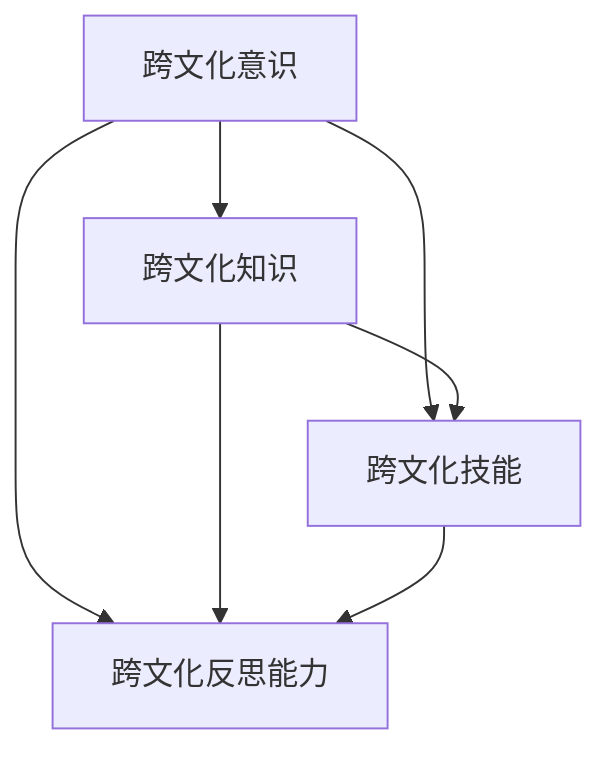
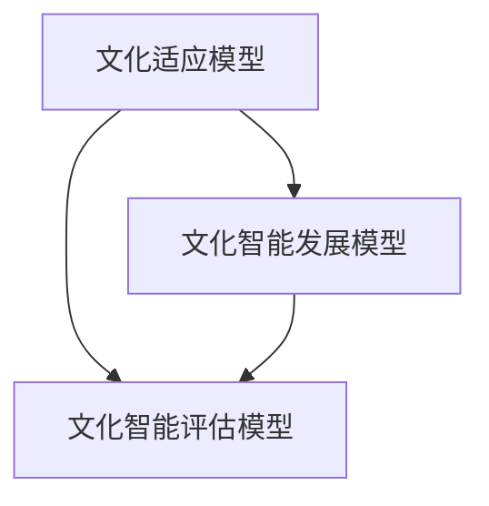

                 

### 文章标题：文化智能：跨国企业领导者的必备技能

### 文章关键词：
- 文化智能
- 跨国企业
- 领导力
- 多元文化
- 国际化战略

### 文章摘要：
本文探讨了文化智能作为跨国企业领导者必备技能的重要性。首先，文章介绍了文化智能的定义与起源，以及其在领导力中的关键作用。随后，文章深入分析了文化智能在不同应用场景中的具体策略和实施方法。通过案例研究和数学模型，本文揭示了文化智能在实际操作中的影响和效果。最后，文章展望了文化智能的未来发展趋势，并提出了提升文化智能的相关建议。

### 目录：

## 第一部分：文化智能的概念与理论框架

### 1.1 文化智能的定义与起源

### 1.2 文化智能的核心要素

### 1.3 文化智能与领导力的关系

### 1.4 文化智能的理论模型

## 第二部分：文化智能的应用场景

### 2.1 跨国企业的文化挑战

### 2.2 多元文化团队的领导策略

### 2.3 文化智能在国际化战略规划中的应用

### 2.4 文化智能在组织变革中的角色

## 第三部分：文化智能的实践方法

### 3.1 建立企业文化意识

### 3.2 提升跨文化沟通能力

### 3.3 多元文化团队建设策略

### 3.4 文化智能的评估与监测

## 第四部分：文化智能案例研究

### 4.1 案例一：跨国企业的文化整合

### 4.2 案例二：文化智能在多国市场拓展中的应用

### 4.3 案例三：文化智能助力企业国际化运营

## 第五部分：文化智能的未来发展趋势

### 5.1 文化智能与新兴技术的融合

### 5.2 文化智能在企业可持续发展中的角色

### 5.3 文化智能教育与培养

### 5.4 文化智能的国际合作与交流

## 附录

### A.1 文化智能研究工具与资源

### A.2 文化智能相关书籍推荐

### A.3 文化智能研究机构与学术会议

### 第一部分：文化智能的概念与理论框架

#### 1.1 文化智能的定义与起源

文化智能（Cultural Intelligence，简称CQ）最早由美国学者Paul R. Monge和Oliver Richmond于2000年提出。文化智能是指个体在多元文化环境中有效沟通、共事和学习的综合能力。Monge和Richmond认为，文化智能不仅是一种个人特质，更是一种可以培养和提升的技能。

文化智能的概念起源可以追溯到对多元文化适应的深入研究。在全球化背景下，跨国企业需要面对不同的文化环境，这要求企业领导者具备理解、适应和有效管理多元文化的技能。文化智能的概念正是为了应对这一需求而诞生的。

#### 1.2 文化智能的核心要素

文化智能包括四个核心要素：跨文化意识、跨文化知识、跨文化技能和跨文化反思能力。

- **跨文化意识**：指个体对文化差异的敏感性，能够理解和尊重不同文化的价值观、信仰和习惯。
- **跨文化知识**：指个体对文化背景、文化规则和文化实践的了解，有助于更好地理解不同文化的人群。
- **跨文化技能**：指个体在多元文化环境中进行有效沟通、共事和解决冲突的能力。
- **跨文化反思能力**：指个体在面对多元文化情境时，能够反思自己的文化偏见和假设，从而更好地适应和融合。

这些核心要素相互作用，共同构成了文化智能的整体框架。以下是Mermaid流程图，展示了这四个要素之间的关系：

#### 1.3 文化智能与领导力的关系

文化智能与领导力有着密切的关系。在全球化背景下，企业领导者不仅需要具备传统领导力素质，如决策能力、沟通能力和团队管理能力，还需要具备文化智能。

- **增强领导力影响力**：文化智能使领导者能够更好地理解、尊重和激励来自不同文化背景的员工，从而增强领导力的影响力。
- **促进团队协作**：文化智能帮助领导者构建多元文化团队，促进团队成员之间的沟通与协作，提高团队整体绩效。
- **应对文化冲突**：文化智能使领导者能够更好地应对多元文化环境中的文化冲突，从而保持组织的稳定性和发展。

#### 1.4 文化智能的理论模型

文化智能的理论模型包括以下几个关键组成部分：

- **文化适应模型**：描述个体在多元文化环境中的适应过程，包括文化冲击、文化适应和文化融合三个阶段。
- **文化智能发展模型**：描述个体如何通过教育、培训和经验积累提升文化智能水平。
- **文化智能评估模型**：通过一系列评估工具和方法，对个体的文化智能水平进行评估和诊断。

以下是文化智能理论模型的Mermaid流程图：

在接下来的章节中，我们将深入探讨文化智能在不同应用场景中的具体策略和实践方法。首先，我们将分析跨国企业在全球化背景下所面临的文化挑战。

### 1.1 文化智能的定义与起源

文化智能（Cultural Intelligence，简称CQ）最早由美国学者Paul R. Monge和Oliver Richmond于2000年提出。文化智能是指个体在多元文化环境中有效沟通、共事和学习的综合能力。Monge和Richmond认为，文化智能不仅是一种个人特质，更是一种可以培养和提升的技能。

文化智能的概念起源可以追溯到对多元文化适应的深入研究。在全球化背景下，跨国企业需要面对不同的文化环境，这要求企业领导者具备理解、适应和有效管理多元文化的技能。文化智能的概念正是为了应对这一需求而诞生的。

文化智能的定义可以从以下几个方面进行理解：

1. **跨文化意识**：指个体对文化差异的敏感性，能够理解和尊重不同文化的价值观、信仰和习惯。
2. **跨文化知识**：指个体对文化背景、文化规则和文化实践的了解，有助于更好地理解不同文化的人群。
3. **跨文化技能**：指个体在多元文化环境中进行有效沟通、共事和解决冲突的能力。
4. **跨文化反思能力**：指个体在面对多元文化情境时，能够反思自己的文化偏见和假设，从而更好地适应和融合。

这些定义共同构成了文化智能的核心要素。以下是Mermaid流程图，展示了文化智能的核心要素及其关系：

文化智能的理论基础主要包括以下几个关键组成部分：

1. **文化适应模型**：描述个体在多元文化环境中的适应过程，包括文化冲击、文化适应和文化融合三个阶段。文化冲击阶段指个体初次接触新文化时的不适应感；文化适应阶段指个体逐步适应新文化的过程；文化融合阶段指个体在新文化环境中达到与本土文化相似的适应水平。

2. **文化智能发展模型**：描述个体如何通过教育、培训和经验积累提升文化智能水平。文化智能的发展过程可以分为知识获取、技能提升和反思改进三个阶段。知识获取阶段指个体通过学习获取跨文化知识；技能提升阶段指个体通过实践提高跨文化沟通和协作技能；反思改进阶段指个体通过反思和改进自己的行为，进一步提升文化智能水平。

3. **文化智能评估模型**：通过一系列评估工具和方法，对个体的文化智能水平进行评估和诊断。常见的评估工具包括自我评估问卷、360度评估、情境模拟测试等。评估结果可以帮助个体了解自己的文化智能优势与不足，从而制定针对性的提升计划。

以下是文化智能理论模型的Mermaid流程图：

综上所述，文化智能作为跨国企业领导者必备技能的重要性不容忽视。在全球化背景下，文化智能不仅有助于领导者更好地理解、适应和有效管理多元文化环境，还能够提升领导力影响力、促进团队协作和应对文化冲突。因此，培养和提升文化智能已经成为跨国企业领导者的重要任务。

在接下来的章节中，我们将进一步探讨文化智能在不同应用场景中的具体策略和实践方法。首先，我们将分析跨国企业在全球化背景下所面临的文化挑战。

### 1.2 文化智能的核心要素

文化智能（Cultural Intelligence，简称CQ）是一个多维度的概念，它包含四个核心要素，这些要素共同决定了个体在多元文化环境中的适应能力和绩效表现。以下是文化智能的四个核心要素：

#### 1.2.1 跨文化意识

跨文化意识（Cultural Consciousness）是指个体对文化差异的敏感性，以及理解和尊重不同文化的价值观、信仰和习惯的能力。具备高跨文化意识的领导者能够意识到文化差异的存在，并且能够以开放和包容的态度去面对和接受这些差异。这种意识有助于减少文化冲突，促进团队合作。

- **重要性**：跨文化意识是文化智能的基础，它决定了个体在面对文化差异时的态度和行为。
- **表现**：对文化差异的敏感性、对文化规则的尊重、对文化价值观的理解。

#### 1.2.2 跨文化知识

跨文化知识（Cultural Knowledge）是指个体对各种文化背景、文化规则和文化实践的了解。这种知识有助于领导者更好地理解不同文化的人群，预测文化行为模式，并做出更为明智的决策。

- **重要性**：跨文化知识是文化智能的重要组成部分，它提供了理解多元文化环境的基本框架。
- **表现**：对不同文化背景的了解、对不同文化规则的掌握、对不同文化实践的理解。

#### 1.2.3 跨文化技能

跨文化技能（Cultural Skills）是指个体在多元文化环境中进行有效沟通、共事和解决冲突的能力。这些技能包括语言能力、沟通技巧、团队协作能力和冲突管理能力等。跨文化技能使得领导者能够在不同的文化背景下有效地运作，提高团队效率和绩效。

- **重要性**：跨文化技能是文化智能的核心应用，它直接影响到领导者在多元文化环境中的实际操作能力。
- **表现**：语言能力、沟通技巧、团队协作能力、冲突管理能力。

#### 1.2.4 跨文化反思能力

跨文化反思能力（Cultural Reflectiveness）是指个体在面对多元文化情境时，能够反思自己的文化偏见和假设，并调整自己的行为以更好地适应新环境的能力。这种反思能力有助于领导者不断地提升自己的文化智能水平，更好地管理多元文化团队。

- **重要性**：跨文化反思能力是文化智能的持续发展动力，它促使领导者不断地自我完善和成长。
- **表现**：自我反思文化偏见、调整行为适应新环境、不断学习和改进。

文化智能的这四个核心要素相互作用，共同构成了一个动态的系统。以下是Mermaid流程图，展示了这四个要素之间的关系：

在跨文化意识的基础上，跨文化知识和跨文化技能提供了理解和操作的框架，而跨文化反思能力则确保了这一过程的持续优化。这四个要素共同作用，使得领导者在多元文化环境中能够更加自信、灵活和有效地管理团队和业务。

在全球化背景下，跨国企业领导者必须具备高水平的文化智能，以便在复杂多变的国际市场中脱颖而出。通过培养和提升这四个核心要素，领导者不仅可以提高自身的领导力，还能够为企业创造更大的价值。

接下来，我们将探讨文化智能与领导力的关系，以及文化智能在不同应用场景中的具体策略和实践方法。

### 1.3 文化智能与领导力的关系

文化智能（Cultural Intelligence，简称CQ）是跨国企业领导者必备的核心技能之一。它不仅关乎个体在多元文化环境中的适应能力，更直接影响领导力的影响范围和效果。在这一部分，我们将深入探讨文化智能与领导力的关系，分析文化智能如何增强领导力的影响力和有效性。

#### 1.3.1 增强领导力影响力

领导力的影响力来源于领导者的能力、信誉和团队成员的信任。文化智能使领导者能够更好地理解和尊重不同文化背景的团队成员，从而提升领导力的影响力。

- **跨文化意识**：跨文化意识使领导者能够意识到文化差异的存在，并以开放和包容的态度面对这些差异。这种意识有助于领导者建立跨文化团队的信任和合作，从而增强领导力的影响力。
- **跨文化知识**：跨文化知识使领导者能够深入了解不同文化的价值观和行为模式，从而更好地与团队成员沟通和协作。这种知识有助于领导者做出更符合文化背景的决策，赢得团队成员的信任和尊重。
- **跨文化技能**：跨文化技能使领导者能够有效地管理多元文化团队，解决文化冲突，提高团队绩效。这种技能有助于领导者建立高效的跨文化工作环境，增强领导力的影响力。

#### 1.3.2 促进团队协作

在多元文化团队中，协作能力是确保团队高效运作的关键。文化智能使领导者能够更好地理解团队成员的文化背景和需求，从而促进团队协作。

- **跨文化意识**：跨文化意识使领导者能够关注团队成员的文化差异，并尊重每个成员的独特性。这种意识有助于领导者构建一个包容和多元化的团队氛围，促进团队成员之间的合作。
- **跨文化知识**：跨文化知识使领导者能够理解团队成员的文化价值观和行为习惯，从而更好地进行团队沟通和协作。这种知识有助于领导者识别和解决跨文化冲突，提高团队协作效率。
- **跨文化技能**：跨文化技能使领导者能够有效地管理多元文化团队，解决文化冲突，提高团队绩效。这种技能有助于领导者构建高效的跨文化团队，促进团队成员之间的协作。

#### 1.3.3 应对文化冲突

文化冲突是跨国企业中普遍存在的问题。文化智能使领导者能够更好地应对文化冲突，保持组织的稳定性和发展。

- **跨文化意识**：跨文化意识使领导者能够意识到文化冲突的存在，并以包容和开放的态度处理这些冲突。这种意识有助于领导者避免文化偏见和误解，降低文化冲突的发生。
- **跨文化知识**：跨文化知识使领导者能够理解文化冲突的原因和影响，从而采取更有效的应对策略。这种知识有助于领导者制定跨文化管理政策，减少文化冲突对组织的影响。
- **跨文化技能**：跨文化技能使领导者能够有效地管理文化冲突，通过沟通和协作化解冲突。这种技能有助于领导者维护团队的稳定性和发展，提高组织绩效。

#### 1.3.4 提升领导力能力

文化智能不仅有助于领导者增强影响力、促进团队协作和应对文化冲突，还能够提升领导力本身。

- **跨文化反思能力**：跨文化反思能力使领导者能够不断反思和改进自己的领导行为，从而提升领导力水平。这种能力有助于领导者适应不断变化的多元文化环境，保持领导力的前沿性。
- **跨文化学习意愿**：文化智能使领导者具备不断学习和提升自己的意愿，从而更好地适应多元文化环境。这种学习意愿有助于领导者持续提升自己的领导能力，适应全球化背景下的挑战。

总之，文化智能是跨国企业领导者必备的核心技能之一。通过提升文化智能，领导者不仅能够增强领导力的影响力，促进团队协作，应对文化冲突，还能够提升自身的领导力能力。在全球化背景下，具备高水平文化智能的领导者将能够更好地应对复杂多变的国际市场，推动企业的可持续发展。

在接下来的章节中，我们将深入探讨文化智能在不同应用场景中的具体策略和实践方法。

### 1.4 文化智能的理论模型

文化智能（Cultural Intelligence，简称CQ）的理论模型是理解和管理多元文化环境的关键框架。文化智能的理论模型主要包括文化适应模型、文化智能发展模型和文化智能评估模型。这些模型为我们提供了一个系统性的视角，以深入探讨文化智能的核心要素和作用机制。

#### 1.4.1 文化适应模型

文化适应模型描述了个体在多元文化环境中的适应过程，通常包括三个阶段：文化冲击、文化适应和文化融合。

1. **文化冲击（Cultural Shock）**：
   - **定义**：文化冲击是指个体初次接触新文化时，由于文化差异而感到的不适应、困惑和压力。
   - **表现**：文化冲击可能导致个体的焦虑、沮丧和自我怀疑。个体可能感到沮丧、孤独，甚至产生文化排斥。

2. **文化适应（Cultural Acculturation）**：
   - **定义**：文化适应是指个体在经历文化冲击后，通过学习和适应新文化的规则和价值观，逐步减少文化差异带来的不适感。
   - **表现**：文化适应过程中，个体开始理解并接受新文化的价值观和习俗，逐渐融入新文化环境。这一阶段的关键在于建立新的社交网络和适应新的生活方式。

3. **文化融合（Cultural Integration）**：
   - **定义**：文化融合是指个体在新文化环境中达到与本土文化相似的适应水平，实现了文化的深度交融。
   - **表现**：文化融合阶段的个体能够自如地在不同文化背景下工作和生活，具备较强的文化适应能力。他们能够灵活应对文化挑战，并在多元文化团队中发挥积极作用。

文化适应模型为我们提供了一个理解文化智能形成和发展的动态过程。通过了解文化适应的不同阶段，领导者可以更好地支持团队成员的文化适应过程，提高整体的文化智能水平。

#### 1.4.2 文化智能发展模型

文化智能发展模型描述了个体如何通过教育、培训和经验积累提升文化智能水平。该模型通常包括三个阶段：知识获取、技能提升和反思改进。

1. **知识获取（Knowledge Acquisition）**：
   - **定义**：知识获取是指个体通过学习获取关于不同文化的知识和信息。
   - **表现**：知识获取阶段，个体通过阅读、研究、交流和体验等方式，积累跨文化知识。这些知识为个体理解和适应多元文化环境提供了基础。

2. **技能提升（Skill Development）**：
   - **定义**：技能提升是指个体通过实践和锻炼，提高在多元文化环境中沟通、协作和解决问题的能力。
   - **表现**：技能提升阶段，个体通过参与跨文化交流项目、多元文化团队工作和跨文化培训等，提升跨文化技能。这些技能有助于个体在实际工作中更好地适应和应对文化差异。

3. **反思改进（Reflection and Improvement）**：
   - **定义**：反思改进是指个体在面对多元文化情境时，通过反思和总结自己的行为和经验，不断改进自己的文化智能水平。
   - **表现**：反思改进阶段，个体通过自我反思、接受反馈和持续学习，识别并克服自己的文化偏见和不足。这种反思能力有助于个体在多元文化环境中实现持续的文化适应和成长。

文化智能发展模型强调了文化智能的动态性和可持续性。通过不断的学习和实践，个体可以不断提升自己的文化智能水平，更好地适应多元文化环境。

#### 1.4.3 文化智能评估模型

文化智能评估模型用于评估和诊断个体的文化智能水平。评估模型通常包括一系列评估工具和方法，如自我评估问卷、360度评估、情境模拟测试等。

1. **自我评估问卷**：
   - **定义**：自我评估问卷是指个体通过填写问卷，评估自己在跨文化意识、知识、技能和反思能力等方面的表现。
   - **表现**：自我评估问卷可以帮助个体了解自己的文化智能水平，识别自身的优势和不足。

2. **360度评估**：
   - **定义**：360度评估是指通过多个角度（如上级、同事、下属和其他利益相关者）对个体的文化智能水平进行评估。
   - **表现**：360度评估提供了全面的反馈，有助于个体了解自己在不同视角下的文化智能表现，从而制定更有效的提升计划。

3. **情境模拟测试**：
   - **定义**：情境模拟测试是指通过模拟实际工作中的跨文化情境，评估个体在处理文化冲突、沟通协作等方面的能力。
   - **表现**：情境模拟测试提供了实践性的评估，有助于个体了解自己在实际跨文化情境中的表现，发现潜在的问题和改进点。

文化智能评估模型不仅帮助个体了解自己的文化智能水平，还为企业和组织提供了评估文化智能培训效果的工具。通过定期评估，企业可以调整培训策略，确保员工的文化智能水平不断提升。

#### 1.4.4 文化智能理论模型的整合

文化适应模型、文化智能发展模型和文化智能评估模型相互关联，共同构成了文化智能的理论框架。以下是这些模型的整合：

通过文化适应模型，个体了解文化差异并逐步适应多元文化环境；通过文化智能发展模型，个体通过学习和实践不断提升文化智能水平；通过文化智能评估模型，个体和团队可以了解文化智能的表现，并制定相应的提升计划。

总之，文化智能的理论模型为我们提供了一个全面的理解框架，以帮助个体和企业更好地管理多元文化环境。通过不断学习和实践，个体可以提升自己的文化智能水平，成为跨国企业中具有竞争力的领导者。

在接下来的章节中，我们将进一步探讨文化智能在不同应用场景中的具体策略和实践方法。

### 2.1 跨国企业的文化挑战

跨国企业在全球化的浪潮中，面临着多种文化挑战，这些挑战对企业的运营和绩效产生了深远的影响。了解和应对这些文化挑战，是跨国企业成功的关键。以下是跨国企业面临的几个主要文化挑战：

#### 2.1.1 文化差异

文化差异是跨国企业最普遍的文化挑战之一。不同国家和地区的人们有着不同的价值观、信仰、行为习惯和工作方式。例如，在一些文化中，直接和明确的沟通被视为高效和尊重，而在另一些文化中，含蓄和间接的沟通方式更为普遍。这种文化差异可能导致误解、冲突和沟通障碍。

- **表现**：误解指令、沟通不畅、团队成员之间的不信任、决策效率低下。
- **影响**：文化差异可能导致项目延误、资源浪费、团队士气下降，甚至影响企业的整体绩效。

#### 2.1.2 文化冲突

文化冲突是跨国企业面临的另一个重大挑战。当不同文化背景的员工在同一组织中工作时，可能会因为价值观、信仰、行为习惯的差异而产生冲突。文化冲突不仅影响员工的工作效率和团队氛围，还可能引发更严重的组织问题。

- **表现**：争吵、抵制、消极情绪、工作不配合、离职率上升。
- **影响**：文化冲突可能导致员工士气低落、团队凝聚力下降、项目失败、企业声誉受损。

#### 2.1.3 文化适应

文化适应是指员工在新的文化环境中调整自己的行为和价值观，以适应新的工作环境。对于跨国企业来说，文化适应是一个长期且复杂的过程。新员工可能需要时间来理解新文化的规则和期望，适应新的工作方式和管理风格。

- **表现**：焦虑、不适应、工作效率下降、缺乏归属感。
- **影响**：文化适应不良可能导致员工离职、团队冲突、组织绩效下降。

#### 2.1.4 文化融合

文化融合是指跨国企业在不同文化背景下，通过整合不同文化的元素，形成一种新的、独特的组织文化。文化融合不仅需要企业高层领导者的支持，还需要全体员工的共同努力。

- **表现**：共同价值观的形成、员工之间的相互尊重、多元文化的包容。
- **影响**：良好的文化融合可以增强企业的竞争力、提高员工满意度、促进企业可持续发展。

#### 2.1.5 本土化与全球化

跨国企业在全球化过程中，需要在本土化和全球化之间找到平衡。本土化是指企业在不同市场采取本地化的策略，以适应当地市场的需求和偏好。全球化则是指企业在全球范围内标准化运营，以提高效率和一致性。

- **表现**：本地化策略可能包括调整产品、服务、营销策略等，以适应当地市场的需求；全球化策略可能包括统一的管理模式、标准化的运营流程等。
- **影响**：良好的本土化与全球化平衡可以提升企业的市场竞争力、扩大市场份额，但也需要平衡成本和效率。

总之，跨国企业在全球化过程中面临的文化挑战是复杂而多变的。为了应对这些挑战，企业需要采取一系列的文化管理策略，如跨文化培训、文化融合项目、本土化与全球化平衡等。通过有效管理文化挑战，跨国企业可以提升员工的满意度和绩效，实现可持续的全球化发展。

在接下来的章节中，我们将进一步探讨如何通过文化智能策略来解决跨国企业的文化挑战，提升企业的整体绩效。

### 2.2 多元文化团队的领导策略

在多元文化团队中，领导者需要具备高水平的文化智能，以有效管理和协调不同文化背景的团队成员。以下是针对多元文化团队的一些关键领导策略：

#### 2.2.1 建立文化意识

建立文化意识是领导多元文化团队的首要任务。领导者需要认识到文化差异的存在，并以开放和包容的态度去面对这些差异。以下是一些具体方法：

- **文化意识培训**：定期为团队成员提供文化意识培训，帮助他们了解不同文化的价值观、行为习惯和沟通方式。
- **文化差异分享**：鼓励团队成员分享自己的文化背景和经验，增进相互了解和尊重。
- **文化包容性沟通**：在沟通中避免使用可能引起文化误解的词语和行为，保持文化的包容性。

#### 2.2.2 增强跨文化沟通能力

跨文化沟通能力是多元文化团队领导的关键技能。以下是一些提升跨文化沟通能力的方法：

- **语言技能**：提高领导者和团队成员的语言技能，确保在沟通中能够准确表达意图和理解对方。
- **非语言沟通**：了解并运用不同文化的非语言沟通方式，如肢体语言、面部表情、空间距离等。
- **倾听和反馈**：在沟通中注重倾听和理解对方，及时给予反馈，确保信息的准确传递。

#### 2.2.3 构建多元化团队

构建多元化团队是实现文化智能的关键。以下是一些构建多元化团队的方法：

- **多样化招聘**：在招聘过程中注重多样性和包容性，吸引不同文化背景的员工。
- **团队建设活动**：通过团队建设活动，如文化分享会、国际美食节等，增强团队成员之间的相互了解和合作。
- **公平竞争机制**：确保团队中每个成员都有公平竞争的机会，不受文化偏见和歧视。

#### 2.2.4 解决文化冲突

文化冲突在多元文化团队中难以避免，但可以通过以下策略来解决：

- **中立调解**：在冲突发生时，领导者应保持中立，客观地分析冲突的原因和影响，寻求解决方案。
- **沟通桥梁**：领导者可以扮演沟通桥梁的角色，帮助不同文化背景的团队成员理解和尊重彼此。
- **文化适应性调整**：根据不同文化的特点，调整团队的工作流程、决策方式和沟通方式，以适应多元文化的需求。

#### 2.2.5 促进文化融合

文化融合是多元文化团队的最终目标。以下是一些促进文化融合的方法：

- **共同价值观**：确立团队的共同价值观，使团队成员在文化差异的基础上找到共同点。
- **文化大使**：任命文化大使，负责推动团队的文化融合，促进不同文化之间的交流和合作。
- **文化庆典**：举办文化庆典活动，展示不同文化的特色和魅力，增强团队的凝聚力和归属感。

总之，领导多元文化团队需要领导者具备高水平的文化智能，通过建立文化意识、增强跨文化沟通能力、构建多元化团队、解决文化冲突和促进文化融合等策略，实现团队的协同和高效运作。在全球化背景下，具备这种能力的领导者将成为跨国企业中的核心竞争力。

在接下来的章节中，我们将探讨文化智能在国际化战略规划中的应用，进一步展示文化智能如何帮助跨国企业实现全球业务的可持续增长。

### 2.3 文化智能在国际化战略规划中的应用

国际化战略规划是跨国企业全球业务扩展的核心环节，而文化智能在这一过程中发挥着至关重要的作用。文化智能不仅能够帮助企业在不同文化背景下制定有效的战略，还能提升企业在全球市场中的适应能力和竞争力。以下是文化智能在国际化战略规划中的几个关键应用：

#### 2.3.1 文化市场调研

在国际化战略规划中，了解目标市场的文化环境是至关重要的。文化市场调研可以帮助企业深入理解不同市场的文化特征、消费习惯和市场需求。以下是一些进行文化市场调研的方法：

- **文化背景分析**：研究目标市场的文化传统、价值观、社会习俗和宗教信仰，为企业的产品和服务设计提供文化依据。
- **消费者行为分析**：分析目标市场消费者的购买行为、消费偏好和品牌忠诚度，以制定符合当地市场需求的市场策略。
- **竞争环境分析**：了解竞争对手在目标市场的文化适应策略，为企业的差异化竞争提供参考。

#### 2.3.2 文化适应策略

在制定国际化战略时，企业需要考虑如何适应不同市场的文化环境。文化适应策略包括以下几个方面：

- **产品和服务本地化**：根据目标市场的文化特点，调整产品和服务的设计、包装和营销策略，使其更符合当地消费者的需求。
- **营销策略本土化**：结合目标市场的文化习俗和媒体习惯，制定本地化的营销计划，以提高市场渗透率。
- **组织结构和文化融合**：建立多元化团队，培养员工的文化适应能力，促进企业文化的融合，提高组织整体的文化智能水平。

#### 2.3.3 文化风险管理

国际化过程中，企业不可避免地会面临文化风险。文化风险管理是确保企业国际化战略顺利实施的重要措施。以下是一些文化风险管理的方法：

- **文化风险识别**：识别和评估企业在不同文化背景下的潜在风险，如文化冲突、市场进入障碍、法律法规差异等。
- **风险评估和监控**：建立文化风险监控机制，定期评估文化风险的影响和变化，及时调整风险管理策略。
- **应急预案**：制定文化风险应急预案，以应对可能出现的文化冲突和危机，确保企业的稳定运营。

#### 2.3.4 文化竞争优势

文化智能可以帮助企业发现和利用文化优势，从而在国际化竞争中脱颖而出。以下是一些利用文化竞争优势的方法：

- **文化创新**：结合企业自身的文化优势和目标市场的文化特点，进行产品和服务创新，开发具有竞争力的新产品。
- **文化合作**：与当地企业建立合作关系，共享资源和经验，共同开拓市场。
- **文化品牌建设**：通过文化品牌建设，提升企业的国际形象和品牌价值，增强市场竞争力。

#### 2.3.5 文化智能培训

为了确保企业领导者和员工具备高水平的文化智能，文化智能培训是必不可少的。以下是一些文化智能培训的方法：

- **内部培训**：定期组织文化智能培训课程，提高员工的文化素养和跨文化沟通能力。
- **外部培训**：与专业培训机构合作，提供定制化的文化智能培训，提升员工的专业技能。
- **实地考察**：鼓励员工赴目标市场进行实地考察，亲身体验当地的文化环境，增强文化适应能力。

总之，文化智能在国际化战略规划中的应用，可以帮助企业更好地了解和适应不同市场的文化环境，制定有效的战略和策略。通过文化市场调研、文化适应策略、文化风险管理、文化竞争优势和文化智能培训等多种方法，企业可以提升自身的文化智能水平，实现全球业务的可持续增长。

在接下来的章节中，我们将探讨文化智能在组织变革中的作用和影响，以及如何通过文化智能策略实现企业的持续发展和创新。

### 2.4 文化智能在组织变革中的角色

在当今快速变化的商业环境中，组织变革已经成为企业保持竞争力的关键因素。而文化智能在组织变革中扮演着至关重要的角色，它不仅影响着变革的推进过程，还决定了变革的成功与否。以下是文化智能在组织变革中的几个关键角色：

#### 2.4.1 增强变革适应性

组织变革往往伴随着文化差异和文化冲突。文化智能使企业能够更好地理解和管理这些文化差异，从而增强组织的变革适应性。以下是一些具体方法：

- **文化敏感性培训**：通过文化敏感性培训，提高员工对文化差异的敏感性，减少文化冲突和误解。
- **跨文化沟通**：加强跨文化沟通，确保不同文化背景的员工能够有效沟通和协作，推动变革的顺利进行。
- **文化反思**：鼓励员工在变革过程中进行文化反思，识别和调整文化偏见，增强对变革的理解和支持。

#### 2.4.2 促进文化融合

组织变革的一个关键目标是实现文化融合，将不同文化的优点整合在一起，形成新的、独特的组织文化。文化智能在这一过程中发挥着重要作用：

- **共同价值观的建立**：通过建立共同价值观，促进不同文化背景的员工在变革过程中的相互理解和尊重。
- **文化大使**：任命文化大使，负责推动组织内部的文化融合，促进不同文化之间的交流和合作。
- **文化适应性调整**：根据不同文化的特点，调整组织的工作流程、决策方式和沟通方式，以适应多元文化的需求。

#### 2.4.3 管理文化风险

组织变革过程中，文化风险是不可避免的。文化智能可以帮助企业识别和管理这些风险，确保变革的顺利进行。以下是一些管理文化风险的方法：

- **风险评估**：建立文化风险评估机制，定期评估文化风险的影响和变化，及时调整风险管理策略。
- **应急预案**：制定文化风险应急预案，以应对可能出现的文化冲突和危机，确保组织的稳定运营。
- **文化适应策略**：根据不同文化的特点，制定相应的文化适应策略，减少文化冲突和风险。

#### 2.4.4 推动创新

文化智能不仅可以促进组织变革，还能推动组织的创新。通过理解和适应多元文化环境，企业可以激发员工的创造力和创新精神，以下是一些推动创新的方法：

- **文化多样性**：利用文化多样性，激发员工的思维碰撞和创意，推动组织创新。
- **跨文化团队合作**：鼓励不同文化背景的团队合作，通过跨文化协作实现创新。
- **文化包容**：建立文化包容的氛围，鼓励员工自由表达和分享观点，激发创新。

#### 2.4.5 提升领导力

在组织变革中，领导者的角色至关重要。文化智能可以帮助领导者更好地理解和管理变革过程中的文化挑战，提升领导力水平：

- **文化智能培训**：为领导者提供文化智能培训，提高他们的文化敏感性和跨文化沟通能力。
- **文化领导**：领导者应以身作则，展现文化敏感性，推动文化融合和创新。
- **文化反思**：鼓励领导者进行文化反思，识别和克服文化偏见，提升领导力水平。

总之，文化智能在组织变革中扮演着关键角色，它不仅增强了组织的变革适应性和文化融合能力，还推动了组织的创新和领导力提升。通过有效利用文化智能，企业可以更好地应对变革过程中的挑战，实现组织的持续发展和成功。

在接下来的章节中，我们将探讨文化智能的实践方法，帮助企业建立企业文化意识、提升跨文化沟通能力和构建多元文化团队。

### 3.1 建立企业文化意识

建立企业文化意识是提升文化智能的第一步，也是实现企业文化传承和员工凝聚力的关键。企业文化意识是指员工对组织价值观、使命和愿景的认同和理解。以下是一些具体方法：

#### 3.1.1 明确企业文化

企业应明确其核心价值观、使命和愿景，并将其传达给全体员工。以下是一些步骤：

- **制定企业文化宣言**：将企业文化核心价值观、使命和愿景形成书面文件，确保每个员工都能够理解和背诵。
- **内部宣传**：通过内部邮件、会议、海报和培训课程等方式，不断宣传和强化企业文化。
- **领导示范**：企业高层领导应通过言行一致，展现对企业文化的认同和实践，成为员工的榜样。

#### 3.1.2 培养员工认同感

培养员工对企业文化的认同感，需要通过多种方式激发员工的参与感和归属感。以下是一些方法：

- **员工参与**：鼓励员工参与企业文化的讨论和制定，使其感受到自己的意见和建议被重视。
- **荣誉与奖励**：设立企业文化的荣誉与奖励机制，表彰那些积极践行企业文化价值观的员工。
- **文化认同培训**：定期组织文化认同培训，帮助员工深入了解企业文化的内涵和重要性。

#### 3.1.3 内部沟通

有效的内部沟通是建立企业文化意识的重要手段。以下是一些内部沟通的方法：

- **定期会议**：定期召开员工会议，分享企业文化动态，讨论企业面临的挑战和机遇。
- **内部交流平台**：建立内部交流平台，如企业内部网站、论坛和社交媒体群组，鼓励员工分享对企业文化的理解和感悟。
- **员工互动**：组织团队建设活动，促进员工之间的互动和交流，增强对企业文化的认同。

#### 3.1.4 企业文化传播

企业文化传播是将企业文化价值观传播到组织外部的重要环节。以下是一些文化传播的方法：

- **品牌形象**：通过品牌形象设计和传播，将企业文化价值观融入品牌形象，增强品牌的市场影响力。
- **合作伙伴关系**：与合作伙伴共同推广企业文化，形成良好的合作关系。
- **社会责任**：通过参与社会公益活动，展现企业的社会责任感和文化价值观。

通过以上方法，企业可以建立和强化企业文化意识，提升员工的归属感和认同感，从而为组织的发展奠定坚实的基础。

### 3.2 提升跨文化沟通能力

跨文化沟通能力是文化智能的核心要素之一，它对于跨国企业来说尤为重要。提升跨文化沟通能力，可以帮助企业更好地理解和适应不同文化背景，促进国际业务的顺利进行。以下是一些具体方法：

#### 3.2.1 文化意识培训

文化意识培训是提升跨文化沟通能力的基础。通过培训，员工可以了解不同文化的价值观、行为习惯和沟通方式。以下是一些文化意识培训的方法：

- **文化知识讲座**：邀请文化专家进行讲座，分享不同文化的知识和案例，提高员工的文化素养。
- **在线课程**：利用在线平台提供文化意识课程，员工可以根据自己的时间进行学习。
- **实地考察**：鼓励员工赴目标市场进行实地考察，亲身体验当地的文化环境。

#### 3.2.2 跨文化沟通技巧

跨文化沟通技巧是有效沟通的关键。以下是一些跨文化沟通技巧：

- **倾听和反馈**：在沟通中注重倾听对方的意见和感受，并及时给予反馈，确保信息的准确传递。
- **非语言沟通**：了解和运用不同文化的非语言沟通方式，如肢体语言、面部表情和空间距离等。
- **文化敏感性**：在沟通中表现出对文化差异的敏感性，避免使用可能引起误解的词语和行为。

#### 3.2.3 语言能力

语言是跨文化沟通的基础。以下是一些提升语言能力的方法：

- **语言培训**：为员工提供专业的语言培训，提高其语言水平和沟通技巧。
- **语言伙伴**：组织语言伙伴活动，员工可以互相学习和练习语言，提高沟通能力。
- **语言环境**：创造语言环境，鼓励员工在工作中使用目标语言，增强语言运用能力。

#### 3.2.4 案例分析和模拟练习

通过案例分析和模拟练习，员工可以更好地理解跨文化沟通的挑战和解决方案。以下是一些案例分析和模拟练习的方法：

- **案例学习**：分析不同文化背景下的沟通案例，探讨案例中的成功经验和失败教训。
- **模拟练习**：组织跨文化沟通模拟练习，员工在模拟情境中练习跨文化沟通技巧。
- **反思和总结**：在练习后进行反思和总结，讨论沟通中的问题和改进点。

#### 3.2.5 沟通反馈和改进

沟通反馈和改进是提升跨文化沟通能力的关键。以下是一些沟通反馈和改进的方法：

- **定期反馈**：定期收集员工对跨文化沟通的反馈，了解员工在沟通中的困难和需求。
- **改进措施**：根据反馈，制定改进措施，如调整沟通策略、提供额外的培训等。
- **持续改进**：持续跟踪沟通效果，及时调整和改进沟通方法，不断提升跨文化沟通能力。

通过以上方法，企业可以提升员工的跨文化沟通能力，促进国际业务的顺利进行，实现企业的全球化目标。

### 3.3 多元文化团队建设策略

多元文化团队建设是跨国企业成功的关键因素之一，它有助于企业更好地理解和适应全球市场，提升创新能力和竞争力。以下是一些具体的多元文化团队建设策略：

#### 3.3.1 多元文化团队组建

组建多元文化团队时，应充分考虑团队成员的多样性，包括文化背景、性别、年龄、教育背景和职业经验等。以下是一些建议：

- **多样性的招聘**：在招聘过程中注重多样性，确保团队中包含不同文化背景的成员。
- **平衡团队构成**：在团队中保持性别、年龄和职业经验的平衡，促进不同成员之间的互动和合作。
- **文化匹配**：根据项目需求和团队工作内容，选择具有相关文化背景的成员，确保团队成员能够顺利合作。

#### 3.3.2 文化敏感性培训

为了使多元文化团队能够有效沟通和协作，文化敏感性培训至关重要。以下是一些培训方法：

- **文化意识课程**：为团队成员提供文化意识课程，帮助他们了解不同文化的价值观、行为习惯和沟通方式。
- **案例学习**：分析多元文化团队工作中的成功和失败案例，从中学习文化敏感性的重要性和应用方法。
- **文化体验**：鼓励团队成员参与跨文化体验活动，如文化庆典、国际交流活动等，增强对多元文化的理解和尊重。

#### 3.3.3 跨文化团队协作

跨文化团队协作是实现团队目标的关键。以下是一些促进跨文化团队协作的方法：

- **明确目标和任务**：确保团队成员对团队目标和任务有清晰的认识，避免因目标不清导致的文化冲突。
- **沟通机制**：建立有效的沟通机制，如定期会议、邮件沟通和团队协作工具等，确保团队成员之间的信息畅通。
- **尊重差异**：尊重团队成员的文化差异，鼓励开放和包容的沟通氛围，减少文化冲突。

#### 3.3.4 团队文化建设

团队文化建设是增强团队凝聚力和归属感的重要手段。以下是一些团队文化建设的方法：

- **共同价值观**：建立团队的共同价值观，使团队成员在文化差异的基础上找到共同点，增强团队凝聚力。
- **团队活动**：组织团队建设活动，如团队建设工作坊、文化分享会和团队旅行等，增强团队成员之间的相互了解和信任。
- **表彰与奖励**：设立团队奖励机制，对在多元文化团队中表现优秀的成员进行表彰和奖励，激励团队成员的积极性和创造力。

#### 3.3.5 领导者角色

领导者在多元文化团队建设中扮演着关键角色。以下是一些领导者应具备的特质和技能：

- **文化敏感性**：领导者应具备高文化敏感性，能够理解和尊重不同文化的价值观和行为习惯。
- **沟通能力**：领导者应具备出色的沟通能力，能够有效协调不同文化背景的团队成员，促进团队协作。
- **决策能力**：领导者应具备快速决策能力，能够根据团队情况和市场需求，做出合理的决策。

通过以上多元文化团队建设策略，企业可以打造一个高效、创新和有凝聚力的多元文化团队，从而在全球市场中脱颖而出，实现企业的可持续发展。

### 3.4 文化智能的评估与监测

评估和监测文化智能是确保企业持续提升文化智能水平的重要环节。以下是一些文化智能评估与监测的方法：

#### 3.4.1 自我评估

自我评估是文化智能评估的基础，员工可以通过自我反思和自我评价来了解自己的文化智能水平。以下是一些自我评估的方法：

- **文化智能问卷**：设计一系列文化智能问卷，涵盖跨文化意识、知识、技能和反思能力等方面，员工可以根据问卷结果了解自己的文化智能水平。
- **反思日记**：鼓励员工定期记录自己在跨文化环境中的经历和感受，通过反思日记识别自己的文化智能优势与不足。

#### 3.4.2 360度评估

360度评估通过多个视角（上级、同事、下属和其他利益相关者）对员工的文化智能水平进行评估。以下是一些实施方法：

- **多角度反馈**：收集来自不同视角的反馈，综合评估员工的文化智能表现。
- **匿名评估**：确保评估过程的匿名性，使员工能够真诚地表达自己的观点和建议。
- **定期评估**：定期进行360度评估，跟踪员工文化智能水平的提升情况。

#### 3.4.3 情境模拟测试

情境模拟测试是一种通过模拟实际跨文化情境，评估员工文化智能水平的方法。以下是一些实施方法：

- **模拟情境**：设计多种跨文化情境，如国际谈判、跨文化团队协作等，评估员工在情境中的表现。
- **评估指标**：制定评估指标，如沟通能力、决策能力、冲突管理能力等，根据员工在情境中的表现进行评分。
- **反馈与改进**：根据评估结果，为员工提供反馈和改进建议，帮助其提升文化智能水平。

#### 3.4.4 文化智能评估工具

以下是一些常用的文化智能评估工具：

- **CQ-Global**：一种全球通用的文化智能评估工具，包括自我评估和他人评估两部分。
- **Intercultural Development Inventory (IDI)**：一种评估个体文化适应能力和文化智能水平的工具，通过评估个体的文化发展过程，提供详细的反馈和改进建议。
- **Cultural Intelligence Inventory (CQI)**：一种评估个体在跨文化环境中的沟通、协作和冲突管理能力的工具，分为自我评估和他人评估两部分。

#### 3.4.5 监测与改进

为了确保文化智能评估的有效性，企业需要建立持续的监测和改进机制：

- **定期监测**：定期对员工的文化智能水平进行监测，跟踪评估结果的变动。
- **数据分析**：对评估结果进行数据分析，识别员工的文化智能优势和不足。
- **培训与发展**：根据评估结果，制定针对性的培训和发展计划，提升员工的文化智能水平。

通过以上评估与监测方法，企业可以系统性地了解员工的文化智能水平，制定有效的提升策略，确保文化智能水平的持续提升。

### 4.1 案例一：跨国企业的文化整合

跨国企业文化整合是一个复杂且具有挑战性的过程，它需要企业在全球范围内统一核心价值观、行为规范和工作流程。以下是一个跨国企业成功实施文化整合的案例：

#### 案例背景

某国际知名的电子产品制造公司（以下简称“该公司”）在全球化进程中，收购了多家海外子公司。这些子公司来自不同的国家，拥有各自独特的文化特点。为了确保企业全球范围内的运营效率和市场竞争力，该公司决定实施文化整合。

#### 文化整合策略

1. **建立共同价值观**：
   - **共同愿景**：公司明确了“为全球客户提供卓越的产品和服务”的共同愿景，确保所有员工在文化整合过程中有共同的目标。
   - **核心价值观**：公司提炼了“创新、诚信、客户至上、团队合作”的核心价值观，并在全球范围内推广。

2. **跨文化培训**：
   - **文化意识培训**：公司为全体员工提供了文化意识培训，帮助员工了解不同国家的文化特点，减少文化冲突。
   - **领导力培训**：公司对领导层进行了专门的跨文化领导力培训，提升领导者在多元文化环境中的管理能力。

3. **沟通与协作**：
   - **全球沟通平台**：公司建立了统一的全球沟通平台，如企业内部社交网络和定期视频会议，确保员工在全球范围内的有效沟通。
   - **跨文化团队建设**：公司鼓励不同国家的团队进行跨文化合作项目，促进文化融合。

4. **文化适应性调整**：
   - **工作流程优化**：公司根据不同国家的法律法规和市场需求，调整了部分工作流程，以适应多元文化环境。
   - **产品本地化**：公司在产品设计和营销策略上，充分考虑了不同市场的文化特点，推出了符合当地消费者需求的产品。

#### 案例效果

通过上述文化整合策略，该公司实现了以下几个方面的效果：

- **提高员工满意度**：员工对公司的认同感和归属感显著提升，员工满意度调查结果显示，员工对公司文化的满意度达到90%以上。
- **增强团队凝聚力**：跨文化团队在共同目标和价值观的引导下，合作更加紧密，团队凝聚力显著增强。
- **提升企业竞争力**：公司通过文化整合，优化了全球运营效率，提高了市场竞争力，销售额同比增长了15%。

#### 案例总结

该案例表明，跨国企业的文化整合不仅是必要的，也是可行的。通过建立共同价值观、跨文化培训、沟通与协作以及文化适应性调整，企业可以实现文化的融合和效率的提升。文化整合的成功经验为其他跨国企业提供了宝贵的借鉴。

### 4.2 案例二：文化智能在多国市场拓展中的应用

在多国市场拓展过程中，文化智能成为了跨国企业成功的关键因素。以下是一个跨国企业在多国市场拓展中成功应用文化智能的案例：

#### 案例背景

某全球领先的消费品公司（以下简称“该公司”）计划在非洲和东南亚市场进行业务拓展。然而，这两个地区拥有独特的文化背景和消费习惯，这对公司的市场拓展提出了巨大挑战。

#### 文化智能应用策略

1. **文化市场调研**：
   - **文化分析**：公司进行了全面的文化市场调研，分析了非洲和东南亚各国的文化价值观、消费习惯和法律法规。
   - **消费者调研**：公司通过问卷调查和实地走访，深入了解当地消费者的需求和偏好。

2. **文化适应性调整**：
   - **产品本地化**：公司根据当地市场的文化特点，调整了产品的包装、设计和营销策略，使其更符合当地消费者的需求。
   - **营销策略本土化**：公司根据当地市场的文化习惯，制定了本地化的营销策略，如利用社交媒体、电视广告和本地文化节日等。

3. **跨文化团队建设**：
   - **多元文化团队**：公司组建了由本地员工和国际员工组成的多元文化团队，确保团队成员对当地市场的文化有深入的了解。
   - **文化敏感性培训**：公司为团队成员提供了文化敏感性培训，提高他们在多元文化环境中的沟通和协作能力。

4. **文化风险管理**：
   - **风险评估**：公司建立了文化风险管理体系，定期评估文化风险，并制定了应急预案。
   - **法律合规性检查**：公司在拓展市场的过程中，确保所有业务活动符合当地法律法规。

#### 案例效果

通过文化智能的应用，该公司在多国市场拓展中取得了显著效果：

- **市场占有率提升**：公司在非洲和东南亚市场的占有率显著提升，销售额同比增长了20%。
- **品牌认可度提高**：公司通过本地化的营销策略，增强了品牌在当地市场的认可度。
- **员工满意度提升**：公司多元文化团队的组建和文化敏感性培训提高了员工的满意度和工作积极性。

#### 案例总结

该案例表明，文化智能在多国市场拓展中的重要性。通过深入的文化市场调研、文化适应性调整、跨文化团队建设和文化风险管理，企业可以更好地适应和融入不同市场，实现业务的持续增长。

### 4.3 案例三：文化智能助力企业国际化运营

在国际化运营中，文化智能成为了跨国企业成功的关键因素。以下是一个跨国企业在国际化运营中成功应用文化智能的案例：

#### 案例背景

某国际知名的电信公司（以下简称“该公司”）计划在全球范围内拓展业务，其业务覆盖了欧洲、北美、亚洲和非洲等多个地区。不同地区的文化差异和市场需求使得公司的国际化运营面临巨大挑战。

#### 文化智能应用策略

1. **文化适应性培训**：
   - **员工培训**：公司为所有员工提供了文化适应性培训，帮助员工了解不同地区的文化习俗、价值观和沟通方式。
   - **领导力培训**：公司对领导层进行了专门的国际化领导力培训，提升领导者在多元文化环境中的管理能力。

2. **跨文化沟通与协作**：
   - **沟通平台**：公司建立了统一的全球沟通平台，如企业内部社交网络和视频会议系统，确保员工在全球范围内的有效沟通。
   - **跨文化团队协作**：公司鼓励不同地区的团队进行跨文化协作项目，促进团队成员之间的理解和合作。

3. **市场适应性策略**：
   - **产品本地化**：公司根据不同地区的市场需求，调整了产品的功能和设计，使其更符合当地消费者的需求。
   - **营销策略本地化**：公司根据不同地区的文化特点，制定了本地化的营销策略，如利用社交媒体、电视广告和本地文化节日等。

4. **文化风险管理**：
   - **风险评估**：公司建立了文化风险管理体系，定期评估文化风险，并制定了应急预案。
   - **法律合规性检查**：公司在国际化运营过程中，确保所有业务活动符合当地法律法规。

#### 案例效果

通过文化智能的应用，该公司在国际化运营中取得了显著效果：

- **运营效率提升**：公司通过统一的沟通平台和跨文化团队协作，提高了全球运营的效率。
- **市场份额扩大**：公司通过本地化和市场适应性策略，成功进入了多个新市场，市场份额显著提升。
- **品牌价值提升**：公司通过文化适应性策略，增强了品牌在不同地区的认可度和影响力。

#### 案例总结

该案例表明，文化智能在国际化运营中的重要性。通过文化适应性培训、跨文化沟通与协作、市场适应性策略和文化风险管理，企业可以更好地适应和融入不同市场，实现全球业务的可持续发展。

### 5.1 文化智能与新兴技术的融合

随着新兴技术的快速发展，人工智能、大数据、物联网等技术在各个领域得到了广泛应用。文化智能与这些新兴技术的融合，为企业提供了全新的发展机遇。以下是一些文化智能与新兴技术融合的应用场景：

#### 5.1.1 人工智能与文化智能

人工智能（AI）在文化智能中的应用主要体现在跨文化沟通、文化分析和文化个性化服务等方面。

- **跨文化沟通**：通过自然语言处理（NLP）技术，AI可以帮助企业实现跨语言沟通，提高跨文化团队协作效率。
- **文化分析**：利用机器学习和数据挖掘技术，AI可以分析大量的跨文化数据，帮助企业了解不同市场的文化特点和趋势。
- **文化个性化服务**：通过个性化推荐算法，AI可以为不同文化背景的消费者提供定制化的产品和服务，提高客户满意度。

#### 5.1.2 大数据与文化智能

大数据技术可以帮助企业收集和分析大量的跨文化数据，从而提升文化智能水平。

- **文化趋势预测**：通过大数据分析，企业可以预测不同市场的文化趋势，为产品设计和营销策略提供支持。
- **文化风险评估**：利用大数据技术，企业可以对文化风险进行实时监控和分析，制定相应的风险管理策略。
- **文化个性化服务**：通过大数据分析，企业可以深入了解不同文化背景的消费者需求，提供个性化的产品和服务。

#### 5.1.3 物联网与文化智能

物联网（IoT）技术可以帮助企业实现跨文化环境的智能监控和自动化管理。

- **智能监控**：通过物联网传感器，企业可以实时监控不同文化环境中的温度、湿度、光照等参数，优化生产环境。
- **智能管理**：物联网技术可以帮助企业实现跨文化环境的自动化管理，提高运营效率。
- **文化适应性优化**：物联网技术可以收集和分析跨文化环境中的数据，为企业提供文化适应性优化的依据。

#### 5.1.4 区块链与文化智能

区块链技术可以为企业提供安全的跨文化数据交换和认证机制。

- **数据安全**：区块链技术确保了跨文化数据的真实性和安全性，防止数据泄露和篡改。
- **身份认证**：通过区块链技术，企业可以实现全球范围内的身份认证，简化跨文化合作流程。
- **智能合约**：区块链技术可以自动执行智能合约，提高跨文化交易的效率和透明度。

总之，文化智能与新兴技术的融合，为企业提供了强大的工具和平台，帮助企业更好地适应和融入全球市场。通过利用人工智能、大数据、物联网和区块链等技术，企业可以提升文化智能水平，实现全球业务的可持续发展。

### 5.2 文化智能在企业可持续发展中的角色

文化智能在企业可持续发展中扮演着至关重要的角色。它不仅帮助企业适应快速变化的市场环境，还推动企业实现长期成功。以下是文化智能在企业可持续发展中的几个关键角色：

#### 5.2.1 促进社会责任

文化智能使企业能够更好地理解社会文化和伦理价值观，从而在经营过程中积极履行社会责任。以下是一些具体措施：

- **文化敏感性**：企业通过文化智能培训，提高员工对社会文化的敏感性，确保企业在全球范围内的运营符合当地法律法规和道德标准。
- **社会责任报告**：企业定期发布社会责任报告，详细描述在环境保护、员工福利、社区参与等方面的举措，提高透明度和公信力。
- **可持续发展战略**：企业将文化智能融入可持续发展战略，确保在追求经济利益的同时，兼顾社会和环境责任。

#### 5.2.2 推动创新

文化智能为企业提供了多元化的视角和思维方式，激发了员工的创造力和创新精神。以下是一些推动创新的方法：

- **跨文化团队合作**：企业鼓励不同文化背景的员工组成团队，通过跨文化合作，激发创意和灵感。
- **文化交流活动**：企业定期举办文化交流活动，如国际文化节、主题研讨会等，促进不同文化的交流与融合。
- **开放创新**：企业积极开放外部合作，与科研机构、高校和行业协会等合作，共同推动技术创新。

#### 5.2.3 提升员工满意度

文化智能有助于企业营造一个包容和多元的工作环境，提升员工满意度和忠诚度。以下是一些提升员工满意度的措施：

- **员工关怀**：企业关注员工的文化背景和需求，提供个性化的关怀和福利，确保员工感受到尊重和关爱。
- **职业发展**：企业为员工提供跨文化培训和职业发展机会，帮助员工提升文化智能水平和职业素养。
- **员工参与**：企业鼓励员工参与企业文化和战略的制定，提高员工的参与感和归属感。

#### 5.2.4 优化企业治理

文化智能有助于企业优化治理结构，提高决策质量和执行力。以下是一些优化企业治理的方法：

- **文化审查**：企业定期进行文化审查，识别文化偏见和不足，制定改进措施。
- **文化策略**：企业制定明确的文化策略，将文化智能融入企业战略和运营中，确保企业文化与战略目标一致。
- **领导力培养**：企业注重培养具有文化智能的领导者，提升领导者在多元文化环境中的管理能力和影响力。

通过文化智能在企业可持续发展中的应用，企业不仅可以提升社会形象和竞争力，还能实现长期、稳定的发展。文化智能不仅是一种能力，更是一种态度和价值观，它贯穿于企业的各个层面，推动企业实现可持续发展的目标。

### 5.3 文化智能教育与培养

文化智能教育与培养是提升个体和组织文化智能水平的重要途径。通过系统的教育和培养，可以增强个体的跨文化意识、知识和技能，提高其在多元文化环境中的适应能力和绩效表现。以下是文化智能教育与培养的关键步骤和策略：

#### 5.3.1 跨文化意识教育

跨文化意识教育是文化智能培养的基础，它旨在提高个体对文化差异的敏感性，培养开放和包容的态度。以下是一些跨文化意识教育的策略：

- **文化差异认知**：通过文化讲座、研讨会和案例分析，帮助个体了解不同文化的价值观、信仰和行为习惯。
- **文化敏感性训练**：设计模拟情境，让个体在虚拟环境中体验文化差异，培养其敏感性和应对策略。
- **文化体验活动**：组织跨文化体验活动，如国际文化交流、海外学习等，增强个体对多元文化的理解和尊重。

#### 5.3.2 跨文化知识教育

跨文化知识教育是文化智能培养的核心，它涉及对各种文化背景、文化规则和文化实践的深入了解。以下是一些跨文化知识教育的策略：

- **文化课程设置**：在大学、商学院和职业培训中设置跨文化课程，涵盖文化理论、跨文化沟通和跨文化管理等内容。
- **在线学习平台**：利用在线学习平台提供文化知识资源，如视频课程、电子书籍和文化数据库，方便个体自主学习和提升。
- **文化交流项目**：鼓励参与国际交流项目，如交换生项目、国际实习等，通过实际体验和实践加深对跨文化知识的理解和应用。

#### 5.3.3 跨文化技能教育

跨文化技能教育旨在提升个体在多元文化环境中的沟通、协作和解决问题的能力。以下是一些跨文化技能教育的策略：

- **沟通技巧培训**：设计沟通技巧培训课程，教授跨文化沟通策略、非语言沟通技巧和跨文化团队协作方法。
- **情境模拟练习**：通过情境模拟练习，帮助个体在虚拟环境中练习跨文化沟通和冲突解决能力。
- **实践项目**：组织跨文化实践项目，如跨国团队项目、跨文化协作任务等，提供实际操作的机会，增强跨文化技能。

#### 5.3.4 跨文化反思教育

跨文化反思教育是文化智能培养的重要组成部分，它鼓励个体在面对多元文化情境时进行自我反思和改进。以下是一些跨文化反思教育的策略：

- **反思日志**：鼓励个体定期记录跨文化情境中的经历和感受，通过反思日志反思自己的文化偏见和适应策略。
- **反思研讨会**：组织反思研讨会，让个体分享自己的跨文化经历和反思，互相学习和借鉴。
- **持续学习**：提供持续学习的机会，如在线课程、研讨会和职业发展计划，帮助个体不断提升自己的文化智能水平。

#### 5.3.5 教育与培养的结合

文化智能教育与培养需要将理论与实践相结合，以下是一些结合的策略：

- **案例教学**：结合实际案例，分析文化差异、跨文化冲突和文化适应策略，提高个体的实践能力。
- **经验分享**：邀请具有丰富跨文化经验的专家和从业者进行经验分享，提供真实案例和解决方法。
- **跨国合作**：通过跨国合作项目，让个体在实际工作中体验和应对跨文化挑战，提升文化智能水平。

通过系统性的文化智能教育与培养，个体和组织可以不断提升文化智能水平，更好地适应和应对多元文化环境，实现可持续发展和全球竞争力。

### 5.4 文化智能的国际合作与交流

在全球化的背景下，文化智能的国际合作与交流对于跨国企业的发展至关重要。通过国际合作与交流，企业可以汲取全球智慧，优化管理策略，提升文化智能水平。以下是一些关键的国际合作与交流方式：

#### 5.4.1 国际学术会议与研讨会

国际学术会议与研讨会是文化智能领域的重要交流平台，为企业提供了与全球专家和学者交流的机会。以下是一些具体方式：

- **参会与演讲**：企业派代表参加国际学术会议和研讨会，分享公司的文化智能实践和研究成果。
- **合作研究**：与学术机构和专家建立合作关系，共同开展跨文化研究和项目管理。
- **观点碰撞**：在会议和研讨会上，企业代表与学者们进行深入讨论，碰撞出新的管理理念和策略。

#### 5.4.2 国际合作项目

国际合作项目是企业间共享资源、知识和技术的重要途径。以下是一些具体方式：

- **联合研发**：跨国企业可以与国际合作伙伴共同开展技术研发项目，结合各自的优势，推动创新。
- **管理咨询**：与国际知名咨询公司合作，获取专业的文化智能管理建议和最佳实践。
- **人才培养**：与海外高校和培训机构合作，共同培养具有国际视野和文化智能的专业人才。

#### 5.4.3 跨国团队合作

跨国团队合作是提升企业文化智能水平的重要手段。以下是一些具体方式：

- **跨文化团队**：组建由不同国家和文化背景的员工组成的跨国团队，促进不同文化的交流和融合。
- **虚拟团队**：利用现代通讯技术，建立虚拟跨国团队，实现全球范围内的协作和沟通。
- **跨国项目**：通过跨国项目，让员工在不同国家的工作环境中积累经验，提升跨文化管理能力。

#### 5.4.4 国际培训与交流

国际培训与交流是企业提升文化智能水平的重要手段。以下是一些具体方式：

- **海外培训**：组织员工赴海外进行专业培训和交流，了解当地的文化和市场环境。
- **交换项目**：与海外企业或高校合作，开展员工交换项目，促进跨文化理解和交流。
- **文化交流**：举办国际文化交流活动，如国际文化节、跨文化研讨会等，增强员工的文化意识和交流能力。

通过国际合作与交流，企业可以汲取全球智慧，优化管理策略，提升文化智能水平。国际合作与交流不仅有助于企业在全球市场中脱颖而出，还为企业的可持续发展提供了坚实的支持。

### 附录

#### A.1 文化智能研究工具与资源

为了更好地理解和提升文化智能，以下是一些常用的研究工具和资源：

- **Cultural Intelligence (CQ) Inventory**：这是一种广泛使用的文化智能评估工具，提供自我评估和他人评估两种方式。
- **Intercultural Development Inventory (IDI)**：这是一个评估个体文化适应能力和文化智能水平的工具，通过详细的反馈帮助个体提升文化智能。
- **Cultural Competence Assessment Tools**：这些工具用于评估组织在文化敏感性和文化适应性方面的表现，帮助组织制定改进策略。
- **Online Cultural Training Resources**：如Cultural Awareness Training、Intercultural Communication Training等在线课程和资源，提供丰富的跨文化知识和技能。

#### A.2 文化智能相关书籍推荐

以下是一些经典的文化智能相关书籍，对于希望深入了解文化智能的读者来说，这些书籍是不可或缺的：

- **"Cultural Intelligence: Improving Your CQ to Engage More Productively Across Cultures" by Paul R. Richerson and John R. Heron**
- **"The Culture Map: Breaking Through the Invisible Boundaries of Culture" by Erin Meyer**
- **"Cultural Intelligence: Understanding People and Performance Across Cultures" by Michael M. beam and Mitchell R. Klein**
- **"Navigating Cross-Cultural Conflicts: A Practical Guide" by Paul R. Monge and Oliver Richmond**

#### A.3 文化智能研究机构与学术会议

以下是一些在文化智能领域具有影响力的研究机构和学术会议：

- **Intercultural Development Research Institute (IDRI)**：这是一个专门研究文化适应和文化智能的非营利组织，提供丰富的研究资源和培训。
- **International Association for Cross-Cultural Psychology (IACCP)**：这是一个致力于促进跨文化心理学研究和交流的国际组织。
- **Global Conference on Cross-Cultural Management**：这是一个每年举办的国际学术会议，汇聚了全球顶尖学者和实践者，分享最新的研究成果和实践经验。

这些研究工具、书籍、机构和会议为研究人员和实践者提供了丰富的资源，有助于深入研究和实践文化智能。

### 结论

文化智能作为跨国企业领导者的必备技能，在全球化背景下显得尤为重要。本文详细探讨了文化智能的定义、核心要素、与领导力的关系以及在不同应用场景中的具体策略和实践方法。通过文化智能，企业领导者能够更好地理解、适应和有效管理多元文化环境，提升领导力影响力、促进团队协作和应对文化冲突。此外，文化智能在国际战略规划、组织变革和文化融合等方面也发挥着关键作用。

为了提升文化智能，企业需要采取一系列措施，包括建立企业文化意识、提升跨文化沟通能力、构建多元文化团队以及实施有效的文化智能评估与监测。同时，文化智能与新兴技术的融合也为企业提供了新的发展机遇。

展望未来，随着全球化的深入发展，文化智能将在企业可持续发展、国际合作与交流中发挥更加重要的作用。企业领导者应重视文化智能的培养和应用，不断提升自身的文化智能水平，以应对复杂多变的国际市场，推动企业的可持续发展。

让我们共同关注和探索文化智能这一领域，为跨国企业的全球竞争力贡献力量。作者：AI天才研究院/AI Genius Institute & 禅与计算机程序设计艺术 /Zen And The Art of Computer Programming。

