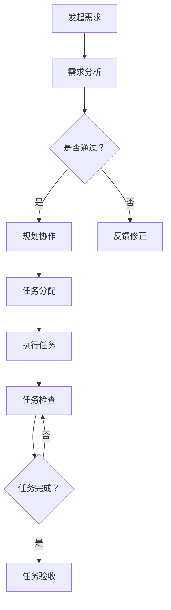
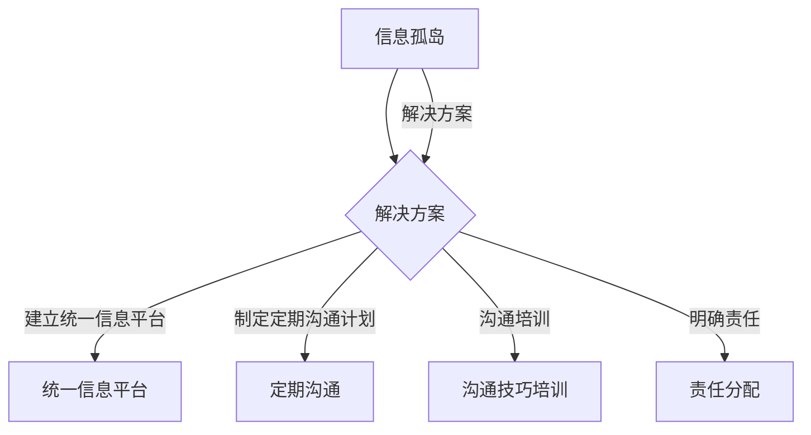
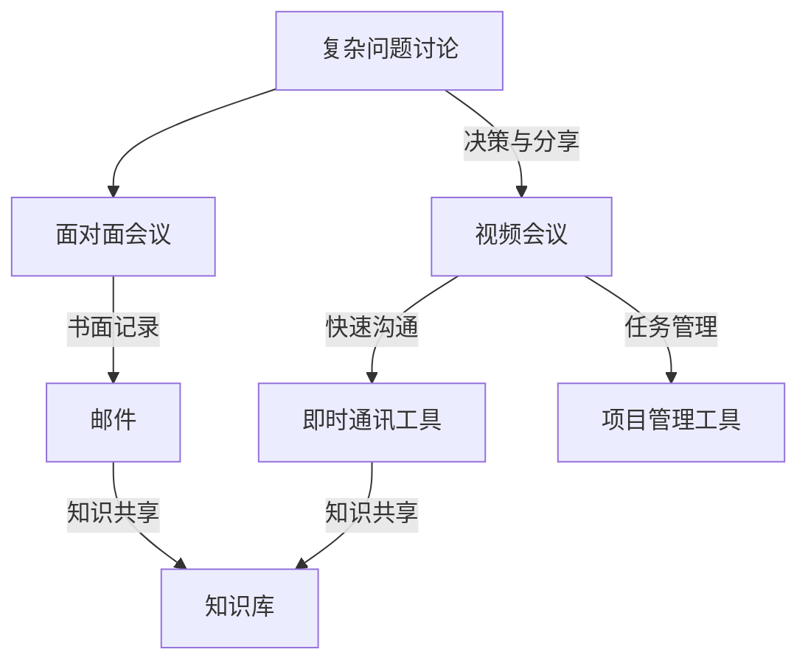
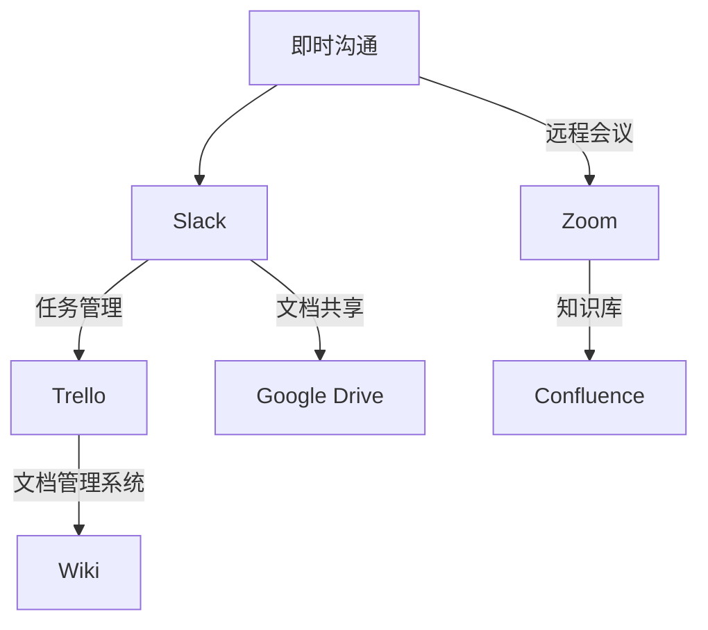
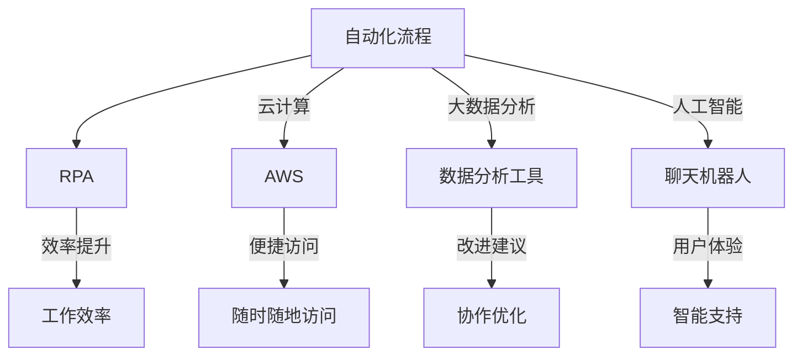
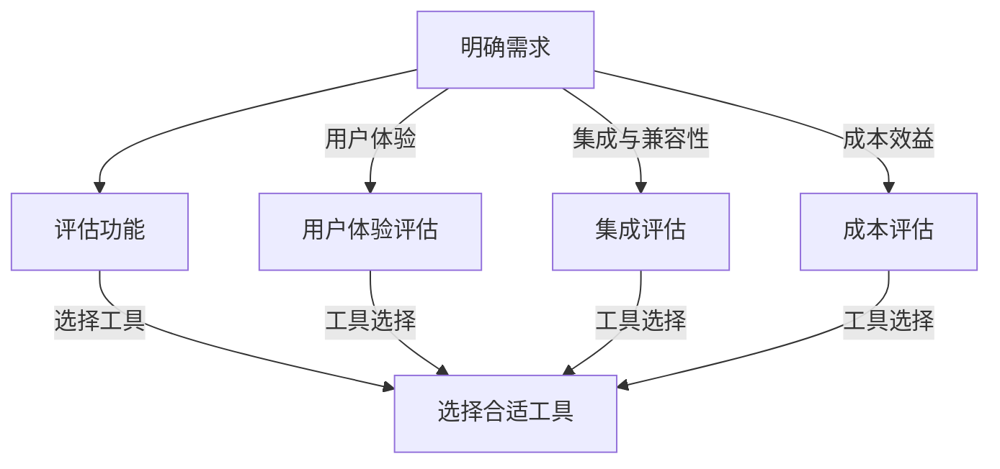
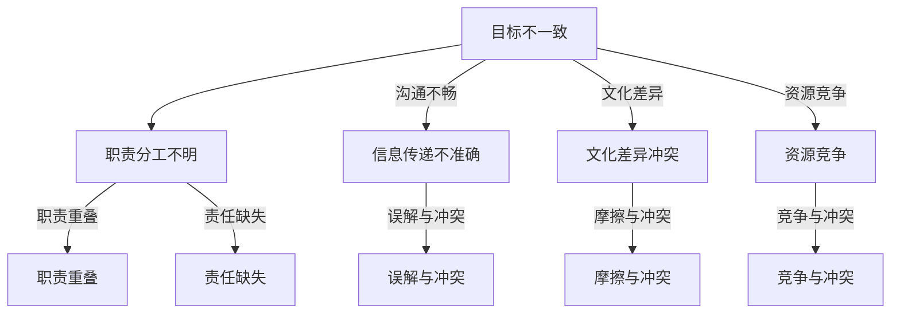
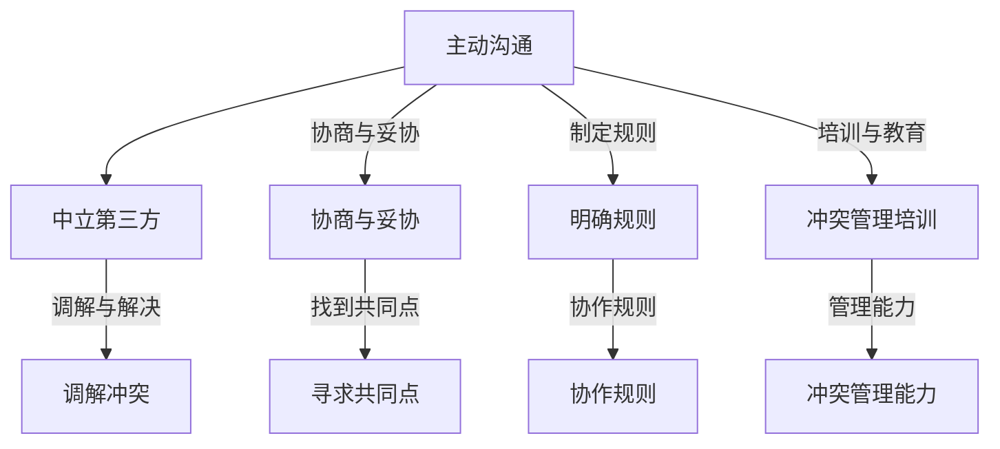
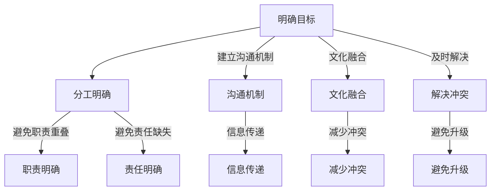

                 

### 引言

#### 1.1 书籍背景与目标

在当今快节奏和高度竞争的商业环境中，企业要想保持竞争力，必须在内部实现高效的跨部门协作。跨部门协作不仅仅是一个简单的沟通问题，它涉及组织文化的塑造、流程的管理、工具的选用以及冲突的解决等多个方面。本著作《无缝协作：跨部门合作的最佳实践》旨在为企业管理者和团队领导者提供一套全面的跨部门协作指南，帮助他们在实际工作中实现高效的跨部门协作。

本书的编写目标如下：

1. **传授跨部门协作的基本概念和原则**：通过介绍跨部门协作的定义、重要性以及关键要素，帮助读者建立正确的跨部门协作认知。
2. **提供实用的组织文化建设方法**：通过探讨如何建立协作型组织文化、促进跨部门沟通的文化因素以及如何克服文化差异，帮助企业在文化层面上实现跨部门协作。
3. **介绍流程管理和优化策略**：通过讲解跨部门协作的流程设计、角色与职责的明确以及流程优化的方法和工具，帮助企业在流程层面上实现高效的跨部门协作。
4. **分享最佳实践和工具**：通过案例分析、实战经验和工具介绍，帮助读者在实际操作中掌握跨部门协作的最佳实践。

#### 1.2 跨部门协作的重要性

跨部门协作对于企业的成功至关重要。它不仅能提高工作效率，还能促进创新和团队凝聚力。以下是一些跨部门协作的重要性体现：

1. **提高工作效率**：通过跨部门协作，可以打破信息孤岛，实现资源的最大化利用，从而提高整个组织的运作效率。
2. **促进创新**：跨部门协作能够促进不同背景、不同专业知识的碰撞和融合，激发创新思维和解决方案。
3. **增强团队凝聚力**：跨部门协作有助于团队成员之间的相互理解和信任，增强团队的凝聚力。
4. **提升客户满意度**：高效的跨部门协作能够确保客户需求的快速响应和高质量的服务，从而提升客户满意度。

#### 1.3 书籍结构概述

本书共分为两个主要部分，第一部分为基础理论，主要介绍跨部门协作的基础概念、组织文化建设、流程管理等内容；第二部分为最佳实践，通过案例分析和工具介绍，展示跨部门协作在实际操作中的应用。

本书的具体结构如下：

- 引言部分：介绍书籍背景、目标和结构概述。
- 第一部分：跨部门协作基础，包括基础概念、组织文化建设和流程管理。
  - 第2章：跨部门协作的基础概念。
  - 第3章：跨部门协作的组织文化。
  - 第4章：跨部门协作的流程管理。
- 第二部分：跨部门协作的最佳实践，包括明确目标与期望、建立有效的沟通机制、跨部门协作工具与技术以及冲突管理。
  - 第5章：明确目标与期望。
  - 第6章：建立有效的沟通机制。
  - 第7章：跨部门协作工具与技术。
  - 第8章：协作过程中的冲突管理。
- 结论部分：总结全文，强调跨部门协作的重要性，并提出未来研究方向。

### 跨部门协作的基础概念

#### 2.1 什么是跨部门协作

跨部门协作是指在组织内部，不同部门或团队之间为了共同实现组织目标而进行的协作活动。它不仅仅是部门间的沟通，更是一种整合资源、共享信息、协同工作的过程。

在跨部门协作中，不同部门的角色和职责通常有所不同。例如，产品部门负责产品规划与设计，市场部门负责市场推广与销售，技术部门负责技术研发与支持。通过跨部门协作，这些部门可以共同完成一个项目或任务，实现资源的最优配置。

跨部门协作的典型场景包括：

1. **项目合作**：多个部门共同参与一个项目，如新产品开发、市场营销活动等。
2. **业务流程优化**：不同部门共同参与业务流程的优化，以提高效率和降低成本。
3. **应急响应**：在突发事件或紧急情况下，各部门需要快速协调响应。

#### 2.2 跨部门协作的挑战与机遇

跨部门协作虽然重要，但也面临着诸多挑战。以下是一些常见的挑战：

1. **沟通障碍**：由于各部门的职责和目标不同，沟通往往存在障碍，导致信息传递不及时、不准确。
2. **文化差异**：不同部门可能有不同的工作方式、价值观和文化，这可能导致协作效率降低。
3. **资源分配**：跨部门协作往往需要共享资源，但资源分配不公可能导致部门间的矛盾。
4. **责任界定**：在跨部门协作中，责任和权利的界定往往模糊，可能导致工作责任不清。

然而，跨部门协作也带来了许多机遇：

1. **知识共享**：跨部门协作促进了不同部门之间的知识共享，有助于提高整个组织的知识水平。
2. **创新动力**：跨部门协作激发了创新思维，通过不同专业知识的碰撞，可能产生新的想法和解决方案。
3. **团队建设**：跨部门协作有助于增强团队凝聚力，提高员工之间的信任和合作精神。

#### 2.3 跨部门协作的关键要素

为了实现高效的跨部门协作，以下关键要素是必不可少的：

1. **明确的目标和期望**：明确的目标和期望是跨部门协作的基础，确保所有参与部门都朝着共同的目标努力。
2. **有效的沟通机制**：建立有效的沟通机制，确保信息传递的及时、准确和全面。
3. **共享的资源**：确保跨部门协作所需的资源得到合理分配和共享，以提高协作效率。
4. **明确的职责和权利**：明确各部门的职责和权利，避免责任不清和权力冲突。
5. **协作文化和氛围**：建立协作文化和氛围，促进团队成员之间的相互理解和信任，提高协作效率。

通过掌握这些关键要素，企业可以更好地应对跨部门协作中的挑战，抓住机遇，实现组织目标。

### 跨部门协作的组织文化

#### 3.1 建立协作型组织文化

组织文化是跨部门协作的重要基础。一个协作型组织文化能够促进团队成员之间的相互理解和信任，提高协作效率。以下是建立协作型组织文化的几个关键步骤：

1. **明确协作价值观**：首先，企业需要明确协作价值观，并将其融入组织文化中。协作价值观可以包括共享目标、尊重差异、合作共赢等。
2. **领导者的示范作用**：领导者需要通过自身行为来示范协作精神，鼓励团队成员积极参与跨部门协作，树立良好的协作榜样。
3. **培训与教育**：定期进行协作培训和教育，提高团队成员的协作意识和能力。培训内容可以包括沟通技巧、团队合作、冲突管理等。
4. **激励机制**：建立激励机制，鼓励团队成员积极参与跨部门协作。激励机制可以包括奖金、晋升机会、表彰等。

#### 3.2 促进跨部门沟通的文化因素

跨部门沟通是跨部门协作的重要环节。以下是一些促进跨部门沟通的文化因素：

1. **透明度**：提高组织内部的透明度，使团队成员能够了解其他部门的运作情况和需求，从而更好地进行沟通。
2. **开放性**：鼓励团队成员开放心态，愿意分享自己的想法和意见，从而促进跨部门沟通。
3. **包容性**：尊重不同部门的文化和价值观，包容不同的意见和观点，避免因文化差异导致的沟通障碍。
4. **信任**：建立信任关系是跨部门沟通的关键。通过诚信、透明和负责任的行为，增强团队成员之间的信任。

#### 3.3 如何克服文化差异

文化差异是跨部门协作中常见的问题，以下是一些克服文化差异的方法：

1. **文化敏感性培训**：为团队成员提供文化敏感性培训，帮助他们了解和尊重不同文化背景下的行为和沟通方式。
2. **共同目标**：通过设定共同目标，使团队成员将注意力集中在共同任务上，而不是文化差异上。
3. **有效的沟通**：建立有效的沟通机制，确保信息传递的准确和全面。有效的沟通可以减少误解和冲突。
4. **团队合作**：通过团队合作活动，增强团队成员之间的互动和理解，减少文化差异带来的隔阂。

通过建立协作型组织文化、促进跨部门沟通以及克服文化差异，企业可以更好地实现跨部门协作，提高整体工作效率和团队凝聚力。

### 跨部门协作的流程管理

#### 4.1 跨部门协作的流程设计

跨部门协作的流程设计是确保协作顺利进行的关键。以下是跨部门协作流程设计的几个关键步骤：

1. **明确协作目标**：首先，需要明确跨部门协作的目标。目标应当具体、可衡量，并与组织的整体战略目标保持一致。
2. **确定参与部门**：确定哪些部门需要参与协作，以及每个部门在协作过程中的角色和职责。
3. **流程梳理**：梳理现有的工作流程，找出协作过程中可能存在的瓶颈和障碍，并对其进行优化。
4. **制定协作计划**：制定详细的协作计划，包括每个阶段的具体任务、时间表和责任人。
5. **流程图表示**：使用流程图或其他图表工具，将协作流程可视化，便于团队成员理解和遵循。

以下是一个简单的跨部门协作流程设计示例（使用Mermaid流程图表示）：

#### 4.2 流程中的角色与职责

在跨部门协作中，明确每个角色的职责和责任至关重要。以下是常见跨部门协作中的角色及其职责：

1. **项目经理**：负责整个跨部门协作项目的规划、执行和监控。确保项目按时、按质完成。
2. **部门负责人**：代表各部门参与协作，确保部门内部任务的高效执行，并协调与其他部门之间的合作。
3. **协作协调员**：负责跨部门之间的沟通和协调，确保信息传递的及时和准确。
4. **执行人员**：具体执行协作任务的人员，如设计师、开发人员、测试人员等。
5. **评审人员**：负责对协作成果进行评审，确保成果符合预期要求。

#### 4.3 流程优化的方法与工具

为了提高跨部门协作的效率，流程优化是必不可少的。以下是几种常见的流程优化方法和工具：

1. **价值流图（Value Stream Mapping）**：通过绘制价值流图，可以清晰地看到整个协作流程中的每个步骤，识别瓶颈和浪费，进而优化流程。
2. **精益生产（Lean Manufacturing）**：应用精益生产的理念，消除浪费、提高效率。例如，通过减少不必要的会议、简化审批流程等。
3. **看板（Kanban）**：使用看板工具，可视化工作流程，控制工作量和进度，确保任务在适当的时间内完成。
4. **六西格玛（Six Sigma）**：通过六西格玛方法，分析流程中的缺陷和变异，采取针对性的改进措施，提高流程的可靠性和质量。

通过流程设计、明确角色职责以及优化流程，企业可以更好地实现跨部门协作的高效运作。

### 明确目标与期望

#### 5.1 确定跨部门协作目标

明确跨部门协作目标是确保协作顺利进行的第一步。以下是如何确定跨部门协作目标的方法：

1. **与组织战略目标保持一致**：确保跨部门协作目标与组织的整体战略目标相一致，确保协作的方向和努力与组织的目标一致。
2. **具体、可衡量和可实现**：目标应具体、可衡量和可实现，避免模糊和空洞的目标，以便团队成员能够清楚地了解目标及其重要性。
3. **涉及所有相关部门**：在确定目标时，应征求所有相关部门的意见，确保所有部门都能达成共识，从而提高协作的积极性。

以下是一个跨部门协作目标的示例：

- **目标**：在一个季度内完成新产品的市场推广和发布，提高产品知名度并实现销售目标。
- **具体**：市场部门负责制定市场推广计划，技术部门负责确保产品按时发布，销售部门负责制定销售策略并执行。

#### 5.2 设定关键绩效指标（KPI）

关键绩效指标（KPI）是衡量跨部门协作成效的重要工具。以下是如何设定KPI的方法：

1. **相关性**：确保KPI与跨部门协作目标相关，能够反映协作的实际成效。
2. **可衡量性**：KPI应具体、可量化，以便进行准确评估。
3. **公平性**：确保KPI的设定对各部门都是公平的，避免因为不公平的KPI导致部门间的矛盾。

以下是一个关于新产品的市场推广和发布的KPI示例：

- **市场知名度**：通过社交媒体、广告等渠道，提高产品知名度，目标是在三个月内达到10,000次社交媒体提及。
- **销售目标**：在新产品发布后的第一个月内实现销售额达到50万美元。

#### 5.3 如何确保团队成员共同理解目标

确保团队成员共同理解目标是实现协作目标的关键。以下是一些方法：

1. **沟通与反馈**：定期召开会议，向团队成员传达协作目标，并收集他们的反馈和意见，确保所有人对目标有清晰的理解。
2. **透明度**：保持协作过程的透明度，让团队成员了解其他部门的进展和贡献，从而更好地理解整个协作的背景和目标。
3. **共同制定**：在制定目标时，鼓励团队成员共同参与，提高他们对目标的认同感和责任感。
4. **定期检查**：定期检查目标的进展情况，及时调整策略，确保目标的实现。

通过以上方法，可以确保团队成员共同理解跨部门协作的目标，从而提高协作的效率和成效。

### 建立有效的沟通机制

#### 6.1 跨部门沟通的挑战与解决方案

跨部门沟通在企业运营中至关重要，但也面临着诸多挑战。以下是一些常见的跨部门沟通挑战及其解决方案：

1. **信息孤岛**：由于不同部门的信息系统不兼容，导致信息无法共享，形成信息孤岛。解决方案是建立统一的信息平台，确保信息在各部门之间流畅传递。

2. **沟通频率不足**：由于工作忙碌，部门间的沟通频率不够，导致信息传递不及时。解决方案是制定定期沟通计划，确保各部门之间保持频繁的沟通。

3. **沟通不畅**：由于文化差异、沟通方式不当等原因，导致沟通效果不佳。解决方案是提供沟通培训，提高团队成员的沟通技巧，建立有效的沟通机制。

4. **责任模糊**：在跨部门协作中，责任分配不明确，导致工作推进困难。解决方案是明确每个部门的职责和任务，确保责任清晰。

以下是一个跨部门沟通挑战与解决方案的示例（使用Mermaid流程图表示）：

#### 6.2 沟通渠道的选择

选择合适的沟通渠道对于确保信息传递的及时性和准确性至关重要。以下是一些常见的沟通渠道及其适用场景：

1. **会议**：适用于需要讨论复杂问题、决策或分享重要信息的情况。可以通过面对面会议、视频会议等方式进行。

2. **邮件**：适用于需要记录和传达重要信息的情况。邮件可以提供书面记录，便于后续查阅。

3. **即时通讯工具**：适用于需要快速沟通和解决问题的场景。如微信、Slack、Telegram等。

4. **项目管理工具**：适用于项目团队内部沟通和任务管理。如Trello、JIRA、Asana等。

5. **知识库**：适用于需要共享和存储知识、文档和资源的情况。如Confluence、Wiki等。

以下是一个跨部门沟通渠道选择的示例（使用Mermaid流程图表示）：

#### 6.3 如何确保信息传递的准确性和及时性

确保信息传递的准确性和及时性是跨部门协作成功的关键。以下是一些方法：

1. **明确信息传递流程**：制定明确的信息传递流程，确保信息从发送方到接收方的过程清晰、透明。

2. **使用确认机制**：在信息传递过程中，使用确认机制，如回复“收到”或“已读”，以确保接收方已经接收到信息。

3. **定期沟通与反馈**：定期与团队成员沟通，了解他们的需求和问题，及时提供帮助和解决方案。

4. **使用沟通工具**：选择合适的沟通工具，如即时通讯工具、项目管理工具等，确保信息传递的及时性和准确性。

5. **建立信息共享平台**：建立统一的信息共享平台，如企业内部网、知识库等，方便团队成员随时查阅和更新信息。

通过以上方法，可以确保跨部门协作中的信息传递既准确又及时，从而提高协作效率。

### 跨部门协作工具与技术

#### 7.1 常见的跨部门协作工具

在跨部门协作中，选择合适的协作工具可以提高工作效率和协作质量。以下是一些常见的跨部门协作工具：

1. **即时通讯工具**：如Slack、Microsoft Teams、WhatsApp等，用于快速沟通和交流。

2. **项目管理工具**：如Trello、JIRA、Asana等，用于任务管理、进度跟踪和团队协作。

3. **文档共享工具**：如Google Drive、Dropbox、OneDrive等，用于文档存储、共享和协同编辑。

4. **视频会议工具**：如Zoom、Microsoft Teams、Google Meet等，用于远程会议和在线协作。

5. **知识库和文档管理系统**：如Confluence、Wiki等，用于知识共享和文档管理。

以下是一个跨部门协作工具选择的示例（使用Mermaid流程图表示）：

#### 7.2 利用技术提升协作效率

技术可以显著提升跨部门协作的效率。以下是一些利用技术提升协作效率的方法：

1. **自动化流程**：通过自动化工具，如机器人流程自动化（RPA），自动执行重复性的任务，减少人工干预，提高工作效率。

2. **云计算**：使用云计算服务，如AWS、Azure、Google Cloud等，实现数据的集中存储和处理，方便团队成员随时访问和使用。

3. **大数据分析**：通过大数据分析工具，对跨部门协作过程中的数据进行分析，发现协作中的瓶颈和问题，提出改进建议。

4. **人工智能**：利用人工智能技术，如聊天机器人、智能推荐系统等，提供智能化的协作支持，提高协作效率和用户体验。

以下是一个利用技术提升协作效率的示例（使用Mermaid流程图表示）：

#### 7.3 如何选择合适的协作工具

选择合适的协作工具对于跨部门协作的成功至关重要。以下是一些选择协作工具的方法：

1. **明确需求**：首先明确跨部门协作的需求，如沟通需求、任务管理需求、文档共享需求等，然后根据需求选择相应的工具。

2. **评估功能**：评估工具的功能是否满足需求，包括易用性、扩展性、安全性能等。

3. **用户体验**：选择用户体验良好的工具，可以降低团队成员的学习成本，提高协作效率。

4. **集成与兼容性**：选择与其他系统或工具集成的协作工具，可以更好地实现信息共享和流程管理。

5. **成本效益**：考虑工具的成本效益，确保投资能够带来明显的效率提升和协作质量改善。

以下是一个选择合适协作工具的示例（使用Mermaid流程图表示）：

通过合理选择和使用跨部门协作工具，企业可以显著提高协作效率，实现资源的最大化利用，从而在竞争激烈的市场环境中保持优势。

### 协作过程中的冲突管理

#### 8.1 冲突的类型与原因

跨部门协作过程中，冲突是难以避免的。理解冲突的类型和原因有助于更好地管理和解决冲突。以下是几种常见的冲突类型及其原因：

1. **目标不一致**：不同部门可能有不同的目标，导致协作过程中产生冲突。例如，产品部门关注产品功能，而市场部门关注市场推广。

2. **职责分工不明**：在跨部门协作中，如果职责分工不明确，可能导致部门间的职责重叠或责任缺失，从而引发冲突。

3. **沟通不畅**：由于沟通不畅，部门间的信息传递不准确或不及时，可能导致误解和冲突。

4. **文化差异**：不同部门的文化和价值观可能存在差异，导致协作中的摩擦和冲突。

5. **资源竞争**：跨部门协作往往需要共享资源，如果资源分配不公或资源不足，可能导致部门间的竞争和冲突。

以下是一个跨部门协作冲突类型与原因的示例（使用Mermaid流程图表示）：

#### 8.2 冲突解决的策略

有效解决冲突是确保跨部门协作顺利进行的关键。以下是一些解决冲突的策略：

1. **主动沟通**：及时主动地与相关部门进行沟通，了解他们的需求和问题，以便及早发现并解决潜在冲突。

2. **中立第三方**：在冲突严重时，可以邀请中立第三方进行调解，以客观、公正的方式解决冲突。

3. **协商与妥协**：鼓励各部门在冲突中寻求共同点，通过协商和妥协找到双方都能接受的解决方案。

4. **制定规则**：建立明确的协作规则，包括职责分工、沟通机制和资源分配等，以减少冲突的发生。

5. **培训与教育**：通过培训和教育，提高团队成员的冲突管理意识和能力，从而更好地解决冲突。

以下是一个冲突解决策略的示例（使用Mermaid流程图表示）：

#### 8.3 如何应对常见冲突

以下是一些应对常见冲突的方法：

1. **明确目标**：在协作开始前，明确各部门的目标，确保所有人对目标有清晰的认识。

2. **分工明确**：在协作过程中，明确各部门的职责和分工，避免职责重叠和责任缺失。

3. **建立沟通机制**：建立有效的沟通机制，确保信息传递的及时、准确和全面。

4. **文化融合**：尊重不同部门的文化和价值观，促进文化融合，减少冲突。

5. **及时解决**：在冲突发生后，及时采取措施进行解决，避免冲突升级。

以下是一个应对常见冲突的方法示例（使用Mermaid流程图表示）：

通过以上方法，企业可以更好地应对跨部门协作中的冲突，确保协作顺利进行。

### 结论

跨部门协作是企业成功的关键因素之一。通过明确目标与期望、建立有效的沟通机制、选用合适的协作工具、管理冲突，企业可以实现高效的无缝协作，提高工作效率和团队凝聚力。本书《无缝协作：跨部门合作的最佳实践》提供了全面的跨部门协作指南，从理论基础到实际操作，为企业管理者和团队领导者提供了宝贵的参考。

展望未来，随着技术的不断进步，跨部门协作将迎来更多创新和发展。例如，人工智能和大数据分析将有助于预测和解决协作中的问题，增强协作的智能化和自动化程度。此外，虚拟现实和增强现实技术将为跨部门协作提供全新的互动方式，提升协作的体验和效果。

未来研究方向可以包括：

1. **跨部门协作中的数据隐私与安全**：随着协作过程中数据量的增加，如何保障数据隐私和安全将成为重要的研究课题。
2. **跨部门协作中的决策支持**：利用人工智能和大数据分析技术，为跨部门协作提供决策支持，提高协作的效率和效果。
3. **跨部门协作的文化适应性**：研究如何在全球化背景下，实现跨文化部门的协作，促进文化融合与创新。

通过不断探索和实践，企业将能够实现更加高效的跨部门协作，为组织的发展注入新的动力。**作者：AI天才研究院/AI Genius Institute & 禅与计算机程序设计艺术 /Zen And The Art of Computer Programming**。

