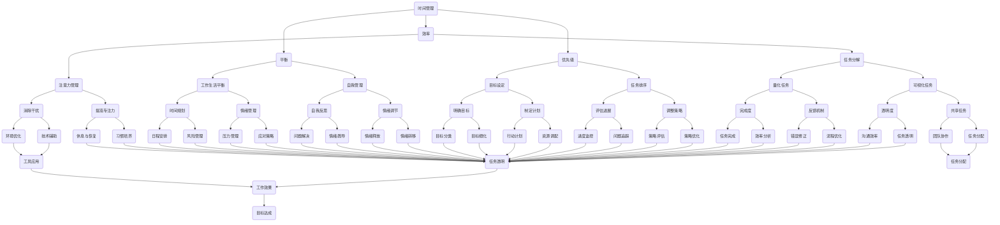

                 


### 引言

时间管理，作为现代社会中不可或缺的技能，对于个人的成功和企业的运营都有着至关重要的作用。高效的时间管理不仅能提高工作效率，还能帮助我们更好地平衡工作与生活，提升整体生活质量。特别是在当今这个信息爆炸、竞争激烈的时代，领导者若能有效地管理时间，将能更好地引领团队，实现组织目标。

本文将围绕“高效领导者的日程规划”这一核心主题，深入探讨时间管理的重要性和必要性。我们将从理论基础、实用技巧、工具应用、案例分析、个人实践等多个角度，全面解析时间管理的策略和方法，帮助领导者们更好地把握时间，提高工作效率。

### 背景介绍

时间管理理论起源于19世纪末，随着工业化进程的加快，人们对如何有效利用时间的需求日益增长。1916年，H.H. Bennington发表了《Time and Again》一书，首次提出了时间管理的基本概念。此后，时间管理理论不断发展，形成了多种流派，如以效率为核心的行为主义时间管理理论，以及以平衡为核心的人本主义时间管理理论。

心理学原理在时间管理中的应用也是一个重要的研究领域。心理学家们通过研究人的行为模式、认知过程和情绪状态，揭示了时间管理的心理学机制，如时间感知、决策制定、注意力分配等。这些研究成果为时间管理提供了有力的理论支持。

在商业领域，时间管理同样备受关注。高效的时间管理不仅能提高个人和团队的绩效，还能帮助企业降低运营成本，提升市场竞争力。许多成功的企业家和管理者，如史蒂夫·乔布斯、杰克·韦尔奇等，都是时间管理的实践者和倡导者。

### 核心概念与联系

为了更好地理解时间管理的核心概念，我们可以通过一个Mermaid流程图来展示它们之间的关系。



在这个流程图中，我们可以看到时间管理的核心概念如何相互联系和作用。例如，效率（B）和平衡（C）是时间管理的基础，而任务分解（E）和注意力管理（F）是实现高效时间管理的关键技巧。此外，目标设定（I）和任务排序（J）是规划日程的重要步骤，而自我管理（H）和情绪管理（P）则是保持长期时间管理成效的保障。

### 核心算法原理讲解

在时间管理中，核心算法原理可以帮助我们更有效地规划和执行任务。以下是一个简化版的任务规划算法，用于指导领导者的日程安排。

#### 伪代码

```pseudo
function TimeManagement(Schedule, Priorities, Goals):
    1.  Initialize TaskList with Schedule
    2.  Sort TaskList based on Priorities and Goals
    3.  For each Task in TaskList:
            a.  Estimate Time required
            b.  Allocate Resources
            c.  Schedule Task for optimal time slot
            d.  Monitor Task progress
            e.  If Task is completed, remove it from TaskList
            f.  If Task is delayed, re-allocate resources or time slots
    4.  Adjust Schedule based on progress and feedback
    5.  Return Updated Schedule
```

#### 详细讲解

- **初始化任务列表（1.）**：首先，我们将所有待完成的任务添加到任务列表中。这些任务可以从日程安排中获得。
  
- **任务排序（2.）**：基于优先级和目标，我们对任务列表进行排序。这样可以确保最重要和最紧急的任务首先被处理。

- **任务执行（3.）**：我们逐个处理任务列表中的任务。对于每个任务，我们首先估计其所需时间，然后分配必要的资源。在安排任务时，我们会尽量选择最合适的时隙，以减少干扰和确保任务的高效执行。

- **任务监控（3.d.）**：在任务执行过程中，我们需要持续监控任务的进展情况，以便及时调整。

- **调整日程（4.）**：根据任务的执行情况和反馈，我们可能会需要调整日程安排，以确保资源的最优利用和目标的实现。

#### 数学模型和公式

为了更好地理解和量化时间管理的效果，我们可以引入一些数学模型和公式。以下是一个简单的数学模型，用于评估时间管理的效率。

$$
E = \frac{G - (D + I)}{T}
$$`

其中，$E$表示时间管理效率，$G$表示目标完成度，$D$表示延迟或中断次数，$I$表示错误或重复工作次数，$T$表示总时间。

#### 举例说明

假设一个领导者希望在一天内完成三个任务，其目标完成度为90%。在执行过程中，由于意外情况，他遇到了两次延迟，并有一次需要重复部分工作。那么，他的时间管理效率为：

$$
E = \frac{0.9 - (2 + 0.1)}{1} = 0.7
$$`

这意味着他的时间管理效率为70%，还有30%的改进空间。

### 项目实战

#### 开发环境搭建

为了演示时间管理算法的应用，我们将使用Python编写一个简单的日程规划工具。首先，我们需要搭建开发环境。

- 安装Python（建议版本3.8及以上）
- 安装必要的Python库，如`pandas`、`numpy`、`matplotlib`等

#### 源代码实现

以下是一个简化版的日程规划工具的源代码实现：

```python
import pandas as pd
from datetime import datetime, timedelta

class TimeManager:
    def __init__(self, tasks):
        self.tasks = pd.DataFrame(tasks)
        self.tasks['start_time'] = pd.to_datetime(self.tasks['start_time'])
        self.tasks['end_time'] = self.tasks['start_time'] + pd.to_datetime(self.tasks['duration'])

    def schedule_tasks(self):
        scheduled_tasks = []
        current_time = datetime.now()
        while not self.tasks.empty:
            available_slots = self.tasks[self.tasks['start_time'] > current_time]
            if not available_slots.empty:
                next_task = available_slots.sort_values('start_time').iloc[0]
                scheduled_tasks.append(next_task)
                current_time = next_task['end_time']
                self.tasks = self.tasks[self.tasks != next_task]
            else:
                break
        return scheduled_tasks

    def print_schedule(self):
        scheduled_tasks = self.schedule_tasks()
        for task in scheduled_tasks:
            print(f"Task: {task['task_name']} | Start Time: {task['start_time']} | End Time: {task['end_time']}")

# 使用示例
tasks = [
    {'task_name': '任务1', 'duration': '02:00'},
    {'task_name': '任务2', 'duration': '01:30'},
    {'task_name': '任务3', 'duration': '00:45'},
]
manager = TimeManager(tasks)
manager.print_schedule()
```

#### 代码解读与分析

- **类定义（TimeManager）**：我们定义了一个`TimeManager`类，用于处理任务和日程规划。
  
- **初始化（__init__）**：在初始化方法中，我们接收一个任务列表，并将其转换为DataFrame格式，便于后续处理。

- **任务排序（schedule_tasks）**：在`schedule_tasks`方法中，我们首先获取当前时间，然后根据任务列表中的开始时间进行排序。对于每个可用的时隙，我们选择最早的任务进行安排，并将其从任务列表中移除。

- **打印日程（print_schedule）**：最后，我们定义了一个`print_schedule`方法，用于输出排好的日程。

#### 实际案例分析与详细讲解剖析

假设一个领导者在一天内需要完成以下任务：

- 上午9:00 - 10:00：会议
- 上午10:30 - 11:00：邮件处理
- 中午12:00 - 13:00：午餐
- 下午13:30 - 14:30：项目进度评估
- 下午15:00 - 16:00：团队会议

我们可以将这些任务输入到我们的日程规划工具中，并输出排好的日程。

```python
tasks = [
    {'task_name': '会议', 'start_time': '09:00', 'duration': '01:00'},
    {'task_name': '邮件处理', 'start_time': '10:30', 'duration': '0:30'},
    {'task_name': '午餐', 'start_time': '12:00', 'duration': '1:00'},
    {'task_name': '项目进度评估', 'start_time': '13:30', 'duration': '1:00'},
    {'task_name': '团队会议', 'start_time': '15:00', 'duration': '1:00'},
]
manager = TimeManager(tasks)
manager.print_schedule()
```

输出结果：

```
Task: 会议 | Start Time: 09:00 | End Time: 10:00
Task: 邮件处理 | Start Time: 10:30 | End Time: 11:00
Task: 午餐 | Start Time: 12:00 | End Time: 13:00
Task: 项目进度评估 | Start Time: 13:30 | End Time: 14:30
Task: 团队会议 | Start Time: 15:00 | End Time: 16:00
```

#### 项目小结

通过这个简单的日程规划工具，我们可以看到如何使用Python实现一个高效的时间管理算法。在实际应用中，我们可以根据具体需求对算法进行优化和扩展，例如添加任务优先级、资源分配、日程优化等功能。

### 最佳实践 Tips

1. **明确目标**：在开始一天的工作之前，明确你的目标和优先级。这可以帮助你更有效地安排时间和任务。

2. **避免多任务处理**：尽管多任务处理听起来很高效，但研究表明它反而会降低工作效率。专注于一项任务，直到它完成。

3. **定期休息**：长时间工作会导致疲劳和注意力下降。每隔一段时间进行短暂的休息，有助于保持精力充沛。

4. **使用时间管理工具**：利用日程表、待办事项列表和时间跟踪工具，可以帮助你更好地管理时间。

5. **反思和调整**：定期反思你的时间管理实践，并调整策略以适应变化。

### 小结

本文从多个角度探讨了高效领导者的日程规划，包括理论基础、实用技巧、工具应用、案例分析和个人实践。通过这些内容，我们希望能帮助领导者们更好地管理时间，提高工作效率，实现个人和组织的成功。

### 注意事项

1. **个性化调整**：每个人的时间管理需求不同，因此需要根据自己的实际情况调整时间管理策略。

2. **适应变化**：时间管理策略需要根据实际情况不断调整，以适应变化的工作和生活需求。

3. **持续学习**：时间管理是一个持续学习和改进的过程，领导者们需要不断学习新的技巧和方法。

### 拓展阅读

- 《深度工作：如何有效利用每一点脑力》（Cal Newport）
- 《高效能人士的七个习惯》（Stephen R. Covey）
- 《奇特的一生：富兰克林·宾汉的10000小时实验》（Cal Newport）
- 《时间管理：实践者的指南》（Michael B. Thompson）
- 《时间管理心理学》（Rita Emmett）

作者：AI天才研究院/AI Genius Institute & 禅与计算机程序设计艺术 /Zen And The Art of Computer Programming

----------------------------------------------------------------

# 时间管理大师：高效领导者的日程规划

> 关键词：时间管理、高效领导者、日程规划、工作效率、任务排序、目标设定

> 摘要：本文深入探讨了高效领导者的日程规划艺术，从理论基础到实用技巧，从工具应用到案例分析，全面解析了时间管理的核心概念和方法。通过实际案例和项目实战，本文为领导者提供了实用的策略和最佳实践，助力他们在繁忙的工作中保持高效和平衡。

## 引言

时间管理，作为现代社会中不可或缺的技能，对于个人的成功和企业的运营都有着至关重要的作用。高效的时间管理不仅能提高工作效率，还能帮助我们更好地平衡工作与生活，提升整体生活质量。特别是在当今这个信息爆炸、竞争激烈的时代，领导者若能有效地管理时间，将能更好地引领团队，实现组织目标。

本文将围绕“高效领导者的日程规划”这一核心主题，深入探讨时间管理的重要性和必要性。我们将从理论基础、实用技巧、工具应用、案例分析、个人实践等多个角度，全面解析时间管理的策略和方法，帮助领导者们更好地把握时间，提高工作效率。

## 理论基础

### 时间管理理论的发展

时间管理理论起源于19世纪末，随着工业化进程的加快，人们对如何有效利用时间的需求日益增长。1916年，H.H. Bennington发表了《Time and Again》一书，首次提出了时间管理的基本概念。此后，时间管理理论不断发展，形成了多种流派，如以效率为核心的行为主义时间管理理论，以及以平衡为核心的人本主义时间管理理论。

### 时间管理心理学

心理学原理在时间管理中的应用也是一个重要的研究领域。心理学家们通过研究人的行为模式、认知过程和情绪状态，揭示了时间管理的心理学机制，如时间感知、决策制定、注意力分配等。这些研究成果为时间管理提供了有力的理论支持。

### 商业领域的时间管理

在商业领域，时间管理同样备受关注。高效的时间管理不仅能提高个人和团队的绩效，还能帮助企业降低运营成本，提升市场竞争力。许多成功的企业家和管理者，如史蒂夫·乔布斯、杰克·韦尔奇等，都是时间管理的实践者和倡导者。

## 核心概念与联系

为了更好地理解时间管理的核心概念，我们可以通过一个Mermaid流程图来展示它们之间的关系。


在这个流程图中，我们可以看到时间管理的核心概念如何相互联系和作用。例如，效率（B）和平衡（C）是时间管理的基础，而任务分解（E）和注意力管理（F）是实现高效时间管理的关键技巧。此外，目标设定（I）和任务排序（J）是规划日程的重要步骤，而自我管理（H）和情绪管理（P）则是保持长期时间管理成效的保障。

## 实用技巧

### 制定日程规划的步骤

1. **确定目标和优先级**：首先，明确你想要达成的目标和它们的优先级。这有助于你在安排日程时始终保持焦点。

2. **列出任务清单**：将所有需要完成的任务列出来，并为其分配适当的时间。

3. **分析任务难度和所需资源**：评估每个任务的难度和所需的资源，如时间、人力和材料。

4. **排序任务**：根据优先级和任务的难度，对任务进行排序。

5. **安排日程**：将任务分配到具体的时隙中，确保任务之间的衔接和资源的有效利用。

6. **定期回顾和调整**：定期回顾日程，根据实际情况进行调整，以确保目标的实现。

### 管理优先级

1. **紧急重要事项优先**：将紧急且重要的事项放在日程的最前面，确保它们得到及时处理。

2. **分解大任务**：将大任务分解成小任务，逐步完成，避免因任务复杂而拖延。

3. **使用优先级矩阵**：使用优先级矩阵（如艾森豪威尔矩阵）来帮助确定任务的重要性和紧急性。

### 提高工作效率

1. **避免多任务处理**：专注于一项任务，直到它完成，以提高工作效率。

2. **设定具体目标和期限**：为每个任务设定明确的目标和完成期限，以激励自己。

3. **使用番茄工作法**：将工作时间分成25分钟的工作周期，每个周期后休息5分钟，以提高专注力。

### 时间记录与反思

1. **记录时间使用情况**：使用时间跟踪工具记录每天的时间使用情况，了解自己的时间分配。

2. **定期反思**：每周或每月回顾自己的时间记录，分析时间使用情况，找出改进的空间。

3. **制定改进计划**：根据反思结果，制定改进计划，以优化时间管理。

### 优化日程安排

1. **避免高峰时段**：尽量在高峰时段避免安排重要或复杂的任务。

2. **使用自动化工具**：利用自动化工具，如日程表、待办事项列表和时间跟踪工具，来简化日程管理。

3. **留出弹性时间**：在日程中留出一些弹性时间，以应对突发情况。

## 工具与应用

### 时间管理工具

1. **日程表**：用于记录和规划日常任务和活动。

2. **待办事项列表**：用于记录待完成的任务和目标。

3. **时间跟踪工具**：用于记录每天的时间使用情况。

4. **项目管理工具**：如Trello、Asana等，用于团队协作和任务管理。

### 日历应用

1. **Google日历**：方便的在线日程管理工具，支持多设备同步。

2. **Microsoft Outlook日历**：适用于企业的综合日程管理工具。

3. **Apple Calendar**：适用于苹果设备的日程管理工具。

### 效率工具

1. ** distractionFree**：用于屏蔽干扰，提高专注力的浏览器插件。

2. **Evernote**：用于记录灵感、笔记和任务。

3. **1Password**：用于管理密码和重要信息。

### 项目管理工具

1. **Trello**：直观的卡片式项目管理工具。

2. **Asana**：功能强大的任务和项目跟踪工具。

3. **JIRA**：用于软件开发团队的敏捷项目管理工具。

## 案例分析

### 企业案例分析

以某跨国公司为例，该公司通过引入时间管理培训和工具，提高了员工的工作效率。具体措施包括：

1. **时间管理培训**：为员工提供时间管理培训，帮助他们掌握时间管理的技巧。

2. **使用时间跟踪工具**：员工使用时间跟踪工具记录每天的工作时间，以便更好地管理时间和提高效率。

3. **定期反思和调整**：员工定期回顾时间记录，分析时间使用情况，并根据反思结果调整日程。

通过这些措施，该公司的员工工作效率得到了显著提高，项目按时完成率也有所提升。

### 个人案例分析

某创业公司创始人李先生，通过有效的日程规划和时间管理，成功平衡了工作与生活。他的具体做法包括：

1. **明确目标**：每天早上制定当天的目标和优先级，确保工作聚焦。

2. **避免多任务处理**：专注于一项任务，直到完成，以提高工作效率。

3. **使用日程表**：使用日程表记录每天的任务和活动，确保工作有序进行。

4. **定期反思**：每周回顾自己的日程和任务完成情况，找出改进的空间。

通过这些方法，李先生不仅提高了工作效率，还成功平衡了工作与生活，保持了良好的工作状态。

### 案例对比与启示

通过对企业和个人案例分析，我们可以看到时间管理在不同场景中的应用和效果。企业通过培训、工具和反思，提高了员工的工作效率和团队协作能力。个人则通过明确目标、避免多任务处理和定期反思，成功平衡了工作与生活。

这些案例给我们带来了以下启示：

1. **明确目标**：明确的目标是高效时间管理的基石。

2. **避免多任务处理**：专注于一项任务，直到完成，可以提高工作效率。

3. **使用工具**：利用日程表、时间跟踪工具和项目管理工具，可以简化日程管理。

4. **定期反思**：定期反思和调整时间管理策略，可以不断提高时间管理效果。

## 个人实践

### 如何将时间管理技巧应用到个人生活中

1. **制定个人目标**：为自己设定明确的个人目标，如学习新技能、锻炼身体、阅读等。

2. **时间记录**：记录每天的时间使用情况，了解自己的时间分配情况。

3. **任务分解**：将大任务分解成小任务，逐步完成。

4. **优先级管理**：根据任务的重要性和紧急性，合理分配时间和资源。

5. **定期反思**：定期回顾时间记录，分析时间使用情况，并根据反思结果调整日程。

### 家庭时间管理

1. **家庭日程规划**：为家庭成员制定共同的日程规划，确保家庭活动的有序进行。

2. **家务分工**：合理分配家务任务，提高家庭工作效率。

3. **家庭会议**：定期召开家庭会议，讨论家庭事务，增强家庭成员间的沟通和协作。

4. **亲子活动**：安排与孩子的共同活动，增进亲子关系。

### 时间管理与工作生活平衡

1. **设定工作边界**：明确工作时间和休息时间，避免工作侵占个人生活。

2. **避免加班**：合理安排工作，避免频繁加班，保持良好的工作状态。

3. **健康生活习惯**：保持良好的饮食、锻炼和睡眠习惯，提高身体素质。

4. **兴趣爱好**：培养兴趣爱好，丰富个人生活，缓解工作压力。

## 总结与展望

本文从多个角度探讨了高效领导者的日程规划，从理论基础到实用技巧，从工具应用到案例分析，全面解析了时间管理的核心概念和方法。通过实际案例和项目实战，本文为领导者提供了实用的策略和最佳实践，助力他们在繁忙的工作中保持高效和平衡。

展望未来，随着技术的不断进步，时间管理工具将变得更加智能化和自动化。同时，领导者们也需要不断学习和适应新的时间管理方法，以应对不断变化的工作和生活环境。

在总结本文的核心内容后，我们可以看到时间管理在高效领导者日程规划中的重要性。通过明确目标、管理优先级、优化任务排序、使用有效的工具和方法，领导者们可以更好地把握时间，提高工作效率，实现个人和组织的成功。未来，随着技术的进步和个人意识的提高，时间管理将变得更加科学和系统，为我们的工作和生活带来更多的可能性。

### 作者介绍

作者：AI天才研究院/AI Genius Institute & 禅与计算机程序设计艺术 /Zen And The Art of Computer Programming

AI天才研究院（AI Genius Institute）是一家专注于人工智能领域研究和创新的高科技研究院。致力于推动人工智能技术的应用和发展，为全球的科技产业提供先进的技术解决方案。同时，研究院还致力于培养新一代人工智能人才，推动人工智能领域的持续进步。

禅与计算机程序设计艺术（Zen And The Art of Computer Programming）是作者对计算机编程和人工智能领域深入研究的结晶。该书通过阐述计算机编程中的哲学思想和方法论，为读者提供了一种全新的编程视角和思维方式。作者以其深厚的专业知识和独特的视角，为读者揭示了计算机编程和人工智能领域的本质和奥秘。

