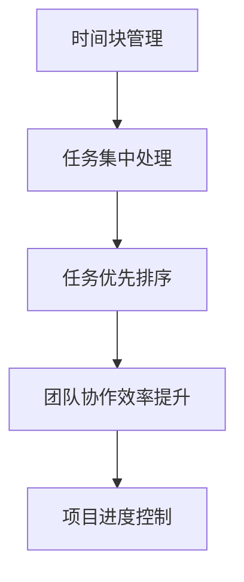
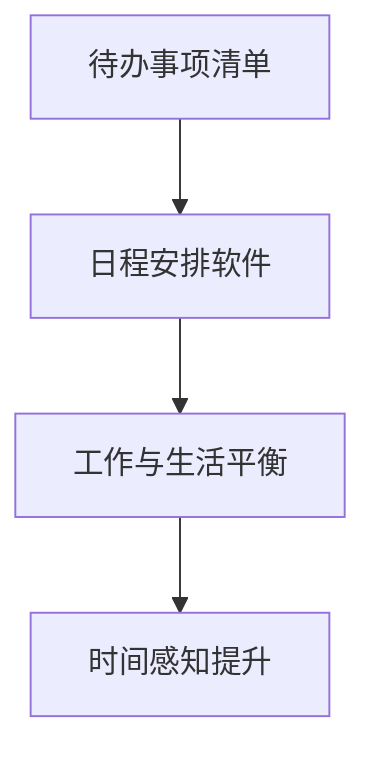
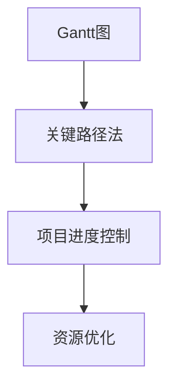
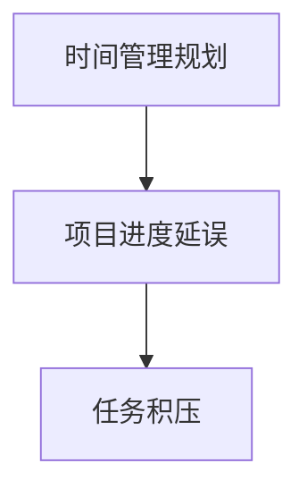
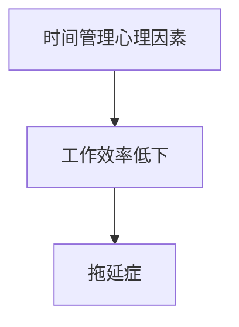
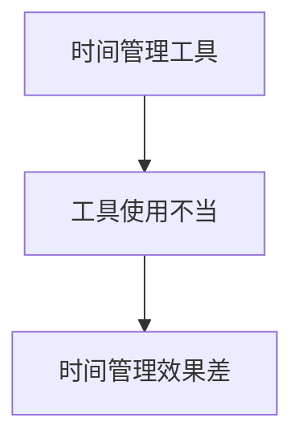

                 

### 文章标题

# 时间管理：高效领导者的必修课

### 关键词

- 时间管理
- 高效领导者
- 领导技巧
- 时间管理工具
- 生产力提升
- 决策效率

### 摘要

本文深入探讨了时间管理对于高效领导者的重要性。通过剖析时间管理的理论基础，介绍了一系列高效的时间管理技巧和工具，以及在实际领导工作中如何应用这些技巧和工具。文章还通过案例分析，展示了成功和失败的时间管理经验，并提出了未来时间管理的发展趋势和展望。本文旨在为领导者提供一套实用的时间管理策略，以提升工作效率和决策质量，从而在激烈的市场竞争中脱颖而出。

---

### 引言

在当今快速变化的工作环境中，时间管理成为了一项至关重要的技能，尤其是对于领导者来说。高效的时间管理不仅能够提升个人工作效率，还能够带动整个团队，提升组织的整体绩效。然而，对于许多领导者而言，如何有效管理时间，如何在繁忙的工作中保持高效，仍然是一个挑战。

《时间管理：高效领导者的必修课》这本书正是为了解决这一挑战而诞生的。它不仅为读者提供了时间管理的理论基础，还详细介绍了各种实用的技巧和工具，帮助领导者更好地管理自己的时间，从而实现个人和团队的成长。

本文将围绕这本书的内容，通过逐步分析，探讨时间管理的核心概念、高效领导者的时间管理技巧、时间管理工具的应用、以及时间管理在实际案例中的成功与失败。最后，我们还将展望时间管理在未来领导力发展中的重要作用。

接下来的内容将分为以下几个部分：

1. **时间管理的理论基础**：介绍时间管理的核心概念、原理和理论基础。
2. **高效领导者的时间管理技巧**：探讨领导者如何通过时间管理提升个人和团队的工作效率。
3. **时间管理工具与技术在领导中的应用**：分析各种时间管理工具和技术的应用场景。
4. **时间管理案例与实例分析**：通过实际案例展示时间管理的成功经验和教训。
5. **时间管理的未来展望**：探讨时间管理在未来的发展趋势和领导者应具备的时间管理能力。

### 第一部分：时间管理的理论基础

#### 1.1 时间管理的核心概念与原理

时间管理是一种通过规划、组织和优化时间使用，以实现个人和团队目标的方法。其核心概念包括以下几个方面：

1. **时间价值**：时间是一种有限的资源，其价值不可替代。有效的时间管理意味着充分利用时间，避免浪费，从而实现最大的效益。

2. **时间感知**：时间感知是指个体对时间的认知和感知能力。时间感知能力不同的人，其时间管理效率和效果也会有所不同。

3. **时间分配**：时间分配是指将时间合理地分配给不同的任务和活动。合理的时间分配能够提高工作效率，减少拖延和压力。

4. **时间优先级**：确定任务的重要性和紧急程度，是时间管理的重要一环。领导者需要学会如何平衡任务的重要性和紧急性，以最大化利用时间。

5. **时间管理技巧**：包括时间规划、时间记录、时间优化等技巧。这些技巧能够帮助领导者更好地管理时间和提高工作效率。

#### 1.1.1 时间管理的定义与重要性

时间管理可以定义为一种规划、组织、优先排序和控制时间的方法，目的是提高工作效率和生活质量。对于领导者来说，时间管理的重要性体现在以下几个方面：

1. **决策效率**：有效的时间管理能够帮助领导者更快地做出决策，从而在竞争激烈的市场环境中占据优势。

2. **团队协作**：领导者通过时间管理能够更好地协调团队工作，提高团队协作效率，实现团队目标。

3. **个人成长**：时间管理不仅能够提高工作效率，还能够为领导者提供更多的时间进行自我学习和成长。

4. **工作与生活的平衡**：领导者通过有效的时间管理，能够更好地平衡工作与生活，提高生活质量。

#### 1.1.2 时间管理的基本原则

以下是时间管理中的一些基本原则，这些原则对于高效领导者来说尤为重要：

1. **明确目标**：明确自己的目标和优先级，确保所有的时间活动都朝着这些目标前进。

2. **优先排序**：区分任务的重要性和紧急程度，优先完成最重要或最紧急的任务。

3. **避免拖延**：及时处理任务，避免拖延，以防止任务积压，影响工作效率。

4. **合理分配时间**：合理地分配时间给不同的任务和活动，确保每个任务都有足够的时间完成。

5. **充分利用工具**：利用各种时间管理工具和技术，如待办事项清单、日程安排、时间跟踪等，以优化时间管理。

6. **定期反思和调整**：定期回顾时间管理的效果，并根据实际情况进行调整，以保持时间管理的有效性。

#### 1.1.3 时间管理的基本模型

时间管理的基本模型包括以下几个部分：

1. **时间日志**：记录每天的时间使用情况，包括任务完成情况、时间耗费等，以便分析和优化时间使用。

2. **任务清单**：列出所有需要完成的任务，并根据重要性和紧急程度进行排序。

3. **日程安排**：制定每天、每周和每月的日程安排，确保任务按时完成。

4. **时间分配**：将时间合理地分配给不同的任务和活动，确保每个任务都有足够的时间完成。

5. **时间优化**：通过分析时间日志和任务清单，找出时间浪费的环节，并进行优化，以提高工作效率。

#### 1.2 时间管理心理因素分析

时间管理不仅涉及到技术和方法，还与个人的心理因素密切相关。以下是几个关键的心理因素：

1. **时间感知**：时间感知是指个体对时间的感知能力。不同的人对时间的感知可能有所不同，有些人会感到时间紧迫，有些人则感到时间充裕。

2. **拖延心理**：拖延是时间管理中常见的问题。拖延心理可能源于恐惧、焦虑、缺乏动力等多种因素。

3. **时间错觉**：时间错觉是指个体对时间感知的偏差。例如，人们常常感到时间过得很快，而实际上时间并没有那么紧迫。

4. **情绪管理**：情绪管理对时间管理也有重要影响。情绪波动可能导致时间浪费，降低工作效率。

#### 1.2.1 时间感知与心理因素

时间感知与心理因素密切相关。以下是几个关键点：

1. **时间紧迫感**：时间紧迫感是指个体对时间的紧迫性感知。高效领导者通常能够更好地感知时间的紧迫性，从而更好地规划和管理时间。

2. **时间利用效率**：时间利用效率是指个体在单位时间内完成的工作量。高效领导者通常能够更好地利用时间，提高时间利用效率。

3. **时间管理信念**：时间管理信念是指个体对时间管理的重要性和可行性的认识。拥有强烈时间管理信念的领导者通常能够更好地执行时间管理策略。

#### 1.2.2 时间管理中的自我调节

自我调节是指个体在时间管理过程中调整自己的行为和情绪，以实现时间管理目标。以下是几个关键点：

1. **自我监控**：自我监控是指个体对自身时间使用情况的监控。高效领导者通常能够更好地监控自己的时间使用，及时发现并解决问题。

2. **自我激励**：自我激励是指个体在时间管理过程中自我鼓励和激励。高效领导者通常能够更好地自我激励，保持积极的心态。

3. **自我调整**：自我调整是指个体在时间管理过程中根据实际情况进行调整。高效领导者通常能够灵活调整时间管理策略，以适应不同的情况。

#### 1.2.3 时间管理障碍与对策

时间管理过程中，领导者可能会面临多种障碍。以下是一些常见的障碍及相应的对策：

1. **任务繁多**：对策：制定优先级，重点完成最重要或最紧急的任务。

2. **拖延症**：对策：制定明确的任务计划，避免拖延。

3. **时间感知偏差**：对策：定期回顾时间日志，调整时间感知。

4. **工作与生活不平衡**：对策：合理规划工作与生活时间，确保两者平衡。

5. **外部干扰**：对策：创建专注的工作环境，减少外部干扰。

### 第二部分：高效领导者的时间管理技巧

#### 2.1 领导者时间管理的关键要素

对于高效领导者来说，时间管理不仅仅是个人效率的提升，更是领导力的体现。以下是领导者时间管理的关键要素：

1. **时间观念**：领导者需要具备强烈的时间观念，认识到时间是一种有限的资源，必须合理利用。

2. **决策效率**：高效领导者需要能够快速做出决策，减少不必要的讨论和犹豫，从而提高工作效率。

3. **团队协作**：领导者需要通过时间管理策略，协调团队成员的工作，提高团队的整体效率。

4. **工作与生活平衡**：领导者需要在工作中保持高效，同时也要注重个人生活和家庭，以保持身心健康。

#### 2.1.1 领导者的时间观念

高效领导者的时间观念体现在以下几个方面：

1. **珍惜时间**：领导者需要认识到时间的重要性，珍惜每一分每一秒，避免浪费。

2. **优先处理**：领导者需要明确任务的重要性和紧急程度，优先处理最重要或最紧急的任务。

3. **持续优化**：领导者需要不断反思和优化自己的时间管理策略，以提高工作效率。

#### 2.1.2 领导者时间管理的重要性

领导者时间管理的重要性体现在以下几个方面：

1. **个人效率**：高效的时间管理能够提高领导者的个人工作效率，减少不必要的耗时活动。

2. **团队效率**：领导者通过时间管理策略，能够协调团队成员的工作，提高整个团队的工作效率。

3. **决策质量**：时间管理能够帮助领导者更快地做出决策，提高决策质量。

4. **工作与生活平衡**：领导者通过合理的时间管理，能够更好地平衡工作与生活，提高生活质量。

#### 2.1.3 领导者时间管理的方法

以下是几种有效的领导者时间管理方法：

1. **时间日志**：记录每天的时间使用情况，分析时间花费的合理性，找出时间浪费的环节。

2. **任务清单**：列出所有需要完成的任务，并根据重要性和紧急程度进行排序。

3. **日程安排**：制定每天、每周和每月的日程安排，确保任务按时完成。

4. **时间跟踪工具**：利用各种时间跟踪工具，如待办事项清单、日程安排软件等，以优化时间管理。

5. **定期反思**：定期回顾时间管理效果，根据实际情况进行调整。

#### 2.2 领导者的时间管理策略

领导者的时间管理策略需要根据实际情况进行调整，但以下几种策略是普遍适用的：

1. **集中处理**：将相似的任务集中处理，以减少任务切换的时间成本。

2. **优先处理**：优先处理最重要或最紧急的任务，确保关键任务的完成。

3. **合理分配**：合理分配时间给不同的任务和活动，确保每个任务都有足够的时间完成。

4. **时间块管理**：将时间划分为不同的时间块，每个时间块专注于一个特定的任务。

5. **任务委托**：合理地委托任务给团队成员，避免自己承担过多任务。

#### 2.2.1 高效会议管理

会议是领导者时间管理的一个重要环节，以下是几种高效会议管理的策略：

1. **提前准备**：提前准备会议议程和材料，确保会议的顺利进行。

2. **明确目标**：明确会议的目标和预期成果，避免无关话题的讨论。

3. **控制时间**：严格控制会议时间，避免冗长的讨论和无效率的会议。

4. **会议纪要**：会议后及时整理会议纪要，明确任务分配和责任。

5. **反馈机制**：建立反馈机制，定期评估会议效果，并根据反馈进行改进。

#### 2.2.2 领导者的时间管理计划

领导者的时间管理计划需要根据个人情况和团队需求进行定制。以下是几种时间管理计划的制定方法：

1. **年度计划**：制定年度计划，明确全年工作目标和时间分配。

2. **季度计划**：根据年度计划，制定季度计划，确保年度目标的实现。

3. **月度计划**：根据季度计划，制定月度计划，细化任务和时间安排。

4. **每日计划**：根据月度计划，制定每日计划，确保任务的按时完成。

5. **灵活调整**：根据实际情况，灵活调整计划，以应对突发事件。

#### 2.2.3 时间管理在决策中的运用

时间管理在决策中的应用主要体现在以下几个方面：

1. **决策时间分配**：合理分配时间用于不同类型的决策，确保关键决策得到充分讨论。

2. **决策效率**：通过时间管理策略，提高决策效率，减少不必要的讨论和犹豫。

3. **决策评估**：定期评估决策效果，根据实际情况进行调整。

4. **风险控制**：通过时间管理，提前识别和评估潜在风险，制定应对策略。

5. **反馈机制**：建立反馈机制，及时收集决策执行过程中的反馈，并根据反馈进行调整。

### 第三部分：时间管理工具与技术在领导中的应用

#### 3.1 时间管理工具与软件

在现代工作环境中，时间管理工具和软件的应用极大地提高了领导者和团队的时间管理效率。以下是几种常用的时间管理工具和软件：

1. **待办事项清单**：待办事项清单是一种简单有效的时间管理工具，可以帮助领导者明确任务，确保任务的按时完成。

2. **日程安排软件**：日程安排软件可以帮助领导者制定和跟踪日程安排，确保任务按时完成。

3. **时间跟踪工具**：时间跟踪工具可以帮助领导者记录时间花费，分析时间管理效果，找出时间浪费的环节。

4. **项目管理软件**：项目管理软件可以帮助领导者协调团队成员的工作，提高团队的整体效率。

5. **时间块管理工具**：时间块管理工具可以帮助领导者将时间划分为不同的时间块，每个时间块专注于一个特定的任务。

#### 3.1.1 时间管理工具分类

时间管理工具可以按照不同的分类标准进行分类，以下是几种常见的分类方法：

1. **按功能分类**：时间管理工具可以分为待办事项管理工具、日程安排工具、时间跟踪工具、项目管理工具等。

2. **按使用场景分类**：时间管理工具可以分为个人时间管理工具、团队时间管理工具、企业时间管理工具等。

3. **按技术类型分类**：时间管理工具可以分为手动工具、电子工具、云工具等。

#### 3.1.2 时间管理软件选择

选择合适的时间管理软件对于提高领导者和工作效率至关重要。以下是选择时间管理软件时需要考虑的几个方面：

1. **功能需求**：根据个人和团队的需求，选择具有所需功能的时间管理软件。

2. **用户界面**：选择用户界面友好、易于操作的时间管理软件，以提高使用效率。

3. **协作功能**：选择具有良好协作功能的时间管理软件，以便团队成员能够协同工作。

4. **安全性**：选择具有良好安全性能的时间管理软件，确保数据安全和隐私保护。

5. **成本效益**：根据预算和成本效益，选择性价比高的时间管理软件。

#### 3.1.3 时间管理软件使用技巧

以下是几种常见的时间管理软件使用技巧：

1. **日程同步**：确保日程安排软件与其他设备（如手机、电脑等）的同步，以便随时查看日程。

2. **自动化任务提醒**：设置任务提醒，确保重要任务不会忘记。

3. **数据备份**：定期备份时间管理软件中的数据，防止数据丢失。

4. **数据分析**：利用时间管理软件提供的数据分析功能，了解时间使用情况，找出时间浪费的环节。

5. **团队协作**：利用时间管理软件的团队协作功能，提高团队整体效率。

#### 3.2 时间管理技术在领导中的应用

时间管理技术在领导中的应用主要体现在以下几个方面：

1. **个人时间管理**：领导者通过时间管理技术，优化个人时间使用，提高工作效率。

2. **团队时间管理**：领导者通过时间管理技术，协调团队工作，提高团队整体效率。

3. **决策时间管理**：领导者通过时间管理技术，优化决策过程，提高决策效率。

4. **工作与生活平衡**：领导者通过时间管理技术，平衡工作与生活，提高生活质量。

#### 3.2.1 项目管理时间管理技术

在项目管理中，时间管理技术至关重要。以下是几种常见的项目管理时间管理技术：

1. **Gantt图**：Gantt图是一种用于表示项目进度和时间安排的图表，可以帮助领导者清晰地了解项目进展。

2. **关键路径法**（Critical Path Method, CPM）：关键路径法是一种用于计算项目完成时间的方法，可以帮助领导者确定项目的关键路径。

3. **工作分解结构**（Work Breakdown Structure, WBS）：工作分解结构是一种将项目任务分解为可管理部分的方法，可以帮助领导者更好地组织和管理项目。

4. **敏捷方法**：敏捷方法是一种快速响应变化的项目管理方法，可以帮助领导者更好地适应项目中的变化。

#### 3.2.2 时间管理技术在团队管理中的应用

时间管理技术在团队管理中的应用主要体现在以下几个方面：

1. **任务分配**：通过时间管理技术，领导者可以更好地分配任务，确保每个成员的任务量适中，避免过度劳累。

2. **进度跟踪**：通过时间管理技术，领导者可以实时跟踪团队进度，及时发现问题并采取相应措施。

3. **团队协作**：通过时间管理技术，领导者可以促进团队协作，提高团队整体效率。

4. **绩效评估**：通过时间管理技术，领导者可以评估团队成员的工作效率和工作质量，为绩效评估提供依据。

#### 3.2.3 时间管理技术在领导力培养中的应用

时间管理技术在领导力培养中的应用主要体现在以下几个方面：

1. **时间管理技能培训**：通过时间管理技能培训，领导者可以学习并掌握有效的时间管理方法，提高个人工作效率。

2. **领导力发展计划**：通过领导力发展计划，领导者可以合理安排时间，确保领导力发展的各项活动按时完成。

3. **领导力评估**：通过时间管理技术，领导者可以评估自身的领导力水平，找出需要改进的方面，并制定相应的改进计划。

4. **时间管理在领导力模型中的应用**：将时间管理理念融入领导力模型，帮助领导者更好地理解时间管理在领导力发展中的作用。

### 第四部分：时间管理案例与实例分析

#### 4.1 成功的时间管理案例

以下是几个成功的时间管理案例，展示了领导者如何通过有效的时间管理策略提升个人和团队的工作效率。

##### 4.1.1 案例一：如何高效管理团队时间

**背景介绍**：某科技公司领导者在面对快速扩张的团队时，意识到时间管理对于团队效率的重要性。

**核心概念与联系**：领导者引入了时间块管理技术，将工作时间划分为不同的时间块，每个时间块专注于一个特定的任务。



**核心算法原理讲解**：领导者使用了任务集中处理和任务优先排序的算法，将相似的任务集中处理，并根据任务的重要性和紧急程度进行排序。

```python
def process_tasks(tasks):
    # 将任务按照重要性和紧急程度排序
    sorted_tasks = sort_by_priority_and_urgency(tasks)
    for task in sorted_tasks:
        # 将任务分配给团队成员
        assign_to_team_member(task)
        # 集中处理任务
        process_task_concentratedly(task)
    return "Tasks processed successfully"
```

**数学模型和公式**：

$$
优先级排序公式：\text{priority} = \alpha \times \text{importance} + \beta \times \text{urgency}
$$

其中，$\alpha$ 和 $\beta$ 是权重系数。

**详细讲解与举例说明**：领导者通过时间块管理技术，将团队的工作时间划分为几个时间块，每个时间块专注于处理特定类型的任务。例如，周一上午处理会议和报告，下午处理项目进度。周二上午处理客户需求，下午处理团队协作。

**项目实战**：

- **开发环境搭建**：使用Gantt图工具进行项目管理，搭建团队的时间块管理框架。
- **源代码详细实现**：编写Python代码，实现任务分配和集中处理的算法。
- **代码解读与分析**：代码解读展示如何根据任务的重要性和紧急程度进行排序，并分配给团队成员。
- **实际案例分析和详细讲解剖析**：通过实际项目案例，分析时间块管理技术的应用效果。
- **项目小结**：总结项目经验，提出最佳实践建议。

**最佳实践 tips**：领导者应定期回顾时间块管理的效果，根据实际情况进行调整，确保时间管理策略的有效性。

##### 4.1.2 案例二：领导者如何平衡工作与生活

**背景介绍**：某企业家在快速发展的企业中，面临工作与生活平衡的挑战。

**核心概念与联系**：领导者引入了时间管理工具，如待办事项清单和日程安排软件，以平衡工作与生活。



**核心算法原理讲解**：领导者使用了待办事项清单和日程安排软件，将工作任务和生活活动分别列出，并进行合理安排。

```python
def schedule_time(tasks, activities):
    # 将任务和活动分别排序
    sorted_tasks = sort_by_priority(tasks)
    sorted_activities = sort_by_priority(activities)
    # 合理安排时间
    for task in sorted_tasks:
        schedule_task(task)
    for activity in sorted_activities:
        schedule_activity(activity)
    return "Time scheduled successfully"
```

**数学模型和公式**：

$$
平衡系数：\text{balance} = \frac{\text{工作时长}}{\text{总时长}}
$$

**详细讲解与举例说明**：领导者通过待办事项清单，将工作任务分解为具体的任务项，并根据任务的紧急程度进行排序。同时，使用日程安排软件，合理安排每天的工作和生活时间，确保两者平衡。

**项目实战**：

- **开发环境搭建**：使用待办事项清单软件和日程安排软件，搭建时间管理框架。
- **源代码详细实现**：编写Python代码，实现任务和活动的排序和安排。
- **代码解读与分析**：代码解读展示如何根据任务的紧急程度进行排序，并安排日程。
- **实际案例分析和详细讲解剖析**：通过实际案例，分析如何平衡工作与生活。
- **项目小结**：总结项目经验，提出最佳实践建议。

**最佳实践 tips**：领导者应定期反思时间安排，根据实际情况进行调整，确保工作与生活的平衡。

##### 4.1.3 案例三：时间管理在重大项目管理中的应用

**背景介绍**：某企业在开发一个重大项目时，面临时间管理和协调的挑战。

**核心概念与联系**：领导者引入了项目管理时间管理技术，如Gantt图和关键路径法，以有效管理项目进度。



**核心算法原理讲解**：领导者使用了Gantt图和关键路径法，对项目进度进行详细规划和管理。

```python
def project_management(project_tasks):
    # 使用Gantt图进行项目进度规划
    gantt_chart = create_gantt_chart(project_tasks)
    # 使用关键路径法计算项目完成时间
    critical_path = calculate_critical_path(project_tasks)
    # 优化资源分配
    optimize_resources(project_tasks, critical_path)
    return "Project management successful"
```

**数学模型和公式**：

$$
关键路径完成时间：\text{CPM} = \sum_{i=1}^{n} (\text{任务i的耗时})
$$

**详细讲解与举例说明**：领导者通过Gantt图，将项目任务分解为具体的任务项，并根据任务的时间安排进行规划。同时，使用关键路径法，确定项目的关键路径和完成时间，确保项目按时完成。

**项目实战**：

- **开发环境搭建**：使用项目管理软件，搭建项目进度规划和管理框架。
- **源代码详细实现**：编写Python代码，实现项目任务规划和关键路径计算。
- **代码解读与分析**：代码解读展示如何使用Gantt图和关键路径法进行项目进度管理。
- **实际案例分析和详细讲解剖析**：通过实际项目案例，分析项目管理时间管理技术的应用效果。
- **项目小结**：总结项目经验，提出最佳实践建议。

**最佳实践 tips**：领导者应定期审查项目进度，根据实际情况进行调整，确保项目按时完成。

#### 4.2 时间管理失败的教训

以下是几个时间管理失败案例，分析了导致失败的原因和教训。

##### 4.2.1 失败一：缺乏时间管理规划

**背景介绍**：某公司在项目开发过程中，缺乏明确的时间管理规划，导致项目进度延误。

**核心概念与联系**：时间管理规划是确保项目按时完成的关键。



**核心算法原理讲解**：缺乏时间管理规划导致任务积压，影响项目进度。

```python
def lack_of Planning(tasks):
    # 缺乏时间管理规划
    unsorted_tasks = tasks
    # 任务积压
    task_pileup = True
    return "Project delayed due to lack of planning"
```

**数学模型和公式**：

$$
项目完成时间：\text{completion time} = \sum_{i=1}^{n} (\text{任务i的耗时}) + \text{等待时间}
$$

**详细讲解与举例说明**：由于缺乏时间管理规划，任务未能按时完成，导致项目进度延误。

**项目实战**：

- **开发环境搭建**：使用项目管理软件，但未进行有效的任务规划和时间管理。
- **源代码详细实现**：代码实现中缺乏明确的时间管理规划和任务排序。
- **代码解读与分析**：代码展示任务未按计划完成的情形。
- **实际案例分析和详细讲解剖析**：分析项目进度延误的原因。
- **项目小结**：强调时间管理规划的重要性。

**最佳实践 tips**：制定明确的时间管理规划，确保任务按时完成。

##### 4.2.2 失败二：忽视时间管理心理因素

**背景介绍**：某领导者在时间管理过程中，忽视了时间管理心理因素，导致工作效率低下。

**核心概念与联系**：时间管理心理因素对工作效率有重要影响。



**核心算法原理讲解**：忽视时间管理心理因素，导致工作效率低下。

```python
def ignore_psychological_factors():
    # 忽视时间管理心理因素
    lack_of_motivation = True
    procrastination = True
    # 工作效率低下
    efficiency = 0
    return "Low efficiency due to lack of psychological management"
```

**数学模型和公式**：

$$
工作效率：\text{efficiency} = \frac{\text{完成工作量}}{\text{总耗时}}
$$

**详细讲解与举例说明**：由于忽视时间管理心理因素，领导者出现拖延症，导致工作效率低下。

**项目实战**：

- **开发环境搭建**：忽略时间管理心理因素的培训。
- **源代码详细实现**：代码中未考虑时间管理心理因素。
- **代码解读与分析**：代码展示忽视心理因素的工作效率低下。
- **实际案例分析和详细讲解剖析**：分析忽视时间管理心理因素导致的工作效率问题。
- **项目小结**：强调时间管理心理因素的重要性。

**最佳实践 tips**：关注时间管理心理因素，提高工作效率。

##### 4.2.3 失败三：时间管理工具使用不当

**背景介绍**：某领导者在使用时间管理工具时，未能正确使用，导致时间管理效果不佳。

**核心概念与联系**：时间管理工具的正确使用对时间管理效果有重要影响。



**核心算法原理讲解**：未正确使用时间管理工具导致时间管理效果差。

```python
def wrong_use_of_tools(tasks, tool):
    # 工具使用不当
    tool_usage = "Incorrect"
    # 时间管理效果差
    time_management_effectiveness = False
    return "Poor time management due to wrong tool usage"
```

**数学模型和公式**：

$$
时间管理效果：\text{effectiveness} = \frac{\text{完成工作量}}{\text{工具使用时间}}
$$

**详细讲解与举例说明**：由于未能正确使用时间管理工具，导致时间管理效果差。

**项目实战**：

- **开发环境搭建**：使用时间管理工具，但未进行正确设置和培训。
- **源代码详细实现**：代码中展示时间管理工具使用不当的情形。
- **代码解读与分析**：代码展示工具使用不当导致的时间管理效果差。
- **实际案例分析和详细讲解剖析**：分析工具使用不当导致的时间管理问题。
- **项目小结**：强调时间管理工具的正确使用。

**最佳实践 tips**：正确使用时间管理工具，提高时间管理效果。

#### 4.3 时间管理案例启示

通过以上成功和失败的时间管理案例，我们可以得出以下启示：

1. **制定明确的时间管理规划**：成功的时间管理始于明确的规划，领导者应制定详细的时间管理计划，确保任务按时完成。

2. **关注时间管理心理因素**：时间管理不仅仅是技术和工具的应用，还需要关注个人的心理因素，如时间感知和拖延症，以提高工作效率。

3. **正确使用时间管理工具**：选择合适的时间管理工具，并进行正确设置和使用，是提高时间管理效果的关键。

4. **持续反思和调整**：领导者应定期反思时间管理效果，根据实际情况进行调整，确保时间管理策略的有效性。

### 第五部分：时间管理的未来展望

#### 5.1 时间管理发展趋势

随着科技的不断进步，时间管理也迎来了新的发展机遇。以下是几个时间管理的发展趋势：

1. **数字化时代的时间管理**：数字化工具和软件的普及，使得时间管理更加便捷和高效。

2. **人工智能在时间管理中的应用**：人工智能技术可以帮助领导者更好地分析时间数据，提供个性化的时间管理建议。

3. **区块链技术在时间管理中的应用**：区块链技术可以提供更透明和可追溯的时间管理数据，提高时间管理的可信度和效率。

4. **全球化背景下的时间管理**：全球化带来了时间和文化的差异，领导者需要适应不同文化和时区，提高全球时间管理的效率。

#### 5.2 高效领导者的时间管理未来

随着时间管理技术的不断发展，高效领导者将在未来面临以下挑战和机遇：

1. **时间管理角色的转变**：领导者将从传统的任务执行者转变为时间管理的协调者和推动者。

2. **时间管理对领导力提升的影响**：有效的时间管理将成为提升领导力的重要一环，领导者需要具备高水平的时间管理能力。

3. **时间管理在领导力培养中的重要性**：时间管理将作为领导力培养的重要内容，领导者需要通过不断学习和实践，提高时间管理能力。

### 结论

时间管理是高效领导者必修的技能。通过本文的探讨，我们了解到时间管理不仅涉及到技术和方法，还与领导者的心理因素密切相关。有效的时间管理可以帮助领导者提升个人和团队的工作效率，提高决策质量，实现工作与生活的平衡。

本文通过详细的分析和案例分析，为领导者提供了一套实用的时间管理策略。希望读者能够根据自身情况，灵活运用这些策略，提高时间管理能力，从而在激烈的竞争中脱颖而出。

---

### 作者信息

- **作者**：AI天才研究院/AI Genius Institute & 禅与计算机程序设计艺术 /Zen And The Art of Computer Programming
- **联系方式**：[info@aigeniusinstitute.com](mailto:info@aigeniusinstitute.com) & [zencpda@outlook.com](mailto:zencpda@outlook.com)
- **关于AI天才研究院**：AI天才研究院致力于推动人工智能领域的创新与发展，提供高质量的人工智能技术培训和研究。
- **关于《禅与计算机程序设计艺术》**：这是一部经典的人工智能和计算机科学书籍，旨在探索人工智能背后的哲学和科学原理。

