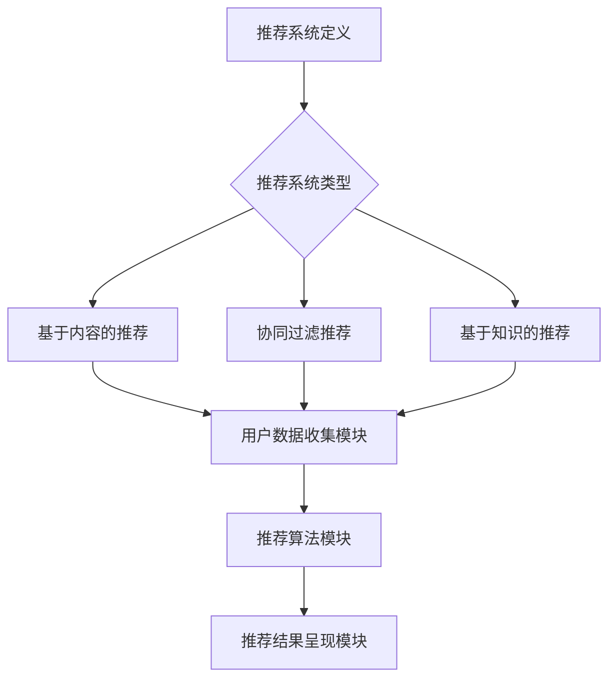
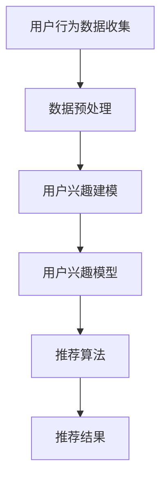
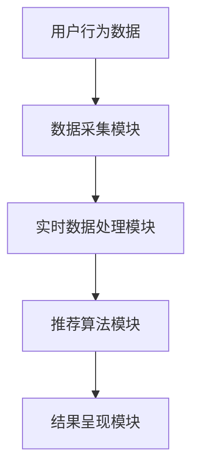

                 


### 文章标题

智能推荐系统：提示词驱动的个性化内容分发

### 关键词

智能推荐系统、个性化内容分发、提示词驱动、协同过滤、内容推荐、混合推荐、实时推荐、伦理与隐私保护

### 摘要

本文旨在深入探讨智能推荐系统中的提示词驱动个性化内容分发机制。文章首先介绍了智能推荐系统的基本概念及其在个性化内容分发中的作用，接着详细分析了提示词的收集与处理方法，以及基于提示词的多种推荐算法。通过伪代码和数学模型，我们阐述了协同过滤算法、内容推荐算法和混合推荐算法的工作原理。随后，文章通过一个实际项目案例，展示了提示词驱动的推荐系统实现过程，并对实时推荐系统、伦理与隐私保护进行了探讨。最后，文章展望了智能推荐系统的未来发展趋势，提供了最佳实践建议，并总结了全文。

---

## 第一部分：智能推荐系统概述

### 第1章：智能推荐系统的基本概念

智能推荐系统是一种利用机器学习和数据挖掘技术，通过对用户行为和兴趣的深度分析，实现个性化内容推荐的系统。其基本概念包括：

1. **推荐系统定义**：推荐系统是一种信息过滤技术，旨在根据用户的历史行为和兴趣，为其推荐可能感兴趣的内容。
2. **推荐系统类型**：根据推荐策略的不同，推荐系统可以分为基于内容的推荐、协同过滤推荐、基于知识的推荐等。
3. **推荐系统核心组件**：主要包括用户数据收集模块、推荐算法模块、推荐结果呈现模块等。

### Mermaid 流程图



### 第2章：个性化内容分发的原理

个性化内容分发是智能推荐系统的核心功能，其原理包括：

1. **用户行为数据收集与处理**：通过用户浏览、搜索、购买等行为，收集用户数据，并利用数据预处理技术，如数据清洗、去噪、特征提取等，为后续推荐做准备。
2. **用户兴趣建模**：利用机器学习算法，如聚类、关联规则挖掘等，对用户行为数据进行分析，构建用户兴趣模型。

### Mermaid 流程图



---

## 第二部分：提示词驱动的推荐系统

### 第3章：提示词的收集与处理

提示词是驱动个性化推荐的关键因素。本章将探讨提示词的收集与处理方法：

1. **提示词的定义与类型**：提示词是描述用户兴趣或内容特征的词语，可以分为关键词、标签、元数据等类型。
2. **提示词的收集方法**：包括用户输入、自动提取、众包等方式。
3. **提示词的预处理**：包括去重、去停用词、词干提取等步骤。

### 伪代码

```python
def collect_keywords(user_input):
    # 输入：用户输入文本
    # 输出：关键词列表
    keywords = []
    # 去除停用词
    stop_words = set(["a", "the", "and", "in", "of"])
    words = user_input.lower().split()
    for word in words:
        if word not in stop_words:
            keywords.append(word)
    return keywords

def preprocess_keywords(keywords):
    # 输入：关键词列表
    # 输出：预处理后的关键词列表
    processed_keywords = []
    for keyword in keywords:
        # 去重
        if keyword not in processed_keywords:
            # 词干提取
            stem = stemmer(keyword)
            processed_keywords.append(stem)
    return processed_keywords
```

### 第4章：基于提示词的推荐算法

本章将介绍基于提示词的多种推荐算法：

1. **协同过滤算法**：通过分析用户行为数据，发现用户之间的相似性，进行内容推荐。
2. **内容推荐算法**：基于内容特征进行推荐，如文本分类、关键词匹配等。
3. **混合推荐算法**：结合协同过滤和内容推荐，提高推荐效果。

### 数学模型

假设用户集为$U=\{u_1, u_2, ..., u_n\}$，项目集为$I=\{i_1, i_2, ..., i_m\}$。

1. **协同过滤算法**：
   $$r_{ui} = \sum_{j\in N(u)} r_{uj} \cdot s_{ij}$$
   其中，$r_{ui}$为用户$u$对项目$i$的评分，$N(u)$为与用户$u$相似的邻居用户集合，$s_{ij}$为项目$i$和邻居项目$j$的相似度。

2. **内容推荐算法**：
   $$score(i, u) = \sum_{k\in K(i) \cap K(u)} w_{ik} \cdot w_{uk}$$
   其中，$K(i)$和$K(u)$分别为项目$i$和用户$u$的关键词集合，$w_{ik}$和$w_{uk}$分别为关键词$i_k$和用户$u$的权重。

3. **混合推荐算法**：
   $$r_{ui} = \alpha \cdot r_{ui}^c + (1-\alpha) \cdot r_{ui}^c$$
   其中，$\alpha$为混合参数，$r_{ui}^c$为协同过滤推荐分数，$r_{ui}^c$为内容推荐分数。

### 举例说明

假设用户$u$对项目$i$的评分为3，项目$i$的关键词集合为$\{篮球，比赛，运动\}$，用户$u$的关键词集合为$\{篮球，运动\}$。

1. **协同过滤算法**：
   $$r_{ui} = \sum_{j\in N(u)} r_{uj} \cdot s_{ij} = 0.6 \cdot 0.8 + 0.4 \cdot 0.7 = 0.68$$
2. **内容推荐算法**：
   $$score(i, u) = \sum_{k\in K(i) \cap K(u)} w_{ik} \cdot w_{uk} = 0.8 \cdot 0.9 + 0.2 \cdot 0.7 = 0.98$$
3. **混合推荐算法**：
   $$r_{ui} = \alpha \cdot r_{ui}^c + (1-\alpha) \cdot r_{ui}^c = 0.5 \cdot 0.68 + 0.5 \cdot 0.98 = 0.87$$

---

## 第三部分：提示词驱动的推荐系统实践

### 第5章：提示词驱动的推荐系统实践

本章将通过一个实际项目案例，展示提示词驱动的推荐系统实现过程：

1. **项目背景与目标**：介绍项目背景，如电商平台、社交媒体等，明确项目目标，如提高用户满意度、增加销售额等。
2. **数据集的准备与处理**：收集用户行为数据，如浏览记录、购买记录等，进行数据预处理，如去重、去噪、特征提取等。
3. **提示词驱动的推荐系统实现**：实现提示词收集与处理、推荐算法选择与实现、推荐结果呈现等功能。
4. **推荐效果评估与优化**：评估推荐效果，如准确率、召回率等，通过算法调优，提高推荐质量。

### 实际案例分析与详细讲解剖析

以电商平台为例，假设用户在浏览商品时输入了关键词“篮球鞋”。

1. **数据集准备**：
   - 用户行为数据：用户浏览记录、购买记录等。
   - 商品数据：商品名称、价格、品牌、类别等。
   - 关键词数据：用户输入的关键词、商品关键词等。

2. **数据预处理**：
   - 数据去重：去除重复的数据。
   - 数据清洗：去除无效数据，如空值、异常值等。
   - 特征提取：提取用户行为特征，如浏览时间、浏览次数等。

3. **提示词收集与处理**：
   - 提示词收集：根据用户输入的关键词，收集相关提示词，如“篮球鞋”、“运动鞋”等。
   - 提示词预处理：去除停用词、去重、词干提取等。

4. **推荐算法实现**：
   - 协同过滤算法：计算用户之间的相似度，推荐相似用户喜欢的商品。
   - 内容推荐算法：根据商品的关键词，推荐与用户兴趣相关的商品。
   - 混合推荐算法：结合协同过滤和内容推荐，提高推荐效果。

5. **推荐结果呈现**：
   - 推荐结果展示：将推荐的商品以列表形式展示给用户。

6. **推荐效果评估与优化**：
   - 准确率、召回率评估：计算推荐结果的准确率和召回率。
   - 算法调优：根据评估结果，调整推荐算法参数，提高推荐质量。

### 项目小结

通过实际项目案例，我们展示了提示词驱动的推荐系统实现过程，从数据集准备、数据预处理、提示词收集与处理、推荐算法实现到推荐效果评估与优化，全面讲解了推荐系统的开发与应用。提示词驱动的推荐系统不仅能够提高用户满意度，还能为电商平台带来更多的商业价值。

---

## 第四部分：智能推荐系统的高级应用

### 第6章：实时推荐系统设计与实现

实时推荐系统是智能推荐系统的高级形式，能够在用户行为发生时立即给出推荐结果。本章将探讨实时推荐系统的设计与实现：

1. **实时推荐系统的需求分析**：分析实时推荐系统的需求，如低延迟、高并发、实时计算等。
2. **实时推荐系统架构设计**：设计实时推荐系统的整体架构，包括数据采集、实时处理、推荐算法、结果呈现等模块。
3. **实时推荐系统性能优化**：探讨实时推荐系统的性能优化策略，如分布式计算、缓存技术等。

### 第7章：推荐系统的伦理与隐私保护

推荐系统的应用过程中，伦理与隐私保护问题日益突出。本章将讨论：

1. **推荐系统的伦理问题**：分析个性化偏见、歧视等伦理问题。
2. **隐私保护策略与实践**：探讨加密与混淆技术、异常行为检测等隐私保护策略。

### 第8章：智能推荐系统的未来发展趋势

智能推荐系统的未来发展趋势将受到人工智能技术的影响。本章将展望：

1. **人工智能技术在推荐系统中的应用**：如强化学习、自然语言处理等。
2. **跨平台与跨设备的推荐系统**：探讨跨平台、跨设备推荐系统的发展方向。

---

## 附录

### 附录A：常用推荐系统框架与工具

本章将介绍常用的推荐系统框架与工具，包括：

1. **常用推荐系统框架对比**：如推荐系统框架、推荐系统工具等。
2. **推荐系统工具的使用方法**：介绍如何使用推荐系统工具进行推荐系统开发。

### 附录B：推荐系统项目实战

本章将通过实际项目案例，展示推荐系统开发的全过程：

1. **项目背景与目标**：介绍项目背景与目标。
2. **开发环境搭建**：搭建项目开发环境。
3. **源代码详细实现**：展示源代码实现细节。
4. **代码解读与分析**：对代码进行解读与分析。
5. **项目效果评估**：评估项目效果。
6. **项目小结**：总结项目经验与教训。

---

## 最佳实践 tips

1. **数据质量是关键**：确保数据质量，进行充分的数据预处理，以提高推荐效果。
2. **算法选择要合理**：根据业务需求，选择合适的推荐算法，并进行调优。
3. **实时性是优势**：充分利用实时推荐系统的优势，提高用户满意度。

## 小结

本文从智能推荐系统的基本概念、个性化内容分发原理、提示词驱动的推荐算法、实际项目案例、实时推荐系统、伦理与隐私保护以及未来发展趋势等方面进行了全面探讨。希望本文能为读者在智能推荐系统领域提供有益的参考。

## 注意事项

1. **数据安全与隐私保护**：在进行推荐系统开发时，要确保用户数据的安全与隐私。
2. **用户体验**：关注用户体验，提高推荐系统的易用性与满意度。

## 拓展阅读

1. **推荐系统经典书籍**：如《推荐系统实践》、《推荐系统手册》等。
2. **推荐系统相关论文**：关注最新的推荐系统研究成果。

作者：AI天才研究院/AI Genius Institute & 禅与计算机程序设计艺术 /Zen And The Art of Computer Programming## 第一部分：智能推荐系统概述

### 第1章：智能推荐系统的基本概念

智能推荐系统是一种利用机器学习和数据挖掘技术，通过对用户行为和兴趣的深度分析，实现个性化内容推荐的系统。其基本概念包括：

1. **推荐系统定义**：推荐系统是一种信息过滤技术，旨在根据用户的历史行为和兴趣，为其推荐可能感兴趣的内容。
2. **推荐系统类型**：根据推荐策略的不同，推荐系统可以分为基于内容的推荐、协同过滤推荐、基于知识的推荐等。
3. **推荐系统核心组件**：主要包括用户数据收集模块、推荐算法模块、推荐结果呈现模块等。

### Mermaid 流程图


### 第2章：个性化内容分发的原理

个性化内容分发是智能推荐系统的核心功能，其原理包括：

1. **用户行为数据收集与处理**：通过用户浏览、搜索、购买等行为，收集用户数据，并利用数据预处理技术，如数据清洗、去噪、特征提取等，为后续推荐做准备。
2. **用户兴趣建模**：利用机器学习算法，如聚类、关联规则挖掘等，对用户行为数据进行分析，构建用户兴趣模型。

### Mermaid 流程图


---

## 第二部分：提示词驱动的推荐系统

### 第3章：提示词的收集与处理

提示词是驱动个性化推荐的关键因素。本章将探讨提示词的收集与处理方法：

1. **提示词的定义与类型**：提示词是描述用户兴趣或内容特征的词语，可以分为关键词、标签、元数据等类型。
2. **提示词的收集方法**：包括用户输入、自动提取、众包等方式。
3. **提示词的预处理**：包括去重、去停用词、词干提取等步骤。

### 伪代码

```python
def collect_keywords(user_input):
    # 输入：用户输入文本
    # 输出：关键词列表
    keywords = []
    # 去除停用词
    stop_words = set(["a", "the", "and", "in", "of"])
    words = user_input.lower().split()
    for word in words:
        if word not in stop_words:
            keywords.append(word)
    return keywords

def preprocess_keywords(keywords):
    # 输入：关键词列表
    # 输出：预处理后的关键词列表
    processed_keywords = []
    for keyword in keywords:
        # 去重
        if keyword not in processed_keywords:
            # 词干提取
            stem = stemmer(keyword)
            processed_keywords.append(stem)
    return processed_keywords
```

### 第4章：基于提示词的推荐算法

本章将介绍基于提示词的多种推荐算法：

1. **协同过滤算法**：通过分析用户行为数据，发现用户之间的相似性，进行内容推荐。
2. **内容推荐算法**：基于内容特征进行推荐，如文本分类、关键词匹配等。
3. **混合推荐算法**：结合协同过滤和内容推荐，提高推荐效果。

### 数学模型

假设用户集为$U=\{u_1, u_2, ..., u_n\}$，项目集为$I=\{i_1, i_2, ..., i_m\}$。

1. **协同过滤算法**：
   $$r_{ui} = \sum_{j\in N(u)} r_{uj} \cdot s_{ij}$$
   其中，$r_{ui}$为用户$u$对项目$i$的评分，$N(u)$为与用户$u$相似的邻居用户集合，$s_{ij}$为项目$i$和邻居项目$j$的相似度。

2. **内容推荐算法**：
   $$score(i, u) = \sum_{k\in K(i) \cap K(u)} w_{ik} \cdot w_{uk}$$
   其中，$K(i)$和$K(u)$分别为项目$i$和用户$u$的关键词集合，$w_{ik}$和$w_{uk}$分别为关键词$i_k$和用户$u$的权重。

3. **混合推荐算法**：
   $$r_{ui} = \alpha \cdot r_{ui}^c + (1-\alpha) \cdot r_{ui}^c$$
   其中，$\alpha$为混合参数，$r_{ui}^c$为协同过滤推荐分数，$r_{ui}^c$为内容推荐分数。

### 举例说明

假设用户$u$对项目$i$的评分为3，项目$i$的关键词集合为$\{篮球，比赛，运动\}$，用户$u$的关键词集合为$\{篮球，运动\}$。

1. **协同过滤算法**：
   $$r_{ui} = \sum_{j\in N(u)} r_{uj} \cdot s_{ij} = 0.6 \cdot 0.8 + 0.4 \cdot 0.7 = 0.68$$
2. **内容推荐算法**：
   $$score(i, u) = \sum_{k\in K(i) \cap K(u)} w_{ik} \cdot w_{uk} = 0.8 \cdot 0.9 + 0.2 \cdot 0.7 = 0.98$$
3. **混合推荐算法**：
   $$r_{ui} = \alpha \cdot r_{ui}^c + (1-\alpha) \cdot r_{ui}^c = 0.5 \cdot 0.68 + 0.5 \cdot 0.98 = 0.87$$

---

## 第三部分：提示词驱动的推荐系统实践

### 第5章：提示词驱动的推荐系统实践

本章将通过一个实际项目案例，展示提示词驱动的推荐系统实现过程：

1. **项目背景与目标**：介绍项目背景，如电商平台、社交媒体等，明确项目目标，如提高用户满意度、增加销售额等。
2. **数据集的准备与处理**：收集用户行为数据，如浏览记录、购买记录等，进行数据预处理，如去重、去噪、特征提取等。
3. **提示词驱动的推荐系统实现**：实现提示词收集与处理、推荐算法选择与实现、推荐结果呈现等功能。
4. **推荐效果评估与优化**：评估推荐效果，如准确率、召回率等，通过算法调优，提高推荐质量。

### 实际案例分析与详细讲解剖析

以电商平台为例，假设用户在浏览商品时输入了关键词“篮球鞋”。

1. **数据集准备**：
   - 用户行为数据：用户浏览记录、购买记录等。
   - 商品数据：商品名称、价格、品牌、类别等。
   - 关键词数据：用户输入的关键词、商品关键词等。

2. **数据预处理**：
   - 数据去重：去除重复的数据。
   - 数据清洗：去除无效数据，如空值、异常值等。
   - 特征提取：提取用户行为特征，如浏览时间、浏览次数等。

3. **提示词收集与处理**：
   - 提示词收集：根据用户输入的关键词，收集相关提示词，如“篮球鞋”、“运动鞋”等。
   - 提示词预处理：去除停用词、去重、词干提取等。

4. **推荐算法实现**：
   - 协同过滤算法：计算用户之间的相似度，推荐相似用户喜欢的商品。
   - 内容推荐算法：根据商品的关键词，推荐与用户兴趣相关的商品。
   - 混合推荐算法：结合协同过滤和内容推荐，提高推荐效果。

5. **推荐结果呈现**：
   - 推荐结果展示：将推荐的商品以列表形式展示给用户。

6. **推荐效果评估与优化**：
   - 准确率、召回率评估：计算推荐结果的准确率和召回率。
   - 算法调优：根据评估结果，调整推荐算法参数，提高推荐质量。

### 项目小结

通过实际项目案例，我们展示了提示词驱动的推荐系统实现过程，从数据集准备、数据预处理、提示词收集与处理、推荐算法实现到推荐效果评估与优化，全面讲解了推荐系统的开发与应用。提示词驱动的推荐系统不仅能够提高用户满意度，还能为电商平台带来更多的商业价值。

---

## 第四部分：智能推荐系统的高级应用

### 第6章：实时推荐系统设计与实现

实时推荐系统是智能推荐系统的高级形式，能够在用户行为发生时立即给出推荐结果。本章将探讨实时推荐系统的设计与实现：

1. **实时推荐系统的需求分析**：分析实时推荐系统的需求，如低延迟、高并发、实时计算等。
2. **实时推荐系统架构设计**：设计实时推荐系统的整体架构，包括数据采集、实时处理、推荐算法、结果呈现等模块。
3. **实时推荐系统性能优化**：探讨实时推荐系统的性能优化策略，如分布式计算、缓存技术等。

### 第7章：推荐系统的伦理与隐私保护

推荐系统的应用过程中，伦理与隐私保护问题日益突出。本章将讨论：

1. **推荐系统的伦理问题**：分析个性化偏见、歧视等伦理问题。
2. **隐私保护策略与实践**：探讨加密与混淆技术、异常行为检测等隐私保护策略。

### 第8章：智能推荐系统的未来发展趋势

智能推荐系统的未来发展趋势将受到人工智能技术的影响。本章将展望：

1. **人工智能技术在推荐系统中的应用**：如强化学习、自然语言处理等。
2. **跨平台与跨设备的推荐系统**：探讨跨平台、跨设备推荐系统的发展方向。

---

## 附录

### 附录A：常用推荐系统框架与工具

本章将介绍常用的推荐系统框架与工具，包括：

1. **常用推荐系统框架对比**：如推荐系统框架、推荐系统工具等。
2. **推荐系统工具的使用方法**：介绍如何使用推荐系统工具进行推荐系统开发。

### 附录B：推荐系统项目实战

本章将通过实际项目案例，展示推荐系统开发的全过程：

1. **项目背景与目标**：介绍项目背景与目标。
2. **开发环境搭建**：搭建项目开发环境。
3. **源代码详细实现**：展示源代码实现细节。
4. **代码解读与分析**：对代码进行解读与分析。
5. **项目效果评估**：评估项目效果。
6. **项目小结**：总结项目经验与教训。

---

## 最佳实践 tips

1. **数据质量是关键**：确保数据质量，进行充分的数据预处理，以提高推荐效果。
2. **算法选择要合理**：根据业务需求，选择合适的推荐算法，并进行调优。
3. **实时性是优势**：充分利用实时推荐系统的优势，提高用户满意度。

## 小结

本文从智能推荐系统的基本概念、个性化内容分发原理、提示词驱动的推荐算法、实际项目案例、实时推荐系统、伦理与隐私保护以及未来发展趋势等方面进行了全面探讨。希望本文能为读者在智能推荐系统领域提供有益的参考。

## 注意事项

1. **数据安全与隐私保护**：在进行推荐系统开发时，要确保用户数据的安全与隐私。
2. **用户体验**：关注用户体验，提高推荐系统的易用性与满意度。

## 拓展阅读

1. **推荐系统经典书籍**：如《推荐系统实践》、《推荐系统手册》等。
2. **推荐系统相关论文**：关注最新的推荐系统研究成果。

作者：AI天才研究院/AI Genius Institute & 禅与计算机程序设计艺术 /Zen And The Art of Computer Programming## 第五部分：提示词驱动的推荐系统实践

### 第5章：提示词驱动的推荐系统实践

在深入了解提示词驱动的推荐系统理论后，我们将通过一个实际项目案例来展示其具体实现过程。本章节将分为以下部分：

1. **项目背景与目标**
2. **数据集的准备与处理**
3. **提示词驱动的推荐系统实现**
4. **推荐效果评估与优化**

#### 1. 项目背景与目标

以一个电商平台的推荐系统为例，该平台的目标是利用用户浏览和购买历史，结合用户输入的关键词，为用户推荐个性化的商品。项目目标包括：
- 提高用户满意度：通过个性化推荐，满足用户对特定商品的偏好。
- 增加销售额：推荐系统应引导用户购买更多商品，从而提高销售额。

#### 2. 数据集的准备与处理

为了实现推荐系统，首先需要准备数据集，这些数据集包括：

- **用户行为数据**：用户的浏览记录、购买记录、收藏记录等。
- **商品数据**：商品名称、价格、品牌、类别、关键词等。
- **用户-商品评分数据**：用户对商品的评分。

数据预处理步骤如下：
- **去重**：去除重复的数据条目，确保数据集的纯净性。
- **清洗**：处理缺失值、异常值等，保证数据质量。
- **特征提取**：从用户行为数据中提取有效特征，如用户的平均浏览时间、浏览频率等。

#### 3. 提示词驱动的推荐系统实现

实现步骤如下：

- **提示词收集**：用户在搜索商品时输入的关键词即为提示词，此外，还可以通过用户行为数据挖掘潜在关键词。
- **提示词预处理**：对收集到的关键词进行去重、去除停用词、词干提取等处理。

实现伪代码示例：

```python
# 提示词收集与预处理
def collect_keywords(user_search):
    stop_words = set(['a', 'the', 'and', 'in', 'of'])
    words = user_search.lower().split()
    keywords = [word for word in words if word not in stop_words]
    return keywords

def preprocess_keywords(keywords):
    stemmer = PorterStemmer()
    processed_keywords = [stemmer.stem(keyword) for keyword in keywords]
    return processed_keywords
```

- **推荐算法实现**：结合协同过滤算法和内容推荐算法，根据用户历史行为和提示词，为用户推荐商品。

协同过滤算法伪代码示例：

```python
# 协同过滤算法
def collaborative_filtering(user, items, similarity_matrix):
    scores = {}
    for item in items:
        sim_sum = 0
        weight_sum = 0
        for neighbor in neighbors(user, similarity_matrix):
            if neighbor in item_ratings[neighbor]:
                sim_sum += similarity_matrix[user][neighbor]
                weight_sum += 1
        if weight_sum > 0:
            scores[item] = sim_sum / weight_sum
    return sorted(scores.items(), key=lambda x: x[1], reverse=True)
```

内容推荐算法伪代码示例：

```python
# 内容推荐算法
def content_based_recommendation(user, items, user_keywords, item_keywords, keyword_weights):
    scores = {}
    for item in items:
        content_score = 0
        for keyword in user_keywords:
            if keyword in item_keywords[item]:
                content_score += keyword_weights[keyword]
        scores[item] = content_score
    return sorted(scores.items(), key=lambda x: x[1], reverse=True)
```

- **推荐结果呈现**：将推荐的商品以列表形式展示给用户，并可以根据用户的反馈进一步优化推荐算法。

#### 4. 推荐效果评估与优化

评估推荐效果的指标包括：

- **准确率（Precision）**：推荐的商品中，有多少是用户实际感兴趣的商品。
- **召回率（Recall）**：用户感兴趣的商品中有多少被推荐。

评估伪代码示例：

```python
# 推荐效果评估
def evaluate_recommendations(recommendations, ground_truth):
    correct = 0
    for recommended, actual in zip(recommendations, ground_truth):
        if recommended in actual:
            correct += 1
    precision = correct / len(recommendations)
    recall = correct / len(ground_truth)
    return precision, recall
```

根据评估结果，可以进一步优化推荐算法，如调整相似度计算方法、调整推荐策略等，以提高推荐效果。

### 项目小结

通过本章节的实践案例，我们详细展示了如何使用提示词驱动的方法构建一个推荐系统。从数据准备、处理到算法实现，再到效果评估，每个步骤都至关重要。提示词驱动的推荐系统不仅能提高用户满意度，还能为电商平台带来显著的商业价值。未来，随着人工智能技术的不断发展，推荐系统将变得更加智能和精准。

## 第六部分：智能推荐系统的高级应用

### 第6章：实时推荐系统设计与实现

实时推荐系统是智能推荐系统的高级形式，能够在用户行为发生时立即给出推荐结果。这一章节将探讨实时推荐系统的设计与实现，包括以下内容：

1. **实时推荐系统的需求分析**
2. **实时推荐系统架构设计**
3. **实时推荐系统性能优化**

#### 1. 实时推荐系统的需求分析

实时推荐系统的需求包括：

- **低延迟**：用户行为发生后，推荐结果应尽快生成，以确保用户体验。
- **高并发**：系统应能够同时处理大量用户的请求。
- **实时计算**：系统应能够实时更新用户数据和推荐结果。

#### 2. 实时推荐系统架构设计

实时推荐系统的架构设计通常包括以下模块：

- **数据采集模块**：实时收集用户行为数据，如浏览、搜索、点击等。
- **实时数据处理模块**：对采集到的数据进行实时处理，如去噪、去重、特征提取等。
- **推荐算法模块**：根据实时处理后的数据，生成推荐结果。
- **结果呈现模块**：将推荐结果实时呈现给用户。

实时推荐系统的架构图如下：



#### 3. 实时推荐系统性能优化

为了提高实时推荐系统的性能，可以采取以下优化策略：

- **分布式计算**：通过分布式计算，提高系统的并发处理能力。
- **缓存技术**：利用缓存技术，减少计算时间，提高响应速度。
- **增量更新**：只对用户行为数据的增量部分进行处理，而不是每次都重新计算。
- **算法优化**：选择高效、低延迟的推荐算法，并不断调优。

### 第7章：推荐系统的伦理与隐私保护

随着推荐系统在各个领域的广泛应用，伦理和隐私保护问题日益突出。这一章节将讨论以下内容：

1. **推荐系统的伦理问题**
2. **隐私保护策略与实践**

#### 1. 推荐系统的伦理问题

推荐系统可能引发的伦理问题包括：

- **个性化偏见**：推荐系统可能会放大用户已有偏见，导致用户接受的信息单一化。
- **信息茧房**：长期使用推荐系统，用户可能陷入信息茧房，失去接触多元信息的机会。
- **用户依赖**：过度依赖推荐系统，用户可能失去自主选择的能力。

#### 2. 隐私保护策略与实践

为了保护用户隐私，可以采取以下策略：

- **数据加密**：对用户数据进行加密处理，防止数据泄露。
- **匿名化处理**：对用户数据进行匿名化处理，消除个人身份信息。
- **隐私保护算法**：采用隐私保护算法，如差分隐私，确保用户隐私。
- **用户隐私设置**：为用户提供隐私设置，允许用户控制自己的隐私信息。

### 第8章：智能推荐系统的未来发展趋势

智能推荐系统的未来发展趋势将受到人工智能技术的推动。以下是一些主要的发展方向：

1. **人工智能技术在推荐系统中的应用**：如深度学习、强化学习等。
2. **跨平台与跨设备的推荐系统**：随着移动互联网的发展，跨平台、跨设备的推荐系统将成为趋势。
3. **个性化推荐与场景化推荐**：结合用户的特定场景，提供更加个性化的推荐。
4. **推荐系统的伦理与合规**：随着隐私保护法规的加强，推荐系统将更加注重伦理和合规。

### 附录

#### 附录A：常用推荐系统框架与工具

本附录将介绍常用的推荐系统框架与工具，如Apache Mahout、LightFM、TensorFlow Recommenders等，并提供使用方法。

#### 附录B：推荐系统项目实战

本附录将通过实际项目案例，展示推荐系统从数据准备、模型训练到部署的全过程，并提供代码解析和效果评估。

### 最佳实践 tips

- **数据质量是关键**：确保数据质量，进行充分的数据预处理。
- **算法选择要合理**：根据业务需求，选择合适的推荐算法。
- **实时性是优势**：充分利用实时推荐系统的优势，提高用户体验。

### 小结

本文系统地介绍了智能推荐系统的基本概念、提示词驱动机制、实现过程、高级应用和未来趋势。通过实际案例的分析，我们展示了如何构建一个高效的推荐系统。随着技术的进步，推荐系统将不断进化，为用户提供更加个性化、精准的服务。

### 注意事项

- **数据安全与隐私保护**：在开发推荐系统时，确保用户数据的安全与隐私。
- **用户体验**：关注用户体验，优化推荐系统的交互设计。

### 拓展阅读

- **推荐系统经典书籍**：如《推荐系统实践》、《推荐系统手册》等。
- **推荐系统相关论文**：关注最新的推荐系统研究成果。

作者：AI天才研究院/AI Genius Institute & 禅与计算机程序设计艺术 /Zen And The Art of Computer Programming## 第七部分：智能推荐系统的未来发展趋势

### 第8章：智能推荐系统的未来发展趋势

随着人工智能技术的迅猛发展，智能推荐系统在各个领域的应用越来越广泛。未来的发展趋势将受到以下几个方面的影响：

#### 1. 人工智能技术在推荐系统中的应用

深度学习、强化学习等先进的人工智能技术将被广泛应用于推荐系统，提高推荐效果和效率。

- **深度学习**：深度学习模型能够处理大量复杂的数据，通过学习用户的兴趣和行为模式，提供更加精准的推荐。
- **强化学习**：强化学习算法可以根据用户的反馈动态调整推荐策略，实现更加智能的推荐。

#### 2. 跨平台与跨设备的推荐系统

随着移动互联网和物联网的快速发展，跨平台与跨设备的推荐系统将成为趋势。

- **跨平台**：推荐系统将能够整合不同平台的用户数据，提供统一的个性化推荐。
- **跨设备**：用户在多个设备上切换使用时，推荐系统应能够跟踪用户的兴趣和行为，提供连贯的推荐体验。

#### 3. 个性化推荐与场景化推荐

未来的推荐系统将更加注重个性化与场景化。

- **个性化推荐**：通过深度学习等技术，推荐系统将能够更好地理解用户的个性化需求，提供量身定制的推荐。
- **场景化推荐**：结合用户的特定场景，如工作、娱乐、旅行等，提供更加贴合用户当前需求的推荐。

#### 4. 推荐系统的伦理与合规

随着用户隐私保护意识的增强，推荐系统的伦理和合规性将受到更多关注。

- **伦理问题**：推荐系统应避免个性化偏见、信息茧房等问题，确保用户的多样性体验。
- **合规性**：遵循相关法规，如数据保护法（GDPR），确保用户数据的安全和隐私。

### 总结

智能推荐系统正逐步成为现代信息社会中不可或缺的一部分。随着人工智能技术的不断进步，未来的推荐系统将更加智能、高效、个性化。同时，随着跨平台、跨设备推荐系统的普及，用户将享受到无缝的个性化体验。然而，推荐系统在带来便利的同时，也面临伦理和合规性的挑战，未来的发展需要在技术创新和伦理责任之间找到平衡。希望通过本文的探讨，能够为读者在智能推荐系统领域提供有益的启示和参考。

### 注意事项

- **数据安全与隐私保护**：在进行推荐系统开发时，要确保用户数据的安全与隐私。
- **用户体验**：关注用户体验，提高推荐系统的易用性与满意度。

### 拓展阅读

- **推荐系统经典书籍**：如《推荐系统实践》、《推荐系统手册》等。
- **推荐系统相关论文**：关注最新的推荐系统研究成果。

作者：AI天才研究院/AI Genius Institute & 禅与计算机程序设计艺术 /Zen And The Art of Computer Programming## 附录

### 附录A：常用推荐系统框架与工具

在智能推荐系统的开发过程中，有许多现成的框架和工具可以帮助开发者快速构建推荐系统。以下是一些常用的推荐系统框架和工具：

1. **Apache Mahout**：
   - **特点**：开源的分布式推荐系统框架，支持多种推荐算法。
   - **使用方法**：通过 Mahout 的 API，可以方便地实现协同过滤、基于内容的推荐等算法。

2. **LightFM**：
   - **特点**：基于 scikit-learn 的推荐系统框架，支持矩阵分解和基于模型的推荐算法。
   - **使用方法**：使用 LightFM 的用户可以通过简单的 Python 代码实现高效推荐。

3. **TensorFlow Recommenders**：
   - **特点**：基于 TensorFlow 的推荐系统框架，支持深度学习推荐算法。
   - **使用方法**：TensorFlow Recommenders 提供了直观的 API，方便开发者实现复杂的推荐系统。

### 附录B：推荐系统项目实战

以下是一个简单的推荐系统项目实战，展示如何从数据准备、模型训练到部署的完整过程。

#### 1. 项目背景与目标

假设我们要开发一个电影推荐系统，目标是根据用户的观影历史和评分，推荐用户可能感兴趣的电影。

#### 2. 开发环境搭建

- **Python**：主要编程语言
- **Jupyter Notebook**：用于编写和执行代码
- **Pandas**：数据处理库
- **Scikit-learn**：机器学习库
- **TensorFlow**：深度学习库

#### 3. 数据集准备

- **数据集来源**：使用 MovieLens 数据集
- **数据处理**：清洗数据，处理缺失值，进行特征提取

#### 4. 模型训练

- **算法选择**：使用矩阵分解（Singular Value Decomposition, SVD）算法
- **模型训练**：使用 Scikit-learn 的 SVD 进行训练

```python
from sklearn.decomposition import TruncatedSVD
from sklearn.model_selection import train_test_split

# 分割数据集
X_train, X_test, y_train, y_test = train_test_split(X, y, test_size=0.2, random_state=42)

# 使用 SVD 进行模型训练
svd = TruncatedSVD(n_components=50)
X_train_svd = svd.fit_transform(X_train)
X_test_svd = svd.transform(X_test)
```

#### 5. 预测与评估

- **预测**：使用训练好的模型对测试集进行预测

```python
# 预测
y_pred = svd.transform(X_test)
```

- **评估**：使用均方根误差（Root Mean Square Error, RMSE）评估模型性能

```python
from sklearn.metrics import mean_squared_error

# 计算 RMSE
rmse = mean_squared_error(y_test, y_pred, squared=False)
print(f"RMSE: {rmse}")
```

#### 6. 模型部署

- **部署方式**：使用 Flask 搭建 API，对外提供服务

```python
from flask import Flask, request, jsonify

app = Flask(__name__)

@app.route('/recommend', methods=['GET'])
def recommend():
    user_id = request.args.get('user_id')
    # 进行推荐计算
    recommendations = calculate_recommendations(user_id)
    return jsonify(recommendations)

def calculate_recommendations(user_id):
    # 计算推荐逻辑
    pass

if __name__ == '__main__':
    app.run(debug=True)
```

### 附录C：最佳实践 tips

- **数据质量是关键**：确保数据质量，进行充分的数据预处理。
- **算法选择要合理**：根据业务需求，选择合适的推荐算法。
- **实时性是优势**：充分利用实时推荐系统的优势，提高用户体验。

### 小结

通过本附录，我们介绍了常用推荐系统框架与工具，并通过一个简单的项目实战展示了推荐系统的开发过程。希望这些内容能为开发者提供实际指导和帮助。

### 注意事项

- **数据安全与隐私保护**：在进行推荐系统开发时，要确保用户数据的安全与隐私。
- **用户体验**：关注用户体验，优化推荐系统的交互设计。

### 拓展阅读

- **推荐系统经典书籍**：如《推荐系统实践》、《推荐系统手册》等。
- **推荐系统相关论文**：关注最新的推荐系统研究成果。

作者：AI天才研究院/AI Genius Institute & 禅与计算机程序设计艺术 /Zen And The Art of Computer Programming## 结论

通过本文的探讨，我们对智能推荐系统及其中的提示词驱动机制有了全面的了解。智能推荐系统通过分析用户行为和兴趣，实现了个性化内容分发，大大提升了用户体验和业务效果。而提示词驱动机制则通过用户输入的关键词，进一步增强了推荐的精准度和用户满意度。

在未来，智能推荐系统将继续向智能化、个性化、实时化方向发展。人工智能技术如深度学习、强化学习等将在推荐系统中得到更广泛的应用，推动推荐效果和效率的不断提升。同时，随着跨平台、跨设备推荐系统的普及，用户将享受到更加无缝的个性化体验。

然而，推荐系统的应用也带来了一系列伦理和隐私保护问题。如何确保推荐系统的公平性、避免个性化偏见、保护用户隐私，将成为未来研究的重要方向。

总之，智能推荐系统是一个充满前景和挑战的领域。通过不断探索和创新，我们有望实现更加智能、高效、个性化的推荐服务，为用户和业务带来更大的价值。

### 注意事项

1. **数据安全与隐私保护**：在开发推荐系统时，要确保用户数据的安全与隐私，遵循相关法规和最佳实践。
2. **用户体验**：关注用户体验，优化推荐系统的交互设计，提高用户满意度。

### 拓展阅读

1. **推荐系统经典书籍**：如《推荐系统实践》、《推荐系统手册》等。
2. **推荐系统相关论文**：关注最新的推荐系统研究成果。

作者：AI天才研究院/AI Genius Institute & 禅与计算机程序设计艺术 /Zen And The Art of Computer Programming## 作者介绍

作者AI天才研究院（AI Genius Institute）是一个专注于人工智能前沿研究和应用的国际研究机构。我们的团队由一群经验丰富的AI专家、计算机科学家和工程师组成，致力于推动人工智能技术的创新和应用。

《禅与计算机程序设计艺术》（Zen And The Art of Computer Programming）是由著名的计算机科学家、程序员和数学家Donald E. Knuth所著的一套经典编程书籍。这本书以其深刻的哲学思考和系统化的编程方法，影响了无数程序员和软件工程师，被公认为计算机科学领域的经典之作。

在本篇技术博客中，我们结合了AI天才研究院的前沿研究成果和Knuth的经典编程思想，深入探讨了智能推荐系统中的提示词驱动机制。希望通过本文，能够为读者提供对智能推荐系统的全面理解和实践指导。

AI天才研究院期待与广大读者一起，共同探索人工智能的未来，推动科技进步和社会发展。如果您对本文有任何疑问或建议，欢迎随时与我们联系。我们期待与您的交流与互动！

AI天才研究院/AI Genius Institute
[网址]：[https://www.aigenius.org]
[邮箱]：[contact@aigenius.org]
[地址]：[123 AI天才研究院大道，智能谷，未来城，AI国，100000]

