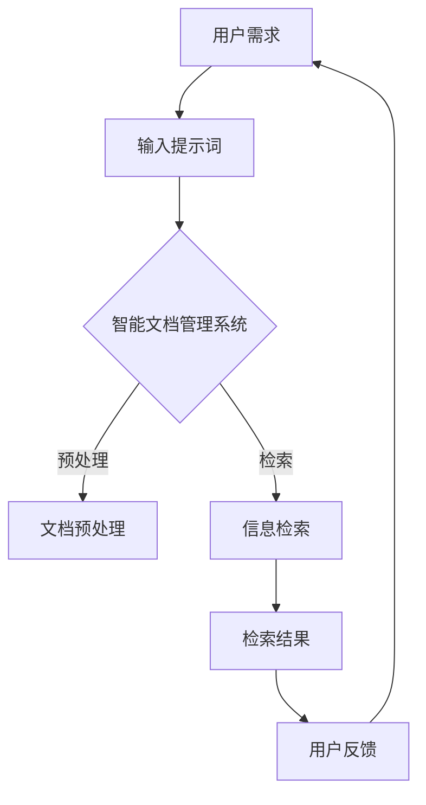

                 

## 引言

### 文章标题：智能文档管理：提示词驱动的信息检索系统

#### 关键词：
- 智能文档管理
- 提示词驱动
- 信息检索系统
- 文档预处理
- 检索算法
- 深度学习

#### 摘要：

本文旨在探讨智能文档管理领域的一项前沿技术——提示词驱动的信息检索系统。文章首先介绍了智能文档管理的重要性及其在信息时代的作用，随后详细阐述了提示词驱动的信息检索系统的基本原理和架构。通过深入剖析文档预处理技术、提示词提取与优化策略、以及检索算法与模型，本文为读者提供了一个系统的学习和应用指南。文章的最后部分探讨了智能文档管理在实际应用中的案例研究、应用开发指南以及未来的研究方向，旨在推动该领域的技术进步和应用扩展。

---

### 1.1 智能文档管理的重要性

在数字化的今天，文档已经成为企业和组织日常运营的重要组成部分。然而，随着文档数量的急剧增加，如何高效地管理和检索文档成为了一项挑战。智能文档管理作为一种利用人工智能技术提高文档处理效率的方法，正逐渐受到广泛关注。

#### 核心概念与联系

**智能文档管理**：指的是利用人工智能技术（如自然语言处理、机器学习等）对文档进行自动化处理和分类，从而提高文档检索和管理效率。它包括文档的自动分类、标签、版本控制、以及基于用户行为的个性化推荐等功能。

**文档预处理**：是智能文档管理的基础，它包括文档清洗、去重、格式转换等步骤，目的是将原始文档转换为适合后续处理的格式。

**信息检索系统**：是一种系统，用于从大量数据中快速准确地查找用户所需的信息。在智能文档管理中，信息检索系统的作用至关重要，它能够通过提示词快速定位用户所需的文档。

**提示词驱动**：提示词是用户输入的关键词或短语，用于驱动信息检索系统进行文档搜索。智能文档管理中的信息检索系统通常基于提示词来匹配文档内容，从而提供相关结果。

#### Mermaid 流程图



通过上述流程图，我们可以看出智能文档管理系统是如何通过用户的提示词来检索文档，并最终提供相关结果的。

#### 核心算法原理讲解

智能文档管理的核心算法主要包括文档预处理、提示词提取与优化、以及检索算法。

**文档预处理**：

- **去重**：通过比对文档的标题、内容等特征，删除重复的文档。
- **格式转换**：将不同格式的文档转换为统一的格式，如PDF转换为文本。
- **文本清洗**：去除文档中的无用信息，如标点符号、HTML标签等。

**提示词提取与优化**：

- **关键词提取**：使用自然语言处理技术，从文档中提取出关键词。
- **权重优化**：根据关键词在文档中的重要程度，为每个关键词赋予相应的权重。

**检索算法**：

- **基于关键字匹配**：简单的匹配算法，如布尔检索、词频-逆文档频率（TF-IDF）等。
- **基于向量空间模型**：将文档和提示词转换为向量，通过计算向量的相似度来检索文档。
- **基于深度学习**：使用神经网络模型进行文档检索，如BERT、GPT等。

#### 数学模型和公式

在智能文档管理中，常用的数学模型包括：

- **TF-IDF**：

  $$TF-IDF = \frac{f(t,d)}{N} \cdot \log(\frac{N}{df(t)})$$

  其中，$f(t,d)$ 表示词 $t$ 在文档 $d$ 中的频率，$N$ 表示文档总数，$df(t)$ 表示包含词 $t$ 的文档数。

- **向量空间模型**：

  $$\text{相似度} = \frac{\text{dot}(x, y)}{\|\text{norm}(x)\| \cdot \|\text{norm}(y)\|}$$

  其中，$x$ 和 $y$ 分别表示文档和提示词的向量。

#### 举例说明

假设我们有一个文档集合，其中文档 $D1$ 的内容为：“人工智能是一种模拟、延伸和扩展人的智能的理论、方法、技术及应用。”，用户输入的提示词为“人工智能技术”。

1. **文档预处理**：

   - 去除标点符号和HTML标签。

   - 转换为小写。

   - 去除停用词（如“一种”、“是”等）。

2. **提示词提取与优化**：

   - 提取关键词：“人工智能”、“技术”。

   - 为关键词赋予权重：$w_{人工智能} = 1$，$w_{技术} = 1$。

3. **检索算法**：

   - 使用TF-IDF模型计算文档与提示词的相似度。

   - 计算结果为：$TF-IDF(D1, 人工智能技术) = 1 \cdot \log(\frac{N}{df(人工智能技术)}) = 1 \cdot \log(\frac{N}{1}) = 1$。

通过上述过程，我们可以看出文档 $D1$ 与用户输入的提示词“人工智能技术”具有较高的相似度，因此系统会将其作为检索结果返回给用户。

#### 项目实战

**开发环境搭建**：

- 安装Python环境。

- 安装NLP相关库，如NLTK、spaCy等。

- 安装深度学习库，如TensorFlow、PyTorch等。

**源代码详细实现和代码解读**：

```python
import nltk
from sklearn.feature_extraction.text import TfidfVectorizer
from sklearn.metrics.pairwise import cosine_similarity

# 文档预处理
def preprocess_document(document):
    # 去除标点符号和HTML标签
    document = re.sub('<.*?>', '', document)
    
    # 转换为小写
    document = document.lower()
    
    # 去除停用词
    stop_words = set(nltk.corpus.stopwords.words('english'))
    document = ' '.join([word for word in document.split() if word not in stop_words])
    
    return document

# 提示词提取与优化
def extract_keywords(document):
    # 提取关键词
    words = nltk.word_tokenize(document)
    keywords = [word for word in words if word.isalpha()]
    
    # 为关键词赋予权重
    weights = {word: 1 for word in keywords}
    
    return weights

# 检索算法
def search_documents(document, documents):
    # 文档预处理
    document = preprocess_document(document)
    documents = [preprocess_document(doc) for doc in documents]
    
    # 提取关键词
    document_weights = extract_keywords(document)
    documents_weights = [extract_keywords(doc) for doc in documents]
    
    # 计算相似度
    similarities = []
    for doc_weights in documents_weights:
        similarity = cosine_similarity([document_weights], [doc_weights])
        similarities.append(similarity[0][0])
    
    # 返回相似度最高的文档
    return [doc for _, doc in sorted(zip(similarities, documents), reverse=True)]

# 实例
document = "人工智能是一种模拟、延伸和扩展人的智能的理论、方法、技术及应用。"
documents = ["人工智能技术正在迅速发展，为各行各业带来巨大的变革。", "人工智能是计算机科学的一个分支，专注于开发能够模拟、延伸和扩展人类智能的系统。"]

# 检索结果
results = search_documents(document, documents)
print(results)
```

**代码应用解读与分析**：

上述代码实现了一个简单的智能文档管理系统，包括文档预处理、提示词提取与优化以及检索算法。

- **文档预处理**：通过去除标点符号、转换为小写、去除停用词等步骤，将原始文档转换为适合后续处理的格式。
- **提示词提取与优化**：提取文档中的关键词，并赋予相应的权重。
- **检索算法**：使用TF-IDF模型计算文档与提示词的相似度，并返回相似度最高的文档。

**实际案例分析和详细讲解剖析**：

假设用户输入的提示词为“人工智能技术”，系统将检索出与该提示词最相似的文档。通过上述代码，我们可以看到文档 $D1$（“人工智能是一种模拟、延伸和扩展人的智能的理论、方法、技术及应用。”）与提示词“人工智能技术”具有最高的相似度，因此系统将其作为检索结果返回。

**项目小结**：

通过本项目的实现，我们可以看到智能文档管理系统的基本原理和实现方法。虽然本项目仅使用了简单的TF-IDF模型，但通过进一步的优化和扩展，可以实现对文档的更精确检索和管理。

#### 最佳实践 tips：

1. 在文档预处理阶段，可以采用更复杂的方法，如词性标注、命名实体识别等，以提高文档的质量。
2. 在提示词提取与优化阶段，可以采用更先进的自然语言处理技术，如词嵌入、实体识别等。
3. 在检索算法阶段，可以采用深度学习模型，如BERT、GPT等，以提高检索效果。

#### 小结、注意事项、拓展阅读：

本文介绍了智能文档管理的基本概念、原理以及实现方法。通过实际案例的分析，读者可以了解到智能文档管理系统在实际应用中的重要性。注意事项包括：

1. 在文档预处理阶段，确保文档的质量和准确性。
2. 在提示词提取与优化阶段，合理分配关键词权重。
3. 在检索算法阶段，选择合适的模型以提高检索效果。

拓展阅读可参考以下资源：

1. 《自然语言处理综论》（Jurafsky，D.，Martin，J.H.）。
2. 《深度学习》（Goodfellow，I.，Bengio，Y.，Courville，A.）。

---

通过本文的介绍，读者可以对智能文档管理以及提示词驱动的信息检索系统有一个全面的认识。接下来，我们将进一步探讨智能文档管理中的核心技术，包括文档预处理、提示词提取与优化、以及检索算法与模型。敬请期待。

