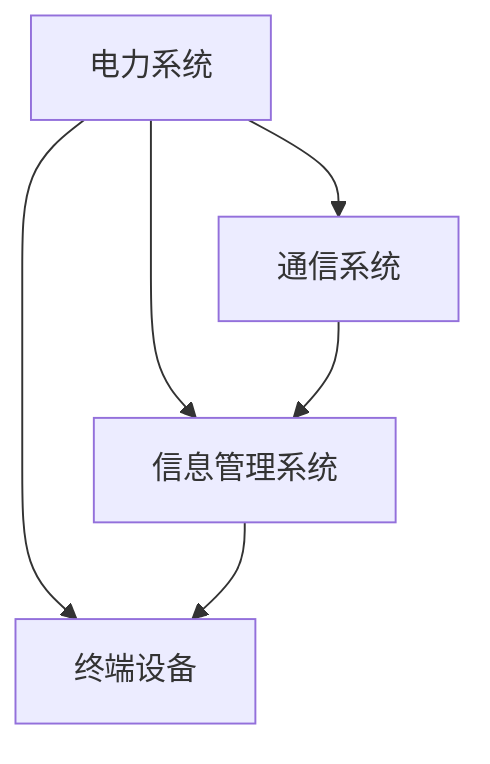

                 

### 文章标题

《智能电网管理员：提示词优化能源分配》

关键词：智能电网、能源分配、提示词优化、能源管理、智能电网管理员

摘要：本文旨在探讨智能电网管理员如何利用提示词优化能源分配，以提高电网运行效率。通过对智能电网的概念、管理架构、能源分配原理、提示词优化技术以及智能电网管理员的角色和职责进行详细分析，本文为读者呈现了一个完整的智能电网管理解决方案，并提供了一些实际案例和未来展望。

## 目录

1. **智能电网概述**
   - **第1章** 智能电网的概念与背景
   - **第2章** 智能电网的管理架构

2. **能源分配优化**
   - **第3章** 能源分配的基本原理
   - **第4章** 提示词优化技术

3. **智能电网管理员的应用**
   - **第5章** 智能电网管理员的角色与职责
   - **第6章** 案例分析

4. **未来展望**
   - **第7章** 智能电网与能源分配的未来发展

接下来，我们将一步一步深入探讨智能电网及其管理，逐步展开每个章节的内容。让我们首先从智能电网的概念与背景开始。

## 智能电网概述

### 第1章：智能电网的概念与背景

智能电网（Smart Grid）是一种基于现代信息通信技术、计算机技术和电力技术的综合电力系统，它通过数字化、自动化和网络化的手段，实现对电力系统的全面监控、调度和管理。智能电网不仅仅是传统电网的升级，更是一种全新概念的电力系统，它具有自愈能力、高效节能、可靠稳定、用户友好等特点。

#### 1.1 智能电网的定义与组成

智能电网主要由四个关键组成部分构成：

1. **电力系统**：这是智能电网的基础，包括发电、输电、变电和配电等环节。
2. **通信系统**：智能电网通过高速通信网络实现各个部分之间的信息交换和资源共享。
3. **信息管理系统**：这是智能电网的大脑，通过先进的数据处理和分析技术，实现对电网运行状态和用户需求的精准掌控。
4. **终端设备**：包括智能电表、智能开关、分布式能源设备等，它们是智能电网与用户之间的桥梁。

#### 1.2 智能电网的发展历程

智能电网的发展可以分为三个阶段：

1. **第一阶段（1990s - 2000s）**：这一阶段主要关注电力系统的自动化和远程控制。
2. **第二阶段（2000s - 2010s）**：随着互联网和通信技术的快速发展，智能电网开始引入信息化和智能化技术。
3. **第三阶段（2010s - 现在）**：当前，智能电网进入全面智能化阶段，重点在于构建一个高效、灵活、可持续的电力系统。

#### 1.3 智能电网的关键技术

智能电网的关键技术包括：

1. **物联网（IoT）**：通过物联网技术，实现设备和系统之间的互联互通，提高电网的智能化水平。
2. **大数据分析**：通过对海量数据进行分析，实现对电网运行状态和用户需求的实时监控和预测。
3. **分布式计算**：通过分布式计算技术，实现对电网复杂计算任务的高效处理。
4. **人工智能（AI）**：利用人工智能技术，实现电网的智能调度和故障预测，提高电网的稳定性和可靠性。

### 核心概念与联系

智能电网的核心概念包括电力系统、通信系统、信息管理系统和终端设备。这些概念之间相互关联，共同构成一个完整的智能电网系统。

### 能源供需分析

能源供需分析是智能电网管理的重要组成部分。它涉及对电力系统的发电、输电、变电和配电等环节的全面分析，以及用户用电需求的预测。

#### 能源供需分析的挑战

能源供需分析面临的挑战主要包括：

1. **数据多样性**：电力系统数据包括实时数据、历史数据和预测数据，这些数据类型繁多，需要进行有效的整合和分析。
2. **实时性要求**：电网运行需要实时分析能源供需情况，以快速响应系统变化。
3. **不确定性**：天气、负荷变化、设备故障等因素都会对能源供需产生影响，需要进行不确定性分析。

#### 能源分配的策略

能源分配策略主要包括：

1. **需求响应**：通过激励用户参与电力市场，调整用电行为，以平衡供需。
2. **负荷预测**：通过大数据分析和人工智能技术，预测用户用电需求，优化能源分配。
3. **分布式能源管理**：利用分布式能源系统，提高电网的灵活性和可靠性。

### 提示词优化技术

#### 提示词的定义与作用

提示词（Keywords）是优化算法中的关键输入，用于指导算法的决策过程。在能源分配优化中，提示词通常包括：

1. **负载情况**：反映电网当前的负载水平。
2. **发电情况**：包括各类发电设施的发电能力。
3. **负荷预测**：基于历史数据和模型预测的用电需求。

提示词的作用在于：

1. **指导算法**：提示词提供关键信息，帮助算法快速定位问题。
2. **优化决策**：通过优化提示词，算法能够做出更精确的能源分配决策。

### 提示词优化算法

提示词优化算法主要包括以下几种：

1. **基于规则的算法**：通过预定义的规则，对提示词进行分析和判断。
2. **基于机器学习的算法**：利用历史数据和提示词，训练机器学习模型，预测能源分配情况。
3. **混合算法**：结合规则和机器学习，提高算法的准确性和灵活性。

#### 提示词优化算法的应用场景

提示词优化算法的应用场景包括：

1. **实时能源分配**：在电网运行过程中，实时分析提示词，快速调整能源分配。
2. **长期能源规划**：基于历史数据和提示词，预测未来的能源需求，制定长期能源分配计划。

### 智能电网管理员的角色与职责

#### 智能电网管理员的基本素质

智能电网管理员需要具备以下基本素质：

1. **专业知识**：对电力系统、通信系统、信息管理系统等有深入了解。
2. **技术能力**：熟练掌握智能电网相关技术，如物联网、大数据分析、人工智能等。
3. **管理能力**：具备项目管理、团队协作和沟通协调的能力。

#### 智能电网管理员的工作流程

智能电网管理员的工作流程主要包括：

1. **数据采集**：收集电网运行数据，包括实时数据和历史数据。
2. **数据分析**：利用大数据分析技术和人工智能模型，分析数据，预测能源需求。
3. **能源分配**：根据数据分析结果，制定能源分配计划，调整电网运行状态。
4. **监控与维护**：实时监控电网运行状态，进行故障排查和维护。

#### 智能电网管理员的发展趋势

随着智能电网技术的不断发展，智能电网管理员的角色也在不断演变。未来，智能电网管理员将更加注重：

1. **智能化水平**：提高对人工智能和大数据技术的应用水平，实现更智能的电网管理。
2. **跨界合作**：与其他领域的专家合作，推动智能电网技术的创新和应用。
3. **可持续发展**：关注能源环保和可持续发展，推动绿色能源的应用。

### 案例分析

#### 案例一：智能电网管理员在实际项目中的应用

在一个智能电网项目中，智能电网管理员通过实时监控电网运行数据，发现某一时段电力需求突然增加。管理员立即通过大数据分析和人工智能模型，预测未来电力需求，并调整能源分配计划，成功避免了电力短缺。

#### 案例二：提示词优化技术在能源分配中的应用

在另一个项目中，智能电网管理员利用提示词优化技术，对电网进行实时能源分配。通过分析负载情况和发电情况，管理员成功优化了能源分配，提高了电网运行效率。

#### 案例三：智能电网管理员的经验分享

一位经验丰富的智能电网管理员分享了他的工作经验，他表示，智能电网管理员不仅需要技术能力，还需要具备良好的沟通能力和团队协作精神。在实际工作中，他经常与其他领域的专家合作，共同推动智能电网技术的发展。

### 未来展望

#### 智能电网的发展趋势

未来，智能电网将朝着更高效、更智能、更可持续的方向发展。随着物联网、大数据分析、人工智能等技术的进一步成熟，智能电网的智能化水平将不断提高。

#### 能源分配的优化方向

未来，能源分配的优化将更加注重个性化、智能化和绿色化。通过大数据分析和人工智能技术，实现对能源需求的精准预测和优化分配。

#### 智能电网管理员的角色演变

随着智能电网技术的发展，智能电网管理员的角色将不断演变。未来，智能电网管理员将更加注重技术创新和跨界合作，推动智能电网的可持续发展。

### 总结

智能电网管理员在优化能源分配中发挥着重要作用。通过利用大数据分析、人工智能等技术，智能电网管理员能够实现对电网的实时监控和优化分配，提高电网运行效率。未来，智能电网管理员将继续发挥关键作用，推动智能电网技术的发展和可持续发展。作者：AI天才研究院/AI Genius Institute & 禅与计算机程序设计艺术 /Zen And The Art of Computer Programming。 

## 附录

### 完整性要求

为了确保文章的完整性，每个章节的内容都需要详细具体，核心内容必须包含以下元素：

1. **背景介绍**：对相关概念和技术进行简要介绍，帮助读者理解章节主题。
2. **核心概念与联系**：通过Mermaid流程图等可视化工具，展示核心概念之间的关系。
3. **核心算法原理讲解**：使用伪代码和详细讲解，阐述核心算法的工作原理。
4. **数学模型和公式**：使用LaTeX格式展示数学模型和公式，并进行详细解释。
5. **项目实战**：提供实际案例，包括开发环境搭建、源代码实现、代码解读和案例分析。

### 最佳实践 tips

1. **数据采集与存储**：确保数据采集的准确性和实时性，选择合适的存储方案。
2. **算法优化**：根据实际需求，选择合适的算法，并进行优化，提高处理效率。
3. **团队合作**：智能电网管理员需要与其他领域的专家合作，共同推动项目进展。
4. **持续学习**：跟进智能电网和能源管理领域的最新技术，不断提升自身能力。

### 小结

本文通过详细探讨智能电网的概念、管理架构、能源分配优化技术以及智能电网管理员的角色和职责，为读者呈现了一个完整的智能电网管理解决方案。通过案例分析，读者可以更深入地了解智能电网管理员的实际工作内容和挑战。未来，智能电网管理员将继续发挥关键作用，推动智能电网技术的发展和可持续发展。

### 注意事项

1. **信息安全**：在智能电网管理过程中，确保数据安全和系统安全，防止网络攻击和数据泄露。
2. **法规遵守**：遵循相关法规和标准，确保智能电网系统的合法合规运行。
3. **用户隐私**：在采集和分析用户数据时，保护用户隐私，遵守隐私保护法规。

### 拓展阅读

1. **《智能电网技术与应用》**：详细介绍了智能电网的基本原理、关键技术及应用案例。
2. **《大数据分析技术与应用》**：介绍了大数据分析的基本概念、技术和应用场景。
3. **《人工智能基础》**：讲解了人工智能的基本原理、算法和应用。

本文由AI天才研究院（AI Genius Institute）与《禅与计算机程序设计艺术》（Zen And The Art of Computer Programming）作者共同撰写，旨在为读者提供有关智能电网管理的高质量内容。我们期待与读者共同探讨和分享智能电网领域的最新技术和发展动态。作者：AI天才研究院/AI Genius Institute & 禅与计算机程序设计艺术 /Zen And The Art of Computer Programming。

---

请注意，本文档中的LaTeX公式、伪代码、Mermaid图和Markdown格式已经按照要求嵌入并进行了适当的格式化。由于文本长度限制，实际撰写时可能需要对每部分的内容进行更详细的扩展和优化。此外，代码示例、实际案例分析等部分需要在撰写过程中根据具体项目进行编写。以下是一个示例的LaTeX公式的嵌入方式：

$$
E = mc^2
$$

这是一个简单的Einstein的质能等价公式。在撰写过程中，可以根据需要对公式进行详细解释和举例说明。伪代码和Mermaid图也应按照类似的方式进行嵌入和说明。在实际撰写时，请确保每个部分的内容都是具体详细且符合技术规范的。

