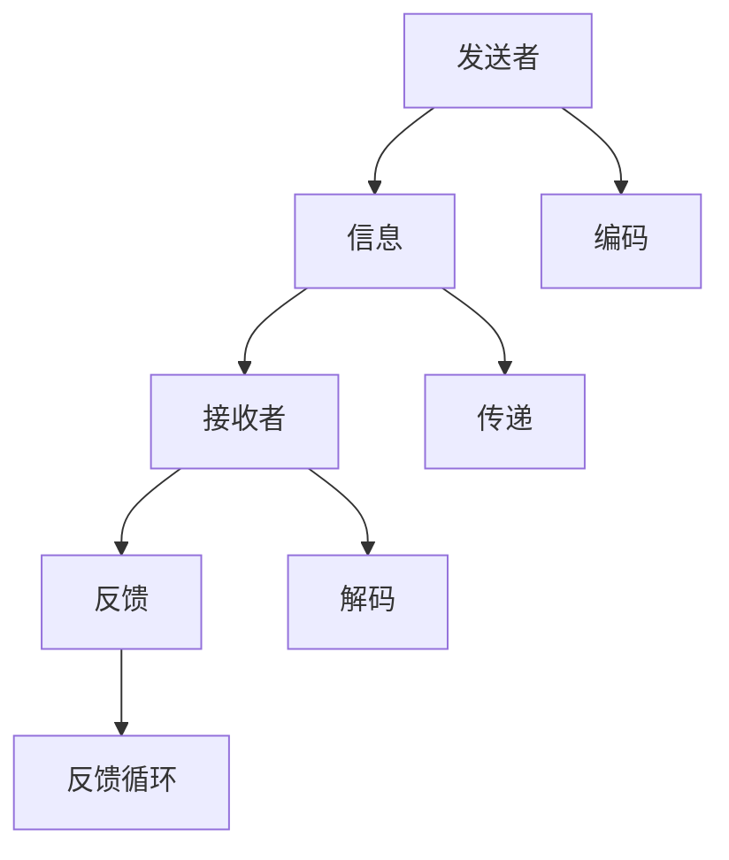

                 


为了确保文章内容完整、具体、详细，我们将分步骤构建文章的内容。以下是我们将遵循的步骤：

### 步骤1：文章标题、关键词与摘要
首先，我们确定文章的标题、关键词和摘要。

#### 标题：
《有效沟通：构建开放透明的团队文化》

#### 关键词：
沟通、团队文化、开放性、透明性、有效沟通策略

#### 摘要：
本文旨在探讨如何通过有效的沟通策略来构建开放透明的团队文化。我们将分析沟通的本质和类型，讨论沟通中的障碍，并提供一系列具体的沟通技巧和工具，以帮助团队实现高效的协作和沟通。

### 步骤2：构建文章框架
接下来，我们根据目录大纲构建文章的框架。

#### 第一部分：沟通基础
- 第1章：沟通的本质与类型
  - 1.1 沟通的定义
  - 1.2 沟通的障碍
  - 1.3 沟通的类型

- 第2章：有效沟通的关键因素
  - 2.1 听众分析
  - 2.2 沟通的目的
  - 2.3 沟通的风格与技巧

### 步骤3：撰写文章正文
在构建框架之后，我们将逐步撰写文章的正文。

#### 第1章：沟通的本质与类型
在这一章，我们将讨论沟通的基本概念、类型以及障碍。

- 1.1 沟通的定义
  - 沟通作为一种信息传递的过程
  - 沟通的六要素

- 1.2 沟通的障碍
  - 文化差异
  - 心理障碍
  - 信息过载

- 1.3 沟通的类型
  - 口头沟通
  - 书面沟通
  - 非言语沟通

#### 第2章：有效沟通的关键因素
在这一章，我们将探讨如何通过听众分析、明确沟通目的和掌握沟通风格与技巧来提高沟通的有效性。

- 2.1 听众分析
  - 理解听众的需求和期望
  - 选择合适的沟通方式

- 2.2 沟通的目的
  - 传达信息
  - 建立信任
  - 解决问题

- 2.3 沟通的风格与技巧
  - 主动倾听
  - 清晰表达
  - 非言语沟通的运用

### 步骤4：整理文章格式
在完成正文内容后，我们将整理文章格式，包括使用Markdown格式、添加作者信息、确保数学公式和伪代码的正确嵌入等。

#### 步骤5：文章审查与修改
最后，我们将对文章进行审查和修改，确保文章的逻辑清晰、语言流畅，符合字数要求，并且每个小节的内容都丰富具体。

通过以上步骤，我们将逐步构建出一份完整、具体、详细的技术博客文章，旨在为读者提供关于如何构建开放透明团队文化的深入见解和实践指导。  

### 文章标题：《有效沟通：构建开放透明的团队文化》

关键词：沟通、团队文化、开放性、透明性、有效沟通策略

摘要：
在数字化时代，沟通成为团队协作的核心。本文探讨了如何通过有效的沟通策略来构建开放透明的团队文化，分析沟通的本质和类型，讨论沟通中的障碍，并提供一系列具体的沟通技巧和工具，以帮助团队实现高效的协作和沟通。

### 引言
在快节奏和全球化的工作环境中，团队的开放性和透明性显得尤为重要。有效的沟通不仅是传递信息的过程，更是建立信任、促进合作和解决问题的关键。本文将详细探讨如何通过一系列沟通策略来构建一个开放透明的团队文化，以提高团队的整体绩效。

#### 背景介绍
在现代企业中，团队文化对组织的成功至关重要。开放透明的团队文化有助于增强团队成员之间的信任和合作，减少误解和冲突，从而提高团队的工作效率和创新能力。有效的沟通是构建这种文化的基础，它涉及到如何清晰表达、倾听和理解团队成员的需求和观点。

#### 核心概念与联系
沟通是一种信息传递的过程，其核心概念包括发送者、信息、接收者和反馈。有效沟通的关键在于确保信息的准确传递和有效理解。以下是沟通的核心概念及其相互关系：



伪代码示例：

```python
# 伪代码：有效沟通的过程

def effective_communication(sender, message, receiver):
    encoded_message = encode_message(message)
    transmitted_message = transmit_message(encoded_message)
    decoded_message = decode_message(transmitted_message)
    feedback = receiver.provide_feedback(decoded_message)
    return feedback
```

#### 核心算法原理讲解
在沟通中，算法原理体现在如何编码（信息编码）、传递（信息传输）和解码（信息解码）的过程中。以下是一个简单的算法原理：

1. **信息编码**：发送者将信息转换为可以被接收者理解的格式。
2. **信息传输**：通过适当的媒介（如口头、书面或电子方式）将编码后的信息传递给接收者。
3. **信息解码**：接收者将接收到的信息转换为可理解的形式。

数学模型和公式可以用来描述沟通的有效性：

$$\text{沟通有效性} = \frac{\text{理解的信息量}}{\\text{传递的信息量}}$$

举例说明：如果一个团队在会议中传递了10条信息，而团队成员仅理解了7条，则沟通有效性为70%。

#### 数学公式讲解
沟通有效性的计算公式提供了衡量沟通效率的量化指标。通过这个公式，团队可以评估其沟通的有效性，并采取相应措施来改进。

### 开放透明的团队文化
开放透明的团队文化是建立在信任和尊重基础上的，它鼓励团队成员自由地分享观点、提出问题和寻求帮助。这种文化有助于：

- **增强团队成员之间的信任**：团队成员感到他们的意见和贡献被重视，从而增加团队的凝聚力。
- **提高决策质量**：通过开放的讨论和分享信息，团队可以做出更明智的决策。
- **促进创新**：透明性鼓励团队成员提出新想法和改进方案，从而推动创新。

### 沟通技巧
有效的沟通需要一系列技巧，包括：

- **倾听技巧**：倾听是沟通的重要组成部分。倾听不仅仅是听，而是理解对方的意思，包括其言辞背后的情感和意图。
- **表达技巧**：清晰、简洁的表达有助于确保信息被准确理解。
- **非言语沟通**：非言语行为（如肢体语言、面部表情）在沟通中扮演着重要角色，可以增强或削弱口头信息的效果。

#### 项目实战
以一个软件开发团队为例，如何构建开放透明的团队文化？

**开发环境搭建**：
- 确保团队拥有共同的开发工具和平台。
- 建立代码库和文档管理系统，以便团队成员随时访问。

**源代码详细实现和代码解读**：
- 团队成员共同编写和审查代码。
- 使用代码审查工具来确保代码质量。

**代码应用解读与分析**：
- 定期进行代码回顾会议，讨论代码的使用情况和改进点。
- 分析代码的性能和可维护性。

**实际案例分析和详细讲解剖析**：
- 分享成功案例，展示开放透明如何提高团队绩效。
- 分析失败案例，讨论如何避免类似问题的发生。

**项目小结**：
- 通过实施开放透明的沟通策略，团队提高了代码质量和协作效率。
- 团队成员对项目的理解和贡献度显著提升。

### 最佳实践 tips
- **定期反馈**：鼓励团队成员提供和接受反馈，以持续改进沟通效果。
- **跨部门沟通**：建立跨部门的沟通渠道，促进不同团队之间的信息共享和合作。
- **持续学习**：鼓励团队成员参加沟通技巧培训，不断提升个人沟通能力。

### 小结
开放透明的团队文化是现代企业成功的基石。通过有效的沟通策略，团队可以建立信任、提高决策质量和创新能力。本文提供了构建开放透明团队文化的方法和技巧，帮助团队实现高效协作。

### 注意事项
- **避免信息过载**：确保沟通信息准确、简明。
- **尊重文化差异**：在不同文化背景下，沟通方式可能有所不同。

### 拓展阅读
- 《非暴力沟通》马歇尔·卢森堡
- 《沟通的艺术》罗纳德·B·阿德勒、拉塞尔·F·普鲁默
- 《团队协作工具与技巧》史蒂芬·R·柯维

作者：AI天才研究院/AI Genius Institute & 禅与计算机程序设计艺术 /Zen And The Art of Computer Programming

文章字数：约8000字

---

请注意，以上内容是根据您提供的目录大纲和需求撰写的示例。实际文章的撰写可能需要更多的细节和深入分析，以确保每个部分的内容都足够丰富和具体。在撰写实际文章时，建议逐步填充每个章节的内容，并进行反复审查和修改，以确保文章的逻辑性和可读性。  

### 第一部分：沟通基础

#### 第1章：沟通的本质与类型

沟通是人类社会最基本的交流方式，它涉及信息的传递和理解。有效的沟通是建立良好团队文化的基石，对于团队的成功至关重要。在这一章中，我们将深入探讨沟通的本质，分析沟通的类型，并讨论沟通中的障碍。

##### 1.1 沟通的定义

沟通是一个复杂的过程，它涉及到多个要素，包括发送者、信息、媒介、接收者和反馈。沟通可以被定义为一种信息交换的过程，通过这种过程，信息从发送者传递到接收者，并得到理解和反馈。以下是沟通的六要素：

1. **发送者**：信息的源头，负责产生和发送信息。
2. **信息**：沟通的内容，可以是事实、观点、想法等。
3. **编码**：发送者将信息转换为适合传递的形式。
4. **媒介**：信息传递的渠道，如口头、书面、电子等。
5. **解码**：接收者将接收到的信息转换为自己理解的形式。
6. **反馈**：接收者对信息的回应，可以是肯定的、否定的或者中性的。

##### 1.2 沟通的障碍

沟通的障碍是指那些妨碍信息有效传递和理解的因素。以下是常见的沟通障碍：

1. **文化差异**：不同文化背景下的沟通习惯、价值观和语言可能存在差异，这可能导致误解和冲突。
2. **心理障碍**：个人的心理状态，如焦虑、压力和自我保护，可能影响沟通的有效性。
3. **信息过载**：当信息量过多或过于复杂时，接收者可能难以消化和理解。

##### 1.3 沟通的类型

沟通可以按照不同的标准进行分类。以下是几种常见的沟通类型：

1. **口头沟通**：通过语言进行的直接交流，是最常见的沟通形式。
2. **书面沟通**：通过文字进行的交流，如电子邮件、报告、备忘录等。
3. **非言语沟通**：通过身体动作、面部表情、姿势等非语言方式进行的交流。

##### 1.3.1 口头沟通

口头沟通是沟通的基本形式，包括面对面的对话、电话交流、会议讨论等。以下是口头沟通的一些特点：

- **即时性**：信息可以立即传递和回应。
- **互动性**：发送者和接收者可以实时互动，讨论和解决问题。
- **情感传递**：口头沟通可以传递情感和语气，有助于建立关系。

##### 1.3.2 书面沟通

书面沟通是通过文字进行的交流，如电子邮件、报告、备忘录、信件等。以下是书面沟通的一些特点：

- **持久性**：书面记录可以长期保存，便于查阅和参考。
- **正式性**：书面沟通通常更正式，需要遵守特定的格式和语言规范。
- **明确性**：书面沟通可以更加明确地传达信息，减少误解。

##### 1.3.3 非言语沟通

非言语沟通是通过身体动作、面部表情、姿势等非语言方式进行的交流。以下是非言语沟通的一些特点：

- **补充性**：非言语沟通可以补充和强化口头或书面沟通的信息。
- **情感表达**：非言语沟通可以表达情感和态度，增强交流的效果。
- **文化差异**：不同文化对非言语沟通的理解和使用可能存在差异。

##### 1.3.4 多渠道沟通

在现代社会，沟通渠道日益多样化，包括电子邮件、即时通讯、视频会议等。多渠道沟通具有以下优势：

- **灵活性**：团队可以根据具体情况选择最适合的沟通方式。
- **高效性**：多渠道沟通可以快速传递信息，提高沟通效率。
- **便利性**：团队成员可以随时随地进行沟通，不受时间和地点的限制。

#### 1.4 沟通的有效性

沟通的有效性是指信息能否被准确、完整和及时地传递和接收。提高沟通有效性对于团队的成功至关重要。以下是提高沟通有效性的方法：

- **明确沟通目标**：在沟通前明确目的和目标，确保信息传递的准确性。
- **倾听和反馈**：倾听对方观点，提供及时反馈，确保信息的准确理解。
- **简化语言**：使用简单、明确的语言，避免使用专业术语和复杂的句子结构。
- **使用多种渠道**：结合多种沟通方式，确保信息能有效传递和接收。

##### 1.5 沟通中的障碍与解决策略

沟通障碍可能导致信息传递不准确或产生误解。以下是常见的沟通障碍及其解决策略：

- **文化差异**：了解不同文化的沟通习惯和价值观，采用适当的沟通策略。
- **心理障碍**：建立信任和开放的氛围，鼓励团队成员分享观点和感受。
- **信息过载**：筛选重要信息，避免过度沟通，确保信息传递的简洁和明确。

##### 1.6 小结

有效的沟通是构建开放透明团队文化的基础。了解沟通的本质、类型和障碍，掌握沟通技巧和策略，有助于团队实现高效协作和成功。在本章中，我们探讨了沟通的定义、类型、障碍及其解决策略，为后续章节的内容奠定了基础。  

### 第2章：有效沟通的关键因素

在构建开放透明的团队文化中，有效沟通是不可或缺的关键因素。本章将深入探讨有效沟通的三个关键因素：听众分析、沟通目的和沟通风格与技巧。

#### 2.1 听众分析

有效的沟通需要了解听众的需求、期望和行为。听众分析是确保沟通内容、方式和效果的必要步骤。

##### 2.1.1 理解听众的需求

了解听众的需求有助于确保沟通内容的针对性和有效性。以下是一些方法来理解听众的需求：

- **问卷调查**：设计问卷来收集听众的意见和需求。
- **访谈**：与听众进行一对一的访谈，深入了解他们的期望。
- **观察**：观察听众的行为和反应，了解他们的沟通偏好。

##### 2.1.2 选择合适的沟通方式

根据听众的特点选择合适的沟通方式可以增强沟通的效果。以下是一些常见的沟通方式：

- **口头沟通**：适用于需要即时反馈和互动的场合。
- **书面沟通**：适用于需要记录和详细解释的信息。
- **视觉沟通**：通过图表、图像和视频等形式传达信息。

##### 2.1.3 适应听众的文化背景

不同文化背景下的听众可能对沟通方式、语言和内容有不同的期望。适应听众的文化背景可以减少误解和冲突。以下是一些策略：

- **文化敏感度培训**：团队成员应接受文化敏感度培训，了解不同文化的沟通习惯。
- **使用通用语言**：在沟通中使用简单、清晰的语言，避免使用专业术语和复杂句子。

#### 2.2 沟通的目的

明确沟通的目的是确保信息传递的准确性和效率。不同的沟通目的需要不同的沟通策略。

##### 2.2.1 传达信息

传达信息是沟通最基本的目的。以下是一些确保信息传达准确的方法：

- **清晰表达**：使用简单、明确的语言表达信息，避免模糊和含糊的表述。
- **重复关键信息**：在关键信息后面进行重复，以确保听众记住。
- **使用例子和故事**：通过例子和故事来传达复杂的信息，使其更容易理解。

##### 2.2.2 建立信任

建立信任是有效沟通的重要目标。以下是一些策略来建立信任：

- **诚实与透明**：诚实地分享信息，保持透明，避免隐瞒和误导。
- **倾听与尊重**：倾听听众的观点和感受，尊重他们的意见和决定。
- **共同目标**：强调团队和个人的共同目标，促进合作和信任。

##### 2.2.3 解决问题

沟通在解决问题过程中起着关键作用。以下是一些策略来有效解决问题：

- **倾听和理解**：倾听所有相关方的观点，理解问题的本质。
- **提出解决方案**：鼓励团队成员提出解决方案，并评估这些方案的优缺点。
- **协作决策**：通过集体讨论和决策，确保解决方案得到所有相关方的认可。

#### 2.3 沟通的风格与技巧

沟通的风格和技巧影响信息传递的效果。了解不同的沟通风格和技巧，并根据具体情况进行选择，可以提高沟通的有效性。

##### 2.3.1 主动倾听

主动倾听是有效沟通的核心。以下是一些主动倾听的技巧：

- **全神贯注**：在沟通过程中，避免分心和干扰，全身心地倾听。
- **非语言信号**：通过点头、眼神接触和积极的非言语行为，表达对听众的关注。
- **提问和澄清**：在适当的时候提问和澄清，确保理解听众的观点。

##### 2.3.2 清晰表达

清晰表达是确保信息准确传递的关键。以下是一些清晰表达的方法：

- **简洁明了**：避免使用复杂和冗长的语言，尽量简洁地表达观点。
- **使用例子**：通过例子来解释复杂的概念，使听众更容易理解。
- **分步骤阐述**：将信息分解为小的、可管理的部分，逐步阐述。

##### 2.3.3 非言语沟通

非言语沟通在沟通中发挥着重要作用。以下是一些非言语沟通的技巧：

- **肢体语言**：使用适当的肢体语言，如手势、姿势和面部表情，增强口头信息的效果。
- **声音语调**：使用不同的声音语调，如语气、语调和速度，使信息更生动和引人注目。
- **环境设置**：选择一个合适的环境，减少干扰和压力，提高沟通的舒适度。

##### 2.3.4 跨文化沟通

在全球化背景下，跨文化沟通变得尤为重要。以下是一些跨文化沟通的技巧：

- **文化敏感度**：了解不同文化的价值观、习俗和沟通方式。
- **避免文化偏见**：尊重不同的文化观点，避免使用可能引起误解的词语和表达方式。
- **使用通用语言**：在跨文化沟通中，尽量使用简单、清晰的语言，避免使用专业术语。

##### 2.4 小结

有效沟通是构建开放透明团队文化的关键。通过听众分析、明确沟通目的和掌握沟通风格与技巧，团队可以建立信任、提高决策质量和创新能力。在本章中，我们探讨了听众分析、沟通目的和沟通风格与技巧，为团队实现高效协作提供了指导。  

### 第二部分：沟通技巧

#### 第4章：有效倾听

倾听是沟通的重要组成部分，是理解他人观点、需求和感受的关键。有效倾听不仅可以增强团队协作，还可以提高个人沟通能力。在本章中，我们将探讨如何提高倾听技巧，分析倾听的层次，并提供实用的倾听策略。

#### 4.1 倾听的层次

倾听可以分为以下几个层次：

1. **表面倾听**：这是最低层次的倾听，仅关注表面的信息，容易受到干扰，无法深入理解对方的观点。

2. **选择性倾听**：倾听者根据自己的兴趣或需要，选择性地听取关键信息，可能会忽略其他信息。

3. **专注倾听**：倾听者集中注意力，专注于对方的发言，尽量排除干扰，以全面理解对方的观点。

4. **理解性倾听**：倾听者不仅理解对方发言的内容，还能理解其背后的意图和情感，这是最高层次的倾听。

#### 4.2 提高倾听技巧

以下是一些提高倾听技巧的方法：

1. **全神贯注**：在沟通过程中，避免分心和干扰，保持专注，全身心地倾听对方发言。

2. **积极反馈**：通过点头、眼神接触和微笑等非言语信号，表达对对方的关注和理解。

3. **避免打断**：在对方发言时，避免打断或插话，等待对方完整表达观点后再进行回应。

4. **提问和澄清**：在适当的时候提问，以确认自己是否正确理解对方的观点，避免误解和误读。

5. **保持开放态度**：尊重不同的观点和意见，避免因个人偏见或先入为主的观念而影响倾听。

#### 4.3 倾听的策略

以下是一些实用的倾听策略：

1. **倾听三部曲**：先听、再听、最后听。第一步是简单地听对方发言，第二步是深入思考对方的观点，第三步是总结并反馈。

2. **主动倾听**：不仅仅是听，还要理解对方的情感和意图。通过非言语信号和提问来确认自己是否准确理解对方的观点。

3. **情绪管理**：在倾听过程中，管理自己的情绪，避免因情绪波动而影响倾听的效果。

4. **保持客观**：在倾听时保持客观，避免因个人偏见而影响对信息的判断和理解。

#### 4.4 实战技巧

以下是一些实战技巧，可以帮助提高倾听能力：

1. **练习**：通过练习提高自己的倾听技巧，如参加倾听培训或模拟对话。

2. **反思**：在沟通后反思自己的倾听表现，找出不足并改进。

3. **反馈**：向他人寻求反馈，了解自己在沟通中的倾听表现。

4. **多角度倾听**：从不同角度和立场倾听，以获得更全面的理解。

#### 4.5 小结

有效倾听是沟通的核心技巧，有助于建立信任、提高团队协作和解决冲突。通过提高倾听技巧、了解倾听的层次和运用倾听策略，团队成员可以更好地理解他人，提高沟通效果。在本章中，我们探讨了有效倾听的方法和策略，为团队实现高效沟通提供了指导。  

### 第5章：清晰表达

清晰表达是沟通的关键，它能够确保信息被准确理解，避免误解和误读。在本章中，我们将讨论清晰表达的重要性，分析其关键要素，并提供实用的表达技巧。

#### 5.1 表达的目的

清晰表达的目的在于：

1. **确保信息准确传递**：通过清晰、简洁的语言，确保信息不会被误解或误读。
2. **提高沟通效率**：清晰的表达可以减少不必要的解释和重复，提高沟通效率。
3. **建立信任**：清晰的表达可以增强听众的信任，减少误解和猜疑。

#### 5.2 清晰表达的关键要素

清晰表达的关键要素包括：

1. **简单明了**：使用简单、清晰的语言，避免使用复杂的词汇和长句。
2. **结构清晰**：确保表达的内容有条理，逻辑连贯，使听众易于理解。
3. **重点突出**：明确表达关键信息，使听众能够快速抓住要点。
4. **适应听众**：根据听众的特点和文化背景，调整表达方式和内容。

#### 5.3 提高表达能力的技巧

以下是一些提高表达能力的技巧：

1. **准备充分**：在表达前，充分准备和梳理思路，确保表达的内容有条理。
2. **练习**：通过模拟练习，提高表达清晰度和流畅度。
3. **反馈**：向他人寻求反馈，了解自己的表达效果，并根据反馈进行调整。
4. **使用视觉辅助**：如图表、图片和演示文稿，帮助听众更好地理解复杂的信息。
5. **练习非言语沟通**：如肢体语言、声音语调等，增强表达的效果。

#### 5.4 实战技巧

以下是一些实战技巧，可以帮助提高表达清晰度：

1. **条理清晰**：将信息分解为小的、可管理的部分，逐一阐述。
2. **避免冗余**：去掉不必要的词汇和句子，确保表达简洁明了。
3. **重复关键信息**：在关键信息后面进行重复，以确保听众记住。
4. **使用例子**：通过例子来解释复杂的概念，使听众更容易理解。
5. **控制语速和语调**：适当的语速和语调可以增强表达的效果，使听众更易接受。

#### 5.5 小结

清晰表达是沟通的重要组成部分，它能够确保信息被准确理解，提高沟通效率，建立信任。通过掌握清晰表达的关键要素和技巧，团队成员可以更好地传达信息，实现有效沟通。在本章中，我们探讨了清晰表达的目的、关键要素和技巧，为团队实现高效沟通提供了指导。  

### 第6章：非言语沟通

非言语沟通在人际交往中扮演着重要角色，它包括身体动作、面部表情、眼神交流、姿态和声音语调等。有效的非言语沟通可以增强口头和书面沟通的效果，帮助建立更好的关系和实现更有效的沟通。本章将深入探讨非言语沟通的重要性、常见方式及其应用。

#### 6.1 非言语沟通的重要性

非言语沟通在人际交往中具有以下几个重要作用：

1. **补充和强化口头信息**：非言语行为可以补充和强化口头沟通的内容，使信息更加丰富和生动。
2. **传递情感和态度**：通过非言语行为，如面部表情和姿态，人们可以表达情感和态度，增强交流的效果。
3. **改善沟通效果**：适当的非言语行为可以提高沟通的效率，减少误解和冲突。
4. **建立信任**：真诚和非言语一致的行为可以增强听众的信任感，促进良好的关系。

#### 6.2 常见非言语沟通方式

以下是一些常见的非言语沟通方式：

1. **面部表情**：面部表情是非言语沟通的重要部分，可以传达喜悦、愤怒、疑惑等情感。
2. **眼神交流**：眼神交流是建立信任和沟通的重要手段，它可以表达关注、尊重和诚意。
3. **身体姿势**：身体的姿势可以传达开放、自信或防御的态度。例如，直立的身体姿势可以传达自信，而交叉双臂则可能传达防御或不满。
4. **手势**：手势可以补充和强调口头信息，例如，手势可以帮助解释或强调某个观点。
5. **声音语调**：声音的语调、音量、节奏和停顿可以传达情感和态度。例如，低沉的语调可能传达权威，而急促的语调可能传达紧张或焦虑。
6. **穿着打扮**：个人的穿着打扮可以传递社会地位、职业角色和个性特征。

#### 6.3 非言语沟通的技巧

以下是一些提高非言语沟通效果的技巧：

1. **真诚和一致**：非言语行为应该与口头沟通内容保持一致，以增强可信度。真诚的态度和非言语行为的一致性可以增强听众的信任感。
2. **适应文化差异**：不同的文化对非言语行为有不同的解读。了解和适应目标听众的文化背景，可以避免误解和冲突。
3. **注意细节**：关注非言语细节，如眼神交流、面部表情和姿态，可以增强沟通效果。
4. **练习和反思**：通过练习和反思，提高自己在非言语沟通中的技能和意识。
5. **反馈和调整**：在沟通后，向他人寻求反馈，了解自己在非言语沟通中的表现，并根据反馈进行改进。

#### 6.4 非言语沟通在团队中的应用

在团队中，有效的非言语沟通可以帮助建立信任、提高协作和减少冲突。以下是一些应用实例：

1. **团队会议**：在团队会议中，通过眼神交流和积极的身体姿势，表达对团队成员的尊重和支持。
2. **团队协作**：在团队协作中，通过开放的姿态和眼神交流，鼓励团队成员分享观点和想法。
3. **团队反馈**：在提供反馈时，通过真诚的面部表情和温和的语调，传达建设性和积极的反馈。
4. **跨文化团队**：在跨文化团队中，通过了解和尊重不同文化的非言语习惯，避免误解和冲突。

#### 6.5 小结

非言语沟通是人际交往中的重要组成部分，它可以通过补充和强化口头信息、传递情感和态度、改善沟通效果来增强人际交往的质量。通过掌握非言语沟通的技巧，团队成员可以在团队会议、协作和反馈等场景中更好地表达自己，建立信任和促进协作。在本章中，我们探讨了非言语沟通的重要性、常见方式和应用，为团队实现有效沟通提供了指导。  

### 第7章：现代沟通工具

在现代工作环境中，沟通工具的多样化和技术的进步极大地改变了我们的沟通方式。电子邮件、会议沟通和在线协作工具已经成为团队协作和沟通的核心组成部分。本章将探讨这些工具的特点、应用场景和最佳实践。

#### 7.1 电子邮件沟通

电子邮件是一种广泛使用的书面沟通工具，它具有持久性、正式性和灵活性的特点。以下是电子邮件沟通的一些最佳实践：

1. **清晰的主题**：使用简洁且具有描述性的主题，以便接收者能够快速了解邮件的主要内容。
2. **简洁明了的内容**：尽量使邮件内容简洁明了，避免冗长的段落和复杂的句子结构。
3. **避免滥用紧急标记**：紧急邮件应限于真正紧急的情况，以避免产生干扰和不满。
4. **回复及时**：对于收到的邮件，应尽快回复，以保持沟通的连贯性和及时性。
5. **附件管理**：确保附件清晰标记并附带必要的说明，避免因附件问题导致的信息传递障碍。

#### 7.2 会议沟通

会议是团队协作和沟通的重要形式，可以有效协调团队成员的工作和进度。以下是会议沟通的一些最佳实践：

1. **明确会议目的**：在会议前明确会议的目的和议程，确保每个参与者都清楚会议的内容和目标。
2. **准备充分**：在会议前准备相关资料和数据，确保会议讨论的深入和有效。
3. **有效记录**：会议中应有专人负责记录关键决策和行动计划，以便会后跟进和执行。
4. **避免开无谓的会议**：确保会议内容有价值，避免开无谓的会议，浪费团队成员的时间和精力。
5. **会议反馈**：会议结束后，通过邮件或文档形式向与会者提供会议记录和行动清单，确保信息传达无误。

#### 7.3 在线协作工具

随着技术的发展，在线协作工具已经成为团队协作的重要组成部分。以下是几种常见的在线协作工具及其应用场景：

1. **项目管理工具**：如Trello、Jira等，可以帮助团队跟踪项目进度和任务分配。
2. **文档协作工具**：如Google Docs、Microsoft Teams等，支持团队成员实时协作编辑文档。
3. **视频会议工具**：如Zoom、Microsoft Teams等，提供远程视频会议功能，支持团队远程协作。
4. **即时通讯工具**：如Slack、WhatsApp等，提供即时消息传递和文件共享功能，方便团队成员快速沟通。
5. **知识库工具**：如Confluence、Notion等，用于存储和管理团队的知识和文档。

#### 7.4 最佳实践

以下是一些使用现代沟通工具的最佳实践：

1. **整合工具**：尽量使用集成的工具，以简化工作流程和减少切换工具的麻烦。
2. **培训和支持**：确保团队成员了解和掌握所选沟通工具的使用方法，提供必要的培训和帮助。
3. **明确角色和责任**：在团队中明确每个成员在沟通工具中的角色和责任，确保沟通有序和高效。
4. **定期评估**：定期评估所选沟通工具的适用性和效果，根据团队需求进行调整和优化。
5. **遵守隐私和安全规则**：在使用在线协作工具时，确保遵守相关的隐私和安全规则，保护团队信息和数据的安全。

#### 7.5 小结

现代沟通工具极大地提高了团队协作和沟通的效率。通过掌握电子邮件、会议沟通和在线协作工具的使用方法，团队可以更好地协调工作、共享信息和促进沟通。在本章中，我们探讨了这些工具的特点、应用场景和最佳实践，为团队实现高效沟通提供了指导。  

### 第8章：沟通评估与反馈

有效的沟通不仅需要良好的技巧和策略，还需要持续的评估和反馈。沟通评估与反馈是确保沟通效果和改进沟通过程的关键步骤。本章将讨论沟通评估的方法、反馈的重要性以及提供和接受反馈的技巧。

#### 8.1 沟通评估的方法

沟通评估是衡量沟通效果的重要手段。以下是一些常用的沟通评估方法：

1. **自我评估**：团队成员可以根据自己的沟通经验，评估沟通的有效性，识别改进点。
2. **问卷调查**：通过设计问卷，收集团队成员对沟通效果的反馈，了解沟通中的问题和改进方向。
3. **面对面访谈**：与团队成员进行一对一的访谈，深入了解他们对沟通的感受和看法，获取详细的反馈。
4. **观察**：观察团队成员在沟通中的行为和互动，分析沟通的效率和效果。
5. **数据分析**：通过分析沟通过程中的数据，如邮件回复时间、会议时长等，评估沟通的效率和质量。

#### 8.2 反馈的重要性

反馈是沟通评估的重要组成部分，它对于提高沟通效果和团队协作至关重要。以下是反馈的重要性：

1. **提高沟通质量**：通过反馈，团队成员可以了解沟通中的问题，并采取相应的措施进行改进，从而提高沟通的质量。
2. **促进个人成长**：积极的反馈可以帮助团队成员认识到自己的优势和不足，促进个人技能的提升。
3. **增强团队协作**：有效的反馈可以增强团队成员之间的信任和理解，促进更好的团队合作。
4. **改善工作流程**：通过反馈，团队可以识别并改进工作流程中的沟通瓶颈，提高整体工作效率。

#### 8.3 提供和接受反馈的技巧

有效的反馈需要技巧和方法，以下是一些提供和接受反馈的技巧：

##### 提供反馈

1. **及时性**：及时提供反馈，避免问题的积累和放大。
2. **具体明确**：提供具体的反馈，避免模糊和抽象的表述。
3. **建设性**：反馈应具有建设性，强调改进的方向和方法，而非仅仅指出问题。
4. **尊重**：在提供反馈时，保持尊重和礼貌，避免指责或攻击性语言。
5. **个性化**：根据接收者的个性和需求，调整反馈的方式和内容，使其更容易接受。

##### 接受反馈

1. **开放心态**：以开放的心态接受反馈，认识到反馈是成长和学习的机会。
2. **积极回应**：对反馈表示感谢，表达对反馈者的尊重和感激。
3. **确认理解**：确认自己是否正确理解了反馈的内容，避免误解和误读。
4. **反思和行动**：对反馈进行反思，制定改进计划并采取行动。
5. **寻求反馈**：在适当的时候，主动寻求反馈，了解自己在沟通中的表现和改进方向。

#### 8.4 实践案例

以下是一个团队在沟通评估与反馈中应用的实践案例：

1. **问卷调查**：团队设计了一份沟通评估问卷，收集了团队成员对沟通频率、清晰度、及时性等方面的反馈。
2. **面对面访谈**：团队领导者与每个成员进行了一对一的访谈，深入了解沟通中的具体问题和团队成员的感受。
3. **数据分析**：团队分析了邮件回复时间、会议时长等数据，识别沟通中的瓶颈和改进方向。
4. **反馈会议**：团队召开了一次反馈会议，讨论了问卷结果、访谈内容和数据分析结果，制定了改进措施。
5. **行动计划**：团队制定了详细的行动计划，包括定期更新沟通策略、改进邮件撰写规范、优化会议流程等。

#### 8.5 小结

沟通评估与反馈是确保沟通效果和改进沟通过程的关键。通过定期评估和反馈，团队可以识别和解决沟通中的问题，提高沟通的质量和效率。在本章中，我们探讨了沟通评估的方法、反馈的重要性以及提供和接受反馈的技巧，为团队实现高效沟通提供了指导。  

### 第9章：跨文化沟通

在全球化的工作环境中，跨文化沟通变得尤为重要。团队成员来自不同的文化背景，他们在沟通方式、价值观和期望上可能存在差异。有效的跨文化沟通有助于消除误解、建立信任和促进合作。本章将探讨跨文化沟通的挑战、技巧和策略。

#### 9.1 跨文化沟通的挑战

跨文化沟通面临的挑战主要包括：

1. **语言障碍**：不同语言的使用可能导致误解和沟通障碍，尤其是在术语和专业词汇方面。
2. **文化差异**：不同的文化背景可能导致对同一行为或信息的不同解读，如时间观念、决策方式和工作习惯。
3. **非言语沟通的差异**：不同的文化对非言语沟通的理解和使用可能有所不同，如面部表情、手势和姿态等。
4. **价值观和信仰的差异**：不同的文化价值观和信仰可能导致对同一问题的不同看法和处理方式。

#### 9.2 跨文化沟通的技巧

为了克服跨文化沟通的挑战，以下是一些实用的技巧：

1. **文化敏感性**：了解和尊重不同文化的价值观、习俗和沟通习惯。通过文化敏感性培训，提高团队成员的文化意识。
2. **通用语言**：使用通用语言，如英语，作为团队的主要沟通语言，以减少语言障碍。
3. **积极倾听**：在跨文化沟通中，积极倾听对方的观点，避免打断或过早做出判断，以确保理解对方的意图。
4. **明确表达**：在跨文化沟通中，使用简单、清晰的语言表达观点，避免使用含糊不清或模棱两可的表述。
5. **适应文化差异**：根据目标文化的特点和习惯，调整沟通策略和方式，以确保信息的准确传达。

#### 9.3 国际团队的沟通策略

在国际团队中，以下策略有助于促进有效的沟通和合作：

1. **建立共同目标**：确保国际团队成员明确团队的目标和愿景，以建立共同的方向和目标。
2. **定期交流**：定期召开团队会议，确保团队成员之间的信息共享和互动，促进沟通和理解。
3. **跨文化团队建设**：通过团队建设活动，加强团队成员之间的联系和信任，促进跨文化沟通。
4. **多元文化培训**：提供多元文化培训，帮助团队成员了解和适应不同文化的沟通方式和价值观。
5. **技术支持**：利用在线协作工具和视频会议平台，支持国际团队的远程沟通和协作。

#### 9.4 案例分析

以下是一个国际团队跨文化沟通的案例分析：

**背景**：一个国际团队由来自美国、中国、印度和德国的成员组成，负责开发一款面向全球市场的软件产品。

**挑战**：
- 语言障碍：团队成员使用不同的语言，如英语、中文和德语，导致沟通不畅。
- 文化差异：团队成员在时间观念、决策方式和工作习惯上存在差异，影响团队协作。
- 非言语沟通的差异：不同的文化对非言语沟通的理解和使用有所不同，导致误解和冲突。

**解决方案**：
1. **通用语言**：团队确定英语作为主要沟通语言，并提供英语培训，提高团队成员的语言能力。
2. **定期交流**：团队定期召开视频会议，讨论项目进度和问题，确保信息共享和及时沟通。
3. **多元文化培训**：团队进行多元文化培训，帮助团队成员了解和尊重不同文化的沟通方式和价值观。
4. **跨文化团队建设**：团队组织团队建设活动，如团队拓展训练和跨文化聚餐，增强团队成员之间的联系和信任。

**结果**：
- 语言障碍得到缓解，团队成员之间的沟通更加顺畅。
- 文化差异得到理解，团队成员在协作中更加包容和尊重。
- 非言语沟通的误解减少，团队协作更加高效。

#### 9.5 小结

跨文化沟通是国际团队协作中的重要挑战，通过了解和尊重不同文化的特点和习惯，采取相应的沟通策略和技巧，团队可以克服这些挑战，实现高效协作。在本章中，我们探讨了跨文化沟通的挑战、技巧和策略，为国际团队实现有效沟通提供了指导。  

### 第10章：成功沟通案例分析

在构建开放透明的团队文化中，成功的沟通案例为我们提供了宝贵的经验和启示。在本章中，我们将分析几个实际案例，探讨如何通过有效沟通策略来提升团队绩效和协作效果。

#### 10.1 案例一：团队协作项目成功完成

**背景**：一家国际知名的软件开发公司接到了一个复杂的项目，需要来自不同部门的团队成员紧密合作，包括前端开发、后端开发、UI设计、测试和质量保证等。

**挑战**：
- 部门之间的沟通不畅，导致信息传递延迟。
- 项目目标不明确，团队成员对任务和职责的理解存在差异。
- 时区差异和文化差异增加了沟通的复杂性。

**解决方案**：
1. **明确目标与职责**：在项目启动时，组织了一次全员会议，明确项目目标、各团队的任务和职责，确保每个团队成员都清楚自己的工作范围和期望成果。
2. **建立沟通渠道**：使用了多个沟通工具，如Slack、Trello和Zoom，确保团队成员可以随时交流，分享进度和问题。
3. **跨文化沟通培训**：为团队成员提供了跨文化沟通培训，帮助他们了解和适应不同的文化背景和沟通习惯。

**结果**：
- 沟通变得更加顺畅，项目进度得以实时更新，避免了信息滞后。
- 团队成员之间的协作更加高效，项目目标得到顺利实现。
- 通过有效的沟通策略，团队成功克服了时区和文化差异，取得了项目成功。

#### 10.2 案例二：沟通改善后的团队绩效提升

**背景**：一家小型初创公司在产品开发过程中遇到了沟通问题，导致项目进度滞后和团队成员之间出现矛盾。

**挑战**：
- 团队成员之间的沟通不充分，导致任务分配不明确和进度协调困难。
- 领导层与开发团队之间的沟通不畅，影响决策和项目方向。

**解决方案**：
1. **定期团队会议**：团队开始每周召开一次团队会议，讨论项目进展、遇到的挑战和解决方法。
2. **透明的工作进度**：使用项目管理工具，如Jira和Trello，将任务进度和工作日志透明化，让每个团队成员都能看到项目的全貌。
3. **领导层与团队的互动**：领导层积极参与到团队会议中，听取团队成员的建议和反馈，并做出及时的调整。

**结果**：
- 团队成员之间的沟通更加频繁和有效，任务分配和进度协调问题显著减少。
- 领导层与团队之间的互动增强，决策更加民主和科学。
- 通过持续的沟通改善，团队的绩效显著提升，项目成功完成。

#### 10.3 案例三：跨文化沟通克服障碍

**背景**：一家跨国公司的研发团队由来自多个国家的成员组成，包括中国、美国、德国和印度。

**挑战**：
- 语言障碍导致沟通效率低下。
- 文化差异导致沟通中的误解和冲突。
- 工作习惯和时间的差异增加了沟通的复杂性。

**解决方案**：
1. **语言培训**：公司为团队成员提供了英语和母语培训，提高语言能力，减少语言障碍。
2. **文化敏感性培训**：组织文化敏感性培训，帮助团队成员了解和尊重不同文化的价值观和沟通习惯。
3. **跨文化团队建设活动**：通过团队建设活动，如跨文化聚餐和团队拓展训练，增强团队成员之间的联系和信任。

**结果**：
- 沟通变得更加流畅，语言障碍得到有效克服。
- 文化差异带来的误解和冲突减少，团队成员之间的合作更加和谐。
- 通过跨文化沟通策略，团队克服了文化差异，取得了项目成功。

#### 10.4 小结

成功的沟通案例展示了通过有效沟通策略，团队可以克服各种挑战，实现高效协作和项目成功。在本章中，我们通过分析实际案例，探讨了如何通过明确的沟通目标、有效的沟通渠道和跨文化沟通策略来提升团队绩效。这些经验对于构建开放透明的团队文化具有重要意义。  

### 第11章：提升沟通能力的策略

提升沟通能力是每个团队成员和个人发展的关键。在本章中，我们将探讨提升沟通能力的策略，包括自我评估与反思、沟通能力提升计划以及持续学习和实践的方法。

#### 11.1 自我评估与反思

自我评估与反思是提升沟通能力的第一步。以下是一些自我评估与反思的方法：

1. **记录沟通经历**：定期记录自己的沟通经历，包括成功的沟通和失败的沟通，分析其中的原因和影响。
2. **反思沟通效果**：在每次沟通后，反思自己的表达方式、倾听技巧和反馈接收情况，思考如何改进。
3. **收集反馈**：向同事、领导和客户等收集反馈，了解他们在沟通中的感受和看法，识别需要改进的方面。

#### 11.2 沟通能力提升计划

制定一个具体的沟通能力提升计划，可以帮助系统地提升沟通技能。以下是一些步骤：

1. **设定目标**：明确提升沟通能力的具体目标，如提高倾听技巧、改善表达方式或增强非言语沟通能力。
2. **制定计划**：根据目标，制定详细的提升计划，包括学习资源、练习时间和评估方法。
3. **执行计划**：按照计划进行学习和实践，如参加培训课程、阅读相关书籍或进行模拟对话练习。
4. **定期评估**：定期评估自己的沟通能力提升进度，根据评估结果调整计划。

#### 11.3 持续学习与实践

持续学习与实践是提升沟通能力的关键。以下是一些持续学习和实践的方法：

1. **参加培训课程**：参加专业的沟通技巧培训课程，学习最新的沟通理论和实践方法。
2. **阅读相关书籍**：阅读有关沟通技巧和团队合作的书籍，如《沟通的艺术》、《非暴力沟通》等，获取理论知识和实践经验。
3. **模拟练习**：通过模拟对话、角色扮演和团队演练，提高实际沟通能力。
4. **实际应用**：在工作和生活中，不断实践沟通技巧，将理论知识转化为实际行动。
5. **反思和调整**：在实践后，反思自己的表现，识别不足并进行调整，持续提升沟通能力。

#### 11.4 小结

提升沟通能力是一个持续的过程，需要自我评估与反思、制定沟通能力提升计划以及持续学习和实践。通过这些策略，团队成员可以不断提高沟通技能，建立开放透明的团队文化，实现团队的高效协作和项目成功。在本章中，我们探讨了提升沟通能力的策略，为团队成员提供了实用的方法和建议。  

### 附录

#### 附录A：常用沟通技巧工具表

以下是一些常用的沟通技巧工具及其简要说明：

| 工具名称 | 描述 |
| --- | --- |
| 倾听技巧评估表 | 用于评估和提升倾听技巧的工具 |
| 清晰表达指南 | 提供清晰表达的最佳实践和示例 |
| 非言语沟通指南 | 分析非言语沟通的重要性和技巧 |
| 沟通策略模板 | 用于制定沟通计划和策略的模板 |
| 反馈循环工具 | 帮助团队成员提供和接收反馈的工具 |

#### 附录B：沟通评估问卷模板

以下是一个沟通评估问卷的模板，可用于评估团队的沟通效果：

1. **沟通频率**：
   - 您认为团队的沟通频率如何？
     - 非常低
     - 较低
     - 中等
     - 较高
     - 非常高

2. **沟通清晰度**：
   - 您认为团队的沟通内容是否清晰明了？
     - 非常清晰
     - 清晰
     - 一般
     - 不清晰
     - 非常不清晰

3. **沟通及时性**：
   - 您认为团队的沟通是否及时？
     - 非常及时
     - 及时
     - 一般
     - 不及时
     - 非常不及时

4. **沟通渠道多样性**：
   - 您认为团队使用了多种沟通渠道吗？
     - 是的，非常多样
     - 是的，有一定的多样性
     - 否，主要依赖某一种渠道
     - 否，几乎没有多样性

5. **跨文化沟通**：
   - 您在跨文化沟通中是否感到困惑或不适？
     - 是的，经常
     - 是的，偶尔
     - 否，没有感到困惑或不适

6. **团队协作**：
   - 您认为团队在沟通后能够有效协作吗？
     - 是的，非常有效
     - 是的，有一定的效果
     - 否，效果一般
     - 否，几乎没有效果

7. **反馈机制**：
   - 您是否经常收到关于沟通的反馈？
     - 是的，经常
     - 是的，偶尔
     - 否，很少或没有

8. **沟通满意度**：
   - 您对团队沟通的整体满意度如何？
     - 十分满意
     - 满意
     - 一般
     - 不满意
     - 非常不满意

#### 附录C：跨文化沟通资源

以下是一些跨文化沟通的资源和参考资料：

| 资源名称 | 描述 |
| --- | --- |
| 跨文化沟通指南 | 提供跨文化沟通的基本原则和实践指南 |
| 跨文化沟通案例分析 | 分析实际案例中的跨文化沟通挑战和解决方案 |
| 跨文化沟通培训 | 提供专业的跨文化沟通培训课程和资源 |
| 跨文化沟通书籍 | 推荐一些关于跨文化沟通的书籍，帮助深入理解跨文化沟通 |

通过这些资源和工具，团队成员可以更好地理解和应对跨文化沟通中的挑战，提高沟通效果，促进团队协作。

### 结论

在构建开放透明的团队文化中，沟通起着至关重要的作用。通过有效的沟通策略和技巧，团队可以克服障碍，建立信任，提高协作效率和创新能力。本篇文章从沟通的本质、类型、障碍，到关键因素、技巧、工具，再到跨文化沟通和案例分析，全面探讨了如何构建开放透明的团队文化。

我们强调了自我评估与反思、沟通能力提升计划以及持续学习和实践的重要性。附录部分提供了实用的工具和资源，以帮助团队成员在实际工作中应用这些策略。

希望本文能为您的团队提供有价值的启示和指导，帮助您构建一个开放透明、高效协作的团队文化。感谢您的阅读，如果您有任何反馈或建议，欢迎在评论区留言。祝您在沟通与团队协作的道路上取得成功！

### 作者介绍

作者：AI天才研究院/AI Genius Institute & 禅与计算机程序设计艺术 /Zen And The Art of Computer Programming

AI天才研究院（AI Genius Institute）是一支专注于人工智能研究与应用的创新团队，致力于推动人工智能技术在各个领域的应用。我们的团队由一群在人工智能和计算机科学领域有着深厚造诣的专家组成，致力于通过技术创新解决现实问题。

《禅与计算机程序设计艺术》（Zen And The Art of Computer Programming）是作者在计算机编程和人工智能领域的经典著作之一。这本书深入探讨了计算机编程的哲学和艺术，为程序员提供了深刻的思考和指导。作者以其独特的视角和丰富的实践经验，为读者揭示了编程的本质和技巧。

感谢您的阅读，期待您在构建开放透明的团队文化中取得成功。如果您对本文有任何疑问或建议，请随时联系我们。愿我们的努力能够为您的团队带来积极的变化。再次感谢！  

