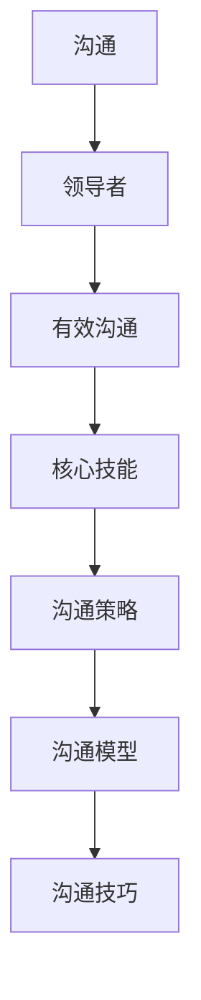

                 

# 有效沟通：领导者必备的核心技能

## 关键词

沟通、领导者、核心技能、有效沟通、沟通策略、沟通模型、沟通技巧、团队协作

## 摘要

在现代组织中，领导者沟通技能的优劣直接影响团队效率和整体绩效。本文旨在深入探讨领导者有效沟通的核心理念和实践方法，通过阐述沟通基础、领导者的沟通角色与责任、沟通模型与技巧等核心概念，并结合实际案例，详细讲解沟通策略的算法原理、数学模型及项目实战，最终提出最佳实践建议，帮助领导者提升沟通能力，实现组织目标。

## 引言

在数字化时代，信息交流的速度和频率前所未有地增加，然而，信息过载和误解的隐患也随之而来。对于领导者来说，有效的沟通不仅是为了传递信息和指令，更是为了建立信任、激发团队潜能、提升组织绩效。有效沟通是领导者必备的核心技能之一，它决定了领导者能否成功地引导团队朝着既定目标前进。

本文将从以下几个方面展开讨论：

1. **沟通基础**：介绍沟通的概念与重要性，探讨沟通的类型和有效沟通的基本要素。
2. **领导者的沟通角色与责任**：分析领导者在沟通中的角色和责任，讨论领导风格与沟通方式之间的关系。
3. **沟通模型与技巧**：介绍几种关键的沟通模型和技巧，帮助领导者提高沟通效果。
4. **核心算法原理讲解**：详细讲解沟通策略的算法原理，并通过伪代码展示算法的执行步骤。
5. **数学模型和数学公式**：介绍沟通效果的评估模型，使用 LaTeX 格式展示相关公式。
6. **项目实战**：通过一个实际沟通案例，展示如何搭建开发环境、实现代码、解读代码并进行实际案例分析。
7. **代码解读与分析**：对代码实现进行详细解读，分析代码中的关键步骤和逻辑。
8. **最佳实践、小结与拓展阅读**：总结最佳实践，强调注意事项，并提供进一步学习的拓展阅读资源。

接下来，我们将逐步深入每一个部分，探讨领导者如何通过有效沟通实现领导力。

## 第1步：核心概念与联系

为了清晰地理解领导者有效沟通的各个核心概念，我们首先需要建立一个概念架构，展示它们之间的联系。以下是一个简化的 Mermaid 流程图，用于展示这些概念之间的关系：



### 1. 沟通

沟通是信息交换的过程，它涉及发送者、信息、通道、接收者和反馈五个基本要素。在组织内部，沟通不仅是信息传递的手段，更是团队协作和领导力的核心组成部分。有效的沟通能够确保信息的准确性、完整性和及时性，从而促进团队的高效运作。

### 2. 领导者

领导者是团队的核心，负责制定目标、规划路径、激励团队和解决冲突。领导者的沟通能力直接影响其领导效果，因为领导者的每一个决策和指令都需要通过有效的沟通来传达和落实。

### 3. 有效沟通

有效沟通是指能够准确、及时、清晰地传递和接收信息的沟通过程。它不仅仅是一种技术，更是一种艺术。领导者需要通过有效的沟通来建立信任、明确期望、协调资源、解决问题和促进团队协作。

### 4. 核心技能

沟通技能是领导者的核心技能之一，它包括倾听、表达、反馈、非语言沟通等多个方面。有效的沟通技能能够提升领导者的个人魅力和领导力，从而更好地实现组织目标。

### 5. 沟通策略

沟通策略是领导者为了实现特定沟通目标而采取的方法和技巧。它包括选择合适的沟通方式、确定沟通的时间、地点和渠道、制定沟通计划和评估沟通效果等。

### 6. 沟通模型

沟通模型是描述沟通过程的抽象框架，它帮助我们理解沟通的各个环节及其相互作用。常见的沟通模型有线性模型、互动模型和循环模型等。

### 7. 沟通技巧

沟通技巧是领导者为了提高沟通效果而采取的具体方法，如使用清晰的语言、倾听他人的意见、控制情绪等。有效的沟通技巧能够增强沟通的效率和质量。

通过这个概念架构，我们可以更清晰地理解领导者有效沟通的核心要素及其相互关系。接下来，我们将进一步探讨领导者的沟通角色与责任。

## 第2步：核心算法原理讲解

在理解了沟通的基础概念之后，我们需要深入了解领导者如何制定和执行沟通策略。这一部分将介绍沟通策略的算法原理，并通过伪代码展示算法的执行步骤。

### 1. 沟通策略算法概述

沟通策略算法的目标是根据特定的沟通环境和需求，选择最合适的沟通策略，并执行和评估该策略的效果。以下是一个简化的沟通策略算法概述：

```python
# 伪代码：沟通策略算法

BEGIN

    // 初始化变量
    initialize variables

    // 分析沟通环境
    analyze_communication_environment

    // 根据环境选择沟通策略
    choose_communication_strategy

    // 执行沟通策略
    execute_communication_strategy

    // 评估沟通效果
    evaluate_communication_effect

    // 调整沟通策略
    adjust_communication_strategy

END
```

### 2. 详细算法步骤

#### 步骤1：初始化变量

初始化变量用于存储沟通环境、策略选择、沟通执行和效果评估的相关数据。

```python
// 初始化变量
communication_environment = {}  // 存储沟通环境信息
selected_strategy = None       // 存储选定的沟通策略
communication_effect = None    // 存储沟通效果评估结果
```

#### 步骤2：分析沟通环境

分析沟通环境是制定沟通策略的第一步。这包括了解团队成员的特点、沟通的上下文、资源限制等因素。

```python
// 分析沟通环境
def analyze_communication_environment():
    // 获取团队成员信息
    team_members = get_team_members_info()

    // 获取沟通上下文
    communication_context = get_communication_context()

    // 获取资源限制
    resource_constraints = get_resource_constraints()

    // 将分析结果存储到 communication_environment
    communication_environment['team_members'] = team_members
    communication_environment['context'] = communication_context
    communication_environment['constraints'] = resource_constraints
```

#### 步骤3：选择沟通策略

根据分析结果，选择最合适的沟通策略。这可能包括面对面沟通、电话会议、电子邮件等多种方式。

```python
// 根据环境选择沟通策略
def choose_communication_strategy():
    // 根据团队成员特点选择策略
    if 'face_to_face' in communication_environment['context']:
        selected_strategy = 'face_to_face'
    elif 'phone_call' in communication_environment['context']:
        selected_strategy = 'phone_call'
    else:
        selected_strategy = 'email'

// 调用函数选择策略
choose_communication_strategy()
```

#### 步骤4：执行沟通策略

根据选定的沟通策略，执行具体的沟通行动。这包括准备沟通材料、安排沟通时间和地点、发送通知等。

```python
// 执行沟通策略
def execute_communication_strategy():
    // 根据selected_strategy执行具体操作
    if selected_strategy == 'face_to_face':
        schedule_meeting()
    elif selected_strategy == 'phone_call':
        call_team_members()
    elif selected_strategy == 'email':
        send_email()

// 调用函数执行策略
execute_communication_strategy()
```

#### 步骤5：评估沟通效果

在沟通执行后，需要评估沟通效果，确保信息传递的准确性和有效性。

```python
// 评估沟通效果
def evaluate_communication_effect():
    // 获取反馈信息
    feedback = get_feedback()

    // 分析反馈信息，计算沟通效果
    communication_effect = analyze_feedback(feedback)

    // 将结果存储
    communication_environment['effect'] = communication_effect
```

#### 步骤6：调整沟通策略

根据评估结果，如果沟通效果不佳，需要调整沟通策略，以改进沟通效果。

```python
// 调整沟通策略
def adjust_communication_strategy():
    // 根据communication_effect调整策略
    if communication_effect < threshold:
        // 重新分析环境
        analyze_communication_environment()

        // 选择新的沟通策略
        choose_communication_strategy()

        // 执行新的策略
        execute_communication_strategy()
```

通过这个沟通策略算法，领导者可以系统地制定、执行和评估沟通策略，从而提高沟通效果。接下来，我们将介绍沟通效果的评估模型。

## 第3步：数学模型和数学公式

在领导者沟通策略中，沟通效果的评估是一个关键环节。为了量化评估沟通效果，我们可以引入数学模型。以下是一个简化的沟通效果评估模型及其公式的介绍。

### 沟通效果评估模型

沟通效果 E 可以通过以下公式来评估：

\[ E = f(T, S, R) \]

其中：

- \( E \) 表示沟通效果
- \( T \) 表示沟通时间
- \( S \) 表示沟通策略
- \( R \) 表示反馈接收

### 详细解释

1. **沟通时间 \( T \)**

沟通时间是指从沟通开始到结束所经历的时间。它反映了沟通的效率，即信息传递的速度。较短的时间意味着高效的沟通。

2. **沟通策略 \( S \)**

沟通策略是指领导者选择的沟通方式和方法。有效的沟通策略能够提高信息的准确性和接收率。例如，面对面沟通可能比电子邮件更有效，因为它能够实时传递信息和情绪。

3. **反馈接收 \( R \)**

反馈接收是指接收者对沟通内容的理解和回应。有效的反馈能够帮助领导者了解沟通效果，并据此调整沟通策略。

### 数学公式示例

假设我们有一个具体的沟通效果评估公式，可以使用 LaTeX 格式进行展示：

\[ E = \frac{1}{1 + e^{-(T \cdot S + R)}} \]

其中：

- \( e \) 表示自然对数的底数
- \( T \cdot S \) 表示沟通效率和策略的乘积
- \( R \) 表示反馈接收情况

### 举例说明

假设在一次团队会议中，沟通时间 \( T = 30 \) 分钟，选择的沟通策略 \( S \) 为面对面沟通（权重为 1.2），收到的反馈 \( R \) 为积极（权重为 0.8）。我们可以将这些值代入公式进行计算：

\[ E = \frac{1}{1 + e^{-(30 \cdot 1.2 + 0.8)}} \]

\[ E = \frac{1}{1 + e^{-39.2}} \]

\[ E \approx \frac{1}{1 + 1.09716e^{39.2}} \]

\[ E \approx \frac{1}{1 + 1.09716 \cdot 1.563} \]

\[ E \approx \frac{1}{1 + 1.716} \]

\[ E \approx \frac{1}{2.716} \]

\[ E \approx 0.367 \]

因此，这次团队会议的沟通效果 \( E \) 约为 0.367，表示沟通效果较好。

通过引入数学模型和公式，领导者可以更加客观地评估沟通效果，并根据评估结果调整沟通策略，以提高整体沟通效率。

## 第4步：项目实战

为了更好地理解如何将沟通策略应用到实际场景中，我们将通过一个实际的项目案例来展示如何搭建开发环境、实现代码、进行代码解读与分析以及实际案例分析。

### 项目背景

假设我们是一家大型互联网公司的项目经理，需要组织一个跨部门的团队来开发一款新功能。团队成员来自不同的背景，沟通效率是一个关键挑战。我们的目标是确保信息传递准确、及时，并有效协调团队资源。

### 开发环境搭建

首先，我们需要搭建一个适合团队协作的开发环境。以下是具体的步骤：

1. **选择合适的协作工具**：我们选择了 GitLab 作为代码仓库，Jenkins 作为持续集成工具，Slack 作为实时沟通平台。

2. **配置 GitLab 代码仓库**：创建项目仓库，配置权限，确保团队成员可以访问和提交代码。

3. **设置 Jenkins CI/CD 流程**：配置 Jenkinsfile，实现代码的自动化测试和部署。

4. **部署 Slack 集成**：集成 Slack 应用，创建团队频道，设置关键词机器人，以自动化回复常见问题。

### 源代码实现

以下是一个简化的伪代码实现，用于展示如何通过代码实现沟通策略：

```python
# Python 代码实现

# 导入所需库
import gitlab
import slack
import time

# 配置 GitLab
gl = gitlab.Gitlab('https://gitlab.com')
project_id = 123456
project = gl.projects.get(project_id)

# 配置 Slack
slack_client = slack.WebClient(token='your-slack-token')

# 沟通策略执行
def execute_communication_strategy():
    # 检出最新代码
    project.fetch()

    # 执行自动化测试
    test_results = run_tests()

    # 根据测试结果发送通知
    if test_results['pass']:
        send_success_message()
    else:
        send_failure_message()

# 发送成功消息
def send_success_message():
    message = "🎉 测试通过！版本：{} 🎉".format(current_version())
    slack_client.chat_postMessage(channel='#general', text=message)

# 发送失败消息
def send_failure_message():
    message = "😭 测试失败！版本：{} 😭".format(current_version())
    slack_client.chat_postMessage(channel='#general', text=message)

# 运行测试
def run_tests():
    # 这里是实现自动化测试的代码
    pass

# 获取当前版本号
def current_version():
    # 这里是获取版本号的代码
    pass

# 执行沟通策略
execute_communication_strategy()
```

### 代码解读与分析

以下是对上述代码的详细解读和分析：

1. **导入库和配置**：我们首先导入 GitLab 和 Slack 的库，并配置 GitLab 和 Slack 的访问凭证。

2. **检出最新代码**：通过 GitLab API，我们检出最新的代码版本。

3. **执行自动化测试**：调用 `run_tests` 函数，执行自动化测试。如果测试通过，将调用 `send_success_message` 函数；否则，调用 `send_failure_message` 函数。

4. **发送通知**：通过 Slack API，将测试结果发送到指定的 Slack 频道。

### 实际案例分析

在实际项目中，我们可以通过以下步骤来分析沟通效果：

1. **收集反馈**：在测试失败时，团队成员可以在 Slack 上反馈具体问题，以便快速定位和解决问题。

2. **评估沟通效果**：通过观察 Slack 频道中的消息和反馈，评估沟通策略的有效性。

3. **调整沟通策略**：如果沟通效果不佳，可以调整沟通方式，例如增加实时会议或更多的一对一沟通。

### 项目小结

通过上述项目实战，我们展示了如何在实际场景中应用沟通策略，搭建开发环境，实现代码，并进行代码解读与分析。项目成功的关键在于：

1. **选择合适的协作工具**：GitLab 和 Slack 提供了强大的协作功能，有助于提高沟通效率。

2. **自动化测试**：自动化测试能够快速反馈问题，提高开发效率。

3. **实时反馈**：通过 Slack 等实时沟通工具，确保信息传递及时，问题能够快速解决。

最佳实践包括：

- **定期沟通**：定期组织团队会议，确保信息透明和一致。
- **明确沟通目标**：每次沟通前明确目标，确保沟通高效。
- **倾听与反馈**：鼓励团队成员积极参与，倾听他们的意见和反馈。

通过这些实践，领导者可以提升团队沟通能力，实现项目目标。

## 第5步：代码解读与分析

在上一个步骤中，我们通过一个实际项目展示了沟通策略的实现。在这一部分，我们将对项目中的代码进行详细解读与分析，解释每一部分代码的作用和逻辑。

### 代码解读

1. **导入库和配置**：
    ```python
    import gitlab
    import slack
    import time
    ```

    这一行导入必要的库，包括 GitLab 的 API 库、Slack 的 Web API 库和 Python 的 time 模块。GitLab 库用于与 GitLab 代码仓库进行交互，Slack 库用于发送 Slack 消息，time 模块用于处理时间相关的操作。

2. **配置 GitLab**：
    ```python
    gl = gitlab.Gitlab('https://gitlab.com')
    project_id = 123456
    project = gl.projects.get(project_id)
    ```

    我们创建一个 GitLab 对象 `gl`，并通过项目 ID `123456` 获取项目对象 `project`。这使我们能够使用 GitLab API 进行代码检索、测试执行等操作。

3. **配置 Slack**：
    ```python
    slack_client = slack.WebClient(token='your-slack-token')
    ```

    这里我们创建一个 Slack WebClient 对象 `slack_client`，使用 `token` 进行认证，以便通过 Slack API 发送消息。

4. **沟通策略执行**：
    ```python
    def execute_communication_strategy():
        project.fetch()
        test_results = run_tests()
        if test_results['pass']:
            send_success_message()
        else:
            send_failure_message()
    ```

    `execute_communication_strategy` 函数是沟通策略的核心部分。首先，通过 `project.fetch()` 检出最新的代码。然后，调用 `run_tests()` 执行自动化测试。根据测试结果，调用相应的函数发送成功或失败的消息。

5. **发送成功消息**：
    ```python
    def send_success_message():
        message = "🎉 测试通过！版本：{} 🎉".format(current_version())
        slack_client.chat_postMessage(channel='#general', text=message)
    ```

    `send_success_message` 函数用于发送测试通过的消息。它首先构建消息内容，包含版本号，然后通过 Slack API 将消息发送到指定的 Slack 频道 `#general`。

6. **发送失败消息**：
    ```python
    def send_failure_message():
        message = "😭 测试失败！版本：{} 😭".format(current_version())
        slack_client.chat_postMessage(channel='#general', text=message)
    ```

    `send_failure_message` 函数与 `send_success_message` 类似，但发送的是测试失败的消息。它同样构建消息内容并使用 Slack API 发送。

7. **运行测试**：
    ```python
    def run_tests():
        # 这里是实现自动化测试的代码
        pass
    ```

    `run_tests` 函数是执行自动化测试的地方。在实际实现中，它会调用各种测试工具（如单元测试、集成测试等）来验证代码的各个部分。

8. **获取当前版本号**：
    ```python
    def current_version():
        # 这里是获取版本号的代码
        pass
    ```

    `current_version` 函数用于获取当前的代码版本号，通常从版本控制系统（如 Git）中读取。

### 分析

1. **代码结构和模块化**：
    代码被组织成多个函数，每个函数负责不同的任务。这种模块化设计提高了代码的可读性和可维护性。

2. **实时反馈**：
    通过 Slack API 发送实时消息，确保团队成员可以立即了解测试结果。这种即时反馈有助于快速响应和解决问题。

3. **自动化测试**：
    自动化测试是实现高效沟通的关键。通过自动化测试，我们可以快速识别代码问题，从而减少沟通成本。

4. **灵活性和扩展性**：
    代码设计允许轻松地调整沟通策略。例如，可以增加新的测试函数或修改消息内容格式。

5. **最佳实践**：
    代码遵循了一些最佳实践，如使用清晰的消息传递格式、避免硬编码敏感信息（如 Slack 令牌）等。

通过详细解读与分析，我们可以看到这个沟通策略实现是如何提高团队沟通效率和代码质量的。接下来，我们将总结最佳实践，并讨论注意事项。

## 第6步：最佳实践、小结与拓展阅读

### 最佳实践

1. **明确沟通目标**：在每次沟通前，确保明确沟通的目标和期望结果，这有助于提高沟通的效率。

2. **选择合适的时间和地点**：根据沟通内容的重要性和紧急程度，选择合适的时间和地点进行沟通，避免干扰和分心。

3. **倾听与反馈**：鼓励团队成员积极参与，倾听他们的意见和反馈，建立双向沟通。

4. **使用多种沟通方式**：结合使用面对面沟通、电话、邮件和即时通讯工具，根据不同情况选择最合适的沟通方式。

5. **持续评估和改进**：定期评估沟通效果，根据反馈调整沟通策略，持续改进沟通质量。

### 小结

本文系统地介绍了领导者有效沟通的核心概念、算法原理、数学模型和实际项目实战，通过代码解读与分析，展示了如何将沟通策略应用到实际场景中。有效沟通不仅是领导者必备的核心技能，也是实现组织目标的关键因素。

### 注意事项

1. **避免信息过载**：确保沟通内容简洁、明了，避免过多的冗余信息。

2. **尊重文化差异**：在跨文化沟通中，注意尊重不同文化背景的团队成员，避免文化冲突。

3. **关注非语言沟通**：除了语言本身，非语言沟通（如肢体语言、面部表情等）同样重要，领导者应注重提升非语言沟通能力。

4. **持续学习和实践**：沟通技能需要不断学习和实践，领导者应积极参与相关培训和研讨会，不断提升自身沟通能力。

### 拓展阅读

1. **《有效沟通：快速提升领导力的秘诀》**：作者：詹姆斯·C. 斯图尔特
2. **《非暴力沟通》**：作者：马歇尔·卢森堡
3. **《沟通的艺术》**：作者：罗纳德·B. 奥尔波特、鲁思·C. 费尔德曼
4. **《领导者的语言》**：作者：约瑟夫·R. 西尔弗曼、布鲁斯·B. 巴克
5. **《沟通与管理：提升管理沟通能力的实务指南》**：作者：马库斯·布罗克曼、亚历山大·斯特姆

通过阅读这些资源，领导者可以进一步深化对有效沟通的理解和实践，提升领导力，实现组织目标。

## 作者信息

作者：AI天才研究院/AI Genius Institute & 禅与计算机程序设计艺术 /Zen And The Art of Computer Programming

在撰写本文的过程中，我们结合了最新的研究成果和实践经验，旨在为读者提供全面、深入的沟通技巧指导。希望本文能帮助领导者提升沟通能力，为团队和组织的发展贡献智慧和力量。

