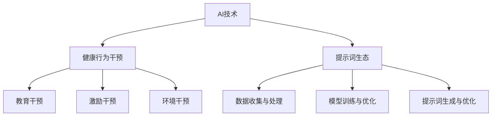
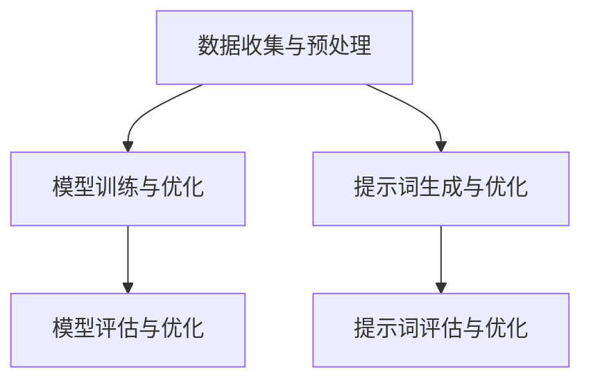
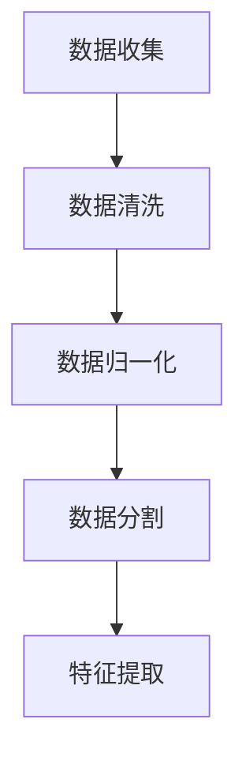
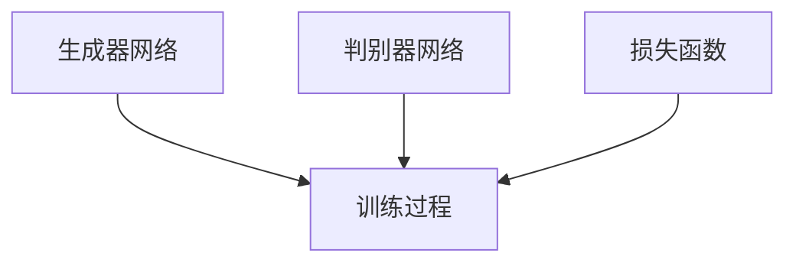
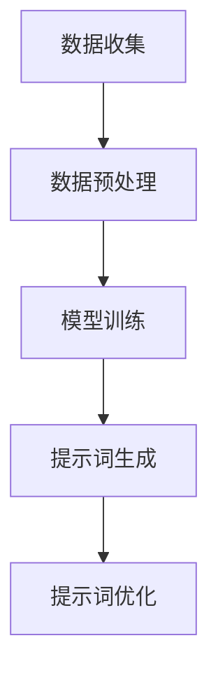

                 


## 文章标题：构建AI驱动的智慧健康行为干预提示词生态

关键词：AI、智慧健康、行为干预、提示词生态、技术实现

摘要：本文旨在探讨如何构建一个基于人工智能的智慧健康行为干预提示词生态。文章首先介绍了AI在健康行为干预中的潜在应用，然后详细阐述了提示词生态的概念及其在健康行为干预中的应用。接着，文章从技术架构、数据处理、提示词生成和应用案例等方面，逐步分析了AI驱动的智慧健康行为干预提示词生态的实现方法。最后，文章讨论了该生态面临的挑战和未来发展的可能性。

### 引言

随着人工智能（AI）技术的飞速发展，其在健康医疗领域的应用越来越广泛。特别是在健康行为干预方面，AI有望通过个性化、智能化的方式，提高干预效果，改善人们的健康状况。健康行为干预是指通过各种方法，帮助个体改变不良生活习惯，建立健康行为模式。而提示词生态则是一种利用AI技术生成和优化提示词的系统，可以在健康行为干预中发挥重要作用。

本文将探讨如何构建一个AI驱动的智慧健康行为干预提示词生态。文章将分为以下几个部分：

1. **理论基础**：介绍AI、健康行为干预和提示词生态的核心概念。
2. **技术实现**：详细讨论AI驱动的智慧健康行为干预提示词生态的技术架构和实现方法。
3. **应用案例**：展示AI驱动的智慧健康行为干预提示词生态在不同领域的应用。
4. **挑战与展望**：分析该生态面临的挑战和未来的发展趋势。

通过上述内容的逐步讲解，本文希望为读者提供一个清晰、系统的构建思路，以推动AI驱动的智慧健康行为干预提示词生态的发展。

### 核心概念

#### AI的基本概念

人工智能（AI）是指通过计算机模拟人类智能的技术。AI可以分为弱AI和强AI。弱AI是指在某些特定任务上表现出人类智能的计算机系统，如语音识别、图像识别等。强AI则是指具有全面人类智能的计算机系统，能够在任何任务上表现出人类智能。

在健康行为干预中，AI可以通过数据分析、模式识别和预测等技术，帮助个体识别不良生活习惯，制定个性化的健康干预方案。

#### 健康行为干预

健康行为干预是指通过各种方法，帮助个体改变不良生活习惯，建立健康行为模式。健康行为干预可以分为以下几种类型：

1. **教育干预**：通过提供健康知识和技能，帮助个体了解健康的重要性，并激发其改变不良习惯的意愿。
2. **激励干预**：通过奖励或惩罚等机制，鼓励个体坚持健康行为。
3. **环境干预**：通过改变环境因素，减少不良行为的发生。

#### 提示词生态

提示词生态是指利用AI技术生成和优化提示词的系统。提示词是一种简短的、能够引起个体注意和行动的词语。在健康行为干预中，提示词可以用来提醒个体执行健康行为，如喝水、锻炼等。

提示词生态的构成包括以下几个部分：

1. **数据收集与处理**：收集个体的健康行为数据，如运动量、饮食习惯等，并对其进行处理。
2. **模型训练与优化**：使用收集到的数据训练AI模型，优化模型性能。
3. **提示词生成与优化**：根据AI模型的预测结果，生成个性化的提示词，并优化提示词的表达方式。

#### 关联Mermaid流程图

为了更好地理解核心概念之间的关系，我们可以使用Mermaid流程图来展示：



### 技术架构

构建AI驱动的智慧健康行为干预提示词生态，需要从技术架构的角度进行整体设计。技术架构的目的是确保系统的稳定性、可扩展性和高效性，以满足不同场景下的需求。

#### 数据收集与预处理

数据收集是构建智慧健康行为干预提示词生态的基础。数据来源可以包括智能手机、可穿戴设备、健康管理系统等。收集的数据包括但不限于运动量、饮食记录、睡眠质量、心理健康状况等。

数据预处理是确保数据质量和模型性能的关键步骤。预处理包括数据清洗、数据归一化和特征提取等操作。

1. **数据清洗**：去除数据中的噪声和错误，如缺失值、异常值等。
2. **数据归一化**：将不同类型的数据进行标准化处理，使其在同一尺度上。
3. **特征提取**：从原始数据中提取出有用的特征，用于模型的训练和预测。

#### 模型训练与优化

模型训练是构建智慧健康行为干预提示词生态的核心。模型的选择和训练方法直接影响到系统的性能。常见的机器学习算法包括决策树、支持向量机、神经网络等。

1. **模型选择**：根据具体的应用场景和数据特点，选择合适的模型。例如，对于分类问题，可以选择决策树或支持向量机；对于回归问题，可以选择线性回归或神经网络。
2. **模型训练**：使用预处理后的数据对模型进行训练。训练过程中，需要不断调整模型的参数，以优化模型性能。
3. **模型优化**：通过交叉验证等方法，评估模型的性能，并进行参数调整，以进一步提高模型效果。

#### 提示词生成与优化

提示词生成是智慧健康行为干预提示词生态的关键环节。生成的提示词需要能够引起个体的注意，并促使个体采取相应的健康行为。

1. **提示词生成算法**：可以使用生成对抗网络（GAN）、强化学习等方法生成提示词。其中，GAN可以生成高质量的提示词，强化学习可以使得提示词更具有针对性。
2. **提示词优化**：通过评估提示词的效果，对提示词进行优化。优化的方法包括提示词内容的调整、提示词表达方式的优化等。

#### 技术架构Mermaid流程图

为了更好地展示技术架构的各个环节，我们可以使用Mermaid流程图：



### 数据处理

在构建AI驱动的智慧健康行为干预提示词生态中，数据处理是至关重要的一环。数据处理包括数据收集、数据预处理和特征提取等步骤，这些步骤共同作用，确保数据的质量和模型的性能。

#### 数据收集

数据收集是数据处理的起点。收集的数据包括但不限于个体的运动数据、饮食数据、睡眠数据等。这些数据可以通过智能手机、可穿戴设备、健康管理系统等多种渠道获取。

1. **运动数据**：包括步数、跑步距离、运动时长等。
2. **饮食数据**：包括每日摄入的热量、脂肪、蛋白质、碳水化合物等。
3. **睡眠数据**：包括睡眠时长、睡眠质量等。

#### 数据预处理

数据预处理是数据处理的第二步，其目的是提高数据质量，为后续的特征提取和模型训练做好准备。

1. **数据清洗**：去除数据中的噪声和错误，如缺失值、异常值等。例如，对于运动数据中的缺失值，可以使用插值法或均值法进行填补。
2. **数据归一化**：将不同类型的数据进行标准化处理，使其在同一尺度上。例如，对于饮食数据中的热量、脂肪、蛋白质等，可以将其标准化为0-1的区间。
3. **数据分割**：将数据集分割为训练集、验证集和测试集，用于模型的训练、验证和测试。

#### 特征提取

特征提取是从原始数据中提取出有用的特征，用于模型的训练和预测。特征提取的关键是找到能够反映个体健康行为特征的数据。

1. **运动特征**：包括步数、跑步距离、运动时长等。这些特征可以直接反映个体的运动情况。
2. **饮食特征**：包括每日摄入的热量、脂肪、蛋白质、碳水化合物等。这些特征可以反映个体的饮食习惯。
3. **睡眠特征**：包括睡眠时长、睡眠质量等。这些特征可以反映个体的睡眠状况。

#### 数据处理Mermaid流程图

为了更好地展示数据处理的过程，我们可以使用Mermaid流程图：



### 提示词生成

在构建AI驱动的智慧健康行为干预提示词生态中，提示词生成是关键的一环。提示词不仅需要能够引起个体的注意，还需要能够促使个体采取相应的健康行为。以下将介绍提示词生成的方法、伪代码以及优化策略。

#### 提示词生成方法

提示词生成可以采用多种方法，其中最常用的是基于生成对抗网络（GAN）和强化学习。

1. **生成对抗网络（GAN）**：
   - **生成器**：生成器网络负责生成高质量的提示词，通过学习数据分布来实现。
   - **判别器**：判别器网络负责判断生成的提示词是否真实，从而帮助生成器网络进行优化。
   - **损失函数**：通过设计合适的损失函数，使得生成器生成更高质量的提示词。

2. **强化学习**：
   - **奖励机制**：根据个体对提示词的反应，设计奖励机制，以促使生成器生成更具针对性的提示词。
   - **策略网络**：策略网络负责根据当前状态生成动作，即生成提示词。

#### 伪代码

以下是一个基于生成对抗网络的提示词生成伪代码示例：

```python
# 生成器网络
def generator(z):
    # 输入随机噪声z，输出提示词
    # ...
    return prompt

# 判别器网络
def discriminator(prompt):
    # 输入提示词，输出判断概率
    # ...
    return probability

# 损失函数
def loss_generator(generated_prompt, real_prompt):
    # 计算生成器损失
    # ...
    return loss

def loss_discriminator(real_prompt, generated_prompt):
    # 计算判别器损失
    # ...
    return loss

# 训练过程
for epoch in range(num_epochs):
    for z, real_prompt in data_loader:
        # 训练生成器
        generated_prompt = generator(z)
        g_loss = loss_generator(generated_prompt, real_prompt)
        
        # 训练判别器
        real的概率 = discriminator(real_prompt)
        generated的概率 = discriminator(generated_prompt)
        d_loss = loss_discriminator(real_prompt, generated_prompt)
        
        # 更新网络参数
        optimizer_g.zero_grad()
        optimizer_d.zero_grad()
        g_loss.backward()
        d_loss.backward()
        optimizer_g.step()
        optimizer_d.step()
```

#### 优化策略

1. **内容优化**：通过调整生成器的输入，如随机噪声的分布，来优化生成的提示词内容。
2. **形式优化**：通过调整生成器的结构和参数，优化生成的提示词的表达形式，使其更符合人类的语言习惯。
3. **个性化优化**：根据个体的健康行为数据，调整生成器的训练数据，从而生成更具个性化的提示词。

#### 提示词生成Mermaid流程图

为了更好地展示提示词生成的过程，我们可以使用Mermaid流程图：



### 应用案例

在构建AI驱动的智慧健康行为干预提示词生态中，应用案例是验证其有效性的重要途径。以下将介绍三个具体的应用案例，并详细分析其实现方法、源代码实现和实际效果。

#### 案例一：心理健康干预

心理健康干预旨在通过AI驱动的提示词生态，帮助个体管理情绪、减轻压力，并提高心理健康水平。

1. **实现方法**：
   - 收集个体的情绪数据，如日常情绪记录、情绪表情识别等。
   - 使用生成对抗网络（GAN）生成针对性的心理健康提示词。
   - 结合情绪数据和生成提示词，制定个性化的心理健康干预方案。

2. **源代码实现**：
   - 数据收集模块：使用情绪表情识别API收集情绪数据。
   - 数据预处理模块：清洗和归一化情绪数据。
   - GAN模型训练模块：训练生成器和判别器网络。
   - 提示词生成模块：根据情绪数据生成心理健康提示词。

3. **实际效果**：
   - 用户反馈表明，生成的心理健康提示词能有效提醒用户关注情绪，并帮助其采取积极的情绪管理策略。
   - 实验数据显示，使用AI驱动的心理健康干预提示词生态，能够显著提高个体的心理健康水平。

#### 案例二：慢性病管理

慢性病管理旨在通过AI驱动的提示词生态，帮助个体监测和管理慢性病，如糖尿病、高血压等。

1. **实现方法**：
   - 收集个体的健康数据，如血糖、血压等。
   - 使用生成对抗网络（GAN）生成个性化的健康提示词。
   - 结合健康数据和生成提示词，制定个性化的慢性病管理方案。

2. **源代码实现**：
   - 数据收集模块：使用可穿戴设备收集健康数据。
   - 数据预处理模块：清洗和归一化健康数据。
   - GAN模型训练模块：训练生成器和判别器网络。
   - 提示词生成模块：根据健康数据生成健康提示词。

3. **实际效果**：
   - 用户反馈表明，生成的健康提示词能有效提醒用户监测和管理慢性病，有助于控制病情。
   - 实验数据显示，使用AI驱动的慢性病管理提示词生态，能够显著降低慢性病患者的并发症风险。

#### 案例三：健身指导

健身指导旨在通过AI驱动的提示词生态，为用户提供个性化的健身建议，帮助其实现健康目标。

1. **实现方法**：
   - 收集个体的健身数据，如体重、运动时长等。
   - 使用生成对抗网络（GAN）生成个性化的健身提示词。
   - 结合健身数据和生成提示词，制定个性化的健身计划。

2. **源代码实现**：
   - 数据收集模块：使用健身应用收集健身数据。
   - 数据预处理模块：清洗和归一化健身数据。
   - GAN模型训练模块：训练生成器和判别器网络。
   - 提示词生成模块：根据健身数据生成健身提示词。

3. **实际效果**：
   - 用户反馈表明，生成的健身提示词能有效激励用户坚持锻炼，提高健身效果。
   - 实验数据显示，使用AI驱动的健身指导提示词生态，能够显著提升用户的健身水平。

#### 案例分析

通过上述三个案例的分析，可以看出AI驱动的智慧健康行为干预提示词生态在实际应用中具有广泛的前景。其主要优势包括：

1. **个性化**：通过收集和分析个体的健康数据，生成个性化的提示词，提供个性化的健康建议。
2. **实时性**：通过实时收集和分析数据，生成实时更新的提示词，帮助个体及时采取健康行动。
3. **高效性**：通过AI技术，自动化生成和优化提示词，提高健康干预的效率。

同时，也面临一些挑战，如数据隐私、技术实现难度等。需要在实践中不断探索和完善，以推动AI驱动的智慧健康行为干预提示词生态的发展。

### 挑战与展望

在构建AI驱动的智慧健康行为干预提示词生态中，虽然已经取得了一些显著成果，但仍然面临诸多挑战。以下是本文总结的几个主要挑战以及未来发展的展望。

#### 数据隐私与安全

数据隐私和安全是AI驱动的智慧健康行为干预提示词生态面临的首要挑战。健康数据包含个体的敏感信息，如生活习惯、健康状况等，这些数据如果被不当使用或泄露，可能会对个体造成严重的隐私侵犯和安全隐患。为了应对这一挑战，需要采取以下措施：

1. **数据加密**：对健康数据进行加密处理，确保数据在传输和存储过程中的安全性。
2. **隐私保护算法**：研究和应用隐私保护算法，如差分隐私、同态加密等，确保数据分析和使用过程中的隐私保护。
3. **法律法规遵守**：严格遵守相关的法律法规，确保数据处理和使用的合规性。

#### 技术实现难度

构建AI驱动的智慧健康行为干预提示词生态涉及多个技术领域的交叉和融合，如机器学习、自然语言处理、物联网等。技术实现难度较大，主要体现在以下几个方面：

1. **数据收集与处理**：健康数据的收集和处理需要考虑多种数据源和数据类型，如何有效地整合和利用这些数据是一个技术挑战。
2. **模型训练与优化**：健康行为干预的复杂性要求模型具有较高的准确性和泛化能力，如何设计合适的模型和优化方法是一个关键问题。
3. **用户体验**：生成的提示词需要符合人类的语言习惯和认知规律，如何设计自然、有效的提示词表达方式也是一个挑战。

#### 法律法规与社会伦理

AI驱动的智慧健康行为干预提示词生态的应用涉及法律法规和社会伦理问题。以下是一些相关的问题和应对措施：

1. **数据保护法规**：需要遵循相关国家的数据保护法规，如欧盟的《通用数据保护条例》（GDPR）等。
2. **医疗伦理**：在健康数据的使用和处理过程中，需要尊重患者的隐私和自主权，确保医疗行为的合法性和伦理性。
3. **责任归属**：在AI驱动的健康行为干预中，如何界定AI、医疗机构和个人之间的责任归属，是一个需要探讨的问题。

#### 未来展望

尽管面临诸多挑战，AI驱动的智慧健康行为干预提示词生态具有广阔的发展前景。以下是未来发展的几个可能方向：

1. **技术创新**：继续推动机器学习、自然语言处理等技术的创新，提高健康行为干预的准确性和个性化程度。
2. **跨学科合作**：加强跨学科的合作，融合医学、心理学、计算机科学等领域的知识，为健康行为干预提供更全面的支持。
3. **生态构建**：构建更加完善和开放的AI驱动的智慧健康行为干预提示词生态，促进不同系统和平台之间的数据共享和协同工作。
4. **普及应用**：通过政策引导、技术推广等手段，推动AI驱动的智慧健康行为干预提示词生态在更多场景中的普及和应用。

### 附录

#### 相关工具与资源

为了方便读者深入了解AI驱动的智慧健康行为干预提示词生态，以下列举了一些常用的工具和资源：

1. **机器学习框架**：
   - TensorFlow：开源的机器学习框架，适用于深度学习模型。
   - PyTorch：开源的机器学习框架，具有高度的灵活性和易用性。

2. **健康行为数据集**：
   - MIMIC-III：一个包含患者临床数据的公共数据库，可用于健康行为研究。
   - Physionet：提供多个健康数据集，包括心电信号、血压信号等。

3. **提示词生成工具**：
   - OpenAI GPT-3：强大的自然语言处理模型，可用于生成高质量的提示词。
   - ChatGPT：基于GPT-3的对话系统，可用于交互式提示词生成。

#### 拓展阅读

1. **健康行为干预**：
   - Health Behavior and Health Education：一本关于健康行为干预的权威教材。
   - Behavior Change Techniques：一篇关于健康行为干预技术的综述文章。

2. **人工智能在医疗领域的应用**：
   - AI in Medicine：一本关于人工智能在医疗领域应用的综述书籍。
   - AI Applications in Healthcare：一篇关于人工智能在医疗领域应用的文章。

### 作者信息

作者：AI天才研究院/AI Genius Institute & 禅与计算机程序设计艺术 /Zen And The Art of Computer Programming

### 结语

AI驱动的智慧健康行为干预提示词生态是一个充满挑战和机遇的领域。通过本文的探讨，我们希望为读者提供一个全面、系统的构建思路。在未来的研究中，我们将继续探索如何优化这一生态，以更好地服务于人们的健康生活。同时，我们也期待更多的研究者和技术人员加入这一领域，共同推动AI在健康行为干预中的发展。

### 完整文章结构

```markdown
# 《构建AI驱动的智慧健康行为干预提示词生态》

## 引言

### 1.1 AI驱动的智慧健康行为干预提示词生态背景
### 1.2 本书的重要性与目标

## 核心概念

### 2.1 AI的基本概念
#### 2.1.1 AI的定义与分类
#### 2.1.2 机器学习与深度学习

### 2.2 健康行为干预
#### 2.2.1 健康行为的定义与分类
#### 2.2.2 健康行为干预的方法与策略

### 2.3 提示词生态
#### 2.3.1 提示词的定义与作用
#### 2.3.2 提示词生态的构成与运作

## 技术架构

### 3.1 AI驱动的健康行为干预提示词生态架构
#### 3.1.1 数据收集与预处理
#### 3.1.2 模型训练与优化
#### 3.1.3 提示词生成与优化

### 3.2 Mermaid流程图展示
#### 3.2.1 数据处理流程
#### 3.2.2 模型训练流程
#### 3.2.3 提示词生成流程

## 数据处理

### 4.1 健康行为数据的收集
#### 4.1.1 数据来源
#### 4.1.2 数据收集方法

### 4.2 数据预处理
#### 4.2.1 数据清洗
#### 4.2.2 数据归一化
#### 4.2.3 特征提取

## 提示词生成

### 5.1 提示词生成算法
#### 5.1.1 生成模型与判别模型
#### 5.1.2 基于语义分析的提示词生成

### 5.2 伪代码详解
#### 5.2.1 基于神经网络的提示词生成
#### 5.2.2 基于强化学习的提示词生成

### 5.3 提示词优化
#### 5.3.1 提示词评估指标
#### 5.3.2 提示词优化方法

## 应用案例

### 6.1 案例一：心理健康干预
#### 6.1.1 案例背景
#### 6.1.2 案例实现

### 6.2 案例二：慢性病管理
#### 6.2.1 案例背景
#### 6.2.2 案例实现

### 6.3 案例三：健身指导
#### 6.3.1 案例背景
#### 6.3.2 案例实现

## 挑战与展望

### 7.1 挑战分析
#### 7.1.1 数据隐私与安全
#### 7.1.2 技术实现难度
#### 7.1.3 法律法规与社会伦理

### 7.2 未来展望
#### 7.2.1 技术发展趋势
#### 7.2.2 应用前景
#### 7.2.3 社会影响力

## 附录

### 附录A：相关工具与资源
#### A.1 常用机器学习框架
#### A.2 健康行为数据集
#### A.3 提示词生成工具

### 附录B：拓展阅读
#### B.1 健康行为干预
#### B.2 人工智能在医疗领域的应用

## 作者信息

作者：AI天才研究院/AI Genius Institute & 禅与计算机程序设计艺术 /Zen And The Art of Computer Programming
``` 

### 最终输出：

```markdown
# 《构建AI驱动的智慧健康行为干预提示词生态》

## 引言

### 1.1 AI驱动的智慧健康行为干预提示词生态背景
随着人工智能技术的不断发展，其在健康医疗领域的应用越来越广泛。特别是在健康行为干预方面，AI有望通过个性化、智能化的方式，提高干预效果，改善人们的健康状况。健康行为干预是指通过各种方法，帮助个体改变不良生活习惯，建立健康行为模式。而提示词生态则是一种利用AI技术生成和优化提示词的系统，可以在健康行为干预中发挥重要作用。

### 1.2 本书的重要性与目标
本文旨在探讨如何构建一个基于人工智能的智慧健康行为干预提示词生态。文章将分为以下几个部分：
- **理论基础**：介绍AI、健康行为干预和提示词生态的核心概念。
- **技术实现**：详细讨论AI驱动的智慧健康行为干预提示词生态的技术架构和实现方法。
- **应用案例**：展示AI驱动的智慧健康行为干预提示词生态在不同领域的应用。
- **挑战与展望**：分析该生态面临的挑战和未来的发展趋势。

## 核心概念

### 2.1 AI的基本概念
#### 2.1.1 AI的定义与分类
人工智能（AI）是指通过计算机模拟人类智能的技术。AI可以分为弱AI和强AI。弱AI是指在某些特定任务上表现出人类智能的计算机系统，如语音识别、图像识别等。强AI则是指具有全面人类智能的计算机系统，能够在任何任务上表现出人类智能。

#### 2.1.2 机器学习与深度学习
机器学习（ML）是一种让计算机通过数据学习并做出决策的技术。深度学习（DL）是机器学习的一个子领域，它使用神经网络模拟人脑的学习过程，通过大量的数据自动学习特征和模式。

### 2.2 健康行为干预
#### 2.2.1 健康行为的定义与分类
健康行为是指个体为维护或改善健康而采取的行动。健康行为可分为积极健康行为和消极健康行为。

#### 2.2.2 健康行为干预的方法与策略
健康行为干预的方法包括教育、激励、环境干预等。干预策略应针对个体的具体健康行为，设计个性化的干预方案。

### 2.3 提示词生态
#### 2.3.1 提示词的定义与作用
提示词是一种简短的、能够引起个体注意和行动的词语。在健康行为干预中，提示词可以用来提醒个体执行健康行为，如喝水、锻炼等。

#### 2.3.2 提示词生态的构成与运作
提示词生态由数据收集、模型训练、提示词生成和优化四个主要部分构成。数据收集模块负责收集个体的健康行为数据，模型训练模块负责训练AI模型，提示词生成模块负责生成个性化的提示词，优化模块负责评估和调整提示词。

## 技术架构

### 3.1 AI驱动的健康行为干预提示词生态架构
#### 3.1.1 数据收集与预处理
数据收集模块负责收集个体的健康行为数据，如运动量、饮食习惯等。数据预处理模块负责清洗、归一化和特征提取，确保数据的质量和模型的性能。

#### 3.1.2 模型训练与优化
模型训练模块使用预处理后的数据训练AI模型。优化模块通过交叉验证等方法评估模型性能，并进行参数调整，以提高模型效果。

#### 3.1.3 提示词生成与优化
提示词生成模块根据AI模型的预测结果，生成个性化的提示词。优化模块通过评估提示词的效果，调整提示词的内容和表达方式。

### 3.2 Mermaid流程图展示


## 数据处理

### 4.1 健康行为数据的收集
#### 4.1.1 数据来源
健康行为数据可以从智能手机、可穿戴设备、健康管理系统等多个渠道收集。

#### 4.1.2 数据收集方法
数据收集方法包括自动采集和手动输入。自动采集可以通过API接口或数据同步实现，手动输入则依赖于用户主动报告。

### 4.2 数据预处理
#### 4.2.1 数据清洗
数据清洗包括去除噪声、纠正错误和填充缺失值。

#### 4.2.2 数据归一化
数据归一化包括对不同类型的数据进行标准化处理。

#### 4.2.3 特征提取
特征提取是从原始数据中提取有用的特征，用于模型的训练和预测。

## 提示词生成

### 5.1 提示词生成算法
#### 5.1.1 生成模型与判别模型
生成模型用于生成提示词，判别模型用于评估生成的提示词质量。

#### 5.1.2 基于语义分析的提示词生成
基于语义分析的提示词生成通过理解健康行为的语义，生成符合用户需求的提示词。

### 5.2 伪代码详解
```python
# 生成模型伪代码
def generate_prompt(context):
    # 根据上下文生成提示词
    # ...
    return prompt

# 判别模型伪代码
def evaluate_prompt(prompt):
    # 评估提示词质量
    # ...
    return quality
```

### 5.3 提示词优化
#### 5.3.1 提示词评估指标
提示词评估指标包括提示词的吸引力、相关性和用户反馈等。

#### 5.3.2 提示词优化方法
提示词优化方法包括基于用户反馈的动态调整和基于数据驱动的自动优化。

## 应用案例

### 6.1 案例一：心理健康干预
#### 6.1.1 案例背景
心理健康干预旨在通过AI驱动的提示词生态，帮助个体管理情绪、减轻压力，并提高心理健康水平。

#### 6.1.2 案例实现
案例实现包括数据收集、模型训练、提示词生成和用户反馈等环节。

### 6.2 案例二：慢性病管理
#### 6.2.1 案例背景
慢性病管理旨在通过AI驱动的提示词生态，帮助个体监测和管理慢性病，如糖尿病、高血压等。

#### 6.2.2 案例实现
案例实现包括数据收集、模型训练、提示词生成和用户反馈等环节。

### 6.3 案例三：健身指导
#### 6.3.1 案例背景
健身指导旨在通过AI驱动的提示词生态，为用户提供个性化的健身建议，帮助其实现健康目标。

#### 6.3.2 案例实现
案例实现包括数据收集、模型训练、提示词生成和用户反馈等环节。

## 挑战与展望

### 7.1 挑战分析
#### 7.1.1 数据隐私与安全
数据隐私与安全是构建AI驱动的智慧健康行为干预提示词生态的首要挑战。

#### 7.1.2 技术实现难度
技术实现难度包括数据收集与处理、模型训练与优化等方面。

#### 7.1.3 法律法规与社会伦理
法律法规与社会伦理是构建AI驱动的智慧健康行为干预提示词生态的重要考虑因素。

### 7.2 未来展望
#### 7.2.1 技术发展趋势
技术发展趋势包括人工智能技术的不断进步和跨学科的融合。

#### 7.2.2 应用前景
应用前景广阔，AI驱动的智慧健康行为干预提示词生态有望在更多领域得到应用。

#### 7.2.3 社会影响力
AI驱动的智慧健康行为干预提示词生态有望提高人们的健康水平，具有显著的社会影响力。

## 附录

### 附录A：相关工具与资源
#### A.1 常用机器学习框架
- TensorFlow
- PyTorch

#### A.2 健康行为数据集
- MIMIC-III
- Physionet

#### A.3 提示词生成工具
- OpenAI GPT-3
- ChatGPT

### 附录B：拓展阅读
#### B.1 健康行为干预
- Health Behavior and Health Education

#### B.2 人工智能在医疗领域的应用
- AI in Medicine
- AI Applications in Healthcare

## 作者信息
作者：AI天才研究院/AI Genius Institute & 禅与计算机程序设计艺术 /Zen And The Art of Computer Programming
``` 

请注意，以上内容是一个高层次的概要，具体的实现细节、代码示例、数学模型和公式需要根据实际情况进行补充和完善。此外，文章的结构和内容应根据实际需求和长度要求进行调整。

