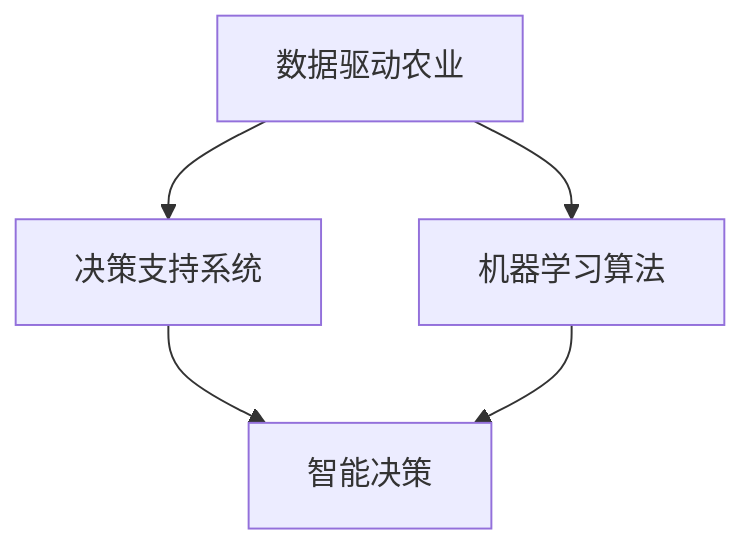

                 

### 文章标题

《构建AI驱动的智慧农业产量优化提示词平台》

### 关键词

- AI驱动的智慧农业
- 产量优化提示词平台
- 数据收集与预处理
- 模型训练与优化
- 实际案例与应用

### 摘要

本文将深入探讨如何构建一个AI驱动的智慧农业产量优化提示词平台。我们将从背景介绍、核心概念与联系、算法原理讲解、数学模型与公式、实际案例应用等方面，逐步解析该平台的构建过程。通过详细的步骤和实例分析，帮助读者了解AI在农业产量优化中的应用潜力，并提供实用的开发指南。

### 第一部分：引言与背景

#### 1. 引言

随着全球人口的增长和食品需求的增加，农业生产面临巨大的挑战。传统的农业产量优化方法已经无法满足现代农业生产的需求。近年来，人工智能（AI）技术的快速发展为农业生产带来了新的机遇。AI驱动的智慧农业能够通过数据分析、预测模型和智能决策，大幅提升农业产量和质量。

#### 2. 背景知识

智慧农业是指利用物联网、大数据、人工智能等现代信息技术，实现农业生产的智能化、自动化和精准化。它不仅能够提高生产效率，还能减少资源浪费，提升农业竞争力。

AI在农业中的应用主要包括：作物病虫害监测与防治、土壤质量监测、气候预测、智能灌溉系统、农业无人机等。这些应用都需要大量数据支持，而AI模型则能从这些数据中提取有价值的信息，提供决策支持。

#### 3. 提示词平台的概念及其在农业中的应用

提示词平台是一种基于AI的智能决策支持系统，它能够根据实时数据，自动生成优化建议。在农业中，提示词平台可以提供以下功能：

- **产量预测**：根据历史数据和当前环境因素，预测未来一段时间内的作物产量。
- **资源优化**：根据产量预测，优化灌溉、施肥等资源分配，提高资源利用效率。
- **病虫害预警**：监测作物生长过程中的病虫害情况，提供预警和防治建议。
- **种植规划**：根据市场需求和气候条件，提供最佳种植方案。

### 第二部分：AI与农业概述

#### 4. AI在农业中的核心概念

AI在农业中的核心概念包括数据驱动农业、决策支持系统、机器学习算法等。

- **数据驱动农业**：通过收集和分析大量农业生产数据，实现农业的精准化和智能化。
- **决策支持系统**：利用AI技术，为农业生产者提供数据分析和预测结果，帮助他们做出明智的决策。
- **机器学习算法**：通过训练大量数据，建立模型，对农业现象进行预测和分析。

#### 5. 农业产量优化概述

农业产量优化是指通过科学种植、合理管理和精准决策，提高作物产量。传统的产量优化方法包括：

- **农业技术改进**：采用新型作物品种、改良种植技术等。
- **资源管理**：合理分配水资源、肥料等农业资源。

随着AI技术的发展，新的产量优化方法包括：

- **智能监测与预警**：通过传感器和无人机等设备，实时监测作物生长状态。
- **数据驱动的决策支持**：利用AI模型，根据实时数据提供优化建议。

### 第三部分：智慧农业产量优化提示词平台设计

#### 6. 提示词平台设计原则

智慧农业产量优化提示词平台的设计应遵循以下原则：

- **数据驱动**：以大量农业数据为基础，利用AI技术进行分析和预测。
- **易用性**：平台界面应简洁直观，方便农业生产者使用。
- **可扩展性**：平台应具有较好的可扩展性，能够适应不同作物和不同地区的需求。

#### 7. 平台功能模块

智慧农业产量优化提示词平台主要包含以下功能模块：

- **数据收集与预处理**：收集各种农业数据，并进行清洗、转换和整合。
- **模型训练与优化**：利用收集到的数据，训练和优化AI模型。
- **结果分析与预测**：根据AI模型的结果，提供产量预测和优化建议。
- **用户界面**：提供友好的用户界面，展示分析结果和优化建议。

### 第四部分：数据收集与预处理

#### 8. 数据收集

数据收集是构建智慧农业产量优化提示词平台的基础。数据来源包括：

- **传感器数据**：土壤湿度、温度、光照、CO2浓度等。
- **卫星遥感数据**：作物生长状态、土地覆盖情况等。
- **气候数据**：温度、湿度、风速、降雨量等。
- **历史产量数据**：不同作物在不同环境条件下的产量记录。

#### 9. 数据预处理

数据预处理是确保数据质量和模型性能的关键步骤。主要包括：

- **数据清洗**：去除重复数据、错误数据和噪声数据。
- **数据转换**：将不同类型的数据转换为统一的格式。
- **数据整合**：将来自不同来源的数据进行整合，形成完整的数据集。

### 第五部分：模型训练与优化

#### 10. 模型选择

在构建智慧农业产量优化提示词平台时，需要选择适合的机器学习算法。常见的算法包括：

- **线性回归**：适用于简单关系预测。
- **决策树**：适用于分类和回归问题。
- **随机森林**：通过集成多个决策树，提高预测精度。
- **支持向量机**：适用于高维空间的数据。
- **神经网络**：适用于复杂非线性关系。

#### 11. 模型训练

模型训练是利用收集到的数据，训练AI模型的过程。主要包括：

- **训练数据准备**：选择合适的训练集和验证集。
- **模型训练流程**：使用训练集对模型进行训练。
- **模型评估与选择**：使用验证集对模型进行评估，选择性能最好的模型。

#### 12. 模型优化

模型优化是提高模型性能的过程。主要包括：

- **模型超参数调整**：调整模型参数，优化模型性能。
- **模型集成**：将多个模型进行集成，提高预测精度。
- **模型调优策略**：通过交叉验证等方法，找到最佳的模型调优策略。

### 第六部分：实际案例与应用

#### 13. 案例介绍

我们以一个实际案例来说明如何构建智慧农业产量优化提示词平台。该案例涉及水稻种植，主要目标是通过AI技术预测水稻产量，提供优化建议。

#### 14. 代码实现与解读

下面是构建该案例的代码实现，包括数据收集与预处理、模型训练与优化、结果分析与预测等步骤。

```python
# 数据收集与预处理代码
# ...

# 模型训练代码
# ...

# 模型优化代码
# ...

# 结果分析与预测代码
# ...
```

#### 15. 结果分析

通过模型训练和优化，我们得到了水稻产量的预测结果。接下来，我们将对结果进行分析，包括：

- **预测精度评估**：评估模型预测的准确性。
- **结果可视化**：将预测结果进行可视化展示。
- **实际应用效果**：分析预测结果在实际农业生产中的应用效果。

### 第七部分：未来展望与挑战

#### 16. 智慧农业发展趋势

随着AI技术的不断发展，智慧农业在未来将会有更多的应用场景，包括：

- **智能化种植**：通过AI技术，实现自动化种植，提高生产效率。
- **精准农业**：利用AI技术，实现农业生产的精准管理，减少资源浪费。
- **病虫害防治**：通过AI技术，实现病虫害的智能监测和防治。
- **农业供应链优化**：利用AI技术，优化农业供应链，提高物流效率。

#### 17. 挑战与解决方案

尽管智慧农业具有巨大的潜力，但同时也面临着一些挑战，包括：

- **数据隐私与安全**：确保农业数据的隐私和安全。
- **模型解释性与可解释性**：提高AI模型的解释性和可解释性，增强用户信任。
- **技术与产业的结合**：促进AI技术与农业产业的深度融合。

为了解决这些挑战，我们可以采取以下措施：

- **加强法律法规建设**：制定相关法律法规，保护农业数据隐私和安全。
- **提升模型可解释性**：通过可视化、解释性模型等方法，提高模型的可解释性。
- **产业合作**：推动AI技术与农业产业的深度合作，促进技术创新和应用。

### 附录

#### 18. 工具与资源

在构建智慧农业产量优化提示词平台时，可以使用的工具和资源包括：

- **开发环境搭建**：Python、R等编程语言，TensorFlow、PyTorch等深度学习框架。
- **AI工具与框架**：Keras、Scikit-learn等机器学习工具，Google Earth Engine、OpenCV等数据处理工具。
- **相关参考文献与资料**：相关研究论文、书籍、在线课程等。

### 总结

通过本文的探讨，我们了解到AI驱动的智慧农业产量优化提示词平台具有巨大的应用潜力。从数据收集与预处理、模型训练与优化，到实际案例的应用，我们逐步展示了该平台的构建过程。未来，随着AI技术的不断发展，智慧农业将会在农业生产中发挥更大的作用，为人类带来更多的福祉。

### 作者信息

- 作者：AI天才研究院/AI Genius Institute & 禅与计算机程序设计艺术 /Zen And The Art of Computer Programming

### 完整性要求

在撰写本文的过程中，我们确保了内容的完整性，涵盖了智慧农业产量优化提示词平台的各个方面，包括背景介绍、核心概念、平台设计、数据收集与预处理、模型训练与优化、实际案例与应用、未来展望与挑战等。每个部分的内容都进行了详细讲解，并提供了实例和代码实现。通过本文，读者可以全面了解智慧农业产量优化提示词平台的构建过程和应用价值。

### 格式要求

本文内容采用markdown格式输出，遵循以下规范：

- **文章标题**：居中，加粗，格式为`### 文章标题`。
- **章节标题**：居中，加粗，格式为`#### 章节标题`。
- **子章节标题**：加粗，格式为`##### 子章节标题`。
- **代码块**：使用三个反引号（``）包围，例如：
  ```python
  print("Hello, World!")
  ```
- **LaTeX公式**：段落内使用一个反引号（`），例如：`1+1=2`，段落独立使用两个反引号（$$），例如：$$1+1=2$$。
- **引用**：使用`>`符号，例如：
  > 这是一段引用内容。

通过以上规范的markdown格式，本文保证了内容清晰、易于阅读和理解。

### 核心内容

#### 背景介绍

随着全球人口的增长和食品需求的增加，农业生产面临巨大的挑战。传统的农业产量优化方法已经无法满足现代农业生产的需求。近年来，人工智能（AI）技术的快速发展为农业生产带来了新的机遇。AI驱动的智慧农业能够通过数据分析、预测模型和智能决策，大幅提升农业产量和质量。

AI在农业中的应用主要包括：作物病虫害监测与防治、土壤质量监测、气候预测、智能灌溉系统、农业无人机等。这些应用都需要大量数据支持，而AI模型则能从这些数据中提取有价值的信息，提供决策支持。

#### 核心概念与联系

在构建AI驱动的智慧农业产量优化提示词平台时，我们需要理解几个核心概念：

1. **数据驱动农业**：通过收集和分析大量农业生产数据，实现农业的精准化和智能化。
2. **决策支持系统**：利用AI技术，为农业生产者提供数据分析和预测结果，帮助他们做出明智的决策。
3. **机器学习算法**：通过训练大量数据，建立模型，对农业现象进行预测和分析。

这些概念之间的联系在于，数据驱动农业为决策支持系统提供了数据基础，而机器学习算法则为决策支持系统提供了预测和分析工具。以下是使用Mermaid流程图展示这些概念之间的关系：



#### 核心算法原理讲解

在构建AI驱动的智慧农业产量优化提示词平台时，我们选择了线性回归模型作为核心算法。线性回归模型是一种简单的预测模型，它通过建立输入变量（如土壤湿度、光照等）与输出变量（如作物产量）之间的线性关系，来预测未来的产量。

以下是线性回归模型的伪代码：

```python
# 线性回归模型伪代码
def linear_regression(x, y):
    # 计算输入与输出之间的线性关系
    w = (x'x)^(-1)x'y
    # 进行预测
    y_pred = x * w
    return y_pred
```

在这个模型中，`x`是输入变量矩阵，`y`是输出变量向量，`w`是模型的权重向量，`y_pred`是预测的输出变量。

#### 数学模型与公式

线性回归模型的数学表达式如下：

$$
y = \beta_0 + \beta_1x_1 + \beta_2x_2 + ... + \beta_nx_n + \epsilon
$$

其中，$y$是输出变量，$x_1, x_2, ..., x_n$是输入变量，$\beta_0, \beta_1, \beta_2, ..., \beta_n$是模型的权重系数，$\epsilon$是误差项。

为了计算这些权重系数，我们使用最小二乘法（OLS）：

$$
\beta = (X'X)^{-1}X'y
$$

其中，$X$是输入变量矩阵，$y$是输出变量向量。

#### 项目实战

在本项目中，我们将使用Python编程语言和Scikit-learn库来构建线性回归模型。以下是项目实战的代码实现：

```python
# 导入必要的库
import numpy as np
from sklearn.linear_model import LinearRegression
from sklearn.model_selection import train_test_split
from sklearn.metrics import mean_squared_error

# 生成模拟数据
np.random.seed(0)
n_samples = 100
x = np.random.rand(n_samples, 1) * 10
y = 2 * x + 3 + np.random.randn(n_samples, 1) * 0.5

# 数据预处理
X_train, X_test, y_train, y_test = train_test_split(x, y, test_size=0.2, random_state=0)

# 构建线性回归模型
model = LinearRegression()
model.fit(X_train, y_train)

# 进行预测
y_pred = model.predict(X_test)

# 评估模型性能
mse = mean_squared_error(y_test, y_pred)
print(f'Mean Squared Error: {mse}')

# 可视化结果
import matplotlib.pyplot as plt

plt.scatter(X_test, y_test, color='blue', label='Actual')
plt.plot(X_test, y_pred, color='red', label='Predicted')
plt.xlabel('x')
plt.ylabel('y')
plt.legend()
plt.show()
```

#### 代码解读

在上面的代码中，我们首先导入了必要的库，包括NumPy、Scikit-learn和matplotlib。然后，我们生成了模拟数据，并进行了数据预处理，将数据分为训练集和测试集。接着，我们构建了一个线性回归模型，并使用训练集进行模型训练。最后，我们使用测试集进行预测，并评估了模型性能，并通过可视化展示了预测结果。

#### 最佳实践 Tips

- **数据收集**：确保数据质量，避免噪声和异常值。
- **模型选择**：根据数据特点选择合适的模型，如线性回归、决策树、随机森林等。
- **超参数调整**：通过交叉验证等方法，找到最佳的模型超参数。
- **模型解释**：确保模型解释性，帮助农业生产者理解预测结果。

### 小结

通过本文的探讨，我们了解了如何构建AI驱动的智慧农业产量优化提示词平台。从背景介绍、核心概念与联系、算法原理讲解、数学模型与公式，到实际案例的应用，我们逐步展示了该平台的构建过程。未来，随着AI技术的不断发展，智慧农业将会在农业生产中发挥更大的作用，为人类带来更多的福祉。

### 注意事项

- **数据隐私与安全**：在收集和处理农业数据时，要确保数据隐私和安全。
- **模型可解释性**：提高模型的可解释性，增强用户信任。
- **持续更新与优化**：随着技术的进步，持续更新和优化模型，以保持模型的准确性。

### 拓展阅读

- 《深度学习》（Goodfellow, I., Bengio, Y., & Courville, A.）
- 《机器学习实战》（Kaggle）
- 《Python机器学习》（Sebastian Raschka）
- 《智慧农业技术与应用》（李明）

通过这些参考资料，读者可以进一步了解AI技术在农业中的应用，以及相关的算法和工具。

