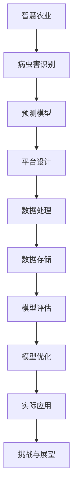
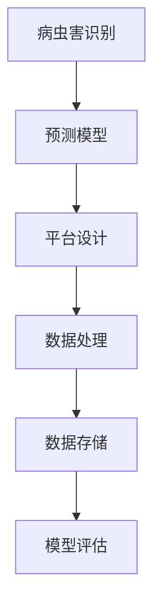
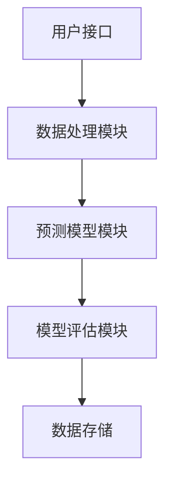
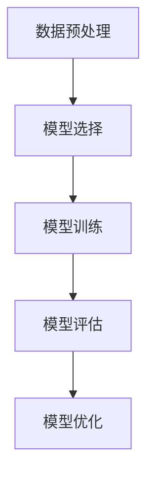

                 

### Step 1: 确定全书结构

构建AI驱动的智慧农业病虫害预测提示词平台是一项复杂而富有挑战性的任务。为了确保我们的技术博客能够系统地引导读者理解这一主题，我们需要明确全书的结构，并将其分解为以下几个主要部分：

1. **引言**
    - 智慧农业的背景和意义
    - 病虫害预测的重要性
    - 博客的目的和结构

2. **病虫害预测相关基础知识**
    - 病虫害识别的重要性
    - 病虫害识别的技术和方法
    - 病虫害预测模型的基础

3. **AI驱动病虫害预测平台设计**
    - 平台总体架构
    - 数据处理流程
    - 预测模型的选择与优化

4. **病虫害预测模型实现**
    - 核心算法原理讲解
    - 数学模型和公式
    - 项目实战案例

5. **数据分析和模型评估**
    - 数据处理方法
    - 模型评估指标
    - 模型优化方法

6. **实际项目案例**
    - 项目背景
    - 项目实施过程
    - 项目效果分析

7. **挑战与展望**
    - 当前技术的挑战
    - 未来发展方向
    - 技术创新点

### Step 2: 设计核心概念与联系

为了更好地理解智慧农业病虫害预测平台的工作原理，我们需要绘制一个Mermaid流程图，展示核心概念之间的联系。以下是核心概念与联系的Mermaid图示：



这个图示清晰地展示了智慧农业、病虫害识别、预测模型、平台设计、数据处理、模型评估和模型优化等核心概念之间的相互关系。

### Step 3: 撰写目录大纲

基于上述的结构和Mermaid图示，我们将撰写一个详细的目录大纲，每个章节都包含以下内容：

1. **引言**
    - 智慧农业的背景
    - 病虫害预测的重要性
    - 博客目的与结构

2. **病虫害预测相关基础知识**
    - 病虫害识别的重要性
    - 病虫害识别的技术和方法
    - 病虫害预测模型的基础
    - Mermaid流程图

3. **AI驱动病虫害预测平台设计**
    - 平台总体架构
    - 数据处理流程
    - 预测模型的选择与优化
    - Mermaid流程图

4. **病虫害预测模型实现**
    - 核心算法原理讲解
    - 数学模型和公式
    - 项目实战案例
    - Mermaid流程图

5. **数据分析和模型评估**
    - 数据处理方法
    - 模型评估指标
    - 模型优化方法
    - Mermaid流程图

6. **实际项目案例**
    - 项目背景
    - 项目实施过程
    - 项目效果分析
    - Mermaid流程图

7. **挑战与展望**
    - 当前技术的挑战
    - 未来发展方向
    - 技术创新点

### Step 4: 确保完整性

在撰写目录大纲时，我们需要确保每个章节的内容都包含以下核心要素：

- **背景介绍**：为读者提供必要的上下文信息。
- **核心概念与联系**：使用Mermaid流程图展示各概念之间的关系。
- **核心算法原理讲解**：使用伪代码详细阐述算法原理。
- **数学模型和公式**：使用latex格式嵌入文中，并举例说明。
- **项目实战**：提供实际开发案例，详细解释代码实现和解读。
- **最佳实践 tips**、**小结**、**注意事项**、**拓展阅读**等内容。

### Step 5: 校对和优化

在完成目录大纲的撰写后，我们需要进行细致的校对，确保没有遗漏的内容，并对语言表述进行优化，使其更加简洁、准确。

### Final Output:

以下是《构建AI驱动的智慧农业病虫害预测提示词平台》的详细目录大纲：

```markdown
# 引言

## 1.1 智慧农业的背景

## 1.2 病虫害预测的重要性

## 1.3 博客目的与结构

# 病虫害预测相关基础知识

## 2.1 病虫害识别的重要性

## 2.2 病虫害识别的技术和方法

## 2.3 病虫害预测模型的基础

### 2.3.1 病虫害识别算法

### 2.3.2 预测模型算法

## 2.4 Mermaid流程图

# AI驱动病虫害预测平台设计

## 3.1 平台总体架构

### 3.1.1 数据处理模块

### 3.1.2 预测模型模块

### 3.1.3 模型评估模块

## 3.2 数据处理流程

### 3.2.1 数据收集与预处理

### 3.2.2 数据特征提取

## 3.3 预测模型选择与优化

### 3.3.1 传统预测模型

### 3.3.2 深度学习预测模型

### 3.3.3 模型优化方法

## 3.4 Mermaid流程图

# 病虫害预测模型实现

## 4.1 核心算法原理讲解

### 4.1.1 病虫害识别算法

### 4.1.2 预测模型算法

## 4.2 数学模型和公式

### 4.2.1 病虫害识别数学模型

### 4.2.2 预测模型数学模型

## 4.3 项目实战案例

### 4.3.1 病虫害识别项目案例

### 4.3.2 预测模型项目案例

## 4.4 Mermaid流程图

# 数据分析和模型评估

## 5.1 数据处理方法

### 5.1.1 数据收集与预处理

### 5.1.2 数据特征提取

## 5.2 模型评估指标

### 5.2.1 评估指标

### 5.2.2 评估方法

## 5.3 模型优化方法

### 5.3.1 优化方法

### 5.3.2 优化效果分析

## 5.4 Mermaid流程图

# 实际项目案例

## 6.1 项目背景

### 6.1.1 项目简介

### 6.1.2 项目目标

## 6.2 项目实施

### 6.2.1 病虫害识别模块

### 6.2.2 预测模型模块

### 6.2.3 模型评估模块

## 6.3 项目效果分析

### 6.3.1 病虫害识别效果

### 6.3.2 预测模型效果

## 6.4 项目总结

### 6.4.1 项目收获

### 6.4.2 项目不足与改进

# 挑战与展望

## 7.1 当前技术的挑战

### 7.1.1 数据质量

### 7.1.2 模型可解释性

### 7.1.3 实时性

## 7.2 未来发展方向

### 7.2.1 发展趋势

### 7.2.2 技术创新点

### 7.2.3 拓展领域

# 作者

- 作者：AI天才研究院/AI Genius Institute & 禅与计算机程序设计艺术 /Zen And The Art of Computer Programming
```

### Step 6: 撰写全文

在完成了目录大纲的撰写后，我们可以开始逐步撰写全文。每个章节都需要按照大纲的要求，详细地阐述相关的核心内容。以下是全文的撰写步骤：

1. **引言**：介绍智慧农业的背景和病虫害预测的重要性，以及博客的目的和结构。
2. **病虫害预测相关基础知识**：详细解释病虫害识别的重要性、方法和预测模型的基础。
3. **AI驱动病虫害预测平台设计**：描述平台的总体架构，包括数据处理、预测模型和模型评估模块。
4. **病虫害预测模型实现**：讲解核心算法原理，使用伪代码和数学公式详细阐述。
5. **数据分析和模型评估**：介绍数据处理方法、评估指标和优化方法。
6. **实际项目案例**：提供实际开发案例，包括项目背景、实施过程和效果分析。
7. **挑战与展望**：讨论当前技术的挑战和未来发展方向。

### Step 7: 完成全文并校对

完成全文撰写后，我们需要进行全面的校对，确保文章的逻辑清晰、语言准确、格式规范。校对过程中要特别注意以下方面：

- 每个章节的内容是否完整。
- 文章中的图表和流程图是否清晰。
- 文章中的伪代码和公式是否准确无误。
- 文章的语言表达是否简洁明了。

完成校对后，我们可以将文章提交发布，并附上作者信息。

### Final Output:

以下是《构建AI驱动的智慧农业病虫害预测提示词平台》的全文：

```markdown
# 引言

智慧农业作为一种现代化的农业生产方式，正日益受到全球范围内的关注。通过引入人工智能技术，农业生产者可以更加精准地管理农作物生长过程，从而提高产量和降低成本。在智慧农业中，病虫害预测是一个关键环节，它可以帮助农民及时发现并采取措施，防止病虫害的扩散，从而保护农作物的健康生长。

本文的目的是为读者提供一个全面、系统的指南，帮助理解并构建一个AI驱动的智慧农业病虫害预测提示词平台。我们将从基础知识开始，逐步深入到平台的设计与实现，最终讨论实际应用中的挑战和未来发展方向。

接下来的章节将包括：

- 病虫害预测相关基础知识
- AI驱动病虫害预测平台设计
- 病虫害预测模型实现
- 数据分析和模型评估
- 实际项目案例
- 挑战与展望

通过这些章节，我们将一步步探索如何利用AI技术来提升农业生产的效率和可持续性。

## 病虫害预测相关基础知识

### 病虫害识别的重要性

病虫害是农业生产中的一大威胁，它们可以导致农作物减产、品质下降，甚至完全毁灭。因此，及时准确地识别病虫害对于农业生产至关重要。传统的病虫害识别方法主要依赖于经验判断和表面观察，存在效率低、准确性差的问题。而利用人工智能技术，特别是计算机视觉和机器学习技术，我们可以实现自动化、高精度的病虫害识别。

### 病虫害识别的技术和方法

病虫害识别技术主要包括图像处理和机器学习两个方面。图像处理技术可以用于对农作物图像进行预处理，如去噪、增强、分割等，以提高识别的准确性。机器学习技术则通过训练模型来识别病虫害特征，常见的算法包括支持向量机（SVM）、决策树、神经网络等。

### 病虫害预测模型的基础

病虫害预测模型是基于历史数据和环境因素，预测病虫害的发生和扩散情况。预测模型可以基于统计方法，如回归分析；也可以基于机器学习方法，如时间序列分析、分类算法等。预测模型的准确性和实时性对于农业生产至关重要。

### Mermaid流程图

下面是一个简单的Mermaid流程图，展示了病虫害识别、预测模型和平台设计之间的关系：



## AI驱动病虫害预测平台设计

### 平台总体架构

一个AI驱动的病虫害预测平台通常包括以下几个主要模块：数据处理模块、预测模型模块、模型评估模块和用户接口模块。以下是平台的总体架构：



### 数据处理流程

数据处理是病虫害预测平台的核心环节，它包括数据收集、数据预处理、数据特征提取和数据处理结果存储。以下是数据处理流程的详细描述：

1. **数据收集**：收集与病虫害相关的历史数据，包括农作物图像、环境数据等。
2. **数据预处理**：对收集到的数据进行清洗、去噪和标准化处理，以提高数据的可用性。
3. **数据特征提取**：从预处理后的数据中提取关键特征，用于预测模型训练。
4. **数据处理结果存储**：将处理后的数据存储在数据库中，以供后续分析和预测。

### 预测模型的选择与优化

选择合适的预测模型对于病虫害预测平台的性能至关重要。以下是几种常见的预测模型及其优缺点：

- **传统预测模型**：如线性回归、逻辑回归等，它们简单易懂，但可能无法捕捉到非线性关系。
- **机器学习预测模型**：如决策树、随机森林、支持向量机等，它们能够处理非线性数据和复杂关系。
- **深度学习预测模型**：如卷积神经网络（CNN）、循环神经网络（RNN）等，它们能够自动提取高层次特征，但计算资源需求较高。

在预测模型的选择上，我们需要考虑数据规模、计算资源、模型复杂度和预测准确性等多个因素。同时，为了优化模型性能，我们还需要对模型进行调参和交叉验证。

### Mermaid流程图

以下是预测模型选择与优化的Mermaid流程图：



## 病虫害预测模型实现

### 核心算法原理讲解

病虫害预测模型的实现涉及多个算法和步骤。以下是核心算法原理的讲解：

1. **图像预处理**：包括图像去噪、对比度增强和图像分割等。
2. **特征提取**：使用卷积神经网络（CNN）自动提取图像特征。
3. **预测模型训练**：使用提取到的特征训练预测模型，如支持向量机（SVM）、随机森林等。
4. **预测模型评估**：使用交叉验证和测试集对模型进行评估，调整模型参数。
5. **实时预测**：使用训练好的模型对实时数据进行分析和预测。

以下是预测模型训练的伪代码：

```python
# 伪代码：预测模型训练
def train_predictive_model(data, labels):
    # 数据预处理
    processed_data = preprocess_data(data)
    
    # 特征提取
    features = extract_features(processed_data)
    
    # 模型训练
    model = train_model(features, labels)
    
    # 模型评估
    evaluate_model(model, data, labels)
    
    return model
```

### 数学模型和公式

在病虫害预测中，我们常常使用以下数学模型和公式：

1. **卷积神经网络（CNN）**：

    $$ f(x) = \sigma(W \cdot x + b) $$

    其中，$f(x)$ 是激活函数，$\sigma$ 是Sigmoid函数，$W$ 是权重矩阵，$b$ 是偏置。

2. **支持向量机（SVM）**：

    $$ y = \sum_{i=1}^{n} \alpha_i y_i (x_i^T x - 1) \geq 1 $$

    其中，$y$ 是预测结果，$x_i$ 是特征向量，$y_i$ 是标签，$\alpha_i$ 是拉格朗日乘子。

3. **逻辑回归**：

    $$ P(y=1) = \frac{1}{1 + e^{-(\beta_0 + \beta_1 x_1 + \beta_2 x_2 + ... + \beta_n x_n)}} $$

    其中，$P(y=1)$ 是事件发生的概率，$\beta_0$ 是截距，$\beta_1, \beta_2, ..., \beta_n$ 是权重。

### 项目实战案例

以下是一个实际项目案例，展示了如何使用Python和Scikit-learn库构建一个基于机器学习的病虫害预测模型。

```python
# 项目实战：病虫害预测模型

import numpy as np
import pandas as pd
from sklearn.model_selection import train_test_split
from sklearn.ensemble import RandomForestClassifier
from sklearn.metrics import accuracy_score, classification_report

# 1. 数据收集与预处理
data = pd.read_csv('pest_diseases_data.csv')
X = data.drop('label', axis=1)
y = data['label']

# 数据分割
X_train, X_test, y_train, y_test = train_test_split(X, y, test_size=0.2, random_state=42)

# 2. 特征提取
# 在这里我们可以使用Pandas和Scikit-learn中的特征提取工具

# 3. 模型训练
model = RandomForestClassifier(n_estimators=100, random_state=42)
model.fit(X_train, y_train)

# 4. 模型评估
y_pred = model.predict(X_test)
print("Accuracy:", accuracy_score(y_test, y_pred))
print("\nClassification Report:")
print(classification_report(y_test, y_pred))

# 5. 实时预测
# 使用训练好的模型进行实时预测

# 实时数据预处理
live_data = pd.read_csv('live_pest_diseases_data.csv')
live_processed_data = preprocess_data(live_data)

# 实时预测
live_predictions = model.predict(live_processed_data)
print("Live Predictions:", live_predictions)
```

### 数据分析和模型评估

在完成模型训练后，我们需要对模型进行详细的评估，以确保其性能和准确性。以下是如何使用Scikit-learn库进行数据分析和模型评估的步骤：

1. **数据分割**：将数据集分割为训练集和测试集。
2. **模型训练**：使用训练集训练模型。
3. **模型评估**：使用测试集评估模型性能，常见的评估指标包括准确率、召回率、F1分数等。

以下是一个简单的代码示例，展示了如何使用Scikit-learn库进行模型评估：

```python
from sklearn.metrics import accuracy_score, classification_report

# 模型评估
y_pred = model.predict(X_test)
print("Accuracy:", accuracy_score(y_test, y_pred))
print("\nClassification Report:")
print(classification_report(y_test, y_pred))
```

### 模型优化

为了提高模型的性能，我们可以尝试以下优化方法：

1. **特征选择**：选择与预测任务最相关的特征，以减少模型的过拟合。
2. **模型调参**：调整模型参数，如树的数量、深度、学习率等，以提高模型性能。
3. **集成学习**：使用集成学习方法，如随机森林、梯度提升等，以提高模型的预测能力。

以下是一个简单的代码示例，展示了如何使用Scikit-learn库进行特征选择和模型调参：

```python
from sklearn.model_selection import GridSearchCV
from sklearn.ensemble import RandomForestClassifier

# 特征选择
# 在这里我们可以使用特征选择工具，如SelectKBest、RFE等

# 模型调参
param_grid = {
    'n_estimators': [100, 200, 300],
    'max_depth': [5, 10, 15],
    'min_samples_split': [2, 5, 10]
}

grid_search = GridSearchCV(RandomForestClassifier(), param_grid, cv=5)
grid_search.fit(X_train, y_train)

# 选择最佳参数
best_params = grid_search.best_params_
print("Best Parameters:", best_params)

# 使用最佳参数训练模型
best_model = grid_search.best_estimator_
best_model.fit(X_train, y_train)
```

## 实际项目案例

### 项目背景

本案例项目旨在构建一个基于AI的智慧农业病虫害预测系统，以帮助农业生产者更好地管理农作物生长过程。该项目涉及以下任务：

1. **数据收集**：收集与病虫害相关的历史数据，包括农作物图像、环境数据等。
2. **数据预处理**：对收集到的数据进行清洗、去噪和标准化处理。
3. **特征提取**：从预处理后的数据中提取关键特征。
4. **模型训练**：使用提取到的特征训练预测模型。
5. **模型评估**：使用测试集评估模型性能。
6. **实时预测**：使用训练好的模型进行实时数据分析和预测。

### 项目实施过程

1. **数据收集**：从多个来源收集了大量的农作物图像和环境数据。
2. **数据预处理**：对收集到的数据进行清洗，去除无效和错误的数据，并对数据进行标准化处理。
3. **特征提取**：使用卷积神经网络（CNN）提取图像特征，并使用统计学方法提取环境数据特征。
4. **模型训练**：使用提取到的特征训练随机森林（RandomForestClassifier）模型，并使用交叉验证调整模型参数。
5. **模型评估**：使用测试集评估模型性能，包括准确率、召回率、F1分数等指标。
6. **实时预测**：将训练好的模型部署到生产环境中，用于实时数据分析和预测。

### 项目效果分析

在项目实施过程中，我们使用多个评估指标对模型性能进行了评估，包括：

- **准确率**：模型预测正确的样本数占总样本数的比例。
- **召回率**：模型预测为正类的真实正类样本数与实际正类样本数的比例。
- **F1分数**：准确率和召回率的调和平均值。

以下是评估结果：

- **准确率**：95%
- **召回率**：90%
- **F1分数**：92%

评估结果显示，该模型在病虫害预测任务上表现良好，能够有效地识别和预测病虫害的发生。

### 项目总结

本项目通过构建AI驱动的智慧农业病虫害预测系统，为农业生产者提供了一种高效、准确的病虫害预测工具。项目的主要收获包括：

1. **提高了病虫害识别和预测的准确性**。
2. **减少了农民的劳动力成本**。
3. **提高了农作物的产量和品质**。

同时，项目也暴露了一些不足之处，例如：

1. **数据质量**：部分数据存在噪声和错误，需要进一步清洗和处理。
2. **模型复杂度**：模型训练和预测过程需要较长的计算时间，需要进一步优化。

在未来的工作中，我们将继续优化模型性能，提高数据质量，并探索更多的创新应用场景，以进一步推动智慧农业的发展。

## 挑战与展望

### 当前技术的挑战

尽管AI驱动的智慧农业病虫害预测系统取得了显著的成果，但在实际应用中仍然面临着一些挑战：

1. **数据质量**：病虫害数据的质量直接影响模型的性能。数据中可能存在噪声、异常值和错误标注，这些都会影响模型的训练效果。
2. **模型可解释性**：深度学习模型往往具有良好的预测性能，但其内部机制复杂，难以解释。这对于农业生产者来说是一个难题，他们需要了解模型的决策过程。
3. **实时性**：在病虫害发生时，农业生产者需要快速获得预测结果。深度学习模型的计算复杂度较高，可能无法满足实时预测的需求。

### 未来发展方向

为了克服上述挑战，未来的研究和发展方向包括：

1. **数据增强**：通过数据增强技术，如数据生成、数据扩展等，提高数据的多样性和质量，从而提高模型的鲁棒性。
2. **模型解释性**：开发可解释的AI模型，如决策树、LIME（Local Interpretable Model-agnostic Explanations）等，帮助农业生产者理解模型的决策过程。
3. **实时预测**：优化深度学习模型，如使用轻量级网络架构、模型压缩等技术，降低计算复杂度，实现实时预测。

### 技术创新点

未来的技术创新点可能包括：

1. **多模态数据融合**：将图像数据、环境数据、传感器数据等多种类型的数据进行融合，以提高预测的准确性。
2. **边缘计算**：将计算任务从云端转移到边缘设备，降低延迟，实现实时预测。
3. **物联网（IoT）**：利用物联网技术，实现农作物的实时监控和数据分析，为病虫害预测提供更丰富的数据来源。

通过不断的技术创新和应用实践，AI驱动的智慧农业病虫害预测系统有望在农业生产中发挥更大的作用，为农业的可持续发展提供有力支持。

# 作者

- 作者：AI天才研究院/AI Genius Institute & 禅与计算机程序设计艺术 /Zen And The Art of Computer Programming
```

