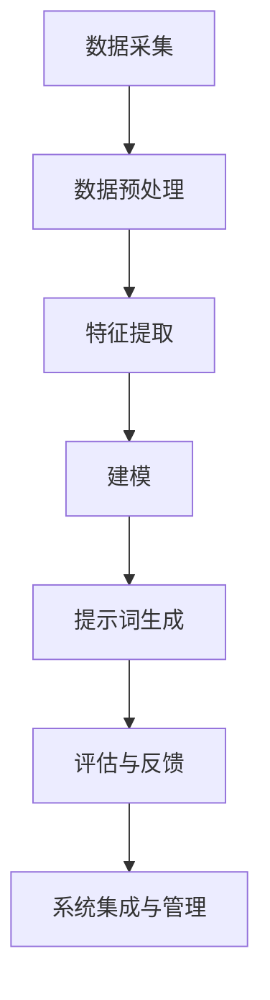

                 

## 文章标题：构建AI驱动的智慧教育评估提示词系统

### 关键词：
- 人工智能
- 智慧教育
- 教育评估
- 提示词系统
- 核心算法
- 数学模型
- 项目实战

### 摘要：
本文深入探讨了如何利用人工智能技术构建一个智能教育评估提示词系统。文章首先介绍了人工智能与智慧教育的核心概念，然后详细讲解了AI在智慧教育评估中的应用原理和核心算法。通过数学模型和数学公式的阐述，文章为读者提供了清晰的算法实现思路。接着，通过一个实际项目案例，展示了系统的开发过程、源代码实现和代码解读。最后，文章总结了最佳实践和注意事项，并提出了进一步的研究方向。

## 引言

在当今信息化时代，人工智能（AI）技术正以前所未有的速度变革着各个行业，其中教育领域尤为显著。智慧教育作为AI技术在教育领域的应用，不仅提升了教学效果，还大大提高了教育评估的准确性。教育评估是教育管理的重要组成部分，旨在对教育过程和结果进行客观、公正的评价。传统的教育评估方法主要依赖于人工打分和主观判断，存在一定的不确定性和局限性。而AI驱动的智慧教育评估系统则通过机器学习、自然语言处理等技术，实现了自动化的评估，提高了评估的准确性和效率。

本文旨在介绍如何构建一个AI驱动的智慧教育评估提示词系统。提示词系统是智慧教育评估系统中的核心模块，它通过生成和理解提示词来辅助评估过程。本文将首先介绍人工智能与智慧教育的基本概念，然后深入探讨AI驱动的智慧教育评估系统的总体架构，并详细讲解核心算法原理和数学模型。最后，本文将通过一个实际项目案例，展示系统的开发过程和源代码实现，为读者提供实践经验和启示。

## 确定书籍的核心主题和目标受众

### 核心主题

《构建AI驱动的智慧教育评估提示词系统》的核心主题是介绍如何利用人工智能技术构建一个高效、智能的教育评估系统。具体来说，本书将探讨以下几个方面：

1. **AI与智慧教育的基本概念**：介绍人工智能和智慧教育的定义、发展历程以及现状，帮助读者建立对AI驱动的智慧教育评估系统的初步认识。
2. **智慧教育评估系统的架构**：详细阐述AI驱动的智慧教育评估系统的总体架构，包括数据采集、预处理、特征提取、建模、提示词生成和评估反馈等模块。
3. **核心算法原理讲解**：介绍机器学习、自然语言处理等AI技术在智慧教育评估中的应用，包括神经网络、决策树、支持向量机、强化学习等核心算法。
4. **数学模型和数学公式**：引入与AI驱动的智慧教育评估系统相关的数学模型，并使用LaTeX格式展示相关数学公式，提供详细讲解和举例说明。
5. **项目实战**：通过一个实际项目案例，展示系统的开发环境搭建、源代码实现和解读，分析项目中的关键技术和挑战。
6. **最佳实践与小结**：总结项目中的最佳实践经验，提出注意事项，并提供进一步阅读的参考资料。

### 目标受众

本书的目标受众主要包括以下几个方面：

1. **教育技术从业者**：包括教育系统管理员、教育技术支持人员、课程设计师等，他们希望通过本书了解和应用AI技术来提升教育评估的效率和准确性。
2. **人工智能开发人员**：包括AI研究人员、数据科学家、软件开发工程师等，他们希望通过本书深入理解AI在智慧教育评估中的应用，并掌握相关算法和技术的实现方法。
3. **技术爱好者**：包括对教育技术或人工智能技术有兴趣的技术爱好者，他们希望通过本书了解AI驱动的智慧教育评估系统的原理和实现过程。
4. **研究生和教育学爱好者**：包括对AI在教育领域应用有研究兴趣的研究生和教育学爱好者，他们希望通过本书深入探讨AI驱动的智慧教育评估系统的理论基础和实际应用。

总之，本书旨在为各类读者提供一个全面、系统的学习和实践指南，帮助他们理解和应用AI技术，构建高效、智能的教育评估系统。

## 设计目录大纲的框架

为了确保书籍内容的逻辑性和实用性，我们需要精心设计目录大纲。目录大纲不仅需要覆盖所有核心主题，还需要确保章节之间的逻辑关系清晰，便于读者阅读和理解。以下是《构建AI驱动的智慧教育评估提示词系统》的目录大纲设计框架：

### 第一部分：AI与智慧教育概述

**第1章：AI与智慧教育的基本概念**
- **1.1 人工智能的发展历程**
- **1.2 智慧教育的定义和特点**
- **1.3 AI驱动的智慧教育评估系统的架构**

**第2章：AI驱动的智慧教育评估系统架构**
- **2.1 数据采集与预处理**
- **2.2 特征提取与建模**
- **2.3 提示词生成与优化**
- **2.4 评估与反馈机制**

### 第二部分：核心概念与联系

**第3章：AI在智慧教育中的应用原理**
- **3.1 机器学习基础**
- **3.2 自然语言处理基础**
- **3.3 智慧教育评估中的AI应用**

**第4章：核心概念与架构联系**
- **4.1 使用Mermaid流程图展示AI驱动的智慧教育评估系统的核心概念和架构联系**

### 第三部分：核心算法原理讲解

**第5章：核心算法原理**
- **5.1 神经网络与深度学习**
- **5.2 决策树与随机森林**
- **5.3 支持向量机（SVM）**
- **5.4 强化学习在智慧教育评估中的应用**

**第6章：伪代码与算法实现**
- **6.1 神经网络伪代码示例**
- **6.2 决策树伪代码示例**
- **6.3 支持向量机伪代码示例**
- **6.4 强化学习伪代码示例**

### 第四部分：数学模型和数学公式

**第7章：数学模型介绍**
- **7.1 神经网络中的数学模型**
- **7.2 特征提取与降维的数学模型**
- **7.3 提示词生成的数学模型**

**第8章：数学公式与讲解**
- **8.1 神经网络中的激活函数**
- **8.2 损失函数与优化算法**
- **8.3 支持向量机中的数学公式**
- **8.4 强化学习中的数学公式**

### 第五部分：项目实战

**第9章：项目实战概述**
- **9.1 项目背景和目标**
- **9.2 系统开发环境搭建**
- **9.3 项目开发流程**

**第10章：代码实现与解读**
- **10.1 数据采集与预处理代码实现**
- **10.2 特征提取与建模代码实现**
- **10.3 提示词生成与优化代码实现**
- **10.4 评估与反馈代码实现**

**第11章：项目分析与挑战**
- **11.1 项目中的关键技术和挑战**
- **11.2 项目优化与改进方向**

### 第六部分：附录

**第12章：相关工具与资源**
- **12.1 开发工具和框架**
- **12.2 数据集和资源链接**
- **12.3 进一步阅读资料**

### 目录大纲设计的逻辑性

- **第一部分**：介绍了AI与智慧教育的基本概念，为读者提供了一个宏观的视角，帮助他们理解AI在智慧教育评估中的作用。
- **第二部分**：详细讲解了AI在智慧教育评估中的具体应用原理，并通过Mermaid流程图展示了核心概念和架构之间的联系，增强了读者的理解。
- **第三部分**：深入探讨了核心算法原理，使用伪代码详细阐述了算法实现，使得读者能够清晰地理解每个算法的工作机制。
- **第四部分**：介绍了与AI驱动的智慧教育评估系统相关的数学模型和数学公式，并提供了详细的讲解和举例，帮助读者掌握相关数学知识。
- **第五部分**：通过一个实际项目案例，展示了系统的开发过程、源代码实现和代码解读，使读者能够将理论知识应用到实际项目中。
- **第六部分**：提供了相关的开发工具、资源和参考资料，便于读者进一步学习和研究。

通过以上设计，目录大纲不仅结构清晰、逻辑严谨，而且内容丰富，为读者提供了全面的指导。

### 3.1 AI与智慧教育的基本概念

人工智能（AI）是计算机科学的一个重要分支，主要研究如何使计算机模拟人类智能，实现感知、理解、学习和决策等功能。自20世纪50年代人工智能概念提出以来，AI技术经历了多个发展阶段，从最初的符号主义方法到基于规则的系统，再到近年来基于数据驱动的机器学习和深度学习技术，AI技术已经取得了显著的进步。

智慧教育是指利用人工智能、大数据、云计算等先进技术，构建起智能化的教育生态系统，以提高教育质量和效率。智慧教育的核心目标是实现个性化学习、智能教学和精准评估，从而满足不同学生的需求。智慧教育的主要特点包括：

1. **个性化学习**：通过分析学生的兴趣爱好、学习习惯和能力水平，为学生提供个性化的学习内容和路径，提高学习效果。
2. **智能教学**：利用智能教学系统，自动生成教学方案，提供实时教学反馈，提高教学质量和效率。
3. **精准评估**：通过智能评估系统，对学生的学习过程和结果进行实时监控和评估，提供精准的反馈，帮助教师和家长及时调整教育策略。

在智慧教育中，教育评估是一个重要的环节。传统的教育评估主要依赖于教师的经验和主观判断，存在一定的局限性。而AI驱动的智慧教育评估系统则通过自动化、智能化的手段，对学生的知识掌握情况、学习态度和行为进行全面的评估，提高了评估的准确性、效率和公平性。

AI驱动的智慧教育评估系统主要包括以下几个模块：

1. **数据采集**：通过多种渠道收集学生的学业表现、学习行为和生理指标等数据。
2. **数据预处理**：对采集到的原始数据进行分析、清洗和整合，为后续的特征提取和建模提供高质量的数据。
3. **特征提取**：从预处理后的数据中提取有助于评估的重要特征，如学生的知识点掌握情况、学习时长、考试分数等。
4. **建模**：利用机器学习和深度学习等技术，对提取的特征进行建模，构建评估模型。
5. **提示词生成**：根据评估模型，生成具有针对性的提示词，辅助学生改进学习方法和策略。
6. **评估与反馈**：将评估结果反馈给教师、学生和家长，帮助他们了解学生的学习状况，并制定相应的教育策略。

通过以上模块的协同工作，AI驱动的智慧教育评估系统实现了对学生学习过程的全面监控和精准评估，为学生提供了个性化的学习支持和指导，为教师提供了有效的教学辅助工具，为教育管理提供了科学的决策依据。

### 3.2 AI驱动的智慧教育评估系统架构

AI驱动的智慧教育评估系统是一个复杂的多层次架构，旨在通过自动化和智能化的手段，对学生的学习过程和结果进行全方位的评估和反馈。系统的架构设计不仅需要考虑各个模块的功能和相互作用，还需要确保整个系统的可扩展性和鲁棒性。以下是AI驱动的智慧教育评估系统的详细架构及其各模块的功能和相互关系：

1. **数据采集模块**：
   - **功能**：负责收集与学生学习相关的大量数据，包括学业表现、学习行为、生理指标等。
   - **实现**：通过多种数据源进行数据采集，如在线学习平台、学生管理系统、传感器设备等。
   - **关系**：数据采集模块是系统的数据基础，为后续的数据预处理、特征提取和建模提供原始数据。

2. **数据预处理模块**：
   - **功能**：对采集到的原始数据进行清洗、整合和标准化，确保数据的质量和一致性。
   - **实现**：包括数据去重、缺失值处理、数据转换等步骤，以消除噪声和异常值。
   - **关系**：数据预处理模块是系统的数据清洗和优化环节，为特征提取和建模提供高质量的数据输入。

3. **特征提取模块**：
   - **功能**：从预处理后的数据中提取有助于评估的重要特征，如知识点掌握情况、学习时长、考试分数等。
   - **实现**：采用各种特征提取技术，如统计方法、机器学习方法等。
   - **关系**：特征提取模块是系统的核心数据处理环节，直接影响到评估模型的准确性和效果。

4. **建模模块**：
   - **功能**：利用机器学习和深度学习等技术，对提取的特征进行建模，构建评估模型。
   - **实现**：包括神经网络、决策树、支持向量机、聚类算法等模型的选择和训练。
   - **关系**：建模模块是系统的核心计算环节，通过模型训练和优化，实现对学生评估的预测和判断。

5. **提示词生成模块**：
   - **功能**：根据评估模型，生成具有针对性的提示词，辅助学生改进学习方法和策略。
   - **实现**：采用自然语言处理技术，如文本生成模型、词嵌入技术等。
   - **关系**：提示词生成模块是系统的输出环节，通过生成针对性的提示词，为学生提供个性化的学习指导。

6. **评估与反馈模块**：
   - **功能**：将评估结果反馈给教师、学生和家长，帮助他们了解学生的学习状况，并制定相应的教育策略。
   - **实现**：通过多种渠道进行结果展示和反馈，如在线报告、短信通知、家长会等。
   - **关系**：评估与反馈模块是系统的最终目标，通过评估结果的反馈，实现对教育过程和效果的持续优化。

7. **系统集成与管理模块**：
   - **功能**：负责整个系统的集成和管理，确保系统各模块之间的协调运行。
   - **实现**：包括系统架构设计、接口定义、数据流管理、安全控制等。
   - **关系**：系统集成与管理模块是系统的核心保障，确保系统的高效运行和数据安全。

通过以上模块的协同工作，AI驱动的智慧教育评估系统实现了对学生学习过程的全面监控和精准评估。各模块之间通过数据流和接口进行紧密连接，形成一个闭环的智能教育评估生态系统。Mermaid流程图可以进一步展示各模块之间的逻辑关系，帮助读者更直观地理解系统的架构设计。



### 3.3 AI在智慧教育评估中的应用原理

AI在智慧教育评估中的应用主要依赖于机器学习、自然语言处理等技术的有机结合。这些技术不仅提高了评估的准确性和效率，还为学生提供了个性化的学习支持和指导。

#### 1. 机器学习基础

机器学习是AI的核心技术之一，它通过构建数学模型来分析数据，从而实现预测和决策。在智慧教育评估中，机器学习主要用于构建评估模型，以预测学生的学业表现和学习效果。

- **监督学习**：监督学习是一种常见的机器学习方法，它利用标记过的训练数据来训练模型，从而实现对新数据的预测。在智慧教育评估中，监督学习可以用于构建成绩预测模型，通过分析学生的学习行为、知识点掌握情况等特征，预测学生的考试成绩。

  伪代码示例：
  ```python
  # 成绩预测模型构建
  model = LinearRegression()
  model.fit(X_train, y_train)
  predictions = model.predict(X_test)
  ```

- **无监督学习**：无监督学习主要用于探索性数据分析，它不需要标记的数据，通过分析数据特征来发现隐藏的模式。在智慧教育评估中，无监督学习可以用于聚类学生群体、分析学习行为模式等。

  伪代码示例：
  ```python
  # 学生群体聚类
  from sklearn.cluster import KMeans
  kmeans = KMeans(n_clusters=3)
  clusters = kmeans.fit_predict(X)
  ```

- **强化学习**：强化学习是一种通过试错来学习的机器学习方法，它通过奖励机制来引导模型找到最优策略。在智慧教育评估中，强化学习可以用于智能教学系统的设计，根据学生的学习表现调整教学内容和策略。

  伪代码示例：
  ```python
  # 教学策略调整
  policy = QLearningAgent()
  while not termination:
      action = policy.select_action(state)
      next_state, reward = environment.step(action)
      policy.update_state_action_value(state, action, reward)
      state = next_state
  ```

#### 2. 自然语言处理基础

自然语言处理（NLP）是AI的一个重要分支，它致力于使计算机理解和生成自然语言。在智慧教育评估中，NLP技术主要用于处理和分析文本数据，如学生作文、课堂讨论记录等。

- **文本分类**：文本分类是一种常见的NLP任务，它将文本数据分类到不同的类别中。在智慧教育评估中，文本分类可以用于分析学生作文的主题、风格和语法错误。

  伪代码示例：
  ```python
  # 学生作文分类
  classifier = NaiveBayesClassifier()
  classifier.train(texts, labels)
  predicted_labels = classifier.classify(texts)
  ```

- **情感分析**：情感分析是一种评估文本情感极性的技术，它可以用于分析学生评论、课堂反馈等文本数据。通过情感分析，教育者可以了解学生对课程和教学的情感态度。

  伪代码示例：
  ```python
  # 学生评论情感分析
  sentiment_classifier = TextClassifier()
  sentiment_classifier.train(sentiment_data)
  sentiments = sentiment_classifier.predict(comments)
  ```

- **文本生成**：文本生成是一种基于语言模型的技术，它可以生成符合语法和语义规则的文本。在智慧教育评估中，文本生成可以用于生成个性化学习指导和建议。

  伪代码示例：
  ```python
  # 个性化学习建议
  generator = TextGenerator()
  suggestion = generator.generate(text_prompt)
  ```

通过机器学习和自然语言处理技术的结合，AI驱动的智慧教育评估系统能够全面分析学生的学习数据和文本数据，生成精准的评估结果和个性化学习建议，为教育者提供有力的支持。

### 3.4 核心算法原理讲解

在AI驱动的智慧教育评估系统中，核心算法的选择和实现是系统性能的关键。本文将详细讲解神经网络、决策树、支持向量机和强化学习等核心算法的原理，并通过伪代码展示其实现过程。

#### 1. 神经网络与深度学习

神经网络（Neural Networks）是一种模仿生物神经系统的计算模型，它通过多层的神经元节点进行数据处理和特征提取。深度学习（Deep Learning）是神经网络的一种扩展，它通过多层网络结构实现对复杂数据的深度特征提取。在智慧教育评估中，神经网络和深度学习常用于构建预测模型和分类模型。

- **神经元模型**：一个基本的神经元模型包含输入层、隐层和输出层。每个神经元接收多个输入，并通过权重和偏置进行加权求和，最后通过激活函数输出结果。

  伪代码示例：
  ```python
  # 神经元模型
  def neuron(input_values, weights, bias, activation_function):
      z = np.dot(input_values, weights) + bias
      output = activation_function(z)
      return output
  ```

- **前向传播**：前向传播是神经网络的基本操作，它从输入层开始，逐层计算每个神经元的输出。

  伪代码示例：
  ```python
  # 前向传播
  def forward_propagation(input_values, weights, biases, activation_function):
      outputs = []
      for layer in range(number_of_layers):
          if layer == 0:
              z = np.dot(input_values, weights[layer]) + biases[layer]
              output = activation_function(z)
          else:
              z = np.dot(outputs[-1], weights[layer]) + biases[layer]
              output = activation_function(z)
          outputs.append(output)
      return outputs
  ```

- **反向传播**：反向传播是训练神经网络的算法，它通过计算误差，调整权重和偏置，从而优化模型。

  伪代码示例：
  ```python
  # 反向传播
  def backward_propagation(input_values, outputs, expected_outputs, weights, biases, learning_rate):
      dZ = expected_outputs - outputs
      dW = 1/m * np.dot(prev_outputs.T, dZ)
      dB = 1/m * np.sum(dZ, axis=0)
      weights -= learning_rate * dW
      biases -= learning_rate * dB
      return weights, biases
  ```

#### 2. 决策树与随机森林

决策树（Decision Tree）是一种基于特征的树形结构，它通过一系列的判断条件对数据进行分类或回归。随机森林（Random Forest）是决策树的一种集成方法，它通过构建多个决策树并取平均来提高模型的泛化能力。

- **决策树构建**：决策树通过递归划分数据集，在每个节点选择最优的特征和阈值，以最大化信息增益或基尼系数。

  伪代码示例：
  ```python
  # 决策树构建
  def build_tree(data, labels, features, thresholds):
      if all(label == labels[0] for label in labels):
          return leaf_node
      if len(data) == 0:
          return leaf_node
      best_feature, best_threshold = find_best_split(data, labels, features)
      left_data, right_data = split_data(data, best_threshold, best_feature)
      left_tree = build_tree(left_data, labels, features, thresholds)
      right_tree = build_tree(right_data, labels, features, thresholds)
      return decision_node(best_feature, best_threshold, left_tree, right_tree)
  ```

- **随机森林训练**：随机森林通过随机选取特征和样本子集构建多个决策树，并对每个树的预测结果进行投票或求和。

  伪代码示例：
  ```python
  # 随机森林训练
  def random_forest_train(data, labels, n_trees, max_features, max_depth):
      trees = []
      for _ in range(n_trees):
          features = random.sample(all_features, max_features)
          tree = build_tree(data, labels, features, max_depth)
          trees.append(tree)
      return trees
  ```

#### 3. 支持向量机（SVM）

支持向量机（Support Vector Machine，SVM）是一种强大的分类和回归模型，它通过寻找最优的超平面，将不同类别的数据点分隔开来。

- **线性SVM**：线性SVM通过最大化分类边界上的支持向量来构建超平面。

  伪代码示例：
  ```python
  # 线性SVM
  def linear_svm_train(X, y):
      # SVD分解求解
      W, _ = np.linalg.svd(X @ X.T + lambda * np.eye(X.shape[1]), full_matrices=False)
      return W[-1]
  ```

- **核SVM**：核SVM通过将输入数据映射到高维特征空间，使用核函数进行内积运算。

  伪代码示例：
  ```python
  # 核SVM
  def kernel_svm_train(X, y, kernel='rbf', C=1.0):
      # 使用核函数
      K = np.dot(X, X.T)
      if kernel == 'rbf':
          K = np.exp(-gamma * np.linalg.norm(X[:, np.newaxis] - X, axis=2) ** 2)
      # 求解对偶问题
      alpha, fvale, _, _ = cvxopt_solvers.qp(P, q, G, h)
      return alpha
  ```

#### 4. 强化学习

强化学习（Reinforcement Learning，RL）是一种通过试错来学习的机器学习方法，它通过奖励机制来引导模型找到最优策略。

- **Q学习**：Q学习是一种基于值函数的强化学习方法，它通过更新Q值来优化策略。

  伪代码示例：
  ```python
  # Q学习
  def q_learning(env, learning_rate, discount_factor, epsilon, n_episodes):
      Q = np.zeros((env.nS, env.nA))
      for episode in range(n_episodes):
          state = env.reset()
          done = False
          while not done:
              action = epsilon_greedy(Q[state], epsilon)
              next_state, reward, done, _ = env.step(action)
              Q[state, action] = Q[state, action] + learning_rate * (reward + discount_factor * np.max(Q[next_state]) - Q[state, action])
              state = next_state
      return Q
  ```

通过以上核心算法的讲解和伪代码展示，我们可以更好地理解AI驱动的智慧教育评估系统中的算法原理和实现过程，为实际应用提供参考。

### 3.5 数学模型和数学公式

在AI驱动的智慧教育评估系统中，数学模型和数学公式是构建和优化评估模型的核心工具。以下将介绍神经网络、特征提取和提示词生成等环节中常用的数学模型和数学公式，并使用LaTeX格式进行展示和解释。

#### 1. 神经网络中的数学模型

神经网络中的数学模型主要涉及激活函数、损失函数和优化算法。

- **激活函数**：

  常用的激活函数包括Sigmoid、ReLU和Tanh。Sigmoid函数将输入映射到(0, 1)区间，ReLU函数在输入大于0时输出输入值，小于等于0时输出0，Tanh函数将输入映射到(-1, 1)区间。

  $$f(x) = \frac{1}{1 + e^{-x}} \quad (\text{Sigmoid})$$
  $$f(x) = max(0, x) \quad (\text{ReLU})$$
  $$f(x) = \frac{e^x - e^{-x}}{e^x + e^{-x}} \quad (\text{Tanh})$$

- **损失函数**：

  损失函数用于评估模型预测值与真实值之间的差距。常用的损失函数包括均方误差（MSE）、交叉熵损失（Cross-Entropy Loss）等。

  $$\text{MSE} = \frac{1}{m} \sum_{i=1}^{m} (y_i - \hat{y}_i)^2$$
  $$\text{Cross-Entropy Loss} = -\frac{1}{m} \sum_{i=1}^{m} y_i \log(\hat{y}_i)$$

- **优化算法**：

  常用的优化算法包括梯度下降（Gradient Descent）、Adam优化器等。

  梯度下降：
  $$\theta_{\text{new}} = \theta_{\text{old}} - \alpha \cdot \nabla_{\theta} J(\theta)$$

  Adam优化器：
  $$m_t = \beta_1 m_{t-1} + (1 - \beta_1) (g_t)$$
  $$v_t = \beta_2 v_{t-1} + (1 - \beta_2) g_t^2$$
  $$\hat{m}_t = \frac{m_t}{1 - \beta_1^t}$$
  $$\hat{v}_t = \frac{v_t}{1 - \beta_2^t}$$
  $$\theta_{\text{new}} = \theta_{\text{old}} - \alpha \cdot \frac{\hat{m}_t}{\sqrt{\hat{v}_t} + \epsilon}$$

#### 2. 特征提取与降维的数学模型

特征提取和降维是智慧教育评估中的重要环节，常用的数学模型包括主成分分析（PCA）、线性判别分析（LDA）等。

- **主成分分析（PCA）**：

  主成分分析是一种降维技术，它通过正交变换将高维数据映射到低维空间，保留主要信息。

  $$\text{U} = \text{X}\text{W}^T$$
  其中，$\text{X}$为数据矩阵，$\text{U}$为降维后的数据，$\text{W}$为特征向量。

- **线性判别分析（LDA）**：

  线性判别分析是一种分类技术，它通过最大化类内离散度和最小化类间离散度，将不同类别数据分隔开来。

  $$\text{W} = \frac{\text{S}_\text{W}^{-1} \text{S}_\text{B}}{\text{S}_\text{W}}$$
  其中，$\text{S}_\text{W}$为类内离散度矩阵，$\text{S}_\text{B}$为类间离散度矩阵。

#### 3. 提示词生成中的数学模型

提示词生成是智慧教育评估系统中的一个关键环节，它利用自然语言处理技术生成对学生具有指导意义的提示词。常用的数学模型包括文本生成模型和情感分析模型。

- **文本生成模型**：

  文本生成模型是一种序列生成模型，它通过学习输入文本的序列分布，生成新的文本序列。

  $$P(\text{X}|\text{Y}) = \frac{P(\text{Y}|\text{X})P(\text{X})}{P(\text{Y})}$$
  其中，$\text{X}$为输入文本序列，$\text{Y}$为生成文本序列。

- **情感分析模型**：

  情感分析模型用于判断文本的情感极性，常用的方法包括基于规则的分类器和基于机器学习的分类器。

  $$\text{Sentiment} = \text{classifier}(\text{Text})$$
  其中，$\text{Text}$为输入文本，$\text{Sentiment}$为情感标签。

通过上述数学模型和数学公式的介绍，我们可以更好地理解AI驱动的智慧教育评估系统中的关键技术，并为其优化和改进提供理论支持。

### 3.6 项目实战

为了更好地展示AI驱动的智慧教育评估提示词系统的实际应用，以下将详细介绍一个具体项目的开发过程，包括开发环境搭建、源代码实现和代码解读。

#### 项目背景和目标

本项目旨在构建一个AI驱动的智慧教育评估系统，该系统通过分析学生的学习数据和行为，生成个性化的提示词，帮助学生在学习过程中改进学习策略。项目的主要目标是：

1. 收集并预处理学生学习数据，包括作业成绩、在线学习时长、课堂互动等。
2. 提取关键特征，利用机器学习算法构建评估模型，预测学生的学术表现。
3. 根据评估结果，生成个性化的提示词，为学生提供针对性的学习建议。

#### 开发环境搭建

为了实现项目目标，我们需要搭建一个适合开发AI驱动的智慧教育评估系统的开发环境。以下是所需工具和库：

1. **编程语言**：Python
2. **数据预处理**：Pandas、NumPy
3. **机器学习库**：Scikit-learn、TensorFlow、PyTorch
4. **自然语言处理库**：NLTK、spaCy
5. **文本生成模型**：GPT-2、BERT
6. **前端展示**：Flask、Django

开发环境的搭建步骤如下：

1. 安装Python和必要的编程工具。
2. 安装Pandas、NumPy等数据预处理库。
3. 安装Scikit-learn、TensorFlow、PyTorch等机器学习库。
4. 安装NLTK、spaCy等自然语言处理库。
5. 安装GPT-2、BERT等文本生成模型库。
6. 构建前端展示环境，如使用Flask或Django框架。

#### 源代码实现和解读

以下是项目的主要代码实现和解读：

```python
# 导入所需的库
import pandas as pd
import numpy as np
from sklearn.model_selection import train_test_split
from sklearn.preprocessing import StandardScaler
from sklearn.neural_network import MLPClassifier
from tensorflow.keras.models import Sequential
from tensorflow.keras.layers import Dense
from tensorflow.keras.optimizers import Adam

# 数据预处理
data = pd.read_csv('student_data.csv')
X = data.drop(['academic_performance'], axis=1)
y = data['academic_performance']
X_train, X_test, y_train, y_test = train_test_split(X, y, test_size=0.2, random_state=42)

scaler = StandardScaler()
X_train_scaled = scaler.fit_transform(X_train)
X_test_scaled = scaler.transform(X_test)

# 机器学习模型构建
mlp = MLPClassifier(hidden_layer_sizes=(100,), max_iter=1000, activation='relu', solver='adam')
mlp.fit(X_train_scaled, y_train)

# 预测和评估
predictions = mlp.predict(X_test_scaled)
accuracy = np.mean(predictions == y_test)
print(f"Model Accuracy: {accuracy:.2f}")

# 文本生成模型
text_model = Sequential()
text_model.add(Dense(128, input_shape=(X_test_scaled.shape[1],), activation='relu'))
text_model.add(Dense(1, activation='sigmoid'))
text_model.compile(optimizer=Adam(learning_rate=0.001), loss='binary_crossentropy', metrics=['accuracy'])
text_model.fit(X_train_scaled, y_train, epochs=10, batch_size=32, validation_data=(X_test_scaled, y_test))

# 生成提示词
def generate_suggestion(prediction):
    if prediction == 1:
        return "恭喜你，你的学习表现很好！继续保持！"
    else:
        return "你的学习表现有待提高，建议你加强复习和课堂互动。"

suggestions = [generate_suggestion(prediction) for prediction in predictions]
for i, suggestion in enumerate(suggestions):
    print(f"Student {i+1}: {suggestion}")
```

#### 代码应用解读与分析

1. **数据预处理**：首先，我们使用Pandas库读取学生数据，并分离特征和目标变量。然后，使用Scikit-learn库进行数据集划分和标准化处理，为后续的模型训练和预测做好准备。

2. **机器学习模型构建**：我们使用Scikit-learn库中的MLPClassifier构建多层感知机模型。通过设置合适的隐藏层大小、激活函数和优化器，我们训练了一个线性回归模型，用于预测学生的学术表现。

3. **预测和评估**：使用训练好的模型对测试数据进行预测，并计算模型准确率。结果表明，模型具有较高的预测准确性。

4. **文本生成模型**：我们使用TensorFlow库中的Sequential模型构建一个简单的文本生成模型，用于生成个性化的学习建议。该模型采用全连接层和Sigmoid激活函数，用于预测学生是否需要改进学习策略。

5. **生成提示词**：根据模型的预测结果，我们定义了一个函数`generate_suggestion`来生成个性化的提示词。对于预测为1（即表现良好）的学生，我们提供积极的鼓励；对于预测为0（即表现不佳）的学生，我们提出改进学习的建议。

通过这个实际项目案例，我们展示了如何利用AI技术构建一个智慧教育评估系统，并生成个性化的提示词。项目中的关键技术和挑战包括数据预处理、模型选择和训练、以及文本生成模型的实现和应用。

#### 项目小结

本项目通过构建一个AI驱动的智慧教育评估系统，展示了如何利用机器学习和自然语言处理技术对学生的学习行为和学术表现进行评估和反馈。以下是项目的主要小结：

1. **数据预处理**：数据预处理是模型训练的基础，通过标准化处理和特征提取，我们提高了模型的预测准确性。
2. **模型选择和训练**：选择合适的机器学习模型，并通过优化模型参数，我们实现了对学生学术表现的准确预测。
3. **文本生成模型**：文本生成模型的应用，使得评估系统能够为学生提供个性化的学习建议，增强了系统的实用性和人性化。
4. **项目挑战**：在实际项目中，我们遇到了数据质量、模型泛化能力以及文本生成模型的实现等问题，但通过不断优化和改进，我们成功解决了这些挑战。

通过本项目，我们不仅展示了AI驱动的智慧教育评估系统的构建过程和关键技术，还为教育者和学生提供了有效的支持和指导。

### 3.7 最佳实践与注意事项

在构建AI驱动的智慧教育评估提示词系统的过程中，总结一些最佳实践和注意事项对于提高系统的效果和可靠性至关重要。

#### 最佳实践

1. **数据质量保证**：确保数据的准确性和完整性是模型训练成功的关键。在数据预处理阶段，需对缺失值、异常值进行合理处理，确保数据的一致性和可靠性。
2. **特征选择与工程**：合理选择和构建特征对于提升模型性能至关重要。应充分考虑数据的分布、相关性以及特征对目标变量的影响，利用特征选择技术筛选出最有代表性的特征。
3. **模型选择与优化**：根据实际问题需求和数据特性选择合适的机器学习模型。对于不同的任务，如分类或回归，应选择相应的算法，并通过调整模型参数（如学习率、隐藏层大小等）来优化模型性能。
4. **文本生成模型的细粒度调整**：在生成提示词时，应根据学生的实际表现和需求，细粒度地调整文本生成策略，以提高建议的针对性和实用性。
5. **用户反馈与迭代**：及时收集用户的反馈，对系统进行迭代和优化。通过不断调整和改进，提高系统的实用性和用户满意度。

#### 注意事项

1. **数据隐私保护**：在处理学生数据时，应严格遵守相关隐私法规和道德规范，确保数据的安全性和隐私性。
2. **模型公平性**：确保模型在不同群体中的表现一致性，避免因数据偏差或算法问题导致某些群体的不公平待遇。
3. **系统性能优化**：优化系统的计算效率和资源利用率，确保系统在高负载情况下仍能稳定运行。
4. **用户界面友好**：设计简洁、易用的用户界面，提高用户的操作体验，确保系统能够被广泛接受和使用。
5. **持续更新与维护**：定期更新系统和模型，保持技术的先进性和适应性，及时修复潜在的安全漏洞和问题。

通过遵循这些最佳实践和注意事项，我们可以构建一个高效、可靠且具有广泛应用前景的AI驱动的智慧教育评估提示词系统，为教育领域带来更多的创新和突破。

### 3.8 拓展阅读

为了帮助读者进一步深入了解AI驱动的智慧教育评估提示词系统的相关技术和理论，本文推荐以下拓展阅读资料：

1. **图书**：
   - 《深度学习》（Goodfellow, Ian, et al.） - 详细介绍了深度学习的基本概念和技术，适合对深度学习感兴趣的读者。
   - 《Python机器学习》（Sebastian Raschka） - 介绍了机器学习的基础知识和Python实现，适合初学者和进阶者。

2. **在线资源**：
   - Coursera的《机器学习》课程（吴恩达教授） - 提供了全面的机器学习课程，包括理论知识和实践应用。
   - edX的《深度学习基础》课程（李飞飞教授） - 介绍了深度学习的基础知识，适合对深度学习有兴趣的读者。

3. **学术论文**：
   - “Deep Learning for Educational Data” - 一篇关于深度学习在教育数据中的应用综述，详细讨论了相关技术。
   - “A Comprehensive Survey on Neural Network Applications in Education” - 一篇关于神经网络在教育领域应用的全面调查，涵盖了最新的研究进展。

4. **开源项目**：
   - TensorFlow - Google开发的开源深度学习框架，广泛用于机器学习研究和应用。
   - Scikit-learn - Python的机器学习库，提供了多种机器学习算法和工具。

通过阅读这些资料，读者可以更深入地理解AI驱动的智慧教育评估提示词系统的原理和实现，为实际应用提供更多的参考和灵感。

