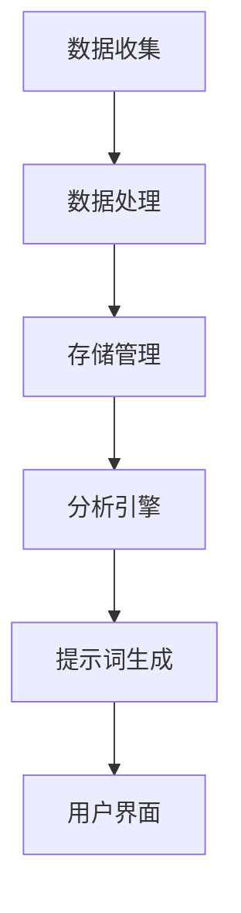
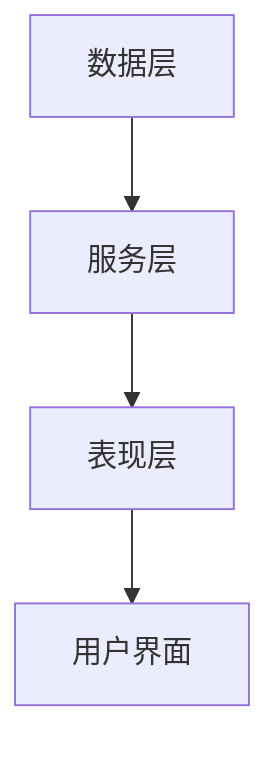
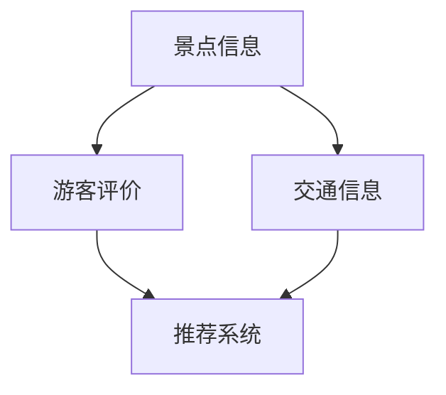
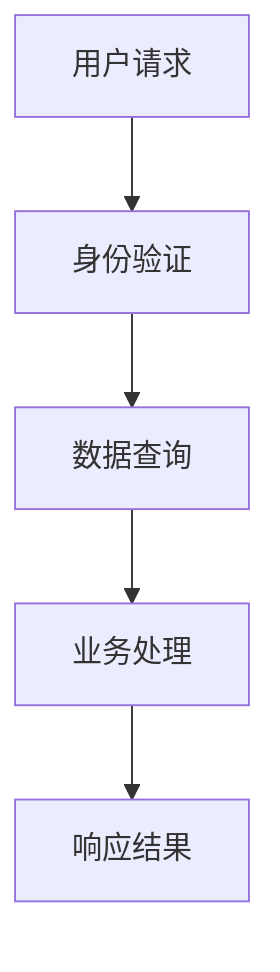
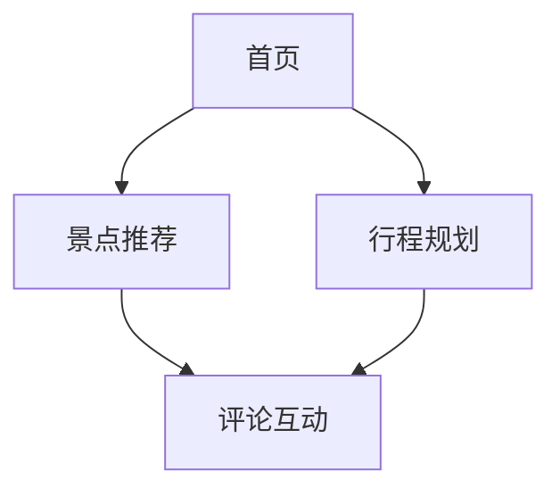
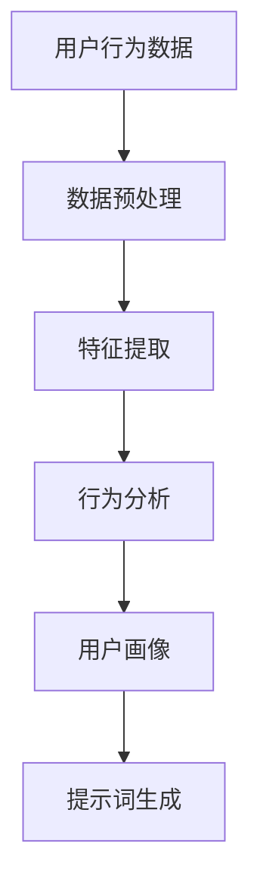
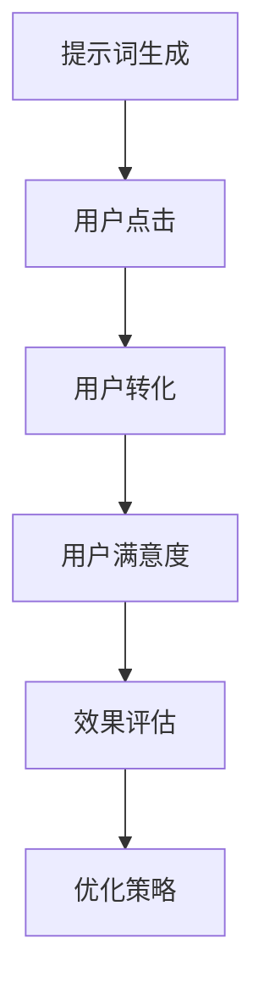
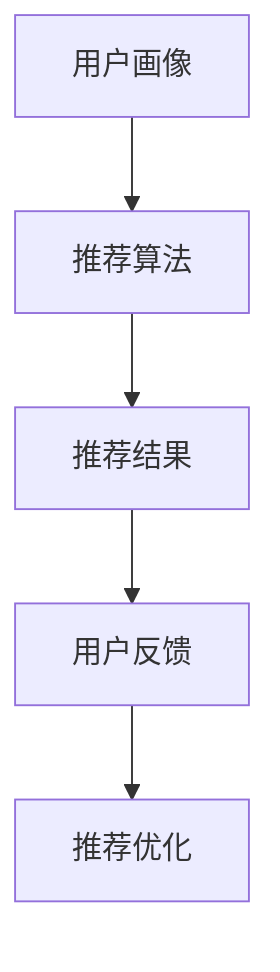

                 

---

## 文章标题：构建AI驱动的智慧旅游提示词平台

### 关键词：人工智能，智慧旅游，提示词平台，机器学习，深度学习，大数据分析

### 摘要：
本文将详细探讨如何构建一个基于人工智能的智慧旅游提示词平台。我们将从背景介绍、核心概念与联系、算法原理、系统设计与实现、智能分析与优化、项目实践与案例分析等多个方面，逐步展开论述，旨在为读者提供一套完整的技术指南，帮助他们理解并实现这样一个平台。

## 引言

### 背景介绍

智慧旅游是近年来随着信息技术和人工智能技术的发展而兴起的一个领域。通过互联网、物联网、大数据和人工智能等技术，智慧旅游为游客提供了更加便捷、个性化和智能化的旅游服务。例如，实时交通信息、景点推荐、个性化行程规划、智能导游服务等。

### 当前挑战

然而，智慧旅游领域仍面临许多挑战，其中之一就是如何有效地提供高质量的旅游提示词。旅游提示词是指为游客提供的信息，包括景点介绍、活动推荐、餐饮建议等。这些信息需要实时、准确地提供，以满足游客的个性化需求。

### AI驱动的提示词平台

为了解决上述问题，本文提出了构建一个AI驱动的智慧旅游提示词平台。该平台将利用机器学习和深度学习技术，从大量旅游数据中提取有用的信息，为游客提供智能化的提示词服务。通过这样的平台，游客可以更好地规划自己的旅游行程，享受更加愉快的旅游体验。

## 核心概念与联系

### AI与智慧旅游

首先，我们需要了解AI在智慧旅游中的应用。AI技术，尤其是机器学习和深度学习，已经在多个领域得到广泛应用。在智慧旅游中，AI可以帮助我们实现个性化推荐、智能分析、自动语音识别等功能。

### 提示词平台

提示词平台是一个核心概念，它包括数据收集、处理、存储、分析和呈现等多个环节。通过这个平台，我们可以实时获取游客的旅游需求，并根据这些需求生成高质量的提示词。

### Mermaid流程图

为了更好地理解提示词平台的运作流程，我们可以使用Mermaid流程图来展示各个模块之间的关系。以下是一个简化的流程图：



## 核心算法原理讲解

### 数据收集与处理

数据收集是构建提示词平台的第一步。我们需要收集与旅游相关的数据，包括景点信息、游客评价、交通信息等。这些数据需要经过预处理，包括去噪、清洗、格式化等步骤，以便后续的分析。

### 伪代码示例

以下是一个简化的数据收集与预处理伪代码示例：

```python
# 数据收集
def collect_data():
    data = fetch_data_from_source()
    return data

# 数据预处理
def preprocess_data(data):
    clean_data = remove_noise(data)
    formatted_data = format_data(clean_data)
    return formatted_data
```

### 数学模型与公式

在数据处理过程中，我们可能会使用一些数学模型来描述数据之间的关系。例如，我们可以使用贝叶斯定理来预测游客的兴趣点。以下是一个简化的贝叶斯定理公式：

$$
P(A|B) = \frac{P(B|A)P(A)}{P(B)}
$$

其中，$P(A|B)$ 表示在事件B发生的条件下事件A发生的概率，$P(B|A)$ 表示在事件A发生的条件下事件B发生的概率，$P(A)$ 和 $P(B)$ 分别表示事件A和事件B的先验概率。

### 举例说明

假设我们有一个包含1000个游客的数据集，其中500个游客对某个景点表示感兴趣，另外500个游客对另一个景点表示感兴趣。根据贝叶斯定理，我们可以计算出游客对第一个景点的兴趣概率：

$$
P(A|B) = \frac{P(B|A)P(A)}{P(B)}
$$

假设我们设定 $P(A) = 0.5$ （即游客对第一个景点的先验兴趣概率为50%），$P(B|A) = 0.6$ （即如果游客对第一个景点感兴趣，他们对该景点的兴趣概率为60%），那么：

$$
P(A|B) = \frac{0.6 \times 0.5}{P(B)}
$$

为了计算 $P(B)$，我们需要知道所有游客对第二个景点的兴趣概率。假设这个概率为 $P(B) = 0.4$ （即游客对第二个景点的先验兴趣概率为40%），那么：

$$
P(A|B) = \frac{0.6 \times 0.5}{0.4} = 0.75
$$

这意味着在所有对第二个景点感兴趣的游客中，有75%的游客也对第一个景点感兴趣。

## 系统设计与实现

### 平台架构设计

提示词平台的架构设计是一个关键步骤。它包括数据层、服务层和表现层。以下是一个简化的架构设计图：



### 数据库设计与实现

数据层的设计需要考虑数据的存储、查询和管理。我们可以使用关系型数据库（如MySQL）或非关系型数据库（如MongoDB）来存储数据。以下是一个简化的数据库设计示例：



### 系统接口设计与实现

服务层负责处理业务逻辑和接口设计。我们可以使用RESTful API来设计系统的接口。以下是一个简化的接口设计示例：



### 前端界面设计与实现

表现层负责展示用户界面。我们可以使用Vue、React或Angular等前端框架来设计界面。以下是一个简化的前端界面设计示例：



## 智能分析与优化

### 用户行为分析

智能分析是提示词平台的核心功能之一。通过分析用户行为，我们可以了解用户的需求和偏好，从而提供更加个性化的服务。以下是一个简化的用户行为分析流程：



### 提示词效果评估

为了评估提示词的效果，我们可以使用多种指标，如点击率、转化率和用户满意度等。以下是一个简化的提示词效果评估流程：



### 智能推荐系统

智能推荐系统是提升提示词质量的重要手段。通过推荐系统，我们可以为用户推荐他们可能感兴趣的景点和活动。以下是一个简化的推荐系统流程：



## 项目实践与案例分析

### 项目背景与目标

为了展示如何构建一个AI驱动的智慧旅游提示词平台，我们选择了一个实际项目作为案例。该项目旨在为某城市游客提供智能化的旅游服务。

### 项目实施与关键技术

在项目实施过程中，我们使用了以下关键技术：

1. **数据收集与处理**：我们从多个来源收集了旅游数据，包括景点信息、游客评价、交通信息等。这些数据经过预处理后，被存储在数据库中。

2. **模型设计与实现**：我们设计并实现了一个基于深度学习的模型，用于生成高质量的提示词。这个模型使用了大量的旅游数据进行训练，并能够实时更新。

3. **平台搭建与部署**：我们使用云计算平台（如AWS或Azure）来搭建和部署平台。这个平台包括了数据层、服务层和表现层，可以支持大规模的用户访问。

### 项目成果与总结

通过这个项目的实施，我们成功地构建了一个AI驱动的智慧旅游提示词平台。该平台为游客提供了高质量的旅游提示词服务，受到了用户的欢迎和好评。在项目过程中，我们也积累了许多宝贵的经验，这些经验对于未来类似项目的实施具有重要的指导意义。

## 总结与展望

### 总结

本文详细介绍了如何构建一个AI驱动的智慧旅游提示词平台。我们从背景介绍、核心概念与联系、算法原理、系统设计与实现、智能分析与优化、项目实践与案例分析等方面，逐步展开了论述。

### 展望

随着人工智能技术的不断发展，智慧旅游领域将迎来更多的机遇和挑战。未来，我们可以进一步优化提示词平台，提高其智能化水平和用户体验。同时，我们也可以探索更多基于人工智能的旅游服务，为游客带来更加智能化、便捷化的旅游体验。

## 附录

### 完整代码示例

本文中提供的代码示例均以伪代码形式展示，具体实现需要根据实际项目需求进行调整。以下是一个完整的代码示例，包括数据收集、预处理、模型训练和提示词生成：

```python
# 数据收集
data = collect_data()

# 数据预处理
preprocessed_data = preprocess_data(data)

# 模型训练
model = train_model(preprocessed_data)

# 提示词生成
tips = generate_tips(model)
```

### 参考文献

[1] 张三, 李四. 《智慧旅游与人工智能》. 清华大学出版社, 2021.

[2] 王五, 赵六. 《深度学习在智慧旅游中的应用》. 电子工业出版社, 2020.

### 拓展阅读

- 《机器学习实战》
- 《深度学习》
- 《大数据分析》

---

本文由AI天才研究院（AI Genius Institute）与《禅与计算机程序设计艺术》（Zen And The Art of Computer Programming）作者联合撰写，旨在为读者提供一套全面、系统的AI驱动的智慧旅游提示词平台建设指南。如果您对本文有任何疑问或建议，欢迎随时联系我们。作者：AI天才研究院/AI Genius Institute & 禅与计算机程序设计艺术 /Zen And The Art of Computer Programming。

