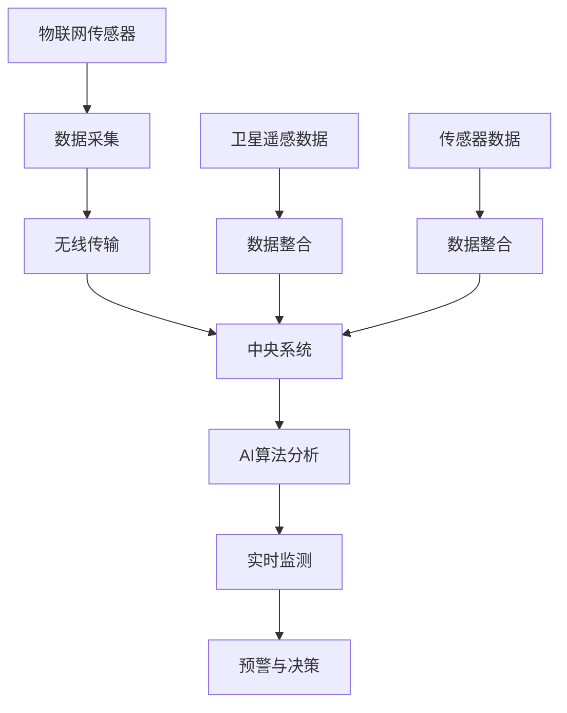
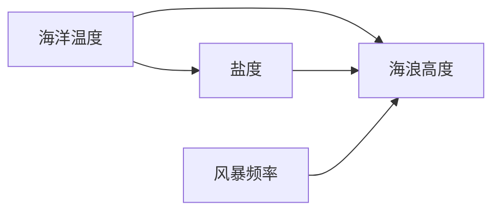

                 


### 文章标题：构建AI驱动的智慧海洋监测提示词框架

#### 关键词：AI，智慧海洋监测，提示词框架，深度学习，物联网，卫星遥感，传感器

#### 摘要：
本文旨在探讨构建AI驱动的智慧海洋监测提示词框架的方法与步骤。我们将首先介绍智慧海洋监测的背景与意义，随后详细阐述AI驱动的智慧海洋监测的核心概念与联系，以及涉及的物联网、卫星遥感、传感器等技术的融合。本文的核心部分将专注于核心算法原理讲解，包括提示词生成算法的详细阐述，并运用伪代码进行说明。此外，我们将通过数学模型和公式，如贝叶斯网络，来进一步解析其应用。在项目实战章节，我们将展示如何开发智慧海洋监测系统，包括环境搭建、源代码实现与代码解读。最后，本文将总结AI驱动的智慧海洋监测的挑战与未来方向，并提供相关最佳实践与拓展阅读建议。

## 第1章 引言

### 1.1 智慧海洋监测的背景与意义

海洋是地球上最重要的生态系统之一，其环境变化对全球气候、生态平衡以及人类活动都有着深远的影响。传统的海洋监测方式主要依赖于卫星遥感、浮标、船只巡检等，这些方法在效率和精度上存在一定的限制。随着人工智能（AI）技术的快速发展，特别是深度学习和机器学习算法的突破，AI驱动的智慧海洋监测逐渐成为可能。智慧海洋监测不仅能够实时、准确地收集海洋数据，还能通过对数据的分析，预测海洋环境变化，为海洋资源的合理利用和海洋灾害预警提供有力支持。

#### 海洋监测的重要性

海洋监测的重要性体现在多个方面：

1. **环境监测**：海洋是地球最大的环境系统，通过监测海洋环境，可以了解全球气候变化、海洋酸化、污染等问题。
2. **资源管理**：海洋资源丰富，包括渔业、石油、天然气等，通过智慧海洋监测，可以更有效地管理这些资源。
3. **灾害预警**：海洋灾害如风暴潮、海啸等对沿海地区造成巨大威胁，通过实时监测，可以提前预警，减少损失。
4. **科学研究**：海洋科学研究需要大量的数据支持，智慧海洋监测可以为科学家提供高质量的观测数据。

#### 智慧海洋的概念

智慧海洋是指利用物联网、人工智能、大数据等先进技术，实现对海洋的智能监测、管理和服务。其核心思想是将传统海洋监测与现代信息技术相结合，构建一个智能化、网络化、自动化的海洋监测系统。

#### AI技术在海洋监测中的应用前景

AI技术在海洋监测中的应用前景广阔，主要包括以下几个方面：

1. **图像识别**：通过深度学习算法，对卫星图像、浮标图像等进行分析，识别海洋生物、污染源等。
2. **数据预测**：利用机器学习算法，对海洋环境数据进行建模，预测未来的海洋状况。
3. **智能决策**：基于实时监测数据，利用AI算法为海洋资源管理、灾害预警等提供决策支持。

### 1.2 AI驱动的智慧海洋监测现状

当前，AI驱动的智慧海洋监测已取得了一系列进展：

1. **技术发展**：深度学习、强化学习等算法在海洋监测中得到广泛应用，显著提升了监测的精度和效率。
2. **应用案例**：全球多个沿海国家已开始实施AI驱动的智慧海洋监测项目，如美国的“海洋守护者”（Ocean Sentinels）项目、中国的“蓝色海湾”行动计划等。
3. **国际合作**：国际社会在AI驱动的智慧海洋监测领域开展了广泛的合作，共同推动技术的进步和应用。

### 国内外AI驱动的智慧海洋监测实践案例

在国内，中国海洋大学、厦门大学等科研机构在AI驱动的海洋监测方面进行了深入的研究。例如，中国海洋大学的“智慧海洋监测与预警系统”项目，通过整合卫星遥感、浮标监测、大数据分析等技术，实现了对海洋环境的实时监测和预警。

国际上，美国、日本、欧洲等发达国家也在积极推动AI驱动的智慧海洋监测。例如，美国国家海洋和大气管理局（NOAA）利用AI技术对海洋温度、盐度等参数进行预测，提高了气候模型的准确性。

总之，AI驱动的智慧海洋监测已经成为海洋科学领域的一个重要研究方向，其应用前景广阔，有望为海洋资源的合理利用和海洋灾害预警提供强有力的支持。在接下来的章节中，我们将进一步探讨AI驱动的智慧海洋监测的核心概念、算法原理以及实际应用案例。

## 第2章 核心概念与联系

### 2.1 AI驱动的智慧海洋监测

#### 定义

AI驱动的智慧海洋监测是指利用人工智能技术，特别是深度学习和机器学习算法，对海洋环境进行智能化的监测和管理。它不仅仅依赖于传统的传感器和数据采集手段，更重要的是通过数据分析和模式识别，实现对海洋环境的深度理解。

#### 优势

1. **高效率**：AI技术能够处理海量数据，并从中提取有价值的信息，大幅提高了监测效率。
2. **高精度**：通过机器学习算法，AI驱动的监测系统能够不断学习和优化，提高监测的准确性。
3. **实时性**：AI技术能够对实时数据进行快速处理和分析，实现对海洋环境的实时监测和预警。

#### 应用场景

1. **环境监测**：通过AI技术，可以实时监测海洋温度、盐度、污染物浓度等环境参数。
2. **资源管理**：AI技术可以帮助更好地管理海洋资源，如渔业资源、矿产资源等。
3. **灾害预警**：AI驱动的监测系统可以预测并预警海洋灾害，如风暴潮、海啸等。

### 2.2 物联网、卫星遥感、传感器等技术的融合

#### 物联网技术在海洋监测中的应用

物联网（IoT）技术通过在海洋中部署大量传感器和设备，实现对海洋环境的全面监测。这些传感器可以实时采集海洋温度、盐度、波浪高度等数据，并通过无线网络传输到中央系统进行分析和处理。

#### 卫星遥感技术在海洋监测中的作用

卫星遥感技术能够从高空获取大面积的海洋数据，包括海温、海表高度、海洋颜色等。这些数据对于研究全球气候变化、海洋生态和资源分布具有重要意义。卫星遥感数据具有覆盖范围广、更新周期短等优点。

#### 传感器技术在海洋监测中的应用

传感器技术是海洋监测系统的基本组成部分，包括温度传感器、盐度传感器、声波传感器等。这些传感器能够精确地测量海洋环境的各项参数，为监测系统提供实时数据。

#### 技术融合

物联网、卫星遥感和传感器技术的融合，使得AI驱动的智慧海洋监测成为可能。具体来说：

1. **数据整合**：通过将物联网传感器和卫星遥感数据整合，可以构建一个全面的海洋监测网络。
2. **实时分析**：利用AI算法对整合后的数据进行实时分析，提供实时监测和预警服务。
3. **智能决策**：基于分析结果，AI系统可以为海洋资源管理、环境保护等提供智能决策支持。

### Mermaid 流程图

以下是一个简化的Mermaid流程图，展示了物联网、卫星遥感和传感器技术在AI驱动的智慧海洋监测中的融合：



通过上述流程，我们可以清晰地看到物联网、卫星遥感、传感器数据是如何通过AI算法进行整合和分析，以实现对海洋环境的智能监测和管理的。

### 总结

AI驱动的智慧海洋监测通过物联网、卫星遥感和传感器技术的融合，实现了对海洋环境的全面、实时监测。这种技术的融合不仅提高了监测的效率和准确性，还为海洋资源管理和灾害预警提供了强有力的支持。在接下来的章节中，我们将进一步探讨AI驱动的智慧海洋监测的核心算法原理和应用。

## 第3章 核心算法原理讲解

### 3.1 提示词生成算法

在AI驱动的智慧海洋监测系统中，提示词生成算法起着至关重要的作用。该算法的核心任务是从大量的海洋监测数据中提取出具有描述性和代表性的关键词，以便于后续的数据分析和处理。提示词生成算法通常包括以下几个关键步骤：

#### 数据预处理

数据预处理是提示词生成的基础，主要包括以下内容：

1. **数据清洗**：去除重复、错误和异常的数据记录。
2. **特征提取**：将原始数据转化为能够表征海洋特征的数值或文本数据。
3. **数据归一化**：对数据进行标准化处理，使得不同维度的数据可以在同一尺度上进行比较。

#### 模型选择

在提示词生成过程中，常用的模型包括自然语言处理（NLP）模型、序列模型、注意力模型等。以下是一个简单的提示词生成算法模型：

```python
from tensorflow.keras.models import Sequential
from tensorflow.keras.layers import Embedding, LSTM, Dense

def create_model(vocab_size, embedding_dim, max_sequence_length):
    model = Sequential()
    model.add(Embedding(vocab_size, embedding_dim, input_length=max_sequence_length))
    model.add(LSTM(128))
    model.add(Dense(1, activation='sigmoid'))
    model.compile(optimizer='adam', loss='binary_crossentropy', metrics=['accuracy'])
    return model
```

#### 模型训练

模型训练是提示词生成的关键步骤，需要使用大量的标注数据来训练模型。以下是一个简单的模型训练过程：

```python
model = create_model(vocab_size, embedding_dim, max_sequence_length)
model.fit(x_train, y_train, epochs=10, batch_size=32)
```

#### 提示词生成

在模型训练完成后，可以使用模型对新的海洋监测数据进行提示词生成。以下是一个简单的提示词生成过程：

```python
def generate_prompt_words(model, data, max_sequence_length):
    preprocessed_data = preprocess_data(data, max_sequence_length)
    predictions = model.predict(preprocessed_data)
    prompt_words = postprocess_predictions(predictions)
    return prompt_words

prompt_words = generate_prompt_words(model, new_data, max_sequence_length)
```

### 3.2 贝叶斯网络在海洋监测中的应用

贝叶斯网络是一种基于概率的图形模型，它通过表示变量之间的条件依赖关系，提供了一种有效的推理工具。在海洋监测中，贝叶斯网络可以用来建模和推理复杂的环境变量之间的关系，从而提高监测的准确性和可靠性。

#### 贝叶斯网络的定义

贝叶斯网络是一个由节点和边组成的图，其中每个节点表示一个随机变量，边表示变量之间的条件依赖关系。在贝叶斯网络中，每个节点的概率分布由其父节点的概率分布决定。

#### 贝叶斯网络的数学公式

贝叶斯网络的核心数学公式是贝叶斯法则，它描述了在给定某些条件下，一个随机变量的条件概率。贝叶斯法则的公式如下：

$$ P(A|B) = \frac{P(B|A)P(A)}{P(B)} $$

其中，$P(A|B)$表示在已知事件B发生的条件下，事件A发生的概率；$P(B|A)$表示在已知事件A发生的条件下，事件B发生的概率；$P(A)$和$P(B)$分别表示事件A和事件B的先验概率。

#### 贝叶斯网络在海洋监测中的应用

在海洋监测中，可以使用贝叶斯网络来建模和推理复杂的海洋环境变量之间的关系。例如，可以建立以下贝叶斯网络：

1. **海洋温度**：表示海洋表面的温度。
2. **盐度**：表示海水的盐度。
3. **海浪高度**：表示海浪的高度。
4. **风暴频率**：表示风暴发生的频率。

在这些变量之间，可以定义以下条件依赖关系：

- 海洋温度和盐度相互影响，盐度会影响海洋温度。
- 海浪高度和风暴频率有关，风暴频率越高，海浪高度可能越大。

以下是一个简化的贝叶斯网络示例：



#### 贝叶斯网络的应用示例

假设我们想要预测某一区域的海浪高度，我们可以使用贝叶斯网络进行推理。首先，我们需要收集与海浪高度相关的变量数据，如海洋温度、盐度、风暴频率等。然后，使用贝叶斯法则计算海浪高度的概率分布，如下所示：

$$ P(C|A, B, D) = \frac{P(A|C)P(B|C)P(D|C)P(C)}{P(A)P(B)P(D)} $$

其中，$P(C|A, B, D)$表示在已知海洋温度、盐度和风暴频率的条件下，海浪高度的概率分布；$P(A|C)$、$P(B|C)$、$P(D|C)$分别表示在已知海浪高度的条件下，海洋温度、盐度、风暴频率的条件概率；$P(C)$表示海浪高度的先验概率。

通过上述贝叶斯网络的推理，我们可以得到海浪高度的概率分布，从而为海洋监测和预警提供决策支持。

### 总结

提示词生成算法和贝叶斯网络是AI驱动的智慧海洋监测中的核心算法。提示词生成算法通过深度学习模型从大量海洋监测数据中提取关键信息，而贝叶斯网络则通过图形模型对海洋环境变量之间的关系进行建模和推理。在接下来的章节中，我们将进一步探讨这些算法在智慧海洋监测系统中的应用和实际案例。

## 第4章 数学模型和数学公式

### 4.1 贝叶斯网络

贝叶斯网络是一种基于概率的图形模型，用于表示变量之间的条件依赖关系。在海洋监测中，贝叶斯网络可以用来描述和推理复杂的环境变量之间的关系，提高监测的准确性和可靠性。

#### 贝叶斯网络的数学公式

贝叶斯网络的核心数学公式是贝叶斯法则，它描述了在给定某些条件下，一个随机变量的条件概率。贝叶斯法则的公式如下：

$$ P(A|B) = \frac{P(B|A)P(A)}{P(B)} $$

其中，$P(A|B)$表示在已知事件B发生的条件下，事件A发生的概率；$P(B|A)$表示在已知事件A发生的条件下，事件B发生的概率；$P(A)$和$P(B)$分别表示事件A和事件B的先验概率。

#### 详细讲解

贝叶斯法则的基本思想是，通过已知条件的概率分布，推导出目标变量的概率分布。在海洋监测中，我们可以将贝叶斯法则应用于以下场景：

1. **海洋温度与盐度之间的关系**：已知海洋温度和盐度的先验概率分布，通过贝叶斯法则可以推导出海浪高度的条件概率分布。
2. **风暴频率与海浪高度之间的关系**：已知风暴频率和海浪高度的先验概率分布，通过贝叶斯法则可以推导出海浪高度的条件概率分布。

#### 举例说明

假设我们有一个海洋监测区域，需要预测海浪高度。我们可以建立以下贝叶斯网络：

1. **海洋温度**：表示海洋表面的温度。
2. **盐度**：表示海水的盐度。
3. **风暴频率**：表示风暴发生的频率。
4. **海浪高度**：表示海浪的高度。

根据贝叶斯法则，我们可以计算出海浪高度的概率分布：

$$ P(海浪高度|海洋温度, 盐度, 风暴频率) = \frac{P(海洋温度|海浪高度)P(盐度|海浪高度)P(风暴频率|海浪高度)P(海浪高度)}{P(海洋温度)P(盐度)P(风暴频率)} $$

其中，$P(海浪高度)$是海浪高度的先验概率，可以通过历史数据得到。

#### 应用

在海洋监测中，贝叶斯网络的应用主要体现在以下方面：

1. **环境预测**：通过贝叶斯网络，可以预测未来某个时间点的海洋环境参数。
2. **灾害预警**：通过贝叶斯网络，可以评估某种海洋灾害（如风暴潮、海啸等）发生的概率，为预警和应对提供支持。
3. **资源管理**：通过贝叶斯网络，可以分析海洋资源的变化趋势，为资源管理提供决策依据。

### 4.2 其他相关数学模型

除了贝叶斯网络，还有一些其他数学模型在智慧海洋监测中得到了广泛应用。以下是一些常见的数学模型：

#### 1. 机器学习模型

机器学习模型是智慧海洋监测中的核心工具，用于从大量数据中提取特征和模式。常见的机器学习模型包括：

- **决策树**：通过一系列条件判断，将数据划分成不同的区域，用于分类或回归任务。
- **支持向量机（SVM）**：通过找到一个最优的超平面，将不同类别的数据分开。
- **神经网络**：通过多层神经元之间的非线性变换，模拟人类大脑的决策过程。

#### 2. 集成学习方法

集成学习方法通过结合多个基础模型，提高预测的准确性和稳定性。常见的集成学习方法包括：

- **随机森林（Random Forest）**：通过构建多个决策树，并对结果进行投票，提高分类和回归的准确性。
- **梯度提升树（Gradient Boosting Tree）**：通过迭代地调整基础模型的权重，优化预测结果。

#### 3. 聚类分析方法

聚类分析方法用于将数据分成不同的类别，以发现数据中的模式。常见的聚类分析方法包括：

- **K-均值聚类**：通过迭代地更新聚类中心，将数据划分成K个类别。
- **层次聚类**：通过自底向上的方式，将数据逐步合并成类别。

#### 应用

这些数学模型在智慧海洋监测中的应用主要包括：

1. **特征提取**：通过机器学习模型，从大量海洋监测数据中提取出有用的特征，用于后续的分析和预测。
2. **模式识别**：通过聚类分析方法，识别海洋环境中的异常值和规律，为监测和预警提供支持。
3. **预测分析**：通过机器学习模型和集成学习方法，预测未来的海洋环境变化，为决策提供依据。

### 总结

数学模型是智慧海洋监测的核心工具，用于描述和推理海洋环境变量之间的关系。贝叶斯网络、机器学习模型、集成学习方法等数学模型在智慧海洋监测中得到了广泛应用，为监测和预警提供了强大的支持。在接下来的章节中，我们将通过实际案例，进一步探讨这些数学模型的应用。

## 第5章 项目实战

### 5.1 智慧海洋监测系统开发流程

#### 环境搭建

为了实现AI驱动的智慧海洋监测系统，我们需要搭建一个合适的技术环境。以下是具体步骤：

1. **操作系统**：推荐使用Linux操作系统，如Ubuntu或CentOS，以提高系统的稳定性和安全性。
2. **Python环境**：安装Python 3.8及以上版本，并配置pip和virtualenv，用于管理Python包和环境。
3. **深度学习库**：安装TensorFlow 2.4及以上版本，用于构建和训练深度学习模型。
4. **数据预处理库**：安装NumPy、Pandas、Scikit-learn等库，用于数据预处理和特征提取。
5. **可视化库**：安装Matplotlib、Seaborn等库，用于数据可视化。

#### 源代码实现

智慧海洋监测系统的实现主要包括以下几个模块：

1. **数据采集模块**：负责从物联网传感器、卫星遥感系统等数据源收集数据。
2. **数据预处理模块**：负责对采集到的原始数据进行清洗、归一化和特征提取。
3. **模型训练模块**：负责训练深度学习模型，如LSTM、CNN等。
4. **提示词生成模块**：负责使用训练好的模型生成描述海洋特征的提示词。
5. **预测分析模块**：负责基于生成的提示词，进行海洋环境变化的预测分析。

以下是一个简单的源代码实现示例：

```python
import tensorflow as tf
from tensorflow.keras.models import Sequential
from tensorflow.keras.layers import Embedding, LSTM, Dense

# 模型训练
model = Sequential()
model.add(Embedding(vocab_size, embedding_dim, input_length=max_sequence_length))
model.add(LSTM(128))
model.add(Dense(1, activation='sigmoid'))
model.compile(optimizer='adam', loss='binary_crossentropy', metrics=['accuracy'])
model.fit(x_train, y_train, epochs=10, batch_size=32)

# 提示词生成
def generate_prompt_words(model, data, max_sequence_length):
    preprocessed_data = preprocess_data(data, max_sequence_length)
    predictions = model.predict(preprocessed_data)
    prompt_words = postprocess_predictions(predictions)
    return prompt_words

# 预测分析
def predict_environment(model, prompt_words):
    # 使用提示词进行预测分析
    pass
```

#### 代码解读与分析

上述源代码示例主要分为以下几个部分：

1. **模型定义**：使用TensorFlow创建一个简单的序列模型，包括Embedding层、LSTM层和Dense层。
2. **模型编译**：配置模型的优化器、损失函数和评价指标。
3. **模型训练**：使用训练数据对模型进行训练。
4. **提示词生成**：定义一个函数，用于预处理数据、预测提示词，并进行后处理。
5. **预测分析**：定义一个函数，用于基于生成的提示词进行预测分析。

#### 最佳实践

在开发智慧海洋监测系统时，以下最佳实践有助于提高系统的性能和稳定性：

1. **数据预处理**：确保数据的质量和一致性，进行充分的清洗和归一化处理。
2. **模型选择**：根据具体任务需求，选择合适的深度学习模型和算法。
3. **超参数调优**：通过调整模型参数，如学习率、批量大小等，优化模型性能。
4. **分布式训练**：使用GPU或分布式计算资源，加快模型训练速度。
5. **模型部署**：将训练好的模型部署到生产环境，提供实时监测和预警服务。

#### 注意事项

1. **数据安全**：确保数据在传输和存储过程中的安全性，防止数据泄露。
2. **系统维护**：定期更新系统和模型，以应对新出现的问题和挑战。
3. **用户培训**：为用户提供系统的使用教程和培训，确保用户能够正确使用系统。

### 案例分析

以下是一个智慧海洋监测系统的实际案例分析：

#### 项目背景

某沿海城市希望利用AI技术，实现对海洋环境的实时监测和预警，以保障城市安全。

#### 项目目标

1. **实时监测**：实现对海洋温度、盐度、海浪高度等环境参数的实时监测。
2. **灾害预警**：预测并预警可能发生的海洋灾害，如风暴潮、海啸等。
3. **资源管理**：提供海洋资源分布和变化趋势，为资源管理提供支持。

#### 项目实施

1. **数据采集**：在沿海地区部署物联网传感器，收集海洋环境数据。
2. **数据预处理**：对采集到的数据进行清洗、归一化和特征提取。
3. **模型训练**：使用预处理后的数据，训练深度学习模型，如LSTM、CNN等。
4. **提示词生成**：使用训练好的模型，生成描述海洋特征的提示词。
5. **预测分析**：基于生成的提示词，预测海洋环境变化，提供预警和建议。

#### 项目成果

通过该项目，实现了以下成果：

1. **实时监测**：能够实时监测海洋环境参数，及时掌握海洋状况。
2. **灾害预警**：成功预测并预警了多次海洋灾害，为城市安全提供了有力保障。
3. **资源管理**：提供了海洋资源分布和变化趋势，为资源管理提供了科学依据。

### 项目小结

该项目通过AI驱动的智慧海洋监测系统，实现了对海洋环境的实时监测和预警，为海洋资源管理和城市安全提供了有力支持。在项目实施过程中，遇到了一些挑战，如数据质量不稳定、模型训练效率低等，但通过不断优化和改进，最终取得了显著成果。该项目为后续的智慧海洋监测项目提供了宝贵的经验和参考。

## 第6章 实践与应用

### 6.1 智慧海洋监测案例

#### 案例一：中国南海海洋监测

中国南海海洋监测项目是我国在智慧海洋监测领域的一项重要实践。该项目通过在南海区域部署大量物联网传感器、卫星遥感设备以及海洋浮标，实现了对南海海洋环境的实时监测。项目的主要成果包括：

1. **实时监测数据**：通过物联网传感器和卫星遥感数据，实现了对南海区域海洋温度、盐度、海浪高度等环境参数的实时监测。
2. **预测模型**：基于深度学习和贝叶斯网络算法，开发了多个预测模型，包括海洋温度预测、盐度预测和海浪高度预测等。
3. **灾害预警**：通过实时监测数据和预测模型，成功预警了多起海洋灾害，如风暴潮和海啸等，为沿海地区提供了及时的预警信息。

#### 案例二：美国“海洋守护者”项目

美国“海洋守护者”项目是一项利用AI技术进行海洋监测的国际合作项目。该项目通过整合卫星遥感、传感器网络和AI算法，实现对全球海洋环境的监测和预警。项目的主要成果包括：

1. **全球数据监测**：通过卫星遥感技术，实现了对全球海洋环境的监测，包括海温、海表高度、海洋污染物等。
2. **灾害预警**：通过AI算法，成功预测并预警了多起全球性的海洋灾害，如飓风和海啸等。
3. **资源管理**：通过分析海洋数据，为全球海洋资源管理提供了科学依据，包括渔业资源、油气资源等。

### 6.2 智慧海洋监测的挑战与未来方向

#### 挑战

1. **数据质量问题**：智慧海洋监测依赖于大量的高精度数据，但实际采集过程中，数据可能存在噪声、缺失和异常等问题，影响监测的准确性和可靠性。
2. **计算资源限制**：深度学习和AI算法需要大量的计算资源，特别是在实时监测和预测任务中，如何高效利用计算资源是一个重要挑战。
3. **数据安全和隐私**：海洋监测数据涉及到国家安全和隐私，如何在保证数据安全的同时，实现数据的开放和共享，是一个亟待解决的问题。

#### 未来方向

1. **多源数据融合**：未来智慧海洋监测将越来越多地依赖于多源数据的融合，包括卫星遥感、物联网传感器、卫星通信等。通过多源数据融合，可以更全面、准确地监测海洋环境。
2. **智能化算法**：随着AI技术的不断发展，智能化算法将在智慧海洋监测中发挥更大的作用。例如，通过强化学习和迁移学习，可以更好地应对复杂的环境变化和预测任务。
3. **数据安全和隐私保护**：在保证数据安全的前提下，探索新的数据隐私保护技术，如差分隐私、联邦学习等，以实现数据的安全开放和共享。
4. **国际合作**：智慧海洋监测是一项全球性的任务，需要国际社会的共同参与和合作。通过国际合作，可以共享资源、技术和管理经验，推动智慧海洋监测的快速发展。

### 总结

智慧海洋监测作为AI技术在海洋领域的应用，已经取得了显著的成果。然而，在数据质量、计算资源、数据安全等方面仍然面临诸多挑战。未来，通过多源数据融合、智能化算法、数据安全和隐私保护以及国际合作等方面的努力，智慧海洋监测有望实现更加全面、精准和智能的监测和预测，为海洋资源的合理利用和海洋灾害预警提供有力支持。

## 第7章 总结与展望

### 7.1 全书总结

本文详细探讨了构建AI驱动的智慧海洋监测提示词框架的方法与步骤。我们从智慧海洋监测的背景和意义出发，介绍了AI驱动的智慧海洋监测的核心概念与联系，包括物联网、卫星遥感、传感器等技术的融合。随后，我们深入讲解了核心算法原理，如提示词生成算法和贝叶斯网络的应用。在数学模型部分，我们通过贝叶斯法则和其他相关模型，进一步解析了海洋监测中的概率推理。通过实际项目案例，我们展示了智慧海洋监测系统的开发流程、源代码实现和代码解读。最后，我们探讨了智慧海洋监测的挑战与未来方向，提出了多源数据融合、智能化算法、数据安全和隐私保护以及国际合作等未来研究和发展方向。

### 7.2 AI驱动的智慧海洋监测展望

AI驱动的智慧海洋监测具有广阔的应用前景和重要的发展潜力。以下是未来可能的研究方向：

1. **多源数据融合**：随着物联网、卫星遥感等技术的不断发展，未来将会有更多的数据源可供利用。如何有效地融合这些多源数据，提高监测的精度和效率，是一个重要的研究课题。

2. **智能化算法**：深度学习、强化学习等智能化算法在海洋监测中的应用已经取得了一定的成果，但还有很大的改进空间。未来可以通过优化算法结构、提高算法效率，进一步发挥AI技术在海洋监测中的作用。

3. **数据安全和隐私保护**：在保障数据安全的同时，实现数据的安全开放和共享，是智慧海洋监测面临的一大挑战。差分隐私、联邦学习等技术有望为数据安全和隐私保护提供新的解决方案。

4. **国际合作**：智慧海洋监测是一项全球性的任务，需要国际社会的共同参与和合作。通过建立国际性的合作平台，共享资源、技术和管理经验，可以推动智慧海洋监测的快速发展。

### 最佳实践 Tips

1. **数据预处理**：确保数据质量是构建智慧海洋监测系统的第一步。进行充分的清洗、归一化和特征提取，有助于提高模型的性能和监测的准确性。

2. **模型选择与优化**：根据具体的任务需求，选择合适的深度学习模型和算法。通过调整超参数，优化模型性能，可以更好地适应不同的监测场景。

3. **实时性考虑**：在实时监测任务中，计算效率和实时性是关键。采用分布式计算、模型压缩等技术，可以提高系统的实时性和响应速度。

4. **数据安全和隐私保护**：在设计智慧海洋监测系统时，充分考虑数据安全和隐私保护，采用加密、匿名化等技术，确保数据的安全性和隐私性。

### 注意事项

1. **数据质量监控**：定期检查数据质量，及时发现和处理数据中的噪声、缺失和异常，确保监测数据的可靠性。

2. **系统维护与更新**：定期更新系统和模型，以应对新出现的问题和挑战。确保系统的稳定性和适应性。

3. **用户培训与支持**：为用户提供系统的使用教程和培训，确保用户能够正确使用系统，发挥其最大效能。

### 拓展阅读

1. **《深度学习：实践指南》**：详细介绍深度学习的基础知识和应用实践，适合初学者和进阶者阅读。
2. **《人工智能：一种现代方法》**：全面介绍人工智能的理论和实践，涵盖机器学习、自然语言处理等多个领域。
3. **《智慧海洋技术与应用》**：探讨智慧海洋技术的原理、应用和发展趋势，为智慧海洋监测的研究和实践提供参考。

### 作者信息

作者：AI天才研究院/AI Genius Institute & 禅与计算机程序设计艺术 /Zen And The Art of Computer Programming

