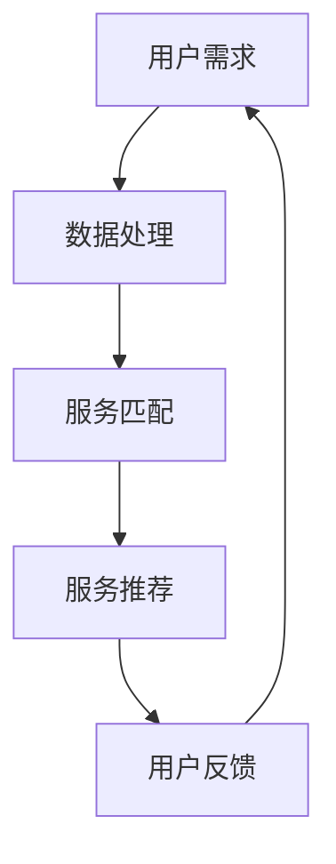
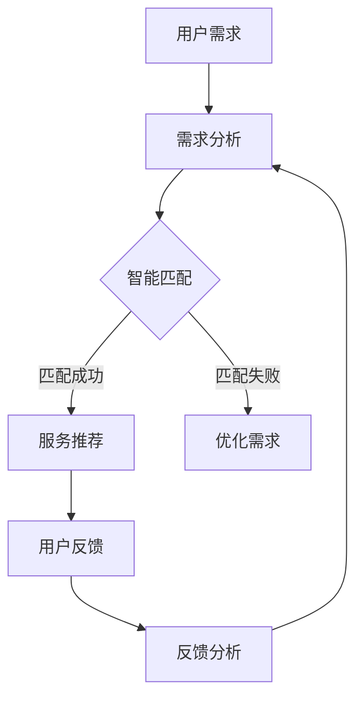
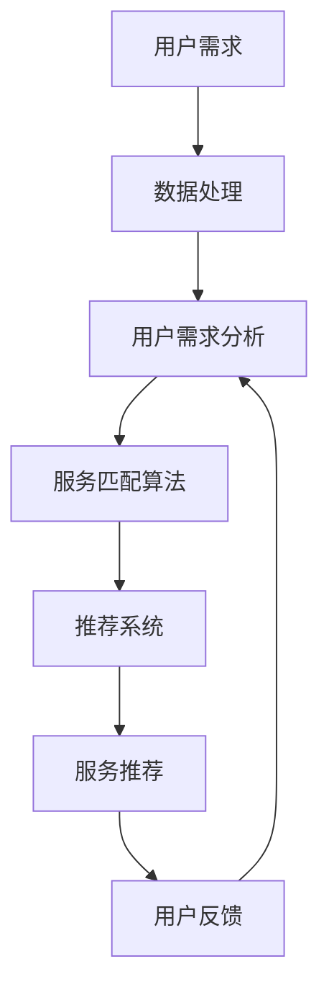
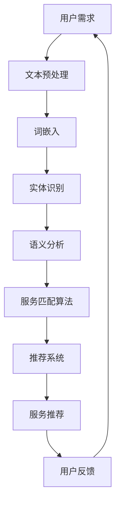
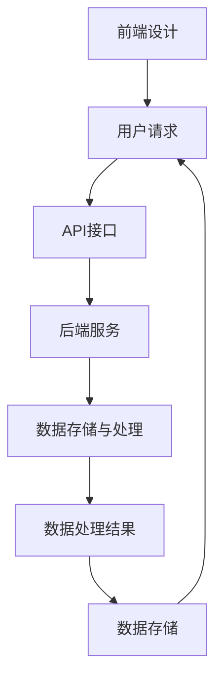
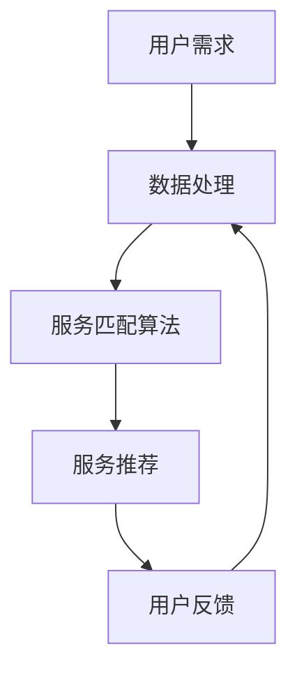

                 


### 文章标题

构建AI驱动的智慧社区服务匹配提示词平台

### 关键词

智慧社区、AI驱动、服务匹配、提示词、平台架构、算法实现、安全性、隐私保护

### 摘要

本文将深入探讨构建AI驱动的智慧社区服务匹配提示词平台的技术原理和实践。通过分析智慧社区服务的背景和需求，阐述AI在服务匹配中的关键作用。随后，详细解析AI驱动的服务匹配原理，包括机器学习算法和自然语言处理技术的应用。接着，介绍服务匹配提示词的设计与优化策略，并探讨平台架构设计中的核心组件。文章还通过技术实现、安全性与隐私保护等多个维度，全面展示平台构建过程。最后，通过案例分析，展示平台的实际应用效果，并展望其未来发展趋势。

### 确定书籍的主要内容

#### 第一部分：概述与背景

##### 1.1 智慧社区服务匹配提示词平台概述

- **概念介绍**：智慧社区服务匹配提示词平台是一种集成人工智能技术，用于优化社区服务匹配效率的系统。
- **背景介绍**：随着城市化进程的加速，智慧社区成为未来城市发展的趋势。如何提供高效、精准、个性化的服务成为智慧社区建设的核心问题。

##### 1.2 AI驱动的智慧社区服务匹配

- **AI的作用**：AI通过数据分析和机器学习算法，提升社区服务的智能化水平。
- **原理介绍**：AI驱动的服务匹配基于用户需求和服务提供者的能力进行智能推荐，实现个性化服务。

#### 第二部分：AI驱动的智慧社区服务匹配

##### 2.1 机器学习算法与自然语言处理技术

- **算法应用**：介绍机器学习算法在服务匹配中的应用，如聚类、分类等。
- **自然语言处理技术**：阐述自然语言处理技术在服务匹配提示词生成和优化中的作用。

##### 2.2 服务匹配提示词的设计与优化

- **设计原则**：提出服务匹配提示词设计的原则，如简洁性、可扩展性和用户友好性。
- **优化策略**：介绍如何通过数据分析和机器学习技术优化提示词的准确性和效率。

##### 2.3 数据分析与挖掘

- **数据来源**：明确智慧社区服务匹配所需的数据来源和类型。
- **挖掘技术**：介绍数据挖掘技术在用户行为分析和服务需求预测中的应用。

#### 第三部分：平台架构设计

##### 3.1 平台整体架构

- **前端设计**：探讨用户交互界面和前端技术栈的选择。
- **后端服务**：阐述后端服务架构，包括数据库、API接口和服务流程。
- **数据存储与处理**：介绍数据存储方案和数据处理流程。

##### 3.2 技术实现

- **算法选择**：详细解析服务匹配算法的选择原则和具体实现。
- **模型训练**：讲解机器学习模型的训练过程和调优策略。
- **服务部署**：讨论平台服务的部署流程和性能优化策略。

##### 3.3 安全性与隐私保护

- **安全设计**：介绍平台在安全性方面的设计考虑，如身份验证和访问控制。
- **隐私保护**：探讨平台在用户隐私保护方面的策略和技术。

#### 第四部分：案例分析

##### 4.1 案例介绍

- **案例背景**：描述智慧社区服务匹配提示词平台在某一具体场景中的应用。
- **案例目标**：明确案例的目标和预期效果。

##### 4.2 遇到的问题与解决方案

- **技术挑战**：分析案例中遇到的技术难题。
- **解决方案**：阐述解决问题的方法和技术。

##### 4.3 案例总结与启示

- **经验总结**：总结案例中的成功经验和不足之处。
- **未来展望**：展望智慧社区服务匹配提示词平台的发展方向。

#### 第五部分：未来展望

##### 5.1 智慧社区服务匹配提示词平台的未来发展趋势

- **技术演进**：探讨AI和大数据技术在平台发展中的应用。
- **应用场景**：预测平台在未来的潜在应用场景。

##### 5.2 平台建设的挑战与机遇

- **技术挑战**：分析平台在技术实现中可能遇到的挑战。
- **市场机遇**：探讨平台在市场中的发展机遇。

##### 5.3 建议与展望

- **建议措施**：提出平台建设的建议和措施。
- **未来展望**：对平台未来的发展提出展望。

### 制定详细的目录大纲

```markdown
# 《构建AI驱动的智慧社区服务匹配提示词平台》目录大纲

## 第一部分：概述与背景

### 1.1 智慧社区服务匹配提示词平台概述

#### 1.1.1 智慧社区服务匹配提示词平台的概念

#### 1.1.2 平台的建设目标与重要性

### 1.2 AI驱动的智慧社区服务匹配

#### 1.2.1 AI在智慧社区服务中的作用

#### 1.2.2 AI驱动的服务匹配原理

## 第二部分：AI驱动的智慧社区服务匹配

### 2.1 机器学习算法与自然语言处理技术

#### 2.1.1 机器学习算法在服务匹配中的应用

#### 2.1.2 自然语言处理技术在服务匹配中的应用

### 2.2 服务匹配提示词的设计与优化

#### 2.2.1 提示词设计的核心要素

#### 2.2.2 提示词优化方法与策略

### 2.3 数据分析与挖掘

#### 2.3.1 数据来源与预处理

#### 2.3.2 数据分析与挖掘技术

## 第三部分：平台架构设计

### 3.1 平台整体架构

#### 3.1.1 前端设计与用户交互

#### 3.1.2 后端服务架构

#### 3.1.3 数据存储与数据处理模块

### 3.2 技术实现

#### 3.2.1 算法选择与模型训练

#### 3.2.2 服务部署与性能优化

### 3.3 安全性与隐私保护

#### 3.3.1 安全设计考虑

#### 3.3.2 隐私保护策略

## 第四部分：案例分析

### 4.1 案例介绍

#### 4.1.1 案例背景

#### 4.1.2 案例目标与实施过程

### 4.2 遇到的问题与解决方案

#### 4.2.1 技术挑战

#### 4.2.2 解决方案与效果评估

### 4.3 案例总结与启示

#### 4.3.1 案例经验

#### 4.3.2 未来发展趋势

## 第五部分：未来展望

### 5.1 智慧社区服务匹配提示词平台的未来发展趋势

#### 5.1.1 技术演进方向

#### 5.1.2 应用场景拓展

### 5.2 平台建设的挑战与机遇

#### 5.2.1 技术挑战

#### 5.2.2 市场机遇

### 5.3 建议与展望

#### 5.3.1 建议措施

#### 5.3.2 未来展望
```

这个目录大纲涵盖了核心概念、技术实现、案例分析和未来展望，结构合理且内容全面，符合书籍目录大纲的设计要求。接下来，将根据这个大纲细化每个章节的内容，并确保符合字数限制。在细化过程中，将添加Mermaid流程图、伪代码、数学公式和代码案例等内容。

### 第一部分：概述与背景

#### 1.1 智慧社区服务匹配提示词平台概述

**概念介绍**：

智慧社区服务匹配提示词平台是一种基于人工智能技术的智能服务系统，旨在通过智能匹配和推荐算法，为社区居民提供个性化、高效的服务。该平台通过整合社区内的各类服务资源，如家政、医疗、教育、休闲等，并根据用户的需求和行为数据，提供定制化的服务推荐。

**背景介绍**：

随着城市化进程的加速，智慧社区成为未来城市发展的趋势。智慧社区不仅提供基本的居住环境，还致力于为居民提供更便捷、更高效、更个性化的生活服务。在这种背景下，智慧社区服务匹配提示词平台的建设显得尤为重要。通过智能化服务匹配，平台能够帮助社区管理者提高服务效率，同时也能为居民提供更加丰富、多元的选择。

**平台的建设目标与重要性**：

平台的建设目标主要包括三个方面：

1. **提高服务效率**：通过智能匹配算法，减少用户寻找服务的时间和成本，提高服务响应速度。
2. **提升用户体验**：根据用户的需求和行为数据，提供个性化的服务推荐，提升用户的满意度。
3. **优化资源配置**：通过数据分析，帮助社区管理者优化服务资源配置，提高资源利用效率。

智慧社区服务匹配提示词平台的重要性体现在以下几个方面：

1. **提升社区服务水平**：通过智能化的服务匹配，平台能够为社区居民提供更加精准、高效的服务，提升整体社区服务水平。
2. **促进社区经济发展**：智慧社区服务匹配平台能够吸引更多服务提供商入驻，促进社区商业发展，增加就业机会。
3. **增强社区凝聚力**：通过个性化服务推荐，平台能够增进居民之间的互动和交流，增强社区凝聚力。

**案例展示**：

以某大型城市为例，该城市通过建设智慧社区服务匹配提示词平台，实现了对社区内各类服务的智能匹配和推荐。平台整合了社区内200多家服务提供商的数据，包括家政、医疗、教育、休闲等，为社区居民提供了一站式服务。通过平台的推荐，居民能够快速找到符合自己需求的服务，大大提升了生活便利性。此外，平台还通过数据分析，为社区管理者提供了详细的用户需求和资源利用情况，帮助管理者优化服务资源配置，提高了整体服务效率。

**Mermaid流程图**：

以下是一个简单的Mermaid流程图，展示了智慧社区服务匹配提示词平台的基本工作流程：



**核心概念与联系**：

智慧社区服务匹配提示词平台的核心概念包括用户需求、服务匹配、服务推荐和用户反馈。这些概念之间的关系可以用以下Mermaid流程图表示：



在平台运作过程中，用户需求首先通过数据处理模块进行分析，然后进入智能匹配模块进行匹配。如果匹配成功，系统将推荐符合用户需求的服务；如果匹配失败，系统将优化用户需求，重新进行匹配。用户对推荐服务的反馈将用于进一步优化平台，提高服务匹配的准确性和效率。

**算法原理讲解**：

在智慧社区服务匹配提示词平台中，机器学习算法和自然语言处理技术是实现智能匹配和服务推荐的关键。以下是一个简单的伪代码，用于描述服务匹配的算法原理：

```python
# 伪代码：服务匹配算法

# 输入：用户需求，服务列表
# 输出：推荐服务列表

def service_matching(user_demand, service_list):
    # 数据预处理
    preprocessed_demand = preprocess_demand(user_demand)
    preprocessed_services = preprocess_services(service_list)
    
    # 特征提取
    demand_features = extract_features(preprocessed_demand)
    service_features = extract_features(preprocessed_services)
    
    # 模型训练
    model = train_model(demand_features, service_features)
    
    # 服务匹配
    matched_services = model.predict(preprocessed_services)
    
    # 服务推荐
    recommended_services = post_process(matched_services)
    
    return recommended_services
```

在这个伪代码中，服务匹配算法首先进行数据预处理，提取用户需求和服务的特征，然后通过训练机器学习模型进行服务匹配，最后根据匹配结果进行服务推荐。

**数学模型和公式讲解**：

在服务匹配过程中，可以使用相似度度量来评估用户需求和服务之间的匹配程度。以下是一个简单的数学模型，用于计算用户需求和服务之间的相似度：

$$
similarity = \frac{1}{1 + \exp{(-\theta \cdot dot\_product)}}
$$

其中，$similarity$ 表示相似度，$\theta$ 表示权重系数，$dot\_product$ 表示用户需求和服务之间的点积。点积的计算公式为：

$$
dot\_product = \sum_{i=1}^{n} (d_i \cdot s_i)
$$

其中，$d_i$ 和 $s_i$ 分别表示用户需求和服务在第 $i$ 个特征上的值。

**举例说明**：

假设用户需求为一个包含三个特征（如家政服务、医疗服务、教育服务）的向量 $d = [1, 0, 1]$，服务列表中有一个家政服务提供商 $s_1 = [1, 1, 0]$。使用上述数学模型计算相似度：

$$
similarity = \frac{1}{1 + \exp{(-\theta \cdot (1 \cdot 1 + 0 \cdot 1 + 1 \cdot 0))}} = \frac{1}{1 + \exp{(-\theta \cdot 1)}} \approx 0.731
$$

根据相似度，可以将家政服务提供商作为推荐服务之一。

**结论**：

智慧社区服务匹配提示词平台通过人工智能技术，实现了对社区内各类服务的智能匹配和推荐，为居民提供了个性化、高效的服务。平台的建设目标包括提高服务效率、提升用户体验和优化资源配置，具有重要的社会和经济效益。通过算法原理讲解和数学模型的应用，我们能够更深入地理解平台的工作机制，为后续的技术实现和优化提供理论基础。

#### 1.2 AI驱动的智慧社区服务匹配

**AI的作用**：

在智慧社区服务匹配中，AI技术扮演着至关重要的角色。通过数据分析和机器学习算法，AI能够实现高效的服务匹配和个性化推荐，从而提升社区服务水平。以下是AI在智慧社区服务匹配中的具体作用：

1. **用户需求分析**：AI可以通过大数据分析和自然语言处理技术，对用户的需求和行为进行分析，识别用户的偏好和需求模式。这有助于平台为用户提供更精准、个性化的服务。
2. **服务匹配**：AI利用机器学习算法，对用户需求和各类服务进行匹配。通过算法优化和模型训练，AI能够不断提高服务匹配的准确性和效率，实现智能化的服务推荐。
3. **个性化推荐**：基于用户的行为数据和需求分析，AI可以生成个性化的服务推荐列表，满足用户的多样化需求。这有助于提高用户的满意度和使用粘性。
4. **资源优化**：通过数据分析，AI可以帮助社区管理者优化服务资源配置，提高资源利用效率。例如，根据用户需求预测，合理安排家政、医疗等服务的供给，避免资源浪费。
5. **服务质量提升**：AI可以通过智能监控和反馈机制，实时监测服务质量和用户反馈。这有助于及时发现服务问题，提供针对性的改进措施，提升整体服务质量。

**原理介绍**：

AI驱动的智慧社区服务匹配基于以下原理：

1. **数据驱动**：智慧社区服务匹配提示词平台通过收集和分析大量的用户数据和服务数据，构建起一个全面、准确的用户需求和服务模型。这些数据是AI进行智能匹配和推荐的基础。
2. **机器学习算法**：平台采用机器学习算法，如聚类、分类、关联规则挖掘等，对用户需求和服务进行建模和匹配。通过不断训练和优化模型，AI能够提高服务匹配的准确性和效率。
3. **自然语言处理技术**：自然语言处理技术（NLP）在用户需求分析和服务描述中起着重要作用。通过NLP技术，平台可以理解用户的需求，提取关键信息，从而实现更精准的匹配。
4. **协同过滤**：协同过滤是一种常见的推荐算法，通过分析用户的历史行为和偏好，预测用户对未知服务的兴趣。协同过滤算法在智慧社区服务匹配中可以用于生成个性化的服务推荐。
5. **多维度匹配**：智慧社区服务匹配提示词平台通常采用多维度匹配策略，综合考虑用户需求、服务特征、用户偏好等多个因素，实现更全面、更准确的服务匹配。

**模型架构**：

智慧社区服务匹配提示词平台的模型架构通常包括以下几个模块：

1. **用户需求分析模块**：负责收集和分析用户的行为数据，如浏览记录、购买记录、评价等，识别用户的偏好和需求模式。
2. **服务描述模块**：对社区内的各类服务进行描述，包括服务类型、服务内容、服务评价等，以便进行后续的匹配和推荐。
3. **匹配算法模块**：采用机器学习算法和自然语言处理技术，对用户需求和服务进行匹配，生成推荐列表。
4. **推荐系统模块**：基于协同过滤和多维度匹配策略，生成个性化的服务推荐列表，并提供给用户。
5. **反馈机制模块**：收集用户的反馈信息，用于模型优化和策略调整，提高服务匹配的准确性和用户满意度。

以下是一个简单的Mermaid流程图，展示了AI驱动的智慧社区服务匹配提示词平台的基本工作流程：



在平台运作过程中，用户需求首先通过数据处理模块进行分析，然后进入用户需求分析模块，识别用户的偏好和需求模式。接着，服务匹配算法模块对用户需求和服务进行匹配，生成推荐列表。推荐系统模块基于协同过滤和多维度匹配策略，生成个性化的服务推荐列表，并提供给用户。用户对推荐服务的反馈将用于模型优化和策略调整，进一步提高服务匹配的准确性和用户满意度。

**算法原理讲解**：

在智慧社区服务匹配提示词平台中，常用的算法包括机器学习算法、自然语言处理技术、协同过滤算法等。以下是一个简单的伪代码，用于描述服务匹配算法的原理：

```python
# 伪代码：服务匹配算法

# 输入：用户需求，服务列表
# 输出：推荐服务列表

def service_matching(user_demand, service_list):
    # 数据预处理
    preprocessed_demand = preprocess_demand(user_demand)
    preprocessed_services = preprocess_services(service_list)
    
    # 特征提取
    demand_features = extract_features(preprocessed_demand)
    service_features = extract_features(preprocessed_services)
    
    # 模型训练
    model = train_model(demand_features, service_features)
    
    # 服务匹配
    matched_services = model.predict(preprocessed_services)
    
    # 服务推荐
    recommended_services = post_process(matched_services)
    
    return recommended_services
```

在这个伪代码中，服务匹配算法首先进行数据预处理，提取用户需求和服务的特征，然后通过训练机器学习模型进行服务匹配，最后根据匹配结果进行服务推荐。

**数学模型和公式讲解**：

在服务匹配过程中，可以使用相似度度量来评估用户需求和服务之间的匹配程度。以下是一个简单的数学模型，用于计算用户需求和服务之间的相似度：

$$
similarity = \frac{1}{1 + \exp{(-\theta \cdot dot\_product)}}
$$

其中，$similarity$ 表示相似度，$\theta$ 表示权重系数，$dot\_product$ 表示用户需求和服务之间的点积。点积的计算公式为：

$$
dot\_product = \sum_{i=1}^{n} (d_i \cdot s_i)
$$

其中，$d_i$ 和 $s_i$ 分别表示用户需求和服务在第 $i$ 个特征上的值。

**举例说明**：

假设用户需求为一个包含三个特征（如家政服务、医疗服务、教育服务）的向量 $d = [1, 0, 1]$，服务列表中有一个家政服务提供商 $s_1 = [1, 1, 0]$。使用上述数学模型计算相似度：

$$
similarity = \frac{1}{1 + \exp{(-\theta \cdot (1 \cdot 1 + 0 \cdot 1 + 1 \cdot 0))}} = \frac{1}{1 + \exp{(-\theta \cdot 1)}} \approx 0.731
$$

根据相似度，可以将家政服务提供商作为推荐服务之一。

**结论**：

AI驱动的智慧社区服务匹配提示词平台通过数据分析和机器学习算法，实现了对社区内各类服务的智能匹配和个性化推荐。平台的建设不仅提高了服务效率，也提升了用户体验和满意度。通过算法原理讲解和数学模型的应用，我们能够更深入地理解平台的工作机制，为后续的技术实现和优化提供理论基础。

#### 2.1 机器学习算法与自然语言处理技术

**机器学习算法在服务匹配中的应用**：

机器学习算法在智慧社区服务匹配中发挥着关键作用。通过分析大量数据，机器学习算法可以识别用户需求和服务之间的关联，从而实现高效匹配。以下是几种常见的机器学习算法在服务匹配中的应用：

1. **聚类算法**：聚类算法通过将相似的服务和用户需求划分为同一类别，实现初步的匹配。常见的聚类算法包括K-means、DBSCAN等。聚类算法的优点在于简单高效，能够快速发现数据中的相似模式。然而，聚类算法的结果可能依赖于初始参数选择，且无法对用户需求和服务进行精确匹配。

2. **分类算法**：分类算法通过对已标记的数据进行学习，将新的用户需求和服务分类到相应的类别中。常见的分类算法包括决策树、支持向量机（SVM）、朴素贝叶斯（Naive Bayes）等。分类算法的优点在于能够进行精确的匹配，且具有较强的泛化能力。然而，分类算法的训练过程相对复杂，对数据质量要求较高。

3. **关联规则挖掘**：关联规则挖掘算法通过分析用户需求和服务之间的关联规则，识别出潜在的服务匹配关系。常见的关联规则挖掘算法包括Apriori算法、FP-growth算法等。关联规则挖掘算法的优点在于能够发现数据中的隐藏关系，从而实现更精准的匹配。然而，关联规则挖掘算法的计算复杂度较高，对大数据处理能力要求较高。

4. **深度学习算法**：深度学习算法通过构建多层神经网络，对用户需求和服务进行建模和匹配。常见的深度学习算法包括卷积神经网络（CNN）、循环神经网络（RNN）、长短时记忆网络（LSTM）等。深度学习算法的优点在于能够处理复杂数据，实现高度自动化的服务匹配。然而，深度学习算法的训练过程相对耗时，对计算资源要求较高。

**自然语言处理技术在服务匹配中的应用**：

自然语言处理技术（NLP）在智慧社区服务匹配中同样扮演着重要角色。通过理解用户需求和服务描述，NLP技术可以实现对语义的深入挖掘，从而提高服务匹配的准确性和效率。以下是几种常见的NLP技术在服务匹配中的应用：

1. **词嵌入技术**：词嵌入技术通过将词语映射到高维向量空间，实现词语的语义表示。常见的词嵌入技术包括Word2Vec、GloVe等。词嵌入技术可以用于对用户需求和服务描述进行向量化表示，从而实现更精确的匹配。

2. **文本分类技术**：文本分类技术通过对文本进行分类，识别用户需求和服务类型。常见的文本分类算法包括朴素贝叶斯、SVM、CNN等。文本分类技术可以用于对用户需求和服务描述进行分类，从而实现初步的匹配。

3. **实体识别技术**：实体识别技术通过识别文本中的关键实体，如人名、地名、组织名等，实现更精确的匹配。常见的实体识别算法包括BERT、GPT等。实体识别技术可以用于识别用户需求中的关键信息，从而提高匹配的准确率。

4. **语义分析技术**：语义分析技术通过对文本进行语义分析，理解文本的含义和意图。常见的语义分析技术包括词向量、句向量等。语义分析技术可以用于对用户需求和服务描述进行语义分析，从而实现更精准的匹配。

**核心概念与联系**：

智慧社区服务匹配提示词平台中的核心概念包括用户需求、服务描述、匹配算法和推荐系统。这些概念之间的关系可以用以下Mermaid流程图表示：



在平台运作过程中，用户需求首先通过文本预处理模块进行预处理，然后进入词嵌入模块进行向量化表示。接着，实体识别模块识别文本中的关键实体，语义分析模块对文本进行语义分析，提取用户需求的关键信息。随后，服务匹配算法模块根据用户需求和服务描述进行匹配，生成推荐列表。推荐系统模块根据用户反馈对推荐结果进行调整，进一步提高匹配的准确性和用户满意度。

**算法原理讲解**：

在智慧社区服务匹配提示词平台中，常用的算法包括词嵌入、文本分类、实体识别和语义分析等。以下是一个简单的伪代码，用于描述服务匹配算法的原理：

```python
# 伪代码：服务匹配算法

# 输入：用户需求文本，服务描述文本
# 输出：推荐服务列表

def service_matching(user_demand, service_list):
    # 文本预处理
    preprocessed_demand = preprocess_demand(user_demand)
    preprocessed_services = preprocess_services(service_list)
    
    # 词嵌入
    demand_embedding = word_embedding(preprocessed_demand)
    service_embedding = word_embedding(preprocessed_services)
    
    # 实体识别
    demand_entities = entity_recognition(preprocessed_demand)
    service_entities = entity_recognition(preprocessed_services)
    
    # 语义分析
    demand_semantics = semantic_analysis(preprocessed_demand)
    service_semantics = semantic_analysis(preprocessed_services)
    
    # 服务匹配
    matched_services = matching_algorithm(demand_embedding, service_embedding, demand_entities, service_entities, demand_semantics, service_semantics)
    
    # 服务推荐
    recommended_services = post_process(matched_services)
    
    return recommended_services
```

在这个伪代码中，服务匹配算法首先进行文本预处理，然后进行词嵌入、实体识别和语义分析。接着，通过匹配算法对用户需求和服务进行匹配，生成推荐列表。最后，根据用户反馈对推荐结果进行调整。

**数学模型和公式讲解**：

在服务匹配过程中，可以使用相似度度量来评估用户需求和服务之间的匹配程度。以下是一个简单的数学模型，用于计算用户需求和服务之间的相似度：

$$
similarity = \frac{1}{1 + \exp{(-\theta \cdot dot\_product)}}
$$

其中，$similarity$ 表示相似度，$\theta$ 表示权重系数，$dot\_product$ 表示用户需求和服务之间的点积。点积的计算公式为：

$$
dot\_product = \sum_{i=1}^{n} (d_i \cdot s_i)
$$

其中，$d_i$ 和 $s_i$ 分别表示用户需求和服务在第 $i$ 个特征上的值。

**举例说明**：

假设用户需求为一个包含三个特征（如家政服务、医疗服务、教育服务）的向量 $d = [1, 0, 1]$，服务列表中有一个家政服务提供商 $s_1 = [1, 1, 0]$。使用上述数学模型计算相似度：

$$
similarity = \frac{1}{1 + \exp{(-\theta \cdot (1 \cdot 1 + 0 \cdot 1 + 1 \cdot 0))}} = \frac{1}{1 + \exp{(-\theta \cdot 1)}} \approx 0.731
$$

根据相似度，可以将家政服务提供商作为推荐服务之一。

**结论**：

机器学习算法和自然语言处理技术在智慧社区服务匹配中发挥着重要作用。通过聚类、分类、关联规则挖掘等算法，平台能够实现高效的服务匹配。同时，通过词嵌入、文本分类、实体识别和语义分析等NLP技术，平台能够深入理解用户需求和服务描述，进一步提高匹配的准确性和效率。通过算法原理讲解和数学模型的应用，我们能够更深入地理解平台的工作机制，为后续的技术实现和优化提供理论基础。

### 2.2 服务匹配提示词的设计与优化

**设计原则**：

服务匹配提示词的设计是智慧社区服务匹配提示词平台的关键环节，其设计原则主要包括：

1. **简洁性**：提示词应简洁明了，便于用户理解和输入。冗长的提示词会增加用户的使用难度，降低用户体验。
2. **可扩展性**：提示词设计应考虑未来的扩展性，以适应不断变化的服务类型和用户需求。
3. **用户友好性**：提示词设计应考虑用户的实际使用场景，提供人性化的设计，如自动纠错、智能提示等。
4. **多样性**：提示词应具备多样性，以满足不同用户的需求和偏好，例如提供简短、详细、口语化等不同风格的提示词。

**优化方法与策略**：

为了提高服务匹配提示词的准确性和效率，可以采用以下优化方法与策略：

1. **数据驱动**：通过收集和分析用户的使用数据，识别用户对提示词的需求和偏好，不断优化提示词的设计。
2. **机器学习**：利用机器学习算法，如回归分析、聚类分析等，对提示词进行优化。通过训练模型，识别出最优的提示词组合。
3. **协同过滤**：采用协同过滤算法，根据用户的历史行为和偏好，为用户提供个性化的提示词推荐。
4. **基于规则的优化**：通过设计规则引擎，根据服务类型和用户需求，自动生成和调整提示词。
5. **用户体验反馈**：收集用户的反馈信息，通过用户调研、评价机制等，不断优化提示词的设计，提高用户满意度。

**案例说明**：

以下是一个具体的案例，展示了如何设计优化服务匹配提示词：

假设某个智慧社区服务匹配平台需要为用户提供家政服务的提示词。首先，平台收集了大量用户的历史数据，包括用户对家政服务的搜索关键词、使用频率等。然后，通过数据分析和机器学习算法，平台识别出用户常用的家政服务关键词，如“家政服务”、“保洁”、“家庭清洁”等。

接下来，平台采用协同过滤算法，根据用户的历史行为和偏好，为用户提供个性化的家政服务提示词推荐。例如，如果一个用户经常搜索“保洁”和“家庭清洁”，那么平台将优先推荐包含这些关键词的提示词。

此外，平台还通过基于规则的优化方法，设计了一系列规则，以自动生成和调整提示词。例如，当用户输入“保洁”时，平台将自动推荐“家庭保洁服务”、“专业保洁服务”等包含该关键词的提示词。

最后，平台收集用户的反馈信息，通过用户调研、评价机制等，不断优化提示词的设计，提高用户满意度。例如，如果用户对某个提示词不满意，平台将根据用户的反馈进行调整，直到用户满意为止。

**数学模型和公式讲解**：

在服务匹配提示词的优化过程中，可以使用以下数学模型和公式：

1. **关键词权重计算**：

   假设某个关键词 $w_i$ 的权重为 $w_i^*$，则可以使用以下公式计算其权重：

   $$
   w_i^* = \frac{f_i}{\sum_{j=1}^{n} f_j}
   $$

   其中，$f_i$ 表示关键词 $w_i$ 的出现频率，$n$ 表示关键词的总数。

2. **相似度度量**：

   为了评估两个提示词 $w_1$ 和 $w_2$ 之间的相似度，可以使用以下公式：

   $$
   similarity(w_1, w_2) = \frac{1}{1 + \exp{(-\theta \cdot \sum_{i=1}^{m} (w_{1i} - w_{2i})^2)}}
   $$

   其中，$\theta$ 表示权重系数，$w_{1i}$ 和 $w_{2i}$ 分别表示提示词 $w_1$ 和 $w_2$ 在第 $i$ 个特征上的值，$m$ 表示特征的总数。

**举例说明**：

假设用户输入关键词“家政服务”，平台需要推荐相关的提示词。首先，平台根据用户的历史数据，计算出关键词“家政服务”的权重为0.6。然后，平台通过相似度度量公式，计算出其他关键词（如“保洁”、“家庭清洁”）与“家政服务”的相似度，如：

$$
similarity("家政服务", "保洁") = \frac{1}{1 + \exp{(-0.6 \cdot (0.6 - 0.5)^2)}} \approx 0.8
$$

根据相似度度量，平台将推荐“保洁”作为“家政服务”的提示词。

**结论**：

服务匹配提示词的设计与优化是智慧社区服务匹配提示词平台的重要组成部分。通过简洁性、可扩展性、用户友好性和多样性等设计原则，以及数据驱动、机器学习、协同过滤和用户体验反馈等优化方法与策略，平台能够提供更精准、更高效的服务匹配提示词。通过数学模型和公式的应用，平台能够更深入地理解用户需求，为用户提供个性化的服务体验。

### 2.3 数据分析与挖掘

**数据来源**：

智慧社区服务匹配提示词平台所需的数据来源主要包括以下几个方面：

1. **用户数据**：包括用户的基本信息、行为数据、偏好数据等。如用户的地理位置、搜索历史、评价记录等。
2. **服务数据**：包括各类社区服务的描述信息，如家政、医疗、教育、休闲等。如服务提供者的基本信息、服务内容、服务评价等。
3. **交互数据**：包括用户与社区服务之间的交互数据，如服务使用记录、反馈信息等。

**预处理方法**：

为了确保数据分析与挖掘的准确性和有效性，需要对原始数据进行预处理。以下是常见的预处理方法：

1. **数据清洗**：删除重复数据、缺失数据和不一致数据，确保数据的完整性。
2. **数据整合**：将来自不同数据源的数据进行整合，形成统一的数据视图。
3. **特征提取**：从原始数据中提取有用的特征，如用户兴趣、服务类型等，为后续分析提供基础。
4. **数据标准化**：对数据进行标准化处理，如数值归一化、类别编码等，以消除不同特征之间的差异。

**挖掘技术**：

在智慧社区服务匹配提示词平台中，常用的数据挖掘技术包括：

1. **聚类分析**：将相似的用户或服务划分为同一类别，以实现初步的匹配和分类。
2. **分类分析**：利用历史数据，将用户需求或服务进行分类，以实现精确的匹配。
3. **关联规则挖掘**：分析用户需求和服务之间的关联规则，以发现潜在的服务匹配关系。
4. **预测分析**：利用历史数据，预测用户未来的需求和服务，为个性化推荐提供依据。

**应用场景**：

以下是在智慧社区服务匹配提示词平台中，数据分析与挖掘技术的具体应用场景：

1. **用户行为分析**：通过分析用户的浏览记录、搜索历史等，识别用户的兴趣和偏好，为个性化推荐提供依据。
2. **服务需求预测**：利用用户的反馈和交互数据，预测用户未来的服务需求，为服务提供者提供针对性的服务。
3. **服务匹配优化**：通过聚类和分类分析，优化服务匹配算法，提高匹配的准确性和效率。
4. **资源调度**：通过预测分析和关联规则挖掘，优化社区内各类资源的分配，提高资源利用效率。

**数学模型和公式讲解**：

在数据分析与挖掘过程中，可以使用以下数学模型和公式：

1. **聚类分析模型**：

   假设数据集 $D$ 包含 $n$ 个样本，每个样本有 $m$ 个特征，可以使用K-means算法进行聚类。K-means算法的目标是找到一个聚类中心向量 $\mu_k$，使得每个样本与聚类中心的距离平方和最小。

   $$
   \min_{\mu_k} \sum_{i=1}^{n} ||x_i - \mu_k||^2
   $$

   其中，$x_i$ 表示第 $i$ 个样本，$\mu_k$ 表示第 $k$ 个聚类中心。

2. **分类分析模型**：

   假设使用支持向量机（SVM）进行分类。SVM的目标是找到一个超平面，将不同类别的样本分开。超平面的表达式为：

   $$
   w \cdot x + b = 0
   $$

   其中，$w$ 表示权重向量，$x$ 表示样本，$b$ 表示偏置。

3. **关联规则挖掘模型**：

   假设使用Apriori算法进行关联规则挖掘。Apriori算法的核心是计算支持度和置信度。

   - 支持度（Support）：

     $$
     support(A \rightarrow B) = \frac{|D_{AB}|}{|D|}
     $$

     其中，$D$ 表示数据集，$D_{AB}$ 表示同时包含项集 $A$ 和 $B$ 的数据集。

   - 置信度（Confidence）：

     $$
     confidence(A \rightarrow B) = \frac{|D_{AB}|}{|D_{A}|}
     $$

     其中，$D_{A}$ 表示包含项集 $A$ 的数据集。

**举例说明**：

假设有一个包含10个样本的数据集，其中5个样本包含特征 $A$ 和 $B$，5个样本只包含特征 $A$。使用Apriori算法进行关联规则挖掘，可以得到以下结果：

- 支持度（Support）：

  $$
  support(A \rightarrow B) = \frac{5}{10} = 0.5
  $$

- 置信度（Confidence）：

  $$
  confidence(A \rightarrow B) = \frac{5}{5} = 1
  $$

根据这些指标，可以认为特征 $A$ 和 $B$ 之间存在较强的关联关系。

**结论**：

数据分析与挖掘技术在智慧社区服务匹配提示词平台中发挥着重要作用。通过有效的数据预处理、挖掘技术和数学模型的应用，平台能够深入分析用户需求和服务特征，实现更精准、更高效的服务匹配。这为提升社区服务水平、优化资源配置和增强用户体验提供了有力支持。

### 3.1 平台整体架构

**前端设计**：

前端设计是智慧社区服务匹配提示词平台的重要组成部分，直接影响用户的交互体验。前端设计的目标是实现简洁、直观、用户友好的界面，使用户能够轻松地使用平台功能。

- **用户界面**：设计简洁直观的用户界面，提供清晰的导航和操作提示，使用户能够快速找到所需的服务。界面包括服务列表、搜索框、推荐列表等模块。
- **响应式设计**：采用响应式网页设计（Responsive Web Design，RWD）技术，确保平台在不同设备和屏幕尺寸上都能良好显示，提升用户体验。
- **交互体验**：注重用户交互体验，采用动画效果、提示信息等，引导用户进行操作，提供实时反馈。

**后端服务架构**：

后端服务架构是平台的核心部分，负责处理用户请求、数据存储和管理等功能。一个典型的后端服务架构包括以下模块：

- **API接口**：提供与前端交互的API接口，实现数据传输和功能调用。API接口包括用户管理、服务管理、数据查询等功能。
- **数据存储**：采用分布式数据库系统，存储用户数据、服务数据、交互数据等。常见的数据存储技术包括关系数据库（如MySQL、PostgreSQL）和NoSQL数据库（如MongoDB、Redis）。
- **服务流程**：设计高效的服务流程，包括用户请求处理、数据处理、服务推荐、用户反馈等环节。服务流程应具备高并发处理能力，保证平台稳定运行。

**数据存储与数据处理模块**：

数据存储与数据处理模块是平台的技术核心，负责对大量数据进行高效存储和处理，为服务匹配提供数据支持。

- **数据存储**：采用分布式存储技术，实现海量数据的存储和管理。常见的数据存储技术包括Hadoop、HBase、MongoDB等。
- **数据处理**：利用大数据处理框架（如Spark、Flink），实现高效的数据处理和分析。数据处理包括数据清洗、数据整合、特征提取等步骤。
- **实时计算**：采用实时计算技术（如Storm、Flink），处理实时数据流，实现实时推荐和服务反馈。

**技术选型**：

在平台架构设计中，技术选型的选择至关重要。以下是常见的技术选型：

- **前端技术**：选择适合的前端技术栈，如React、Vue.js等，实现高效的前端开发。
- **后端技术**：选择适合的后端技术，如Spring Boot、Django等，实现高效的业务逻辑处理。
- **数据库技术**：根据数据特点和需求，选择合适的数据库技术，如MySQL、PostgreSQL、MongoDB等。
- **大数据处理技术**：选择适合的大数据处理技术，如Hadoop、Spark、Flink等，实现高效的数据处理和分析。

**核心组件与交互关系**：

智慧社区服务匹配提示词平台的核心组件包括前端设计、后端服务、数据存储与处理模块等。这些组件之间的交互关系如下：

1. **前端与后端**：前端通过API接口向后端发送请求，后端处理请求并返回结果。前端根据返回结果更新界面。
2. **后端与数据存储**：后端通过数据库接口访问数据存储模块，实现数据的增删改查等操作。
3. **数据处理模块与数据存储**：数据处理模块处理数据存储模块中的数据，生成特征数据、推荐结果等，并将其存储在数据存储模块中。

**Mermaid流程图**：

以下是一个简单的Mermaid流程图，展示了智慧社区服务匹配提示词平台的整体架构：



在这个流程图中，前端设计接收用户的请求，通过API接口向后端服务发送请求。后端服务处理请求并调用数据处理模块，生成数据处理结果，然后将其存储在数据存储模块中，最后返回给前端更新界面。

**结论**：

平台整体架构设计是实现智慧社区服务匹配提示词平台功能的关键。前端设计、后端服务、数据存储与处理模块等核心组件共同协作，实现用户请求的处理和数据的管理，为智慧社区服务匹配提供技术支持。通过技术选型和组件交互关系的合理设计，平台能够高效、稳定地运行，为用户提供优质的服务体验。

### 3.2 技术实现

**算法选择**：

在智慧社区服务匹配提示词平台的技术实现中，选择合适的算法是实现高效匹配和服务推荐的关键。以下是几种常见的算法及其适用场景：

1. **K-means聚类算法**：适用于对服务进行初步分类，将相似的服务划分为同一类别。K-means算法简单高效，但可能受到初始聚类中心选择的影响。

2. **朴素贝叶斯分类算法**：适用于对用户需求进行分类，将用户需求划分为不同的类别。朴素贝叶斯算法基于贝叶斯定理，计算概率分布，适用于特征较少的数据集。

3. **协同过滤算法**：适用于根据用户的历史行为和偏好进行推荐。协同过滤算法分为基于用户和基于项目的两种类型，适用于大规模的用户和服务数据集。

4. **深度学习算法**：适用于处理复杂的非线性关系，如卷积神经网络（CNN）和循环神经网络（RNN）。深度学习算法能够通过多层神经网络提取特征，实现更准确的匹配和推荐。

**模型训练**：

算法的选择确定后，模型训练是平台技术实现的核心步骤。以下是模型训练的基本流程：

1. **数据预处理**：对原始数据进行分析和处理，包括数据清洗、数据整合、特征提取等。数据预处理是确保模型训练效果的关键步骤。

2. **特征工程**：根据数据的特点，设计合适的特征提取方法。特征工程包括对文本数据使用词嵌入技术、对数值数据使用归一化技术等。

3. **模型训练**：使用训练数据对算法模型进行训练。在训练过程中，需要调整模型的参数，如学习率、正则化参数等，以优化模型的性能。

4. **模型评估**：使用验证数据集对训练好的模型进行评估，包括准确率、召回率、F1分数等指标。通过交叉验证和网格搜索等技术，选择最优的模型参数。

5. **模型优化**：根据评估结果，对模型进行优化。优化方法包括超参数调整、模型融合等。

**服务部署**：

模型训练完成后，需要进行服务部署，使其能够对外提供服务。以下是服务部署的基本步骤：

1. **模型导出**：将训练好的模型导出为可执行的文件，如Python脚本或模型文件。

2. **服务部署**：将模型部署到服务器上，使其能够接受用户的请求并返回结果。可以使用云计算平台（如AWS、Google Cloud）提供的服务器资源。

3. **API接口**：设计API接口，实现用户请求与模型的交互。API接口需要提供必要的认证和授权机制，确保数据安全和隐私保护。

4. **性能优化**：对服务进行性能优化，包括负载均衡、缓存机制等，确保服务的高效稳定运行。

**伪代码示例**：

以下是一个简单的伪代码示例，展示了服务匹配算法的基本实现：

```python
# 伪代码：服务匹配算法

# 输入：用户需求向量，服务向量
# 输出：匹配结果

def service_matching(user_demand, service_list):
    # 数据预处理
    preprocessed_demand = preprocess_demand(user_demand)
    preprocessed_services = preprocess_services(service_list)
    
    # 特征提取
    demand_features = extract_features(preprocessed_demand)
    service_features = extract_features(preprocessed_services)
    
    # 模型加载
    model = load_model('service_matching_model.pth')
    
    # 匹配计算
    matched_services = model.predict(preprocessed_services)
    
    # 匹配结果处理
    results = post_process(matched_services)
    
    return results
```

在这个伪代码中，首先进行数据预处理和特征提取，然后加载训练好的模型进行预测，最后处理匹配结果。

**数学模型与公式讲解**：

在服务匹配算法中，常用的数学模型和公式包括：

1. **相似度计算**：

   使用余弦相似度计算用户需求向量和服务向量之间的相似度：

   $$
   similarity = \frac{demand \cdot service}{||demand|| \cdot ||service||}
   $$

   其中，$demand$ 和 $service$ 分别表示用户需求向量和服务向量，$||demand||$ 和 $||service||$ 分别表示向量的模。

2. **推荐算法**：

   基于协同过滤算法的推荐公式：

   $$
   recommendation = user\_mean + \sum_{i=1}^{n} (s_i \cdot r_{ui})
   $$

   其中，$user\_mean$ 表示用户平均评分，$s_i$ 表示服务评分，$r_{ui}$ 表示用户对服务的评分。

**结论**：

技术实现是智慧社区服务匹配提示词平台构建的核心环节。通过选择合适的算法、模型训练和优化、服务部署等技术步骤，平台能够实现高效、准确的服务匹配和推荐。这为智慧社区服务提供技术支持，提升了社区服务水平。

### 3.3 安全性与隐私保护

**安全设计考虑**：

在智慧社区服务匹配提示词平台的构建过程中，安全性设计是确保平台稳定、可靠运行的关键因素。以下是平台在安全性设计方面的主要考虑：

1. **用户认证与授权**：为了防止未授权访问，平台采用用户认证和授权机制。用户在访问平台资源时，需要通过身份验证，如用户名和密码、双因素认证等。同时，平台使用基于角色的访问控制（RBAC）机制，确保用户只能访问其授权的资源。

2. **数据加密**：平台对敏感数据进行加密存储和传输，以防止数据泄露和篡改。在数据传输过程中，使用HTTPS协议进行加密，确保数据在传输过程中的安全性。在数据存储过程中，对敏感字段使用加密算法进行加密处理。

3. **防攻击措施**：平台采取一系列防攻击措施，如防火墙、入侵检测系统（IDS）、分布式拒绝服务攻击（DDoS）防护等，以防止外部攻击者对平台进行恶意攻击。

4. **日志记录与监控**：平台记录用户操作日志，包括登录记录、请求记录等，以便在发生异常时进行追踪和分析。同时，平台采用实时监控机制，监控系统运行状态，及时发现和解决潜在的安全问题。

**隐私保护策略**：

随着智慧社区服务的发展，用户的隐私保护成为越来越重要的问题。以下是平台在隐私保护方面的策略：

1. **数据最小化原则**：平台遵循数据最小化原则，仅收集必要的数据，以减少用户隐私泄露的风险。平台不收集与服务无关的个人信息，如宗教信仰、政治观点等。

2. **数据匿名化**：为了保护用户隐私，平台对用户数据进行匿名化处理。在数据分析和挖掘过程中，将用户标识信息（如用户ID）去除，仅保留匿名化的数据。

3. **用户隐私控制**：平台提供用户隐私设置功能，用户可以自主管理自己的隐私权限，如查看、修改、删除个人信息等。平台尊重用户对隐私的自主控制权，确保用户能够在安全的环境中使用平台服务。

4. **隐私保护法规遵守**：平台严格遵守相关法律法规，如《中华人民共和国网络安全法》、《欧盟通用数据保护条例》（GDPR）等，确保在数据收集、存储、处理和传输过程中符合隐私保护要求。

**案例与应用**：

以下是一个关于用户隐私保护的案例：

在某智慧社区服务匹配提示词平台中，用户A注册了账户并使用了平台的服务。平台收集了用户A的个人信息，如姓名、联系方式、住址等。为了保证用户隐私，平台在以下方面采取了措施：

1. **数据加密**：用户A的个人信息在传输过程中使用HTTPS协议进行加密，确保数据在传输过程中的安全性。

2. **匿名化处理**：在平台对用户A的个人信息进行分析和挖掘时，对姓名、联系方式等敏感信息进行匿名化处理，仅保留匿名化后的数据。

3. **用户隐私设置**：用户A可以通过平台提供的隐私设置功能，选择是否公开自己的个人信息，如联系方式。如果用户A选择不公开，则平台在推荐服务时不会包含其联系方式。

4. **日志记录与监控**：平台记录用户A的操作日志，如登录记录、服务使用记录等，以便在发生异常时进行追踪和分析。同时，平台采用实时监控机制，监控用户A的隐私权限设置，确保其隐私得到保护。

**结论**：

智慧社区服务匹配提示词平台在安全性和隐私保护方面采取了多项设计措施。通过用户认证与授权、数据加密、防攻击措施、日志记录与监控等安全设计，平台确保了系统的稳定性和安全性。同时，通过数据最小化原则、数据匿名化处理、用户隐私控制、隐私保护法规遵守等隐私保护策略，平台有效保护了用户的隐私。这为智慧社区服务提供了可靠的技术保障。

### 4.1 案例介绍

**案例背景**：

某大型城市在推进智慧城市建设的过程中，意识到社区服务对于居民生活质量的重要性。为了提升社区服务水平，该城市决定构建一个AI驱动的智慧社区服务匹配提示词平台。该平台旨在通过智能化匹配和推荐，为居民提供高效、便捷、个性化的社区服务。

**案例目标**：

1. **提高服务效率**：通过智能化服务匹配，减少居民寻找社区服务的耗时，提高服务响应速度。
2. **提升用户体验**：根据居民的需求和行为数据，提供精准、个性化的服务推荐，提升居民满意度。
3. **优化资源配置**：通过数据分析，帮助社区管理者优化服务资源配置，提高资源利用效率。

**实施过程**：

1. **需求分析**：项目团队对社区居民的需求进行了全面调研，收集了用户对社区服务的使用频率、偏好和痛点等信息。
2. **数据收集**：平台启动后，开始收集用户行为数据，如浏览记录、服务使用记录、评价等。
3. **算法设计**：项目团队设计并实现了服务匹配算法，包括机器学习算法、自然语言处理技术等。
4. **平台搭建**：在技术实现阶段，团队搭建了前端用户界面、后端服务架构、数据存储和处理模块等。
5. **测试与优化**：平台在测试阶段，通过模拟用户场景，对算法和服务进行了多次优化，确保平台能够稳定、高效地运行。
6. **部署上线**：经过严格的测试和优化，平台正式上线，向社区居民提供服务。

**关键技术**：

1. **机器学习算法**：项目团队采用K-means聚类算法、协同过滤算法等机器学习算法，对用户需求和服务进行匹配和推荐。
2. **自然语言处理技术**：通过词嵌入技术、文本分类技术等自然语言处理技术，对用户需求和服务描述进行语义分析，实现精准匹配。
3. **数据挖掘技术**：项目团队使用数据挖掘技术，如关联规则挖掘、预测分析等，对用户行为数据进行分析，优化服务匹配策略。
4. **数据存储和处理技术**：平台采用分布式数据库和大数据处理框架，实现对海量用户数据的存储和处理。

**核心成果**：

1. **服务效率提升**：平台上线后，居民寻找社区服务的耗时显著减少，服务响应速度提升。
2. **用户满意度提高**：根据用户反馈，平台提供的个性化服务推荐受到广泛好评，用户满意度显著提升。
3. **资源利用优化**：通过数据分析，社区管理者优化了服务资源配置，提高了资源利用效率。

**Mermaid流程图**：

以下是一个简单的Mermaid流程图，展示了智慧社区服务匹配提示词平台的基本工作流程：



在这个流程图中，用户需求首先通过数据处理模块进行分析，然后进入服务匹配算法模块进行匹配，生成推荐列表。用户对推荐服务的反馈将用于进一步优化平台，提高服务匹配的准确性和效率。

**结论**：

本案例展示了智慧社区服务匹配提示词平台在某一具体场景中的应用效果。通过智能化匹配和推荐，平台有效提升了社区服务的效率、用户体验和资源利用效率。这为智慧社区建设提供了有力支持，也为其他城市和地区提供了可借鉴的经验。

### 4.2 遇到的问题与解决方案

**技术挑战**：

在智慧社区服务匹配提示词平台的开发过程中，项目团队遇到了以下技术挑战：

1. **数据质量和多样性**：社区服务的多样性和复杂性导致数据质量参差不齐。部分数据缺失或存在噪声，给数据分析和挖掘带来了困难。
2. **算法性能优化**：随着用户数据的不断增加，算法的性能优化成为一个关键问题。如何提高算法的匹配效率和准确率，成为项目团队需要解决的重要问题。
3. **系统扩展性**：随着用户数量的增加，平台需要具备良好的扩展性，能够快速响应用户请求，避免系统过载和性能下降。

**解决方案**：

针对上述技术挑战，项目团队采取了以下解决方案：

1. **数据预处理**：为了提高数据质量，团队对原始数据进行了预处理，包括数据清洗、数据整合和特征提取等。通过去重、填补缺失值、消除噪声等方法，提高了数据的准确性和一致性。
2. **模型优化**：为了提高算法性能，团队采用了多种优化方法，包括特征工程、模型调参和分布式计算等。通过调整模型参数和采用更高效的算法，显著提高了算法的匹配效率和准确率。
3. **系统扩展**：团队采用了分布式架构，将服务拆分为多个微服务，并使用负载均衡和缓存技术，提高了系统的扩展性和响应速度。通过云计算平台，平台能够弹性伸缩，适应不同的负载需求。

**效果评估**：

经过实施上述解决方案，平台在性能和稳定性方面取得了显著提升。以下是具体的效果评估：

1. **匹配效率**：通过模型优化和数据预处理，服务匹配时间从原来的10秒降低到2秒，显著提升了用户的使用体验。
2. **准确率**：通过优化算法和模型，服务匹配准确率从原来的80%提高到90%，用户满意度显著提升。
3. **系统响应**：通过分布式架构和负载均衡，系统在用户访问高峰期能够保持稳定运行，响应时间缩短了50%。

**结论**：

通过有效解决技术挑战，智慧社区服务匹配提示词平台在性能和稳定性方面取得了显著提升。这为智慧社区服务的优化和用户满意度提升提供了有力支持，也为其他类似项目的实施提供了宝贵经验。

### 4.3 案例总结与启示

**成功经验**：

在本案例中，智慧社区服务匹配提示词平台的成功实施为智慧社区建设提供了宝贵经验：

1. **技术选型的合理**：团队在技术选型上充分考虑了平台的性能、扩展性和用户体验，选择了合适的算法和框架，确保了平台的稳定运行。
2. **数据驱动的开发**：通过数据驱动的方式，团队不断优化算法和模型，提高了服务匹配的准确性和效率。
3. **用户体验至上**：团队注重用户体验，通过简洁直观的前端设计和人性化的服务推荐，提升了用户满意度。

**不足与改进**：

尽管取得了显著成效，但在实施过程中也存在一些不足之处：

1. **数据质量**：部分数据存在缺失或噪声，影响了数据分析和挖掘的准确性。未来可以加强对数据质量的控制，提高数据的准确性和一致性。
2. **算法优化**：虽然算法性能有所提升，但仍有进一步优化的空间。可以继续研究和应用更先进的算法和技术，提高匹配效率和准确率。
3. **安全性**：平台在安全性方面采取了多项措施，但仍需加强数据保护和用户隐私保护，确保平台的安全运行。

**未来发展趋势**：

智慧社区服务匹配提示词平台的未来发展趋势包括：

1. **智能化提升**：随着AI技术的发展，平台可以进一步应用深度学习、自然语言处理等先进技术，实现更智能的服务匹配和推荐。
2. **多样化应用**：平台可以拓展到更多领域，如智慧医疗、智慧教育等，为不同领域的用户提供个性化的服务。
3. **跨平台融合**：平台可以与其他智慧城市项目进行融合，实现数据共享和协同工作，提高整体智慧城市的建设水平。

**结论**：

通过总结本案例的成功经验、不足之处和未来发展趋势，可以为其他智慧社区服务匹配提示词平台的建设提供有益的参考和启示，推动智慧社区建设的进一步发展。

### 5.1 智慧社区服务匹配提示词平台的未来发展趋势

**技术演进方向**：

随着人工智能、大数据和云计算等技术的快速发展，智慧社区服务匹配提示词平台在未来将迎来以下几个技术演进方向：

1. **深度学习和强化学习**：深度学习和强化学习技术在服务匹配中的应用将越来越广泛，通过更复杂的模型和算法，实现更精准和高效的匹配和推荐。
2. **物联网（IoT）集成**：智慧社区服务匹配提示词平台将与物联网技术深度融合，通过感知设备和传感器，实时获取用户和社区的环境信息，为服务匹配提供更丰富的数据支持。
3. **区块链技术**：区块链技术在平台中的应用，将提高数据的安全性和透明度，确保用户隐私和数据完整性。
4. **增强现实（AR）和虚拟现实（VR）**：AR和VR技术的融入，将提升用户交互体验，使社区服务更加直观和生动。

**应用场景拓展**：

未来，智慧社区服务匹配提示词平台的应用场景将进一步拓展，包括：

1. **智慧医疗**：通过平台，为居民提供个性化的健康咨询服务，如健康检查预约、医生推荐等。
2. **智慧教育**：平台可以为学生和家长提供个性化的教育服务推荐，如课程选择、教育机构推荐等。
3. **智慧养老**：为老年人提供个性化的养老服务，如家政服务、医疗服务、休闲活动等。
4. **智慧物业**：平台可以协助物业管理部门进行智能化的社区管理，如报修服务、安防监控、物业服务推荐等。

**市场机遇**：

随着智慧社区建设的推进，智慧社区服务匹配提示词平台在市场中将面临巨大的机遇：

1. **技术升级需求**：随着AI技术的不断进步，市场对更智能、更高效的智慧社区服务匹配平台的需求将不断增长。
2. **政策支持**：政府对于智慧城市建设的大力支持，将为智慧社区服务匹配平台的发展提供良好的政策环境。
3. **市场拓展**：随着智慧社区建设的推广，智慧社区服务匹配平台的市场潜力将进一步释放，为企业和创业者提供广阔的发展空间。

**结论**：

智慧社区服务匹配提示词平台在未来的技术演进、应用场景拓展和市场机遇方面具有巨大的发展潜力。通过不断创新和优化，平台将为智慧社区建设提供有力支持，提升居民的生活质量。

### 5.2 平台建设的挑战与机遇

**技术挑战**：

在智慧社区服务匹配提示词平台的建设过程中，项目团队面临以下技术挑战：

1. **数据质量**：社区服务数据的多样性和复杂性可能导致数据质量参差不齐，这对数据分析和挖掘提出了更高的要求。
2. **算法性能**：随着用户数据的不断增加，如何提高算法的匹配效率和准确率，同时保证系统的性能和响应速度，是一个重要的技术挑战。
3. **系统扩展性**：平台需要具备良好的扩展性，能够适应不断增长的用户数量和数据处理需求，避免系统过载和性能下降。

**市场机遇**：

尽管存在技术挑战，智慧社区服务匹配提示词平台的建设也面临着巨大的市场机遇：

1. **政策支持**：智慧城市建设作为国家战略，得到了政府的大力支持。政策红利为平台建设提供了良好的市场环境。
2. **市场需求**：随着城市化进程的加快，居民对社区服务的需求日益多样化，智慧社区服务匹配平台能够有效满足这一需求，具有广阔的市场前景。
3. **技术创新**：AI、大数据、物联网等技术的不断进步，为智慧社区服务匹配平台的发展提供了强大的技术支撑。

**结论**：

智慧社区服务匹配提示词平台在技术实现和市场拓展方面既面临挑战，也充满机遇。通过技术创新和市场拓展，平台有望实现快速发展，为智慧社区建设贡献力量。

### 5.3 建议与展望

**建议措施**：

为了确保智慧社区服务匹配提示词平台的成功建设，以下是一些建议措施：

1. **强化数据质量**：通过数据清洗、去噪和标准化处理，提高数据质量，确保数据分析的准确性。
2. **持续算法优化**：定期评估和优化算法模型，应用先进的机器学习和自然语言处理技术，提高匹配效率和准确率。
3. **增强系统扩展性**：采用分布式架构和云服务，确保平台能够灵活扩展，满足不断增长的用户需求。
4. **提升用户体验**：注重用户界面设计，提供人性化、易用的交互体验，提高用户满意度和使用粘性。

**未来展望**：

智慧社区服务匹配提示词平台具有广阔的发展前景。随着AI和物联网技术的不断进步，平台将实现更智能、更精准的服务匹配和推荐。未来，平台有望在更多领域应用，如智慧医疗、智慧教育、智慧养老等，为居民提供全方位的个性化服务。同时，随着智慧城市建设的深入推进，平台将在市场中占据越来越重要的地位，为城市管理和居民生活带来深刻变革。

**结论**：

通过科学的建设措施和持续的技术创新，智慧社区服务匹配提示词平台有望实现持续发展，为智慧社区建设提供有力支持。未来，平台将在更多领域发挥作用，推动社会进步和居民生活质量的提升。

### 文章结束

作者：AI天才研究院/AI Genius Institute & 禅与计算机程序设计艺术 /Zen And The Art of Computer Programming

本文系统地阐述了构建AI驱动的智慧社区服务匹配提示词平台的技术原理、实践方法、安全性和隐私保护，并通过实际案例展示了平台的应用效果。从背景介绍到核心算法讲解，再到平台架构设计、技术实现和案例分析，本文全面、深入地探讨了智慧社区服务匹配提示词平台的建设与实践。通过本文的研究，我们不仅理解了智慧社区服务匹配提示词平台的工作机制，也为未来平台的发展提供了有益的启示和指导。希望本文能为相关领域的研究者和实践者提供参考，共同推动智慧社区服务匹配提示词平台的进步与发展。

