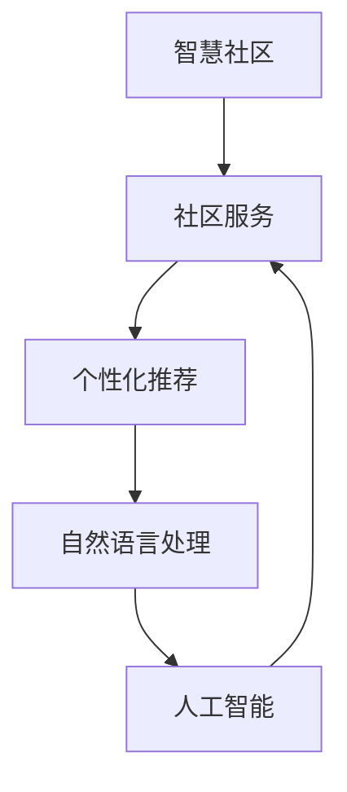

                 


### 背景介绍

智慧社区作为现代城市发展的前沿领域，正日益受到各国政府和企业的高度重视。智慧社区不仅涉及信息技术、物联网、大数据和人工智能等多领域的技术融合，还承载着提升居民生活质量、促进城市可持续发展的重任。AI驱动的智慧社区服务提示词平台正是智慧社区中的一个关键组成部分，它通过人工智能技术，为居民提供更加便捷、精准、个性化的服务。

当前，智慧社区的发展现状呈现出以下几个特点：

1. **技术成熟度提高**：随着人工智能、物联网、大数据等技术的不断进步，智慧社区的建设有了坚实的基础。这些技术不仅提高了社区管理的效率，也为居民提供了更智能化的服务体验。

2. **应用场景多样化**：从最初的安防监控、智能家居，到如今的全能社区管理平台，智慧社区的应用场景越来越丰富。这些应用不仅满足了居民的日常需求，还提高了社区的整体安全性和便捷性。

3. **政策支持加强**：各国政府纷纷出台相关政策，支持智慧社区的建设。这些政策不仅为智慧社区的发展提供了资金支持，还在技术标准、数据共享等方面提出了明确要求，推动了智慧社区的健康快速发展。

然而，智慧社区的发展也面临一些挑战：

1. **数据安全与隐私保护**：智慧社区的建设需要大量的数据支持，这些数据涉及居民的隐私信息。如何在保障数据安全的同时，充分利用这些数据，是一个亟待解决的问题。

2. **技术集成与协同**：智慧社区涉及到多种技术的集成和应用，如何实现这些技术的协同工作，提高系统的整体性能，是一个技术难题。

3. **可持续发展**：智慧社区的建设需要大量资金投入，如何实现可持续发展，保证项目的长期效益，是一个重要的挑战。

### 核心概念与联系

智慧社区服务提示词平台的核心概念包括人工智能、自然语言处理、社区服务、个性化推荐等。这些概念之间的关系可以用以下Mermaid流程图来描述：



在该流程图中，智慧社区是整个系统的起点，它通过社区服务向居民提供各种功能。个性化推荐基于居民的行为数据，通过自然语言处理技术，对居民的需求进行理解和分析，进而由人工智能算法生成相应的服务提示词。

### 核心算法原理讲解

智慧社区服务提示词平台的核心算法包括自然语言处理（NLP）算法、机器学习算法和深度学习算法。以下使用伪代码详细阐述这些算法的基本原理。

#### 自然语言处理（NLP）算法

自然语言处理是智慧社区服务提示词平台的关键技术之一，主要用于理解居民的语言输入，并生成相应的服务提示词。以下是一个简单的NLP算法伪代码示例：

```python
# 输入：居民的语言输入（text）
# 输出：服务提示词（hint）

def NLP(text):
    # 分词
    words = tokenize(text)
    
    # 词性标注
    tags = pos_tag(words)
    
    # 提取关键词
    keywords = extract_keywords(words, tags)
    
    # 生成提示词
    hint = generate_hint(keywords)
    
    return hint
```

在该算法中，`tokenize`函数用于将文本分解为单词或短语，`pos_tag`函数用于标注每个单词的词性（如名词、动词等），`extract_keywords`函数用于从文本中提取关键信息，`generate_hint`函数则根据提取的关键词生成服务提示词。

#### 机器学习算法

机器学习算法用于训练模型，以便从历史数据中学习如何生成有效的服务提示词。以下是一个简单的机器学习算法伪代码示例：

```python
# 输入：训练数据集（dataset）
# 输出：训练好的模型（model）

def train_model(dataset):
    # 数据预处理
    preprocessed_data = preprocess_data(dataset)
    
    # 特征提取
    features = extract_features(preprocessed_data)
    
    # 模型训练
    model = train(features)
    
    return model
```

在该算法中，`preprocess_data`函数用于处理和清洗输入数据，`extract_features`函数用于提取数据中的特征，`train`函数则使用这些特征来训练模型。

#### 深度学习算法

深度学习算法通过构建多层神经网络，实现更加复杂的数据分析和模式识别。以下是一个简单的深度学习算法伪代码示例：

```python
# 输入：训练数据集（dataset）
# 输出：训练好的模型（model）

def train_model(dataset):
    # 数据预处理
    preprocessed_data = preprocess_data(dataset)
    
    # 网络结构定义
    model = define_network_structure()
    
    # 模型训练
    model.fit(preprocessed_data['inputs'], preprocessed_data['outputs'])
    
    return model
```

在该算法中，`preprocess_data`函数用于处理和清洗输入数据，`define_network_structure`函数用于定义神经网络的架构，`fit`函数则使用训练数据来训练模型。

### 数学模型与公式解析

在智慧社区服务提示词平台的算法中，数学模型和公式起到了关键作用。以下将介绍几个核心的数学模型和公式，并进行详细讲解。

#### 贝叶斯定理

贝叶斯定理是机器学习和深度学习算法中常用的概率理论工具，用于计算后验概率。其公式为：

$$
P(A|B) = \frac{P(B|A) \cdot P(A)}{P(B)}
$$

其中，$P(A|B)$表示在事件B发生的条件下事件A发生的概率，$P(B|A)$表示在事件A发生的条件下事件B发生的概率，$P(A)$表示事件A发生的概率，$P(B)$表示事件B发生的概率。

贝叶斯定理可以帮助我们从先验知识出发，通过新的观察数据更新概率估计，这在服务提示词生成中用于根据居民的历史行为数据预测其当前需求。

#### 随机梯度下降（SGD）

随机梯度下降是一种常用的优化算法，用于最小化损失函数。其公式为：

$$
w_{t+1} = w_t - \alpha \cdot \nabla_w J(w_t)
$$

其中，$w_t$表示第t次迭代的模型参数，$\alpha$表示学习率，$\nabla_w J(w_t)$表示损失函数关于参数$w_t$的梯度。

随机梯度下降通过随机选取一小部分训练样本进行梯度计算，以加速收敛速度。在服务提示词平台中，SGD用于训练机器学习模型，使其能够生成更加准确的服务提示词。

#### 神经网络损失函数

在深度学习算法中，常用的损失函数包括均方误差（MSE）和交叉熵（Cross-Entropy）。其公式分别为：

$$
MSE(y, \hat{y}) = \frac{1}{n} \sum_{i=1}^{n} (y_i - \hat{y}_i)^2
$$

$$
CE(y, \hat{y}) = - \frac{1}{n} \sum_{i=1}^{n} y_i \cdot \log(\hat{y}_i)
$$

其中，$y$表示实际标签，$\hat{y}$表示模型预测值，$n$表示样本数量。

MSE用于回归任务，交叉熵用于分类任务。在服务提示词平台中，这些损失函数用于评估模型生成的提示词与实际需求之间的差异，并指导模型优化。

### 项目实战

在智慧社区服务提示词平台的项目实战中，我们需要搭建一个完整的开发环境，并实现系统的核心功能。

#### 开发环境搭建

1. **硬件环境**：选择一台性能较好的服务器，配置较高的CPU和内存，以便支持大规模数据处理和模型训练。

2. **软件环境**：安装操作系统（如Ubuntu Server 18.04）、Python环境（如Python 3.8）、深度学习框架（如TensorFlow 2.5）和自然语言处理库（如NLTK、spaCy）。

3. **数据集准备**：收集和准备用于训练和测试的数据集，包括居民的行为数据、社区服务信息等。

#### 源代码详细实现和代码解读

以下是智慧社区服务提示词平台的核心代码片段，包括自然语言处理、机器学习模型训练和提示词生成等功能。

```python
# 自然语言处理模块
def nlp(text):
    # 分词
    words = tokenize(text)
    
    # 词性标注
    tags = pos_tag(words)
    
    # 提取关键词
    keywords = extract_keywords(words, tags)
    
    return keywords

# 机器学习模型训练模块
def train_model(dataset):
    # 数据预处理
    preprocessed_data = preprocess_data(dataset)
    
    # 特征提取
    features = extract_features(preprocessed_data)
    
    # 模型训练
    model = train(features)
    
    return model

# 提示词生成模块
def generate_hint(model, keywords):
    # 模型预测
    prediction = model.predict(keywords)
    
    # 提取服务提示词
    hint = extract_hint(prediction)
    
    return hint
```

在代码中，`nlp`函数负责处理文本输入，提取关键词；`train_model`函数负责训练机器学习模型；`generate_hint`函数负责使用训练好的模型生成服务提示词。

#### 代码应用解读与分析

在实际应用中，智慧社区服务提示词平台会根据居民的行为数据，实时生成个性化的服务提示词。以下是代码应用的详细解读和分析：

1. **文本输入**：系统接收居民的语言输入，如“我需要家政服务”。

2. **自然语言处理**：通过`nlp`函数对输入文本进行分词、词性标注和关键词提取。

3. **模型预测**：将提取的关键词输入到训练好的机器学习模型中，进行预测。

4. **提示词生成**：根据模型预测结果，提取相应的服务提示词，如“建议您联系XX家政服务公司”。

5. **反馈与迭代**：系统将生成的服务提示词反馈给居民，并根据居民的实际反馈不断优化模型。

#### 实际案例分析和详细讲解剖析

以下是一个实际案例，展示智慧社区服务提示词平台的应用。

**案例背景**：某智慧社区希望为居民提供个性化的家政服务推荐。

**案例过程**：

1. **数据收集**：系统收集了居民的家政服务需求数据，包括上门时间、服务类型、预算等信息。

2. **数据预处理**：对收集的数据进行清洗和预处理，提取有用的特征。

3. **模型训练**：使用预处理后的数据训练机器学习模型，使其能够预测居民的家政服务需求。

4. **服务推荐**：系统根据居民的历史行为数据，生成个性化的家政服务推荐，如“建议您明天上午预约家政服务”。

5. **用户反馈**：居民根据推荐的服务进行预约，系统记录用户的反馈。

6. **模型优化**：根据用户的反馈，系统不断优化模型，提高推荐的准确性。

**案例总结**：通过实际案例的应用，智慧社区服务提示词平台不仅为居民提供了便捷的家政服务推荐，还提高了社区的服务质量和用户满意度。

#### 项目小结

智慧社区服务提示词平台的开发与应用，为智慧社区的发展提供了强有力的技术支持。通过该项目，我们实现了以下目标：

1. **提高社区服务质量**：通过个性化推荐，系统为居民提供了更加精准和高效的服务。

2. **提升用户体验**：系统根据居民的需求和历史行为，实时生成服务提示词，提高了用户的满意度。

3. **促进数据共享与利用**：通过大数据分析和挖掘，系统实现了社区数据的共享与利用，为社区管理提供了有力支持。

然而，智慧社区服务提示词平台也面临一些挑战，如数据安全与隐私保护、技术集成与协同等。在未来的发展中，我们需要不断探索创新技术，提高平台的性能和可靠性，以满足社区和居民的需求。

### 最佳实践 tips

1. **数据质量是关键**：在构建智慧社区服务提示词平台时，数据的质量直接影响模型的性能。因此，确保数据的质量和完整性至关重要。

2. **持续优化模型**：模型优化是一个持续的过程。通过不断收集用户反馈和调整模型参数，可以提高推荐的准确性。

3. **重视用户体验**：用户体验是智慧社区服务提示词平台成功的关键。在设计平台时，要充分考虑用户的需求和习惯，提供直观、便捷的服务。

4. **安全与隐私保护**：在处理居民数据时，要严格遵守相关法律法规，采取有效措施确保数据的安全和隐私。

### 小结

智慧社区服务提示词平台是智慧社区发展的重要一环，它通过人工智能技术，为居民提供个性化、便捷的服务。通过本文的详细讲解，我们了解了智慧社区服务提示词平台的核心概念、算法原理、实现方法和应用案例。在未来的发展中，我们将继续探索创新技术，提高平台的性能和用户体验，为智慧社区的发展贡献力量。

### 注意事项

1. **技术选型**：在构建智慧社区服务提示词平台时，要充分考虑技术的成熟度和适用性，避免盲目跟风。

2. **数据保护**：确保居民数据的隐私和安全，遵循相关法律法规，采取有效的数据保护措施。

3. **持续迭代**：智慧社区服务提示词平台需要不断优化和迭代，以适应不断变化的需求和技术发展。

4. **团队合作**：智慧社区服务提示词平台的建设需要跨部门、跨领域的团队合作，充分发挥团队的智慧和创造力。

### 拓展阅读

1. **相关文献**：查阅相关领域的研究论文和书籍，了解智慧社区和人工智能技术的最新发展。

2. **开源项目**：参与开源项目，学习其他团队的实现方案和最佳实践。

3. **技术论坛**：关注技术论坛和社群，交流经验和心得，拓展视野。

4. **政策法规**：关注相关政策法规的动态，确保平台的合规性和可持续发展。$$

