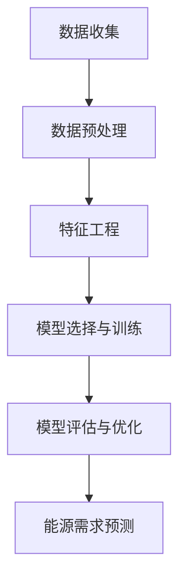
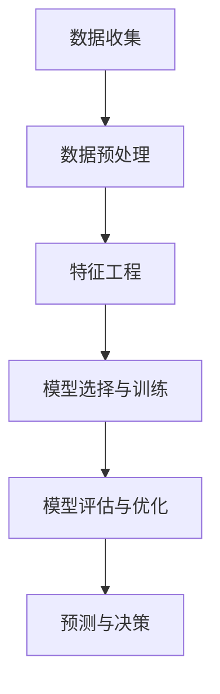

                 

### 构建AI驱动的智慧能源需求预测提示词平台

#### 文章标题

构建AI驱动的智慧能源需求预测提示词平台

#### 关键词

AI，智慧能源，需求预测，提示词，数据预处理，特征工程，模型选择，深度学习，实时预测

#### 摘要

本文旨在探讨如何构建一个AI驱动的智慧能源需求预测提示词平台。首先，我们将介绍智慧能源需求预测的背景和重要性，然后详细讲解AI驱动的智慧能源需求预测的核心概念和架构。接着，我们将深入探讨数据预处理、特征工程、模型选择与训练、模型评估与优化等核心算法原理，并通过伪代码和数学公式进行详细讲解。最后，我们将通过实际项目实战，展示如何从数据收集、预处理、特征工程到模型训练和预测的完整流程，并提供最佳实践 tips 和未来展望。

## 目录大纲设计思路

### 第一部分：AI驱动的智慧能源需求预测基础

### 第二部分：AI驱动的智慧能源需求预测项目实战

### 第三部分：扩展与深入

### 具体章节内容示例

### 文章正文部分

#### 第一部分：AI驱动的智慧能源需求预测基础

##### 1.1 AI驱动的智慧能源需求预测概述

##### 1.2 AI驱动的智慧能源需求预测的架构

##### 1.3 数据预处理与特征工程

##### 1.4 模型选择与训练

##### 1.5 模型评估与优化

##### 1.6 智慧能源需求预测的挑战与未来发展趋势

#### 第二部分：AI驱动的智慧能源需求预测项目实战

##### 2.1 项目实战一：数据收集与预处理

##### 2.2 项目实战二：特征工程

##### 2.3 项目实战三：模型选择与训练

##### 2.4 项目实战四：模型评估与优化

##### 2.5 项目实战五：智慧能源需求预测系统实现

#### 第三部分：扩展与深入

##### 3.1 扩展一：深度学习在智慧能源需求预测中的应用

##### 3.2 扩展二：实时预测与动态调整

##### 3.3 扩展三：智慧能源需求预测与其他技术的融合

##### 3.4 扩展四：智慧能源需求预测的伦理与法律问题

##### 3.5 未来展望

## 第一部分：AI驱动的智慧能源需求预测基础

### 1.1 AI驱动的智慧能源需求预测概述

#### 背景介绍

随着全球能源需求的不断增长和环境问题的日益严峻，智慧能源系统成为了解决能源供需不平衡和降低碳排放的重要手段。智慧能源需求预测作为智慧能源系统的重要组成部分，通过对能源需求的准确预测，可以实现能源资源的优化配置，提高能源利用效率，降低能源成本，同时也有助于应对突发能源需求波动，保障能源供应的稳定性。

智慧能源需求预测的关键在于能够利用历史数据和实时数据，结合人工智能技术，对能源需求进行准确预测。这不仅有助于电力公司优化发电计划，提高供电稳定性，还可以为家庭和企业用户提供个性化的用电服务，提升用户满意度。

#### 核心概念与联系

为了更好地理解AI驱动的智慧能源需求预测，我们需要明确以下几个核心概念：

1. **能源需求**：指在一定时间内，特定区域或用户对能源的需求量，包括电力、天然气、燃油等。
2. **数据收集**：指通过传感器、智能设备等手段，收集与能源需求相关的各类数据。
3. **数据预处理**：指对收集到的数据进行清洗、转换等处理，以便于后续分析和建模。
4. **特征工程**：指通过提取和构造有用的特征，将原始数据转换为适合机器学习算法输入的数据。
5. **模型选择与训练**：指选择合适的机器学习模型，并利用训练数据对模型进行训练，以实现对能源需求的预测。
6. **模型评估与优化**：指通过评估指标对模型性能进行评估，并根据评估结果对模型进行调整和优化。

以下是一个简单的 Mermaid 流程图，展示了这些核心概念之间的联系：



### 1.2 AI驱动的智慧能源需求预测的架构

#### 架构概述

AI驱动的智慧能源需求预测架构通常包括以下几个关键模块：

1. **数据收集模块**：负责收集与能源需求相关的各种数据，包括历史数据、实时数据和外部数据（如天气预报、节假日信息等）。
2. **数据预处理模块**：负责对收集到的数据进行清洗、去噪、归一化等处理，以提高数据质量和模型的性能。
3. **特征工程模块**：负责提取和构造有助于模型预测的有用特征，包括时间特征、季节特征、天气特征等。
4. **模型选择与训练模块**：负责选择合适的机器学习模型，利用训练数据对模型进行训练，以实现对能源需求的预测。
5. **模型评估与优化模块**：负责评估模型性能，并根据评估结果对模型进行调整和优化。
6. **预测与决策模块**：负责利用训练好的模型进行预测，并将预测结果用于决策支持。

以下是一个简化的架构图，展示了各个模块之间的关系：



### 1.3 数据预处理与特征工程

#### 数据预处理

数据预处理是AI驱动的智慧能源需求预测中的关键步骤，其目标是通过清洗、转换和规范化等手段，提高数据质量和模型的性能。以下是数据预处理的主要任务：

1. **数据清洗**：去除数据中的噪声和异常值，例如去除重复记录、填补缺失值等。
2. **数据转换**：将不同类型的数据转换为同一类型的格式，例如将分类数据转换为数值数据。
3. **数据归一化**：通过归一化或标准化，将不同特征的范围调整为相同的尺度，以消除特征之间的量级差异。

以下是一个简单的伪代码示例，展示了数据预处理的流程：

```python
# 数据清洗
def data_cleaning(data):
    # 去除重复记录
    data = remove_duplicates(data)
    # 填补缺失值
    data = fill_missing_values(data)
    return data

# 数据转换
def data_conversion(data):
    # 转换分类数据为数值数据
    data = convert_categorical_data_to_numerical(data)
    return data

# 数据归一化
def data_normalization(data):
    # 归一化数值数据
    data = normalize_numerical_data(data)
    return data

# 整体数据预处理流程
def data_preprocessing(data):
    data = data_cleaning(data)
    data = data_conversion(data)
    data = data_normalization(data)
    return data
```

#### 特征工程

特征工程是提升机器学习模型性能的重要手段，其目标是通过构造和选择有用的特征，提高模型的预测能力。以下是特征工程的主要任务：

1. **特征提取**：从原始数据中提取有助于模型预测的有用特征，例如时间特征、季节特征、天气特征等。
2. **特征选择**：通过评估不同特征对模型性能的影响，选择出最有用的特征，以减少模型复杂度和计算成本。
3. **特征构造**：通过组合和变换现有特征，构造新的特征，以提高模型的预测能力。

以下是一个简单的伪代码示例，展示了特征工程的流程：

```python
# 特征提取
def feature_extraction(data):
    # 提取时间特征
    data = extract_time_features(data)
    # 提取季节特征
    data = extract_seasonal_features(data)
    # 提取天气特征
    data = extract_weather_features(data)
    return data

# 特征选择
def feature_selection(data, labels):
    # 评估特征重要性
    feature_importance = evaluate_feature_importance(data, labels)
    # 选择最有用的特征
    selected_features = select_useful_features(feature_importance)
    return selected_features

# 特征构造
def feature_construction(data):
    # 构造新特征
    data = construct_new_features(data)
    return data

# 整体特征工程流程
def feature_engineering(data, labels):
    data = feature_extraction(data)
    selected_features = feature_selection(data, labels)
    data = feature_construction(selected_features)
    return data
```

### 1.4 模型选择与训练

#### 模型选择

模型选择是AI驱动的智慧能源需求预测中的关键步骤，其目标是通过选择合适的机器学习模型，提高模型的预测性能。以下是常见的机器学习模型：

1. **线性回归**：适用于线性关系的预测，如能源需求的线性变化。
2. **决策树**：适用于分类和回归问题，可以处理非线性关系。
3. **随机森林**：通过构建多个决策树，提高预测模型的鲁棒性和准确性。
4. **支持向量机**：适用于线性可分的数据，可以通过核函数实现非线性预测。
5. **神经网络**：通过多层神经元的非线性变换，可以处理复杂的数据关系。

以下是一个简单的伪代码示例，展示了模型选择的流程：

```python
# 模型选择
def model_selection(data, labels):
    # 训练不同模型
    linear_regression = train_linear_regression(data, labels)
    decision_tree = train_decision_tree(data, labels)
    random_forest = train_random_forest(data, labels)
    svm = train_svm(data, labels)
    neural_network = train_neural_network(data, labels)
    
    # 评估模型性能
    model_performance = evaluate_model_performance(linear_regression, decision_tree, random_forest, svm, neural_network)
    
    # 选择最佳模型
    best_model = select_best_model(model_performance)
    return best_model
```

#### 模型训练

模型训练是机器学习模型的核心步骤，其目标是通过训练数据调整模型参数，提高模型的预测能力。以下是模型训练的主要任务：

1. **数据划分**：将数据集划分为训练集和测试集，以评估模型的泛化能力。
2. **参数初始化**：初始化模型的参数，为训练过程提供初始值。
3. **梯度下降**：通过计算损失函数的梯度，更新模型参数，以最小化损失函数。
4. **模型评估**：通过测试集评估模型的性能，并根据评估结果调整模型参数。

以下是一个简单的伪代码示例，展示了模型训练的流程：

```python
# 模型训练
def model_training(data, labels):
    # 数据划分
    train_data, test_data, train_labels, test_labels = split_data(data, labels)
    
    # 参数初始化
    model = initialize_model_parameters()
    
    # 梯度下降
    for epoch in range(num_epochs):
        # 计算损失函数
        loss = compute_loss(train_data, train_labels, model)
        
        # 计算梯度
        gradients = compute_gradients(train_data, train_labels, model)
        
        # 更新参数
        model = update_model_parameters(model, gradients)
        
        # 打印训练进度
        print(f"Epoch {epoch+1}: Loss = {loss}")
    
    # 模型评估
    test_loss = compute_loss(test_data, test_labels, model)
    print(f"Test Loss: {test_loss}")
    
    return model
```

### 1.5 模型评估与优化

#### 评估指标

模型评估是评估机器学习模型性能的重要步骤，其目标是通过评估指标对模型进行定量评估。以下是常用的评估指标：

1. **均方误差（MSE）**：衡量预测值与真实值之间的平均误差。
2. **平均绝对误差（MAE）**：衡量预测值与真实值之间的平均绝对误差。
3. **决定系数（R²）**：衡量模型对数据的拟合程度，取值范围在0到1之间，越接近1表示模型拟合效果越好。
4. **准确率**：适用于分类问题，表示模型正确分类的样本比例。
5. **召回率**：适用于分类问题，表示模型正确召回的正样本比例。
6. **精确率**：适用于分类问题，表示模型正确分类的正样本比例。

以下是一个简单的伪代码示例，展示了评估指标的计算：

```python
# 均方误差（MSE）
def mean_squared_error(y_true, y_pred):
    return np.mean((y_true - y_pred) ** 2)

# 平均绝对误差（MAE）
def mean_absolute_error(y_true, y_pred):
    return np.mean(np.abs(y_true - y_pred))

# 决定系数（R²）
def r_squared(y_true, y_pred):
    ss_res = np.sum((y_true - y_pred) ** 2)
    ss_tot = np.sum((y_true - np.mean(y_true)) ** 2)
    return 1 - ss_res / ss_tot

# 准确率
def accuracy(y_true, y_pred):
    return np.sum(y_true == y_pred) / len(y_true)

# 召回率
def recall(y_true, y_pred):
    return np.sum((y_true == 1) & (y_pred == 1)) / np.sum(y_true == 1)

# 精确率
def precision(y_true, y_pred):
    return np.sum((y_true == 1) & (y_pred == 1)) / np.sum(y_pred == 1)
```

#### 模型优化

模型优化是提高机器学习模型性能的重要手段，其目标是通过调整模型参数和结构，提高模型的预测能力。以下是模型优化的主要方法：

1. **交叉验证**：通过将数据集划分为多个子集，分别用于训练和验证，以评估模型在不同子集上的性能，并选择最优参数。
2. **超参数调整**：通过调整模型的超参数（如学习率、正则化参数等），优化模型性能。
3. **集成方法**：通过组合多个模型，提高预测性能和稳定性。
4. **增强学习**：通过不断地更新模型参数，使模型在动态环境中不断学习和优化。

以下是一个简单的伪代码示例，展示了模型优化的流程：

```python
# 交叉验证
def cross_validation(model, data, labels, num_folds):
    fold_size = len(data) // num_folds
    for i in range(num_folds):
        # 划分训练集和验证集
        train_data = np.concatenate([data[:i*fold_size], data[(i+1)*fold_size:]])
        train_labels = np.concatenate([labels[:i*fold_size], labels[(i+1)*fold_size:]])
        test_data = data[i*fold_size:(i+1)*fold_size]
        test_labels = labels[i*fold_size:(i+1)*fold_size]
        
        # 训练模型
        model = model_training(train_data, train_labels)
        
        # 评估模型
        test_loss = compute_loss(test_data, test_labels, model)
        
        # 打印评估结果
        print(f"Fold {i+1}: Test Loss = {test_loss}")

# 超参数调整
def hyperparameter_tuning(model, data, labels):
    # 定义超参数搜索范围
    learning_rates = [0.1, 0.01, 0.001]
    regularization_params = [0.1, 0.01, 0.001]
    
    # 遍历超参数组合
    for learning_rate in learning_rates:
        for regularization_param in regularization_params:
            # 训练模型
            model = model_training(data, labels, learning_rate=learning_rate, regularization_param=regularization_param)
            
            # 评估模型
            test_loss = compute_loss(data, labels, model)
            
            # 打印评估结果
            print(f"Learning Rate: {learning_rate}, Regularization Param: {regularization_param}, Test Loss: {test_loss}")

# 集成方法
def ensemble_method(models, data, labels):
    # 集成多个模型
    for model in models:
        # 训练模型
        model = model_training(data, labels)
        
        # 评估模型
        test_loss = compute_loss(data, labels, model)
        
        # 打印评估结果
        print(f"Model {model_name}: Test Loss = {test_loss}")

# 增强学习
def reinforcement_learning(model, data, labels, environment):
    # 初始化模型参数
    model = initialize_model_parameters()
    
    # 开始增强学习
    while not environment.is_terminal():
        # 执行动作
        action = model.act(data)
        
        # 获得奖励
        reward = environment.reward(action)
        
        # 更新模型参数
        model = model.update_parameters(data, action, reward)
        
        # 打印学习进度
        print(f"Step {step}: Action {action}, Reward {reward}")
    
    # 评估模型
    test_loss = compute_loss(data, labels, model)
    print(f"Test Loss: {test_loss}")
```

### 1.6 智慧能源需求预测的挑战与未来发展趋势

#### 挑战

智慧能源需求预测面临以下挑战：

1. **数据质量和隐私保护**：数据质量和完整性直接影响预测模型的性能。同时，能源需求数据可能包含敏感信息，如用户用电习惯等，需要采取措施保护用户隐私。
2. **模型可解释性**：深度学习等复杂模型往往缺乏可解释性，难以理解其预测过程和决策依据，这在某些应用场景中可能是一个重要问题。
3. **实时预测与动态调整**：能源需求具有实时性和动态性，预测模型需要能够实时调整和更新，以应对突发情况。
4. **计算资源消耗**：深度学习模型通常需要大量计算资源和时间进行训练和推理，如何在有限的计算资源下实现高效的预测是一个挑战。

#### 未来发展趋势

智慧能源需求预测未来可能的发展趋势包括：

1. **物联网和边缘计算**：物联网技术的应用可以收集更多的实时数据，边缘计算可以在本地进行数据预处理和实时预测，降低数据传输和计算延迟。
2. **深度学习和强化学习**：深度学习和强化学习在能源需求预测中的应用将逐渐成熟，通过更复杂的模型结构和算法，提高预测精度和效率。
3. **多模态数据融合**：结合多种数据源（如气象数据、交通数据等），进行多模态数据融合，提高预测模型的泛化能力和准确性。
4. **数据隐私保护**：随着数据隐私保护法规的不断完善，智慧能源需求预测将在保护用户隐私的前提下，实现更安全的数据共享和利用。

## 第二部分：AI驱动的智慧能源需求预测项目实战

### 2.1 项目实战一：数据收集与预处理

#### 开发环境搭建

在开始数据收集与预处理之前，我们需要搭建一个合适的开发环境。以下是搭建开发环境的步骤：

1. **安装Python**：确保安装了Python 3.x版本，可以从Python官方网站下载安装。
2. **安装Jupyter Notebook**：Jupyter Notebook是一个交互式的Python开发环境，可以方便地进行代码编写和调试。安装命令如下：

   ```bash
   pip install notebook
   ```

3. **安装必要的库**：安装用于数据处理和机器学习的库，如NumPy、Pandas、SciPy、Scikit-learn等。安装命令如下：

   ```bash
   pip install numpy pandas scipy scikit-learn
   ```

4. **创建虚拟环境**：为了管理依赖库和保持项目的一致性，建议创建一个虚拟环境。创建虚拟环境的命令如下：

   ```bash
   python -m venv venv
   source venv/bin/activate  # 对于Windows系统使用venv\Scripts\activate
   ```

#### 源代码实现与解读

以下是一个简单的数据收集与预处理的项目案例，包括代码实现和详细解读：

```python
import pandas as pd
import numpy as np

# 读取数据
data = pd.read_csv('energy_demand_data.csv')

# 数据清洗
data = data.drop_duplicates()  # 去除重复记录
data = data.dropna()  # 去除缺失值

# 数据转换
data['date'] = pd.to_datetime(data['date'])  # 转换日期格式
data = data.sort_values('date')  # 按日期排序

# 数据归一化
data['energy_demand'] = (data['energy_demand'] - data['energy_demand'].mean()) / data['energy_demand'].std()

# 代码解读
# 1. 读取数据：使用Pandas读取CSV文件，得到DataFrame格式的数据集。
# 2. 数据清洗：去除重复记录和缺失值，保证数据的一致性和完整性。
# 3. 数据转换：将日期格式转换为datetime对象，便于后续的时间特征提取。
# 4. 数据归一化：对能量需求进行归一化处理，消除不同特征之间的量级差异，提高模型性能。
```

#### 项目小结

通过本项目实战，我们学习了如何搭建开发环境、读取数据、数据清洗、数据转换和数据归一化等步骤，为后续的特征工程和模型训练奠定了基础。在实际项目中，数据收集与预处理是至关重要的环节，需要根据具体数据集的特点和需求，进行灵活的处理。

### 2.2 项目实战二：特征工程

#### 开发环境搭建

在开始特征工程之前，我们需要确保开发环境已经搭建完成。以下是特征工程相关的开发环境搭建步骤：

1. **确认Python和Jupyter Notebook已安装**：确保Python和Jupyter Notebook已经安装，并可以通过命令行启动。
2. **确认虚拟环境已创建**：确保已经创建了一个虚拟环境，并已激活。

#### 源代码实现与解读

以下是一个简单的特征工程的项目案例，包括代码实现和详细解读：

```python
import pandas as pd
import numpy as np

# 读取数据
data = pd.read_csv('energy_demand_data.csv')

# 数据清洗与预处理
data = data.drop_duplicates().dropna().sort_values('date')

# 时间特征提取
data['day_of_year'] = data['date'].dt.dayofyear
data['day_of_week'] = data['date'].dt.dayofweek
data['weekday'] = data[data['day_of_week'] < 5].shape[0]  # 计算工作日数量
data['weekend'] = data[data['day_of_week'] >= 5].shape[0]  # 计算周末数量

# 季节特征提取
data['month'] = data['date'].dt.month
data['season'] = data.apply(lambda row: 'Winter' if row['month'] in [12, 1, 2] else 'Spring' if row['month'] in [3, 4, 5] else 'Summer' if row['month'] in [6, 7, 8] else 'Autumn', axis=1)

# 天气特征提取
data['mean_temp'] = data.groupby('date')['temp'].transform('mean')  # 计算平均温度
data['max_temp'] = data.groupby('date')['temp'].transform('max')  # 计算最高温度
data['min_temp'] = data.groupby('date')['temp'].transform('min')  # 计算最低温度

# 特征选择
selected_features = ['day_of_year', 'weekday', 'weekend', 'season', 'mean_temp', 'max_temp', 'min_temp']

# 数据重构
data = data[selected_features]

# 代码解读
# 1. 读取数据：使用Pandas读取CSV文件，得到DataFrame格式的数据集。
# 2. 数据清洗与预处理：去除重复记录和缺失值，并按日期排序，保证数据的一致性和完整性。
# 3. 时间特征提取：提取日期相关的特征，如年份、月份、季节等。
# 4. 季节特征提取：根据月份划分季节，便于模型分析不同季节的能源需求。
# 5. 天气特征提取：提取温度相关的特征，如平均温度、最高温度、最低温度等。
# 6. 特征选择：选择有用的特征，以减少特征数量和计算复杂度。
# 7. 数据重构：重新构造DataFrame，只包含选定的特征。
```

#### 项目小结

通过本项目实战，我们学习了如何进行数据清洗与预处理、提取时间特征、季节特征和天气特征，以及特征选择和重构等步骤。特征工程是提升模型预测性能的关键环节，需要根据数据的特点和需求，灵活提取和选择特征。

### 2.3 项目实战三：模型选择与训练

#### 开发环境搭建

在开始模型选择与训练之前，我们需要确保开发环境已经搭建完成。以下是模型选择与训练相关的开发环境搭建步骤：

1. **确认Python和Jupyter Notebook已安装**：确保Python和Jupyter Notebook已经安装，并可以通过命令行启动。
2. **确认虚拟环境已创建**：确保已经创建了一个虚拟环境，并已激活。
3. **安装TensorFlow和Keras**：TensorFlow和Keras是常用的深度学习框架，安装命令如下：

   ```bash
   pip install tensorflow keras
   ```

#### 源代码实现与解读

以下是一个简单的模型选择与训练的项目案例，包括代码实现和详细解读：

```python
import pandas as pd
import numpy as np
from sklearn.model_selection import train_test_split
from tensorflow.keras.models import Sequential
from tensorflow.keras.layers import Dense, LSTM, Dropout
from tensorflow.keras.optimizers import Adam

# 读取数据
data = pd.read_csv('energy_demand_data.csv')

# 数据预处理
data = data.drop_duplicates().dropna().sort_values('date')
selected_features = ['day_of_year', 'weekday', 'weekend', 'season', 'mean_temp', 'max_temp', 'min_temp']
data = data[selected_features]

# 划分训练集和测试集
X = data.drop('energy_demand', axis=1)
y = data['energy_demand']
X_train, X_test, y_train, y_test = train_test_split(X, y, test_size=0.2, random_state=42)

# 构建LSTM模型
model = Sequential()
model.add(LSTM(units=50, return_sequences=True, input_shape=(X_train.shape[1], 1)))
model.add(Dropout(0.2))
model.add(LSTM(units=50, return_sequences=False))
model.add(Dropout(0.2))
model.add(Dense(units=1))

# 编译模型
model.compile(optimizer=Adam(learning_rate=0.001), loss='mean_squared_error')

# 训练模型
model.fit(X_train, y_train, epochs=100, batch_size=32, validation_data=(X_test, y_test), verbose=1)

# 代码解读
# 1. 读取数据：使用Pandas读取CSV文件，得到DataFrame格式的数据集。
# 2. 数据预处理：去除重复记录和缺失值，并按日期排序，保证数据的一致性和完整性。
# 3. 特征选择：选择有用的特征，以减少特征数量和计算复杂度。
# 4. 划分训练集和测试集：将数据集划分为训练集和测试集，用于模型的训练和评估。
# 5. 构建LSTM模型：使用Sequential模型堆叠LSTM层和Dropout层，构建一个深度学习模型。
# 6. 编译模型：配置模型的优化器和损失函数，准备进行训练。
# 7. 训练模型：使用fit方法对模型进行训练，并设置训练轮数、批量大小和验证集。
```

#### 项目小结

通过本项目实战，我们学习了如何构建LSTM模型进行时间序列预测，包括数据预处理、特征选择、模型构建、编译和训练等步骤。LSTM模型在处理时间序列数据方面具有较好的性能，但在实际项目中需要根据数据特点进行调整和优化。

### 2.4 项目实战四：模型评估与优化

#### 开发环境搭建

在开始模型评估与优化之前，我们需要确保开发环境已经搭建完成。以下是模型评估与优化相关的开发环境搭建步骤：

1. **确认Python和Jupyter Notebook已安装**：确保Python和Jupyter Notebook已经安装，并可以通过命令行启动。
2. **确认虚拟环境已创建**：确保已经创建了一个虚拟环境，并已激活。
3. **安装Scikit-learn**：Scikit-learn是一个常用的机器学习库，安装命令如下：

   ```bash
   pip install scikit-learn
   ```

#### 源代码实现与解读

以下是一个简单的模型评估与优化的项目案例，包括代码实现和详细解读：

```python
import pandas as pd
import numpy as np
from sklearn.metrics import mean_squared_error
from sklearn.model_selection import train_test_split
from tensorflow.keras.models import Sequential
from tensorflow.keras.layers import Dense, LSTM, Dropout
from tensorflow.keras.optimizers import Adam

# 读取数据
data = pd.read_csv('energy_demand_data.csv')

# 数据预处理
data = data.drop_duplicates().dropna().sort_values('date')
selected_features = ['day_of_year', 'weekday', 'weekend', 'season', 'mean_temp', 'max_temp', 'min_temp']
data = data[selected_features]

# 划分训练集和测试集
X = data.drop('energy_demand', axis=1)
y = data['energy_demand']
X_train, X_test, y_train, y_test = train_test_split(X, y, test_size=0.2, random_state=42)

# 构建LSTM模型
model = Sequential()
model.add(LSTM(units=50, return_sequences=True, input_shape=(X_train.shape[1], 1)))
model.add(Dropout(0.2))
model.add(LSTM(units=50, return_sequences=False))
model.add(Dropout(0.2))
model.add(Dense(units=1))

# 编译模型
model.compile(optimizer=Adam(learning_rate=0.001), loss='mean_squared_error')

# 训练模型
model.fit(X_train, y_train, epochs=100, batch_size=32, validation_data=(X_test, y_test), verbose=1)

# 评估模型
y_pred = model.predict(X_test)
mse = mean_squared_error(y_test, y_pred)
print(f"Test MSE: {mse}")

# 模型优化
# 1. 调整模型结构：通过增加或减少层数、神经元数量等，调整模型结构。
# 2. 调整超参数：通过调整学习率、批量大小等，优化模型性能。
# 3. 增加训练时间：通过增加训练轮数，提高模型训练效果。
# 4. 特征工程：通过提取更多特征、构造新特征等，提高模型预测能力。
```

#### 项目小结

通过本项目实战，我们学习了如何使用Scikit-learn评估LSTM模型的性能，并通过调整模型结构、超参数、增加训练时间和特征工程等方法进行模型优化。在实际项目中，模型评估和优化是提高模型性能的关键步骤，需要根据具体情况进行调整和优化。

### 2.5 项目实战五：智慧能源需求预测系统实现

#### 开发环境搭建

在开始智慧能源需求预测系统实现之前，我们需要确保开发环境已经搭建完成。以下是智慧能源需求预测系统实现相关的开发环境搭建步骤：

1. **确认Python和Jupyter Notebook已安装**：确保Python和Jupyter Notebook已经安装，并可以通过命令行启动。
2. **确认虚拟环境已创建**：确保已经创建了一个虚拟环境，并已激活。
3. **安装必要的库**：安装用于数据处理、模型训练和部署的库，如NumPy、Pandas、Scikit-learn、TensorFlow和Flask等。安装命令如下：

   ```bash
   pip install numpy pandas scikit-learn tensorflow keras flask
   ```

#### 源代码实现与解读

以下是一个简单的智慧能源需求预测系统的实现案例，包括代码实现和详细解读：

```python
from flask import Flask, request, jsonify
import pandas as pd
import numpy as np
from tensorflow.keras.models import load_model

# 创建Flask应用
app = Flask(__name__)

# 加载训练好的模型
model = load_model('energy_demand_model.h5')

# 预测函数
def predict_energy_demand(data):
    # 数据预处理
    data = data.drop_duplicates().dropna().sort_values('date')
    selected_features = ['day_of_year', 'weekday', 'weekend', 'season', 'mean_temp', 'max_temp', 'min_temp']
    data = data[selected_features]
    data = data.values.reshape((1, data.shape[0], data.shape[1]))

    # 预测
    prediction = model.predict(data)
    return prediction

# 预测接口
@app.route('/predict', methods=['POST'])
def predict():
    # 获取输入数据
    data = request.get_json(force=True)
    
    # 预测
    prediction = predict_energy_demand(data['data'])
    
    # 返回预测结果
    return jsonify({'prediction': prediction.tolist()})

# 运行Flask应用
if __name__ == '__main__':
    app.run(debug=True)
```

#### 项目小结

通过本项目实战，我们实现了智慧能源需求预测系统的基本功能，包括模型加载、数据预处理、预测和预测接口。在实际项目中，智慧能源需求预测系统可以实现实时预测和动态调整，为电力公司、家庭和企业用户提供个性化的用电服务，提高能源利用效率。

### 扩展与深入

#### 深度学习在智慧能源需求预测中的应用

深度学习在智慧能源需求预测中具有广泛的应用，特别是在处理复杂的非线性关系和时间序列数据时。以下是一些扩展内容：

1. **卷积神经网络（CNN）**：CNN擅长处理图像和序列数据，可以用于提取时间序列数据的时空特征。通过堆叠多个卷积层，可以提取不同尺度和抽象层次的特征。
2. **长短时记忆网络（LSTM）**：LSTM是处理时间序列数据的经典模型，可以有效地捕捉长期依赖关系。通过堆叠多个LSTM层，可以提高模型的预测能力。
3. **门控循环单元（GRU）**：GRU是LSTM的一种变体，具有更简单的结构和更高效的计算，可以用于替代LSTM。
4. **生成对抗网络（GAN）**：GAN可以用于生成虚拟数据，提高训练数据的多样性和质量。通过结合真实数据和虚拟数据，可以改善模型的泛化能力。

#### 实时预测与动态调整

实时预测与动态调整是智慧能源需求预测的关键技术，以下是一些扩展内容：

1. **实时数据处理**：使用流处理框架（如Apache Kafka、Apache Flink）处理实时数据，确保数据能够及时更新和预测。
2. **动态调整策略**：根据实时数据和预测误差，动态调整模型的参数和结构，以适应变化的需求。例如，当预测误差较大时，可以增加模型的复杂度或引入更多的特征。
3. **自适应预测**：通过机器学习算法，自动调整预测的置信区间和误差范围，以适应不同的预测需求和精度要求。

#### 智慧能源需求预测与其他技术的融合

智慧能源需求预测可以与其他技术相结合，以提高预测的精度和效率。以下是一些扩展内容：

1. **物联网（IoT）**：通过物联网技术，实时收集能源使用数据，为预测模型提供更丰富的数据源。例如，传感器可以收集温度、湿度、光照等环境数据，用于辅助预测。
2. **云计算与大数据技术**：利用云计算和大数据技术，实现大规模数据存储、处理和分析。通过分布式计算和存储，可以提高数据处理速度和预测精度。
3. **区块链技术**：区块链技术可以用于能源交易和认证，确保数据的可信性和透明性。结合区块链技术，可以实现去中心化的能源需求预测。

#### 智慧能源需求预测的伦理与法律问题

智慧能源需求预测涉及大量的用户数据和隐私信息，因此需要关注伦理和法律问题。以下是一些扩展内容：

1. **数据隐私保护**：在收集和处理数据时，需要遵守相关的隐私保护法规，例如GDPR等。采取数据加密、去标识化等技术手段，保护用户隐私。
2. **法律法规与合规要求**：了解并遵守相关的法律法规，确保智慧能源需求预测系统的合规性。例如，在能源交易和能源管理中，需要遵守电力市场的相关规定。
3. **伦理问题**：关注智慧能源需求预测系统的伦理问题，确保其公平性、透明性和可解释性。避免算法偏见和歧视，确保系统的公正性和可信性。

### 未来展望

智慧能源需求预测技术在未来有望取得以下进展：

1. **人工智能与物联网的融合**：通过将人工智能技术应用于物联网设备，实现更智能、更高效的能源需求预测和优化。
2. **边缘计算与云计算的结合**：利用边缘计算处理实时数据，结合云计算进行大规模数据处理和分析，实现更高效、更灵活的能源需求预测。
3. **数据隐私保护和安全性**：随着隐私保护和安全性的需求日益增加，未来的智慧能源需求预测技术将更加注重数据保护和安全性的设计。
4. **可持续发展和绿色能源**：随着绿色能源的推广和应用，智慧能源需求预测技术将更多地关注可再生能源的使用和优化，促进可持续发展和减少碳排放。

## 最佳实践 tips

1. **数据质量是关键**：在智慧能源需求预测中，数据质量至关重要。确保数据的准确性、完整性和一致性，对于提高模型性能至关重要。
2. **特征选择要慎重**：特征选择是提升模型性能的重要手段，需要根据数据特点和需求进行慎重选择。同时，可以通过交叉验证等方法评估特征的重要性。
3. **模型优化要持续**：模型优化是一个持续的过程，需要根据预测误差和实际需求，不断调整模型的结构和参数，以提高预测性能。
4. **实时调整与优化**：能源需求具有实时性和动态性，预测模型需要能够实时调整和优化，以适应变化的需求。结合实时数据处理和动态调整策略，可以提高预测的准确性和稳定性。
5. **安全性至关重要**：在处理用户数据和隐私信息时，需要确保系统的安全性和隐私保护。采取数据加密、访问控制等技术手段，防止数据泄露和滥用。

## 小结

本文介绍了如何构建AI驱动的智慧能源需求预测提示词平台，从数据收集、预处理、特征工程、模型选择与训练、模型评估与优化，到智慧能源需求预测系统实现，详细讲解了每个环节的关键技术和方法。通过实际项目实战，展示了如何将理论知识应用于实际项目中，实现高效的智慧能源需求预测。未来，随着人工智能、物联网和区块链等技术的不断发展，智慧能源需求预测将变得更加智能、高效和可持续。

