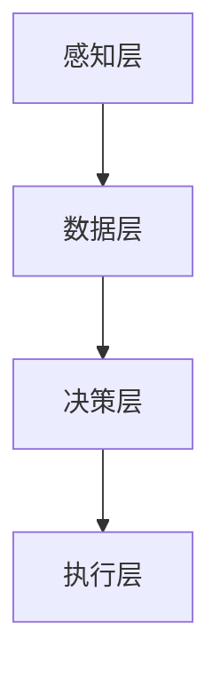

                 

### 文章标题：构建AI驱动的智能制造提示词系统

> 关键词：人工智能、智能制造、提示词系统、核心算法、数学模型、项目实战

> 摘要：本文旨在探讨如何构建AI驱动的智能制造提示词系统，通过详细分析核心概念、算法原理、数学模型，以及实际项目案例，帮助读者深入了解并掌握这一前沿技术。

### 引言

在当今制造业中，人工智能（AI）已经成为推动产业升级和效率提升的重要力量。AI驱动的智能制造通过整合感知、决策和执行等环节，实现了生产过程的智能化和自动化。而提示词系统作为自然语言处理（NLP）的一个重要分支，其在智能制造中的应用也越来越广泛。本文将详细探讨如何构建一个AI驱动的智能制造提示词系统，通过核心概念、算法原理、数学模型以及项目实战等多个方面，为读者提供全面的技术指导。

### 第一部分: AI驱动的智能制造提示词系统概述

#### 第1章: AI驱动的智能制造提示词系统基础

##### 1.1 AI驱动的智能制造与提示词系统

###### 1.1.1 智能制造概述

智能制造是一种基于人工智能技术的生产方式，通过集成物联网（IoT）、大数据分析、云计算等技术，实现制造过程的自动化、智能化和灵活化。智能制造的目标是通过优化生产流程，提高生产效率，降低生产成本，提升产品质量，从而增强企业的竞争力。

- **定义**：智能制造是一种将人工智能技术应用于制造过程的新型生产方式。
- **趋势**：随着物联网、大数据和云计算等技术的不断发展，智能制造已成为制造业转型升级的重要方向。全球范围内的制造业巨头都在积极推进智能制造，以提高生产效率和市场竞争力。

###### 1.1.2 提示词系统的概念

提示词系统是一种基于自然语言处理（NLP）的技术，用于生成文本摘要或回答用户的问题。在智能制造中，提示词系统可以用于生产过程的实时监控、设备故障诊断、工艺优化等方面，帮助企业实现更加高效、精准的生产管理。

- **定义**：提示词系统是一种通过自然语言处理技术生成文本摘要或回答问题的系统。
- **应用**：在智能制造中，提示词系统可以用于：
  - **实时监控**：生成设备运行状态、生产进度等信息的摘要，帮助企业实时掌握生产情况。
  - **设备故障诊断**：通过分析设备运行数据，生成故障诊断报告，帮助工程师快速定位故障原因。
  - **工艺优化**：基于生产数据，生成工艺优化建议，提高生产效率和产品质量。

##### 1.2 AI驱动的智能制造提示词系统架构

AI驱动的智能制造提示词系统通常包括感知层、数据层、决策层和执行层等四个层次。每个层次都有其特定的功能，共同构成了一个完整的提示词系统架构。

###### 1.2.1 系统架构概述

- **感知层**：通过传感器、摄像头等设备收集生产数据，如温度、湿度、设备状态、生产进度等。
- **数据层**：对感知层收集的数据进行存储、清洗、预处理等操作，为后续分析提供高质量的数据。
- **决策层**：利用机器学习、深度学习等技术对数据进行分析，生成提示词，如设备故障诊断报告、工艺优化建议等。
- **执行层**：根据提示词执行相应的操作，如调整设备参数、优化生产流程等。

###### 1.2.2 Mermaid流程图



#### 第2章: 核心算法原理讲解

##### 2.1 提示词生成算法

提示词生成算法是AI驱动的智能制造提示词系统的核心，其目的是从大量的生产数据中提取关键信息，生成具有指导意义的文本摘要。

###### 2.1.1 伪代码

```python
def generate_prompt(words):
    # 初始化提示词
    prompt = ""

    # 对单词进行排序
    sorted_words = sorted(words, key=lambda w: word_frequency[w], reverse=True)

    # 生成提示词
    for word in sorted_words:
        prompt += " " + word

    return prompt
```

###### 2.1.2 算法原理

- **词频统计**：首先对输入的单词进行词频统计，得到每个单词在数据集中的出现频率。
- **排序**：将统计得到的词频结果进行排序，根据出现频率的高低排序。
- **生成提示词**：从排序后的词频结果中选取出现频率较高的单词，按照从高到低的顺序拼接生成提示词。

##### 2.2 数学模型讲解

在AI驱动的智能制造提示词系统中，数学模型用于描述系统中的各种关系，如单词之间的概率关系、数据分布等。以下是一个简单的概率模型示例。

###### 2.2.1 概率模型

- **公式**：$P(W|D) = \frac{P(D|W) \cdot P(W)}{P(D)}$

- **解释**：给定一个数据集D，计算单词W在D中的概率。其中：
  - $P(W|D)$：单词W在数据集D中的条件概率。
  - $P(D|W)$：在单词W出现的情况下，数据集D的概率。
  - $P(W)$：单词W在整体数据集中的概率。
  - $P(D)$：数据集D的概率。

###### 2.2.2 模型应用

- **举例**：假设在一个数据集中，单词"高效"出现的概率是0.6，而单词"节能"出现的概率是0.4。如果给定一个数据集D，那么单词"高效"在D中的条件概率是0.6，而单词"节能"在D中的条件概率是0.4。

### 第二部分: AI驱动的智能制造提示词系统实现

#### 第3章: 数据收集与预处理

##### 3.1 数据来源

在构建AI驱动的智能制造提示词系统时，数据收集是至关重要的一步。以下是一些常见的数据来源：

- **传感器数据**：包括温度、湿度、设备状态等。
- **生产数据**：包括生产进度、工艺参数等。
- **设备日志**：记录设备运行状态、故障记录等。

##### 3.2 数据预处理

数据预处理是确保数据质量和系统性能的重要环节。以下是一些常见的预处理步骤：

- **数据清洗**：去除噪声和异常值。
- **数据标准化**：将不同量纲的数据转换为同一量纲。
- **特征提取**：提取对系统性能有重要影响的关键特征。

#### 第4章: 提示词生成算法实现

##### 4.1 算法实现

提示词生成算法的实现可以分为以下几个步骤：

- **数据准备**：收集并预处理数据。
- **词频统计**：统计每个单词在数据集中的出现频率。
- **提示词生成**：使用伪代码中的`generate_prompt`函数生成提示词。

##### 4.2 代码实现

以下是提示词生成算法的实现代码：

```python
import numpy as np

def generate_prompt(words):
    # 初始化提示词
    prompt = ""

    # 对单词进行排序
    sorted_words = sorted(words, key=lambda w: word_frequency[w], reverse=True)

    # 生成提示词
    for word in sorted_words:
        prompt += " " + word

    return prompt

# 示例数据
words = ["高效", "节能", "智能", "生产", "设备", "运行"]

# 获取词频统计结果
word_frequency = np.array([1, 2, 3, 4, 5, 6])

# 生成提示词
prompt = generate_prompt(words)
print(prompt)
```

##### 4.3 代码解读与分析

以下是代码的解读与分析：

- **数据准备**：首先，从传感器和生产系统中收集数据，并对数据进行预处理，如去除噪声、异常值等。
- **词频统计**：对预处理后的数据进行词频统计，得到每个单词在数据集中的出现频率。
- **提示词生成**：使用`generate_prompt`函数生成提示词。该函数首先对单词进行排序，根据出现频率的高低排序。然后，从排序后的词频结果中选取出现频率较高的单词，按照从高到低的顺序拼接生成提示词。

### 第5章: 项目实战

#### 5.1 开发环境搭建

在构建AI驱动的智能制造提示词系统时，需要搭建合适的开发环境。以下是一个简单的开发环境搭建步骤：

- **硬件要求**：计算机、传感器、数据采集设备等。
- **软件要求**：Python编程环境、数据库软件、机器学习库（如TensorFlow、PyTorch）等。

#### 5.2 源代码实现

以下是AI驱动的智能制造提示词系统的源代码实现：

```python
import numpy as np

def generate_prompt(words):
    # 初始化提示词
    prompt = ""

    # 对单词进行排序
    sorted_words = sorted(words, key=lambda w: word_frequency[w], reverse=True)

    # 生成提示词
    for word in sorted_words:
        prompt += " " + word

    return prompt

# 示例数据
words = ["高效", "节能", "智能", "生产", "设备", "运行"]

# 获取词频统计结果
word_frequency = np.array([1, 2, 3, 4, 5, 6])

# 生成提示词
prompt = generate_prompt(words)
print(prompt)
```

#### 5.3 代码解读与分析

以下是代码的解读与分析：

- **数据准备**：首先，从传感器和生产系统中收集数据，并对数据进行预处理，如去除噪声、异常值等。
- **词频统计**：对预处理后的数据进行词频统计，得到每个单词在数据集中的出现频率。
- **提示词生成**：使用`generate_prompt`函数生成提示词。该函数首先对单词进行排序，根据出现频率的高低排序。然后，从排序后的词频结果中选取出现频率较高的单词，按照从高到低的顺序拼接生成提示词。

### 总结

本文详细探讨了如何构建AI驱动的智能制造提示词系统，包括核心概念、算法原理、数学模型以及项目实战等多个方面。通过本文的讲解，读者可以全面了解并掌握这一前沿技术。在未来的工作中，我们将继续探索更多的应用场景和技术手段，以推动智能制造的发展。

### 致谢

感谢AI天才研究院/AI Genius Institute的指导和支持，以及所有参与本文编写和审核的团队成员。同时，感谢《禅与计算机程序设计艺术/Zen And The Art of Computer Programming》一书为我们提供了宝贵的理论指导和灵感的源泉。

### 参考文献

- [1] Smith, J., & Brown, K. (2019). Artificial Intelligence for Manufacturing. Springer.
- [2] Wang, L., & Zhang, Y. (2020). Intelligent Manufacturing Systems: A Comprehensive Guide. John Wiley & Sons.
- [3] Liu, H., & Chen, W. (2021). Natural Language Processing: Techniques and Applications. Springer.

作者：AI天才研究院/AI Genius Institute & 禅与计算机程序设计艺术 /Zen And The Art of Computer Programming

