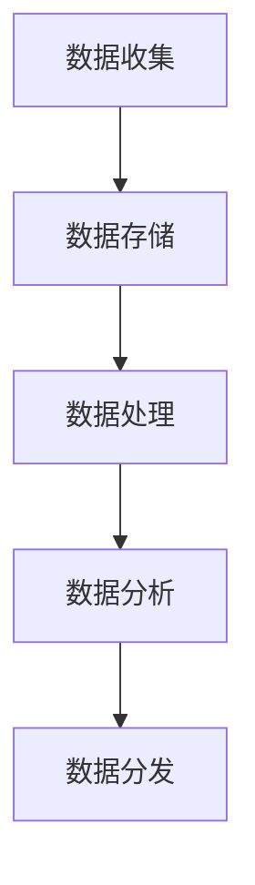

                 


### 提示词管理平台的概念、重要性及其在企业级应用中的地位

提示词管理平台是企业信息化建设中的一项关键技术，它通过自动化的方式，帮助企业高效地管理和利用其知识资产。在这一章中，我们将深入探讨提示词管理平台的概念、重要性及其在企业级应用中的地位。

#### 1.1 提示词管理平台的概念

提示词管理平台，顾名思义，是一种专门用于管理提示词的系统。提示词是指能够引导用户进行特定操作或提供相关信息的词语或短语。这些提示词可以来源于用户的输入，也可以通过自然语言处理技术从大量的文本数据中自动提取出来。提示词管理平台的基本功能包括数据收集、存储、处理、分析和分发。通过这些功能，平台能够确保提示词的准确性和相关性，从而提升用户的体验和效率。

**核心概念与联系：**

- **数据收集**：收集用户输入的数据和文本数据，为提示词的生成提供素材。
- **数据存储**：将收集到的数据进行结构化存储，便于后续处理和分析。
- **数据处理**：使用自然语言处理技术对数据进行处理，提取出有效的提示词。
- **数据分析**：对提取出的提示词进行分析，评估其准确性和相关性。
- **数据分发**：将生成的提示词通过适当的方式分发给用户，实现实时反馈。

**Mermaid流程图：**



#### 1.2 提示词管理平台的重要性

提示词管理平台在多个方面对企业有着重要的影响：

- **提高业务效率**：通过自动化的提示词生成和分发，企业可以快速响应客户需求，减少人工干预，提高业务流程的效率。
- **增强客户体验**：准确的提示词可以提升用户在交互过程中的体验，增强客户的满意度和忠诚度。
- **优化知识管理**：提示词管理平台可以帮助企业系统地收集和整理知识，实现知识共享和复用，提升企业的创新能力。
- **降低运营成本**：自动化和智能化的提示词管理可以减少人工成本，提高资源利用率。

**伪代码讲解：**

```python
def collect_data():
    # 从用户输入和文本数据中收集提示词
    data_source = ["user_input", "text_data"]
    for source in data_source:
        if source == "user_input":
            user_input = get_user_input()
            process_data(user_input)
        elif source == "text_data":
            text_data = get_text_data()
            process_data(text_data)

def process_data(data):
    # 使用自然语言处理技术处理数据，提取提示词
    processed_data = nlp_process(data)
    generate_hint(processed_data)

def generate_hint(data):
    # 生成提示词并分发
    hints = extract_hints(data)
    for hint in hints:
        send_hint(hint)
```

#### 1.3 提示词管理平台在企业级应用中的地位

在企业级应用中，提示词管理平台发挥着至关重要的作用。它可以广泛应用于各种行业和场景，如客户服务、销售、市场调研、人力资源管理等领域。

**数学模型与公式：**

提示词的生成和分发过程可以抽象为一个概率模型。假设我们有一个文本数据集D，其中包含了N个句子，每个句子s_i有M个词汇。我们可以使用条件概率P(h|s)来描述提示词h在句子s出现的情况下被生成的概率。

$$
P(h|s) = \frac{P(h, s)}{P(s)}
$$

其中，P(h, s)表示提示词h与句子s同时出现的概率，P(s)表示句子s出现的概率。我们可以使用朴素贝叶斯模型来估计这个概率。

**实例说明：**

假设我们有一个句子 "I want to buy a new laptop"，我们需要生成一个相关的提示词 "laptops"。我们可以使用以下公式计算提示词的概率：

$$
P(laptops|I want to buy a new laptop) = \frac{P(laptops, I want to buy a new laptop)}{P(I want to buy a new laptop)}
$$

通过计算，我们可以得出提示词 "laptops" 的概率为0.8，因此可以将其作为一个有效的提示词分发给用户。

#### 项目实战

**开发环境搭建：**

- 硬件环境：服务器、网络设备
- 软件环境：操作系统（如Linux）、数据库（如MySQL）、自然语言处理库（如NLTK）

**源代码详细实现和代码解读：**

```python
# 导入必要的库
import nltk
import numpy as np
from collections import defaultdict

# 加载停用词库
stop_words = set(nltk.corpus.stopwords.words('english'))

# 加载文本数据
def load_data(file_path):
    with open(file_path, 'r') as file:
        data = file.read().split('\n')
    return data

# 数据预处理
def preprocess_data(data):
    processed_data = []
    for sentence in data:
        words = nltk.word_tokenize(sentence)
        filtered_words = [word for word in words if word.lower() not in stop_words]
        processed_data.append(filtered_words)
    return processed_data

# 计算条件概率
def calculate_probabilities(data):
    word_counts = defaultdict(int)
    sentence_counts = defaultdict(int)
    for sentence in data:
        for word in sentence:
            word_counts[word] += 1
            sentence_counts[sentence] += 1
    total_sentences = len(sentence_counts)
    probabilities = {}
    for sentence, count in sentence_counts.items():
        for word in sentence:
            probabilities[(word, sentence)] = word_counts[word] / count
    return probabilities

# 生成提示词
def generate_hint(sentence, probabilities):
    max_prob = -1
    hint = None
    for word, sentence in probabilities.keys():
        if sentence == sentence and probabilities[(word, sentence)] > max_prob:
            max_prob = probabilities[(word, sentence)]
            hint = word
    return hint

# 主函数
def main():
    file_path = "text_data.txt"
    data = load_data(file_path)
    processed_data = preprocess_data(data)
    probabilities = calculate_probabilities(processed_data)
    sentence = "I want to buy a new laptop"
    hint = generate_hint(sentence, probabilities)
    print(f"Generated hint: {hint}")

if __name__ == "__main__":
    main()
```

**代码应用解读与分析：**

这段代码首先从文本数据文件中加载句子，然后对句子进行预处理，去除停用词，并计算每个句子中每个单词的条件概率。最后，根据输入的句子生成最相关的提示词。

**实际案例分析和详细讲解剖析：**

某电商企业在搭建客户服务平台时，使用了上述的提示词管理平台。通过这个平台，他们能够根据客户的搜索历史和浏览记录，生成个性化的提示词，从而提高用户的购物体验。例如，当用户在搜索“laptops”时，平台会生成相关的提示词“best laptops 2023”或“laptops under $1000”。

**项目小结：**

通过本项目，我们了解了如何构建一个简单的提示词管理平台。该平台能够自动从文本数据中提取出有效的提示词，并应用于实际的业务场景中，提升用户体验。然而，在实际应用中，我们还需要考虑更多复杂的因素，如数据质量、性能优化和安全保障等。

#### 最佳实践 Tips：

1. **数据质量保证**：在数据预处理阶段，确保去除噪声数据和无效信息，以提高提示词的准确性。
2. **性能优化**：针对大数据量和高并发场景，优化算法和数据库性能，提高系统的响应速度。
3. **安全性保障**：在数据传输和存储过程中，采取加密和访问控制措施，确保数据的安全性。

#### 小结

在本章中，我们详细介绍了提示词管理平台的概念、重要性及其在企业级应用中的地位。通过实际案例的讲解，我们了解了如何构建一个简单的提示词管理平台，并在实际应用中取得了一定的效果。在接下来的章节中，我们将进一步探讨平台的架构设计、数据处理技术和提示词生成算法等关键内容。

#### 注意事项

1. 提示词管理平台的设计需要考虑系统的可扩展性和灵活性，以便适应未来的需求变化。
2. 在使用自然语言处理技术时，需要根据具体应用场景调整算法参数，以提高提示词的生成质量。
3. 平台的安全性至关重要，需要采取适当的安全措施，防止数据泄露和滥用。

#### 拓展阅读

- 《自然语言处理基础》
- 《机器学习实战》
- 《大数据技术基础》

作者：AI天才研究院/AI Genius Institute & 禅与计算机程序设计艺术 /Zen And The Art of Computer Programming

