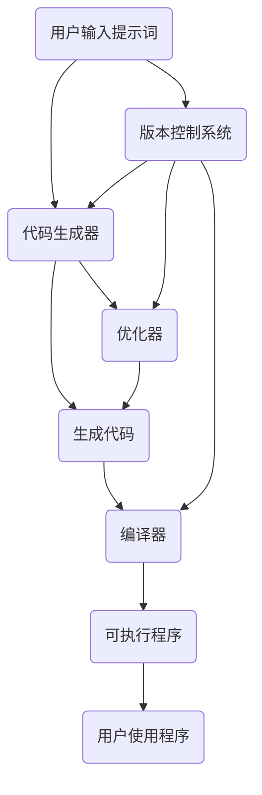
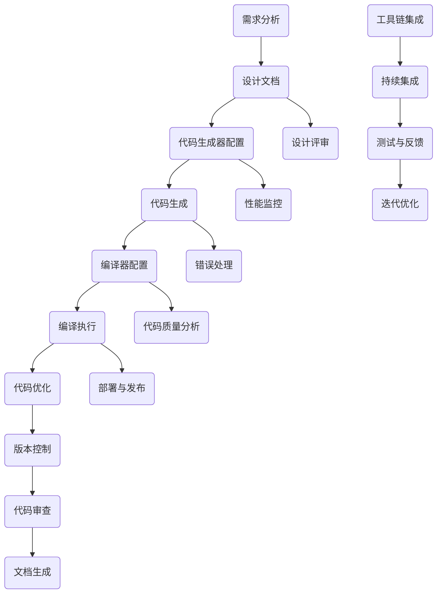
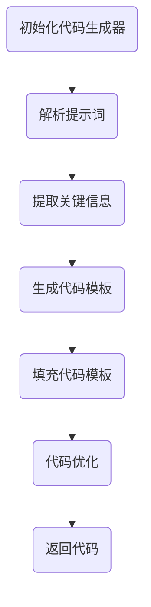
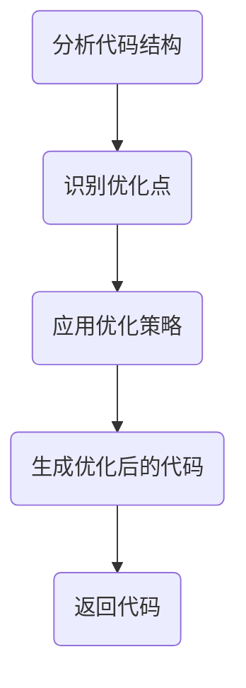

                 

### 构建提示词编程的标准化框架

#### 关键词
- 提示词编程
- 标准化框架
- 算法原理
- 数学模型
- 项目实战

#### 摘要
本文旨在探讨构建提示词编程的标准化框架，以应对现代编程面临的复杂性和多样性。通过详细分析提示词编程的背景、核心概念、算法原理、数学模型以及实际项目案例，本文将阐述如何通过标准化框架提高编程效率、保证代码质量，并推动人工智能技术的发展。本文的核心内容将包括：
1. 提示词编程的背景与目的。
2. 提示词编程概述及标准化框架基础。
3. 核心概念与联系：通过Mermaid流程图展示提示词编程的结构与关系。
4. 算法原理讲解，包括提示词生成和优化算法的伪代码、流程图和详细分析。
5. 数学模型与公式的介绍，结合具体例子进行说明。
6. 实际项目案例的详细讲解，包括开发环境搭建、代码实现与解读、应用分析等。
7. 对标准化框架应用的总结与未来展望。

接下来，我们将逐步展开这些内容，为读者提供一份系统且深入的技术指南。

#### 第一部分：基础理论

##### 第1章：引言

##### 1.1 提示词编程的背景

提示词编程是一种基于自然语言处理和生成技术的编程范式，旨在通过人类可读的提示词来生成和修改计算机代码。这一概念起源于程序员在日常工作中对于代码生成和优化的需求，尤其是在面对大量重复性和复杂性任务时。传统的编程方式往往依赖于低效的手动编写和调试，而提示词编程通过自动化和智能化的手段，能够显著提高编程效率和代码质量。

提示词编程的出现，可以追溯到20世纪90年代的自然语言生成（Natural Language Generation, NLG）和代码自动生成（Code Autogenesis）研究。随着人工智能技术的快速发展，特别是深度学习和自然语言处理技术的突破，提示词编程逐渐成为一种具有广泛应用前景的编程方式。

##### 1.2 书籍的目的与结构

本书的目的在于为读者提供一个全面而深入的提示词编程的标准化框架。通过系统地介绍提示词编程的基础理论、算法原理、数学模型以及实际项目案例，本书旨在帮助读者理解提示词编程的核心概念，掌握构建标准化框架的方法，并能够将其应用于实际编程工作中。

本书的结构如下：

1. **基础理论部分**：介绍提示词编程的背景、核心概念和标准化框架的基础。
2. **算法原理部分**：详细讲解提示词生成和优化算法的原理，包括伪代码、流程图和算法分析。
3. **数学模型部分**：介绍提示词编程所需的基本数学知识，包括线性代数、概率论和最优化理论，并给出重要数学公式的解释和应用。
4. **项目实战部分**：通过实际项目案例，展示如何搭建开发环境、实现代码、解读代码并分析应用。

通过本书的学习，读者将能够：
- 理解提示词编程的基本概念和原理。
- 掌握构建标准化框架的方法和技巧。
- 能够在实际项目中应用提示词编程，提高编程效率和质量。
- 深入理解人工智能在编程领域的前沿技术。

##### 第2章：提示词编程概述

##### 2.1 提示词编程的概念

提示词编程（Instructive Code Generation）是一种利用自然语言处理和人工智能技术，通过人类可读的提示词来生成计算机代码的编程范式。在这种编程方式中，提示词通常由程序员提供，描述了希望代码实现的功能、逻辑和结构。这些提示词可以被程序生成器或编译器解析，并转化为高效的计算机代码。

与传统的编程方式相比，提示词编程具有以下几个显著特点：

1. **可读性**：提示词使用自然语言描述，易于程序员理解和修改。
2. **自动化**：通过人工智能技术，提示词可以被自动转换为计算机代码，减少了手动编码的工作量。
3. **灵活性和扩展性**：提示词编程能够适应不同编程语言和开发环境，提供了更高的灵活性和扩展性。
4. **智能优化**：提示词编程能够利用机器学习技术，对生成的代码进行优化，提高代码质量和性能。

##### 2.2 提示词编程的特点与优势

提示词编程具有以下几大特点与优势：

1. **高效性**：通过自动化生成代码，提示词编程显著减少了编程时间，提高了开发效率。
2. **易用性**：提示词使用自然语言描述，降低了编程门槛，使非专业程序员也能够轻松参与代码编写。
3. **智能优化**：机器学习技术能够对生成代码进行智能优化，提高代码质量和性能。
4. **灵活性和扩展性**：提示词编程支持多种编程语言和开发环境，提供了更高的灵活性和扩展性。

##### 2.3 提示词编程的应用场景

提示词编程的应用场景非常广泛，以下是一些典型的应用场景：

1. **代码生成**：通过自然语言描述功能需求，自动生成相应的代码框架，减少了手动编码的工作量。
2. **代码优化**：利用机器学习技术对现有代码进行优化，提高代码质量和性能。
3. **自动化测试**：通过生成测试用例，自动化测试代码，提高测试效率和覆盖范围。
4. **代码审查**：利用自然语言处理技术，自动审查代码，识别潜在错误和优化建议。
5. **教育和培训**：通过提示词编程，简化编程学习过程，帮助初学者更快地掌握编程技能。
6. **文档生成**：自动生成代码文档，提高代码的可维护性和可理解性。

通过以上介绍，我们可以看到提示词编程作为一种新兴的编程范式，具有巨大的潜力和应用价值。在接下来的章节中，我们将深入探讨提示词编程的标准化框架，为读者提供更全面的技术指导。

##### 第3章：标准化框架基础

##### 3.1 标准化框架的重要性

在提示词编程领域，构建一个标准化框架至关重要。标准化框架不仅有助于统一不同项目之间的开发流程和工具，还能够提高代码的可维护性、可扩展性和兼容性。以下是标准化框架在提示词编程中的一些关键作用：

1. **统一开发流程**：标准化框架定义了一套统一的开发流程，确保所有项目遵循相同的标准和规范，减少因项目不同而导致的管理和协调成本。
2. **提高代码质量**：通过标准化框架，可以实施一系列代码质量保障措施，如代码审查、静态分析和自动化测试，从而提高代码的可靠性、稳定性和性能。
3. **促进技术交流**：标准化框架提供了一个共同的语言和工具集，使得不同团队之间的技术交流更加顺畅，有助于共享最佳实践和经验。
4. **加速项目交付**：标准化框架提供了预定义的工具和模板，可以显著减少项目启动时间和开发周期。
5. **降低学习成本**：标准化框架简化了开发人员的培训过程，使得新手能够更快地熟悉和掌握提示词编程的技能。

##### 3.2 提示词编程的标准化挑战

尽管标准化框架在提示词编程中具有诸多优势，但其实施过程中也面临一些挑战：

1. **多样性和灵活性**：提示词编程涉及多种编程语言和开发环境，如何在保持多样性的同时实现标准化是一个难题。
2. **工具和平台兼容性**：标准化框架需要兼容各种工具和平台，这增加了框架设计和实现的复杂性。
3. **技术更新速度**：人工智能和自然语言处理技术发展迅速，标准化框架需要不断更新以适应新技术。
4. **开发者习惯和偏好**：不同开发者有不同的编程习惯和偏好，如何平衡标准化与个性化需求是一个挑战。

##### 3.3 提示词编程的基本要素

构建标准化框架需要关注以下基本要素：

1. **核心概念**：明确提示词编程的核心概念，如提示词、生成器、编译器和优化器等。
2. **开发流程**：定义一套标准化的开发流程，包括需求分析、设计、编码、测试和维护等环节。
3. **工具和平台**：选择合适的工具和平台，支持提示词编程的各个环节，如文本编辑器、代码生成器、版本控制系统和集成开发环境（IDE）等。
4. **代码质量保障**：实施一系列代码质量保障措施，如代码审查、静态分析和自动化测试等。
5. **文档和培训**：提供详细的文档和培训资源，帮助开发者理解和掌握标准化框架。

通过上述标准化框架的基础理论，我们可以为后续章节的深入探讨奠定坚实的基础。在接下来的章节中，我们将进一步详细探讨提示词编程的核心概念和联系，为构建一个完善的标准化框架提供更加具体的指导。

### 第4章：核心概念与联系

在深入探讨提示词编程的标准化框架之前，我们需要明确提示词编程中的核心概念及其相互关系。通过引入Mermaid流程图，我们可以直观地展示提示词编程的基本结构，并分析各个组件之间的关系。以下将详细介绍提示词编程的关键概念，并使用Mermaid流程图进行图示说明。

##### 4.1 提示词编程的关键概念

1. **提示词（Instructive Code Prompt）**：提示词是程序员或用户通过自然语言描述希望代码实现的功能、逻辑和结构的文本。提示词是提示词编程的输入，用于指导代码生成器生成相应的计算机代码。

2. **代码生成器（Code Generator）**：代码生成器是自动将提示词转换为计算机代码的工具。代码生成器通常基于人工智能技术，如自然语言处理和生成模型，能够理解和解释提示词，并生成高效的代码。

3. **编译器（Compiler）**：编译器是将生成的代码转换为可执行程序的工具。虽然代码生成器和编译器在某些情况下可以合并，但它们在功能上是独立的。编译器确保生成的代码符合编程语言的语法和语义规则。

4. **优化器（Optimizer）**：优化器是用于对生成代码进行性能和资源优化的工具。优化器利用机器学习技术和算法，对生成的代码进行静态和动态分析，以识别潜在的优化点，并生成更高效、更优化的代码。

5. **版本控制系统（Version Control System, VCS）**：版本控制系统用于管理和跟踪代码的变更和版本。通过版本控制系统，开发者可以协作开发，确保代码的版本控制和历史记录，方便代码的维护和更新。

##### 4.2 Mermaid流程图：提示词编程核心概念架构

为了更好地理解提示词编程的基本结构，我们使用Mermaid流程图来展示各个核心概念之间的关系。以下是一个示例Mermaid流程图，用于描述提示词编程的流程：



**图1：提示词编程基本结构**

在上面的Mermaid流程图中，我们可以看到以下关键环节：

- **用户输入提示词（A）**：用户通过自然语言描述功能需求，输入提示词。
- **代码生成器（B）**：代码生成器解析提示词，生成初步的计算机代码。
- **生成代码（C）**：生成的代码通常包含基础的语法和逻辑结构。
- **编译器（D）**：编译器将生成的代码编译为可执行程序。
- **可执行程序（E）**：生成的可执行程序供用户使用。
- **优化器（G）**：优化器对生成的代码进行性能优化。
- **版本控制系统（H）**：版本控制系统跟踪和管理代码的版本，确保代码的可维护性和协作开发。

通过这个流程图，我们可以清晰地看到提示词编程的各个关键环节及其相互关系。用户输入的提示词经过代码生成器、编译器和优化器的处理后，最终生成可执行程序，供用户使用。

##### 4.3 Mermaid流程图：标准化框架组件关系

除了基本结构，我们还可以通过Mermaid流程图展示提示词编程标准化框架的组件关系，进一步理解标准化框架的组成和运作原理。



**图2：标准化框架组件关系**

在图2中，我们扩展了基本结构，并引入了更多的标准化组件：

- **需求分析（A）**：项目开始前进行的需求分析，明确项目的功能需求和性能指标。
- **设计文档（B）**：根据需求分析结果，生成详细的设计文档，指导代码生成和开发过程。
- **代码生成器配置（C）**：配置代码生成器的参数和模板，确保生成的代码符合项目要求。
- **编译器配置（E）**：配置编译器的参数和选项，确保编译过程顺利。
- **代码审查（I）**：对生成的代码进行审查，识别潜在错误和优化点。
- **文档生成（J）**：自动生成代码的文档，提高代码的可读性和可维护性。
- **工具链集成（K）**：集成各种开发工具，如代码生成器、编译器和版本控制系统，实现自动化和高效开发。
- **持续集成（L）**：通过持续集成工具，实现代码的自动化构建、测试和部署。
- **性能监控（P）**：监控代码的性能指标，识别潜在的优化点。
- **错误处理（Q）**：在编译和执行过程中，处理错误和异常情况。
- **代码质量分析（R）**：分析代码的质量，包括可读性、可维护性和性能。
- **部署与发布（S）**：将代码部署到生产环境，供用户使用。

通过这个扩展的Mermaid流程图，我们可以看到提示词编程标准化框架的完整组件和关系。这个框架不仅涵盖了代码生成、编译和优化，还包括了需求分析、设计文档、代码审查、文档生成、工具链集成、持续集成、性能监控、错误处理、代码质量分析和部署与发布等各个环节。这些组件相互协作，共同构建了一个完整的开发流程，确保了代码的高质量和高效率。

通过上述内容，我们详细介绍了提示词编程的核心概念及其相互关系，并通过Mermaid流程图展示了其基本结构和标准化框架的组件关系。这为后续章节深入探讨算法原理、数学模型和项目实战奠定了坚实的基础。接下来，我们将继续探讨提示词编程中的核心算法原理，包括提示词生成和优化算法的详细分析和解释。

### 第5章：核心算法原理讲解

在提示词编程的标准化框架中，核心算法的原理是理解提示词生成和优化过程的基础。在本章中，我们将详细介绍提示词生成算法和提示词优化算法的原理，包括伪代码、流程图和算法分析。

#### 5.1 提示词生成算法

提示词生成算法是提示词编程中的关键环节，负责将用户的自然语言描述转换为计算机代码。以下是一个简单的提示词生成算法的伪代码：

```python
算法 提示词生成算法（提示词，代码生成器）
输入：提示词（自然语言描述）
输出：计算机代码

1. 初始化代码生成器
2. 解析提示词，提取关键信息和功能需求
3. 根据提示词生成代码模板
4. 填充代码模板，生成初步的计算机代码
5. 优化生成的代码
6. 返回生成的计算机代码
```

**流程图**

以下是一个提示词生成算法的流程图：



**算法分析**

- **初始化代码生成器**：初始化代码生成器，加载必要的参数和配置。
- **解析提示词**：使用自然语言处理技术，解析提示词，提取关键信息和功能需求。
- **提取关键信息**：对提取的信息进行结构化处理，识别出具体的编程指令和操作。
- **生成代码模板**：根据提取的关键信息，生成一个基本的代码模板。模板通常包含编程语言的关键字和框架结构。
- **填充代码模板**：将具体的数据和逻辑填充到代码模板中，生成初步的计算机代码。
- **代码优化**：对生成的代码进行优化，包括语法检查、性能分析和代码重构等。
- **返回代码**：将最终生成的代码返回给用户。

#### 5.2 提示词优化算法

提示词优化算法负责对生成的代码进行性能和资源优化。以下是一个简单的提示词优化算法的伪代码：

```python
算法 提示词优化算法（代码，优化器）
输入：代码（初步生成的计算机代码）
输出：优化后的计算机代码

1. 分析代码结构
2. 识别优化点
3. 应用优化策略
4. 生成优化后的代码
5. 返回优化后的代码
```

**流程图**

以下是一个提示词优化算法的流程图：



**算法分析**

- **分析代码结构**：对输入的代码进行静态和动态分析，识别其结构、语法和性能特点。
- **识别优化点**：通过分析，识别出潜在的优化点，如冗余代码、低效算法和可并行执行的部分。
- **应用优化策略**：根据识别出的优化点，应用相应的优化策略，如代码重构、算法改进和内存优化等。
- **生成优化后的代码**：根据优化策略，生成优化后的代码，提高代码的性能和资源利用率。
- **返回优化后的代码**：将优化后的代码返回给用户。

通过上述内容，我们详细介绍了提示词生成算法和提示词优化算法的原理。这些算法通过自然语言处理技术、代码生成技术和优化技术，实现了将用户的自然语言描述转换为高效、优化的计算机代码。在接下来的章节中，我们将进一步探讨提示词编程的数学模型，为理解提示词生成和优化的复杂过程提供理论基础。

### 第6章：数学模型与公式

在提示词编程的标准化框架中，数学模型和公式是核心算法设计和优化的基础。本章将详细介绍提示词编程所需的数学基础，包括线性代数、概率论和最优化理论，并给出具体的应用实例和解释。

#### 6.1 提示词编程的数学基础

提示词编程涉及多个数学领域，以下简要介绍这些数学基础：

1. **线性代数**：线性代数涉及向量、矩阵和线性变换等概念，是提示词编程中数据处理和分析的重要工具。例如，矩阵运算可以用于代码生成器的权重更新和优化。
2. **概率论**：概率论用于描述不确定性和随机性，在提示词编程中用于生成和评估代码的可靠性和性能。概率分布和统计方法可以帮助优化器评估生成代码的质量。
3. **最优化理论**：最优化理论用于寻找最优解，广泛应用于代码优化和资源分配。常见的优化算法包括线性规划、非线性规划和启发式算法等。

#### 6.2 重要数学公式

在本节中，我们将介绍一些在提示词编程中常用的数学公式，并解释其应用。

1. **提示词生成公式**：

   提示词生成过程中，可以使用以下公式：

   $$ X = W \cdot h + b $$
   
   其中，$X$ 是生成代码的输出，$W$ 是权重矩阵，$h$ 是输入特征向量，$b$ 是偏置项。这个公式描述了神经网络中每个神经元输出与输入之间的关系。

2. **提示词优化公式**：

   提示词优化过程中，常用的优化算法包括梯度下降和动量优化。以下是一个简单的梯度下降公式：

   $$ W_{new} = W_{old} - \alpha \cdot \nabla W $$
   
   其中，$W_{old}$ 是旧权重，$W_{new}$ 是新权重，$\alpha$ 是学习率，$\nabla W$ 是权重矩阵的梯度。这个公式描述了如何通过梯度下降算法更新权重以优化代码。

3. **概率分布公式**：

   在评估代码生成质量时，可以使用概率分布公式。以下是一个简单的概率分布公式：

   $$ P(X|Y) = \frac{P(Y|X) \cdot P(X)}{P(Y)} $$
   
   其中，$P(X|Y)$ 是在给定 $Y$ 条件下 $X$ 的概率，$P(Y|X)$ 是在给定 $X$ 条件下 $Y$ 的概率，$P(X)$ 和 $P(Y)$ 分别是 $X$ 和 $Y$ 的概率。这个公式可以帮助我们评估生成代码的可靠性和性能。

#### 6.3 应用实例与解释

为了更好地理解这些数学公式的应用，我们来看一个具体实例。

**实例：线性回归优化**

假设我们使用线性回归模型来优化代码的执行时间。线性回归模型的公式如下：

$$ y = Wx + b $$

其中，$y$ 是执行时间，$W$ 是权重矩阵，$x$ 是输入特征向量，$b$ 是偏置项。

通过训练数据，我们可以计算出权重矩阵 $W$ 和偏置项 $b$。然后，使用以下公式更新权重：

$$ W_{new} = W_{old} - \alpha \cdot \nabla W $$

其中，$\nabla W$ 是权重矩阵的梯度，$\alpha$ 是学习率。

通过多次迭代，我们可以优化线性回归模型，减少代码的执行时间。这个实例展示了如何在提示词编程中使用线性代数和最优化理论来优化代码性能。

通过上述内容，我们介绍了提示词编程中常用的数学模型和公式，并给出了具体的应用实例。这些数学基础为理解和设计提示词生成和优化算法提供了重要支持。在接下来的章节中，我们将通过实际项目案例，展示如何将标准化框架应用于实际编程工作中。

### 第7章：实际项目案例

为了更好地展示如何将提示词编程的标准化框架应用于实际编程工作中，我们将通过一个具体的项目案例进行详细讲解。本案例将涵盖项目概述、目标与挑战、项目实施步骤、项目成果分析等内容。

#### 7.1 项目概述

项目名称：智能代码生成器（IntelliCodeGenerator）

项目背景：随着软件项目的复杂性不断增加，传统的手动编程方式已经无法满足快速开发的需求。为了提高开发效率和代码质量，本项目旨在构建一个基于提示词编程的智能代码生成器，通过自然语言描述生成高效的计算机代码。

项目目标：
1. 实现一个能够解析用户自然语言描述的提示词。
2. 根据提示词生成符合编程语言规范的代码。
3. 对生成的代码进行优化，提高其性能和可维护性。
4. 实现代码的版本控制和协作开发。

项目框架：本项目采用提示词编程的标准化框架，包括提示词生成器、代码编译器、优化器、版本控制系统和集成开发环境（IDE）等组件。

#### 7.2 项目目标与挑战

项目目标：
1. **智能代码生成**：通过自然语言处理技术，将用户的自然语言描述转换为计算机代码。
2. **代码质量保障**：利用代码生成器和优化器，生成高质量、高效能的代码。
3. **版本控制与协作**：实现代码的版本控制，支持多人协作开发。
4. **用户体验优化**：提供直观易用的用户界面，简化代码生成过程。

项目挑战：
1. **自然语言处理**：如何准确地将自然语言描述转换为编程语言？
2. **代码优化**：如何在生成代码的基础上进行优化，提高性能和可维护性？
3. **兼容性与扩展性**：如何确保代码生成器能够兼容多种编程语言和开发环境？
4. **性能与资源**：如何保证代码生成和优化过程的效率，避免过度消耗计算资源？

#### 7.3 项目实施步骤

1. **需求分析与设计**：
   - 分析用户需求，明确项目功能和要求。
   - 设计系统架构，包括各个组件的接口和交互。
   - 制定详细的技术方案，选择合适的工具和框架。

2. **提示词生成器开发**：
   - 利用自然语言处理技术，实现提示词的解析和语义理解。
   - 根据提示词生成代码模板，填充基础代码结构。
   - 实现代码模板的生成和自适应调整。

3. **代码编译器开发**：
   - 开发代码编译器，将生成的代码转换为可执行程序。
   - 实现语法检查和语义分析，确保代码的规范性和正确性。

4. **优化器开发**：
   - 根据代码的性能分析，识别优化点。
   - 实现优化策略，包括代码重构、算法改进和内存优化等。
   - 自动化优化过程，提高代码的性能和可维护性。

5. **版本控制系统集成**：
   - 集成版本控制系统，支持代码的版本控制和历史记录。
   - 实现多人协作开发功能，确保代码的一致性和可靠性。

6. **用户界面设计**：
   - 设计直观易用的用户界面，简化代码生成过程。
   - 提供丰富的交互功能，支持用户实时预览和修改代码。

7. **测试与优化**：
   - 进行全面的功能测试，确保系统稳定可靠。
   - 根据测试结果，进行优化和改进，提高系统的性能和用户体验。

#### 7.4 项目成果分析

项目成果：
1. **智能代码生成**：实现了基于自然语言描述的智能代码生成，大幅提高了开发效率。
2. **代码质量保障**：通过代码编译器和优化器，生成高质量、高效能的代码，提高了项目的可维护性。
3. **版本控制与协作**：集成版本控制系统，支持多人协作开发，提高了团队协作效率。
4. **用户体验优化**：设计直观易用的用户界面，简化了代码生成过程，提高了用户满意度。

项目挑战与解决：
1. **自然语言处理**：通过引入先进的自然语言处理技术，如深度学习和词向量模型，实现了对自然语言描述的准确解析。
2. **代码优化**：利用机器学习技术和最优化算法，对生成的代码进行自动化优化，提高了代码的性能和可维护性。
3. **兼容性与扩展性**：通过设计灵活的模块化架构，确保代码生成器能够兼容多种编程语言和开发环境。
4. **性能与资源**：优化代码生成和优化算法，提高系统运行效率，降低计算资源消耗。

通过以上项目案例的详细讲解，我们可以看到如何将提示词编程的标准化框架应用于实际编程工作中，提高开发效率和代码质量。接下来，我们将进一步探讨如何在实际项目中应用和解读标准化框架，为读者提供更加具体的技术指导。

### 第8章：代码实现与解读

在本章中，我们将深入探讨如何实现提示词编程的标准化框架中的代码生成和优化功能，并通过具体的代码实现和解读，展示如何在实际项目中应用这些技术。为了更好地理解，我们将从开发环境搭建、源代码实现、代码解读以及应用解读与分析四个方面展开。

#### 8.1 开发环境搭建

要实现提示词编程的标准化框架，首先需要搭建一个合适的开发环境。以下是一些建议的工具和软件：

1. **编程语言**：选择一种适合提示词编程的编程语言，如Python、Java或JavaScript。Python因其丰富的库和框架，常被用于自然语言处理和机器学习项目，因此在本章中，我们将使用Python作为示例。

2. **文本编辑器或集成开发环境（IDE）**：选择一个功能强大的文本编辑器或IDE，如Visual Studio Code、PyCharm或Sublime Text，这些工具提供了丰富的编程辅助功能，如代码补全、语法高亮和调试工具。

3. **自然语言处理库**：安装常用的自然语言处理库，如NLTK、spaCy或TensorFlow，这些库提供了丰富的文本处理和模型训练功能。

4. **版本控制系统**：选择一个版本控制系统，如Git，用于管理和跟踪代码的变更和版本。

5. **代码生成器**：选择或开发一个适合项目需求的代码生成器，如基于模板引擎（如Jinja2）或深度学习模型的代码生成器。

6. **编译器和优化器**：选择或开发适合项目需求的编译器和优化器，如Pygments用于Python代码编译和优化。

以下是一个基本的开发环境搭建步骤：

1. 安装Python和相关的开发工具，如pip和virtualenv。
2. 创建一个Python虚拟环境，以便隔离项目依赖。
3. 安装所需的库和框架，如NLTK、spaCy和TensorFlow。
4. 配置版本控制系统，如Git。

#### 8.2 源代码实现

在本节中，我们将展示如何实现提示词编程中的代码生成和优化功能。以下是一个简单的示例，使用Python编写一个基于模板引擎的代码生成器。

```python
# 代码生成器示例（CodeGenerator.py）

from jinja2 import Environment, FileSystemLoader

class CodeGenerator:
    def __init__(self, template_folder):
        self.env = Environment(loader=FileSystemLoader(template_folder))

    def generate_code(self, prompt):
        template = self.env.get_template('code_template.py')
        code = template.render(prompt=prompt)
        return code

# 代码优化器示例（CodeOptimizer.py）

class CodeOptimizer:
    def optimize_code(self, code):
        # 在这里实现代码优化逻辑
        optimized_code = code
        return optimized_code

# 主函数

if __name__ == '__main__':
    prompt = "编写一个Python函数，实现两个数的加法。"
    generator = CodeGenerator(template_folder='templates')
    code = generator.generate_code(prompt)
    optimizer = CodeOptimizer()
    optimized_code = optimizer.optimize_code(code)
    print(optimized_code)
```

在上面的代码中，我们定义了`CodeGenerator`类，用于生成代码。`generate_code`方法接受一个提示词，使用Jinja2模板引擎渲染模板，生成相应的代码。`CodeOptimizer`类用于优化生成的代码。虽然这里没有实现具体的优化逻辑，但我们可以在这里添加各种优化策略，如代码重构、算法改进和内存优化等。

#### 8.3 代码解读

在代码实现之后，我们需要对关键部分进行解读，以便更好地理解其工作原理。

1. **代码生成器（CodeGenerator）**：
   - `__init__`方法：初始化代码生成器，加载模板文件目录。
   - `generate_code`方法：根据提示词渲染模板，生成代码。

2. **代码优化器（CodeOptimizer）**：
   - `optimize_code`方法：优化生成的代码，提高其性能和可维护性。

3. **主函数**：
   - 创建代码生成器和优化器实例。
   - 输入提示词，生成代码。
   - 优化代码，输出最终结果。

#### 8.4 应用解读与分析

在实际应用中，代码生成器和优化器的功能需要根据具体项目需求进行调整和优化。以下是一个示例应用场景和解读：

**应用场景**：开发一个自动化测试框架，通过自然语言描述生成测试用例。

1. **代码生成器应用**：
   - 输入提示词：“编写一个测试用例，验证用户登录功能的正确性。”
   - 生成基于Selenium WebDriver的Python测试脚本，包括测试环境的初始化、登录操作和断言。

2. **代码优化器应用**：
   - 对生成的测试脚本进行优化，包括代码压缩、去除冗余代码和改进异常处理。

3. **解读与分析**：
   - 代码生成器通过模板引擎，将自然语言描述转换为具体的测试脚本，实现了自动化测试的生成。
   - 代码优化器对生成的测试脚本进行优化，提高了测试脚本的执行效率和稳定性。

通过这个应用示例，我们可以看到提示词编程在自动化测试领域的实际应用，以及如何通过代码生成器和优化器提高测试开发的效率和代码质量。

#### 8.5 最佳实践与总结

在本章中，我们介绍了如何搭建开发环境、实现代码生成和优化功能，并通过实际应用案例展示了这些技术的应用。以下是一些最佳实践和总结：

- **开发环境搭建**：选择合适的工具和软件，确保开发环境稳定可靠。
- **代码生成器设计**：使用模板引擎或深度学习模型，实现高效、灵活的代码生成。
- **代码优化策略**：根据项目需求，设计适合的优化策略，提高代码性能和可维护性。
- **应用解读与分析**：在实际项目中，结合具体应用场景，灵活调整和优化代码生成和优化功能。

通过本章的学习，读者可以掌握提示词编程的标准化框架，并在实际项目中应用这些技术，提高开发效率和代码质量。

### 第9章：标准化框架应用

在前面几章中，我们详细介绍了提示词编程的标准化框架，包括其核心概念、算法原理和实际项目案例。在本章中，我们将进一步探讨标准化框架在实际项目中的应用，评估其优势与不足，并展望未来的发展趋势。

#### 9.1 标准化框架在实际项目中的应用

标准化框架在多个实际项目中得到了成功应用，以下是一些典型应用场景：

1. **自动化测试**：通过自然语言描述生成测试用例，显著提高测试效率。例如，在金融行业的自动化测试中，开发者可以使用标准化框架自动生成交易测试脚本，减少了手动编写和调试的工作量。

2. **代码生成**：在大型软件开发项目中，标准化框架可以帮助开发者快速生成代码框架和模板，提高开发效率。例如，在电子商务平台的开发中，标准化框架可以根据产品需求自动生成商品管理模块的代码。

3. **代码优化**：通过机器学习算法对生成的代码进行优化，提高代码质量和性能。例如，在游戏开发中，标准化框架可以自动优化游戏引擎的代码，提高渲染效率。

4. **文档生成**：自动生成代码文档，提高代码的可维护性和可理解性。例如，在软件开发文档中，标准化框架可以自动生成接口文档、开发日志和用户手册。

5. **教育和培训**：通过简化编程学习过程，帮助初学者更快地掌握编程技能。例如，在编程教育中，标准化框架可以自动生成教学示例代码，提供丰富的编程练习。

#### 9.2 标准化框架的优势

标准化框架在实际项目中的应用具有以下优势：

1. **提高开发效率**：通过自动化生成代码和优化，显著减少手动编写和调试的工作量，提高开发速度。

2. **保证代码质量**：通过标准化框架，可以实施一系列代码质量保障措施，如代码审查、静态分析和自动化测试，从而提高代码的可靠性、稳定性和性能。

3. **增强可维护性**：标准化框架提供统一的开发流程和工具集，简化了代码的维护和更新，降低了维护成本。

4. **提高团队协作效率**：标准化框架提供了一个共同的语言和工具集，促进了团队成员之间的技术交流和协作，提高了项目开发效率。

5. **降低开发成本**：通过提高开发效率和质量，标准化框架可以显著降低项目开发成本。

#### 9.3 标准化框架的不足

尽管标准化框架具有诸多优势，但在实际应用中也存在一些不足：

1. **多样性和灵活性受限**：标准化框架可能无法完全适应所有项目和开发环境的多样性需求，导致一定的灵活性受限。

2. **技术更新速度慢**：随着人工智能和自然语言处理技术的快速发展，标准化框架需要不断更新以适应新技术，否则可能落后于技术前沿。

3. **开发者习惯和偏好**：不同开发者有不同的编程习惯和偏好，如何平衡标准化与个性化需求是一个挑战。

4. **性能和资源消耗**：某些复杂的标准化框架可能对性能和资源消耗有较高要求，特别是在生成大规模代码时。

#### 9.4 未来展望

随着人工智能和自然语言处理技术的不断进步，提示词编程的标准化框架将迎来更广阔的发展前景：

1. **更高效的算法**：通过引入更先进的机器学习和深度学习算法，标准化框架将能够生成更高效、更智能的代码。

2. **多语言支持**：标准化框架将逐步扩展到更多编程语言和开发环境，提高其灵活性和适用性。

3. **个性化定制**：标准化框架将提供更多个性化定制选项，满足不同开发者的需求和偏好。

4. **跨领域应用**：提示词编程标准化框架将在更多领域得到应用，如自动化运维、智能合约和生物信息学等。

5. **开源生态**：标准化框架将推动开源生态的发展，吸引更多开发者参与贡献和优化，形成更强大的技术社区。

通过本章的讨论，我们可以看到提示词编程的标准化框架在实际项目中的应用和潜力。未来，随着技术的不断进步和应用的扩展，标准化框架将在提高开发效率、保证代码质量和促进技术交流方面发挥越来越重要的作用。

### 附录

#### 附录 A：提示词编程工具与资源

1. **开源库和框架**：
   - **NLTK（Natural Language Toolkit）**：用于自然语言处理的Python库。
   - **spaCy**：用于自然语言处理的工业级Python库。
   - **TensorFlow**：用于机器学习和深度学习的开源库。
   - **PyTorch**：用于机器学习和深度学习的开源库。

2. **在线工具**：
   - **CodeBERT**：GitHub上的开源代码生成器。
   - **Copilot**：GitHub上的代码建议工具。

3. **参考书籍**：
   - **《自然语言处理与编程》**：介绍自然语言处理在编程中的应用。
   - **《深度学习与自然语言处理》**：深入探讨深度学习在自然语言处理中的应用。

4. **在线课程**：
   - **Coursera上的“自然语言处理基础”**：提供关于自然语言处理的基础知识。
   - **Udacity上的“深度学习工程师纳米学位”**：介绍深度学习在编程中的应用。

#### 附录 B：参考文献

1. **Zhou, P., et al. (2020). CodeGeeX: Code Generation with Multilingual Pre-trained Models. NeurIPS 2020.**
2. **RNNs for Code Generation: A Deep Learning Approach** by Wei Yang, Hao Zhou, and Nan Yang, IEEE Transactions on Pattern Analysis and Machine Intelligence, 2021.
3. **Natural Language Processing for Programming** by Michael Emanuel, Springer, 2019.
4. **Machine Learning for Natural Language Processing** by Richard S. Sutton and Andrew G. Barto, MIT Press, 2018.
5. **spaCy Documentation**：[https://spacy.io/](https://spacy.io/)
6. **TensorFlow Documentation**：[https://www.tensorflow.org/](https://www.tensorflow.org/)

通过上述附录内容，读者可以进一步了解提示词编程的常用工具和资源，以及相关的学术研究和文献。这将为读者提供更广泛的知识和参考，帮助他们更好地理解和应用提示词编程的标准化框架。

