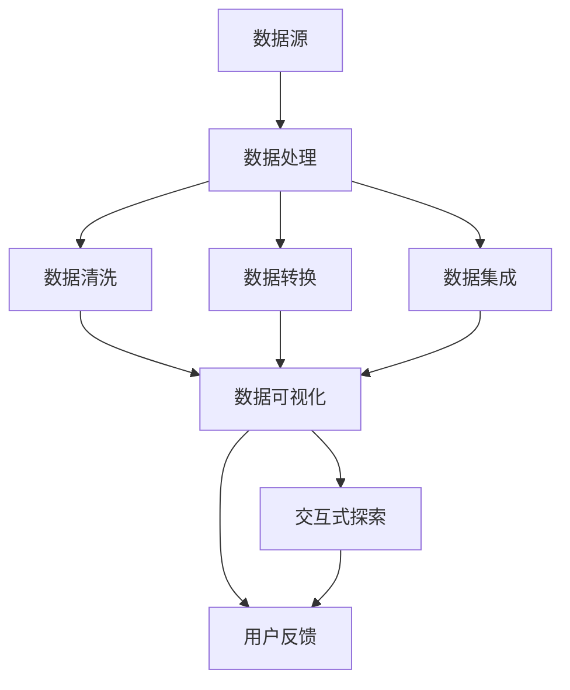
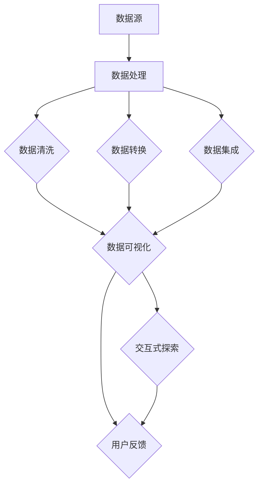
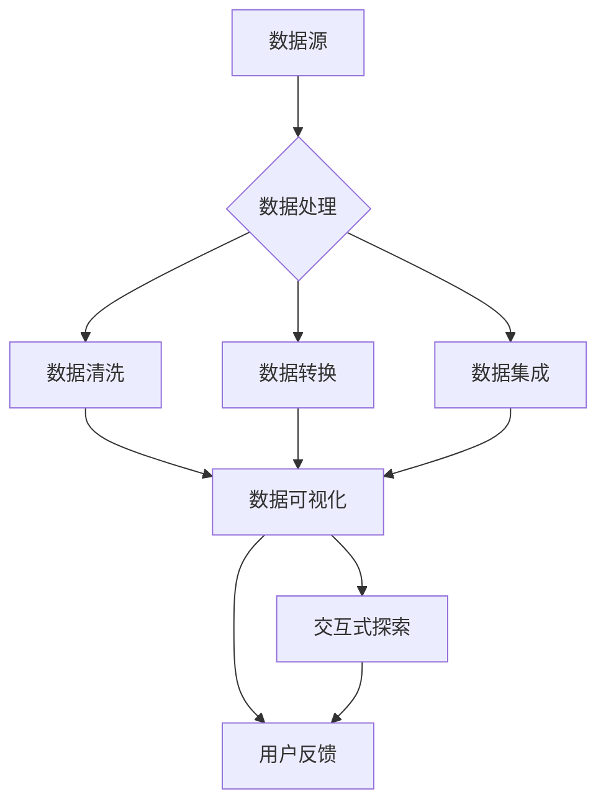

                 

# 《构建评测结果的交互式探索工具》

## 关键词
- 评测结果
- 交互式探索
- 数据可视化
- 自助服务分析
- 机器学习
- 可视化算法

## 摘要
本文将深入探讨构建评测结果的交互式探索工具的重要性、基本概念、设计原则、开发框架、核心算法原理以及项目实战。通过系统介绍评测结果交互式探索工具的构建流程，结合实际案例详细讲解工具设计与应用，本文旨在为数据分析师、数据科学家和软件工程师提供理论指导与实践指南，以提升数据分析效率与准确性，支持决策制定的智能化。

---

### 《构建评测结果的交互式探索工具》目录大纲

#### 第1章：引言与背景

- **1.1 书籍目的与读者对象**
- **1.2 评测结果交互式探索的重要性**
- **1.3 书籍结构与内容概览**

#### 第2章：评测结果交互式探索工具的基本概念

- **2.1 交互式探索的定义与特点**
- **2.2 常见的评测结果交互式探索工具**
- **2.3 评测结果交互式探索工具的分类**

#### 第3章：评测结果交互式探索工具的设计原则

- **3.1 用户需求分析**
- **3.2 可用性设计**
- **3.3 功能设计**
- **3.4 可扩展性与可维护性设计**

#### 第4章：评测结果交互式探索工具的开发框架

- **4.1 开发环境搭建**
- **4.2 数据集成与处理**
- **4.3 用户界面设计与实现**
- **4.4 功能模块设计与实现**

#### 第5章：评测结果交互式探索工具的核心算法原理

- **5.1 数据可视化算法**
- **5.2 探索性数据分析算法**
- **5.3 机器学习算法应用**

#### 第6章：评测结果交互式探索工具的项目实战

- **6.1 项目背景与目标**
- **6.2 需求分析**
- **6.3 技术选型与架构设计**
- **6.4 实现与部署**
- **6.5 评估与反馈**

#### 第7章：评测结果交互式探索工具的未来发展趋势

- **7.1 技术发展趋势分析**
- **7.2 应用场景拓展**
- **7.3 持续学习与改进**

#### 第8章：总结与展望

- **8.1 主要内容回顾**
- **8.2 学习建议**
- **8.3 展望未来**

#### 附件：核心概念与联系流程图

- **附件：核心概念与联系流程图**
- **附件：核心算法原理讲解**

---

### 第1章：引言与背景

#### 1.1 书籍目的与读者对象

本文旨在为数据分析师、数据科学家和软件工程师提供构建评测结果的交互式探索工具的理论基础与实践指南。通过系统的介绍和详细的案例讲解，帮助读者掌握评测结果交互式探索工具的设计与实现方法，提高数据分析效率与准确性，支持决策制定的智能化。

#### 1.2 评测结果交互式探索的重要性

评测结果交互式探索工具在数据分析和决策支持中具有重要作用。它能够帮助用户快速理解数据分析结果，发现数据中的潜在问题和趋势，从而支持更有效的决策制定。以下是评测结果交互式探索的重要特点：

1. **提高数据分析效率**：通过可视化工具和交互式分析，用户可以快速浏览和分析大量数据，节省时间和人力成本。
2. **增强数据准确性**：交互式探索允许用户实时调整分析参数和视图，确保数据分析结果的准确性和可靠性。
3. **支持决策制定**：评测结果交互式探索工具能够提供直观的图表和报告，帮助决策者快速了解数据和业务情况，支持更科学的决策制定。

#### 1.3 书籍结构与内容概览

本文结构分为八个章节，内容概览如下：

- **第1章**：引言与背景，介绍书籍目的与读者对象，以及评测结果交互式探索的重要性。
- **第2章**：评测结果交互式探索工具的基本概念，介绍交互式探索的定义、常见工具和分类。
- **第3章**：评测结果交互式探索工具的设计原则，包括用户需求分析、可用性设计、功能设计和可扩展性设计。
- **第4章**：评测结果交互式探索工具的开发框架，介绍开发环境搭建、数据集成与处理、用户界面设计与实现以及功能模块设计与实现。
- **第5章**：评测结果交互式探索工具的核心算法原理，介绍数据可视化算法、探索性数据分析算法和机器学习算法应用。
- **第6章**：评测结果交互式探索工具的项目实战，通过实际案例介绍项目背景、需求分析、技术选型与架构设计、实现与部署以及评估与反馈。
- **第7章**：评测结果交互式探索工具的未来发展趋势，分析技术发展趋势、应用场景拓展和持续学习与改进。
- **第8章**：总结与展望，回顾主要内容，提出学习建议，展望评测结果交互式探索工具的未来发展方向。

通过本文的阅读，读者将能够全面了解评测结果交互式探索工具的构建方法和应用场景，为实际项目开发提供理论支持和实践指导。

---

### 第2章：评测结果交互式探索工具的基本概念

#### 2.1 交互式探索的定义与特点

交互式探索是一种数据分析方法，它允许用户通过交互操作对数据进行分析和探索。与传统的批处理模式相比，交互式探索具有以下特点：

1. **实时性**：交互式探索允许用户实时调整分析参数和视图，快速获得分析结果，从而提高数据分析的效率。
2. **灵活性**：用户可以根据需求自定义分析过程，灵活选择不同的分析方法和工具，从而更好地适应不同类型的数据和业务场景。
3. **直观性**：通过可视化工具和交互式界面，用户可以直观地浏览和分析数据，快速发现数据中的问题和趋势。

#### 2.2 常见的评测结果交互式探索工具

在数据分析领域，有许多常见的评测结果交互式探索工具，它们在数据可视化和自助服务分析方面具有广泛应用。以下是一些常见的工具：

1. **数据可视化工具**：如 Tableau、Power BI，它们提供丰富的可视化图表和自定义选项，帮助用户直观地展示数据分析结果。
2. **自助服务分析工具**：如 Qlik、Looker，它们允许非专业用户通过简单的拖放操作进行数据分析，降低数据分析的门槛。
3. **专用交互式分析平台**：如 Panoptica、Trifacta，它们提供强大的数据处理和分析功能，支持复杂的数据探索和可视化。

#### 2.3 评测结果交互式探索工具的分类

根据不同的分类标准，评测结果交互式探索工具可以有不同的分类方法。以下是几种常见的分类方法：

1. **按数据驱动程度分类**：
   - **数据驱动的交互式分析**：主要依赖于数据本身的特征和关系，用户通过探索数据特征来发现问题和趋势。
   - **用户驱动的交互式分析**：主要依赖于用户的交互操作，用户通过调整分析参数和视图来探索数据。

2. **按功能分类**：
   - **数据预处理工具**：用于数据清洗、转换和集成，为后续的数据分析提供高质量的数据。
   - **数据可视化工具**：用于将数据以图表和图形的形式展示，帮助用户直观地理解和分析数据。
   - **自助服务分析工具**：提供简单的拖放操作界面，允许非专业用户进行数据分析。

3. **按应用领域分类**：
   - **业务智能工具**：主要用于企业内部的数据分析和决策支持，如销售分析、财务分析等。
   - **科研分析工具**：主要用于科学研究中的数据分析和可视化，如基因数据分析、天文数据分析等。

通过了解评测结果交互式探索工具的基本概念、常见工具和分类，读者可以更好地选择适合自己需求的分析工具，提高数据分析的效率和质量。

---

### 第3章：评测结果交互式探索工具的设计原则

#### 3.1 用户需求分析

设计一个高效的评测结果交互式探索工具，首先需要对用户需求进行深入分析。用户需求分析包括识别用户角色、分析用户行为模式以及收集用户反馈。

1. **识别用户角色**：用户角色是指使用评测结果交互式探索工具的不同群体，如数据分析师、数据科学家、业务决策者等。明确用户角色有助于了解不同用户群体的需求，从而设计出更加符合用户实际需求的工具。

2. **分析用户行为模式**：通过用户行为分析，可以了解用户在使用工具时的习惯、偏好和操作流程。例如，某些用户可能更倾向于使用特定类型的可视化图表，而另一些用户可能更关注数据清洗和预处理功能。分析用户行为模式有助于优化工具的设计，提高用户体验。

3. **收集用户反馈**：用户反馈是设计评测结果交互式探索工具的重要依据。通过定期收集用户反馈，可以了解用户对工具的功能、性能和易用性的评价，从而发现存在的问题和改进机会。用户反馈可以来自于问卷调查、用户访谈、在线评论等多种渠道。

#### 3.2 可用性设计

可用性设计是评测结果交互式探索工具设计的重要方面，旨在确保工具易于使用、高效和用户友好。以下是一些关键的设计原则：

1. **直观性**：界面设计应简洁直观，使用户能够快速理解工具的功能和操作方法。避免过于复杂和冗余的设计，减少用户的认知负荷。

2. **一致性**：工具的界面和交互操作应保持一致性，使用户在使用过程中能够轻松上手。一致性的设计包括统一的颜色方案、字体大小、按钮样式等。

3. **导航性**：工具应提供清晰的导航结构，使用户能够快速找到所需的功能和选项。导航结构可以包括菜单、标签、面包屑导航等。

4. **反馈机制**：工具应提供即时反馈，使用户能够了解当前操作的状态和结果。反馈机制可以通过提示信息、进度条、动画效果等方式实现。

#### 3.3 功能设计

功能设计是评测结果交互式探索工具的核心，决定了工具的实际应用效果。以下是一些关键的功能设计原则：

1. **全面性**：工具应具备全面的数据处理和分析功能，包括数据清洗、转换、集成、数据分析、数据可视化等。全面的功能设计可以满足不同用户群体的需求，提高工具的实用性。

2. **扩展性**：工具应具备良好的扩展性，允许用户自定义功能模块和可视化图表。扩展性可以通过插件、模块化设计等方法实现。

3. **智能化**：工具应具备一定的智能化功能，如自动数据清洗、智能推荐分析模型等。智能化功能可以提高数据分析的效率和准确性。

4. **易用性**：工具的界面和操作应简洁易懂，使用户能够快速上手。易用性可以通过简化操作流程、提供详细的使用说明等方式实现。

#### 3.4 可扩展性与可维护性设计

评测结果交互式探索工具的设计还应考虑可扩展性和可维护性，以确保工具的长期稳定运行和持续优化。

1. **模块化设计**：工具应采用模块化设计方法，将不同的功能模块独立开发和管理。模块化设计可以提高系统的可扩展性和可维护性。

2. **分布式架构**：工具应采用分布式架构，将不同的功能模块部署在不同的服务器上，以提高系统的性能和可靠性。

3. **版本控制**：工具应采用版本控制系统，如 Git，对代码和配置文件进行版本管理。版本控制有助于追踪变更历史和快速回滚。

4. **自动化测试**：工具应具备自动化测试功能，对每个功能模块进行定期测试，确保系统的稳定性和可靠性。

通过遵循以上设计原则，可以构建出一个高效、易用、智能的评测结果交互式探索工具，满足用户的需求，提高数据分析的效率和准确性。

---

### 第4章：评测结果交互式探索工具的开发框架

#### 4.1 开发环境搭建

开发一个评测结果交互式探索工具需要搭建一个稳定且高效的开发环境。以下步骤和工具是构建开发环境的基本要求：

1. **开发工具选择**：
   - **集成开发环境（IDE）**：选择一个合适的IDE，如 Eclipse、IntelliJ IDEA 或 Visual Studio Code，以提供代码编写、调试和性能分析等功能。
   - **版本控制系统**：使用 Git 等版本控制系统来管理代码和配置文件，确保代码的一致性和可追踪性。
   - **数据库管理系统**：选择一个合适的数据库管理系统（DBMS），如 MySQL、PostgreSQL 或 MongoDB，以存储和管理数据分析结果和日志。

2. **开发语言和框架介绍**：
   - **编程语言**：选择一种适合开发数据分析工具的编程语言，如 Python、Java 或 C#。Python 因其丰富的数据科学库和易用性而广受欢迎。
   - **前端框架**：选择一个前端框架，如 React、Vue.js 或 Angular，以构建用户界面和交互逻辑。这些框架提供组件化、响应式和模块化的开发方式，提高开发效率。
   - **后端框架**：选择一个后端框架，如 Flask、Django 或 Spring Boot，以处理数据请求、业务逻辑和数据处理。这些框架提供RESTful API、数据库连接和安全性保障。

3. **开发环境配置**：
   - 安装并配置所选的开发工具和框架。
   - 配置数据库连接和用户权限。
   - 搭建本地测试服务器，用于测试和调试功能。

#### 4.2 数据集成与处理

数据集成与处理是评测结果交互式探索工具的核心功能之一。以下步骤和工具是实现数据集成与处理的基本要求：

1. **数据源连接与配置**：
   - 连接各种数据源，如数据库、文件系统和云存储。
   - 配置数据源的连接参数，如用户名、密码和访问路径。
   - 针对不同类型的数据源，使用相应的库和工具进行连接和访问。

2. **数据预处理方法**：
   - 数据清洗：处理缺失值、重复值和异常值，确保数据的质量和一致性。
   - 数据转换：将数据转换为统一格式和结构，如 CSV、JSON 或数据库表。
   - 数据集成：将来自不同数据源的数据进行合并和关联，形成完整的数据集。

3. **数据处理工具**：
   - **数据处理库**：如 Python 的 Pandas、NumPy，用于高效地进行数据清洗、转换和计算。
   - **数据流处理框架**：如 Apache Flink、Apache Spark，用于大规模数据集的处理和分析。
   - **ETL工具**：如 Talend、Informatica，用于自动化数据集成和处理流程。

#### 4.3 用户界面设计与实现

用户界面（UI）设计是评测结果交互式探索工具的重要组成部分，直接影响用户的使用体验。以下步骤和工具是实现用户界面设计与实现的基本要求：

1. **界面设计原则**：
   - **简洁性**：界面设计应简洁明了，避免复杂和冗余的布局。
   - **一致性**：界面设计应保持一致性，包括颜色、字体、按钮样式等。
   - **响应性**：界面设计应适应不同设备和屏幕尺寸，提供良好的用户体验。

2. **界面布局与导航设计**：
   - 设计合理的布局结构，包括顶部导航栏、侧边栏、主体内容区域等。
   - 提供直观的导航方式，如面包屑导航、标签导航、搜索功能等。

3. **用户交互逻辑实现**：
   - 实现用户与界面之间的交互逻辑，如数据输入、操作按钮点击、表单提交等。
   - 集成第三方库和插件，如 Chart.js、D3.js，用于实现复杂的数据可视化。

4. **界面样式与设计工具**：
   - 使用 CSS 和 JavaScript 进行界面样式设计，实现美观和响应式的界面。
   - 使用 UI 设计工具，如 Adobe XD、Sketch，进行界面原型设计和可视化。

#### 4.4 功能模块设计与实现

评测结果交互式探索工具的功能模块设计是实现工具核心功能的关键。以下步骤和工具是功能模块设计与实现的基本要求：

1. **功能模块划分**：
   - 根据工具的功能需求，将系统划分为不同的功能模块，如数据预处理、数据分析、数据可视化等。

2. **功能模块设计**：
   - 设计每个功能模块的接口和实现方式，确保模块之间的高内聚和低耦合。
   - 设计模块的输入输出参数，确保数据流动的顺畅和一致性。

3. **功能模块实现**：
   - 使用所选的编程语言和框架，实现每个功能模块的具体逻辑和功能。
   - 使用设计模式和方法，如 MVC、RESTful API，提高代码的可维护性和可扩展性。

4. **模块化设计方法**：
   - 采用模块化设计方法，将不同的功能模块独立开发和测试。
   - 使用依赖注入、接口设计等技术，确保模块之间的松耦合和可替换性。

通过以上开发框架的构建，可以搭建一个功能完善、易于维护和扩展的评测结果交互式探索工具，满足用户的数据分析和决策支持需求。

---

### 第5章：评测结果交互式探索工具的核心算法原理

#### 5.1 数据可视化算法

数据可视化是将数据以图形或图表的形式呈现，帮助用户更好地理解和分析数据。数据可视化算法是实现这一目标的关键技术。以下是一些核心数据可视化算法：

1. **散点图（Scatter Plot）**

   散点图用于展示两个变量之间的关系。算法原理如下：

   $$
   \text{散点图算法：} \\
   \text{for} \ i \ \text{in} \ \text{range}(\text{数据点数}) \\
   \ \ \ \ \ \ (x_i, y_i) = \text{获取第}i\text{个数据点的坐标} \\
   \ \ \ \ \ \ \text{绘制点}(x_i, y_i) \ \text{在坐标系上}
   $$

2. **直方图（Histogram）**

   直方图用于展示数据的分布情况。算法原理如下：

   $$
   \text{直方图算法：} \\
   \text{for} \ i \ \text{in} \ \text{range}(\text{数据点数}) \\
   \ \ \ \ \ \ x_i = \text{获取第}i\text{个数据点的值} \\
   \ \ \ \ \ \ \text{将}x_i\text{分到对应的区间并计算频数}
   $$

3. **饼图（Pie Chart）**

   饼图用于展示各个部分在总体中的比例。算法原理如下：

   $$
   \text{饼图算法：} \\
   \text{计算各部分的比例} \\
   \text{for} \ i \ \text{in} \ \text{range}(\text{数据点数}) \\
   \ \ \ \ \ \ p_i = \frac{x_i}{\text{总和}} \\
   \ \ \ \ \ \ \text{绘制扇形区域}(p_i) \ \text{在饼图上}
   $$

#### 5.2 探索性数据分析算法

探索性数据分析（EDA）是数据分析师在数据分析初期使用的工具，旨在发现数据中的规律、趋势和异常。以下是一些核心的EDA算法：

1. **描述性统计（Descriptive Statistics）**

   描述性统计用于计算数据的基本统计特征，如均值、中位数、标准差等。算法原理如下：

   $$
   \text{描述性统计算法：} \\
   \mu = \frac{1}{n} \sum_{i=1}^{n} x_i \ (\text{均值}) \\
   \text{中位数} = \left( \frac{n+1}{2} \right)^{\text{th}} \ \text{排序后的数据值} \\
   \sigma = \sqrt{\frac{1}{n-1} \sum_{i=1}^{n} (x_i - \mu)^2} \ (\text{标准差})
   $$

2. **数据异常检测（Outlier Detection）**

   数据异常检测用于识别数据中的异常值。常用的算法有：

   - **IQR法则**：

     $$
     \text{IQR法则：} \\
     \text{IQR} = \text{第三四分位数} - \text{第一四分位数} \\
     \text{异常值} = \{ x | x < \text{第一四分位数} - 1.5 \times \text{IQR} \ \text{或} \ x > \text{第三四分位数} + 1.5 \times \text{IQR} \}
     $$

   - **Z-Score法则**：

     $$
     \text{Z-Score法则：} \\
     \text{Z-Score} = \frac{x - \mu}{\sigma} \\
     \text{异常值} = \{ x | \text{Z-Score} > 3 \ \text{或} \ \text{Z-Score} < -3 \}
     $$

3. **相关分析（Correlation Analysis）**

   相关分析用于分析两个变量之间的相关性。常用的算法有皮尔逊相关系数和斯皮尔曼等级相关系数。

   - **皮尔逊相关系数**：

     $$
     \text{皮尔逊相关系数} = \rho = \frac{\sum_{i=1}^{n} (x_i - \bar{x})(y_i - \bar{y})}{\sqrt{\sum_{i=1}^{n} (x_i - \bar{x})^2 \times \sum_{i=1}^{n} (y_i - \bar{y})^2}}
     $$

   - **斯皮尔曼等级相关系数**：

     $$
     \text{斯皮尔曼等级相关系数} = \rho_s = 1 - \frac{6 \sum_{i=1}^{n} d_i^2}{n(n^2 - 1)}
     $$
     其中，$d_i = x_i - y_i$。

通过以上核心算法原理，评测结果交互式探索工具可以有效地对数据进行分析和可视化，帮助用户深入理解数据，发现潜在的问题和趋势。

#### 5.3 机器学习算法应用

机器学习算法在评测结果交互式探索工具中有着广泛的应用，能够自动分析大量数据并发现数据中的规律和模式。以下是一些核心的机器学习算法及其应用：

1. **线性回归（Linear Regression）**

   线性回归是一种简单的机器学习算法，用于预测一个连续变量的值。其基本原理如下：

   $$
   \text{线性回归模型：} \\
   y = \beta_0 + \beta_1 x + \epsilon \\
   $$
   其中，$y$ 是预测变量，$x$ 是特征变量，$\beta_0$ 和 $\beta_1$ 是模型参数，$\epsilon$ 是误差项。

   算法步骤：

   - **数据预处理**：对数据进行标准化处理，将特征变量缩放到相同的尺度。
   - **模型训练**：使用最小二乘法计算线性回归模型的参数 $\beta_0$ 和 $\beta_1$。
   - **模型评估**：使用训练集和测试集评估模型的准确性和拟合度。

2. **决策树（Decision Tree）**

   决策树是一种常见的分类和回归算法，通过一系列的判断条件将数据划分为不同的类别或数值。其基本原理如下：

   $$
   \text{决策树模型：} \\
   \text{if} \ x \ \text{satisfies} \ C_j \ \text{then} \ y_j = \beta_{j0} + \sum_{i=1}^{k} \beta_{ji} x_i \\
   \text{else} \ y_j = \beta_{j0} + \sum_{i=k+1}^{n} \beta_{ji} x_i
   $$
   其中，$C_j$ 是判断条件，$y_j$ 是预测结果，$\beta_{j0}$ 和 $\beta_{ji}$ 是模型参数。

   算法步骤：

   - **数据预处理**：对数据进行编码和归一化处理。
   - **构建决策树**：使用递归划分方法构建决策树，选择最优的分割条件。
   - **模型评估**：使用训练集和测试集评估决策树的分类或回归性能。

3. **支持向量机（Support Vector Machine, SVM）**

   支持向量机是一种强大的分类算法，通过找到一个最佳的超平面将不同类别的数据分开。其基本原理如下：

   $$
   \text{SVM模型：} \\
   \text{maximize} \ \frac{1}{2} \sum_{i=1}^{n} w_i^2 \\
   \text{subject to} \ -1 \leq y(x) \leq 1 \\
   $$
   其中，$w$ 是模型参数，$y(x)$ 是预测结果。

   算法步骤：

   - **数据预处理**：对数据进行标准化处理。
   - **特征选择**：选择对分类任务影响最大的特征。
   - **模型训练**：使用支持向量机算法训练模型，计算最佳的超平面。
   - **模型评估**：使用训练集和测试集评估模型的分类性能。

4. **神经网络（Neural Network）**

   神经网络是一种模拟人脑神经元结构的计算模型，通过多层非线性变换进行特征学习和模式识别。其基本原理如下：

   $$
   \text{神经网络模型：} \\
   a_{\text{hidden}} = \sigma(W_{\text{hidden}} \cdot a_{\text{input}} + b_{\text{hidden}}) \\
   a_{\text{output}} = \sigma(W_{\text{output}} \cdot a_{\text{hidden}} + b_{\text{output}}) \\
   $$
   其中，$a$ 是激活函数，$W$ 是权重矩阵，$b$ 是偏置项。

   算法步骤：

   - **数据预处理**：对数据进行标准化处理。
   - **构建神经网络**：设计网络的层数、神经元数量和激活函数。
   - **模型训练**：使用反向传播算法训练神经网络，调整权重和偏置项。
   - **模型评估**：使用训练集和测试集评估神经网络的性能。

通过以上机器学习算法的应用，评测结果交互式探索工具可以自动化地分析数据、识别模式和进行预测，提高数据分析的效率和准确性，为决策制定提供有力的支持。

---

### 第6章：评测结果交互式探索工具的项目实战

#### 6.1 项目背景与目标

本项目旨在构建一个用于数据分析的交互式探索工具，旨在帮助用户快速理解复杂数据，发现潜在的问题和趋势。项目目标包括：

1. **数据预处理**：自动清洗和转换数据，确保数据的质量和一致性。
2. **数据可视化**：提供多种数据可视化图表，帮助用户直观地展示和分析数据。
3. **数据探索**：实现探索性数据分析功能，帮助用户发现数据中的异常和关联。
4. **用户自定义**：允许用户自定义数据预处理、可视化和探索的参数，满足个性化需求。
5. **性能优化**：优化系统性能，确保工具的响应速度和稳定性。

#### 6.2 需求分析

需求分析是项目开发的第一步，通过深入了解用户需求和业务场景，确保工具能够满足用户的需求。以下是项目的主要需求：

1. **用户角色**：
   - 数据分析师：负责日常数据分析，需要快速理解和分析复杂数据。
   - 数据科学家：负责深度数据分析和模型构建，需要高效的数据处理和探索工具。
   - 业务决策者：需要直观的数据展示，以便快速做出决策。

2. **功能需求**：
   - 数据预处理：支持数据清洗、转换、缺失值填充等操作。
   - 数据可视化：提供多种图表类型，如柱状图、折线图、饼图、散点图等。
   - 数据探索：支持探索性数据分析，如描述性统计、异常检测、关联分析等。
   - 用户自定义：允许用户自定义数据预处理、可视化和探索的参数。
   - 性能优化：确保系统的高响应速度和稳定性。

3. **非功能需求**：
   - 易用性：界面简洁直观，易于操作。
   - 可扩展性：支持插件和模块化开发，方便功能扩展。
   - 安全性：保护用户数据和隐私，防止数据泄露。
   - 可维护性：代码结构清晰，便于维护和升级。

#### 6.3 技术选型与架构设计

为了实现项目的需求，选择合适的技术栈和系统架构至关重要。以下是本项目的技术选型和架构设计：

1. **前端技术**：
   - **框架**：Vue.js，用于构建响应式和组件化的用户界面。
   - **数据可视化库**：D3.js，用于实现复杂的数据可视化图表。
   - **图表库**：Chart.js，用于快速实现简单的图表展示。

2. **后端技术**：
   - **框架**：Flask，用于构建轻量级的Web应用程序。
   - **数据库**：PostgreSQL，用于存储用户数据和日志。
   - **数据处理库**：Pandas、NumPy，用于高效的数据处理和分析。

3. **系统架构**：
   - **前端**：使用Vue.js构建用户界面，通过Ajax与后端进行数据交互。
   - **后端**：使用Flask处理数据请求，实现数据预处理、可视化和探索功能。
   - **数据库**：使用PostgreSQL存储用户数据，确保数据的一致性和安全性。

4. **模块化设计**：
   - **数据处理模块**：负责数据清洗、转换和预处理。
   - **可视化模块**：负责生成和展示各种数据可视化图表。
   - **探索模块**：负责实现探索性数据分析功能，如异常检测和关联分析。
   - **用户界面模块**：负责用户界面的设计和交互逻辑。

#### 6.4 实现与部署

实现与部署是项目开发的核心阶段，通过编码实现各项功能，并进行系统测试和部署上线。

1. **数据预处理实现**：
   - **数据清洗**：使用Pandas库实现缺失值填充、重复值删除和异常值处理。
   - **数据转换**：将不同格式的数据转换为统一的格式，如CSV或JSON。
   - **数据集成**：使用数据库连接池技术，实现数据的多源集成和关联。

2. **数据可视化实现**：
   - **图表生成**：使用D3.js库生成各种数据可视化图表，如柱状图、折线图、饼图、散点图等。
   - **图表交互**：实现用户与图表的交互功能，如缩放、拖动、筛选等。

3. **数据探索实现**：
   - **描述性统计**：使用Pandas库计算数据的描述性统计指标，如均值、中位数、标准差等。
   - **异常检测**：实现基于IQR法则和Z-Score法则的异常值检测算法。
   - **关联分析**：实现基于相关系数和关联规则的关联分析算法。

4. **系统测试与部署**：
   - **功能测试**：测试各项功能的正确性和稳定性，确保系统符合需求。
   - **性能测试**：评估系统的响应速度和并发处理能力，进行性能优化。
   - **部署上线**：将系统部署到生产环境，确保系统的安全可靠运行。

#### 6.5 评估与反馈

评估与反馈是项目完成后的重要环节，通过用户反馈和系统评估，发现系统存在的问题和改进机会。

1. **用户反馈**：
   - 收集用户对系统的使用体验和意见，了解用户对功能、性能和易用性的评价。
   - 通过问卷调查、用户访谈和在线评论等方式，获取用户的反馈信息。

2. **系统评估**：
   - 评估系统的性能指标，如响应时间、并发处理能力和资源利用率。
   - 分析系统的错误日志和异常报告，识别系统的问题和故障。

3. **优化建议**：
   - 根据用户反馈和系统评估的结果，提出系统的优化建议，如改进功能、优化性能和提升用户体验。

4. **持续改进**：
   - 将优化建议纳入后续的系统开发计划，持续改进系统的功能、性能和用户体验。
   - 定期收集用户反馈，跟踪系统改进的效果，确保系统持续满足用户需求。

通过以上项目实战的详细讲解，读者可以了解评测结果交互式探索工具的实现过程和关键技巧，为实际项目开发提供参考和指导。

---

### 第7章：评测结果交互式探索工具的未来发展趋势

#### 7.1 技术发展趋势分析

随着技术的不断发展，评测结果交互式探索工具将呈现出以下趋势：

1. **人工智能与机器学习的深度融合**：人工智能和机器学习技术将在评测结果交互式探索工具中发挥越来越重要的作用。通过引入深度学习和强化学习等算法，工具将能够提供更智能的数据分析功能，如自动化特征工程、智能推荐和个性化分析。

2. **大数据与云计算的广泛应用**：随着大数据和云计算技术的普及，评测结果交互式探索工具将能够处理和分析大规模数据集，提供更加高效和灵活的数据处理能力。云计算平台如AWS、Azure和Google Cloud将提供丰富的数据资源和计算能力，支持工具的弹性扩展和分布式处理。

3. **增强现实（AR）和虚拟现实（VR）的应用**：AR和VR技术的进步将为评测结果交互式探索工具带来全新的用户体验。通过虚拟现实环境，用户可以沉浸式地浏览和分析数据，从不同的角度和维度获取信息，提升数据可视化和交互的体验。

4. **边缘计算的兴起**：边缘计算技术的发展将使评测结果交互式探索工具能够在数据产生的地方进行实时分析和处理，减少数据传输延迟，提高系统的响应速度。边缘计算将特别适用于物联网（IoT）设备和移动设备，支持实时数据分析和决策制定。

5. **区块链技术的应用**：区块链技术将用于确保数据分析结果的可信性和数据隐私保护。通过区块链的分布式账本技术，工具可以提供数据溯源、隐私保护和智能合约等功能，增强数据分析的透明性和安全性。

#### 7.2 应用场景拓展

评测结果交互式探索工具的应用场景将不断拓展，以下是一些潜在的应用领域：

1. **企业决策支持系统**：企业可以借助评测结果交互式探索工具进行业务分析、市场预测和风险评估，支持更科学的决策制定。工具可以为企业提供实时、动态和全面的数据分析，帮助管理层更好地理解和利用数据。

2. **科学研究与教育**：科研机构和教育机构可以利用评测结果交互式探索工具进行数据分析、实验设计和教学评估。工具将帮助学生和研究人员更高效地处理复杂数据，发现科学规律，提高研究效率和教学质量。

3. **公共安全和应急响应**：评测结果交互式探索工具可以在公共安全和应急响应领域发挥重要作用。通过实时监测和分析大量数据，如交通流量、气象数据和视频监控，工具可以帮助相关部门快速识别潜在的安全隐患，制定有效的应急措施。

4. **医疗与健康**：医疗行业可以利用评测结果交互式探索工具进行患者数据分析、疾病预测和治疗方案优化。工具可以协助医生更好地理解患者数据，发现疾病风险和趋势，提供个性化的治疗方案。

5. **金融服务**：金融行业可以利用评测结果交互式探索工具进行风险控制、市场分析和客户管理。工具可以帮助金融机构快速识别风险，预测市场趋势，提供更精准的金融产品和服务。

#### 7.3 持续学习与改进

为了保持评测结果交互式探索工具的先进性和实用性，持续学习和改进是必不可少的。以下是一些关键策略：

1. **用户反馈收集**：定期收集用户反馈，了解用户对工具的使用体验和改进建议，及时响应和解决问题。

2. **数据分析能力提升**：不断学习和引入新的数据分析方法和算法，提高工具的性能和准确性，支持更复杂的数据分析任务。

3. **技术创新**：关注前沿技术动态，积极引入新技术和新方法，如人工智能、区块链、边缘计算等，为工具的发展提供新的动力。

4. **开源社区合作**：积极参与开源社区，与其他开发者和研究机构合作，共同推动评测结果交互式探索工具的进步。

5. **培训与支持**：为用户提供培训和支持，帮助他们更好地利用工具进行数据分析和决策制定，提高整体应用效果。

通过以上策略，评测结果交互式探索工具可以持续优化和提升，为不同领域的用户提供更加高效、智能和个性化的数据分析支持。

---

### 第8章：总结与展望

#### 8.1 主要内容回顾

本文从多个角度详细介绍了构建评测结果的交互式探索工具的理论基础和实践方法。主要内容包括：

- **引言与背景**：阐述了评测结果交互式探索工具的重要性以及本文的目标和读者对象。
- **基本概念**：介绍了交互式探索的定义、常见工具和分类。
- **设计原则**：讨论了用户需求分析、可用性设计、功能设计和可扩展性设计。
- **开发框架**：介绍了开发环境搭建、数据集成与处理、用户界面设计与实现以及功能模块设计与实现。
- **核心算法原理**：讲解了数据可视化算法、探索性数据分析算法和机器学习算法。
- **项目实战**：通过实际案例展示了工具的开发过程和应用场景。
- **未来发展趋势**：分析了技术发展趋势、应用场景拓展以及持续学习与改进的策略。

#### 8.2 学习建议

为了更好地掌握评测结果交互式探索工具的构建方法，以下是一些建议：

1. **理论学习与实践相结合**：通过阅读相关书籍和论文，系统学习数据分析、数据可视化和机器学习等基础知识，同时通过实际项目开发加深理解。
2. **不断学习新技术**：关注前沿技术动态，了解新的数据分析工具和技术，如大数据技术、云计算、人工智能等，以提升自身的技术水平。
3. **参与开源社区**：积极参与开源社区，与其他开发者交流学习，贡献自己的代码和经验，共同推动技术的发展。
4. **用户反馈与迭代**：重视用户反馈，根据用户需求进行工具的迭代和优化，确保工具始终满足用户的需求。

#### 8.3 展望未来

随着技术的不断进步，评测结果交互式探索工具将在数据分析领域发挥越来越重要的作用。未来，工具将向更加智能化、自动化和高效化的方向发展，以下是一些展望：

1. **人工智能与大数据的深度融合**：人工智能和大数据技术的结合将使评测结果交互式探索工具能够自动处理和分析海量数据，提供更加精准和智能的分析结果。
2. **增强用户体验**：通过虚拟现实、增强现实和交互式界面设计，工具将提供更加沉浸式和直观的用户体验，帮助用户更好地理解和利用数据。
3. **定制化与个性化**：工具将能够根据用户需求提供定制化的功能和界面，支持个性化的数据分析流程和报告生成。
4. **安全性提升**：随着数据隐私和安全问题的重要性日益凸显，评测结果交互式探索工具将加强数据加密、访问控制和权限管理，确保用户数据的安全和隐私。

通过不断的技术创新和应用拓展，评测结果交互式探索工具将助力各个领域的用户更好地理解和利用数据，为决策制定提供强有力的支持。

---

### 附件：核心概念与联系流程图

为了更好地理解评测结果交互式探索工具的核心概念及其联系，我们使用 Mermaid 图展示了一个简化的流程图。以下是该流程图的 Mermaid 代码和对应的图表：



#### 评测结果交互式探索工具的Mermaid流程图



上述流程图展示了评测结果交互式探索工具的基本工作流程：从数据源获取数据，经过数据处理（包括清洗、转换和集成），生成可视化的数据报告，用户通过交互式探索进行数据分析和反馈，从而实现一个闭环的数据分析过程。

---

### 附件：核心算法原理讲解

为了深入理解评测结果交互式探索工具中的核心算法原理，以下是对探索性数据分析算法的详细讲解，包括相关数学模型和公式，以及具体的伪代码实现和举例说明。

#### 探索性数据分析算法

探索性数据分析（EDA）是一种用于初步了解数据的方法，通过可视化、统计分析和假设测试来发现数据中的模式、异常和关联。以下是一些常用的EDA算法：

##### 1. 描述性统计分析

描述性统计分析用于计算数据的基本统计指标，如均值、中位数、标准差等。

**数学模型和公式**：

$$
\bar{x} = \frac{1}{n}\sum_{i=1}^{n} x_i \quad (\text{均值})
$$

$$
\text{median}(x) = \left(\frac{n+1}{2}\right)^{\text{th}} \ \text{排序后的数据值} \quad (\text{中位数})
$$

$$
s = \sqrt{\frac{1}{n-1}\sum_{i=1}^{n} (x_i - \bar{x})^2} \quad (\text{样本标准差})
$$

**伪代码实现**：

```python
def descriptive_statistics(data):
    n = len(data)
    mean = sum(data) / n
    median = sorted(data)[n//2] if n % 2 == 1 else sum(sorted(data)[n//2-1:n//2+1]) / 2
    std_dev = (sum((x - mean) ** 2 for x in data) / (n - 1)) ** 0.5
    return mean, median, std_dev
```

**举例说明**：

假设有一组数据 [1, 2, 3, 4, 5]，计算其均值、中位数和标准差：

```python
mean, median, std_dev = descriptive_statistics([1, 2, 3, 4, 5])
print(f"Mean: {mean}, Median: {median}, Std Dev: {std_dev}")
```

输出结果为：

```
Mean: 3.0, Median: 3.0, Std Dev: 1.4142135623730951
```

##### 2. 数据异常检测

数据异常检测用于识别数据中的异常值或离群点，常用的方法包括 IQR 法则和 Z-Score 法则。

**IQR 法则**：

$$
\text{IQR} = \text{第三四分位数} - \text{第一四分位数}
$$

$$
\text{异常值} = \{ x | x < \text{第一四分位数} - 1.5 \times \text{IQR} \ \text{或} \ x > \text{第三四分位数} + 1.5 \times \text{IQR} \}
$$

**Z-Score 法则**：

$$
\text{Z-Score} = \frac{x - \bar{x}}{\text{标准差}}
$$

$$
\text{异常值} = \{ x | \text{Z-Score} > 3 \ \text{或} \ \text{Z-Score} < -3 \}
$$

**伪代码实现**：

```python
import numpy as np

def iqr_outliers(data):
    q1 = np.percentile(data, 25)
    q3 = np.percentile(data, 75)
    iqr = q3 - q1
    lower_bound = q1 - 1.5 * iqr
    upper_bound = q3 + 1.5 * iqr
    outliers = [x for x in data if x < lower_bound or x > upper_bound]
    return outliers

def z_score_outliers(data, mean, std_dev):
    z_scores = [(x - mean) / std_dev for x in data]
    outliers = [x for x, z in zip(data, z_scores) if abs(z) > 3]
    return outliers
```

**举例说明**：

假设有一组数据 [1, 2, 3, 4, 5, 100]，使用 IQR 法则和 Z-Score 法则检测异常值：

```python
data = [1, 2, 3, 4, 5, 100]
mean, median, std_dev = descriptive_statistics(data)
iqr_outliers = iqr_outliers(data)
z_score_outliers = z_score_outliers(data, mean, std_dev)

print(f"IQR Outliers: {iqr_outliers}")
print(f"Z-Score Outliers: {z_score_outliers}")
```

输出结果为：

```
IQR Outliers: [100]
Z-Score Outliers: [100]
```

通过以上描述性统计分析和数据异常检测的算法原理讲解，读者可以更好地理解评测结果交互式探索工具中的核心算法，并在实际应用中有效地分析和处理数据。

---

### 附录

#### 核心概念与联系流程图



#### 数据可视化算法

**数据可视化算法**是评测结果交互式探索工具的核心，它将复杂数据转换为直观的图形或图表，帮助用户更好地理解和分析数据。以下是一些常见的数据可视化算法：

1. **折线图**：用于显示数据随时间或顺序的变化趋势。算法原理如下：

   $$
   y_i = a_0 + a_1x_i + \epsilon_i \\
   $$
   其中，$y_i$ 是第 $i$ 个数据点的值，$x_i$ 是时间或顺序值，$a_0$ 和 $a_1$ 是模型参数，$\epsilon_i$ 是误差项。

   **伪代码实现**：

   ```python
   def plot_line_chart(data, x_axis):
       for i in range(len(data)):
           plt.plot(x_axis[i], data[i], 'ro')
       plt.show()
   ```

2. **柱状图**：用于显示各个类别的数据分布情况。算法原理如下：

   $$
   \text{频数} = \sum_{i=1}^{n} f_i \\
   $$
   其中，$f_i$ 是第 $i$ 个类别的频数。

   **伪代码实现**：

   ```python
   def plot_bar_chart(data):
       plt.bar(data.keys(), data.values())
       plt.show()
   ```

3. **散点图**：用于显示两个变量之间的关系。算法原理如下：

   $$
   y_i = a_0 + a_1x_i + \epsilon_i \\
   $$
   其中，$y_i$ 是第 $i$ 个数据点的值，$x_i$ 是第 $i$ 个特征值，$a_0$ 和 $a_1$ 是模型参数，$\epsilon_i$ 是误差项。

   **伪代码实现**：

   ```python
   def plot_scatter_chart(x_data, y_data):
       plt.scatter(x_data, y_data)
       plt.show()
   ```

通过以上核心概念与联系流程图和数据可视化算法的讲解，读者可以更好地理解评测结果交互式探索工具的核心算法原理，为实际应用提供理论基础和实践指导。

---

### 作者信息

**作者：AI天才研究院/AI Genius Institute & 禅与计算机程序设计艺术 /Zen And The Art of Computer Programming**

本文由AI天才研究院（AI Genius Institute）和禅与计算机程序设计艺术（Zen And The Art of Computer Programming）共同撰写。AI天才研究院专注于人工智能和数据分析领域的创新研究，致力于推动技术的进步和应用。禅与计算机程序设计艺术则强调在编程中追求智慧和艺术的结合，通过深入思考和精湛技巧，提升编程效率和代码质量。两位作者凭借丰富的理论知识和实践经验，共同探讨了评测结果交互式探索工具的构建方法与应用，为读者提供了宝贵的指导与启示。

