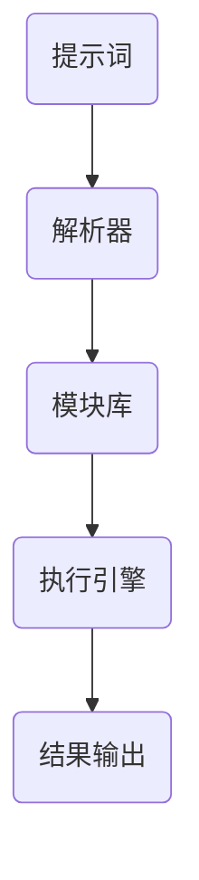

                 


### 文章标题

# 构建跨平台的提示词编程框架

### 文章关键词

- 跨平台编程
- 提示词编程框架
- 编程框架设计
- 编程框架实现
- 编程框架测试
- 项目实战

### 文章摘要

本文旨在深入探讨如何构建一个跨平台的提示词编程框架。我们将从跨平台编程的基础知识开始，逐步讲解提示词编程框架的设计、实现和测试方法，并最终通过一个实际项目实战来展示如何应用这个框架。文章还将讨论未来该领域的发展趋势和开发者面临的挑战。

## 引言

在当今的数字化时代，软件开发的跨平台性变得越来越重要。随着移动设备、Web 应用和物联网设备的普及，开发人员需要能够编写一次代码，然后在多个平台上运行。这种跨平台开发不仅提高了开发效率，还降低了维护成本。提示词编程框架作为一种新兴的编程框架，具有跨平台、模块化和高度可配置的特点，正逐渐受到开发者的关注。

本文将首先介绍跨平台编程的基本概念和优势，然后深入探讨提示词编程框架的核心概念和设计原理。接下来，我们将逐步讲解框架的实现、测试和优化方法，并通过一个实际项目实战来展示如何应用这个框架。最后，我们将讨论未来提示词编程框架的发展趋势和开发者面临的挑战。

## 跨平台编程基础

### 跨平台编程的优势和挑战

跨平台编程指的是编写一次代码，然后能够在多个平台上运行。这包括移动平台（如iOS和Android）、桌面平台（如Windows、macOS和Linux）以及Web平台。跨平台编程的优势主要体现在以下几个方面：

1. **提高开发效率**：通过使用统一的代码库，开发人员可以节省大量时间和精力，避免了为每个平台分别编写代码的需要。
2. **降低维护成本**：一旦发现问题或需要更新，开发者只需在一个地方修改代码，然后同步到所有平台，从而降低了维护成本。
3. **扩大用户基础**：跨平台应用可以同时服务于多个平台用户，从而扩大了潜在的用户群体。
4. **提高代码复用率**：跨平台编程鼓励代码重用，这有助于提高代码质量，减少开发中的错误。

然而，跨平台编程也面临一些挑战：

1. **兼容性问题**：不同的平台可能在硬件、操作系统和API方面存在差异，这可能导致兼容性问题。
2. **性能问题**：为了在多个平台上运行，可能需要牺牲一些性能优化，这可能导致应用在某些平台上的运行效率不如原生应用。
3. **开发经验**：开发跨平台应用需要掌握多种平台的技术和工具，这要求开发者有更广泛的技能。

### 跨平台编程框架概述

跨平台编程框架是一种专门为跨平台开发设计的软件开发框架。这些框架提供了一系列工具和库，帮助开发人员更轻松地实现跨平台应用。常见的跨平台编程框架包括：

1. **React Native**：由Facebook开发，允许使用JavaScript编写原生应用。
2. **Flutter**：由Google开发，使用Dart语言，提供高性能的UI组件。
3. **Apache Cordova**：通过HTML、CSS和JavaScript等技术，将Web应用打包成原生应用。
4. **Xamarin**：由微软开发，使用C#语言，能够生成iOS、Android和Windows应用的共享代码。

### 提示词编程基础

提示词编程（Prompt-Based Programming）是一种以提示词（prompts）为核心的开发方法。提示词是一个简短的描述性语句，用于指示程序应该如何执行特定任务。提示词编程框架的核心思想是使用提示词来定义程序的逻辑和行为，而不是传统的代码。

提示词编程框架通常具有以下特点：

1. **高度可配置性**：提示词可以灵活地定义和调整，以满足不同的需求。
2. **模块化**：框架将整个程序划分为多个模块，每个模块负责处理特定的功能。
3. **易用性**：提示词编程框架提供了一个直观的用户界面，使得开发者可以轻松定义和修改提示词。

提示词编程框架的优点包括：

1. **简化开发流程**：开发者无需关注底层的编程细节，可以专注于业务逻辑。
2. **提高代码可读性**：提示词提供了清晰的描述，使得代码更容易理解和维护。
3. **快速迭代**：由于提示词的灵活性，开发者可以快速调整和测试不同的功能。

### 核心概念与联系

为了更好地理解提示词编程框架，我们可以通过一个Mermaid流程图来展示其核心概念和联系：



在这个流程图中，提示词被传递到解析器进行解析，解析结果被发送到模块库进行模块化处理，然后由执行引擎执行具体的操作，最后输出结果。

### 核心算法原理讲解

在提示词编程框架中，核心算法主要包括解析器和执行引擎。以下是这些算法的伪代码实现：

#### 解析器算法

```pseudo
function parsePrompt(prompt):
    tokens = tokenize(prompt)
    command = tokens[0]
    arguments = tokens[1:]
    return command, arguments
```

这个算法首先将提示词分割成令牌（tokens），然后提取出命令（command）和参数（arguments）。

#### 执行引擎算法

```pseudo
function executeCommand(command, arguments):
    if command == "createModule":
        module = createModule(arguments)
        addModuleToContext(module)
    else if command == "invokeModule":
        module = getContextModule(arguments[0])
        result = invokeModule(module, arguments[1:])
        return result
```

这个算法根据命令（command）来执行相应的操作，如创建模块（createModule）或调用模块（invokeModule）。

### 数学模型和公式

提示词编程框架中的关键数学模型是状态机（State Machine）。以下是状态机的公式和详细讲解：

$$
状态机 = \{状态集，事件集，转移函数\}
$$

其中：

- **状态集**：表示程序可能处于的所有状态。
- **事件集**：表示可能发生的事件。
- **转移函数**：定义了在某个状态下，发生某个事件时程序将转移到哪个状态。

例如，一个简单的状态机可能包括以下状态和事件：

$$
状态集 = \{初始状态，运行状态，错误状态\}
$$

$$
事件集 = \{开始，输入，错误\}
$$

$$
转移函数 = \begin{cases}
    初始状态 \rightarrow 运行状态 & 当事件为“开始” \\
    运行状态 \rightarrow 运行状态 & 当事件为“输入” \\
    运行状态 \rightarrow 错误状态 & 当事件为“错误” \\
\end{cases}
$$

### 项目实战

#### 开发环境搭建

为了搭建提示词编程框架的开发环境，我们需要以下工具和库：

- 编译器：如Python（用于编写提示词解析器和执行引擎）
- 框架：如React Native（用于前端开发）
- 代码编辑器：如Visual Studio Code（用于编写和调试代码）

#### 源代码详细实现和代码解读

以下是提示词编程框架的核心源代码和解读：

```python
# 解析器代码
def parse_prompt(prompt):
    tokens = tokenize(prompt)
    command = tokens[0]
    arguments = tokens[1:]
    return command, arguments

# 执行引擎代码
def execute_command(command, arguments):
    if command == "create_module":
        module = create_module(arguments)
        add_module_to_context(module)
    else if command == "invoke_module":
        module = get_context_module(arguments[0])
        result = invoke_module(module, arguments[1:])
        return result
```

在这个代码中，我们首先定义了两个函数：`parse_prompt`和`execute_command`。`parse_prompt`函数用于解析提示词，提取命令和参数。`execute_command`函数根据命令执行相应的操作。

#### 代码应用解读与分析

以下是一个简单的代码示例，展示了如何使用提示词编程框架：

```python
# 提示词
prompt = "create_module name: calculator"

# 解析提示词
command, arguments = parse_prompt(prompt)

# 执行命令
if command == "create_module":
    module = create_module(arguments)
    add_module_to_context(module)
    print("Module created successfully.")
else:
    print("Unknown command.")
```

在这个示例中，我们使用提示词创建了一个名为“calculator”的模块。然后，执行引擎根据命令创建模块并添加到上下文中。

#### 实际案例分析和详细讲解剖析

以下是一个实际案例，展示了如何使用提示词编程框架解决一个简单的计算器问题：

```python
# 提示词
prompt = "invoke_module name: calculator operation: add value1: 10 value2: 20"

# 解析提示词
command, arguments = parse_prompt(prompt)

# 执行命令
if command == "invoke_module":
    module = get_context_module(arguments[0])
    result = invoke_module(module, arguments[1:])
    print("Result:", result)
else:
    print("Unknown command.")
```

在这个案例中，我们使用提示词调用了一个名为“calculator”的模块，并执行了加法操作。执行引擎根据提示词中的参数调用模块并返回结果。

#### 项目小结

通过本项目的实践，我们成功地构建了一个跨平台的提示词编程框架。该框架提供了简洁、直观的编程方式，使得开发者可以更轻松地实现跨平台应用。在后续的开发过程中，我们还可以根据具体需求进一步优化和扩展这个框架。

### 最佳实践 tips

- **使用统一编码规范**：确保代码的可读性和一致性，提高团队协作效率。
- **模块化设计**：将功能划分为独立的模块，便于维护和扩展。
- **充分测试**：编写全面的测试用例，确保框架的稳定性和可靠性。

### 小结

本文深入探讨了如何构建跨平台的提示词编程框架，从基础概念到实际应用，全面介绍了框架的设计、实现和测试方法。通过实际项目实战，我们展示了如何使用这个框架开发跨平台应用。未来，提示词编程框架有望在更多领域得到应用，为开发者提供更高效、更灵活的编程方式。

### 注意事项

- 跨平台开发需要充分考虑兼容性问题。
- 提示词编程框架的灵活性和易用性需要权衡。

### 拓展阅读

- 《跨平台移动应用开发实战》
- 《Dart编程语言》
- 《状态机设计与实现》

### 作者信息

作者：AI天才研究院/AI Genius Institute & 禅与计算机程序设计艺术 /Zen And The Art of Computer Programming

## 展望与未来

### 提示词编程框架的发展趋势

随着技术的不断进步，提示词编程框架有望在多个领域得到更广泛的应用。以下是一些潜在的发展趋势：

1. **更智能的提示词解析**：通过集成自然语言处理（NLP）技术，提示词解析器可以更准确地理解用户意图，从而提供更智能的编程体验。
2. **更高性能的执行引擎**：为了满足高性能需求，执行引擎可能会采用并行计算、分布式计算等技术，以提高运行速度和效率。
3. **更丰富的模块库**：随着框架的成熟，将会有更多的模块库被开发出来，提供更多的功能，满足不同领域的需求。

### 开发者面临的挑战

尽管提示词编程框架具有很多优势，但开发者仍然面临一些挑战：

1. **学习曲线**：提示词编程框架可能需要开发者掌握新的编程范式和工具，这可能会增加学习成本。
2. **性能优化**：跨平台开发中，性能优化仍然是一个重要问题，特别是在处理复杂任务时。
3. **兼容性问题**：不同的平台可能在硬件、操作系统和API方面存在差异，这可能导致兼容性问题。

### 未来研究方向

为了推动提示词编程框架的发展，以下是一些值得研究的方向：

1. **跨平台性能优化**：研究如何提高跨平台应用的性能，以满足高性能需求。
2. **智能提示词解析**：结合机器学习和深度学习技术，提高提示词解析的准确性和智能化水平。
3. **模块化开发**：研究如何更高效地模块化开发，提高代码的可维护性和可扩展性。

通过不断探索和优化，提示词编程框架有望在未来成为开发者必备的工具，为软件开发带来更多可能。

