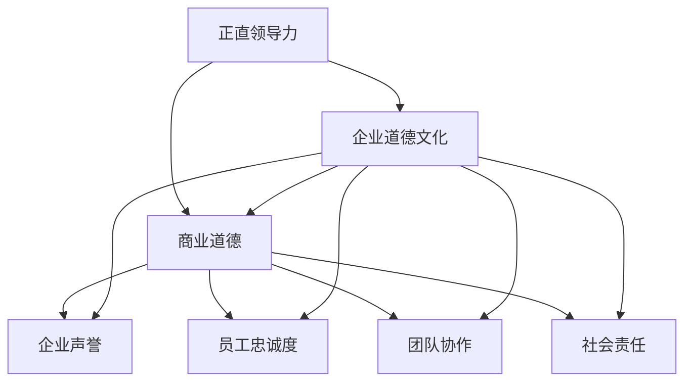

                 

### 摘要

在当今复杂多变的商业环境中，正直领导力不仅是企业持续发展的重要支柱，更是社会进步的关键推动力。《正直领导力：在商业道德中树立标杆》旨在探讨如何在商业道德的框架内，培养和践行正直领导力。本文将深入剖析正直领导力的基本概念、核心原则及其与商业道德的紧密关系，并提供一系列实用的方法和策略，帮助领导者树立道德标杆，构建健康、高效的团队和组织。通过成功案例的分析，本文将展示正直领导力在实际应用中的成效，并展望其未来的发展趋势。通过本文的阅读，读者不仅能理解正直领导力的深刻内涵，还能获得实际操作的指导，助力自身和企业的成长。

### 正直领导力的概念与重要性

#### 什么是正直领导力？

正直领导力是一种以道德伦理为核心，强调公正、诚信和责任感的领导方式。它不仅仅是一种行为准则，更是一种领导者内心深处的信念和价值观。正直领导力不仅仅是表面上的正直行为，而是贯穿于领导者的决策过程、日常管理和人际交往中的内在品质。它要求领导者具备高度的自我意识，能够正视自身的弱点，勇于承担责任，并在面对道德困境时做出正确选择。

#### 正直领导力的重要性

1. **企业声誉的提升**：正直领导力有助于树立良好的企业形象，增强企业的品牌价值。在信息透明度极高的今天，企业的声誉往往直接关系到其市场份额和长期发展。一个正直的领导者能够赢得员工的信任和客户的尊重，从而提升企业的竞争力。

2. **员工忠诚度的提高**：正直领导力能够营造一个公平、公正的工作环境，使员工感受到尊重和信任。在这样的环境中，员工更有动力投入到工作中，提高工作效率和创造力。此外，正直的领导者还会关注员工的职业发展，提供必要的培训和指导，从而增强员工的忠诚度和归属感。

3. **团队协作的加强**：正直领导力有助于建立高效的团队协作机制。领导者通过公平、公正的决策和透明的沟通，确保团队成员之间建立互信，减少冲突和误解。这种健康的团队关系不仅能够提高工作效率，还能够激发团队的创造力和创新精神。

4. **社会责任的履行**：正直领导力强调企业对社会的责任，要求企业在追求经济利益的同时，积极履行社会责任。这种责任意识不仅有助于提升企业的社会形象，还能够为企业赢得更多的社会资源和合作机会。

#### 正直领导力与商业道德的关系

正直领导力与商业道德之间存在着紧密的联系。商业道德是指企业在经营活动中应遵循的伦理规范和价值观，它涵盖了诚信、公平、责任等多个方面。正直领导力正是商业道德在领导实践中的具体体现。

1. **正直领导力是商业道德的实践者**：正直的领导者以身作则，将商业道德融入日常管理和决策中，成为企业道德文化的倡导者和践行者。

2. **商业道德是正直领导力的基础**：商业道德为正直领导力提供了行为准则和道德框架，使其在领导过程中有据可依，有矩可循。

3. **二者相互促进**：正直领导力通过实践商业道德，推动企业形成良好的道德文化，而良好的道德文化又为正直领导力的实施提供了坚实的基础。这种相互促进的关系使得企业在道德方面不断发展，实现长期可持续发展。

#### 核心概念原理之间的关系架构

为了更好地理解正直领导力与商业道德之间的关系，我们可以使用Mermaid流程图来展示核心概念原理之间的互动关系。

该流程图清晰地展示了正直领导力与商业道德之间的相互作用及其对企业声誉、员工忠诚度、团队协作和社会责任等方面的积极影响。

#### 总结

正直领导力不仅是企业领导者的必备品质，也是企业持续发展的关键因素。通过深入理解正直领导力的概念和重要性，以及其与商业道德的紧密关系，领导者能够更好地在实践中树立道德标杆，推动企业的健康发展。在接下来的章节中，我们将进一步探讨商业道德的基本原则与规范，以及如何在实际领导中践行正直领导力。

### 商业道德的基本原则与规范

商业道德是企业长期稳定发展的基石，它涵盖了企业在经营活动中应遵循的一系列伦理规范和价值观。以下将详细介绍商业道德的核心原则与相关法律法规，以便领导者更好地理解和遵守商业道德。

#### 公平交易原则

公平交易原则是商业道德的核心之一，强调在市场交易中应当遵循公平、公正的原则。这意味着企业应在市场准入、价格制定、竞争行为等方面遵守相关法律法规，不得采取欺诈、垄断等不公平手段获取利益。

1. **市场准入公平**：企业应当尊重市场规则，不得利用不正当手段获得市场准入资格，如贿赂政府官员或采取垄断行为。
2. **价格制定公正**：企业在定价过程中应充分考虑成本和市场需求，不得采取价格欺诈或价格垄断等行为。
3. **竞争行为合法**：企业应在竞争中保持诚信，不得采取恶意诋毁竞争对手、虚假宣传等不正当竞争手段。

#### 诚信原则

诚信原则是商业道德的另一个重要方面，强调企业应诚实守信，遵守承诺。诚信不仅是企业对客户、供应商和员工的承诺，也是企业对社会的责任。

1. **遵守承诺**：企业应严格按照合同约定履行各项义务，不得无故违约或延迟履行。
2. **信息披露**：企业应如实披露产品信息、财务状况等，不得隐瞒或虚假宣传。
3. **客户权益保护**：企业应尊重客户的合法权益，如隐私保护、售后服务等，不得侵犯客户利益。

#### 社会责任原则

社会责任原则要求企业在追求经济利益的同时，承担起对社会的责任。企业应当积极参与社会公益活动，关注环境保护和员工福利，促进可持续发展。

1. **公益活动参与**：企业应积极参与社会公益活动，如捐资助学、扶贫帮困等，为社会贡献力量。
2. **环境保护**：企业应采取环保措施，减少污染，保护生态环境。
3. **员工福利**：企业应关注员工福利，提供良好的工作环境和发展机会，保障员工权益。

#### 商业道德的法律法规

商业道德不仅依赖于企业的自觉遵守，也需要相关法律法规的支持和保障。以下是一些主要的商业道德法律法规：

1. **《反不正当竞争法》**：该法规定了企业在市场竞争中应遵循的公平竞争原则，禁止采取欺诈、贿赂等不正当手段。
2. **《消费者权益保护法》**：该法保护消费者的合法权益，要求企业提供真实、准确的产品信息，保障消费者权益。
3. **《环境保护法》**：该法规定了企业在环境保护方面的责任，要求企业采取环保措施，减少污染。
4. **《劳动法》**：该法规定了员工的权益保障，要求企业遵守劳动法律法规，提供良好的劳动条件。

#### 实践中的商业道德规范

在实际经营活动中，企业需要将商业道德原则落实到具体操作中，以下是一些具体的实践规范：

1. **内部控制机制**：企业应建立完善的内部控制机制，确保经营活动合规、透明。
2. **员工培训**：企业应定期开展商业道德培训，提高员工对商业道德的认识和遵守意识。
3. **社会监督**：企业应主动接受社会监督，及时纠正违规行为，提高企业的社会责任感。
4. **透明沟通**：企业应与利益相关者保持透明沟通，提高信息透明度，增强信任。

#### 总结

商业道德的基本原则和法律法规为企业的经营活动提供了明确的指导，帮助企业树立良好的社会形象，赢得公众的信任和支持。作为领导者，理解并遵守商业道德不仅是个人职责，更是企业持续发展的关键。在下一章节中，我们将探讨如何在实际领导过程中践行正直领导力，为企业的长期成功奠定基础。

### 如何在领导中实践正直领导力

在领导过程中，实践正直领导力不仅仅是口头宣言，更需要通过具体的行动和策略来落实。以下是几个关键步骤和方法，帮助领导者在实际工作中树立正直的领导形象。

#### 自我提升

1. **增强自我认知**：领导者需要首先了解自己的价值观、优点和不足。通过自我反思和他人反馈，领导者可以更加清晰地认识自我，从而在行为上保持一致。
2. **持续学习与成长**：正直领导力是一种持续发展的能力，领导者需要不断学习新的管理理念、技能和知识，以应对复杂多变的商业环境。
3. **树立道德榜样**：领导者应以身作则，成为团队中的道德榜样。通过自己的行为来影响和激励团队成员，共同营造正直的工作氛围。

#### 建立正直的组织文化

1. **明确价值观**：企业应明确其核心价值观，并将其纳入企业文化建设中。这些价值观应贯穿于企业的各项决策和行动中，成为全体员工的共同遵循准则。
2. **制定行为准则**：企业应制定具体的行为准则，明确员工在日常工作中的行为规范，如诚信、公正、透明等。这些准则应被广泛传播和执行，确保每个员工都清楚知晓并遵守。
3. **加强监督与反馈**：企业应建立有效的监督机制，对员工的行为进行监督和评估。同时，通过定期的反馈和沟通，及时发现和纠正不正直的行为，确保正直文化得到有效实施。

#### 有效沟通

1. **透明沟通**：领导者应保持沟通的透明度，及时向团队成员传达重要信息，避免信息不对称。通过透明的沟通，可以减少误解和猜疑，增强团队的信任感。
2. **倾听与理解**：领导者应倾听员工的意见和建议，理解他们的需求和困境。通过有效的倾听，领导者可以更好地了解团队的情况，做出更加合理的决策。
3. **建立反馈机制**：企业应建立有效的反馈机制，允许员工自由表达意见和建议。这不仅有助于改进工作流程，还能够增强员工的参与感和归属感。

#### 公正决策

1. **公平分配资源**：领导者应公平地分配企业资源，确保每个团队成员都能得到公平的机会和支持。通过公正的资源分配，可以激发团队成员的积极性和创造力。
2. **合理处理冲突**：领导者应合理处理团队内部的冲突，确保公正、公平地解决。通过建立公正的冲突处理机制，可以减少矛盾和误解，维护团队的和谐。
3. **公正评价员工**：领导者应公正地评价员工的工作表现，给予公平的奖励和惩罚。通过公正的评价，可以激发员工的进取心和责任感。

#### 建立信任

1. **诚实守信**：领导者应以诚实守信为行为准则，遵守承诺，不夸大事实。通过诚实守信，领导者可以赢得员工的信任和支持。
2. **信任授权**：领导者应信任并授权给下属，给予他们足够的自主权和责任。通过信任授权，可以激发下属的潜能，提高团队的工作效率。
3. **建立互信关系**：领导者应与团队成员建立互信关系，通过开放和真诚的沟通，增强团队的凝聚力和协作能力。

#### 激励与支持

1. **激励机制**：领导者应建立有效的激励机制，鼓励员工追求卓越，提高工作效率。通过激励机制，可以激发员工的积极性和创造力。
2. **提供支持**：领导者应关心员工的生活和工作，提供必要的支持和帮助。通过关心和支持，可以增强员工的归属感和忠诚度。
3. **职业发展规划**：领导者应关注员工的职业发展，提供培训和成长机会。通过职业发展规划，可以激发员工的发展动力，提高员工的综合素质。

#### 反思与改进

1. **定期反思**：领导者应定期反思自己的行为和管理方式，识别不足和改进方向。通过反思，可以不断优化自己的领导风格，提高领导能力。
2. **持续改进**：领导者应将反思结果落实到实际行动中，持续改进管理方式，提升团队的整体表现。
3. **员工反馈**：领导者应主动征求员工的反馈意见，了解他们的需求和期望，不断调整和优化管理策略。

#### 总结

实践正直领导力是一个持续的过程，需要领导者通过自我提升、建立正直文化、有效沟通、公正决策、建立信任、激励与支持等多种方式来落实。在领导过程中，领导者不仅要以身作则，树立良好的道德榜样，还要通过有效的策略和措施，推动团队和组织的发展。通过不断努力和实践，领导者可以逐步实现正直领导力的提升，为企业的长期成功奠定坚实的基础。

### 正直领导力与团队建设

在团队建设过程中，正直领导力发挥着至关重要的作用。它不仅影响着团队的凝聚力和工作效率，还直接关系到团队的创新能力和整体绩效。以下是正直领导力在团队建设中的具体作用和应用。

#### 增强团队凝聚力

1. **建立信任**：正直领导力通过诚实守信和透明沟通，建立团队成员之间的信任。信任是团队凝聚力的基础，只有信任得到保障，团队成员才能更愿意分享信息和资源，共同面对挑战。
2. **消除隔阂**：正直领导力鼓励团队成员开放表达意见和反馈，消除因信息不对称或沟通不畅而产生的隔阂。通过真诚的交流和互相理解，团队成员能够更好地协作，共同实现团队目标。

#### 提高团队工作效率

1. **规范行为**：正直领导力通过明确的行为准则和公正的评价机制，规范团队成员的行为。在一个有秩序、公平的环境中，团队成员能够集中精力工作，减少内耗和冲突，提高工作效率。
2. **激发潜力**：正直领导力鼓励团队成员发挥自己的潜力，通过信任授权和激励机制，让团队成员感受到自己的价值和重要性。在这种激励下，团队成员会更有动力去完成工作，提高工作效率。

#### 培养创新精神

1. **开放氛围**：正直领导力营造一个开放、包容的团队氛围，鼓励团队成员自由表达自己的想法和建议。这种开放性不仅能够激发创新思维，还能够促进团队内部的知识共享和合作。
2. **鼓励尝试**：正直领导力鼓励团队成员勇于尝试新方法和解决方案，即使在尝试过程中出现错误，也会得到理解和宽容。这种鼓励尝试的文化有助于培养团队的创新能力，推动团队不断进步。

#### 应用策略

1. **树立道德标杆**：领导者应以身作则，树立正直的道德标杆。通过自己的行为来影响和激励团队成员，使正直成为团队文化的核心价值。
2. **透明决策**：领导者应保持决策过程的透明度，让团队成员了解决策的依据和目的，增强他们的参与感和信任感。
3. **公平评价**：领导者应公正评价团队成员的工作表现，给予合理的奖励和惩罚，确保公平性。通过公平的评价，可以激发团队成员的积极性和创造力。

#### 成功案例

1. **案例一：谷歌的团队建设**：谷歌以其独特的团队文化而闻名，其中正直领导力起到了关键作用。谷歌的创始人谢尔盖·布林和拉里·佩奇一直强调诚信、透明和开放，这些价值观贯穿于谷歌的团队建设中。通过建立透明的沟通机制和公正的评价体系，谷歌成功地培养了一个高度协作和创新的团队，使其成为全球最具竞争力的科技公司之一。

2. **案例二：丰田的团队建设**：丰田以其精益生产模式而著称，其中正直领导力发挥了重要作用。丰田的管理者通过鼓励员工提出改进建议和参与决策，建立了一个充满信任和创新的团队。这种团队文化不仅提高了生产效率，还推动了丰田在全球汽车市场的持续成功。

#### 总结

正直领导力在团队建设中的重要性不言而喻。它不仅能够增强团队的凝聚力和工作效率，还能培养创新精神，推动团队的整体发展。通过树立道德标杆、保持透明决策和公正评价，领导者可以有效地推动团队建设，实现团队的长期成功。在未来的工作中，领导者应不断践行正直领导力，为团队的持续发展奠定坚实的基础。

### 正直领导力在组织管理中的应用

#### 正直领导力与组织战略制定

正直领导力在组织战略制定中起着至关重要的作用。一个正直的领导者能够确保组织战略的制定过程透明、公正，并且符合企业的价值观。以下是正直领导力在组织战略制定中的应用：

1. **明确价值观**：正直领导力强调企业价值观的重要性，领导者应在战略制定过程中明确企业的核心价值观，并将其融入战略目标和决策中。这有助于确保组织战略的一致性和长期可持续发展。

2. **透明沟通**：在制定战略时，正直领导力要求领导者与团队成员保持透明沟通，及时分享战略目标和决策依据。这不仅有助于团队成员理解战略的意义，还能激发他们的参与感和责任感。

3. **集体决策**：正直领导力提倡集体决策，通过团队讨论和多方意见征集，确保战略决策的合理性和公正性。这种集体决策过程有助于发现潜在问题，减少决策失误，提高战略的成功率。

#### 正直领导力与组织绩效管理

正直领导力在组织绩效管理中能够有效提高组织的整体绩效和员工的工作满意度。以下是正直领导力在组织绩效管理中的应用：

1. **公平评价**：正直领导力强调公平评价，要求领导者根据客观标准和实际工作表现来评价员工，确保评价过程的公正性和透明度。这种公平的评价机制能够激发员工的工作积极性，提高工作绩效。

2. **激励机制**：正直领导力鼓励建立有效的激励机制，通过合理的奖励和晋升机制，激励员工追求卓越。这种激励机制不仅能够提高员工的工作效率，还能增强员工的忠诚度和归属感。

3. **持续反馈**：正直领导力强调持续反馈，领导者应定期与员工进行绩效沟通，提供具体的反馈和建议，帮助员工不断改进工作。这种持续的反馈机制有助于提高员工的工作技能和职业发展。

#### 正直领导力与组织变革与转型

在组织变革和转型过程中，正直领导力能够为组织提供稳定的支持和方向。以下是正直领导力在组织变革与转型中的应用：

1. **清晰愿景**：正直领导力要求领导者制定清晰的变革愿景和目标，通过透明沟通和积极引导，使全体员工理解变革的重要性和必要性。

2. **信任建设**：正直领导力强调建立信任，通过开放的沟通和诚信的行为，赢得员工的信任和支持。这种信任关系有助于减少变革过程中的阻力，提高变革的执行效率。

3. **持续支持**：正直领导力要求领导者持续关注员工的反馈和需求，提供必要的支持和资源，确保变革过程的顺利进行。通过持续的支持，领导者能够有效应对变革中的各种挑战，推动组织成功转型。

#### 成功案例

1. **案例一：亚马逊的变革管理**：亚马逊的创始人杰夫·贝索斯是一位正直领导力的典范。在亚马逊的发展历程中，贝索斯始终坚持开放沟通和诚信管理，确保组织战略的透明性和公正性。在面临数字化转型和物流优化等重大变革时，贝索斯通过明确的愿景、信任建设和持续支持，成功引导亚马逊实现了多次组织变革和转型，使其成为全球最具竞争力的电子商务公司之一。

2. **案例二：谷歌的企业文化**：谷歌以其独特的企业文化而闻名，其中正直领导力发挥了关键作用。谷歌的领导者通过明确价值观、透明沟通和集体决策，确保组织战略的合理性和执行效果。在面临行业变革和市场竞争时，谷歌通过持续的变革管理和员工支持，成功实现了多次组织转型，保持了全球科技行业的领先地位。

#### 总结

正直领导力在组织管理中的应用具有重要意义。它能够确保组织战略的制定、绩效管理和变革过程透明、公正和有效，为组织的长期成功提供坚实的基础。通过树立正直的领导形象、建立透明沟通机制和持续反馈机制，领导者能够推动组织不断进步，实现持续发展。在未来的管理实践中，领导者应不断践行正直领导力，为组织的发展注入持续的动力。

### 正直领导力与个人成长

#### 正直领导力对个人成长的影响

正直领导力不仅是企业成功的关键，也是个人职业发展的重要助力。通过正直领导力的实践，个人能够在职业道路上取得更大的成就，并在个人成长过程中获得诸多益处。

1. **提升个人影响力**：正直领导力强调诚信和公正，这使领导者能够在团队和行业中树立良好的形象，赢得他人的信任和尊重。个人影响力是职业成功的重要标志，正直领导力能够为个人在职场中建立稳固的社交网络，拓展职业发展空间。

2. **增强职业竞争力**：在商业环境中，正直的领导风格往往能够吸引优秀的人才和合作伙伴，这为个人带来了更多职业发展的机会。此外，正直的领导力也使个人在面对职业挑战时，能够更加自信和坚定，从容应对各种复杂的商业环境。

3. **促进职业发展**：正直领导力强调持续学习和自我提升，这有助于个人不断提升自身的专业技能和管理能力。在一个正直的领导环境中，个人更容易获得职业发展的机会，实现职业目标。

#### 正直领导力与个人成长的相互促进

正直领导力不仅影响个人成长，同时个人成长也会对正直领导力的发展产生积极影响。以下为两者相互促进的关系：

1. **自我反思与提升**：个人成长过程中，自我反思和自我提升是必不可少的。通过不断反思自己的行为和决策，个人能够发现自身的不足和改进方向，从而提升自己的正直领导力。

2. **学习与实践**：个人成长过程中的学习与实践是提升正直领导力的重要途径。通过参加培训、阅读相关书籍、实践管理经验，个人能够不断积累知识和技能，提升自己的领导水平。

3. **价值观的塑造**：个人成长过程中，个人价值观的塑造对正直领导力的发展至关重要。一个拥有正确价值观的人，更容易在实践中表现出正直的行为，树立良好的道德榜样。

#### 成功案例

1. **案例一：阿里巴巴的马云**：作为阿里巴巴的创始人，马云以其正直和领导力赢得了全球的认可。他始终坚持诚信经营，关心员工的福祉，并通过持续学习和自我提升，带领阿里巴巴成为全球领先的电子商务公司。马云的成功故事展示了正直领导力对个人成长和职业发展的巨大影响。

2. **案例二：苹果公司的史蒂夫·乔布斯**：乔布斯是苹果公司的创始人之一，他以卓越的产品设计和正直的商业道德闻名。乔布斯始终坚信产品的质量和用户体验，通过不断的创新和自我提升，他不仅将苹果公司带向了成功，也为自己赢得了无数赞誉和荣誉。乔布斯的成功证明了正直领导力对个人成长和职业成就的重要作用。

#### 总结

正直领导力不仅对个人成长具有重要意义，同时也是个人职业发展的关键因素。通过正直领导力的实践，个人能够提升自己的影响力、增强职业竞争力，并实现职业发展。同时，个人成长也会对正直领导力的发展产生积极影响，形成相互促进的关系。在未来的职业生涯中，领导者应不断践行正直领导力，通过自我提升和实践，实现个人和职业的共同成长。

### 成功案例与分析

在本章节中，我们将通过两个成功的商业案例，深入探讨正直领导力在不同企业和行业中的具体应用及其成效。

#### 案例一：苹果公司

苹果公司以其独特的企业文化和正直领导力而闻名。其创始人史蒂夫·乔布斯始终坚持正直的商业道德，致力于生产高品质的产品和提供卓越的用户体验。

1. **正直领导力的具体表现**：
   - **诚信经营**：乔布斯始终强调产品的质量和真实性，即使在面临激烈的市场竞争时，也不妥协产品的品质。
   - **透明管理**：苹果公司在产品研发和发布过程中，保持与消费者的透明沟通，如实披露产品的功能和特点。
   - **员工福利**：苹果公司重视员工的职业发展和福利，提供丰富的培训和良好的工作环境。

2. **成效分析**：
   - **品牌声誉**：通过正直的经营理念和领导风格，苹果公司赢得了全球消费者的信任和喜爱，品牌声誉不断提升。
   - **市场竞争力**：苹果公司的高品质产品和卓越的用户体验使其在市场中保持强大的竞争力，市场份额稳步增长。
   - **员工满意度**：苹果公司的员工福利和职业发展机会吸引了大量优秀人才，员工满意度高，离职率低。

#### 案例二：丰田公司

丰田公司以其精益生产模式和正直领导力在汽车行业中取得了巨大的成功。丰田的管理者通过持续改进和正直的领导风格，实现了生产效率和市场地位的不断提升。

1. **正直领导力的具体表现**：
   - **团队合作**：丰田强调团队合作，鼓励员工提出改进建议，并通过集体决策来优化生产流程。
   - **透明沟通**：丰田公司建立了一套透明的沟通机制，确保员工和管理层之间的信息畅通，减少误解和冲突。
   - **持续改进**：丰田公司不断进行生产流程的改进，追求卓越，通过持续改进来提升产品质量和效率。

2. **成效分析**：
   - **生产效率**：通过团队合作和持续改进，丰田公司的生产效率大幅提升，生产成本降低，产品质量不断提高。
   - **市场地位**：丰田公司凭借其高质量和高效的生产模式，在汽车市场中保持了领先地位，市场份额不断扩大。
   - **员工参与度**：丰田公司的正直领导力和团队合作文化激发了员工的积极性和参与度，员工的满意度和忠诚度较高。

#### 从案例中总结的经验教训

1. **诚信经营是企业的基石**：无论在何种行业，诚信经营都是企业长期发展的关键。通过诚信经营，企业能够赢得消费者的信任和尊重，建立良好的品牌声誉。

2. **透明沟通是团队协作的前提**：在一个开放、透明的环境中，团队成员能够更好地理解企业的目标和策略，减少误解和冲突，提高团队协作效率。

3. **持续改进是提升竞争力的关键**：在不断变化的市场环境中，企业需要通过持续改进来提升产品质量和效率，以应对激烈的竞争。

4. **关注员工福利和职业发展**：关注员工的福利和职业发展不仅能够提高员工的满意度和忠诚度，还能吸引和留住优秀人才，为企业的长期发展提供人力支持。

#### 总结

通过分析苹果公司和丰田公司的成功案例，我们可以看到正直领导力在商业实践中的重要性。无论是在企业文化建设、市场竞争力提升，还是在员工满意度和团队协作方面，正直领导力都发挥着关键作用。在未来的商业环境中，领导者应不断践行正直领导力，通过诚信经营、透明沟通和持续改进，推动企业实现长期可持续发展。

### 结论

正直领导力作为一种以道德伦理为核心的领导方式，不仅对企业的发展和员工的成长具有深远影响，也是社会进步的重要推动力。本文通过深入探讨正直领导力的概念、基本原则与规范，以及其在领导实践中的具体应用，揭示了其在商业道德中的标杆作用。正直领导力不仅能够提升企业的声誉、增强员工的忠诚度和工作效率，还能推动团队协作、创新精神和社会责任感的培养。同时，通过成功案例的分析，我们看到了正直领导力在实际应用中的巨大成效。

在未来的商业环境中，正直领导力将越来越受到重视。随着社会对商业道德的关注度提高，企业和领导者需要不断提升自身的正直领导力，以应对日益复杂的商业挑战。为此，我们提出以下建议：

1. **培养正直价值观**：企业和领导者应将正直价值观融入企业文化中，通过培训和宣传，让全体员工明确正直领导力的重要性。

2. **建立透明机制**：企业应建立透明、公正的管理和决策机制，确保信息的透明和决策的合理性，增强员工的信任和参与感。

3. **持续改进**：企业和领导者应不断反思和改进自身的领导方式，通过持续学习和实践，提升正直领导力。

4. **关注社会责任**：企业和领导者应关注社会和环境问题，积极履行社会责任，以实际行动树立正直的标杆。

通过以上措施，企业和领导者不仅能够提升自身的竞争力，还能为社会创造更多的价值和贡献。正直领导力不仅是企业持续发展的动力，也是社会进步的重要保障。在未来的商业实践中，让我们共同努力，践行正直领导力，推动企业和社会的和谐发展。

### 作者信息

作者：AI天才研究院/AI Genius Institute & 禅与计算机程序设计艺术 /Zen And The Art of Computer Programming

