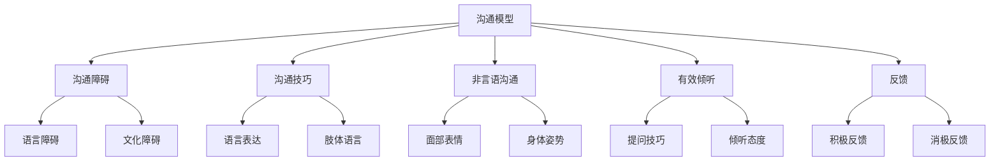

                 

### 文章标题: 沟通的艺术：领导者必备的软实力

#### 关键词：
- 沟通
- 领导力
- 模型
- 技巧
- 反馈

#### 摘要：
本文深入探讨沟通艺术在领导力中的应用，通过分析沟通的核心概念、模型、技巧和反馈机制，帮助领导者提升软实力，实现高效沟通。文章采用逻辑清晰、结构紧凑的技术语言，结合实际案例，展示沟通策略在组织管理中的重要性。

## 引言

沟通是领导者不可或缺的软实力，它不仅影响团队协作和决策质量，还关系到组织的整体效能。有效沟通能够促进理解、减少误解、增强团队凝聚力，从而推动组织目标的实现。本文将从以下几个方面展开讨论：沟通概述、沟通模型与技巧、数学模型与公式、项目实战以及最佳实践。

### 核心概念与联系

沟通的核心概念包括沟通模型、沟通障碍、沟通技巧、非言语沟通、有效倾听和反馈。以下是一个简化的Mermaid流程图，展示了这些概念之间的联系：



#### 沟通模型

沟通模型描述了信息传递的过程。一个基本的沟通模型包括发送者、信息、渠道、接收者和反馈。以下是沟通模型的伪代码表示：

```pseudo
function Communication Model(message, sender, receiver, channel)
    message = sender.encodeMessage()
    channel.transmitMessage(message)
    receiver.decodeMessage(message)
    feedback = receiver.sendFeedback()
    sender.receiveFeedback(feedback)
end function
```

#### 沟通障碍

沟通障碍分为语言障碍和文化障碍。语言障碍包括词汇、语法、方言和语义理解等问题，而文化障碍则涉及价值观、习俗和信仰的差异。以下是对沟通障碍的详细解释：

- 语言障碍
  - 词汇：不同文化背景下的词汇理解差异。
  - 语法：语言结构不同导致的理解困难。
  - 方言：地域性的语言差异。
  - 语义理解：多义词、双关语等造成的误解。

- 文化障碍
  - 价值观：不同文化对同一行为的评价可能不同。
  - 习俗：文化习惯的差异导致的行为不一致。
  - 信仰：宗教信仰的差异可能引发沟通障碍。

#### 沟通技巧

沟通技巧是有效沟通的关键。以下是一些核心沟通技巧：

- 语言表达：清晰、简洁、有逻辑的语言表达。
- 肢体语言：适当的肢体语言可以增强语言的效果。
- 非言语沟通：面部表情、身体姿势等非言语信息的理解与运用。
- 有效倾听：通过提问和倾听态度，确保理解对方的信息。
- 反馈：给予及时、积极的反馈，以促进沟通的循环。

#### 数学模型与公式

在沟通艺术中，数学模型可以用来评估沟通效果。一个简单的沟通效果评估公式如下：

$$
E = w_1 \cdot L + w_2 \cdot E + w_3 \cdot R
$$

其中，$E$ 是沟通效果，$L$ 是语言表达，$E$ 是情感表达，$R$ 是关系表达，$w_1, w_2, w_3$ 是相应的权重。

#### 项目实战

为了展示沟通技巧的实际应用，我们设计了一个团队会议项目。以下是项目流程：

1. **会议组织计划**：确定会议目标、议程和参与者。
2. **沟通策略选择**：根据会议性质选择合适的沟通策略（如直接沟通、协作沟通或 empathetic沟通）。
3. **开发环境搭建**：准备会议所需的工具和技术平台。
4. **会议议程安排**：制定详细的会议议程，确保会议高效进行。
5. **会议记录与反馈**：记录会议内容和关键点，收集与会者的反馈。
6. **改进措施实施**：根据反馈调整会议流程，提高沟通效果。

#### 最佳实践

- **持续学习**：领导者应持续学习沟通技巧，以适应不断变化的工作环境。
- **注意非语言沟通**：肢体语言和面部表情在沟通中起到关键作用。
- **积极倾听**：倾听是沟通的核心，领导者应培养积极的倾听态度。
- **反馈机制**：建立有效的反馈机制，以促进团队沟通的改进。

## 结论

沟通是领导者必备的软实力，它对组织的成功至关重要。本文通过分析沟通的核心概念、模型、技巧和反馈机制，为领导者提供了提升沟通能力的实用策略。通过不断实践和反思，领导者可以不断提高自己的沟通水平，为团队和组织创造更大的价值。

### 作者信息

- 作者：AI天才研究院/AI Genius Institute & 禅与计算机程序设计艺术 /Zen And The Art of Computer Programming

