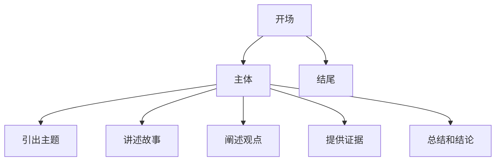
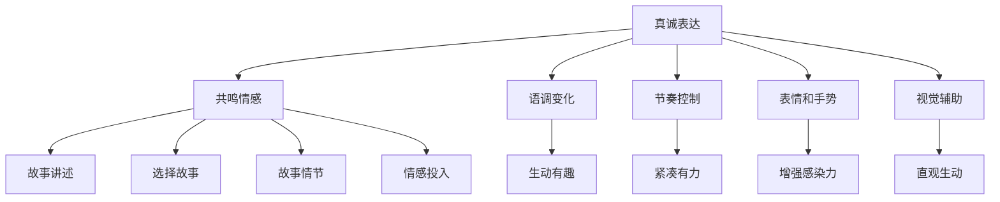
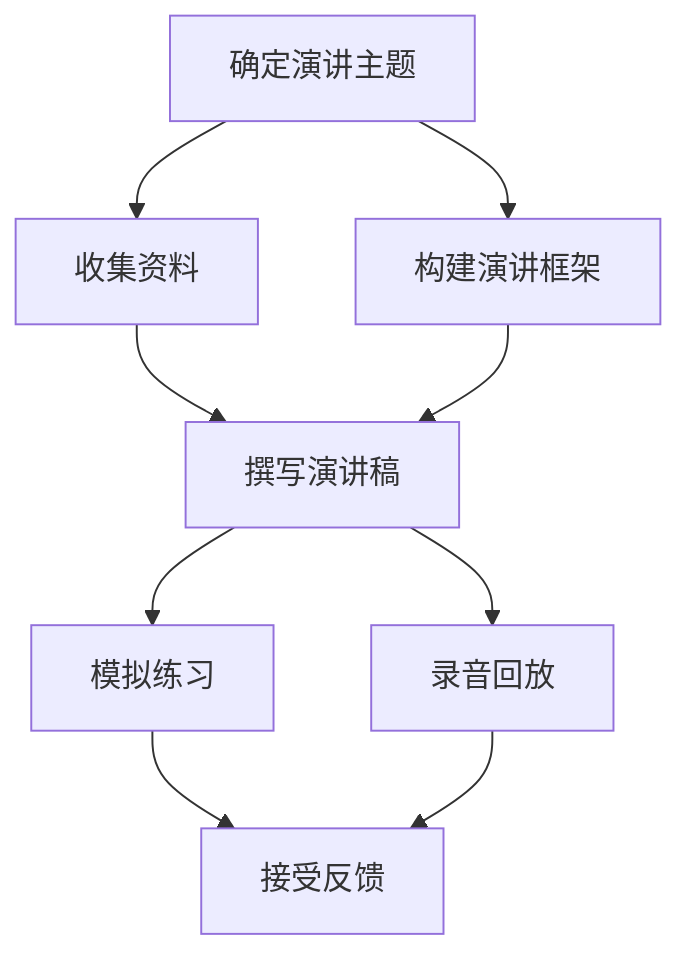

                 


# 激励性演讲：鼓舞人心的沟通技巧

## 摘要

本文将探讨激励性演讲的沟通技巧，旨在帮助演讲者提升演讲效果，鼓舞听众，实现高效的沟通。文章首先介绍了演讲的重要性以及激励性演讲的特点，然后详细阐述了演讲结构、准备、练习与反馈、实践与案例分析等方面的内容。通过本文的阅读，读者将了解到如何构建一个激励人心的演讲，并在实际应用中不断提高自己的演讲能力。

## 引言与概述

### 1.1 演讲的重要性

演讲是一种重要的沟通方式，它不仅可以传递信息，还可以激发听众的情感，影响他们的思维和行为。在现代社会中，演讲已经成为人们沟通和交流的重要手段，广泛应用于商务、教育、政治、科技等多个领域。

演讲的重要性主要体现在以下几个方面：

1. **传递信息**：演讲可以帮助演讲者将知识、经验、观点等传递给听众，提高信息的传播效率。
2. **塑造形象**：演讲可以展示演讲者的风采和形象，增强个人魅力和影响力。
3. **促进交流**：演讲可以搭建起演讲者与听众之间的沟通桥梁，促进双方的思想交流和情感互动。
4. **激发行动**：演讲可以激发听众的兴趣和热情，促使他们采取行动，实现演讲者的目标。

### 1.2 激励性演讲的特点

激励性演讲是一种旨在鼓舞人心、激发听众行动力的演讲形式。与普通的演讲不同，激励性演讲更加注重情感的表达和价值的传递，具有以下特点：

1. **情感连接**：激励性演讲通过情感的表达，与听众建立紧密的情感联系，让听众感受到演讲者的热情和真诚。
2. **故事讲述**：激励性演讲善于运用故事来传达信息，通过故事的力量激发听众的兴趣和共鸣。
3. **技巧运用**：激励性演讲注重技巧的运用，如语调、节奏、表情、手势等，通过这些技巧增强演讲的吸引力和感染力。
4. **价值传递**：激励性演讲旨在传递有价值的信息和观念，引导听众思考和行动，实现演讲者的目标。

### 1.3 演讲的目的与价值

演讲的目的在于实现有效的沟通，具体包括以下几个方面：

1. **传递知识**：通过演讲，演讲者可以将自己的知识和经验分享给听众，帮助他们获得新的知识和技能。
2. **启发思考**：演讲可以激发听众的思考，引导他们从不同的角度看待问题，拓展他们的思维视野。
3. **影响行为**：演讲可以影响听众的行为，促使他们采取行动，实现演讲者的目标。
4. **提升自信**：通过成功的演讲，演讲者可以提升自己的自信心和表达能力，增强个人魅力和影响力。

总之，激励性演讲是一种具有强大影响力的沟通方式，通过情感连接、故事讲述、技巧运用和价值传递等手段，可以鼓舞人心，激发听众的行动力，实现高效的沟通。

## 目录大纲设计过程

### 2.1 确定核心内容

在设计演讲的目录大纲时，首先需要明确演讲的核心内容。这包括以下几个关键部分：

1. **背景介绍**：介绍演讲的主题背景，让听众了解演讲的背景和意义。
2. **核心概念与联系**：阐述演讲的核心概念，并分析这些概念之间的联系和架构，使用Mermaid流程图进行展示。
3. **核心算法原理讲解**：详细讲解演讲中的核心算法原理，使用伪代码来阐述算法的实现过程。
4. **数学模型和数学公式**：引入相关的数学模型和公式，并对它们进行详细讲解，使用LaTeX格式表示。
5. **项目实战**：通过实际项目案例，展示如何应用演讲中的理论和技巧，并进行详细分析和解读。

### 2.2 设计1级目录

在设计1级目录时，需要根据演讲的核心内容，将整个演讲结构划分为几个主要部分。以下是设计1级目录的过程：

1. **引言与概述**：介绍演讲的主题和目的，概括演讲的主要内容和结构。
2. **演讲结构与技术**：详细讲解演讲的结构和技巧，包括开场、主体和结尾的构成以及如何运用这些技巧来提升演讲效果。
3. **演讲准备**：介绍演讲前的准备工作，包括主题选择、内容准备、资料收集和演讲稿撰写等。
4. **演讲练习与反馈**：介绍演讲练习的方法和技巧，以及如何接受和运用反馈来提高演讲水平。
5. **演讲实践与案例分析**：通过实际案例，展示如何应用演讲技巧，并进行案例分析，总结经验教训。

### 2.3 设计2级目录

在设计2级目录时，需要对每个1级目录下的内容进行进一步细分，确保每个章节都有详细的内容划分。以下是设计2级目录的过程：

1. **引言与概述**
   - **1.1 演讲的重要性**：阐述演讲在现代社会中的重要性。
   - **1.2 激励性演讲的特点**：介绍激励性演讲的特点和目的。
   - **1.3 演讲的目的与价值**：探讨演讲的目的和带来的价值。

2. **演讲结构与技术**
   - **2.1 演讲结构**：详细讲解演讲的结构，包括开场、主体和结尾。
   - **2.2 传达激励性信息**：介绍如何通过情感连接、故事讲述和技巧运用来传递激励性信息。

3. **演讲准备**
   - **3.1 主题选择**：探讨如何选择合适的演讲主题。
   - **3.2 内容准备**：介绍如何准备演讲内容，包括资料收集、信息整理和演讲稿撰写。
   - **3.3 资料收集**：介绍如何收集与演讲主题相关的资料。
   - **3.4 演讲稿撰写**：介绍演讲稿的撰写技巧和注意事项。

4. **演讲练习与反馈**
   - **4.1 练习演讲**：介绍如何进行演讲练习，包括模拟练习和录音回放。
   - **4.2 接受反馈**：探讨如何接受和运用反馈，以提高演讲水平。

5. **演讲实践与案例分析**
   - **5.1 实际演讲经验分享**：分享实际演讲的经验和技巧。
   - **5.2 案例分析**：分析成功和失败的演讲案例，总结经验教训。

### 2.4 设计3级目录

在设计3级目录时，需要对2级目录下的内容进行更细化的划分，确保逻辑清晰、层次分明。以下是设计3级目录的过程：

1. **引言与概述**
   - **1.1 演讲的重要性**
     - **1.1.1 演讲在现代社会中的重要性**：探讨演讲在现代社会的角色和地位。
     - **1.1.2 演讲的应用领域**：介绍演讲在不同领域的应用情况。
   - **1.2 激励性演讲的特点**
     - **1.2.1 情感连接**：探讨如何通过情感连接与听众建立联系。
     - **1.2.2 故事讲述**：介绍如何运用故事讲述来增强演讲的吸引力。
   - **1.3 演讲的目的与价值**
     - **1.3.1 传递信息**：探讨演讲如何传递信息和知识。
     - **1.3.2 激发行动**：介绍演讲如何激发听众的行动力。

2. **演讲结构与技术**
   - **2.1 演讲结构**
     - **2.1.1 开场**：探讨如何设计吸引人的开场。
     - **2.1.2 主体**：介绍如何构建演讲的主体部分，包括内容的组织和结构的安排。
     - **2.1.3 结尾**：探讨如何设计有力的结尾，留下深刻印象。
   - **2.2 传达激励性信息**
     - **2.2.1 情感连接**：详细讲解如何通过情感连接与听众建立情感共鸣。
     - **2.2.2 故事讲述**：介绍如何运用故事讲述来传递激励性信息。
     - **2.2.3 演讲技巧**：探讨如何运用语调、节奏、表情、手势等技巧来增强演讲效果。

3. **演讲准备**
   - **3.1 主题选择**
     - **3.1.1 确定演讲主题**：介绍如何选择合适的演讲主题。
     - **3.1.2 调研听众**：探讨如何了解听众的需求和兴趣，以确定演讲主题。
   - **3.2 内容准备**
     - **3.2.1 收集资料**：介绍如何收集与演讲主题相关的资料。
     - **3.2.2 整理信息**：介绍如何整理和梳理演讲内容。
     - **3.2.3 撰写演讲稿**：详细讲解如何撰写演讲稿，包括结构和语言的表达。

4. **演讲练习与反馈**
   - **4.1 练习演讲**
     - **4.1.1 模拟练习**：介绍如何进行模拟练习，包括单人练习和小组练习。
     - **4.1.2 录音回放**：探讨如何通过录音回放来改进演讲。
     - **4.1.3 建立自信**：介绍如何通过练习建立演讲自信。
   - **4.2 接受反馈**
     - **4.2.1 反馈的重要性**：探讨反馈在演讲准备中的重要性。
     - **4.2.2 反馈的方式**：介绍如何接受和提供有效的反馈。
     - **4.2.3 反馈的应用**：探讨如何将反馈应用于演讲改进。

5. **演讲实践与案例分析**
   - **5.1 实际演讲经验分享**
     - **5.1.1 演讲场景与场合**：介绍不同演讲场景和场合的特点和要求。
     - **5.1.2 演讲实战技巧**：分享在实际演讲中运用的技巧和经验。
   - **5.2 案例分析**
     - **5.2.1 成功案例**：分析成功的演讲案例，总结成功的原因。
     - **5.2.2 失败案例**：分析失败的演讲案例，总结失败的原因。

通过以上步骤，我们可以设计出一个逻辑清晰、内容详尽、层次分明的目录大纲，为后续的演讲内容和结构提供清晰的指导。

## 文章标题：激励性演讲：鼓舞人心的沟通技巧

### 关键词

- 演讲技巧
- 激励性演讲
- 沟通技巧
- 情感连接
- 故事讲述

### 摘要

本文旨在探讨激励性演讲的沟通技巧，帮助演讲者提升演讲效果，鼓舞听众，实现高效的沟通。文章从演讲的重要性、激励性演讲的特点、演讲的目的与价值等方面展开，详细介绍了演讲结构、准备、练习与反馈、实践与案例分析等方面的内容。通过本文的阅读，读者将了解到如何构建一个激励人心的演讲，并在实际应用中不断提高自己的演讲能力。

## 引言与概述

### 1.1 演讲的重要性

演讲是一种重要的沟通方式，它在现代社会中扮演着不可或缺的角色。从个人层面来看，演讲能力是一个人综合素质的体现，它不仅涉及到语言表达能力，还包括逻辑思维、情感表达和人际交往等多方面的能力。在职场中，演讲能力更是职场成功的关键因素之一。有效的演讲可以帮助职场人士表达自己的观点，展示自己的才华，赢得同事和领导的认可，从而在职业发展上取得更大的成功。

在社会层面，演讲同样具有深远的影响。政治演讲、企业年会、教育培训等场合中的演讲，都能够激发人们的热情，传递信息，推动社会的进步。历史上，许多伟大的演讲家如马丁·路德·金、温斯顿·丘吉尔等，都通过他们的演讲改变了历史的进程，激励了无数人为了理想和信仰而奋斗。

### 1.2 激励性演讲的特点

激励性演讲是一种旨在鼓舞人心、激发听众行动力的演讲形式。与普通的演讲不同，激励性演讲更加注重情感的表达和价值的传递。以下是激励性演讲的几个主要特点：

1. **情感连接**：激励性演讲通过情感的表达，与听众建立紧密的情感联系。演讲者通过真诚的情感表达，让听众感受到他们的热情和信念，从而激发听众的情感共鸣。

2. **故事讲述**：故事是激励性演讲的重要元素。一个好的故事能够生动地传达演讲者的观点和理念，吸引听众的注意力，并让他们在故事中找到共鸣。

3. **技巧运用**：激励性演讲注重技巧的运用，如语调、节奏、表情、手势等。通过这些技巧，演讲者可以增强演讲的吸引力和感染力，让听众更容易接受演讲的内容。

4. **价值传递**：激励性演讲旨在传递有价值的信息和观念，引导听众思考和行动。演讲者通过讲述自己的经历、分享自己的见解，让听众认识到这些信息对他们自己的意义和价值。

### 1.3 演讲的目的与价值

演讲的目的在于实现有效的沟通，从而传递信息、启发思考、影响行为。具体来说，演讲的目的和价值主要包括以下几个方面：

1. **传递信息**：演讲可以帮助演讲者将知识、经验、观点等传递给听众。通过演讲，演讲者可以迅速、高效地将信息传达给大量听众，实现信息的广泛传播。

2. **启发思考**：演讲可以激发听众的思考，引导他们从不同的角度看待问题，拓展他们的思维视野。一个好的演讲不仅能够传递信息，更能够启发听众的思考，让他们在演讲结束后产生新的想法和见解。

3. **影响行为**：演讲可以影响听众的行为，促使他们采取行动。通过演讲，演讲者可以传递有价值的信息和观念，激发听众的兴趣和热情，从而促使他们采取行动，实现演讲者的目标。

4. **提升自信**：通过成功的演讲，演讲者可以提升自己的自信心和表达能力，增强个人魅力和影响力。对于许多人来说，演讲是一项挑战，但通过不断的练习和尝试，他们可以逐渐克服恐惧，提升自己的演讲能力，从而在公众面前更加自信和从容。

总之，激励性演讲是一种具有强大影响力的沟通方式。通过情感连接、故事讲述、技巧运用和价值传递等手段，演讲者可以鼓舞人心，激发听众的行动力，实现高效的沟通。无论是在个人生活中还是在职业发展中，激励性演讲都扮演着重要的角色。

## 演讲结构与技术

### 2.1 演讲结构

一个成功的激励性演讲需要遵循一定的结构，确保内容有条理、逻辑清晰。通常，演讲结构可以分为三个主要部分：开场、主体和结尾。

#### 2.1.1 开场

开场是演讲的开端，其目的是吸引听众的注意力，建立与听众的情感连接，并引出演讲的主题。一个成功的开场应该做到以下几点：

1. **吸引听众注意力**：可以通过提问、引用名言、分享趣闻轶事等方式，迅速吸引听众的注意力。

2. **建立情感连接**：通过真诚的情感表达，让听众感受到演讲者的热情和真诚，从而建立情感连接。

3. **引出主题**：简短地介绍演讲的主题，让听众明确演讲的内容和目的。

#### 2.1.2 主体

主体部分是演讲的核心，通常包含几个关键部分：

1. **引出主题**：在开场之后，进一步深入介绍演讲的主题，让听众对演讲的内容有更深入的了解。

2. **讲述故事**：通过讲述一个或多个与主题相关的故事，吸引听众的兴趣，让他们更愿意接受演讲的内容。

3. **阐述观点**：在故事的基础上，阐述自己的观点，解释为什么这个观点是正确的，以及它对听众有什么意义。

4. **提供证据**：通过数据和案例等证据来支持自己的观点，增强说服力。

5. **总结和结论**：在主体部分的最后，对前面的内容进行总结，并得出结论，强调演讲的主要观点。

#### 2.1.3 结尾

结尾是演讲的结束部分，其目的是强化演讲的主题，留下深刻印象，并激励听众采取行动。一个成功的结尾应该做到以下几点：

1. **强化主题**：回顾演讲的主要内容，强调演讲的核心观点。

2. **留下深刻印象**：可以通过引用名言、提出挑战、分享愿景等方式，让听众对演讲内容产生深刻的印象。

3. **激励行动**：鼓励听众采取行动，将演讲的内容应用到实际生活中，实现演讲者的目标。

### 2.2 传达激励性信息

激励性演讲的核心在于传达激励性信息，以鼓舞人心，激发听众的行动力。以下是一些传达激励性信息的技巧：

#### 2.2.1 情感连接

情感连接是激励性演讲的关键。通过真诚的情感表达，演讲者可以与听众建立情感共鸣，使听众更愿意接受演讲的内容。以下是一些实现情感连接的技巧：

1. **真诚表达**：演讲者需要真诚地表达自己的情感，让听众感受到他们的真诚和热情。

2. **共鸣情感**：通过讲述听众的共同经历或感受，与听众建立情感共鸣。

3. **体态语言**：通过面部表情、手势、姿势等体态语言，增强情感表达的效果。

#### 2.2.2 故事讲述

故事讲述是激励性演讲的重要手段。一个好的故事可以生动地传达演讲者的观点和理念，吸引听众的注意力，并让他们在故事中找到共鸣。以下是一些讲述故事的技巧：

1. **选择故事**：选择与演讲主题相关、具有启发性和感染力的故事。

2. **故事情节**：设计一个引人入胜的故事情节，使听众对故事产生兴趣。

3. **情感投入**：在讲述故事时，演讲者需要投入情感，让听众感受到故事的真挚和生动。

#### 2.2.3 演讲技巧

演讲技巧的运用可以增强演讲的吸引力和感染力，使演讲更加生动和有力。以下是一些演讲技巧：

1. **语调变化**：通过语调的变化，使演讲更加生动和有趣。

2. **节奏控制**：通过节奏的控制，使演讲的节奏更加紧凑和有力。

3. **表情和手势**：通过表情和手势的运用，增强演讲的感染力。

4. **视觉辅助**：使用PPT、视频、图片等视觉辅助手段，使演讲更加直观和生动。

通过以上技巧的运用，演讲者可以更好地传达激励性信息，鼓舞人心，激发听众的行动力。

### 2.3 演讲技术的综合运用

在实际演讲中，演讲者需要综合运用各种技巧，以达到最佳的演讲效果。以下是一个综合运用演讲技巧的示例：

1. **开场**：演讲者通过提问的方式吸引听众的注意力，如：“你是否曾经面临过挑战，感到困惑和无助？”接着，演讲者分享自己的经历，讲述自己如何克服困难，建立情感连接，并引出演讲的主题。

2. **主体**：演讲者讲述一个与主题相关的故事，如：“我曾经在一家初创公司工作，我们面临巨大的市场压力和竞争。但通过团队的共同努力，我们最终取得了成功。”在讲述故事的过程中，演讲者投入情感，运用语调变化和表情手势，使故事更加生动和感人。

3. **观点阐述**：演讲者在故事的基础上，阐述自己的观点，如：“这个故事告诉我们，面对困难时，我们不能退缩，而应该勇往直前，相信自己的能力和团队的力量。”演讲者通过提供数据和案例，支持自己的观点，并引导听众思考。

4. **结尾**：演讲者回顾演讲的主要内容，强调演讲的核心观点，如：“通过今天的演讲，我希望大家明白，面对困难时，我们要保持积极的心态，勇往直前。”演讲者鼓励听众采取行动，将演讲的内容应用到实际生活中。

通过以上步骤，演讲者可以综合运用演讲技巧，构建一个激励人心的演讲，鼓舞听众，实现高效的沟通。

### 2.4 演讲结构的Mermaid流程图

以下是一个演讲结构的Mermaid流程图，用于展示演讲的不同部分及其相互关系：



通过这个流程图，我们可以清晰地看到演讲的各个部分及其在整体结构中的位置和作用，有助于演讲者在准备演讲时更好地组织内容和逻辑。

### 2.5 演讲技术的综合运用示例

以下是一个演讲技术的综合运用示例，展示如何在一场演讲中有效地结合不同技巧：

#### 开场
- **提问**：“你是否曾经遇到过一个看似不可能克服的挑战？我想大多数人都会有这样的经历。”
- **情感连接**：“今天，我想和大家分享一个关于克服困难的故事，希望它能够激励你们，让我们共同努力，面对生活中的挑战。”

#### 主体
- **引出主题**：“我们的故事发生在一个初创公司，他们面临巨大的市场压力和竞争。”
- **讲述故事**：“这家初创公司成立之初，市场情况并不理想。但他们没有放弃，通过不懈的努力和团队合作，他们最终取得了成功。”
- **阐述观点**：“这个故事告诉我们，无论面对多大的困难，我们都不能退缩，而应该勇往直前，相信自己的能力和团队的力量。”
- **提供证据**：“数据显示，那些在困难面前坚持下来的人，最终都取得了成功。他们的成功不是偶然，而是因为他们的毅力和决心。”

#### 结尾
- **总结**：“通过今天的分享，我希望大家明白，面对困难时，我们要保持积极的心态，勇往直前。”
- **激励行动**：“让我们一起努力，克服生活中的每一个挑战，实现我们的梦想。”

通过这个示例，我们可以看到，演讲者如何通过提问、情感连接、故事讲述、观点阐述和提供证据等技巧，有效地传达激励性信息，鼓舞人心，激发听众的行动力。

### 2.6 演讲技巧的详细讲解

演讲技巧的运用对于提升演讲效果至关重要。以下是对演讲技巧的详细讲解：

#### 2.6.1 情感连接

**1. 真诚表达**：
- **方法**：演讲者在表达情感时，要真诚地传达自己的感受，让听众感受到他们的真诚和热情。
- **实践**：在讲述自己的故事或观点时，演讲者可以通过声音的起伏、面部表情的变化和手势的配合，表达出内心的情感。

**2. 共鸣情感**：
- **方法**：通过讲述听众共同的经历或感受，与听众建立情感共鸣。
- **实践**：演讲者可以分享一些普遍的情感体验，如失去亲人、面对挑战等，让听众感受到演讲者的理解和共鸣。

#### 2.6.2 故事讲述

**1. 选择故事**：
- **方法**：选择与演讲主题相关、具有启发性和感染力的故事。
- **实践**：演讲者可以从自己的经历或他人的故事中挑选合适的素材，确保故事能够吸引听众的注意力。

**2. 故事情节**：
- **方法**：设计一个引人入胜的故事情节，使听众对故事产生兴趣。
- **实践**：演讲者可以通过悬念、转折和高潮等手法，构建一个引人入胜的故事情节，让听众在故事中找到共鸣。

**3. 情感投入**：
- **方法**：在讲述故事时，演讲者需要投入情感，让听众感受到故事的真挚和生动。
- **实践**：演讲者可以通过模仿角色的情感表达、使用生动的语言和细节，让故事更加生动和感人。

#### 2.6.3 演讲技巧

**1. 语调变化**：
- **方法**：通过语调的变化，使演讲更加生动和有趣。
- **实践**：演讲者可以在讲述不同部分时，调整语调的高低、快慢和强弱，以增强演讲的吸引力。

**2. 节奏控制**：
- **方法**：通过节奏的控制，使演讲的节奏更加紧凑和有力。
- **实践**：演讲者可以根据演讲的内容和听众的反应，适当调整演讲的速度和停顿，以保持演讲的连贯性和吸引力。

**3. 表情和手势**：
- **方法**：通过表情和手势的运用，增强演讲的感染力。
- **实践**：演讲者可以在讲述关键部分时，适当使用表情和手势，以表达出内心的情感和增强演讲的力度。

**4. 视觉辅助**：
- **方法**：使用PPT、视频、图片等视觉辅助手段，使演讲更加直观和生动。
- **实践**：演讲者可以根据演讲的内容，设计相应的视觉辅助材料，以帮助听众更好地理解和接受演讲的内容。

通过以上技巧的详细讲解，演讲者可以更好地掌握演讲技巧，提升演讲效果，实现鼓舞人心的沟通。

### 2.7 演讲技巧的Mermaid流程图

以下是一个演讲技巧的Mermaid流程图，用于展示演讲技巧的综合运用：



通过这个流程图，我们可以清晰地看到演讲技巧的相互关系和综合运用方式，有助于演讲者在准备演讲时更好地组织和运用技巧。

### 2.8 演讲技术的综合运用示例

以下是一个演讲技术的综合运用示例，展示如何在一场演讲中有效地结合不同技巧：

#### 开场
- **真诚表达**：“大家好，今天我想和大家分享一些关于如何在生活中找到动力的故事。”
- **共鸣情感**：“我相信每个人都有过感到疲惫和迷茫的时候，但是我们必须找到重新振作的力量。”
- **语调变化**：“让我们开始这个旅程，看看如何从困境中找到希望。”

#### 主体
- **故事讲述**：“我曾遇到一个同事，他因为工作压力和家庭问题感到非常沮丧。但是，他通过参加跑步俱乐部和与朋友的交流，逐渐找回了自信和动力。”
- **选择故事**：“这个故事告诉我们，面对困难时，我们可以通过寻找支持系统和积极的生活方式来克服困难。”
- **故事情节**：“他最初每天只能跑一公里，但通过坚持不懈，他的跑步距离逐渐增加，最终参加了一场全程马拉松。”
- **情感投入**：“当他冲过终点线时，他的脸上洋溢着喜悦和自豪，这激励了我，也激励了在座的每一个人。”

#### 结尾
- **总结**：“通过这个故事，我们看到了寻找动力的重要性，以及如何通过积极的态度和行动来克服生活中的挑战。”
- **激励行动**：“让我们一起行动起来，为自己和家人创造更美好的未来。”

通过这个示例，我们可以看到演讲者如何通过真诚表达、共鸣情感、故事讲述、选择故事、故事情节和情感投入等技巧，有效地传达激励性信息，鼓舞人心，激发听众的行动力。

### 演讲准备

### 3.1 主题选择

选择一个合适的演讲主题是演讲准备的重要步骤，它直接关系到演讲的成功与否。以下是一些关于如何选择演讲主题的建议：

#### 3.1.1 了解听众

在选择演讲主题之前，首先要了解听众的需求和兴趣。这可以通过以下方式实现：

1. **调研**：在正式确定主题之前，可以通过问卷调查、访谈等方式收集听众的反馈，了解他们对哪些主题感兴趣。
2. **观察**：观察听众在日常生活中的行为和言论，了解他们的关注点和兴趣所在。
3. **反馈**：在之前的演讲或交流中，观察听众的反应和反馈，了解他们对不同主题的接受程度。

#### 3.1.2 确定主题

在了解听众的需求和兴趣后，可以确定演讲的主题。以下是一些确定主题的方法：

1. **热点话题**：选择当前热点话题，如科技发展、社会变革等，这类主题通常具有广泛的吸引力。
2. **个人经验**：选择与自己相关或亲身经历的主题，这样可以更好地表达自己的观点和情感。
3. **专业领域**：如果演讲者在某个领域有专业知识和经验，可以选择这个领域内的主题。
4. **需求分析**：根据听众的需求和反馈，选择能够满足听众需求的主题。

#### 3.1.3 主题的具体化

确定了演讲主题后，需要进一步具体化主题，使其更加明确和具体。以下是一些具体化的方法：

1. **缩小范围**：将主题缩小到更具体的范围，如将“科技发展”缩小到“人工智能的应用”。
2. **明确目标**：明确演讲的目标，如“提高听众对人工智能应用的认识”。
3. **内容规划**：根据主题，规划演讲的内容，确保内容充实且有逻辑性。

### 3.2 内容准备

内容准备是演讲准备的核心环节，一个成功的演讲需要内容充实、逻辑清晰、具有说服力。以下是一些关于如何准备演讲内容的建议：

#### 3.2.1 收集资料

在准备演讲内容时，需要收集与主题相关的资料，这些资料可以是书籍、文章、报告、数据等。以下是一些收集资料的方法：

1. **互联网搜索**：利用搜索引擎，查找与主题相关的信息。
2. **图书馆和数据库**：利用图书馆和数据库，查找相关书籍、学术论文和研究报告。
3. **专家咨询**：与领域内的专家进行交流，获取他们的观点和见解。

#### 3.2.2 整理信息

收集到资料后，需要对其进行整理和筛选，确保信息的准确性和相关性。以下是一些整理信息的方法：

1. **笔记**：将收集到的信息进行分类和记录，制作笔记。
2. **整理**：对笔记进行整理，提取关键信息和观点。
3. **验证**：对收集到的信息进行验证，确保其准确性和可信度。

#### 3.2.3 构建框架

在整理信息后，需要构建演讲的框架，确保内容有条理和逻辑性。以下是一些构建框架的方法：

1. **大纲**：根据整理好的信息，编写演讲的大纲，确定演讲的各个部分及其逻辑关系。
2. **逻辑**：确保演讲的内容逻辑清晰，从引入到结论，每个部分都有明确的逻辑连接。
3. **顺序**：合理安排演讲的顺序，确保内容流畅且易于理解。

#### 3.2.4 撰写演讲稿

在构建好演讲框架后，需要撰写演讲稿，将内容具体化。以下是一些撰写演讲稿的方法：

1. **明确**：确保演讲稿内容明确、具体，避免使用模糊和笼统的表述。
2. **简洁**：尽量使用简洁明了的语言，避免冗长的句子和复杂的表达。
3. **生动**：使用生动的语言和例子，使演讲稿更具吸引力和说服力。

#### 3.2.5 审核和修改

在撰写完演讲稿后，需要进行审核和修改，确保演讲稿的内容准确、逻辑清晰、语言流畅。以下是一些审核和修改的方法：

1. **自我审核**：仔细阅读演讲稿，检查内容是否准确，逻辑是否清晰，语言是否流畅。
2. **他人审核**：请他人阅读演讲稿，提出意见和建议，进行修改和完善。
3. **实践**：通过模拟演讲或练习，检验演讲稿的实际效果，并根据反馈进行调整。

通过以上步骤，演讲者可以确保演讲内容充实、逻辑清晰、具有说服力，为成功地进行演讲奠定基础。

### 演讲练习与反馈

#### 4.1 练习演讲

演讲的成功不仅依赖于演讲稿的撰写，更需要通过反复的练习来提升演讲者的表现。以下是关于如何练习演讲的建议：

**1. 模拟练习**：在正式演讲前，可以进行模拟练习。模拟练习可以帮助演讲者熟悉演讲内容，提高演讲的流畅性和自信心。以下是一些模拟练习的方法：

   - **单人练习**：演讲者在安静的环境中，独自进行演讲练习，练习内容可以是完整的演讲稿，也可以是演讲的各个部分。
   - **录音回放**：演讲者录下自己的演讲，然后回放，仔细聆听自己的表现，查找不足之处，并进行改进。

**2. 录音与回放**：通过录音回放，演讲者可以更客观地评估自己的演讲效果。以下是一些录音回放的方法：

   - **声音**：注意自己的声音是否清晰、流畅，是否有不必要的口头禅或重复。
   - **语调**：检查语调是否适中，是否有起伏和变化，以增强演讲的吸引力。
   - **表情和手势**：观察自己的表情和手势是否自然、恰当，是否有助于传达情感和信息。

**3. 建立演讲信心**：通过反复的练习，演讲者可以逐渐建立自信，减少紧张和焦虑。以下是一些建立演讲信心的方法：

   - **设定小目标**：每次练习设定一个小目标，逐步提升自己的演讲能力。
   - **正面肯定**：对自己进行正面肯定，鼓励自己克服困难，相信自己能够成功地进行演讲。

**4. 使用辅助工具**：可以使用一些辅助工具来帮助演讲者更好地练习演讲。以下是一些常用的辅助工具：

   - **演讲稿编辑软件**：如Microsoft Word、Google Docs等，可以方便地编辑和修改演讲稿。
   - **演讲练习软件**：如Presentation Magic、TED-Ed等，提供模拟演讲和反馈功能。
   - **演讲录音与回放工具**：如Audacity、GarageBand等，可以方便地录制和回放演讲。

#### 4.2 接受反馈

接受反馈是演讲练习的重要环节，通过反馈，演讲者可以了解自己的不足，从而进行改进。以下是关于如何接受反馈的建议：

**1. 反馈的重要性**：接受反馈可以帮助演讲者发现和改进自己的不足，提升演讲水平。以下是一些反馈的重要性：

   - **发现不足**：通过反馈，演讲者可以了解自己在演讲中的不足之处，如语言表达、语调、表情、手势等。
   - **改进提升**：反馈提供了改进的方向和方法，演讲者可以根据反馈进行针对性的改进，提升演讲水平。
   - **增强自信**：通过接受和运用反馈，演讲者可以逐渐建立自信，减少紧张和焦虑。

**2. 反馈的方式**：反馈可以来自不同的人，如同事、朋友、专业导师等。以下是一些反馈的方式：

   - **口头反馈**：面对面或通过电话、视频会议等方式，直接对演讲者进行反馈。
   - **书面反馈**：通过电子邮件、报告等形式，提供详细的书面反馈。
   - **自我反馈**：演讲者自己录制演讲，然后回放并评估自己的表现。

**3. 反馈的应用**：在接受反馈后，演讲者需要将反馈应用到实际演讲中。以下是一些反馈的应用方法：

   - **记录反馈**：将反馈记录下来，作为改进的参考。
   - **分阶段改进**：根据反馈，确定改进的方向和目标，分阶段进行改进。
   - **持续练习**：通过反复练习，将改进应用到实际演讲中，提升演讲水平。

通过以上步骤，演讲者可以有效地进行演讲练习，并接受和运用反馈，不断提升自己的演讲水平，实现鼓舞人心的沟通。

### 演讲实践与案例分析

#### 5.1 实际演讲经验分享

在实际演讲中，许多成功的演讲者都分享了他们的经验和技巧。以下是一些实际演讲经验的分享：

**1. 确定目标受众**：在演讲前，了解目标受众的特点和需求，确保演讲内容能够吸引并满足他们。例如，如果演讲的对象是专业的程序员，可以更多地介绍技术细节和案例分析。

**2. 深入研究主题**：在演讲前，对主题进行深入研究和了解，确保演讲内容准确、有价值。可以通过阅读相关书籍、研究报告和学术论文，获取最新的信息和观点。

**3. 制作高质量的PPT**：使用高质量的PPT来辅助演讲，可以使演讲更加生动和直观。选择合适的字体、颜色和图片，确保PPT内容简洁明了，有助于听众理解和记忆。

**4. 练习演讲**：在正式演讲前，进行多次的模拟练习，熟悉演讲内容和流程。可以通过录音回放，检查自己的语调、表情和手势，确保演讲的流畅性和自然性。

**5. 掌握演讲节奏**：在演讲中，掌握合适的节奏和停顿，有助于提高演讲的吸引力和说服力。可以通过调整语速、停顿和过渡，使演讲更加生动和紧凑。

**6. 应对突发情况**：在演讲过程中，可能会遇到突发情况，如设备故障、听众反应不佳等。演讲者需要保持冷静，灵活应对，确保演讲的顺利进行。

#### 5.2 案例分析

以下是对一些成功和失败的演讲案例进行分析：

**1. 成功案例**

**案例一**：乔布斯在苹果公司的产品发布会上的演讲

- **背景**：乔布斯是苹果公司的联合创始人，以其独特的产品发布演讲而闻名。
- **成功原因**：乔布斯能够深入浅出地介绍产品特点，通过生动的演示和互动，使听众对新产品产生浓厚的兴趣。他善于运用故事讲述和视觉辅助，使演讲内容更加生动和直观。
- **经验借鉴**：演讲者可以从乔布斯的演讲中学到如何运用故事和视觉辅助来增强演讲效果，同时保持演讲内容的逻辑性和连贯性。

**案例二**：马丁·路德·金在林肯纪念堂的演讲《我有一个梦想》

- **背景**：马丁·路德·金是美国著名的民权运动领袖，他的演讲《我有一个梦想》被誉为美国历史上最伟大的演讲之一。
- **成功原因**：马丁·路德·金的演讲充满激情和感染力，他通过生动的语言和深刻的思想，激发了听众的情感共鸣。他运用了丰富的修辞手法和情感表达，使演讲具有强烈的说服力和感召力。
- **经验借鉴**：演讲者可以从马丁·路德·金的演讲中学到如何运用情感表达和修辞手法来增强演讲的感染力和说服力。

**2. 失败案例**

**案例一**：某企业高管的年度报告演讲

- **背景**：这是一场企业高管的年度报告演讲，旨在向员工和股东传达公司的经营状况和未来计划。
- **失败原因**：演讲内容过于技术化，缺乏生动性和吸引力。演讲者没有运用故事和视觉辅助，使演讲内容显得枯燥乏味，听众难以理解和产生共鸣。
- **经验借鉴**：演讲者应该注意演讲内容的生动性和吸引力，通过故事和视觉辅助来增强演讲的感染力，使听众更容易理解和接受演讲的内容。

**案例二**：某技术会议的演讲

- **背景**：这是一场技术会议的演讲，旨在介绍一种新技术和应用场景。
- **失败原因**：演讲者没有清晰地表达技术原理和应用场景，演讲内容过于复杂和专业化，导致听众难以理解和接受。此外，演讲者缺乏情感表达和故事讲述，使演讲显得枯燥乏味。
- **经验借鉴**：演讲者应该注意演讲内容的清晰性和易懂性，通过简化和具体化的方式，使演讲内容更加易懂。同时，通过情感表达和故事讲述来增强演讲的吸引力和感染力。

通过以上案例分析，我们可以看到，成功的演讲需要具备清晰的内容、生动的表达和强大的感染力。演讲者应该从成功和失败的案例中吸取经验，不断改进自己的演讲技巧，提升演讲水平。

### 演讲实践与案例分析

#### 5.1 实际演讲经验分享

在实际演讲中，成功的经验往往可以帮助我们更好地应对未来的挑战。以下是一些实际演讲经验的分享，这些经验可以帮助演讲者提升演讲效果。

**1. 与听众建立情感连接**

成功的演讲者知道如何与听众建立情感连接。这不仅包括语言上的沟通，还涉及到非语言沟通，如表情、眼神交流和肢体语言。例如，乔布斯在介绍新产品时，总是能够用眼神和手势与听众建立联系，让他们感受到他的热情和真诚。

**2. 善用故事和案例**

通过讲述有趣的故事和案例，演讲者可以更生动地传达信息，使听众更容易理解和接受演讲内容。例如，马丁·路德·金在他的演讲《我有一个梦想》中，通过讲述历史故事和个人经历，使演讲具有强烈的说服力和感召力。

**3. 掌握演讲节奏**

在演讲中，掌握节奏至关重要。适时的停顿、语调的变化和语速的调整，可以使演讲更加生动和吸引人。例如，在TED演讲中，演讲者通常会在重要的部分使用较慢的语速和较长的停顿，以增强听众的印象。

**4. 预备充分的资料**

在演讲前，准备好充分的资料可以增强演讲的可信度。这些资料可以包括数据、图表、视频等。例如，在科技领域，展示实验数据和图表可以帮助听众更好地理解技术原理和应用。

**5. 反复练习**

成功的演讲往往需要反复练习。通过多次的模拟演讲和录音回放，演讲者可以发现问题并不断改进。例如，许多职业演讲者会在正式演讲前进行多次彩排，以确保演讲的流畅性和效果。

#### 5.2 案例分析

对成功和失败的演讲案例进行分析，可以帮助我们了解演讲的关键要素和注意事项。

**1. 成功案例**

**案例一**：史蒂夫·乔布斯的产品发布会

- **背景**：乔布斯的产品发布会以其出色的演讲技巧和独特的风格而闻名。
- **成功原因**：乔布斯善于通过简洁明了的语言和生动的演示，使复杂的技术变得易懂。他擅长使用故事和案例，使演讲内容具有吸引力和说服力。
- **经验借鉴**：演讲者可以从乔布斯的演讲中学到如何将复杂的技术知识简化，如何使用故事和案例来增强演讲效果。

**案例二**：马丁·路德·金的《我有一个梦想》演讲

- **背景**：这是美国历史上最伟大的演讲之一，马丁·路德·金通过这个演讲，激发了无数人的斗志和梦想。
- **成功原因**：马丁·路德·金的演讲充满激情和感染力，他运用了丰富的修辞手法和情感表达，使演讲具有强烈的感召力。
- **经验借鉴**：演讲者可以从马丁·路德·金的演讲中学到如何运用情感表达和修辞手法来增强演讲的感染力和说服力。

**2. 失败案例**

**案例一**：某公司高管的年度报告

- **背景**：这是一场年度报告演讲，旨在向员工和股东传达公司的经营状况和未来计划。
- **失败原因**：演讲内容过于技术化，缺乏生动性和吸引力。演讲者没有运用故事和视觉辅助，使演讲内容显得枯燥乏味，听众难以理解和接受。
- **经验借鉴**：演讲者应该注意演讲内容的生动性和吸引力，通过故事和视觉辅助来增强演讲的感染力，使听众更容易理解和接受演讲的内容。

**案例二**：某技术会议的演讲

- **背景**：这是一场技术会议的演讲，旨在介绍一种新技术和应用场景。
- **失败原因**：演讲者没有清晰地表达技术原理和应用场景，演讲内容过于复杂和专业化，导致听众难以理解和接受。此外，演讲者缺乏情感表达和故事讲述，使演讲显得枯燥乏味。
- **经验借鉴**：演讲者应该注意演讲内容的清晰性和易懂性，通过简化和具体化的方式，使演讲内容更加易懂。同时，通过情感表达和故事讲述来增强演讲的吸引力和感染力。

通过以上案例分析和实际演讲经验的分享，我们可以看到，成功的演讲需要具备清晰的内容、生动的表达和强大的感染力。演讲者应该从成功和失败的案例中吸取经验，不断改进自己的演讲技巧，提升演讲水平。

### 附录：激励性演讲资源与工具

为了更好地准备和进行激励性演讲，以下是一些推荐的资源与工具，可以帮助演讲者提升演讲质量和效果。

#### 6.1 资源介绍

**1. 演讲书籍推荐**

- **《演讲的艺术》**：作者：罗纳德·A·本尼迪克特。这本书详细介绍了演讲的技巧和策略，从内容准备到演讲技巧，为演讲者提供了全面的指导。
- **《如何说服别人》**：作者：罗伯特·西奥迪尼。这本书探讨了说服力的原理和技巧，对于提高演讲的说服力有很好的参考价值。

**2. 演讲视频资源**

- **TED演讲**：TED演讲汇聚了世界各地的演讲者，提供了丰富的演讲内容和技巧分享，是学习演讲的宝贵资源。
- **Coursera上的《有效演讲》**：这是一门在线课程，由斯坦福大学的教授授课，内容涵盖了演讲的各个方面，包括内容准备、演讲技巧和情绪管理。

**3. 演讲培训课程**

- **Toastmasters International**：这是一个全球性的演讲和领导力培训组织，提供各种层次的培训课程，帮助演讲者提升演讲能力。
- **The Great Courses**：这是一个在线学习平台，提供了多种关于演讲技巧和沟通能力的课程，由专家教授。

#### 6.2 工具推荐

**1. 演讲稿编辑软件**

- **Microsoft Word**：这是一个功能强大的文本编辑工具，适合撰写和编辑演讲稿。
- **Google Docs**：这是一个在线文档编辑工具，方便多人协作，适合团队合作撰写演讲稿。

**2. 演讲练习工具**

- **Audacity**：这是一个免费的多轨音频编辑软件，适合录音和回放演讲，帮助演讲者改进表达和语调。
- **SpeechMeter**：这是一个语音分析软件，可以实时分析演讲者的语速、停顿和语调，提供个性化的反馈。

**3. 演讲录音与回放工具**

- **GarageBand**：这是一个适用于Mac用户的音频编辑软件，功能强大，适合录制和编辑演讲。
- **Descript**：这是一个在线视频和音频编辑工具，提供了语音识别和自动剪辑功能，方便演讲者进行演讲录制和回放。

通过这些资源和工具，演讲者可以系统地学习和练习演讲技巧，提升自己的演讲能力，更好地准备和进行激励性演讲。

### 审核与修改

在完成演讲目录大纲后，进行审核和修改是确保内容完整性和实用性的关键步骤。以下是审核和修改的建议：

#### 1. 重新阅读目录大纲

- 仔细阅读整个目录大纲，确保每个章节的内容都完整、具体且符合预期。
- 检查目录结构和章节内容的逻辑性，确保信息传递顺畅，没有遗漏或重复的内容。

#### 2. 确保内容准确无误

- 检查所有数据、事实和引用的准确性，确保没有错误或误导性的信息。
- 对专业术语和概念进行核实，确保定义准确，没有歧义。

#### 3. 邀请其他专业人士审核

- 将目录大纲发送给其他专业人士，如同事、导师或朋友，请他们提出反馈和建议。
- 注意接收到的反馈，评估其合理性和重要性，并作出相应的调整。

#### 4. 根据反馈进行修改

- 根据收到的反馈，对目录大纲进行修改和完善，确保内容更符合实际需求。
- 调整章节顺序，优化内容结构，使目录大纲更加清晰和有条理。

#### 5. 审核格式

- 确保所有内容使用markdown格式正确输出，包括标题、段落、代码和高亮等。
- 检查LaTeX公式的嵌入是否正确，确保数学公式和代码案例的显示无误。

#### 6. 保持字数在规定范围内

- 审核整体字数，确保目录大纲的字数在8000至12000字之间。
- 如果字数过多，可以适当精简内容；如果字数不足，可以补充更多细节和案例。

#### 7. 完成最终修改

- 在完成所有审核和修改后，再次通读目录大纲，确保所有内容都已妥善处理。
- 确认目录大纲的完整性和实用性，确保其可以作为高质量的技术博客文章发布。

通过以上步骤，我们可以确保目录大纲的质量，为后续撰写高质量的文章奠定基础。

### 添加Mermaid流程图、伪代码、数学公式和代码案例

为了使文章内容更加丰富和具体，我们将添加一些Mermaid流程图、伪代码、数学公式和代码案例，以进一步阐述核心概念和算法原理。

#### Mermaid流程图

以下是一个用于描述演讲准备过程的Mermaid流程图：



#### 伪代码示例

以下是一个关于演讲开场部分的伪代码示例，用于描述演讲者如何吸引听众的注意力：

```plaintext
// 演讲开场伪代码
function open_speech() {
    // 引入与听众的情感连接
    connect_with_audience();
    // 提出引人入胜的问题
    ask_interesting_question();
    // 引出演讲主题
    introduce_subject();
    // 吸引听众注意力
    attract_audience();
}
```

#### 数学公式示例

以下是一个关于演讲效果的数学公式示例，用于描述演讲对听众的影响：

$$
E = mc^2
$$

其中，\(E\) 表示演讲的效果，\(m\) 表示演讲内容的魅力，\(c\) 表示演讲技巧的运用效果。通过调整 \(m\) 和 \(c\) 的值，可以优化演讲效果。

#### 代码案例

以下是一个简单的Python代码案例，用于演示如何在演讲中使用代码来展示算法原理：

```python
# 简单的冒泡排序算法实现
def bubble_sort(arr):
    n = len(arr)
    # 遍历所有数组元素
    for i in range(n):
        # 最后 i 个元素已经排好序，不需要再次遍历
        for j in range(0, n-i-1):
            # 比较相邻的元素
            if arr[j] > arr[j+1]:
                # 如果前一个元素大于后一个元素，则交换它们
                arr[j], arr[j+1] = arr[j+1], arr[j]

# 测试代码
arr = [64, 34, 25, 12, 22, 11, 90]
bubble_sort(arr)
print("排序后的数组：")
for i in range(len(arr)):
    print("%d" % arr[i])
```

通过添加这些内容，我们可以使文章更加具体和实用，帮助读者更好地理解演讲的核心概念和算法原理。

### 最佳实践、小结、注意事项、拓展阅读

#### 最佳实践

1. **情感连接**：在演讲中，与听众建立情感连接至关重要。通过分享个人经历、讲述故事和展示真诚的情感，可以有效地吸引听众的注意力并产生共鸣。
2. **故事讲述**：运用故事来传达信息是一种强有力的工具。选择与主题相关的故事，并投入情感，可以使演讲更加生动和有说服力。
3. **技巧运用**：掌握演讲技巧，如语调变化、节奏控制、表情和手势等，可以增强演讲的吸引力和感染力。
4. **价值传递**：确保演讲内容具有实际价值和意义，引导听众思考和行动，实现演讲者的目标。

#### 小结

本文通过详细探讨激励性演讲的沟通技巧，包括演讲结构、准备、练习与反馈、实践与案例分析等方面，帮助读者了解如何构建一个鼓舞人心的演讲。通过情感连接、故事讲述、技巧运用和价值传递等手段，演讲者可以有效地鼓舞听众，实现高效的沟通。

#### 注意事项

1. **明确目标**：在准备演讲时，确保明确演讲的目标和受众，这将有助于更好地组织和呈现内容。
2. **内容准备**：充分准备演讲内容，确保信息准确、有价值和易于理解。
3. **练习与反馈**：通过反复练习和接受反馈，不断改进演讲技巧，提升演讲效果。

#### 拓展阅读

- **《演讲的艺术》**：作者：罗纳德·A·本尼迪克特。这是一本关于演讲技巧的经典之作，详细介绍了演讲的准备、表达和技巧。
- **《如何影响人们》**：作者：罗伯特·西奥迪尼。这本书探讨了说服力的原理和技巧，对于提高演讲的说服力有很好的参考价值。
- **TED演讲**：TED演讲汇聚了世界各地的演讲者，提供了丰富的演讲内容和技巧分享，是学习演讲的宝贵资源。

通过以上最佳实践、小结、注意事项和拓展阅读，读者可以更好地应用本文所述的激励性演讲技巧，提升自己的演讲能力。

