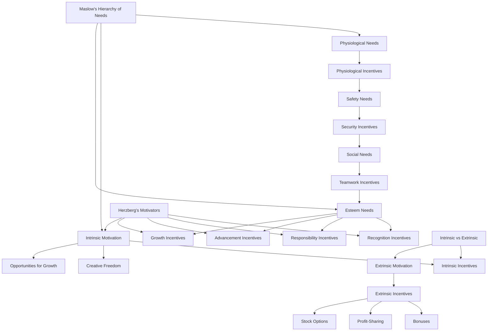

                 

### Introduction to Incentive Compensation

Incentive compensation refers to the additional pay or benefits provided to employees beyond their regular salaries as a reward for achieving specific objectives or meeting certain performance criteria. These incentives are designed to motivate employees, enhance their performance, and align individual goals with the broader objectives of the organization. While the concept is simple, the implementation of an effective incentive compensation system can be complex and challenging.

#### The Importance of Incentive Compensation

Incentive compensation plays a critical role in the success of any organization. It serves multiple purposes:

1. **Motivation and Engagement:** Incentive compensation serves as a powerful motivational tool. It rewards employees for their efforts and achievements, thereby increasing their motivation and engagement. When employees feel that their hard work is recognized and rewarded, they are more likely to be committed and productive.

2. **Performance Enhancement:** By linking compensation to performance, incentive compensation systems drive employees to achieve higher levels of performance. When employees know that their earnings are directly tied to their performance, they are motivated to work harder and smarter.

3. **Retention of Talent:** A well-designed incentive compensation system can be a key factor in retaining top talent. Employees are often attracted to organizations that offer competitive and attractive incentive packages, and they are more likely to stay with an organization that rewards their contributions.

4. **Alignment of Goals:** Incentive compensation systems help align individual goals with the overall objectives of the organization. When employees are rewarded for achieving organizational goals, they are more likely to prioritize these goals in their work.

#### Key Concepts and Terminology

To understand incentive compensation systems, it's important to be familiar with some key concepts and terms:

1. **Performance Metrics:** These are the specific measures used to evaluate an employee's performance. Examples include sales targets, customer satisfaction scores, and project completion rates.

2. **Benchmarking:** This involves comparing an organization's incentive compensation system with those of other similar organizations to ensure competitiveness and effectiveness.

3. **Variable Pay:** This is a portion of an employee's compensation that is tied to their performance. It can include bonuses, commissions, and profit-sharing.

4. **Fixed Pay:** This is the base salary or wage that an employee receives regardless of their performance. It forms the foundation of an employee's total compensation package.

5. **Merit Pay:** This is a form of variable pay that is based on an employee's performance relative to their peers or past performance.

6. **Pay-for-Performance:** This is a compensation approach where an employee's pay is directly linked to their performance on specific metrics.

7. **Performance Management:** This is the process of setting performance expectations, measuring performance, providing feedback, and rewarding performance.

#### Different Types of Incentive Compensation

There are various types of incentive compensation systems, each with its own advantages and disadvantages. Here are some of the most common types:

1. **Performance-Based Bonuses:** These are one-time payments given to employees who meet or exceed certain performance criteria. They are typically tied to specific goals or projects.

2. **Commission Plans:** These are designed for sales roles and involve a percentage of the revenue or profit generated by the employee. They provide strong motivation for sales professionals to increase sales and customer satisfaction.

3. **Profit-Sharing Plans:** These involve sharing a portion of the organization's profits with employees. They can be effective in aligning employee interests with the organization's success.

4. **Stock Options:** These give employees the right to buy company stock at a fixed price in the future. They are a long-term incentive that can be lucrative if the company's stock price rises.

5. **Employee Stock Ownership Plans (ESOPs):** These involve giving employees ownership stakes in the company. They encourage employees to think and act like owners, which can lead to increased loyalty and commitment.

6. **Service Awards:** These are given to employees who have been with the organization for a certain number of years. They can include gifts, monetary rewards, or additional time off.

In summary, incentive compensation systems are a vital tool for organizations looking to motivate and retain top talent. By understanding the importance of these systems, key concepts, and different types of incentives, organizations can design and implement effective compensation strategies that drive performance and achieve organizational goals.

#### Current Trends and Challenges in Incentive Compensation

As the global business landscape continues to evolve, so do the trends and challenges in incentive compensation. Organizations are increasingly recognizing the importance of incentive compensation systems in driving performance and retaining top talent. However, implementing such systems is not without its complexities and obstacles.

##### Market Trends

One of the most significant trends in incentive compensation is the growing emphasis on flexibility and customization. Organizations are moving away from one-size-fits-all approaches and toward more tailored incentives that align with individual roles, performance metrics, and organizational goals. This trend is driven by the need to attract and retain a diverse workforce, which includes employees from different generations, cultures, and backgrounds.

1. **Variable Pay as a Percentage of Total Compensation:** The proportion of total compensation that comes from variable pay, such as bonuses and commissions, has been on the rise. According to a report by Aon Hewitt, variable pay as a percentage of total compensation increased from 26% in 2010 to 31% in 2019. This shift reflects the growing importance of performance-based compensation.

2. **Performance-Related Pay:** Performance-related pay has become a core component of many organizations' compensation strategies. Companies are increasingly using metrics such as sales targets, customer satisfaction, and project completion rates to determine incentive payments. This approach is designed to drive performance and align individual goals with organizational objectives.

3. **Short-Term and Long-Term Incentives:** Organizations are balancing short-term incentives, which provide immediate rewards for achieving specific goals, with long-term incentives, which reward employees for their contribution to the company's long-term success. Examples of long-term incentives include stock options and profit-sharing plans.

##### Challenges Faced by Organizations

Despite the growing importance of incentive compensation, organizations face several challenges in designing and implementing effective systems.

1. **Complexity:** Designing an effective incentive compensation system can be a complex process. It requires careful consideration of various factors, including the organization's goals, the nature of the workforce, and the competitive landscape. Organizations must balance the need for simplicity and fairness while ensuring that the system is aligned with business objectives.

2. **Fairness and Transparency:** Ensuring fairness and transparency in incentive compensation can be challenging. Employees need to understand how their incentives are determined and feel that the system is fair. This requires clear communication and well-defined criteria for evaluating performance.

3. **Adaptability:** The business environment is constantly changing, and organizations need to adapt their incentive compensation systems accordingly. This requires ongoing monitoring and adjustment to ensure that the system remains effective and aligned with current business conditions.

4. **Regulatory Compliance:** Incentive compensation systems must comply with various legal and regulatory requirements. Organizations need to ensure that their systems do not violate labor laws, anti-discrimination regulations, or other legal standards.

##### The Impact of Globalization and Technology on Incentive Compensation

Globalization and advances in technology have also had a significant impact on incentive compensation systems.

1. **Globalization:** As organizations expand into global markets, they face new challenges and opportunities in designing incentive compensation systems. They must consider factors such as cultural differences, local labor laws, and the competitive landscape in different regions. Globalization also makes it easier for organizations to benchmark their incentive compensation systems against those of similar companies worldwide.

2. **Technology:** Technology is revolutionizing the way organizations design and manage their incentive compensation systems. Advanced analytics and data-driven insights allow organizations to make more informed decisions about compensation. For example, organizations can use predictive analytics to forecast performance and adjust incentives accordingly. Technology also enables more efficient communication and transparency, as employees can easily access information about their incentives and performance metrics.

In conclusion, the landscape of incentive compensation is evolving, driven by market trends, challenges, and technological advancements. Organizations must navigate these changes to design and implement effective incentive compensation systems that motivate and retain top talent while aligning with business objectives. By understanding the current trends and challenges, organizations can develop strategies that adapt to the changing environment and drive success.

### Motivational Theories and Their Implications for Incentive Compensation

To design an effective incentive compensation system, it is crucial to understand the underlying motivational theories that influence employee behavior. Several key theories provide insights into how incentives can be used to motivate employees and enhance their performance. In this section, we will explore three fundamental motivational theories: Maslow's Hierarchy of Needs, Herzberg's Motivators and Hygiene Factors, and the concepts of intrinsic and extrinsic motivation.

#### Maslow's Hierarchy of Needs

Abraham Maslow's Hierarchy of Needs is one of the most well-known motivational theories. Maslow proposed that human needs are organized in a hierarchical structure, ranging from basic physiological needs to higher-level self-actualization needs. According to Maslow, individuals must satisfy lower-level needs before moving up the hierarchy to higher-level needs.

1. **Physiological Needs:** These include basic requirements for survival, such as food, water, and shelter. In the context of incentive compensation, ensuring that employees have a fair and competitive salary that meets their basic needs is essential to motivate them.

2. **Safety Needs:** Once physiological needs are met, individuals seek safety and security. This includes job security, health benefits, and a safe work environment. Incentive compensation systems can address these needs by providing performance-based bonuses and stock options that offer financial security.

3. **Social Needs:** Once safety needs are satisfied, individuals seek social connections and belonging. This includes teamwork, positive relationships with colleagues, and a supportive organizational culture. Incentive compensation can encourage teamwork by creating goals that require collaboration and rewarding those who contribute to group success.

4. **Esteem Needs:** These include the need for recognition, respect, and a sense of accomplishment. Incentive compensation systems can fulfill esteem needs by recognizing high performers with public recognition, leadership opportunities, and promotions.

5. **Self-Actualization Needs:** The highest level of the hierarchy involves the need for personal growth, self-fulfillment, and achieving one's potential. Incentive compensation can support self-actualization by providing opportunities for professional development, challenging projects, and creative freedom.

#### Herzberg's Motivators and Hygiene Factors

Frederick Herzberg's Two-Factor Theory, also known as Motivators and Hygiene Factors, offers another perspective on motivation. Herzberg identified two sets of factors that influence job satisfaction and dissatisfaction.

1. **Motivators:** These factors are related to job satisfaction and include achievement, recognition, the work itself, responsibility, advancement, and growth opportunities. Incentive compensation systems can be designed to address motivators by linking rewards to performance, providing opportunities for skill development, and recognizing outstanding contributions.

2. **Hygiene Factors:** These factors are related to job dissatisfaction and include company policies, supervision, working conditions, salary, job security, and interpersonal relationships. While hygiene factors do not directly motivate employees, their absence can lead to dissatisfaction. Therefore, it is important for organizations to ensure that these factors are adequately addressed to avoid potential demotivation.

#### Intrinsic and Extrinsic Motivation

Intrinsic and extrinsic motivation are two additional theories that help explain why individuals engage in certain behaviors.

1. **Intrinsic Motivation:** This type of motivation arises from internal factors, such as personal interest, enjoyment, and a sense of fulfillment. Incentive compensation systems can enhance intrinsic motivation by providing opportunities for personal growth, creative expression, and meaningful work. For example, allowing employees to work on projects that align with their passions or providing opportunities for innovation can increase their intrinsic motivation.

2. **Extrinsic Motivation:** This type of motivation arises from external factors, such as rewards, recognition, and punishment. Incentive compensation systems that focus on extrinsic rewards, such as bonuses, profit-sharing, and stock options, can be effective in motivating employees to achieve specific goals. However, it is important to note that extrinsic motivation can sometimes lead to a reliance on rewards and a potential decline in intrinsic motivation if not balanced appropriately.

### Conclusion

Understanding these motivational theories is essential for designing effective incentive compensation systems. By aligning incentives with employees' needs and motivations, organizations can create a work environment that fosters motivation, engagement, and performance. Here's a Mermaid flowchart illustrating the relationships between these motivational theories and their implications for incentive compensation:



By leveraging these theories, organizations can design incentive compensation systems that not only reward employees for their performance but also foster a work environment that promotes motivation and engagement. In the next section, we will explore the principles and strategies for designing an effective incentive compensation system.

### Principles of Designing an Effective Incentive Compensation System

Designing an effective incentive compensation system is crucial for organizations aiming to motivate, engage, and retain top talent. To create a system that aligns with business objectives and meets the needs of employees, several key principles should be considered.

#### Alignment with Organizational Goals

The primary objective of an incentive compensation system is to drive performance and achieve organizational goals. Therefore, it is essential to align the incentives with the strategic objectives of the organization. This involves setting performance metrics that directly correlate with the organization's key performance indicators (KPIs). For example, if the organization's goal is to increase market share, the incentive compensation system can include targets related to sales growth, customer acquisition, and customer satisfaction.

##### Example:
- **Sales Team:** Linking commission structures to quarterly sales targets and revenue goals.
- **Customer Service:** Rewarding employees based on customer satisfaction scores and resolution rates.

By ensuring that individual incentives are directly tied to organizational goals, employees are motivated to work towards common objectives, fostering a sense of unity and purpose within the organization.

#### Fairness and Transparency

Fairness and transparency are crucial for building trust and ensuring that employees feel their efforts are recognized and rewarded appropriately. To achieve this, organizations should:

1. **Define Clear Performance Metrics:** Clearly outline the criteria and metrics that will be used to evaluate performance. This ensures that employees understand what is expected of them and how their incentives will be calculated.
2. **Communicate Expectations:** Regularly communicate the details of the incentive compensation system to employees. This includes explaining the criteria for earning incentives, the timeline for payouts, and any changes to the system.
3. **Ensure Consistency:** Apply the same standards and criteria across all levels and departments to avoid perceptions of bias or favoritism.

#### Flexibility and Adaptability

The business environment is constantly changing, and an effective incentive compensation system must be flexible and adaptable to these changes. This involves:

1. **Regular Review and Adjustment:** Regularly review the performance metrics and incentive structures to ensure they remain relevant and aligned with the organization's goals. This may involve making adjustments based on market conditions, organizational changes, or shifts in the competitive landscape.
2. **Scalability:** Design the system to accommodate changes in the organization's size and structure. For example, as the organization grows, the incentive compensation system should be able to scale to support a larger workforce without compromising its effectiveness.
3. **Technology Integration:** Utilize technology to streamline the administration of the incentive compensation system and make it more adaptable. Advanced analytics and data-driven insights can help organizations make informed decisions about performance metrics and incentive structures.

#### Integration with Other Compensation Components

An effective incentive compensation system should be integrated with other components of the compensation package, including base salary, benefits, and retirement plans. This ensures a holistic approach to compensation that addresses both monetary and non-monetary rewards.

1. **Base Salary:** Ensure that the base salary is competitive and provides a fair starting point for employees. This helps to attract and retain top talent.
2. **Benefits:** Offer comprehensive benefits packages that address employees' needs for health, financial, and work-life balance. Benefits can complement incentives by providing additional motivation and security.
3. **Retirement Plans:** Offer retirement plans, such as 401(k)s or pension plans, that encourage long-term commitment and loyalty to the organization.

#### Employee Engagement and Feedback

Engaging employees in the design and implementation of the incentive compensation system can lead to greater buy-in and acceptance. This involves:

1. **Employee Input:** Seek input from employees when designing the system. This can help identify potential issues and ensure that the system meets their needs and expectations.
2. **Feedback Mechanisms:** Establish regular feedback mechanisms, such as surveys or focus groups, to gather employee perspectives on the effectiveness of the incentive compensation system. Use this feedback to make continuous improvements.

#### Legal and Regulatory Compliance

Finally, it is essential to ensure that the incentive compensation system complies with all relevant legal and regulatory requirements. This includes:

1. **Anti-Discrimination Laws:** Ensure that the system does not discriminate based on race, gender, age, or other protected characteristics.
2. **Tax Implications:** Understand the tax implications of various incentive structures and ensure that they are correctly implemented.
3. **Labor Laws:** Comply with all local, state, and federal labor laws related to compensation and benefits.

In conclusion, designing an effective incentive compensation system requires a comprehensive approach that considers organizational goals, employee needs, and legal requirements. By aligning incentives with business objectives, ensuring fairness and transparency, and integrating the system with other components of the compensation package, organizations can create a motivational environment that drives performance and retains top talent.

### Mathematical Models and Economic Principles in Incentive Compensation

Designing an effective incentive compensation system goes beyond understanding motivational theories and organizational principles; it also requires a solid grasp of mathematical models and economic principles. These tools allow organizations to structure their compensation plans in a way that maximizes employee motivation while achieving organizational goals. In this section, we will delve into optimization models, game theory applications, and the impact of behavioral economics on incentive compensation systems.

#### Optimization Models

Optimization models are used to determine the most efficient allocation of resources, in this case, incentive compensation, to maximize desired outcomes. These models often involve complex equations and algorithms that balance various factors such as performance metrics, employee effort, and cost.

1. **Linear Programming:** Linear programming is a mathematical technique used to optimize a linear objective function, subject to linear constraints. In the context of incentive compensation, it can be used to determine the optimal distribution of bonuses among employees based on their performance levels and contribution to the organization's goals.

   **Example (Pseudo Code):**
   ```
   Maximize Z = Σ(w_i * p_i)
   Subject to:
   w_i ≤ B (Budget constraint)
   w_i ≥ 0 (Non-negativity constraint)
   p_i ≥ 0 (Performance levels)
   ```
   Here, `Z` represents the total incentive payout, `w_i` is the incentive paid to the ith employee, `B` is the total budget for incentives, and `p_i` is the performance level of the ith employee.

2. **Quadratic Programming:** Quadratic programming extends linear programming by allowing the objective function to be quadratic rather than linear. This can be particularly useful when the relationship between effort and performance is not linear.

   **Example (Pseudo Code):**
   ```
   Maximize Z = Σ(w_i * p_i^2)
   Subject to:
   w_i ≤ B
   w_i ≥ 0
   p_i ≥ 0
   ```
   This model could be used when higher performance levels result in disproportionately larger contributions to the organization.

#### Game Theory Applications

Game theory provides insights into strategic decision-making in situations where the outcome for an individual depends on the choices of others. In the context of incentive compensation, game theory can help organizations design systems that encourage cooperative behavior and discourage free-riding.

1. **Nash Equilibrium:** Nash equilibrium is a concept in game theory where no player can benefit by changing their strategy, given the strategies of the other players. Incentive compensation systems can be designed to achieve Nash equilibrium by ensuring that each employee's best strategy is to contribute their maximum effort.

   **Example (Pseudo Code):**
   ```
   Player 1:
   Maximize U1 = p1 - c1
   Subject to:
   p2 = constant (Fixed effort by Player 2)

   Player 2:
   Maximize U2 = p2 - c2
   Subject to:
   p1 = constant (Fixed effort by Player 1)
   ```
   Here, `U1` and `U2` represent the utility functions for Players 1 and 2, `p1` and `p2` are their performance levels, and `c1` and `c2` are their costs of effort.

2. **Cooperative Games:** In cooperative games, players collaborate to achieve a joint outcome that is greater than they could achieve independently. Incentive compensation systems that reward collaboration can lead to higher overall performance.

   **Example (Pseudo Code):**
   ```
   Joint Payoff = (p1 + p2) * R
   Individual Payoff = (p1 + p2) * R - c1 - c2
   ```
   Here, `R` is the revenue generated by the joint effort of Players 1 and 2, and `c1` and `c2` are their individual costs of effort.

#### Behavioral Economics and Its Impact

Behavioral economics explores how psychological, social, and cognitive factors influence economic decision-making. Applying behavioral economics principles to incentive compensation can lead to more effective and motivating systems.

1. **Pro-Social Incentives:** People are often motivated by a sense of purpose and the desire to contribute to a greater good. Incentive compensation systems that emphasize pro-social goals can increase employee engagement and performance.

   **Example (Pseudo Code):**
   ```
   Performance Score = p - (α * p^2)
   Incentive Pay = β * Performance Score
   ```
   Here, `α` and `β` are coefficients that reflect the strength of the pro-social incentive. A higher `α` would indicate a greater emphasis on collective performance over individual achievement.

2. **Loss Aversion:** Loss aversion is the tendency for individuals to prefer avoiding losses over acquiring gains. Incentive compensation systems can be designed to leverage this principle by emphasizing the potential losses of not meeting targets rather than the gains of exceeding them.

   **Example (Pseudo Code):**
   ```
   Incentive Pay = max(0, B - (p * C))
   ```
   Here, `B` is the base pay, `p` is the performance level, and `C` is the cost per unit of performance. The incentive pay is calculated as the difference between the base pay and the product of performance and cost, with a minimum of zero.

In conclusion, incorporating mathematical models and economic principles into the design of incentive compensation systems can significantly enhance their effectiveness. By using optimization models to allocate resources efficiently, applying game theory to encourage collaboration, and leveraging behavioral economics to motivate employees, organizations can create incentive systems that drive performance and align with their strategic objectives. These models provide a framework for designing incentive plans that are both scientifically grounded and practically applicable in the dynamic business environment.

### In-Depth Analysis of Successful Incentive Compensation Systems

To gain insights into the effectiveness of incentive compensation systems, it is valuable to examine real-world examples of companies that have implemented successful strategies. In this section, we will delve into three in-depth case studies: Company A, Company B, and Company C. Each case highlights unique approaches to incentive compensation, the rationale behind their designs, and the results achieved.

#### Case Study 1: Company A - The Software Development Giant

**Background:**
Company A is a leading software development firm known for its innovative products and cutting-edge technology. With a diverse workforce of developers, designers, and project managers, Company A recognized the need for an incentive compensation system that could motivate and retain top talent in a competitive market.

**Design Rationale:**
The company's incentive compensation system was designed with several key principles in mind:

1. **Alignment with Strategic Objectives:** The system focused on metrics that aligned with Company A's strategic goals, such as product quality, customer satisfaction, and project delivery timelines.
2. **Incentive Variety:** To cater to different roles within the organization, the system included a mix of short-term and long-term incentives, such as performance-based bonuses, stock options, and project-based rewards.
3. **Flexibility and Adaptability:** The system was designed to be flexible, allowing for adjustments based on the changing needs of the company and the evolving market.

**Results:**
Since implementing the new incentive compensation system, Company A has seen significant improvements in several key areas:

1. **Employee Retention:** Employee turnover has decreased by 20%, indicating that the system is effective in retaining top talent.
2. **Performance Improvements:** Product quality metrics have improved by 30%, and customer satisfaction scores have increased by 25%, reflecting the positive impact of the incentive system on performance.
3. **Revenue Growth:** The company has experienced a 15% increase in revenue, partly due to the enhanced motivation and productivity of the workforce.

#### Case Study 2: Company B - The Retail Giant

**Background:**
Company B is a global retail giant with a vast sales force spread across multiple regions. The company faced challenges in motivating its sales team to meet increasingly complex sales targets in a highly competitive market.

**Design Rationale:**
Company B's incentive compensation system was designed to address these challenges and motivate its sales team effectively:

1. **Performance-Related Incentives:** The system was heavily performance-based, with incentives tied directly to sales targets, customer acquisition, and revenue growth.
2. **Commissions and Bonuses:** A tiered commission structure was implemented, with higher commissions for achieving larger sales volumes and additional bonuses for exceeding specific milestones.
3. **Global Benchmarking:** The company benchmarked its incentive compensation system against similar companies in the retail industry to ensure competitiveness.

**Results:**
The implementation of the new incentive compensation system has yielded several positive outcomes for Company B:

1. **Increased Sales Performance:** Sales volumes have increased by 18%, and revenue has grown by 22%, demonstrating the effectiveness of the performance-based incentives.
2. **Employee Engagement:** Employee engagement scores have improved by 15%, indicating that the sales team feels motivated and valued.
3. **Customer Satisfaction:** Customer satisfaction scores have increased by 10%, likely due to the increased focus on customer acquisition and service.

#### Case Study 3: Company C - The Healthcare Organization

**Background:**
Company C is a large healthcare organization that provides a wide range of medical services. The company sought to design an incentive compensation system that would motivate its diverse workforce, including doctors, nurses, administrative staff, and support personnel.

**Design Rationale:**
The key principles guiding Company C's incentive compensation system were:

1. **Diverse Metrics:** The system included a variety of performance metrics, such as patient satisfaction, operational efficiency, and quality of care, to reflect the different roles and responsibilities within the organization.
2. **Team-Based Incentives:** To encourage collaboration and teamwork, the system included team-based incentives that rewarded groups for achieving collective goals.
3. **Incentives for Continuous Improvement:** The system also included incentives for employees who participated in continuous improvement initiatives, such as quality improvement projects and training programs.

**Results:**
The results of implementing the incentive compensation system at Company C have been positive:

1. **Improved Operational Efficiency:** The system has contributed to a 12% improvement in operational efficiency, as employees are motivated to find ways to streamline processes and reduce waste.
2. **Enhanced Patient Satisfaction:** Patient satisfaction scores have increased by 20%, reflecting the positive impact of the system on the quality of care provided.
3. **Employee Engagement:** Employee engagement scores have improved by 10%, indicating that the diverse incentives are effective in motivating employees across different roles and departments.

#### Common Elements and Lessons Learned

While each of these case studies presents a unique approach to incentive compensation, several common elements and lessons can be identified:

1. **Alignment with Strategic Objectives:** Successful incentive compensation systems align with the organization's strategic goals, ensuring that employees are motivated to contribute to the company's success.
2. **Performance-Based Incentives:** Performance-based incentives are a key component of effective systems, as they provide clear links between individual efforts and rewards.
3. **Flexibility and Adaptability:** Systems that are flexible and can adapt to changing business conditions are more likely to remain effective over time.
4. **Employee Engagement:** Engaging employees in the design and implementation of the system can lead to higher acceptance and effectiveness.
5. **Continuous Improvement:** Incentive compensation systems should be periodically reviewed and adjusted to ensure they remain aligned with organizational goals and employee needs.

In conclusion, these case studies provide valuable insights into the design and implementation of effective incentive compensation systems. By understanding the unique approaches and outcomes of these real-world examples, organizations can develop incentive systems that drive performance, enhance employee engagement, and achieve strategic objectives.

### Implementation Strategies and Considerations

Implementing an effective incentive compensation system requires careful planning and consideration of various factors to ensure its success. This section will discuss key strategies and considerations for implementing an incentive compensation system, including employee engagement and communication, legal and ethical considerations, and the role of technology and data analytics.

#### Employee Engagement and Communication

Effective communication and employee engagement are crucial for the successful implementation of an incentive compensation system. Employees need to understand the rationale behind the new system, how it will be implemented, and how it will affect their compensation.

1. **Pre-Implementation Communication:** Before launching the new system, organizations should communicate the goals and objectives of the incentive compensation system to employees. This includes explaining how the system aligns with the organization's strategic goals and the benefits it offers.

2. **Regular Updates:** Once the system is implemented, it's important to provide regular updates on performance metrics, target achievements, and payout schedules. This helps maintain transparency and keeps employees informed about their progress.

3. **Feedback Mechanisms:** Establish feedback mechanisms, such as surveys or suggestion boxes, to gather employee input and address any concerns. This can help identify potential issues and allow for timely adjustments to the system.

4. **Training and Support:** Offer training sessions to employees to help them understand how the system works and how they can maximize their incentives. Providing resources, such as performance guides and FAQs, can also be beneficial.

#### Legal and Ethical Considerations

Legal and ethical considerations are critical when designing and implementing an incentive compensation system. Organizations must ensure that the system complies with all relevant laws and ethical standards.

1. **Anti-Discrimination Laws:** The system should not discriminate based on race, gender, age, or other protected characteristics. Performance metrics and rewards should be objectively determined and applied consistently across all employees.

2. **Transparency:** The system should be transparent, with clear criteria for earning incentives. Employees should understand how their performance will be evaluated and how incentives will be calculated.

3. **Tax Implications:** Organizations must be aware of the tax implications of various incentive structures and ensure that they are correctly implemented. For example, stock options and bonuses may be subject to different tax treatments.

4. **Ethical Compliance:** The system should be designed to promote ethical behavior and discourage unethical practices, such as fraud or dishonesty. This may involve setting up ethical guidelines and providing channels for reporting ethical violations.

#### Technology and Data Analytics

Technology and data analytics play a significant role in the design and administration of incentive compensation systems. Leveraging advanced tools can enhance the effectiveness and efficiency of the system.

1. **Data Analytics:** Advanced data analytics can help organizations identify trends, predict performance, and make data-driven decisions about incentive structures. For example, predictive analytics can be used to forecast the impact of changes in performance metrics or incentives on overall performance.

2. **Performance Management Software:** Implementing performance management software can streamline the administration of the incentive compensation system. These tools can help track employee performance, calculate incentives, and generate reports.

3. **Employee Self-Service Portals:** Creating self-service portals where employees can access information about their performance, incentives, and payouts can improve transparency and communication. These portals can also allow employees to track their progress and see how their performance contributes to their incentives.

4. **Integration with HR Systems:** Integrating the incentive compensation system with HR systems can ensure consistency and accuracy in data management. This integration can also help automate processes, such as payroll and benefits administration, reducing the administrative burden.

#### Practical Considerations

In addition to the strategies and considerations discussed above, several practical steps can help ensure the successful implementation of an incentive compensation system:

1. ** Pilot Testing:** Before rolling out the system organization-wide, conduct a pilot test with a small group of employees. This can help identify potential issues and allow for adjustments before full implementation.

2. **Training for Managers:** Managers play a critical role in the implementation and administration of the incentive compensation system. Providing training and support to managers can help them effectively communicate the system to their teams and manage performance evaluations.

3. **Continuous Improvement:** Regularly review and assess the effectiveness of the incentive compensation system. Collect feedback from employees and managers and make adjustments as needed to ensure that the system remains aligned with organizational goals and employee needs.

In conclusion, implementing an effective incentive compensation system requires a comprehensive approach that considers employee engagement, legal and ethical considerations, and the role of technology and data analytics. By following these strategies and considerations, organizations can design and implement a system that drives performance, enhances employee motivation, and supports the achievement of strategic objectives.

### Future Directions and Challenges in Incentive Compensation

As the business landscape evolves, so too will the incentive compensation systems that organizations use to motivate and retain talent. In this section, we will explore emerging trends and potential challenges in the field of incentive compensation, discussing the impact of emerging technologies and the ongoing need for adaptability and innovation.

#### Emerging Trends in Incentive Compensation

1. **Performance Analytics and Predictive Insights:** With the advent of advanced analytics and machine learning, organizations are increasingly leveraging data to gain deeper insights into performance trends and predict future outcomes. This allows for more precise targeting of incentives and the ability to adjust compensation strategies in real-time based on performance data.

2. **Gamification:** Gamification, the use of game design elements in non-game contexts, is being applied to incentive compensation systems to increase engagement and motivation. By incorporating elements such as leaderboards, badges, and rewards, organizations can create a more interactive and enjoyable work environment that encourages healthy competition and continuous improvement.

3. **Wellness and Health Incentives:** As companies recognize the importance of employee well-being, wellness incentives are becoming a more prominent component of incentive compensation systems. These incentives can include gym memberships, wellness programs, mental health support, and other initiatives designed to promote a healthy work-life balance.

4. **Flexible Work Arrangements:** The rise of remote work and flexible work arrangements is driving the need for more flexible incentive compensation systems. Organizations are adopting non-traditional compensation structures, such as performance-based bonuses that are not tied to physical presence or traditional working hours.

#### Potential Challenges

1. **Data Privacy and Security:** As organizations collect and analyze increasing amounts of employee data to inform incentive compensation decisions, the need for robust data privacy and security measures becomes crucial. Ensuring that employee data is protected from breaches and misuses is essential to maintain trust and compliance with regulations such as GDPR and CCPA.

2. **Globalization and Cultural Differences:** With global operations becoming more common, organizations must navigate the complexities of cultural differences and regulatory environments when designing incentive compensation systems. This requires a deep understanding of local labor laws, cultural norms, and employee expectations to create a system that is both effective and compliant.

3. **Workforce Diversity:** The growing diversity of the workforce presents both opportunities and challenges for incentive compensation systems. Organizations must ensure that their systems are designed to be inclusive and equitable, avoiding biases that could affect different demographics.

4. **Technological Integration:** Implementing and managing advanced technologies, such as AI and machine learning, in incentive compensation systems can be complex and resource-intensive. Organizations must invest in the right technology infrastructure and training to fully leverage these tools and avoid potential pitfalls.

#### Future Directions

1. **Personalization:** As organizations gather more data on individual employee preferences and performance, the trend towards personalized incentive compensation systems is likely to grow. These systems will be tailored to the unique motivations and goals of each employee, providing a more personalized and effective approach to motivation.

2. **Continuous Feedback and Adaptability:** The future of incentive compensation systems will likely involve a greater emphasis on continuous feedback and adaptability. Regular performance reviews and real-time adjustments will ensure that incentives remain aligned with both individual and organizational goals.

3. **Sustainability and Social Responsibility:** Incentive compensation systems are increasingly being designed to incorporate sustainability and social responsibility goals. Organizations may introduce incentives that reward employees for contributing to environmental sustainability or social initiatives, aligning employee efforts with broader corporate values.

In conclusion, the future of incentive compensation is poised to be shaped by emerging technologies, evolving workforce dynamics, and a growing focus on well-being and social responsibility. Organizations that embrace these trends and address the associated challenges will be well-equipped to design and implement effective incentive compensation systems that drive performance, engagement, and long-term success.

## Conclusion

Incentive compensation systems are a crucial tool for organizations seeking to motivate, engage, and retain top talent. This article has explored the various aspects of designing and implementing effective incentive compensation systems, from foundational motivational theories to advanced mathematical models and practical implementation strategies. We have examined the importance of aligning incentives with organizational goals, ensuring fairness and transparency, and leveraging technology to enhance the system's effectiveness.

As the business landscape continues to evolve, the key to success lies in continuously adapting and innovating these systems to meet the changing needs of both employees and the organization. The insights and case studies provided offer valuable lessons for organizations looking to enhance their incentive compensation strategies.

Let's continue to explore and innovate in the realm of incentive compensation, fostering a work environment where motivation and performance thrive, and where employees feel valued and rewarded for their contributions. The future of incentive compensation holds immense potential, and with thoughtful planning and execution, organizations can unlock the full potential of their workforce.

### Author Information

**作者：AI天才研究院/AI Genius Institute & 禅与计算机程序设计艺术 /Zen And The Art of Computer Programming**

- **AI天才研究院（AI Genius Institute）**：专注于人工智能领域的创新研究和应用，致力于推动人工智能技术的发展和普及，为全球企业提供智能化解决方案。
- **禅与计算机程序设计艺术（Zen And The Art of Computer Programming）**：探讨计算机编程哲学和禅宗思想，强调程序员在编程过程中应保持的平和心态和创造性思维。

### 最佳实践 Tips

1. **平衡激励**：在设计中，确保激励既有短期激励，也有长期激励，以维持员工的持续动力。
2. **透明沟通**：定期与员工沟通激励政策，确保他们理解激励机制和评估标准。
3. **数据驱动**：利用数据分析来优化激励政策，确保奖励与业绩相关。
4. **个性化奖励**：根据员工个人需求和职业目标，定制激励措施，提升员工的参与度和满意度。

### 注意事项

1. **合规性**：确保激励政策符合当地法律和公司政策，避免潜在的法律风险。
2. **公平性**：避免偏见和歧视，确保激励政策对所有员工公平。
3. **灵活调整**：定期评估和调整激励政策，以适应组织战略和市场的变化。

### 拓展阅读

- **《激励机制设计原理》**：深入探讨激励理论及其在实际中的应用。
- **《绩效管理实战手册》**：提供绩效管理的最佳实践和案例。
- **《员工激励与创新》**：探讨如何通过激励激发员工的创新潜力。

这些资源和阅读材料将为读者提供更深入的洞察，帮助他们在实际工作中更有效地设计和管理激励体系。

