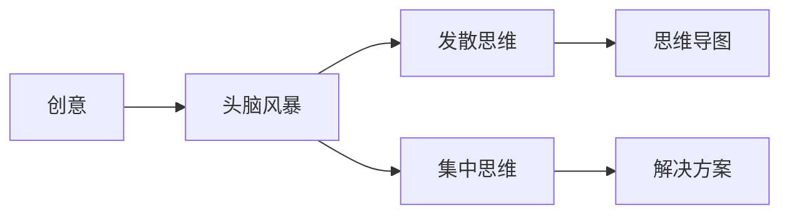
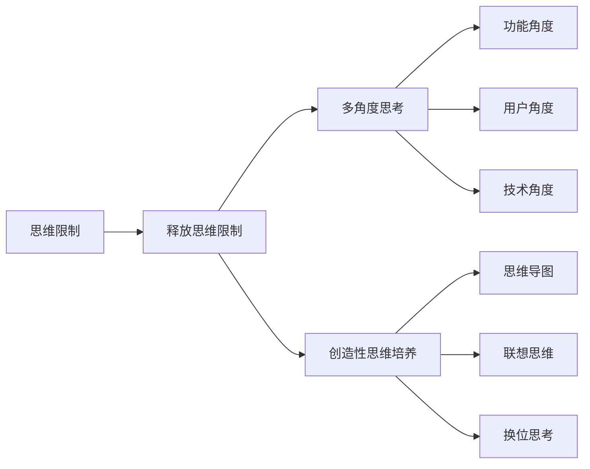
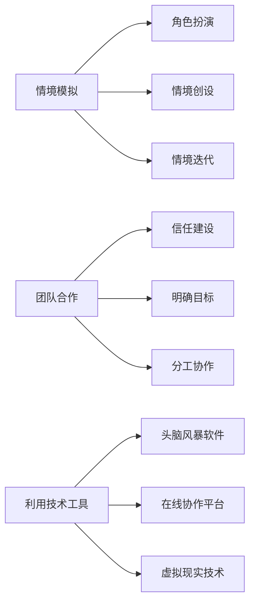

                 

# 激发创意：让头脑风暴更有效的技巧

> 关键词：人工智能，头脑风暴，创意，方法论，实践案例

摘要：本文将深入探讨如何通过头脑风暴这一工具来激发创意，提升创新效率。首先，我们将对人工智能与创意的关系进行概述，然后详细介绍头脑风暴的基本原理与技巧，通过实际案例展示这些技巧的应用，并总结实践中的经验和问题，最后对头脑风暴的未来发展进行展望。

## 第1章 引言

### 1.1 AI与创意概述

人工智能（AI）正在改变我们的世界，从自动化到个性化服务，AI的应用无处不在。与此同时，创意作为一种独特的思维方式，是人类社会进步的重要驱动力。创意不仅仅是艺术领域的专利，它在商业、科技、设计等多个领域都发挥着至关重要的作用。

在AI时代，创意的重要性愈发凸显。首先，AI能够处理大量数据，为创意提供丰富的素材和洞察。其次，AI可以帮助人类更快速地迭代创意，从而缩短从创意到产品或服务的转化时间。然而，AI与创意的关系并非单向的，创意也能够反作用于AI，帮助AI更好地理解人类的需求和意图。

### 1.2 头脑风暴的重要性和挑战

头脑风暴是一种集体创意活动，旨在通过集体智慧产生尽可能多的创意点子。它在许多领域都得到了广泛应用，如产品开发、市场营销、项目管理等。头脑风暴的重要性在于：

1. **激发创新思维**：通过头脑风暴，可以打破常规思维，激发团队成员的创新潜力。
2. **协同合作**：头脑风暴鼓励团队成员之间的交流和合作，形成集体的智慧和力量。
3. **快速解决问题**：在面对复杂问题时，头脑风暴可以帮助团队迅速找到多种可能的解决方案。

然而，头脑风暴也面临着一些挑战，如如何确保每个成员都能够充分参与，如何避免讨论陷入僵局等。这些问题需要在实践中不断探索和解决。

### 1.3 书籍目标与读者定位

本书的目标是为读者提供一套系统的头脑风暴方法论，帮助他们在实际工作中更有效地激发创意。本书主要面向以下读者群体：

1. **企业管理者**：希望通过头脑风暴提升团队创新能力的领导者。
2. **产品经理**：需要不断寻找创新解决方案的产品开发者。
3. **设计师**：希望通过头脑风暴激发设计灵感的设计师。
4. **科研人员**：需要通过头脑风暴推动科研进展的研究者。

通过本书，读者将了解头脑风暴的基本原理和多种技巧，学会如何在实际工作中应用这些技巧，并不断优化和创新。

## 第2章 头脑风暴的基本原理

### 2.1 创意的本质与类型

创意是一种创造性的思考方式，它不仅仅是一种想法或点子，更是一种能够产生实际价值的思考过程。创意的类型多种多样，可以从不同的角度进行分类：

1. **创新性创意**：这种创意侧重于创造全新的概念或产品，通常需要较高的思维灵活性和创新能力。
2. **改进性创意**：这种创意旨在优化现有产品或服务，提高其性能、效率或用户体验。
3. **适应性创意**：这种创意关注如何将现有技术或理念应用于新的领域或场景。

创意的本质在于它的创造性和实用性。一个创意的质量取决于其新颖性和可实现性。新颖性指的是创意的原创性，而可实现性则是指创意是否能够在实际环境中得以实现。

### 2.2 头脑风暴的基础概念

头脑风暴是一种集体创意活动，通常由一组人围绕某个主题展开讨论，目的是产生尽可能多的创意点子。头脑风暴的基础概念包括：

1. **发散思维**：发散思维是一种从多个角度、多种可能性来思考问题的方法，它鼓励团队成员跳出传统思维框架，探索新的解决方案。
2. **集中思维**：集中思维则是在发散思维的基础上，对产生的创意进行筛选和整合，从中挑选出最具潜力和可行性的点子。
3. **思维导图**：思维导图是一种图形化的工具，可以帮助团队成员清晰地组织和展示创意点子，从而更好地理解和讨论。

### 2.3 头脑风暴的机制与过程

头脑风暴的机制通常包括以下几个步骤：

1. **准备阶段**：确定头脑风暴的主题、目标和参与人员，准备相关资料和工具。
2. **开始阶段**：主持人简要介绍主题，鼓励团队成员自由发言，提出各种创意。
3. **发展阶段**：团队成员围绕主题进行讨论，互相启发和补充，产生更多的创意点子。
4. **整合阶段**：对产生的创意进行筛选和分类，将具有共性的创意进行整合，形成初步的解决方案。
5. **评估阶段**：对整合后的创意进行评估，选择最优的解决方案进行实施。

### 2.4 核心概念与联系

为了更好地理解头脑风暴的基本原理，我们可以通过Mermaid流程图来展示各个核心概念之间的关系：



### 2.5 核心算法原理讲解

在头脑风暴中，如何有效地生成创意点子是关键。以下是一个简单的伪代码，用于描述生成创意点子的过程：

```python
# 伪代码
def generate_idea(type):
    if type == "创新":
        return "创造新事物"
    elif type == "改进":
        return "优化现有事物"

def brainstorming(topic):
    ideas = []
    while True:
        idea = generate_idea(type)
        if idea:
            ideas.append(idea)
            type = "创新" if type == "改进" else "改进"
        else:
            break
    return ideas
```

### 2.6 数学模型和数学公式

创意的质量可以通过以下数学模型进行评估：

```latex
$$ 创意质量 = 创意新颖性 \times 创意实用性 $$
```

其中，创意新颖性表示创意的原创性，创意实用性表示创意在实际应用中的可行性。通过这个公式，我们可以对创意进行量化评估，从而更好地选择和实施创意。

### 2.7 举例说明

在产品开发过程中，头脑风暴可以用于解决以下问题：

1. **产品创新**：如何通过创新来提升产品的竞争力？
2. **用户体验**：如何优化产品的用户体验，提高用户满意度？
3. **市场策略**：如何通过创意的市场策略来吸引更多用户？

通过头脑风暴，团队成员可以提出各种创新和改进的方案，从而为产品开发提供有力的支持。

## 第3章 头脑风暴的基本技巧

### 3.1 释放思维限制

在头脑风暴过程中，许多团队往往受到思维限制的影响，导致创意的产生受到阻碍。释放思维限制是提高头脑风暴效果的关键。以下是一些方法可以帮助团队释放思维限制：

1. **无评价规则**：在头脑风暴初期，禁止对任何创意进行评价或批评，确保每个成员都能够自由地表达自己的想法。
2. **跨学科合作**：引入来自不同领域的专家，通过跨学科的合作，激发新的创意点子。
3. **想象力训练**：通过想象力训练，如假设未来、假设极端情况等，鼓励团队成员跳出常规思维。

### 3.2 多角度思考

在头脑风暴中，多角度思考可以帮助团队从不同的角度分析问题，从而产生更多创意。以下是一些多角度思考的方法：

1. **功能角度**：从产品的功能角度出发，思考如何通过功能创新来提升产品的竞争力。
2. **用户角度**：从用户的角度出发，思考如何优化用户体验，提高用户满意度。
3. **技术角度**：从技术的角度出发，思考如何通过技术创新来解决问题。

### 3.3 创造性思维的培养

创造性思维是头脑风暴的核心，以下是一些培养创造性思维的方法：

1. **思维导图**：通过绘制思维导图，将创意点子进行结构化组织，从而更好地理解和分析创意。
2. **联想思维**：通过联想思维，从一个点子出发，衍生出更多的相关创意。
3. **换位思考**：尝试从不同的角度和立场来思考问题，从而激发新的创意点子。

### 3.4 核心概念与联系

为了更好地理解头脑风暴的基本技巧，我们可以通过Mermaid流程图来展示各个核心概念之间的关系：



### 3.5 核心算法原理讲解

以下是一个简单的伪代码，用于描述如何通过多角度思考来产生创意点子：

```python
# 伪代码
def generate_idea(angle):
    if angle == "功能":
        return "通过功能创新来提升产品竞争力"
    elif angle == "用户":
        return "通过优化用户体验来提高用户满意度"
    elif angle == "技术":
        return "通过技术创新来解决问题"

def brainstorming(topic):
    angles = ["功能", "用户", "技术"]
    ideas = []
    for angle in angles:
        idea = generate_idea(angle)
        ideas.append(idea)
    return ideas
```

### 3.6 数学模型和数学公式

创造性思维可以通过以下数学模型进行评估：

```latex
$$ 创造性思维 = 创意数量 \times 创意质量 $$
```

其中，创意数量表示在头脑风暴中产生的创意点子的数量，创意质量表示创意的实际价值和可行性。

### 3.7 举例说明

在市场营销中，通过多角度思考，团队可以产生以下创意：

1. **功能角度**：通过推出具有独特功能的新产品来吸引消费者。
2. **用户角度**：通过优化用户体验，提高用户的满意度和忠诚度。
3. **技术角度**：通过引入新技术，提升产品的性能和竞争力。

这些创意点子可以帮助企业在激烈的市场竞争中脱颖而出。

## 第4章 头脑风暴的高级技巧

### 4.1 情境模拟

情境模拟是一种通过模拟特定场景来激发创意的方法。通过情境模拟，团队成员可以更深入地理解问题，从而产生更有针对性的创意。以下是一些情境模拟的技巧：

1. **角色扮演**：团队成员扮演不同的角色，模拟实际场景中的交互和决策过程。
2. **情境创设**：通过创设具体的情境背景，如时间、地点、参与者等，来激发团队成员的创意思维。
3. **情境迭代**：在模拟过程中，不断调整和优化情境，从而产生更多的创意点子。

### 4.2 团队合作

团队合作是头脑风暴成功的关键。以下是一些提高团队合作效果的技巧：

1. **信任建设**：通过团队活动、沟通和合作，建立团队成员之间的信任。
2. **明确目标**：确保所有团队成员都明确头脑风暴的目标和期望结果。
3. **分工协作**：根据团队成员的特长和优势，进行合理的分工，从而提高整体效率。

### 4.3 利用技术工具

现代技术工具可以帮助团队更高效地进行头脑风暴。以下是一些常用的技术工具：

1. **头脑风暴软件**：如MindManager、XMind等，提供可视化工具和协作功能。
2. **在线协作平台**：如Trello、Asana等，可以帮助团队成员实时共享和讨论创意。
3. **虚拟现实技术**：通过虚拟现实技术，可以模拟更真实的情境，激发创意。

### 4.4 核心概念与联系

为了更好地理解头脑风暴的高级技巧，我们可以通过Mermaid流程图来展示各个核心概念之间的关系：



### 4.5 核心算法原理讲解

以下是一个简单的伪代码，用于描述如何通过情境模拟来产生创意点子：

```python
# 伪代码
def simulate_scenario(scenario):
    ideas = []
    for role in scenario['roles']:
        idea = generate_idea(role)
        ideas.append(idea)
    return ideas

def brainstorming(topic):
    scenarios = [
        {"scenario": "会议场景", "roles": ["主持人", "参与者"]},
        {"scenario": "产品发布场景", "roles": ["开发者", "市场人员"]},
    ]
    for scenario in scenarios:
        ideas = simulate_scenario(scenario)
        print(ideas)
```

### 4.6 数学模型和数学公式

团队合作的效果可以通过以下数学模型进行评估：

```latex
$$ 团队合作效果 = 创意质量 \times 团队协作效率 $$
```

其中，创意质量表示团队产生的创意点子的质量，团队协作效率表示团队成员之间的协作效率和默契程度。

### 4.7 举例说明

在项目策划中，通过情境模拟和团队合作，团队可以产生以下创意：

1. **会议场景**：通过模拟会议场景，团队成员提出了如何更有效地组织会议的创意。
2. **产品发布场景**：通过模拟产品发布场景，团队成员提出了如何提高产品发布效果的创意。

这些创意点子为项目的成功实施提供了有力的支持。

## 第5章 头脑风暴应用案例

### 5.1 案例一：产品创新

某科技公司正在开发一款智能家居产品，希望通过头脑风暴来激发创意，提升产品的竞争力。以下是一个详细的案例：

#### 1. 背景介绍

公司希望通过创新来提升产品的用户体验和功能，以在竞争激烈的市场中脱颖而出。团队成员包括产品经理、设计师、开发人员和市场人员。

#### 2. 案例分析

1. **情境模拟**：团队模拟了用户使用智能家居产品的场景，包括早晨起床、回家、晚上休息等。通过角色扮演，团队成员从不同角色的角度提出了多种创意。
   
2. **多角度思考**：团队从功能、用户体验、技术等多个角度出发，提出了以下创意：

   - **功能角度**：增加智能安防功能，如智能门锁、监控摄像头等。
   - **用户体验角度**：优化用户界面，使其更加直观和易于操作。
   - **技术角度**：引入物联网技术，实现设备之间的无缝连接。

3. **整合与评估**：团队对提出的创意进行整合和评估，选择了以下创意进行实施：

   - **智能安防功能**：开发智能门锁和监控摄像头，提高用户安全感。
   - **优化用户界面**：设计更加直观和易于操作的界面，提升用户体验。

#### 3. 项目小结

通过头脑风暴，团队成功地激发了多种创意，并将这些创意转化为实际的产品功能。产品的竞争力得到了显著提升，市场反响良好。

### 5.2 案例二：市场策略

某消费品公司希望通过头脑风暴来制定新的市场策略，以应对市场变化和竞争对手的压力。以下是一个详细的案例：

#### 1. 背景介绍

公司面临市场竞争加剧的挑战，希望通过创新的市场策略来提升市场份额。团队成员包括市场经理、销售经理、品牌经理和数据分析专家。

#### 2. 案例分析

1. **情境模拟**：团队模拟了竞争对手推出的新产品的市场反应，从消费者的角度出发，提出了多种应对策略。

2. **多角度思考**：团队从市场、品牌、销售等多个角度出发，提出了以下创意：

   - **市场角度**：通过社交媒体营销，提高品牌知名度。
   - **品牌角度**：通过品牌重塑，提升品牌形象。
   - **销售角度**：推出促销活动，吸引消费者购买。

3. **整合与评估**：团队对提出的创意进行整合和评估，选择了以下创意进行实施：

   - **社交媒体营销**：通过社交媒体平台发布有吸引力的内容，吸引消费者关注。
   - **品牌重塑**：重新设计品牌标识和宣传语，提升品牌形象。
   - **促销活动**：推出限时促销，吸引消费者购买。

#### 3. 项目小结

通过头脑风暴，团队成功地制定了多种创新的市场策略，并成功实施。公司的市场份额得到了显著提升，品牌形象得到了改善。

### 5.3 案例三：项目策划

某科技公司正在策划一个大型项目，希望通过头脑风暴来激发创意，确保项目的顺利进行。以下是一个详细的案例：

#### 1. 背景介绍

公司计划开发一个跨部门的大型项目，涉及多个技术和业务领域。团队成员包括项目经理、技术负责人、业务分析师和设计师。

#### 2. 案例分析

1. **情境模拟**：团队模拟了项目实施过程中可能遇到的各种问题和挑战，从不同的角度提出了多种解决方案。

2. **多角度思考**：团队从技术、业务、管理等多个角度出发，提出了以下创意：

   - **技术角度**：采用最新的技术框架，提高项目的技术水平。
   - **业务角度**：优化业务流程，提高项目的效率。
   - **管理角度**：建立完善的项目管理体系，确保项目按计划进行。

3. **整合与评估**：团队对提出的创意进行整合和评估，选择了以下创意进行实施：

   - **技术角度**：采用微服务架构，提高项目的可扩展性和可维护性。
   - **业务角度**：引入敏捷开发方法，提高项目的响应速度。
   - **管理角度**：建立项目看板，实时监控项目进度。

#### 3. 项目小结

通过头脑风暴，团队成功地激发了多种创意，并确保了项目的顺利进行。项目的成功实施为公司的未来发展奠定了坚实的基础。

## 第6章 头脑风暴的实践与反思

### 6.1 头脑风暴的常见问题与解决

在实践头脑风暴的过程中，团队常常会遇到一些问题。以下是一些常见的问题以及相应的解决方法：

1. **参与度不足**：解决方法：通过引入有吸引力的主题和奖励机制，提高团队成员的参与度。
2. **讨论陷入僵局**：解决方法：主持人可以引导讨论，提出新的问题或观点，打破僵局。
3. **创意质量不高**：解决方法：在头脑风暴前进行充分的准备，提供相关资料和背景信息，提高创意质量。

### 6.2 头脑风暴效果的评估

评估头脑风暴的效果是确保其有效性的关键。以下是一些评估方法：

1. **创意数量**：通过统计产生的创意数量来评估头脑风暴的效果。
2. **创意质量**：通过评估创意的创新性、实用性等指标来评估创意质量。
3. **实施效果**：通过实际实施创意后的效果来评估头脑风暴的实际价值。

### 6.3 头脑风暴的持续优化

为了不断提高头脑风暴的效果，团队需要进行持续的优化。以下是一些优化方法：

1. **定期回顾**：定期回顾头脑风暴的实践，总结经验和教训。
2. **持续学习**：学习新的头脑风暴方法和技巧，不断更新和优化。
3. **团队建设**：加强团队之间的信任和协作，提高团队的凝聚力。

## 第7章 未来展望

### 7.1 头脑风暴的发展趋势

随着人工智能和技术的不断发展，头脑风暴的方法和工具也在不断进化。未来，头脑风暴将更加智能化、个性化，利用AI技术来提高创意的产生和筛选效率。此外，虚拟现实和增强现实技术的应用将使得头脑风暴的体验更加生动和直观。

### 7.2 技术对头脑风暴的影响

技术的进步将对头脑风暴产生深远的影响。首先，AI技术可以帮助团队更快速地处理和分析大量数据，从而提供更有价值的创意。其次，在线协作平台和虚拟现实技术将使得头脑风暴的参与更加便捷和高效。最后，AI和大数据分析将帮助团队更好地评估和选择创意。

### 7.3 头脑风暴的未来挑战与机遇

未来，头脑风暴将面临一系列挑战，如如何更好地利用AI技术、如何平衡创意的多样性和实用性等。然而，这些挑战也带来了机遇，通过不断创新和优化，头脑风暴将成为团队创新的重要工具。

### 7.4 结论

本文通过深入探讨头脑风暴的基本原理、技巧和应用，展示了如何通过这一工具来激发创意，提升创新效率。随着技术的不断发展，头脑风暴将在未来发挥更加重要的作用，成为团队创新的重要驱动力。

## 作者信息

作者：AI天才研究院/AI Genius Institute & 禅与计算机程序设计艺术 /Zen And The Art of Computer Programming

AI天才研究院致力于推动人工智能技术的发展，探索人工智能在各个领域的应用。同时，禅与计算机程序设计艺术是一本经典的技术著作，深入探讨了编程和人工智能的哲学和艺术。本文的作者结合了这两者的经验和智慧，撰写了这篇关于头脑风暴的技术博客。希望本文能够为读者提供有价值的见解和启发。

