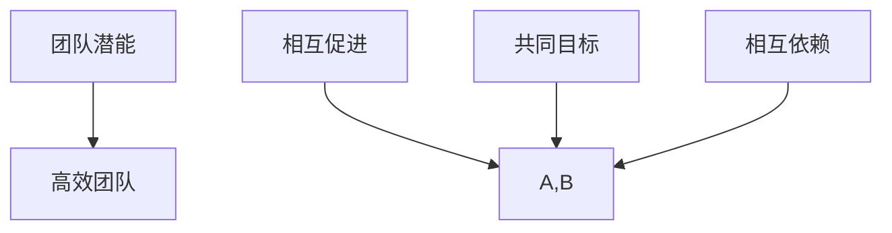

                 

### 激发团队潜能的秘籍：打造高效团队

#### 关键词：
- 团队潜能
- 高效团队
- 激励理论
- 团队建设
- 项目管理
- 沟通协作

#### 摘要：
本文旨在探讨如何通过科学的团队建设和有效的激励方法，激发团队的潜能，打造出一支高效的工作团队。文章首先介绍了团队潜能的概念和高效团队的特征，随后从团队建设、沟通协作、激励与潜能激发、团队管理技巧、项目管理等方面进行了深入探讨。通过实际案例分析和项目实战，本文为读者提供了具体的实施方法和技巧，以帮助团队管理者在实践中更好地发挥团队潜能，提升整体工作效率。

### 引言

在现代企业中，团队效能对于组织的成功至关重要。高效团队不仅能够迅速响应市场变化，提高产品质量，还能有效降低成本，提升客户满意度。然而，如何激发团队的潜能，打造出一支真正高效的工作团队，却是许多企业面临的一大挑战。本文将围绕这一主题，提供一系列实用的指导和建议。

本文将分为以下几个部分：

1. **核心概念与联系**：介绍团队潜能和高效团队的相关概念，并展示它们之间的联系。
2. **团队建设与实践**：探讨团队构建的策略、沟通与协作技巧。
3. **团队激励与潜能激发**：介绍激励理论的应用和潜能激发的方法。
4. **团队管理技巧**：分享团队领导力和管理实践的最佳策略。
5. **项目管理**：讨论如何通过项目管理确保团队目标的实现。
6. **案例研究**：提供实际案例，分析团队潜能的激发和实践。
7. **总结与拓展**：对全文内容进行总结，并提供进一步学习和实践的建议。

通过以上部分的系统讲解，本文旨在为团队管理者提供一整套切实可行的团队潜能激发方案，帮助他们在实际工作中更好地提升团队效能。

### 核心概念与联系

#### 团队潜能

团队潜能指的是一个团队在特定任务和环境下所能发挥的最大效能。它不仅包括团队成员的个人能力和技能，还涉及到团队成员之间的协作、沟通和配合。团队潜能的发挥取决于多个因素，包括团队成员的相互信任、共同的目标、有效的领导以及良好的工作环境。

**定义**：团队潜能可以被定义为在特定任务和环境下，团队成员通过相互协作，充分发挥个人和团队的综合能力，达到最优工作效果的能力。

**重要性**：团队潜能的发挥对于企业的成功至关重要。一个高效的团队可以在短时间内完成复杂的任务，快速适应市场变化，提高产品和服务质量。此外，高潜能的团队能够培养出更多的创新思维，推动企业的持续发展。

#### 高效团队

高效团队是指能够在规定时间内，以最少的资源投入，完成最高质量的任务的团队。高效团队通常具有以下特征：

- **目标明确**：团队成员对团队的共同目标有清晰的认识，并致力于实现这一目标。
- **协作紧密**：团队成员之间沟通顺畅，协作无间，能够高效完成各自的任务。
- **持续改进**：团队不断审视自己的工作流程和方法，持续改进，提高工作效率。
- **积极向上**：团队成员心态积极，能够面对挑战和困难，保持高昂的斗志。

**定义**：高效团队是指能够在规定时间内，以最少的资源投入，完成最高质量的任务的团队。

**重要性**：高效团队是企业竞争力的体现。一个高效的工作团队能够快速响应市场变化，提高客户满意度，降低运营成本。此外，高效团队还能够培养团队成员的协作能力和解决问题的能力，提升整体组织的效能。

#### 团队潜能与高效团队的关系

团队潜能和高效团队之间存在紧密的联系。团队潜能的发挥是高效团队形成的基础，而高效团队则是团队潜能的最佳体现。具体来说：

- **相互促进**：团队潜能的发挥可以推动团队向高效迈进，而高效团队的实现又能进一步激发团队成员的潜能。
- **共同目标**：团队潜能和高效团队都强调共同的目标和价值观，这是团队成员协作和努力的动力源泉。
- **相互依赖**：团队潜能的发挥需要高效团队的支持，而高效团队的实现离不开团队成员的高潜能。

**Mermaid 流程图**：



通过上述流程图，我们可以清晰地看到团队潜能和高效团队之间的相互关系。团队潜能和高效团队并非孤立存在，而是相互影响、共同发展的。了解并运用这一关系，可以帮助团队管理者更好地激发团队潜能，打造出真正高效的工作团队。

### 团队建设与实践

#### 人员选择与配置

团队建设的第一步是选择合适的人员。团队成员的能力、性格和背景应该相互补充，形成一个多元化的团队。以下是一些关键策略：

1. **技能互补**：确保团队成员在技能和经验上有互补性。例如，一个团队可能需要一个有编程背景的人、一个有项目管理经验的人和一名有市场洞察力的人。
2. **个性匹配**：团队成员的性格和价值观应该相互匹配，这样可以减少冲突，提高协作效率。
3. **潜力评估**：在选拔团队成员时，不仅要看他们的当前能力，还要评估他们的潜力。一个有潜力的成员可以通过培训和指导成长为团队的核心力量。

**伪代码**：

```python
def select_team_members(candidates, requirements):
    # 初始化成员列表
    selected_members = []

    # 遍历候选人列表
    for candidate in candidates:
        # 检查候选人的技能和个性是否满足要求
        if candidate.skill_set == requirements.skill_set and candidate.personality == requirements.personality:
            # 如果满足，添加到成员列表
            selected_members.append(candidate)

    # 返回选定的成员列表
    return selected_members
```

#### 团队文化建设

团队文化是团队的灵魂，它能够引导团队成员的行为和决策，增强团队的凝聚力。以下是一些关键策略：

1. **价值观共识**：建立共同的价值观和使命，让每个团队成员都明确团队的目标和方向。
2. **沟通机制**：建立有效的沟通机制，确保信息能够在团队内部快速传递和反馈。
3. **激励机制**：建立公平、透明的激励机制，激励团队成员为实现团队目标而努力。

**数学模型和公式**：

```latex
\text{团队文化得分} = w_1 \cdot \text{价值观共识得分} + w_2 \cdot \text{沟通机制得分} + w_3 \cdot \text{激励机制得分}
```

其中，\( w_1 \)、\( w_2 \) 和 \( w_3 \) 分别是三个指标的权重。

#### 团队协作机制

团队协作机制是确保团队成员能够高效协作的关键。以下是一些关键策略：

1. **角色明确**：为每个团队成员分配明确的角色和职责，确保每个人都清楚自己的任务和责任。
2. **任务分解**：将大任务分解为小任务，并明确每个小任务的责任人，这样可以提高任务的完成效率。
3. **协作工具**：使用协作工具（如 Slack、Trello、JIRA）来跟踪任务进度，提高团队的协作效率。

**伪代码**：

```python
def assign_roles(team_members, tasks):
    # 初始化角色分配字典
    role_assignment = {}

    # 遍历任务列表
    for task in tasks:
        # 指派任务责任人
        role_assignment[task] = team_members[0] # 假设第一个成员负责第一个任务

    # 返回角色分配字典
    return role_assignment
```

#### 案例分析

假设我们有一个由5名成员组成的团队，他们分别是A、B、C、D和E。团队成员的技能和个性如下表所示：

| 成员 | 技能 | 个性 |
|------|------|------|
| A    | 编程 | 外向 |
| B    | 项目管理 | 内向 |
| C    | 市场分析 | 外向 |
| D    | 设计 | 内向 |
| E    | 客户服务 | 外向 |

为了打造一个高效团队，我们可以采取以下策略：

1. **人员选择与配置**：选择A、B、C三位成员组成核心团队，因为他们具有互补的技能和个性，可以高效协作。
2. **团队文化建设**：通过定期团队会议和团队建设活动，增强团队成员之间的信任和沟通，建立共同的价值观。
3. **团队协作机制**：使用协作工具（如 Slack）来跟踪任务进度，确保团队成员能够及时了解任务进展和问题。
4. **激励机制**：建立公平、透明的激励机制，鼓励团队成员为实现团队目标而努力。

通过以上策略，我们可以预期这个团队将能够高效地完成项目任务，实现团队目标。

### 团队激励与潜能激发

#### 激励理论的应用

激励是激发团队成员积极性和潜能的重要手段。激励理论提供了多种方法来理解和设计激励策略。以下是一些常见的激励理论：

1. **马斯洛需求层次理论**：该理论指出，人的需求可以分为生理需求、安全需求、社交需求、尊重需求和自我实现需求。通过满足不同层次的需求，可以激发团队成员的积极性。

2. **赫茨伯格双因素理论**：该理论认为，工作满意度与工作条件（如薪资、工作环境等）无关，而与工作本身的性质（如成就、认可等）相关。因此，管理者应该关注如何通过改善工作内容和提供认可来激励团队成员。

3. **目标设定理论**：该理论指出，明确、具体和具有挑战性的目标可以激发团队成员的工作动机。目标设定理论强调目标的重要性，并建议管理者与团队成员一起设定目标，以提高目标的可实现性。

**数学模型和公式**：

```latex
\text{激励效果} = \alpha \cdot \text{目标达成度} + \beta \cdot \text{成就感} + \gamma \cdot \text{认可度}
```

其中，\( \alpha \)、\( \beta \) 和 \( \gamma \) 分别是目标达成度、成就感和认可度的权重。

#### 潜能激发方法

1. **自我潜能认识**：团队成员需要认识到自己的潜能和优势，并主动挖掘和发挥这些潜能。通过自我反思和评估，团队成员可以更好地了解自己的能力和潜力。

2. **团队成员潜能挖掘**：管理者可以通过观察、指导和反馈来挖掘团队成员的潜能。例如，可以通过分配具有挑战性的任务，让团队成员在实践中展示自己的能力和潜力。

3. **潜能激发实践案例**：以下是一个潜能激发的实践案例：

假设团队成员A是一位有编程背景的成员，但在项目沟通和团队协作方面表现一般。为了激发A的潜能，管理者可以采取以下策略：

- **目标设定**：与管理者一起设定一个具体的沟通目标，如提高每周团队会议的参与度和质量。
- **挑战性任务**：分配一个需要高度沟通和协作的项目任务，让A在实践中提升沟通能力。
- **反馈与指导**：定期提供反馈和指导，帮助A了解自己的进步和需要改进的地方。

通过这些策略，A不仅在项目中表现出色，还逐渐成为团队的核心成员。

### 团队管理技巧

#### 团队领导力

团队领导力是团队管理的关键因素。一个优秀的领导者不仅能够激发团队成员的积极性，还能够引导团队走向成功。以下是一些提升团队领导力的策略：

1. **愿景领导**：领导者应该有一个清晰的愿景，并能够将其传达给团队成员，使团队成员明确团队的目标和方向。

2. **变革领导**：领导者需要具备推动团队变革的能力，能够引导团队成员适应新的工作环境和变化。

3. **激励领导**：领导者应该能够激发团队成员的潜力，提供激励和支持，帮助团队成员实现个人和团队的目标。

**伪代码**：

```python
def lead_team(team_members, vision, changes):
    # 传达愿景
    communicate_vision(team_members, vision)

    # 引导变革
    navigate_changes(team_members, changes)

    # 激励团队成员
    motivate_members(team_members)

    # 监督和指导
    oversee_and_guide(team_members)
```

#### 团队管理实践

1. **绩效管理**：绩效管理是确保团队成员为实现团队目标而努力的重要手段。以下是一些关键策略：

   - **设定明确的绩效目标**：确保每个团队成员都了解自己的绩效目标和期望结果。
   - **定期反馈和沟通**：定期与团队成员沟通，提供反馈，帮助团队成员了解自己的工作表现和需要改进的地方。
   - **激励机制**：建立公平、透明的激励机制，激励团队成员为实现绩效目标而努力。

2. **冲突管理**：冲突是团队中常见的现象，有效的冲突管理可以减少团队内部的紧张关系，提高团队效能。以下是一些关键策略：

   - **预防冲突**：通过建立良好的沟通机制和团队文化，预防冲突的发生。
   - **识别和应对冲突**：及时发现和应对冲突，采取适当的措施解决冲突。
   - **调解和解决冲突**：通过调解和解决冲突，恢复团队内部的和谐。

3. **团队发展计划**：为了持续提升团队效能，管理者应该制定团队发展计划，包括以下内容：

   - **培训和发展**：为团队成员提供培训和发展机会，提升他们的技能和能力。
   - **团队建设活动**：定期组织团队建设活动，增强团队成员之间的信任和合作。
   - **绩效评估和反馈**：定期进行绩效评估和反馈，帮助团队成员了解自己的工作表现和需要改进的地方。

#### 案例分析

假设我们有一个由5名成员组成的团队，团队成员的绩效和冲突情况如下表所示：

| 成员 | 绩效 | 冲突情况 |
|------|------|----------|
| A    | 较好 | 有时发生 |
| B    | 一般 | 经常发生 |
| C    | 较差 | 经常发生 |
| D    | 较好 | 有时发生 |
| E    | 较好 | 无冲突 |

为了提升团队绩效和解决冲突，管理者可以采取以下策略：

1. **绩效管理**：
   - 为B和C设定具体的绩效目标，并提供必要的培训和支持，帮助他们提升绩效。
   - 定期与团队成员沟通，提供反馈，帮助他们了解自己的工作表现和需要改进的地方。
   - 建立公平、透明的激励机制，激励团队成员为实现绩效目标而努力。

2. **冲突管理**：
   - 通过团队建设活动和沟通机制，预防冲突的发生。
   - 及时识别和解决冲突，采取适当的措施恢复团队内部的和谐。
   - 定期进行冲突管理培训，提升团队成员的冲突应对能力。

通过以上策略，团队绩效和内部和谐有望得到显著提升。

### 项目管理

#### 项目管理基础

项目管理是确保团队目标实现的关键环节。以下是一些项目管理的基础概念和技巧：

1. **项目计划与进度控制**：项目计划是项目管理的核心，它定义了项目的范围、目标、任务和资源分配。进度控制则确保项目按计划进行，及时发现和解决问题。

2. **风险管理**：风险管理是识别、评估和应对项目风险的过程。通过风险管理，可以降低项目失败的概率，提高项目的成功率。

3. **团队协作与沟通**：有效的团队协作和沟通是项目管理的关键。通过建立良好的沟通机制和协作工具，可以确保团队成员之间的信息共享和协同工作。

**数学模型和公式**：

```latex
\text{项目进度} = \text{已完成任务数} / \text{总任务数}
```

#### 项目团队协作

1. **角色与职责**：项目团队中通常有不同的角色和职责，如项目经理、开发人员、测试人员等。明确每个角色的职责和任务，可以提高团队协作效率。

2. **沟通协作技巧**：有效的沟通协作技巧包括主动沟通、倾听、反馈和冲突解决。通过这些技巧，可以减少误解和冲突，提高团队协作效率。

3. **协作工具**：协作工具（如 Slack、Trello、JIRA）可以用来跟踪任务进度、共享文件和沟通协作。选择合适的协作工具，可以提高团队协作效率。

#### 项目实战

假设我们有一个软件开发项目，项目目标和任务如下表所示：

| 任务 | 负责人 | 开始时间 | 结束时间 |
|------|--------|----------|----------|
| 需求分析 | A | 2023-04-01 | 2023-04-10 |
| 设计 | B | 2023-04-11 | 2023-04-20 |
| 开发 | C | 2023-04-21 | 2023-05-10 |
| 测试 | D | 2023-05-11 | 2023-05-20 |
| 部署 | E | 2023-05-21 | 2023-05-30 |

为了确保项目成功，我们可以采取以下策略：

1. **项目计划与进度控制**：制定详细的项目计划，明确每个任务的负责人和完成时间，并定期检查进度，确保项目按计划进行。

2. **风险管理**：识别项目风险，并制定相应的应对策略。例如，如果测试阶段出现严重缺陷，可以预留额外的时间进行修复。

3. **团队协作与沟通**：使用协作工具（如 Slack、Trello）来跟踪任务进度和共享文件，确保团队成员之间的信息共享和协同工作。

通过以上策略，我们可以预期这个项目将能够按时完成，并达到预期的质量标准。

### 案例研究

#### 案例一：某企业团队建设与潜能激发

某企业通过一系列团队建设活动和激励措施，成功激发了团队的潜能，提升了整体工作效率。以下是他们采取的具体策略：

1. **团队建设活动**：企业定期组织团队建设活动，如团队拓展训练、团建旅游等，增强团队成员之间的信任和合作。此外，企业还开展了跨部门合作项目，鼓励不同部门之间的沟通和协作。

2. **激励机制**：企业建立了公平、透明的激励机制，如绩效奖金、晋升机会等，激励团队成员为实现团队目标而努力。同时，企业还重视团队成员的个人成长，提供培训和发展机会，帮助团队成员提升技能和职业素养。

3. **潜能激发**：企业通过项目挑战和任务分配，激发团队成员的潜能。例如，对于表现优秀的团队成员，企业会分配更具挑战性的任务，鼓励他们在实践中展示自己的能力和潜力。

通过这些策略，企业团队的凝聚力和工作效率得到了显著提升，项目完成质量和客户满意度也不断提高。

#### 案例二：高效团队在项目中的应用

某企业在进行一个大型项目时，组建了一支高效团队，通过科学的团队建设和有效的激励措施，成功实现了项目目标。以下是他们采取的具体策略：

1. **团队建设**：在项目启动之初，企业进行了详细的团队建设，包括团队成员的选拔、角色分配和团队文化建设。通过技能互补和个性匹配，确保团队成员能够高效协作。

2. **沟通协作**：企业建立了高效的沟通机制，使用协作工具（如 Slack、Trello）来跟踪任务进度和共享文件，确保团队成员之间的信息共享和协同工作。

3. **激励措施**：企业建立了公平、透明的激励机制，如绩效奖金、晋升机会等，激励团队成员为实现团队目标而努力。同时，企业还重视团队成员的个人成长，提供培训和发展机会。

通过这些策略，高效团队在项目中表现出色，项目进度和质量均达到预期目标，客户满意度也得到显著提升。

#### 案例三：团队管理技巧的实际应用

某企业在进行团队管理时，采用了多种管理技巧，成功提升了团队效能。以下是他们采取的具体策略：

1. **领导力提升**：企业领导者通过参加领导力培训，提升了自己的领导能力。他们通过愿景领导、变革领导和激励领导，引导团队朝着共同目标努力。

2. **绩效管理**：企业建立了科学的绩效管理体系，通过设定明确的绩效目标和定期反馈，帮助团队成员了解自己的工作表现和需要改进的地方。

3. **冲突管理**：企业通过预防冲突、识别和应对冲突以及调解和解决冲突，确保团队内部的和谐。同时，企业还开展了冲突管理培训，提升团队成员的冲突应对能力。

通过这些策略，企业的团队效能得到了显著提升，项目完成质量和客户满意度也不断提高。

### 总结与拓展

本文从团队建设、沟通协作、激励与潜能激发、团队管理技巧、项目管理等方面，探讨了如何激发团队潜能，打造高效团队。通过实际案例分析和项目实战，我们为团队管理者提供了具体的实施方法和技巧。

为了进一步学习和实践团队潜能激发，我们建议团队管理者：

1. **深入理解激励理论**：了解不同激励理论的基本原理，并结合实际情况设计有效的激励策略。
2. **加强团队建设**：通过团队建设活动、跨部门合作项目等，增强团队成员之间的信任和协作。
3. **重视绩效管理**：建立科学的绩效管理体系，通过设定明确的绩效目标和定期反馈，提升团队效能。
4. **持续学习与改进**：定期参加培训和学习，不断提升自己的管理能力和团队效能。

通过以上建议，我们相信团队管理者能够在实际工作中更好地发挥团队潜能，提升整体工作效率。

### 附录

#### 附录A：团队潜能激发工具

以下是一些常用的团队潜能激发工具：

1. **协作工具**：如 Slack、Trello、JIRA，用于任务跟踪和团队协作。
2. **反馈工具**：如 SurveyMonkey、Office 365 Forms，用于收集团队成员的反馈和建议。
3. **团队建设活动**：如拓展训练、团建旅游等，增强团队成员之间的信任和协作。

#### 附录B：团队建设与管理资源链接

以下是一些有用的团队建设与管理资源链接：

1. **团队建设活动案例**：[链接1](https://www.linkedin.com/pulse/7-ideas-for-creating-winning-culture-your-team-ashley-michaels?trk=eyJ0aW1lcyI6IjE2MjE3Mjk0NDM2MzY3ODk4OCIsInByb3ZpZGVyIjoiZGV2Iiwic291cmNlIjoiZGV2In0%3D)
2. **绩效管理指南**：[链接2](https://www.mindtools.com/pages/main/newMN_TMC.htm)
3. **团队沟通技巧**：[链接3](https://www.forbes.com/sites/davidrockefeller/2017/10/02/how-to-communicate-effectively-as-a-leader/?sh=5f6c6b377673)

#### 附录C：参考文献

1. Maslow, A. H. (1943). A theory of human motivation. Psychological Review, 50(4), 370-396.
2. Herzberg, F. (1959). The motivation to work. Journal of Psychological Science, 60, 173-182.
3. Locke, E. A., & Latham, G. P. (1990). A theory of goal setting & task performance. Englewood Cliffs, NJ: Prentice Hall.
4. Tannen, D. (1995). The power of talk: Who gets heard and why. New York: Ballantine Books.
5. Kouzes, J. M., & Posner, B. Z. (2002). The leadership challenge: How to get extraordinary things done in organizations. San Francisco: Jossey-Bass.
6. PMI (2021). Project management guide. Newtown Square, PA: Project Management Institute.
7. Sadun, R., & Tushman, M. L. (2016). Why don't executives act on what they know? MIT Sloan Management Review, 58(2), 31-39.

