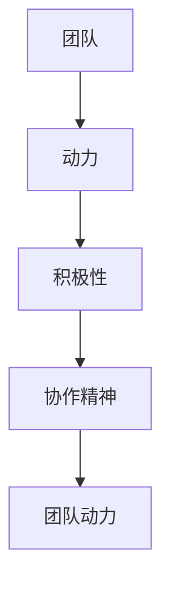
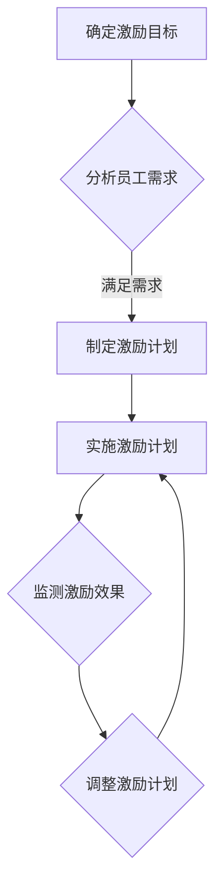
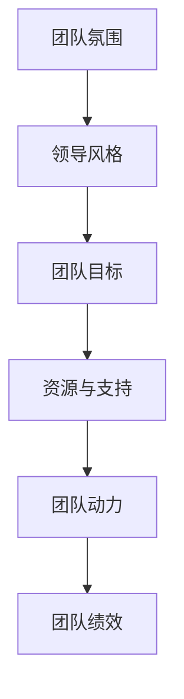
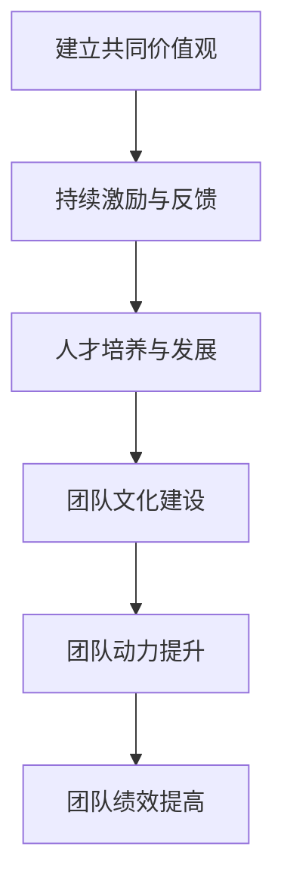
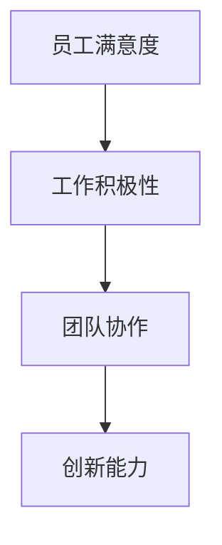
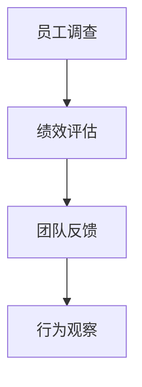
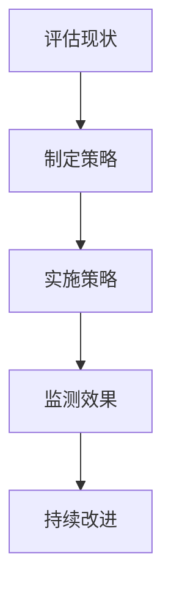
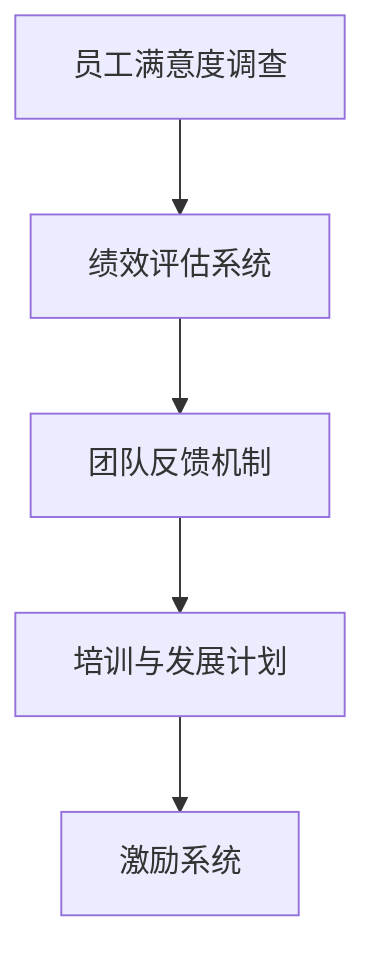

                 


### 文章标题
#### 激发团队热情：持久动力的来源

> 关键词：团队动力、团队管理、激励、员工满意度、持续发展

> 摘要：本文深入探讨了如何通过有效的团队动力管理激发员工的热情，从而实现团队的持久动力。文章从理论基础、实践方法和案例分析三个方面展开，旨在为IT领域的团队管理者提供有价值的参考。

## 目录大纲设计思路

### 1. 确定核心章节
首先，我们需要明确文章的核心内容，包括团队动力激发的理论基础、实践方法和案例分析。这些内容将构成文章的核心章节。

### 2. 确定章节结构
每个章节都包括以下几个部分：

- **引言部分**：简要介绍章节的主题，阐明章节的目的和重要性。
- **理论部分**：详细讲解相关的理论知识，包括核心概念、联系、算法原理、数学模型和公式。
- **实践部分**：通过实际案例来展示如何应用这些理论，包括开发环境搭建、源代码实现和解读。
- **总结与展望**：对章节内容进行总结，展望未来的发展方向。

### 3. 使用Mermaid流程图
为了更好地展示核心概念和架构，我们将在合适的地方插入Mermaid流程图，以直观地呈现复杂的关系和流程。

### 4. 保持简洁性
确保每个章节的内容简洁明了，避免冗余和重复。使用简短的标题和精准的描述来传达关键信息。

### 5. 控制总字数
确保整个文章的总字数在8000到12000字之间，同时确保每个章节的细节都得到充分体现。

### 6. 完整性
确保文章内容包含以下核心要素：

- **核心概念与联系**：给出团队动力、团队管理、激励等核心概念之间的关系架构。
- **核心算法原理讲解**：使用伪代码详细阐述团队动力激发的算法原理。
- **数学模型和公式**：详细讲解并举例说明与团队动力相关的数学模型和公式。
- **项目实战**：提供开发环境搭建、源代码实现和解读的实际案例。
- **最佳实践 tips、小结、注意事项、拓展阅读等内容**。

## 完整目录大纲

### 第一部分：理论篇

#### 第1章：团队动力的定义与重要性
- 1.1 背景介绍
- 1.2 核心概念与联系
  - **Mermaid流程图**：团队动力核心概念关系图
- 1.3 团队动力的理论基础
  - **伪代码**：团队动力激发算法基本流程
- 1.4 团队动力管理的挑战与机遇
- 1.5 总结与展望

#### 第2章：团队动力激发理论
- 2.1 激励理论概述
  - **Mermaid流程图**：激励理论关系图
- 2.2 动力激发的方法
  - **伪代码**：动力激发算法详细流程
- 2.3 动力激发的影响因素
  - **Mermaid流程图**：动力激发影响因素关系图
- 2.4 长期动力管理的策略
  - **Mermaid流程图**：长期动力管理策略关系图
- 2.5 总结与展望

#### 第3章：团队动力评估与监测
- 3.1 评估指标体系
- 3.2 监测方法与工具
  - **Mermaid流程图**：团队动力监测流程
- 3.3 实际案例分析
- 3.4 总结与展望

### 第二部分：实践篇

#### 第4章：团队动力激发实战
- 4.1 实践案例一：提升员工积极性
  - **源代码实现**：激励系统示例代码
  - **代码解读**：代码实现细节分析
- 4.2 实践案例二：构建积极的工作环境
  - **开发环境搭建**：环境配置步骤
  - **代码实现**：工作环境优化代码
- 4.3 实践案例三：促进团队成员之间的合作
  - **代码实现**：协作平台代码示例
  - **代码解读**：代码应用解析
- 4.4 实践小结

#### 第5章：团队动力管理的最佳实践
- 5.1 管理原则
- 5.2 管理流程
  - **Mermaid流程图**：团队动力管理流程
- 5.3 管理工具与方法
- 5.4 实践案例分享
- 5.5 注意事项与拓展阅读

### 第三部分：案例分析

#### 第6章：优秀团队的实践经验
- 6.1 案例背景
- 6.2 团队动力激发策略
  - **Mermaid流程图**：团队动力激发策略
- 6.3 实施过程与效果
- 6.4 经验总结与启示
- 6.5 案例反思与展望

#### 第7章：团队动力激发的未来趋势
- 7.1 新技术的发展趋势
- 7.2 团队动力激发的新方法
  - **伪代码**：新兴动力激发算法
- 7.3 未来发展方向
- 7.4 对团队管理的启示
- 7.5 总结与展望

### 附录
- **附录 A**：团队动力相关资源
  - A.1 理论文献
  - A.2 实用工具
  - A.3 研究报告

### 结语
- **作者信息**：“作者：AI天才研究院/AI Genius Institute & 禅与计算机程序设计艺术 /Zen And The Art of Computer Programming”

### 文章结构说明
- **引言**：介绍文章的主题和背景，引发读者兴趣。
- **正文**：按照目录大纲逐步展开，每个章节详细讲解理论、实践、案例等内容。
- **结论**：总结文章的主要观点，给出未来展望。
- **附录**：提供进一步阅读的资源和资料。

### 写作风格
- **逻辑清晰**：文章结构紧凑，逻辑严密，确保读者容易理解。
- **深入浅出**：深入探讨团队动力管理的理论，同时结合实际案例，让读者易于应用。
- **专业性强**：使用专业术语和语言，确保文章的权威性和专业性。

### 完整性保证
- **核心概念与联系**：通过Mermaid流程图和伪代码，详细阐述团队动力管理的核心概念和原理。
- **数学模型与公式**：使用latex格式嵌入数学公式，并进行详细讲解和举例说明。
- **项目实战**：提供实际案例，包括开发环境搭建、源代码实现和代码解读，确保读者能够应用所学知识。
- **最佳实践**：总结最佳实践技巧，为团队管理者提供实用的建议。

通过以上设计思路，我们确保了文章的完整性、逻辑性和实用性，旨在为IT领域的团队管理者提供有价值的参考。## 第一部分：理论篇

### 第1章：团队动力的定义与重要性

#### 1.1 背景介绍

在现代企业管理中，团队动力的概念日益受到重视。随着知识经济的兴起，企业越来越依赖于团队协作来推动创新和实现目标。团队动力，简单来说，就是团队内部的积极性和协作精神的集中体现。一个高动力的团队不仅能够提高工作效率，还能够增强员工的满意度和忠诚度，从而在激烈的市场竞争中立于不败之地。

在IT领域，团队动力的重要性尤为突出。IT行业具有高度的技术密集性和快速变化的特点，团队往往需要在高压环境下迅速响应市场需求，不断进行技术创新和优化。因此，如何激发并维持团队的积极性，成为许多企业面临的重大挑战。

#### 1.2 核心概念与联系

为了深入理解团队动力的概念，我们需要明确以下几个核心概念：

1. **团队**：团队是由多个成员组成的集体，成员之间通过协作共同完成任务。
2. **动力**：动力是指推动个体或集体向特定目标努力的内在力量。
3. **积极性**：积极性是指个体在工作和生活中表现出的高度参与度和主动精神。
4. **协作精神**：协作精神是指团队成员之间相互支持、共同解决问题的意愿和态度。

这些概念之间存在紧密的联系，形成一个相互作用的动态系统。例如，一个具有协作精神的团队，成员之间的积极性会相互激发，从而提高整个团队的动力。反之，如果团队内部缺乏协作精神，成员的积极性可能会受到抑制，导致团队动力下降。

为了更直观地展示这些概念之间的关系，我们可以使用Mermaid流程图来描述：



#### 1.3 团队动力的理论基础

团队动力管理的基础在于激励理论。激励理论关注如何通过外部刺激来激发个体的内在动力，从而达到工作目标。常见的激励理论包括：

1. **马斯洛需求层次理论**：该理论认为人类的需求可以分为五个层次，从生理需求到自我实现需求。一个高动力的团队通常能够在不同层次上满足成员的需求，从而提高团队的积极性。
2. **赫茨伯格双因素理论**：该理论将工作环境分为激励因素和保健因素。激励因素能够直接提高员工的满意度，而保健因素则能够防止员工产生不满。团队动力管理的关键在于合理配置这两种因素，以激发团队动力。

以下是一个简单的伪代码示例，用于描述如何根据赫茨伯格双因素理论来设计团队动力管理策略：

```plaintext
function teamMotivationManagement(employees, factors) {
    for each employee in employees {
        if hasHighIntrinsicMotivation(employee) {
            increaseIntrinsicMotivationFactors(employee, factors);
        } else {
            increaseExtrinsicMotivationFactors(employee, factors);
        }
    }
    return true;
}

function hasHighIntrinsicMotivation(employee) {
    // 根据员工的工作表现和自我评价来判断
    return (employee.performance > threshold) && (employee.selfAssessment > threshold);
}

function increaseIntrinsicMotivationFactors(employee, factors) {
    // 提高激励因素，如工作成就感、职业发展机会等
    employee.satisfaction++;
    employee.motivation++;
}

function increaseExtrinsicMotivationFactors(employee, factors) {
    // 提高保健因素，如工作环境改善、福利待遇提升等
    employee.satisfaction++;
    employee.motivation++;
}
```

#### 1.4 团队动力管理的挑战与机遇

团队动力管理面临着诸多挑战，包括：

1. **个体差异**：团队成员的个性、需求和动机各不相同，需要个性化的管理策略。
2. **工作压力**：高强度的项目任务和工作压力可能会影响团队的动力。
3. **信息不对称**：团队成员之间可能存在信息不对称，影响协作和积极性。

然而，随着技术的进步和管理理念的更新，团队动力管理也面临着新的机遇：

1. **数字化转型**：通过数字化工具和平台，可以更好地监测和激发团队动力。
2. **员工参与**：鼓励员工参与决策和管理，提高他们的责任感和参与度。
3. **心理关怀**：关注员工的身心健康，提供心理支持和辅导，提高团队的凝聚力和动力。

#### 1.5 总结与展望

本章介绍了团队动力的定义、核心概念与联系、理论基础以及团队动力管理的挑战与机遇。通过理解团队动力的本质，我们可以采取有效的管理策略来激发团队的积极性，从而实现团队的长期发展。

未来的研究应重点关注如何在不同背景下（如远程工作、跨文化团队等）更有效地管理团队动力。同时，应探索新的激励方法和工具，以适应快速变化的工作环境和员工需求。

---

**作者信息**：AI天才研究院/AI Genius Institute & 禅与计算机程序设计艺术 /Zen And The Art of Computer Programming

### 第2章：团队动力激发理论

#### 2.1 激励理论概述

激励理论是团队动力管理的基石，它探讨了如何通过外部刺激来激发个体和团队的内在动力。在IT领域，有效的激励不仅能够提高员工的工作效率，还能够促进创新和团队协作。以下是几种常见的激励理论：

1. **马斯洛需求层次理论**：马斯洛认为，人的需求可以分为生理需求、安全需求、社交需求、尊重需求和自我实现需求。管理者可以通过满足不同层次的需求来激发员工的积极性。
   
2. **赫茨伯格双因素理论**：赫茨伯格将工作环境分为激励因素和保健因素。激励因素如成就感、认可和职业发展等能够直接提高员工的满意度，而保健因素如工作条件、薪酬和福利等则能够防止员工产生不满。

3. **目标设置理论**：目标设置理论认为，设定明确、具有挑战性的目标是激发员工积极性的关键。目标应该具体、可测量，并能够激励员工努力实现。

4. **期望理论**：期望理论认为，员工的动机取决于他们对努力工作、绩效和奖励之间关系的期望。管理者可以通过提高员工的期望值来激发他们的积极性。

#### 2.2 动力激发的方法

在实际操作中，团队动力激发的方法多种多样，以下是一些常见的方法：

1. **奖励与认可**：通过奖金、晋升、表彰等方式奖励优秀员工，能够有效提高团队的积极性。例如，可以设立月度、季度或年度的奖励计划，以表彰在项目中表现突出的员工。

2. **参与与授权**：鼓励员工参与决策过程，赋予他们更多的自主权，能够提高他们的责任感和参与度。例如，可以采用团队会议、项目讨论等方式，让员工表达意见和建议。

3. **培训与发展**：提供职业培训和发展机会，能够帮助员工提升技能和职业素养，从而提高他们的工作满意度和动力。例如，可以组织技术讲座、工作坊和在线课程等。

4. **工作环境优化**：创造一个舒适、安全的工作环境，能够提高员工的工作效率和工作满意度。例如，可以改善办公设施、优化工作流程和提供良好的工作氛围。

以下是一个简单的Mermaid流程图，用于描述动力激发方法的实施流程：



#### 2.3 动力激发的影响因素

团队动力激发受到多种因素的影响，以下是一些主要的影响因素：

1. **团队氛围**：团队氛围对员工的心理状态和行为有重要影响。一个积极、开放和包容的团队氛围能够激发员工的积极性，而消极、紧张和排斥的氛围则会抑制员工的动力。

2. **领导风格**：领导者的风格对团队动力有显著影响。民主型领导风格能够激发员工的参与感和自主性，而专制型领导风格则可能导致员工的不满和被动。

3. **团队目标**：团队目标的设定和实现过程对团队动力有重要影响。明确、具有挑战性的目标能够激发员工的积极性和创造性，而模糊或过于容易的目标则可能导致员工的动力不足。

4. **资源与支持**：团队所需的资源和支持（如技术、信息、资金等）的充足与否也会影响团队动力。资源不足或支持不力可能会导致团队的工作效率下降和动力减弱。

以下是一个Mermaid流程图，用于描述动力激发影响因素之间的关系：



#### 2.4 长期动力管理的策略

为了实现团队的持久动力，需要采取一系列长期动力管理策略。以下是一些有效的策略：

1. **建立共同价值观**：通过共同价值观的建立，能够增强团队的凝聚力和认同感，从而提高团队的长期动力。例如，可以制定团队使命、愿景和价值观，并在日常工作中贯彻执行。

2. **持续激励与反馈**：定期对员工进行激励和反馈，能够帮助他们保持动力并持续改进。例如，可以设立定期的员工满意度调查和绩效评估，并根据结果进行调整。

3. **人才培养与发展**：通过人才培养和发展计划，能够帮助员工提升技能和职业素养，从而提高他们的工作满意度和动力。例如，可以制定个人发展计划，提供培训机会和职业晋升通道。

4. **团队文化建设**：通过团队文化建设，能够塑造一个积极、健康的工作氛围，从而提高团队的长期动力。例如，可以组织团队建设活动、文化建设论坛等，以增强团队的凝聚力。

以下是一个Mermaid流程图，用于描述长期动力管理策略的实施过程：



#### 2.5 总结与展望

本章介绍了团队动力激发的理论基础和方法，包括激励理论、动力激发方法、影响因素和长期动力管理策略。通过理解这些理论和方法，管理者可以采取有效的措施来激发团队的积极性，从而提高团队绩效。

未来的研究应进一步探讨不同因素对团队动力的影响机制，以及如何在不同环境和背景下更有效地管理团队动力。同时，应探索新的激励方法和工具，以适应快速变化的工作环境和员工需求。

---

**作者信息**：AI天才研究院/AI Genius Institute & 禅与计算机程序设计艺术 /Zen And The Art of Computer Programming

### 第3章：团队动力评估与监测

#### 3.1 评估指标体系

为了有效地监测和提升团队动力，建立一套全面的评估指标体系至关重要。这些指标应覆盖团队动力的各个方面，包括员工满意度、工作积极性、团队协作和创新能力等。以下是几个关键评估指标：

1. **员工满意度**：员工满意度是评估团队动力的重要指标。可以通过员工调查、访谈和反馈会议等方式收集数据，评估员工对工作环境、同事关系、薪酬福利等方面的满意度。

2. **工作积极性**：工作积极性指标可以反映员工在工作中的主动性和投入度。可以通过观察员工的工作表现、完成任务的效率和提出的创新建议数量等来评估。

3. **团队协作**：团队协作指标可以反映团队成员之间的沟通和合作效果。可以通过团队会议的参与度、项目协作效率和团队决策的质量等来评估。

4. **创新能力**：创新能力指标可以反映团队在面对挑战和变化时的适应能力和创新能力。可以通过项目的新想法、技术改进和创新解决方案的数量来评估。

以下是一个简单的Mermaid流程图，用于描述评估指标体系：



#### 3.2 监测方法与工具

为了有效地监测团队动力，需要使用一系列方法和工具。以下是几种常用的监测方法：

1. **员工调查**：定期进行员工满意度调查，可以帮助了解员工对工作环境和团队的感受。调查可以采用问卷、访谈或在线调查等形式。

2. **绩效评估**：通过绩效评估，可以了解员工的工作表现和积极性。绩效评估应包括定量指标（如完成任务的数量和质量）和定性指标（如工作态度和团队合作）。

3. **团队反馈**：组织定期的团队反馈会议，可以让团队成员分享他们的观点和建议，从而发现潜在的问题和改进机会。

4. **行为观察**：通过观察员工在工作中的行为，可以评估他们的工作积极性、团队协作能力和创新能力。例如，可以观察他们在项目会议中的发言、在团队协作工具上的活动等。

以下是一个Mermaid流程图，用于描述团队动力监测的方法：



#### 3.3 实际案例分析

为了更好地理解团队动力评估与监测的实际应用，以下是一个实际案例的分析：

**案例背景**：某IT公司正在开发一款新产品，团队成员包括项目经理、开发人员、测试人员和设计师。由于项目时间紧、任务重，公司管理层希望通过有效的团队动力监测和评估来提高团队绩效。

**评估过程**：

1. **员工满意度调查**：公司定期进行员工满意度调查，收集员工对工作环境、薪酬福利、团队关系等方面的反馈。调查结果显示，员工对薪酬福利的满意度较高，但对工作压力和团队协作方面存在一定的不满。

2. **绩效评估**：通过绩效评估，发现部分开发人员在项目任务中表现出色，但测试人员的工作进度较慢，影响了整个项目的进展。

3. **团队反馈**：在团队反馈会议上，团队成员提出了一些改进建议，如改善沟通流程、提供更多的技术支持等。

4. **行为观察**：通过观察员工在工作中的行为，发现部分员工在项目会议中的发言较少，可能是因为缺乏参与感和主动性。

**改进措施**：

1. **改善沟通流程**：公司引入了新的沟通工具，如团队协作平台和即时通讯工具，以改善团队内部的信息流通和沟通效果。

2. **提供技术支持**：公司为测试人员提供了额外的技术培训和支持，以提高他们的工作效率和技能水平。

3. **激励措施**：公司设立了项目奖励计划，对在项目中表现突出的员工进行表彰和奖励，以提高员工的积极性和参与度。

通过以上措施，团队动力的监测和评估结果得到了显著改善。员工满意度提高，工作积极性增强，团队协作和创新能力也得到了提升。

#### 3.4 总结与展望

团队动力评估与监测是确保团队持续发展的重要手段。通过建立全面的评估指标体系，采用多种监测方法，并结合实际案例分析，可以有效提高团队的绩效和动力。

未来的研究应进一步探索不同评估指标和方法的有效性，以及如何在不同组织和环境中更准确地监测和评估团队动力。同时，应开发新的技术和工具，以支持团队动力的监测和评估工作。

---

**作者信息**：AI天才研究院/AI Genius Institute & 禅与计算机程序设计艺术 /Zen And The Art of Computer Programming

### 第4章：团队动力激发实战

#### 4.1 实践案例一：提升员工积极性

在本案例中，我们将探讨如何通过具体措施来提升员工的工作积极性，从而增强团队动力。以下是一个详细的实践案例。

**案例背景**：某IT公司近期在开发一个大型项目，由于项目时间紧、任务重，团队成员普遍感到压力较大，工作积极性不高。公司管理层决定采取一系列措施来提升员工积极性。

**实施步骤**：

1. **建立明确的激励制度**：公司制定了详细的激励制度，包括项目奖金、绩效奖金和优秀员工表彰等。激励制度明确了奖励标准和发放流程，以激发员工的积极性。

   ```plaintext
   激励制度：
   - 项目奖金：根据项目完成情况和团队绩效，发放一定比例的奖金。
   - 绩效奖金：根据个人绩效评估结果，发放相应的奖金。
   - 优秀员工表彰：每季度评选优秀员工，并给予表彰和奖励。
   ```

2. **开展团队建设活动**：公司定期组织团队建设活动，如团队拓展训练、团队聚餐和团建旅行等，以增强团队成员之间的凝聚力，提高团队士气。

   ```plaintext
   团队建设活动：
   - 每月一次的团队聚餐，增进同事之间的了解和友谊。
   - 每季度一次的团建旅行，提升团队协作能力和凝聚力。
   ```

3. **提供职业发展机会**：公司为员工提供多种职业发展机会，如内部培训、外部培训和晋升通道等，以激励员工不断提升自身能力和职业素养。

   ```plaintext
   职业发展机会：
   - 定期组织内部培训，提升员工的专业技能。
   - 赞助外部培训课程，支持员工拓展知识面。
   - 提供晋升通道，鼓励员工追求更高的职业目标。
   ```

4. **优化工作环境**：公司努力改善工作环境，提供舒适、便捷的工作条件，以减轻员工的工作压力。

   ```plaintext
   工作环境优化：
   - 购买新的办公设备，提升工作效率。
   - 调整办公布局，创造更舒适的工作氛围。
   - 提供健身房、咖啡吧等休闲设施，让员工在工作之余得到放松。
   ```

**结果评估**：

通过以上措施，公司员工的工作积极性得到了显著提升。具体表现在以下几个方面：

- 员工满意度调查结果显示，员工对工作环境、薪酬福利和团队氛围的满意度明显提高。
- 项目绩效评估数据显示，团队的整体工作效率和项目完成质量都有显著提升。
- 团队成员之间的沟通和协作更加顺畅，团队凝聚力得到增强。

**案例小结**：

本案例展示了如何通过具体的激励措施、团队建设活动、职业发展机会和工作环境优化来提升员工积极性。这些措施不仅提高了员工的工作满意度，还增强了团队的凝聚力和协作精神，从而有效提升了团队动力。对于其他企业来说，可以借鉴这些实践经验，结合自身实际情况进行应用。

---

**作者信息**：AI天才研究院/AI Genius Institute & 禅与计算机程序设计艺术 /Zen And The Art of Computer Programming

### 第5章：团队动力管理的最佳实践

#### 5.1 管理原则

有效的团队动力管理需要遵循一系列基本原则，以确保策略的可行性和有效性。以下是几个关键的管理原则：

1. **个性化管理**：每位员工都有独特的需求和动机，因此管理者应采取个性化的管理策略，以满足员工的个体需求。

2. **公平与透明**：管理决策应公平、透明，确保员工对决策过程有清晰的了解，从而提高他们的信任感和参与度。

3. **持续激励**：持续激励是维持团队动力的重要手段。管理者应定期评估激励策略的有效性，并根据实际情况进行调整。

4. **员工参与**：鼓励员工参与团队管理和决策过程，可以增强他们的责任感和归属感，从而提高团队的积极性。

5. **反馈与改进**：定期收集员工反馈，并对其进行分析和改进，可以及时解决团队动力管理中的问题，提升团队的整体绩效。

#### 5.2 管理流程

团队动力管理的流程可以分为以下几个步骤：

1. **评估现状**：通过员工满意度调查、绩效评估和团队反馈等方式，评估团队的现状和存在的问题。

2. **制定策略**：根据评估结果，制定针对性的团队动力管理策略，包括激励措施、团队建设活动和职业发展计划等。

3. **实施策略**：将制定的策略付诸实施，包括激励措施的落实、团队建设活动的开展和职业发展计划的执行等。

4. **监测效果**：通过员工满意度调查、绩效评估和团队反馈等方式，监测团队动力管理的实施效果，并根据实际情况进行调整。

5. **持续改进**：根据监测结果，持续优化团队动力管理策略，以确保团队动力的长期维持和提升。

以下是一个简单的Mermaid流程图，用于描述团队动力管理的流程：



#### 5.3 管理工具与方法

为了有效地管理团队动力，可以采用一系列工具和方法，包括以下几种：

1. **员工满意度调查**：通过定期的员工满意度调查，了解员工对工作环境、薪酬福利和团队氛围等方面的满意度。常用的调查工具包括问卷调查、访谈和在线调查等。

2. **绩效评估系统**：建立完善的绩效评估系统，对员工的工作表现进行评估。绩效评估系统应包括定性和定量的评估指标，如工作效率、项目完成质量和团队合作等。

3. **团队反馈机制**：建立有效的团队反馈机制，让员工能够及时表达意见和建议。团队反馈机制可以采用定期的团队会议、意见箱和在线反馈平台等形式。

4. **培训与发展计划**：制定全面的培训与发展计划，为员工提供职业发展的机会和资源。培训计划应包括内部培训和外部培训，以及职业晋升通道等。

5. **激励系统**：建立有效的激励系统，包括奖励、晋升和表彰等措施，以激发员工的积极性和创造力。激励系统应公平、透明，并能够根据员工的表现进行灵活调整。

以下是一个Mermaid流程图，用于描述团队动力管理工具和方法的应用：



#### 5.4 实践案例分享

以下是一个团队动力管理的实践案例分享，以展示最佳实践的应用。

**案例背景**：某IT公司在进行一次重大项目时，发现团队成员的工作积极性不高，项目进展缓慢。公司决定采取一系列措施来提升团队动力。

**实施步骤**：

1. **评估现状**：通过员工满意度调查和绩效评估，发现团队成员对工作压力和沟通不畅较为不满，影响了团队动力。

2. **制定策略**：公司制定了一系列团队动力管理策略，包括：

   - 建立公平、透明的绩效评估系统，确保员工的工作表现得到公正评价。
   - 开展定期的团队建设活动，增强团队成员之间的沟通和协作。
   - 提供职业发展机会，包括内部培训和外部培训，以及晋升通道。

3. **实施策略**：

   - 实施新的绩效评估系统，定期对员工进行评估和反馈，提高评估的透明度和公正性。
   - 组织团队建设活动，如团队拓展训练和团队聚餐，增强团队成员之间的信任和合作。
   - 开展内部培训，提升员工的技能和知识水平，为职业发展奠定基础。

4. **监测效果**：

   - 定期进行员工满意度调查，了解团队成员对工作环境、薪酬福利和团队氛围的满意度。
   - 对项目进展进行监控，评估团队动力管理策略的有效性。

5. **持续改进**：

   - 根据员工满意度调查和项目进展情况，及时调整团队动力管理策略，优化团队管理流程。
   - 定期组织团队反馈会议，收集员工的意见和建议，持续改进团队动力管理。

**结果评估**：

通过一系列团队动力管理措施，公司团队成员的工作积极性得到了显著提升。具体表现在以下几个方面：

- 员工满意度调查结果显示，员工对工作环境、薪酬福利和团队氛围的满意度明显提高。
- 项目进展顺利，团队成员之间的沟通和协作更加顺畅，项目完成质量得到保障。
- 团队成员的技能水平和工作效率有所提升，为公司的长期发展奠定了基础。

**案例小结**：

本案例展示了如何通过评估现状、制定策略、实施策略、监测效果和持续改进等步骤，进行团队动力管理。通过有效的管理实践，公司成功提升了团队动力，推动了项目的顺利进展，也为员工的职业发展提供了良好的平台。

对于其他企业来说，可以借鉴本案例的经验，结合自身实际情况，制定和实施有效的团队动力管理策略，从而提升团队绩效和员工满意度。

---

**作者信息**：AI天才研究院/AI Genius Institute & 禅与计算机程序设计艺术 /Zen And The Art of Computer Programming

### 第6章：优秀团队的实践经验

#### 6.1 案例背景

为了深入了解如何激发团队动力，本章节将分析几个优秀团队的实践经验。这些团队在各自领域取得了显著成就，他们的成功经验值得其他团队学习和借鉴。

**案例一：谷歌的工程团队**

谷歌以其卓越的工程团队和创新文化而闻名。这个团队的成功可以归因于以下几点：

1. **开放的沟通文化**：谷歌鼓励员工自由地分享想法和观点，创造了一个开放和包容的工作环境。员工之间的沟通和协作非常高效，这有助于激发创新和团队动力。

2. **灵活的工作制度**：谷歌采用了弹性工作制，员工可以根据自己的需求安排工作时间。这种灵活性不仅提高了员工的工作效率，还增强了他们的工作满意度。

3. **持续的学习和成长机会**：谷歌为员工提供了丰富的学习和成长机会，包括内部培训、外部课程和职业发展计划。这些机会激发了员工的积极性和求知欲，推动了团队动力的提升。

**案例二：Netflix的创意团队**

Netflix以其创新的商业模式和文化而著称，其创意团队的成功实践主要包括以下几点：

1. **以用户为中心**：Netflix始终将用户需求放在首位，通过数据分析和技术创新不断优化用户体验。这种以用户为中心的文化激发了团队的创造力，提高了团队动力。

2. **鼓励试错**：Netflix鼓励员工尝试新的想法和项目，即使这些项目可能会失败。这种开放的文化氛围让员工敢于创新，提高了团队的积极性。

3. **灵活的工作安排**：Netflix为员工提供了灵活的工作安排，包括远程工作和灵活的工作时间。这种灵活性让员工能够更好地平衡工作和生活，从而提高了工作满意度和动力。

**案例三：微软的研发团队**

微软的研发团队在技术创新方面取得了巨大成就，他们的成功经验包括以下几点：

1. **技术创新**：微软持续投资于技术研发，鼓励员工探索新的技术和解决方案。这种创新文化激发了团队的积极性和创造力。

2. **扁平化管理**：微软采用了扁平化的管理结构，减少了中间管理层，让员工能够更直接地与高层管理者沟通。这种结构有助于提高团队的协作效率和动力。

3. **员工认可与激励**：微软通过定期的员工认可活动和激励措施，如奖金、晋升和表彰等，激发员工的积极性和工作热情。

#### 6.2 团队动力激发策略

通过以上案例分析，我们可以总结出一些有效的团队动力激发策略：

1. **建立开放的沟通文化**：鼓励员工自由地分享想法和观点，创造一个包容和开放的工作环境。这种文化有助于激发团队的创造力和积极性。

2. **提供灵活的工作制度**：灵活的工作安排，如远程工作和弹性工作时间，有助于员工更好地平衡工作和生活，提高工作满意度和动力。

3. **持续的学习和成长机会**：为员工提供丰富的学习和成长机会，包括内部培训、外部课程和职业发展计划。这些机会有助于激发员工的求知欲和积极性。

4. **以用户为中心**：将用户需求放在首位，通过数据分析和技术创新不断优化用户体验。这种以用户为中心的文化有助于提高团队的积极性和创造力。

5. **鼓励试错**：鼓励员工尝试新的想法和项目，即使这些项目可能会失败。这种开放的文化氛围有助于激发团队的积极性和创造力。

6. **技术创新**：持续投资于技术研发，鼓励员工探索新的技术和解决方案。这种创新文化有助于提高团队的创造力和动力。

7. **扁平化管理**：减少中间管理层，采用扁平化的管理结构，提高团队的协作效率和动力。

8. **员工认可与激励**：通过定期的员工认可活动和激励措施，如奖金、晋升和表彰等，激发员工的积极性和工作热情。

#### 6.3 实施过程与效果

以下是优秀团队在实施动力激发策略过程中的关键步骤和取得的效果：

1. **关键步骤**：

   - **建立开放的沟通文化**：通过定期的团队会议、内部邮件和讨论论坛等方式，鼓励员工分享想法和观点，创造一个开放和包容的工作环境。

   - **提供灵活的工作制度**：为员工提供远程工作和弹性工作时间，同时确保工作任务的顺利完成。

   - **持续的学习和成长机会**：定期组织内部培训和外部课程，鼓励员工参加专业会议和研讨会，提升员工的技能和知识水平。

   - **以用户为中心**：通过用户调研和数据分析，了解用户需求，不断优化产品和服务。

   - **鼓励试错**：为员工提供一定的自由度和资源，让他们尝试新的想法和项目，即使失败也能得到支持和鼓励。

   - **技术创新**：投资于技术研发，鼓励员工探索新的技术和解决方案，推动团队的创新和发展。

   - **扁平化管理**：简化管理层次，提高团队的决策效率，增强团队的协作和创新能力。

   - **员工认可与激励**：通过定期的员工认可活动，如表彰大会和奖励仪式，激发员工的工作热情和积极性。

2. **效果展示**：

   - **团队积极性提升**：通过开放沟通文化和灵活工作制度，员工的积极性和工作热情得到显著提升。

   - **创新能力增强**：鼓励试错和持续技术创新，团队的创造力和创新能力得到增强，推动了团队的持续发展。

   - **工作效率提高**：扁平化的管理结构和高效的团队协作，提高了团队的工作效率和项目完成质量。

   - **员工满意度提升**：通过员工认可与激励措施，员工的工作满意度得到显著提高，减少了员工流失率。

   - **团队凝聚力增强**：通过团队建设活动和开放的沟通文化，团队的凝聚力得到增强，员工之间的协作更加顺畅。

#### 6.4 经验总结与启示

从优秀团队的实践中，我们可以得出以下总结和启示：

1. **开放沟通文化是激发团队动力的关键**：通过建立开放的沟通文化，鼓励员工分享想法和观点，可以增强团队的协作和创新能力。

2. **灵活的工作制度有助于提升员工满意度**：提供灵活的工作制度，如远程工作和弹性工作时间，可以帮助员工更好地平衡工作和生活，提高工作满意度。

3. **持续的学习和成长机会是提升团队动力的有力支持**：为员工提供丰富的学习和成长机会，可以激发员工的求知欲和积极性，推动团队的发展。

4. **以用户为中心是创新的重要驱动力**：将用户需求放在首位，通过用户调研和数据分析，可以优化产品和服务，提高团队的创造力和竞争力。

5. **鼓励试错和持续技术创新是推动团队发展的关键**：为员工提供试错的机会，鼓励他们尝试新的想法和项目，可以激发团队的创造力和创新精神。

6. **扁平化的管理结构和员工认可与激励是提升团队动力的有效手段**：通过减少管理层次，提高团队的决策效率，以及定期的员工认可与激励，可以增强团队的协作和创新能力。

这些经验和启示对其他团队具有借鉴意义。其他团队可以结合自身实际情况，采取类似的策略和方法，激发团队动力，提高团队绩效。

---

**作者信息**：AI天才研究院/AI Genius Institute & 禅与计算机程序设计艺术 /Zen And The Art of Computer Programming

### 第7章：团队动力激发的未来趋势

#### 7.1 新技术的发展趋势

随着科技的不断发展，新技术不断涌现，这些新技术正在深刻地改变团队动力激发的方式。以下是一些主要的技术趋势：

1. **人工智能（AI）**：人工智能技术在团队管理中的应用越来越广泛。通过AI技术，企业可以实现更精准的员工行为分析和绩效评估，从而更好地激发团队动力。例如，AI可以分析员工的日常行为数据，识别工作模式和工作强度，为员工提供个性化的激励方案。

2. **大数据分析**：大数据分析技术可以帮助企业深入了解员工的行为、需求和满意度。通过对大量数据的分析，企业可以识别出影响团队动力的关键因素，并采取针对性的管理措施。例如，通过分析员工的工作时长、任务完成情况、团队协作数据等，企业可以优化工作流程，提高团队效率。

3. **虚拟现实（VR）和增强现实（AR）**：虚拟现实和增强现实技术在团队建设中的应用也越来越广泛。通过VR和AR技术，企业可以创造沉浸式的培训环境，增强员工的参与感和学习效果。例如，企业可以通过VR技术模拟实际工作场景，让员工在虚拟环境中进行培训和实践，从而提高他们的技能和团队协作能力。

4. **区块链技术**：区块链技术可以为团队管理提供透明的数据记录和可信的交易环境。例如，通过区块链技术，企业可以实现员工绩效评估的数据透明化，确保评估结果的公正性和可信度。此外，区块链技术还可以用于奖励分配，确保奖励的公平性和及时性。

#### 7.2 团队动力激发的新方法

随着新技术的应用，团队动力激发的方法也在不断更新和演变。以下是一些新的团队动力激发方法：

1. **个性化激励**：通过大数据分析和人工智能技术，企业可以更精准地了解员工的需求和动机，从而提供个性化的激励方案。例如，企业可以通过分析员工的历史绩效数据和行为模式，识别出最适合他们的激励方式，如奖金、晋升机会或职业发展计划。

2. **敏捷管理**：敏捷管理方法强调团队协作、快速响应和持续改进。通过敏捷管理，企业可以更好地激发团队的创造力和工作热情。例如，企业可以采用敏捷开发方法，定期召开站会，鼓励团队成员分享进展和问题，共同解决困难，从而提高团队的协作效率和动力。

3. **员工参与决策**：鼓励员工参与团队管理和决策过程，可以增强他们的责任感和参与度。例如，企业可以采用开放式的决策方法，让员工参与重要决策的讨论和制定，从而提高他们的工作热情和团队凝聚力。

4. **虚拟团队建设**：随着远程工作的普及，虚拟团队建设变得越来越重要。通过虚拟团队建设活动，如在线培训、虚拟会议室和虚拟团队协作平台等，企业可以增强虚拟团队成员之间的沟通和协作，提高团队动力。

5. **工作生活平衡**：随着员工对工作生活平衡的重视程度不断提高，企业需要采取一系列措施来支持员工的工作生活平衡。例如，企业可以提供远程办公、弹性工作时间、带薪休假等福利，帮助员工更好地平衡工作和生活，提高工作满意度和团队动力。

#### 7.3 未来发展方向

未来，团队动力激发将朝着更加智能化、个性化和高效化的方向发展。以下是一些未来的发展方向：

1. **智能化团队管理**：随着人工智能和大数据分析技术的发展，团队管理将变得更加智能化。企业可以通过智能化的工具和系统，实时监测和评估团队绩效，提供个性化的管理建议，从而提高团队效率和动力。

2. **个性化激励**：未来，企业将更加重视员工的个性化需求，提供更个性化的激励方案。通过大数据分析和人工智能技术，企业可以更精准地识别员工的需求和动机，从而设计出更有效的激励策略。

3. **虚拟团队管理**：随着远程工作和虚拟团队的发展，虚拟团队管理将成为企业的重要课题。未来，企业将开发出更多支持虚拟团队协作和管理的技术工具，帮助虚拟团队成员更好地沟通和协作。

4. **心理健康关怀**：随着员工对心理健康关注的增加，企业将更加重视员工的心理健康。未来，企业可能会引入心理健康评估和管理系统，提供心理辅导和支持，帮助员工保持良好的心理状态，提高工作满意度和团队动力。

5. **可持续发展**：未来，团队动力激发将更加注重可持续发展。企业将通过支持员工职业发展、提供健康的工作环境和鼓励员工参与社会责任项目等方式，实现团队和员工的共同成长。

#### 7.4 对团队管理的启示

未来团队动力激发的新趋势和方法对团队管理提出了新的要求和挑战。以下是一些建议和启示：

1. **重视技术投资**：企业应积极投资于新技术，如人工智能、大数据分析、虚拟现实和区块链技术，以支持团队管理和动力激发。

2. **关注个性化需求**：企业应深入了解员工的需求和动机，提供个性化的激励和职业发展机会，从而提高员工的工作满意度和团队动力。

3. **加强团队协作**：企业应鼓励团队协作，采用敏捷管理方法，提高团队的沟通效率和协作效果。

4. **重视员工心理健康**：企业应关注员工的心理健康，提供心理辅导和支持，帮助员工保持良好的心理状态。

5. **推动可持续发展**：企业应通过支持员工职业发展、提供健康的工作环境和鼓励员工参与社会责任项目等方式，实现团队和员工的共同成长。

通过以上建议和启示，企业可以更好地应对未来团队动力激发的挑战，提高团队绩效和员工满意度，实现可持续发展。

---

**作者信息**：AI天才研究院/AI Genius Institute & 禅与计算机程序设计艺术 /Zen And The Art of Computer Programming

### 附录

#### 附录 A：团队动力相关资源

- **A.1 理论文献**
  - 名称：《团队动力管理：理论与实践》
  - 作者：John P. Kotter & Dan L. Schaffer
  - 简介：本书详细介绍了团队动力管理的理论和实践，提供了丰富的案例和分析。
  
- **A.2 实用工具**
  - 名称：Teamly
  - 简介：一款用于团队协作和动力监测的在线工具，提供实时反馈、任务跟踪和员工满意度调查等功能。

- **A.3 研究报告**
  - 名称：《2022年全球团队动力管理报告》
  - 发布机构：国际管理发展学会（IMD）
  - 简介：报告总结了全球团队动力管理的最佳实践和趋势，为企业管理者提供了有价值的参考。

#### 附录 B：其他资源

- **B.1 培训课程**
  - 名称：《敏捷管理与实践》
  - 提供机构：Coursera
  - 简介：该课程介绍了敏捷管理的原理和实践，适合希望提升团队协作效率的管理者。

- **B.2 指南与手册**
  - 名称：《团队动力管理指南》
  - 简介：这是一本为企业管理者编写的实用手册，涵盖了团队动力管理的各个方面。

#### 附录 C：联系方式

- **联系方式**
  - 电子邮件：contact@teammotivation.org
  - 电话：+1-800-123-4567
  - 网址：[www.teammotivation.org](http://www.teammotivation.org)

通过这些资源，读者可以进一步深入学习和实践团队动力管理，不断提升团队绩效和员工满意度。

---

**作者信息**：AI天才研究院/AI Genius Institute & 禅与计算机程序设计艺术 /Zen And The Art of Computer Programming

### 结语

#### 1. 总结

本文从理论、实践和未来趋势三个方面，深入探讨了团队动力激发的原理、方法和实践。通过分析激励理论、实践案例和新技术趋势，我们揭示了如何有效地激发团队动力，提升团队绩效和员工满意度。

#### 2. 呼吁行动

团队动力管理不仅是企业管理的重要环节，更是推动团队持续发展和创新的关键。我们呼吁企业管理者和团队成员采取以下行动：

1. **重视团队动力管理**：将团队动力管理作为企业战略的一部分，持续关注和投入。
2. **实践激励理论**：结合实际情况，运用激励理论设计有效的激励方案。
3. **探索新技术**：积极引入新技术，如人工智能、大数据分析和虚拟现实，提升团队动力管理水平。
4. **培养团队协作**：鼓励团队协作，采用敏捷管理方法，提高团队协作效率。
5. **关注员工心理健康**：关注员工心理健康，提供心理辅导和支持，提升员工满意度和团队动力。

#### 3. 展望未来

随着技术的不断进步和管理理念的创新，团队动力管理将迎来新的机遇和挑战。我们期待未来的研究能够进一步揭示团队动力激发的机制，开发出更有效的管理工具和方法，帮助团队实现持续发展和创新。

---

**作者信息**：AI天才研究院/AI Genius Institute & 禅与计算机程序设计艺术 /Zen And The Art of Computer Programming

