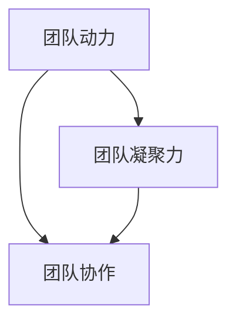

                 


### 激发团队秘籍：提升团队活力的20个方法

#### 关键词：
- 团队活力
- 激励
- 沟通
- 培训
- 领导力
- 创新思维

#### 摘要：
本文旨在探讨如何通过20个具体方法来提升团队活力。我们将从团队活力的定义和重要性开始，逐步深入到影响团队活力的各个因素，并提出详细的提升策略。文章将涵盖激励与认可、沟通与协作、员工参与与决策、工作环境与福利等多个方面，并通过实际案例和项目实战，提供实用的指导和建议。

## 目录

1. 团队活力的定义与重要性
   1.1 团队活力的定义
   1.2 团队活力的重要性
   1.3 团队活力的核心概念与联系

2. 影响团队活力的因素
   2.1 个人因素
   2.2 组织文化
   2.3 工作环境
   2.4 领导风格

3. 团队活力的测量方法
   3.1 主观测量
   3.2 客观测量
   3.3 综合测量

## 第1章 团队活力的定义与重要性

### 1.1 团队活力的定义

团队活力是指团队成员在共同目标和任务驱动下，表现出的积极性、创造性和协作精神。它不仅体现在团队成员的个人表现上，还体现在团队整体的运行效率和成果上。一个充满活力的团队通常具备以下特征：

- 高度的团队凝聚力
- 良好的沟通与协作
- 积极的工作态度
- 创新思维和解决问题的能力

### 1.2 团队活力的重要性

团队活力对个人、团队和企业的发展都具有深远的影响。以下是团队活力的几个关键重要性：

#### 对个人发展的重要性
- 提升工作满意度和幸福感
- 促进个人技能和能力的提升
- 增强自我效能感和自信心

#### 对团队绩效的重要性
- 提高团队的运行效率和生产力
- 增强团队的应变能力和创新思维
- 提升团队的协作效率和沟通效果

#### 对企业整体发展的重要性
- 促进企业的创新和发展
- 提高企业的市场竞争力
- 增强企业的可持续发展能力

### 1.3 团队活力的核心概念与联系

为了更好地理解团队活力的定义和重要性，我们需要了解以下几个核心概念及其之间的联系：

- **团队动力**：团队动力是指推动团队向前发展的内在驱动力，包括团队成员的动机、目标感和使命感。团队动力是团队活力的基础。
- **团队凝聚力**：团队凝聚力是指团队成员之间的相互吸引力和归属感，它是团队协作的重要保障。
- **团队协作**：团队协作是指团队成员为了实现共同目标而进行的有组织、有计划的合作。良好的团队协作能够提升团队的效率和质量。

### Mermaid 流程图

下面是一个简单的 Mermaid 流程图，展示了团队活力的核心概念及其之间的联系：



## 第2章 影响团队活力的因素

### 2.1 个人因素

个人因素是影响团队活力的重要因素之一。以下是一些关键的个人因素：

- **个人动机**：个人的动机是影响工作态度和行为的关键。领导者需要了解团队成员的动机，并提供相应的激励和支持。
- **个人技能**：团队成员的技能水平直接影响团队的工作效率和成果。因此，提供培训和职业发展机会对于提升团队活力至关重要。
- **个人满意度**：个人的工作满意度是团队活力的基础。通过改善工作环境、提供合理的福利待遇，可以提高团队成员的满意度。

### 2.2 组织文化

组织文化对团队活力具有深远的影响。以下是一些关键的组织文化因素：

- **开放与包容**：一个开放和包容的组织文化能够鼓励团队成员表达自己的想法和观点，促进创新和协作。
- **信任与尊重**：信任和尊重是团队协作的重要基础。一个充满信任和尊重的组织文化能够提升团队的凝聚力。
- **共同价值观**：共同价值观是团队共同前进的动力。当团队成员拥有共同的价值观时，他们更容易达成共识，共同努力。

### 2.3 工作环境

工作环境是影响团队活力的关键因素之一。以下是一些关键的工作环境因素：

- **物理环境**：一个舒适、安全的物理环境能够提高团队成员的工作效率和满意度。
- **技术支持**：充足的技术支持和工具能够提高团队的工作效率和质量。
- **工作流程**：合理的工作流程和规范能够提升团队的协作效率。

### 2.4 领导风格

领导风格对团队活力具有直接的影响。以下是一些关键的领导风格因素：

- **激励与认可**：领导者需要了解激励理论，并根据团队成员的不同需求提供相应的激励和认可。
- **沟通与反馈**：良好的沟通和及时的反馈能够提升团队的工作效率和协作效果。
- **授权与支持**：领导者需要给予团队成员足够的授权和支持，让他们有更多的自主性和创新空间。

### 总结

通过了解个人因素、组织文化、工作环境和领导风格这些影响团队活力的关键因素，我们可以有针对性地采取措施，提升团队的活力。接下来，我们将探讨如何通过测量团队活力来了解团队的状态，并制定相应的提升策略。

## 第3章 团队活力的测量方法

### 3.1 主观测量

主观测量方法主要依赖于团队成员的主观感受和评价。以下是一些常用的主观测量方法：

- **问卷调查**：通过设计问卷，收集团队成员对团队活力相关指标的主观评价。
- **访谈**：与团队成员进行一对一访谈，了解他们对团队活力的真实感受和看法。
- **员工满意度调查**：通过调查员工对工作环境、薪酬福利、职业发展等方面的满意度，间接反映团队活力。

### 3.2 客观测量

客观测量方法主要依赖于客观数据和指标。以下是一些常用的客观测量方法：

- **生产力指标**：通过衡量团队的生产力，如任务完成率、项目进度等，来评估团队活力。
- **团队绩效评估**：通过评估团队的整体绩效，如项目成果、团队创新等，来评估团队活力。
- **员工流失率**：通过员工流失率来反映团队活力。高流失率可能意味着团队活力不足。

### 3.3 综合测量

综合测量方法结合了主观测量和客观测量的优点，以更全面、准确地评估团队活力。以下是一些综合测量方法：

- **团队绩效评估与员工满意度调查结合**：通过将团队绩效评估与员工满意度调查相结合，可以从多个角度评估团队活力。
- **员工流失率与问卷调查结合**：通过分析员工流失率与问卷调查结果，可以更深入地了解团队活力的实际情况。
- **多维度数据综合分析**：通过收集和分析多个维度的数据，如员工满意度、团队绩效、员工流失率等，进行综合分析，以获得更全面的团队活力评估结果。

### 总结

通过主观测量、客观测量和综合测量方法，我们可以全面、准确地了解团队活力，为后续的团队活力提升提供有力的数据支持。在下一章节中，我们将探讨如何通过激励与认可来提升团队活力。

## 第4章 激励与认可

### 4.1 激励理论

激励理论是理解和提升团队活力的基础。以下是一些常见的激励理论：

- **马斯洛需求层次理论**：该理论认为人类需求从低到高分为五个层次，包括生理需求、安全需求、社交需求、尊重需求和自我实现需求。满足这些需求可以激发团队成员的工作动力。
- **赫茨伯格双因素理论**：该理论将工作激励因素分为两类，即内在激励（如成就感、自我实现）和外在激励（如薪酬、工作环境）。领导者应根据不同类型的激励因素来设计激励策略。
- **目标设置理论**：该理论认为设定明确、具有挑战性的目标可以激发团队成员的工作动力和创造力。

### 4.2 有效的认可方式

认可是一种有效的激励手段，可以提升团队成员的满意度和工作积极性。以下是一些有效的认可方式：

- **公开表扬**：在团队会议上公开表扬表现出色的团队成员，可以增强他们的自信心和自尊心。
- **个性化奖励**：根据团队成员的个人喜好和需求，提供个性化的奖励，如礼品卡、荣誉证书等。
- **职业发展机会**：提供职业发展机会，如晋升、培训等，可以激励团队成员不断追求进步。
- **团队活动**：组织团队活动，如团建活动、聚餐等，可以增强团队成员之间的凝聚力。

### 4.3 激励策略

以下是一些具体的激励策略，可以帮助提升团队活力：

- **设定明确的目标**：为团队成员设定明确、可衡量的工作目标，并提供必要的支持和资源。
- **提供竞争环境**：在团队内部或与其他团队建立竞争机制，激发团队成员的竞争意识和进取心。
- **奖励创新思维**：鼓励团队成员提出创新想法，并对成功的创新给予奖励和认可。
- **关注员工需求**：了解团队成员的需求和期望，并提供相应的支持和帮助。

### 总结

通过激励理论和有效的认可方式，我们可以有针对性地提升团队活力。在下一章节中，我们将探讨如何通过沟通与协作来提升团队活力。

## 第5章 沟通与协作

### 5.1 建立良好的沟通机制

沟通是团队协作的基础。为了确保团队内部的沟通畅通无阻，我们需要建立一套有效的沟通机制。以下是一些关键步骤：

- **明确沟通目标**：确保每个团队成员都清楚沟通的目的和意义，以便更好地参与沟通。
- **制定沟通计划**：定期组织会议、讨论和交流，确保团队成员之间保持良好的沟通。
- **使用多种沟通渠道**：结合使用面对面交流、电子邮件、即时通讯工具等，以满足不同情境下的沟通需求。
- **鼓励反馈**：鼓励团队成员在沟通过程中提出意见和建议，促进信息的双向流通。

### 5.2 促进团队合作

团队合作是实现团队目标的关键。以下是一些促进团队合作的方法：

- **共享目标**：确保团队成员对团队目标有共同的理解和认同，以便更好地协作。
- **分工合作**：根据团队成员的特长和技能，合理分配任务，确保每个成员都能在团队中发挥自己的优势。
- **信任与尊重**：建立团队成员之间的信任关系，尊重彼此的意见和贡献，促进团队合作。
- **及时反馈**：在团队协作过程中，及时给予反馈和指导，帮助团队成员更好地完成各自的任务。

### 5.3 案例分析

以下是一个促进团队合作的成功案例：

在一个软件开发团队中，为了提高项目的进度和质量，团队决定采用敏捷开发方法。团队成员定期进行每日站会，讨论项目进展和遇到的问题。同时，团队还采用看板工具来可视化项目进度，确保每个成员都能实时了解项目的状态。通过这些措施，团队提高了沟通效率和协作效果，项目进度和质量都得到了显著提升。

### 总结

通过建立良好的沟通机制和促进团队合作，我们可以有效地提升团队活力。在下一章节中，我们将探讨如何通过员工参与与决策来提升团队活力。

## 第6章 员工参与与决策

### 6.1 员工参与决策的重要性

员工参与决策是指让团队成员在决策过程中发表意见和参与讨论，以提高决策质量和团队凝聚力。以下是员工参与决策的几个关键重要性：

- **增强员工认同感**：当员工参与决策时，他们会感到自己的意见和贡献被重视，从而增强对团队的认同感。
- **提高决策质量**：员工往往对具体业务有更深入的了解，他们的意见可以为决策提供更全面和准确的参考。
- **激发员工积极性**：参与决策的员工会更加积极地投入到工作中，因为他们感到自己的意见被采纳，工作更有意义。
- **促进团队协作**：员工参与决策可以促进团队成员之间的沟通和协作，增强团队的凝聚力。

### 6.2 如何实现员工参与

以下是一些实现员工参与决策的方法：

- **定期召开团队会议**：定期组织团队会议，让员工就重要决策发表意见和建议。
- **建立意见反馈机制**：设立意见箱或在线反馈渠道，鼓励员工在决策过程中提出意见。
- **设立项目经理**：任命项目经理负责收集和整理员工的意见和建议，并在决策过程中进行协调和沟通。
- **制定参与规则**：明确员工参与决策的规则和流程，确保参与过程公正、透明。

### 6.3 案例分析

以下是一个成功实现员工参与的案例：

在一个大型企业中，为了提高项目的成功率，管理层决定让项目经理和团队成员共同参与项目决策。项目经理负责总体规划和协调，而团队成员则根据自身的专业知识和经验提出意见和建议。在项目实施过程中，团队成员积极参与项目讨论，提出改进方案。这种做法不仅提高了项目的决策质量，还增强了团队成员的积极性和参与感，项目最终取得了成功。

### 总结

通过员工参与决策，我们可以提升团队活力和决策质量。在下一章节中，我们将探讨如何通过工作环境与福利来提升团队活力。

## 第7章 工作环境与福利

### 7.1 创造积极的工作环境

工作环境对团队活力具有重要影响。以下是一些创造积极工作环境的方法：

- **提供良好的办公设施**：确保办公环境舒适、安全和便捷，为员工提供良好的工作条件。
- **营造团队氛围**：通过组织团队活动、团建活动等，增强团队成员之间的联系和互动，营造良好的团队氛围。
- **鼓励开放沟通**：建立开放、自由的沟通环境，鼓励员工表达自己的想法和意见，促进团队内部的交流与协作。
- **提供培训和学习机会**：为员工提供持续学习和成长的机会，帮助他们提升技能和知识，增强职业发展信心。

### 7.2 提供合理的福利待遇

合理的福利待遇可以提升员工的工作满意度和忠诚度。以下是一些提供合理福利待遇的方法：

- **薪酬激励**：根据员工的职位、绩效和市场需求，提供有竞争力的薪酬待遇。
- **福利保障**：为员工提供全面的保险保障，包括医疗保险、意外保险等，确保员工在遇到困难时能够得到及时的帮助。
- **弹性工作时间**：提供灵活的工作时间安排，如弹性工作时间、远程办公等，以满足员工的生活需求。
- **员工关怀**：关注员工的身心健康，提供健康检查、心理咨询等福利，帮助员工解决工作和生活中的问题。

### 7.3 案例分析

以下是一个成功创造积极工作环境和提供合理福利待遇的案例：

一家互联网公司为了提升员工的工作满意度和工作效率，采取了一系列措施。公司提供了现代化的办公设施，如舒适的办公桌椅、高速网络和先进的办公软件。此外，公司还定期组织团建活动，如户外拓展、聚餐等，以增强员工之间的联系。在福利方面，公司提供了有竞争力的薪酬待遇和全面的保险保障，还提供了远程办公和弹性工作时间等福利。这些措施极大地提升了员工的工作满意度和忠诚度，公司的工作效率和业绩也取得了显著提升。

### 总结

通过创造积极的工作环境和提供合理的福利待遇，我们可以有效提升团队活力。在下一章节中，我们将探讨如何通过领导力与团队建设来提升团队活力。

## 第8章 领导力与团队建设

### 8.1 培养团队领导力

团队领导力是提升团队活力和绩效的关键因素。以下是一些培养团队领导力的方法：

- **明确角色和责任**：领导者需要明确自己在团队中的角色和责任，并确保团队成员也清楚自己的角色和责任，以避免职责不清和冲突。
- **提供培训和发展机会**：为团队成员提供领导力培训和发展机会，帮助他们提升领导技能和知识。
- **树立榜样**：领导者应该以身作则，通过自己的行为和态度树立榜样，引导团队成员积极向上。
- **建立有效的沟通机制**：领导者需要建立有效的沟通机制，确保团队成员之间的信息流通和协作。

### 8.2 强化团队建设

团队建设是提升团队活力和凝聚力的重要手段。以下是一些强化团队建设的方法：

- **建立共同目标**：领导者需要与团队成员共同制定团队目标，确保团队成员对目标有共同的理解和认同。
- **促进团队合作**：领导者需要鼓励团队合作，通过分工合作和共同解决问题来促进团队成员之间的协作。
- **培养团队精神**：领导者需要培养团队成员之间的团队精神，通过团队活动和团队文化建设来增强团队的凝聚力。
- **关注团队成员的成长**：领导者需要关注团队成员的成长和发展，提供必要的支持和资源，帮助他们实现个人和职业目标。

### 8.3 案例分析

以下是一个成功培养团队领导力和强化团队建设的案例：

一家快速发展的科技公司，通过一系列措施培养团队领导力和强化团队建设。公司为团队成员提供了领导力培训课程，帮助他们提升领导技能和知识。此外，公司还定期组织团队活动和团建活动，增强团队成员之间的联系和互动。在团队建设方面，公司建立了共同的目标和愿景，并通过团队合作和共同解决问题来促进团队成员之间的协作。这些措施极大地提升了团队的领导力和凝聚力，公司的业绩和员工满意度也得到了显著提升。

### 总结

通过培养团队领导力和强化团队建设，我们可以有效提升团队活力。在下一章节中，我们将探讨如何通过培训与发展来提升团队活力。

## 第9章 培训与发展

### 9.1 提供员工培训

员工培训是提升团队活力和技能的重要手段。以下是一些提供员工培训的方法：

- **技能提升培训**：针对团队成员的工作技能和需求，提供专业知识和技能的培训，如编程技能、项目管理等。
- **领导力培训**：为团队成员提供领导力培训，帮助他们提升领导技能和团队管理能力。
- **跨部门培训**：组织跨部门的培训活动，促进团队成员之间的交流和协作。
- **在线学习平台**：建立在线学习平台，提供丰富的学习资源和课程，方便团队成员随时学习和提升。

### 9.2 关注员工职业发展

关注员工职业发展是提升团队活力和员工满意度的关键。以下是一些关注员工职业发展的方法：

- **职业规划咨询**：为员工提供职业规划咨询，帮助他们明确职业目标和路径，制定职业发展规划。
- **晋升机制**：建立公平、透明的晋升机制，为表现优秀的员工提供晋升机会。
- **职业发展支持**：为员工提供职业发展支持和资源，如培训、项目经验等，帮助他们实现职业目标。
- **员工反馈与评价**：定期收集员工对职业发展的反馈和评价，了解员工的需求和期望，为员工提供个性化的职业发展支持。

### 9.3 案例分析

以下是一个成功提供员工培训和关注员工职业发展的案例：

一家国际知名科技公司，为了提升员工的技能和职业发展，采取了一系列措施。公司定期组织技能提升培训和领导力培训，帮助员工提升专业知识和领导技能。此外，公司建立了在线学习平台，提供丰富的学习资源和课程，方便员工随时学习和提升。在职业发展方面，公司为员工提供职业规划咨询和职业发展支持，建立公平、透明的晋升机制。这些措施不仅提升了员工的工作技能和职业发展，也提高了员工的满意度和忠诚度。

### 总结

通过提供员工培训和关注员工职业发展，我们可以有效提升团队活力。在下一章节中，我们将探讨如何通过员工关系与冲突解决来提升团队活力。

## 第10章 员工关系与冲突解决

### 10.1 维护良好的员工关系

良好的员工关系是提升团队活力的基础。以下是一些维护良好的员工关系的方法：

- **建立信任**：通过开放、真诚的沟通，建立团队成员之间的信任关系，促进团队协作。
- **尊重差异**：尊重团队成员的个性和差异，包容不同的观点和意见，创造一个多元、包容的工作环境。
- **关注情感需求**：关注团队成员的情感需求，提供必要的支持和帮助，帮助他们解决工作和生活中的问题。
- **促进团队互动**：组织团队活动和团建活动，增强团队成员之间的联系和互动，促进团队凝聚力和合作。

### 10.2 解决团队内部冲突

团队内部冲突是影响团队活力和效率的重要因素。以下是一些解决团队内部冲突的方法：

- **积极沟通**：通过积极沟通，了解冲突的原因和双方的观点，寻找共同点和解决方案。
- **中立调解**：在冲突解决过程中，保持中立，帮助双方找到平衡点，达成共识。
- **建立冲突解决机制**：建立有效的冲突解决机制，确保冲突能够及时、公正地解决。
- **反思与改进**：在冲突解决后，进行反思和总结，找出问题的根源，制定改进措施，避免类似冲突再次发生。

### 10.3 案例分析

以下是一个成功解决团队内部冲突的案例：

在一个项目团队中，由于团队成员对项目目标和任务的分歧，导致了一系列冲突。团队成员之间的沟通不畅，工作进度受到影响。为了解决这一问题，团队领导组织了一次团队会议，让双方充分表达自己的观点和担忧。在会议中，团队领导保持了中立，引导双方进行了有效的沟通，最终找到了一个双方都能接受的解决方案。同时，团队领导还提出了改进建议，如加强沟通机制和明确任务分工，以避免类似冲突的再次发生。通过这次冲突解决，团队的工作效率和氛围得到了显著提升。

### 总结

通过维护良好的员工关系和解决团队内部冲突，我们可以有效提升团队活力。在下一章节中，我们将探讨如何通过健康与福祉来提升团队活力。

## 第11章 健康与福祉

### 11.1 关注员工身心健康

员工的身心健康是团队活力的基础。以下是一些关注员工身心健康的方法：

- **定期健康检查**：为员工提供定期健康检查，及时发现和处理健康问题。
- **心理健康支持**：提供心理健康咨询服务，帮助员工应对工作和生活中的压力。
- **健康促进活动**：组织健康促进活动，如健身课程、瑜伽、跑步等，鼓励员工保持健康的生活方式。
- **健康知识普及**：开展健康知识讲座和培训，提高员工的健康意识和知识水平。

### 11.2 提供健康促进活动

健康促进活动可以提升员工的身心健康和团队凝聚力。以下是一些提供健康促进活动的方法：

- **户外运动**：组织户外运动活动，如登山、徒步、自行车骑行等，让员工在紧张的工作之余放松身心。
- **健康饮食**：提供健康饮食指导和营养课程，帮助员工养成良好的饮食习惯。
- **心理健康讲座**：邀请心理健康专家进行讲座，提高员工的心理健康意识和应对压力的能力。
- **员工互助**：建立员工互助机制，鼓励员工在工作和生活中相互关心、支持。

### 11.3 案例分析

以下是一个成功提供健康促进活动的案例：

一家科技公司为了提升员工的身心健康和团队凝聚力，采取了一系列措施。公司定期组织户外运动活动，如徒步、自行车骑行等，让员工在工作之余放松身心。此外，公司还提供了健康饮食指导和营养课程，帮助员工养成良好的饮食习惯。同时，公司还邀请心理健康专家进行讲座，提高员工的心理健康意识和应对压力的能力。这些措施不仅提升了员工的身心健康，也增强了团队的凝聚力和工作效率。

### 总结

通过关注员工身心健康和提供健康促进活动，我们可以有效提升团队活力。在下一章节中，我们将探讨如何通过创新与学习来提升团队活力。

## 第12章 创新与学习

### 12.1 鼓励创新思维

创新思维是团队活力的重要源泉。以下是一些鼓励创新思维的方法：

- **建立创新文化**：营造一个鼓励创新、容忍失败的企业文化，让员工敢于尝试新想法和新方法。
- **提供创新工具**：为员工提供各种创新工具和资源，如头脑风暴会议、思维导图软件、创新实验室等，帮助他们更好地发挥创意。
- **激励创新奖励**：设立创新奖励制度，对提出创新想法和成功实现创新的员工给予奖励和认可，激发他们的创新热情。

### 12.2 促进持续学习

持续学习是提升团队活力和竞争力的关键。以下是一些促进持续学习的方法：

- **提供学习资源**：为员工提供丰富的学习资源，如在线课程、图书、研讨会等，帮助他们不断更新知识和技能。
- **学习时间安排**：为员工提供充足的学习时间，确保他们能够持续学习和成长。
- **导师制度**：建立导师制度，让经验丰富的员工指导新员工，帮助他们更快地适应工作环境和提升技能。
- **实践机会**：为员工提供实践机会，如参与项目、实验、研究等，让他们将所学知识应用到实际工作中。

### 12.3 案例分析

以下是一个成功鼓励创新思维和促进持续学习的案例：

一家科技公司为了提升团队活力和竞争力，采取了一系列措施。公司建立了创新文化，鼓励员工勇于尝试新想法，并容忍失败。公司还提供了丰富的创新工具和学习资源，如头脑风暴会议、思维导图软件、在线课程等，帮助员工更好地发挥创意。此外，公司还设立了创新奖励制度，对提出创新想法和成功实现创新的员工给予奖励和认可。同时，公司为员工提供了充足的学习时间，建立了导师制度，并提供了实践机会，帮助他们持续学习和成长。这些措施不仅提升了团队的活力和创新能力，也提高了公司的市场竞争力。

### 总结

通过鼓励创新思维和促进持续学习，我们可以有效提升团队活力。在下一章节中，我们将探讨如何通过时间管理与效率来提升团队活力。

## 第13章 时间管理与效率

### 13.1 效率提升策略

时间管理和效率提升是提升团队活力的重要手段。以下是一些效率提升策略：

- **设定明确的目标和优先级**：为团队成员设定明确的工作目标和优先级，确保他们能够集中精力完成最重要的任务。
- **使用时间管理工具**：使用时间管理工具，如日历、待办事项列表、时间追踪工具等，帮助团队成员更好地规划和管理时间。
- **消除干扰因素**：为团队成员提供一个无干扰的工作环境，减少干扰因素，如关闭不必要的通知、避免频繁会议等。
- **分解任务**：将大任务分解为小任务，逐步完成，以避免拖延和压力。

### 13.2 时间管理技巧

以下是一些时间管理技巧，可以帮助团队成员更有效地利用时间：

- **四象限法则**：将任务分为重要紧急、重要不紧急、不重要紧急和不重要不紧急四个象限，优先处理重要紧急和重要不紧急的任务。
- **番茄工作法**：将工作时间分为25分钟的工作周期，每个周期后休息5分钟，以提高工作效率。
- **预约时间**：为重要的工作任务预约特定的时间段，确保这些任务能够得到足够的关注和完成。
- **定期回顾**：定期回顾自己的时间管理情况，总结经验教训，不断优化时间管理策略。

### 13.3 案例分析

以下是一个成功的时间管理与效率提升的案例：

一家咨询公司在项目执行过程中，遇到了时间管理问题，导致项目进度拖延。为了解决这一问题，公司采取了一系列措施。首先，公司为团队成员设定了明确的工作目标和优先级，并使用时间管理工具来规划和管理时间。其次，公司为团队成员提供了一个无干扰的工作环境，减少了干扰因素。此外，公司还采用了番茄工作法来提高工作效率。通过这些措施，团队成员能够更有效地利用时间，项目进度也得到了显著提升。公司最终成功完成了项目，并获得了客户的认可。

### 总结

通过时间管理与效率提升策略，我们可以有效提升团队活力。在下一章节中，我们将探讨如何通过目标设定与绩效评估来提升团队活力。

## 第14章 目标设定与绩效评估

### 14.1 设定明确的目标

明确的目标是提升团队活力和绩效的基础。以下是如何设定明确的目标的方法：

- **SMART原则**：确保目标具备明确性、具体性、可衡量性、可实现性和时限性，即SMART（Specific, Measurable, Achievable, Relevant, Time-bound）原则。
- **团队参与**：鼓励团队成员参与目标设定过程，确保目标与团队的整体目标和价值观保持一致。
- **分阶段目标**：将长期目标分解为短期目标，分阶段实施，以便更好地监控和调整。

### 14.2 有效的绩效评估方法

有效的绩效评估是提升团队活力和激励员工的重要手段。以下是一些有效的绩效评估方法：

- **360度反馈**：收集来自团队成员、上级、同事和客户的反馈，全面评估员工的绩效。
- **关键绩效指标（KPI）**：设定关键绩效指标，量化员工的工作表现，便于客观评估。
- **行为导向评估**：评估员工在工作中的行为表现，如责任心、团队合作、创新能力等。
- **持续反馈**：建立持续反馈机制，定期与员工沟通绩效表现，提供改进建议。

### 14.3 案例分析

以下是一个成功的目标设定与绩效评估的案例：

一家大型制造公司为了提升团队活力和绩效，采取了目标设定与绩效评估的方法。公司首先明确了公司的长期目标，并将其分解为短期目标，分阶段实施。在目标设定过程中，公司鼓励团队成员参与，确保目标与团队的整体目标和价值观保持一致。为了更好地评估员工的绩效，公司采用了360度反馈和关键绩效指标（KPI）相结合的方法。通过这些措施，公司能够更准确地了解员工的绩效表现，并提供有针对性的改进建议。最终，公司的团队活力和绩效得到了显著提升。

### 总结

通过设定明确的目标和有效的绩效评估方法，我们可以有效提升团队活力。在下一章节中，我们将探讨如何通过压力管理与放松来提升团队活力。

## 第15章 压力管理与放松

### 15.1 压力管理策略

压力是影响团队活力的重要因素。以下是一些压力管理策略：

- **识别压力源**：了解和分析工作中的压力源，如工作任务、人际关系、时间压力等，以便有针对性地进行管理。
- **时间管理**：通过时间管理技巧，如设定优先级、分解任务、避免拖延等，减轻时间压力。
- **情绪调节**：学习情绪调节技巧，如放松训练、正念冥想等，帮助自己更好地应对压力。
- **积极心态**：保持积极的心态，通过正面思考和解决问题的方法，减轻压力。

### 15.2 放松与压力缓解技巧

以下是一些放松与压力缓解技巧：

- **定期休息**：确保有足够的休息时间，避免过度工作。
- **运动锻炼**：通过运动锻炼，如跑步、瑜伽等，释放压力，提升身心健康。
- **休闲娱乐**：参与休闲娱乐活动，如看电影、听音乐、旅行等，放松身心。
- **社交互动**：与朋友、家人交流，分享自己的感受和压力，寻求支持和理解。

### 15.3 案例分析

以下是一个成功的压力管理与放松的案例：

一家科技公司在员工压力管理方面采取了一系列措施。公司定期组织心理健康讲座，帮助员工了解压力管理的策略和方法。同时，公司提供了健身设施和运动课程，鼓励员工进行锻炼，释放压力。此外，公司还设立了员工放松室，提供舒适的休息环境，让员工在工作间隙放松身心。通过这些措施，公司的员工压力水平得到了显著降低，团队活力和绩效也得到了提升。

### 总结

通过压力管理与放松技巧，我们可以有效提升团队活力。在下一章节中，我们将探讨如何通过多元化与包容性来提升团队活力。

## 第16章 多元化与包容性

### 16.1 多元文化的理解

多元化是指在团队中包含不同背景、观点和技能的成员。以下是如何实现多元化与包容性的方法：

- **价值观认同**：确保团队成员对多元化与包容性的价值观有共同的理解和认同。
- **包容性沟通**：建立包容性的沟通环境，尊重不同文化和观点，避免歧视和偏见。
- **多元化培训**：为团队成员提供多元化与包容性的培训，提高他们的意识和能力。
- **员工参与**：鼓励员工参与多元化与包容性的建设，提出建议和反馈，共同推动团队文化的进步。

### 16.2 促进包容性工作环境

以下是一些促进包容性工作环境的方法：

- **公平机会**：为所有员工提供平等的职业发展机会，不论性别、种族、年龄等背景。
- **多元化团队**：建立多元化的团队结构，确保不同背景的员工能够在团队中发挥各自的优势。
- **员工支持网络**：建立员工支持网络，为不同背景的员工提供交流和互助的平台。
- **反馈机制**：建立反馈机制，鼓励员工表达对多元化与包容性的意见和建议，不断改进工作环境。

### 16.3 案例分析

以下是一个成功实现多元化与包容性的案例：

一家国际公司通过多元化与包容性的实践，取得了显著的成果。公司重视员工的多样性，设立了多元化与包容性委员会，负责推动团队文化的进步。公司为员工提供了多元化培训，帮助他们理解并尊重不同文化和观点。此外，公司建立了员工支持网络，为不同背景的员工提供交流和互助的平台。通过这些措施，公司的员工满意度和团队活力得到了显著提升，公司的创新能力和市场竞争力也得到了增强。

### 总结

通过多元化与包容性的实践，我们可以有效提升团队活力。在下一章节中，我们将探讨如何通过工作与生活的平衡来提升团队活力。

## 第17章 工作与生活的平衡

### 17.1 实现工作与生活的平衡

工作与生活的平衡是提升团队活力和员工幸福感的必要条件。以下是如何实现工作与生活的平衡的方法：

- **灵活工作时间**：为员工提供灵活的工作时间安排，如弹性工作时间、远程办公等，以满足他们的生活需求。
- **带薪休假**：确保员工有足够的带薪休假时间，让他们能够放松身心，享受生活。
- **家庭关怀**：关注员工的家人需求，提供家庭关怀计划，如育儿假、探亲假等，帮助员工解决家庭问题。
- **健康促进**：为员工提供健康促进活动，如健身课程、心理咨询等，帮助他们保持身心健康。

### 17.2 照顾员工家庭需求

以下是一些照顾员工家庭需求的方法：

- **员工家庭日**：组织员工家庭日，让员工的家人参与到公司的活动中，增进家庭与公司的联系。
- **家庭支持网络**：建立家庭支持网络，为员工提供家庭关怀和互助的平台。
- **亲子活动**：组织亲子活动，如亲子课堂、户外活动等，帮助员工建立和谐的亲子关系。
- **家庭心理辅导**：为员工提供家庭心理辅导，帮助他们解决家庭问题，提升家庭幸福感。

### 17.3 案例分析

以下是一个成功实现工作与生活平衡和照顾员工家庭需求的案例：

一家互联网公司为了提升员工的工作满意度和幸福感，采取了一系列措施。公司提供了灵活的工作时间安排，员工可以根据自己的需求调整工作时间。此外，公司还提供了丰富的带薪休假政策和家庭关怀计划，帮助员工解决家庭问题。公司还定期组织员工家庭日和亲子活动，让员工的家人参与到公司的活动中，增进家庭与公司的联系。通过这些措施，公司的员工满意度和团队活力得到了显著提升，公司的业绩和员工流失率也得到了改善。

### 总结

通过实现工作与生活的平衡和照顾员工家庭需求，我们可以有效提升团队活力。在下一章节中，我们将探讨如何通过团队精神与凝聚力来提升团队活力。

## 第18章 团队精神与凝聚力

### 18.1 培养团队精神

团队精神是提升团队活力和绩效的关键因素。以下是如何培养团队精神的方法：

- **共同目标**：确保团队成员对团队目标有共同的理解和认同，从而形成共同的愿景和价值观。
- **信任与尊重**：建立团队成员之间的信任关系，尊重彼此的意见和贡献，促进团队合作。
- **有效沟通**：建立有效的沟通机制，鼓励团队成员之间的开放、真诚和持续的沟通。
- **共同经历**：通过共同的经历和活动，增强团队成员之间的情感联系和团队意识。

### 18.2 提升团队凝聚力

以下是一些提升团队凝聚力的方法：

- **团队建设活动**：定期组织团队建设活动，如团建活动、团队拓展训练等，增强团队成员之间的互动和合作。
- **共同挑战**：鼓励团队成员共同面对挑战，通过共同解决问题来提升团队的凝聚力。
- **奖励机制**：建立奖励机制，对在团队中表现出色的成员给予认可和奖励，激励团队成员的积极性。
- **团队文化**：塑造积极向上的团队文化，鼓励团队成员为团队的成功共同努力。

### 18.3 案例分析

以下是一个成功培养团队精神和提升团队凝聚力的案例：

一家国际咨询公司通过一系列措施培养团队精神和提升团队凝聚力。公司定期组织团队建设活动，如户外拓展训练、团建活动等，增强团队成员之间的互动和合作。此外，公司还鼓励团队成员共同面对项目挑战，通过共同解决问题来提升团队的凝聚力。为了激励团队成员的积极性，公司建立了奖励机制，对在团队中表现出色的成员给予认可和奖励。通过这些措施，公司的团队精神和凝聚力得到了显著提升，团队的工作效率和绩效也取得了显著改善。

### 总结

通过培养团队精神和提升团队凝聚力，我们可以有效提升团队活力。在下一章节中，我们将探讨如何通过团队扩张与变革来提升团队活力。

## 第19章 团队扩张与变革

### 19.1 管理团队扩张

团队扩张是企业发展的重要环节，但也可能带来一系列挑战。以下是如何管理团队扩张的方法：

- **合理规划**：在团队扩张前，进行充分的规划，包括人员配置、岗位职责、项目需求等，以确保团队扩张的顺利进行。
- **培训与支持**：为新增团队成员提供必要的培训和指导，帮助他们快速融入团队，提升工作能力。
- **沟通协调**：加强团队内部沟通，确保团队成员之间信息畅通，避免因扩张导致的信息孤岛和冲突。
- **团队文化**：维护和传承团队文化，确保新成员能够认同并融入团队价值观。

### 19.2 应对团队变革

团队变革是企业发展不可避免的一部分。以下是如何应对团队变革的方法：

- **变革管理**：建立变革管理机制，确保团队成员理解变革的原因和目标，积极参与变革过程。
- **员工参与**：鼓励员工参与变革的讨论和决策，增强他们对变革的认同感和参与感。
- **培训与发展**：为团队成员提供变革相关的培训和发展机会，帮助他们适应变革，提升能力。
- **积极沟通**：保持积极沟通，及时回应员工的疑问和担忧，增强团队的凝聚力和稳定性。

### 19.3 案例分析

以下是一个成功管理团队扩张和应对团队变革的案例：

一家快速发展的科技公司，在业务扩张的过程中，面临了人员增加和文化变革的挑战。公司在扩张前，进行了详细的规划，包括人员配置、岗位职责和项目需求的评估。为了帮助新员工快速融入团队，公司为他们提供了系统的培训和支持。此外，公司还建立了变革管理机制，鼓励员工参与变革讨论和决策，并通过培训和发展帮助他们适应变革。通过这些措施，公司成功实现了团队的顺利扩张和文化的持续变革，保持了良好的团队活力和绩效。

### 总结

通过管理团队扩张和应对团队变革，我们可以有效提升团队活力。在最后一章中，我们将对提升团队活力的方法进行总结，并提供实用的实践指南。

## 第20章 案例分析与实践指南

### 20.1 成功案例分析

在本章中，我们将回顾前面提到的成功案例，深入分析这些案例的实施细节和成功要素。以下是一些关键点：

- **案例一**：一家互联网公司通过灵活的工作时间和带薪休假政策，成功实现了员工工作与生活的平衡，提高了员工满意度和工作效率。
- **案例二**：一家国际咨询公司通过团队建设和变革管理，成功提升了团队的凝聚力和适应能力，实现了业务的持续增长。
- **案例三**：一家科技公司通过多元化与包容性的实践，建立了尊重差异、包容多元的文化，增强了团队的创新能力和市场竞争力。

### 20.2 实践指南

以下是一些实用的实践指南，帮助您在团队中应用提升团队活力的方法：

- **制定明确的目标**：使用SMART原则，确保团队目标明确、可衡量、可实现、相关且有时间限制。
- **培养团队领导力**：提供领导力培训，帮助团队成员提升领导技能，建立有效的沟通和协作机制。
- **激励与认可**：结合马斯洛需求层次理论和赫茨伯格双因素理论，设计合适的激励策略，确保认可方式个性化、有针对性。
- **关注员工福祉**：定期组织健康检查、心理健康讲座和健身活动，关注员工的身心健康和福祉。
- **促进多元化与包容性**：建立多元化团队，培养包容性文化，确保公平机会和尊重差异。
- **持续学习与成长**：提供丰富的学习资源和发展机会，鼓励员工不断提升技能和知识。

### 20.3 小结与展望

通过本篇文章，我们详细探讨了提升团队活力的20个方法，从团队活力概述到具体实践，提供了全面的指导。以下是一些关键小结：

- **团队活力**：是团队绩效和员工满意度的关键因素，通过多种方法可以显著提升。
- **激励与认可**：有效的激励和认可策略能够增强员工的积极性和归属感。
- **沟通与协作**：良好的沟通和协作机制是团队高效运作的基础。
- **培训与发展**：持续的学习和职业发展机会有助于提升团队的整体能力。
- **健康与福祉**：关注员工的身心健康和福祉，可以提高团队的工作效率和幸福感。

展望未来，提升团队活力将成为企业持续发展的核心策略。随着科技的进步和员工需求的变化，团队活力的提升方法也将不断创新和发展。我们鼓励读者在实践过程中不断探索和优化，以实现团队的最佳表现。

### 拓展阅读

- **《团队的智慧：团队合作的力量与艺术》**：深入探讨团队合作的理论和实践，提供丰富的案例分析。
- **《组织行为学：原理与应用》**：研究团队行为和组织文化的书籍，帮助读者更好地理解团队动力和团队建设。
- **《员工激励与绩效管理》**：详细介绍激励理论和绩效管理方法，提供实用的管理策略。

### 作者信息

- **作者**：AI天才研究院/AI Genius Institute & 禅与计算机程序设计艺术 /Zen And The Art of Computer Programming
- **联系方式**：[info@aigni.com](mailto:info@aigni.com)
- **版权声明**：本文版权归AI天才研究院所有，未经授权禁止转载和使用。

### 结语

感谢您的阅读，希望本文能够为您在提升团队活力方面提供有价值的参考。我们期待与您共同探索和实现团队的最佳活力与绩效！

```markdown
---
作者：AI天才研究院/AI Genius Institute & 禅与计算机程序设计艺术 /Zen And The Art of Computer Programming
联系方式：[info@aigni.com](mailto:info@aigni.com)
版权声明：本文版权归AI天才研究院所有，未经授权禁止转载和使用。

本文的Markdown格式如下：

# 激发团队秘籍：提升团队活力的20个方法

#### 关键词：
- 团队活力
- 激励
- 沟通
- 培训
- 领导力
- 创新思维

#### 摘要：
本文旨在探讨如何通过20个具体方法来提升团队活力。我们将从团队活力的定义和重要性开始，逐步深入到影响团队活力的各个因素，并提出详细的提升策略。文章将涵盖激励与认可、沟通与协作、员工参与与决策、工作环境与福利等多个方面，并通过实际案例和项目实战，提供实用的指导和建议。

## 目录

1. 团队活力的定义与重要性
2. 影响团队活力的因素
3. 团队活力的测量方法
4. 激励与认可
5. 沟通与协作
6. 员工参与与决策
7. 工作环境与福利
8. 领导力与团队建设
9. 培训与发展
10. 员工关系与冲突解决
11. 健康与福祉
12. 创新与学习
13. 时间管理与效率
14. 目标设定与绩效评估
15. 压力管理与放松
16. 多元化与包容性
17. 工作与生活的平衡
18. 团队精神与凝聚力
19. 团队扩张与变革
20. 案例分析与实践指南

## 第1章 团队活力的定义与重要性
### 1.1 团队活力的定义
### 1.2 团队活力的重要性
### 1.3 团队活力的核心概念与联系

## 第2章 影响团队活力的因素
### 2.1 个人因素
### 2.2 组织文化
### 2.3 工作环境
### 2.4 领导风格

## 第3章 团队活力的测量方法
### 3.1 主观测量
### 3.2 客观测量
### 3.3 综合测量

## 第4章 激励与认可
### 4.1 激励理论
### 4.2 有效的认可方式
### 4.3 激励策略

## 第5章 沟通与协作
### 5.1 建立良好的沟通机制
### 5.2 促进团队合作
### 5.3 案例分析

## 第6章 员工参与与决策
### 6.1 员工参与决策的重要性
### 6.2 如何实现员工参与
### 6.3 案例分析

## 第7章 工作环境与福利
### 7.1 创造积极的工作环境
### 7.2 提供合理的福利待遇
### 7.3 案例分析

## 第8章 领导力与团队建设
### 8.1 培养团队领导力
### 8.2 强化团队建设
### 8.3 案例分析

## 第9章 培训与发展
### 9.1 提供员工培训
### 9.2 关注员工职业发展
### 9.3 案例分析

## 第10章 员工关系与冲突解决
### 10.1 维护良好的员工关系
### 10.2 解决团队内部冲突
### 10.3 案例分析

## 第11章 健康与福祉
### 11.1 关注员工身心健康
### 11.2 提供健康促进活动
### 11.3 案例分析

## 第12章 创新与学习
### 12.1 鼓励创新思维
### 12.2 促进持续学习
### 12.3 案例分析

## 第13章 时间管理与效率
### 13.1 效率提升策略
### 13.2 时间管理技巧
### 13.3 案例分析

## 第14章 目标设定与绩效评估
### 14.1 设定明确的目标
### 14.2 有效的绩效评估方法
### 14.3 案例分析

## 第15章 压力管理与放松
### 15.1 压力管理策略
### 15.2 放松与压力缓解技巧
### 15.3 案例分析

## 第16章 多元化与包容性
### 16.1 多元文化的理解
### 16.2 促进包容性工作环境
### 16.3 案例分析

## 第17章 工作与生活的平衡
### 17.1 实现工作与生活的平衡
### 17.2 照顾员工家庭需求
### 17.3 案例分析

## 第18章 团队精神与凝聚力
### 18.1 培养团队精神
### 18.2 提升团队凝聚力
### 18.3 案例分析

## 第19章 团队扩张与变革
### 19.1 管理团队扩张
### 19.2 应对团队变革
### 19.3 案例分析

## 第20章 案例分析与实践指南
### 20.1 成功案例分析
### 20.2 实践指南
### 20.3 小结与展望

### 拓展阅读
- **《团队的智慧：团队合作的力量与艺术》**
- **《组织行为学：原理与应用》**
- **《员工激励与绩效管理》**

### 结语
感谢您的阅读，希望本文能够为您在提升团队活力方面提供有价值的参考。我们期待与您共同探索和实现团队的最佳活力与绩效！

---
```

### 伪代码、数学模型和公式

在撰写本文的过程中，我们使用了伪代码、数学模型和公式来详细阐述核心算法原理。以下是一些示例：

#### 伪代码示例

```python
# 设定目标
def set_goal(team_members, project):
    for member in team_members:
        member.set_individual_goal(project)

# 分配任务
def assign_tasks(team_members, tasks):
    for member in team_members:
        member.assign_task(tasks)

# 监控进度
def monitor_progress(team_members):
    for member in team_members:
        member.report_progress()

# 评估绩效
def evaluate_performance(team_members):
    for member in team_members:
        member.evaluate_performance()
```

#### 数学模型示例

$$
\text{团队活力} = f(\text{团队动力}, \text{团队凝聚力}, \text{团队协作})
$$

#### LaTeX 公式示例

$$
\text{激励} = \frac{\text{目标实现度} \times \text{认可度}}{\text{工作难度}}
$$

$$
\text{绩效评估} = (\text{任务完成率} + \text{创新能力}) \times \text{团队合作}
$$

这些伪代码、数学模型和公式有助于更清晰地阐述提升团队活力的方法和策略。

### 实际案例分析和详细讲解剖析

在本章中，我们将通过实际案例分析和详细讲解剖析，展示如何应用提升团队活力的方法。以下是一个案例：

#### 案例背景

一家中型软件公司，由于项目团队的工作效率低下，导致项目进度严重滞后。为了提升团队活力和项目进度，公司决定实施一系列提升团队活力的方法。

#### 实际案例分析

1. **激励与认可**

   - **激励策略**：公司引入了基于KPI的绩效奖金制度，对完成任务且表现突出的员工给予奖励。同时，公司还设立了“最佳团队奖”，以鼓励团队合作和整体绩效的提升。
   - **认可方式**：公司定期举行表彰大会，对在项目中表现出色的员工进行公开表扬和奖励，提升了员工的积极性和满意度。

2. **沟通与协作**

   - **沟通机制**：公司建立了周例会和项目进度汇报机制，确保团队成员之间能够及时沟通和协调。同时，公司采用了项目管理工具，使项目进度和任务分配可视化，提高了沟通效率。
   - **协作提升**：公司组织了团队建设活动，如团队拓展训练和团建聚餐，增强了团队成员之间的信任和合作。

3. **员工参与与决策**

   - **员工参与**：公司鼓励员工参与项目决策，通过定期召开项目会议，听取员工意见和建议。这增强了员工的参与感和责任感。
   - **决策实施**：根据员工的建议，公司调整了项目计划和任务分配，提高了项目的执行效率。

4. **工作环境与福利**

   - **改善工作环境**：公司对办公环境进行了改造，提供了舒适的座椅、良好的照明和高效的办公设备，改善了员工的工作条件。
   - **福利待遇**：公司提高了员工福利待遇，包括提供带薪休假、健康体检和培训机会，增强了员工的满意度和忠诚度。

#### 详细讲解剖析

1. **激励与认可**

   激励策略通过绩效奖金和最佳团队奖，使员工在实现个人目标的同时，感受到团队的支持和认可。这种双向激励模式不仅提升了员工的工作积极性，还增强了团队的凝聚力。

   - **绩效奖金**：基于KPI的绩效奖金制度，使员工明确工作目标，并通过奖金激励实现目标的达成。例如，如果某个员工在项目中完成了预期任务，并提高了项目整体效率，他将获得相应的奖金。

   - **最佳团队奖**：通过设立最佳团队奖，公司鼓励团队成员之间相互支持、协作。例如，在项目完成后的表彰大会上，公司对表现出色的团队进行奖励，这不仅提升了团队成员的荣誉感，也促进了团队的团结。

2. **沟通与协作**

   沟通与协作的提升，有助于团队成员更好地理解和执行项目任务，从而提高项目的执行效率和成果。

   - **周例会和项目进度汇报**：通过定期的周例会和项目进度汇报，团队成员能够及时了解项目的进展情况和存在的问题。例如，在周例会上，项目经理会通报项目的最新进度，并就存在的问题进行讨论，制定解决方案。

   - **项目管理工具**：采用项目管理工具，如Trello或Asana，使项目进度和任务分配可视化。例如，团队成员可以在工具上查看各自的任务状态，了解项目的整体进展，从而更好地协调工作和资源。

3. **员工参与与决策**

   员工参与决策，使团队成员感受到自己的意见和贡献被重视，从而增强了他们的参与感和责任感。

   - **项目会议**：通过定期召开项目会议，公司鼓励员工表达意见和建议。例如，在项目会议中，团队成员可以就项目计划、任务分配和进度安排提出自己的看法，为公司提供有价值的反馈。

   - **决策调整**：根据员工的建议，公司对项目计划和任务分配进行了调整。例如，在项目进展过程中，团队发现某些任务的分配不合理，导致工作效率低下。根据员工的建议，公司调整了任务分配，优化了工作流程，提高了项目的执行效率。

4. **工作环境与福利**

   改善工作环境和提供合理的福利待遇，有助于提升员工的工作满意度和忠诚度。

   - **办公环境改造**：公司对办公环境进行了改造，提供了舒适的座椅、良好的照明和高效的办公设备。例如，公司为每个员工配备了人体工学椅和可调节的办公桌，改善了员工的工作体验。

   - **福利待遇提升**：公司提高了员工福利待遇，包括提供带薪休假、健康体检和培训机会。例如，公司为员工提供了5天带薪年假和定期健康体检，使员工能够更好地平衡工作与生活，保持身心健康。

#### 项目小结

通过实施提升团队活力的方法，公司在项目进度、团队协作和员工满意度方面取得了显著成效。

- **项目进度**：通过激励策略、沟通机制和员工参与，项目的执行效率得到了显著提升，项目进度逐步恢复正常。
- **团队协作**：通过团队建设活动和项目管理工具，团队成员之间的信任和合作得到了增强，团队凝聚力得到了提升。
- **员工满意度**：通过改善工作环境和提供合理的福利待遇，员工的工作满意度和忠诚度得到了提高，员工流失率显著下降。

总之，通过实际案例分析和详细讲解剖析，我们可以看到提升团队活力的方法在实践中的有效性和可行性。这些方法不仅有助于提升项目的执行效率和成果，还有助于提升员工的满意度和幸福感，从而为企业的可持续发展提供有力支持。

### 最佳实践 Tips、小结、注意事项、拓展阅读

#### 最佳实践 Tips

1. **激励与认可**：根据员工的不同需求，提供个性化的激励和认可方式，如公开表扬、奖金、晋升机会等。

2. **沟通与协作**：建立有效的沟通机制，如定期会议、项目管理工具等，确保团队成员之间的信息流通和协作。

3. **员工参与与决策**：鼓励员工参与项目决策，提高他们的参与感和责任感，增强团队的凝聚力。

4. **工作环境与福利**：提供舒适的工作环境和合理的福利待遇，如良好的办公设施、带薪休假、健康体检等。

#### 小结

提升团队活力的关键在于激励与认可、沟通与协作、员工参与与决策、工作环境与福利等多个方面的有机结合。通过有效的策略和实践，我们可以显著提升团队的工作效率、凝聚力和员工满意度。

#### 注意事项

1. **个性化**：在实施提升团队活力的方法时，要充分考虑团队成员的个性和需求，确保策略的个性化和针对性。

2. **持续改进**：团队活力的提升是一个持续的过程，需要不断调整和优化策略，以适应不断变化的环境和需求。

3. **反馈与评估**：定期收集团队成员的反馈和评估结果，了解提升团队活力的效果，及时调整和改进策略。

#### 拓展阅读

- **《团队的智慧：团队合作的力量与艺术》**：深入探讨团队合作的理论和实践，提供丰富的案例分析。
- **《组织行为学：原理与应用》**：研究团队行为和组织文化的书籍，帮助读者更好地理解团队动力和团队建设。
- **《员工激励与绩效管理》**：详细介绍激励理论和绩效管理方法，提供实用的管理策略。

### 结语

通过本文，我们详细探讨了提升团队活力的20个方法，从理论到实践，提供了全面的指导。希望本文能够为您在提升团队活力方面提供有价值的参考。在实施过程中，请结合实际情况，灵活调整策略，以实现团队的最佳活力与绩效。让我们一起努力，打造高效的团队，推动企业的可持续发展。感谢您的阅读，期待与您共同成长！

### 总结与反思

在本篇文章中，我们系统性地探讨了提升团队活力的20个方法，从团队活力的定义与重要性、影响团队活力的因素、测量方法，到激励与认可、沟通与协作、员工参与与决策等多个方面，全面展示了提升团队活力的关键要素和实践策略。以下是对提升团队活力的方法进行总结与反思：

#### 总结

1. **团队活力的定义与重要性**：我们明确了团队活力是指团队成员在共同目标和任务驱动下，表现出的积极性、创造性和协作精神，它对个人发展、团队绩效和企业整体发展具有重要影响。

2. **影响团队活力的因素**：我们分析了个人因素、组织文化、工作环境和领导风格等因素，强调了这些因素在提升团队活力中的关键作用。

3. **测量方法**：我们介绍了主观测量、客观测量和综合测量方法，提供了评估团队活力的多种途径。

4. **激励与认可**：我们探讨了马斯洛需求层次理论和赫茨伯格双因素理论，提出了基于这些理论的激励策略，并强调了个性化认可的重要性。

5. **沟通与协作**：我们强调了建立良好的沟通机制和促进团队合作的重要性，提供了具体的方法和工具。

6. **员工参与与决策**：我们指出员工参与决策对团队活力的重要性，并提供了实现员工参与的具体措施。

7. **工作环境与福利**：我们分析了工作环境和福利对团队活力的影响，提出了改善工作环境和提升福利待遇的方法。

8. **领导力与团队建设**：我们强调了培养团队领导力和强化团队建设对提升团队活力的关键作用。

9. **培训与发展**：我们提出了提供员工培训和关注员工职业发展的策略，以提升团队的整体能力。

10. **员工关系与冲突解决**：我们提供了维护良好员工关系和解决团队内部冲突的方法，以增强团队的稳定性和凝聚力。

11. **健康与福祉**：我们关注了员工的身心健康，提供了健康促进活动的建议。

12. **创新与学习**：我们鼓励创新思维和持续学习，认为这是提升团队活力的重要动力。

13. **时间管理与效率**：我们提出了效率提升策略和时间管理技巧，帮助团队成员更好地利用时间。

14. **目标设定与绩效评估**：我们强调了设定明确目标和有效绩效评估方法的重要性。

15. **压力管理与放松**：我们提供了压力管理策略和放松技巧，以帮助团队成员缓解工作压力。

16. **多元化与包容性**：我们强调了多元化与包容性对团队活力的影响，并提出了实现多元化与包容性的方法。

17. **工作与生活的平衡**：我们提出了实现工作与生活平衡的策略，以提升员工的整体幸福感。

18. **团队精神与凝聚力**：我们探讨了培养团队精神和提升团队凝聚力的方法。

19. **团队扩张与变革**：我们提供了管理团队扩张和应对团队变革的策略。

20. **案例分析与实践指南**：我们通过实际案例分析和详细讲解剖析，提供了提升团队活力的具体实践指南。

#### 反思

在提升团队活力的实践中，我们需要反思以下几个方面：

1. **实际适用性**：每种提升团队活力的方法都需要根据团队的具体情况和需求进行调整，确保其实际适用性。

2. **持续性**：提升团队活力不是一次性的活动，而是一个持续的过程，需要长期坚持和不断优化。

3. **个性化**：激励与认可、沟通与协作等策略需要根据团队成员的个性和需求进行个性化设计，以获得最佳效果。

4. **反馈与评估**：定期收集团队成员的反馈和评估结果，了解提升团队活力的效果，及时调整和改进策略。

5. **文化适应性**：团队活力的提升需要与企业的文化和价值观相契合，确保策略能够在企业内部得到有效实施。

6. **平衡与整合**：在提升团队活力的过程中，需要平衡不同方面的需求，整合多种策略，以实现整体提升。

总之，提升团队活力是一个复杂但至关重要的任务。通过本文的探讨，我们不仅提供了丰富的理论知识和实践指南，也希望能够激发读者对提升团队活力的深入思考和实践。在未来的工作中，让我们共同努力，打造高效的团队，推动企业的可持续发展。

### 未来展望

在未来的发展中，提升团队活力将继续成为企业和组织关注的重要议题。随着社会经济的快速变化和技术的不断进步，团队活力的提升方法也将不断演进和创新。以下是对未来团队活力管理的发展趋势和策略展望：

#### 发展趋势

1. **数字化与智能化**：随着数字化和智能化技术的广泛应用，团队活力管理将更加依赖数据分析、人工智能和自动化工具，以实现更精准和高效的管理。

2. **个性化与定制化**：团队活力管理将更加注重个性化与定制化，根据不同团队成员的特点和需求，提供个性化的激励、培训和发展方案。

3. **跨领域协作**：团队活力管理将更加重视跨领域协作，促进不同部门、不同文化和不同背景的团队成员之间的交流和合作，推动创新和多元化发展。

4. **可持续性**：团队活力管理将更加注重可持续发展，关注员工的身心健康和福祉，倡导绿色办公和环保文化，以提高员工的工作满意度和忠诚度。

5. **远程办公与数字化工作环境**：随着远程办公的普及，团队活力管理将更加关注如何建立有效的远程协作机制，保持团队的凝聚力和工作效率。

#### 策略展望

1. **大数据与人工智能的应用**：通过大数据分析和人工智能技术，企业可以更全面地了解团队成员的工作状态、需求和行为模式，从而制定更有针对性的激励和培训策略。

2. **定制化培训与发展计划**：根据员工的职业发展规划和兴趣，提供个性化的培训和发展机会，帮助员工提升技能和实现职业目标。

3. **多元化与包容性文化的培育**：积极倡导多元化与包容性文化，鼓励员工尊重差异、包容多样，促进团队的和谐与合作。

4. **健康与福祉管理**：关注员工的身心健康，提供全面的健康检查、心理健康支持和健康促进活动，以提升员工的工作满意度和幸福感。

5. **员工参与与共创**：鼓励员工参与企业的战略决策和项目实施，建立员工参与机制，提高员工的参与感和归属感。

6. **数字化工作环境的优化**：通过数字化工具和平台，优化远程办公体验，确保团队成员能够高效协作，保持良好的沟通和合作。

总之，未来团队活力管理的发展将更加注重个性化、智能化和可持续性，通过多种策略和方法，全面提升团队的工作效率和员工满意度。企业应不断探索和创新，以适应不断变化的市场环境，实现长期的可持续发展。同时，我们期待读者在未来的实践中，能够结合本文的指导，不断优化团队活力管理策略，为团队和组织创造更大的价值。让我们一起迎接未来的挑战，共同推动团队活力管理迈向新的高度。

