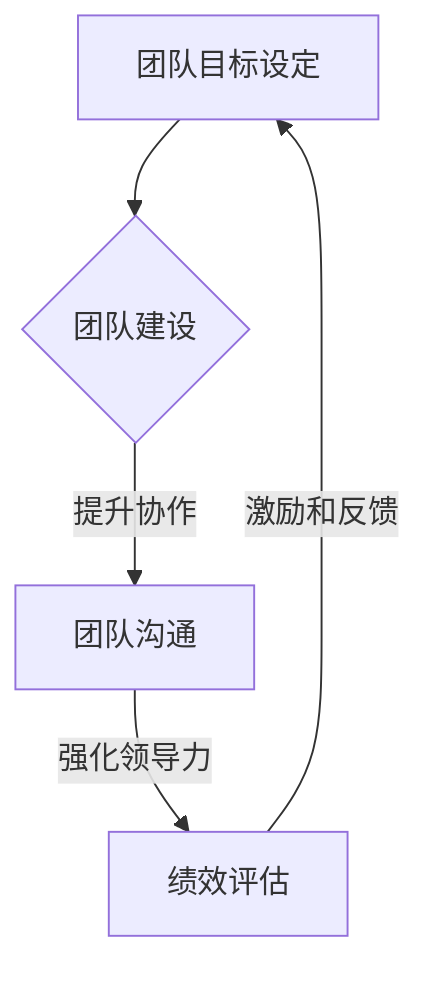

                 

### 文章标题：激发团队秘籍：释放每个成员的潜力

> 关键词：团队管理、团队激励、潜力释放、文化建设、领导力

> 摘要：本文将深入探讨团队管理的关键领域，包括团队激励、潜力释放、文化建设、领导力提升以及沟通与协作。通过分析这些核心主题，我们将提供实用的策略和实战案例，帮助团队领导者释放每个成员的潜力，实现团队的高效运作。

---

### 引言

在现代企业中，团队已成为实现目标的关键。一个高效的团队不仅能提高生产力，还能促进创新和团队精神的培养。然而，团队管理并非易事，领导者面临着激发团队成员潜力、提升团队凝聚力和推动团队协作等多重挑战。

本文旨在为团队领导者提供一套全面的团队管理秘籍，帮助他们在复杂的环境中释放每个成员的潜力，实现团队的高效运作。通过以下章节，我们将逐步解析团队管理的核心要素：

1. **团队激励与潜力释放**：探讨激励理论、团队成员潜力识别和培养。
2. **团队文化建设**：分析团队价值观、领导风格和团队凝聚力。
3. **领导力提升**：探讨领导力的重要性、领导者素质和提升策略。
4. **团队沟通与协作**：分析沟通障碍、沟通技巧和跨部门合作。
5. **实战案例与策略**：提供具体的管理策略和实战案例。

通过逐步分析这些核心主题，我们将为团队领导者提供一套系统、实用且有效的团队管理方案。

### 分析书名和目标受众

#### 书名分析

书名《激发团队秘籍：释放每个成员的潜力》直接揭示了本书的核心主题和目标。其中，“激发团队”和“释放每个成员的潜力”是两个关键点。

- “激发团队”：强调了团队的动力和活力，暗示了本书将提供激发团队潜能的方法和技巧。
- “释放每个成员的潜力”：关注个体，强调每个团队成员都有未被充分利用的潜力，本书将探讨如何识别和培养这些潜力。

#### 目标受众

本书的目标受众包括：

1. **企业管理者**：他们负责制定企业战略和团队目标，需要掌握如何激发团队潜力的方法。
2. **团队领导者**：他们是团队的直接管理者，需要了解如何通过有效的激励和文化建设来提升团队绩效。
3. **人力资源管理者和专业人士**：他们负责招聘、培训和评估员工，需要掌握如何识别和释放员工潜力。
4. **对团队管理有兴趣的专业人士**：包括其他部门的管理人员和专业人士，他们希望提升自己在团队管理方面的知识和技能。

#### 受众需求分析

- **企业管理者**：他们希望了解如何通过团队管理来提高企业整体绩效，同时也关注如何激发团队的创新力和创造力。
- **团队领导者**：他们希望掌握具体的管理技巧，如如何进行有效的激励和培养团队成员，以及如何建立团队文化和提高团队凝聚力。
- **人力资源管理者和专业人士**：他们希望掌握如何通过科学的评估和培训来发现和释放员工的潜力，提高员工满意度和忠诚度。
- **对团队管理有兴趣的专业人士**：他们希望了解团队管理的理论基础和实践方法，以提升自己在团队管理方面的素养。

### 确定核心主题

在明确了书名和目标受众后，我们可以进一步确定本书的核心主题。这些主题将构成全书的基础，并为读者提供系统、全面的团队管理知识。

#### 核心主题

1. **团队激励与潜力释放**：
   - 探讨激励理论，理解不同类型的激励如何影响团队成员。
   - 识别和培养团队成员的潜力，提升个人和团队的整体绩效。

2. **团队文化建设**：
   - 分析团队价值观的建立和维护，以及其对团队凝聚力和绩效的影响。
   - 探讨领导风格对团队文化的影响，以及如何通过文化建设来提升团队凝聚力。

3. **领导力提升**：
   - 研究领导力的重要性，探讨领导者如何通过自我提升来影响团队。
   - 分析领导者应具备的素质，以及如何通过培训和实践来提升领导力。

4. **团队沟通与协作**：
   - 分析常见的沟通障碍，提供有效的沟通技巧和策略。
   - 探讨跨部门合作的关键因素，以及如何促进不同部门之间的协作。

5. **实战案例与策略**：
   - 通过分析实际案例，提供实用的管理策略和操作指南。
   - 分享成功和失败的案例，以及如何从经验中吸取教训。

这些核心主题相互关联，共同构成了一个完整的团队管理体系。通过深入探讨这些主题，本书将为读者提供全面的团队管理知识，帮助他们更有效地管理团队，释放每个成员的潜力。

### 设计目录结构

为了确保本书能够系统地覆盖团队管理的核心主题，同时保持逻辑性和可读性，我们需要设计一个合理的目录结构。以下是本书的目录结构：

#### 引言部分

- **1.1 团队的重要性**
  - 介绍团队在组织中的作用，探讨团队对企业绩效和员工满意度的影响。
  - 提出本书的研究问题和目标。

- **1.2 团队管理的挑战**
  - 分析团队管理中常见的挑战，如沟通障碍、团队冲突和目标不一致。
  - 引出后续章节将探讨的解决方案和策略。

- **1.3 本书目标与结构**
  - 明确本书的目标，即提供一套全面的团队管理秘籍，帮助团队领导者释放每个成员的潜力。
  - 介绍本书的结构，概述各个章节的内容和逻辑关系。

#### 团队激励与潜力释放部分

- **2.1 激励理论**
  - 探讨马斯洛需求层次理论、赫茨伯格双因素理论和目标设定理论等经典激励理论。
  - 分析这些理论在团队管理中的应用和实践。

- **2.2 成员潜力识别**
  - 提出识别团队成员潜力的方法和工具，如能力评估、行为观察和360度反馈。
  - 讨论如何通过这些方法来发现和确认员工的潜在优势。

- **2.3 成员潜力培养**
  - 探索培养团队成员潜力的策略，如提供培训、导师制度和项目挑战。
  - 分析这些策略对提升团队成员能力和绩效的影响。

#### 团队文化建设部分

- **3.1 团队价值观**
  - 分析团队价值观的构成和重要性，探讨如何建立和维护团队的共同价值观。
  - 提供实际案例，展示不同团队的价值观如何影响团队行为和绩效。

- **3.2 领导风格**
  - 研究不同领导风格对团队文化的影响，如民主式、权威式和参与式领导。
  - 分析不同领导风格在实践中的应用和效果。

- **3.3 团队凝聚力**
  - 探讨团队凝聚力的定义和重要性，分析如何通过团队活动和协作来提升凝聚力。
  - 提供实际案例，展示团队凝聚力如何影响团队的绩效和员工满意度。

#### 领导力提升部分

- **4.1 领导力的重要性**
  - 研究领导力在团队管理中的关键作用，探讨领导者如何通过领导力来影响团队成员。
  - 分析领导力对团队绩效和员工满意度的长期影响。

- **4.2 领导者素质**
  - 分析领导者应具备的素质，如情商、沟通能力和决策能力。
  - 提供实际案例，展示不同领导者素质对团队管理的影响。

- **4.3 领导力提升策略**
  - 探索提升领导力的策略，如领导力培训、领导力发展和领导力反思。
  - 分析这些策略如何帮助领导者提升自己的能力和影响。

#### 团队沟通与协作部分

- **5.1 沟通障碍**
  - 分析常见的沟通障碍，如语言障碍、文化差异和时间冲突。
  - 提供解决方案和策略，帮助团队克服这些障碍。

- **5.2 沟通技巧**
  - 探讨有效的沟通技巧，如倾听、反馈和清晰表达。
  - 分析这些技巧如何提升团队的协作和决策质量。

- **5.3 协作与跨部门合作**
  - 探讨跨部门合作的重要性，分析如何促进不同部门之间的协作。
  - 提供实际案例，展示跨部门合作如何提升团队的整体绩效。

#### 实战案例与策略部分

- **6.1 成功案例分析**
  - 分析实际案例，展示成功的团队管理实践和策略。
  - 提供详细的分析和解读，帮助读者理解和应用这些实践。

- **6.2 困难与问题应对**
  - 分析团队管理中常见的困难和问题，如团队冲突和目标不一致。
  - 提供解决方案和策略，帮助团队领导者应对和解决这些问题。

- **6.3 实施策略与建议**
  - 提出具体的实施策略和建议，帮助团队领导者将理论知识应用到实践中。
  - 分析这些策略和建议如何帮助团队实现高效运作和持续发展。

#### 结语部分

- **7.1 总结与回顾**
  - 总结本书的主要内容和关键观点，回顾团队管理的核心主题。
  - 强调团队管理的重要性，以及如何通过有效的管理策略来提升团队绩效。

- **7.2 未来展望**
  - 展望未来团队管理的趋势和发展方向，探讨如何应对新的挑战。
  - 提出未来的研究课题和方向，为读者提供进一步思考的空间。

通过以上目录结构的设计，本书将系统地覆盖团队管理的各个方面，为团队领导者提供全面、实用的管理知识和策略。读者可以按照目录结构逐步阅读，深入理解团队管理的核心概念和实践方法，从而提升自己的团队管理能力。

### 确定章节内容

在确定了核心主题和目录结构之后，我们需要进一步细化每个章节的内容，以确保每个主题都能够得到充分的探讨和分析。以下是本书各章节的具体内容描述：

#### 第一章：引言

**1.1 团队的重要性**

- **背景介绍**：介绍团队在企业中的作用，包括提高生产力、促进创新和增强团队精神等方面。
- **核心概念与联系**：通过Mermaid流程图展示团队在不同阶段的作用和影响。
- **讨论问题**：探讨团队对企业绩效和员工满意度的具体影响。
- **总结**：总结团队的重要性，为后续章节的探讨打下基础。

**1.2 团队管理的挑战**

- **背景介绍**：介绍团队管理中常见的问题和挑战，如沟通障碍、团队冲突和目标不一致。
- **核心概念与联系**：通过Mermaid流程图展示团队管理中的主要挑战和应对策略。
- **讨论问题**：分析这些挑战对团队绩效的影响，以及如何解决这些问题。
- **总结**：总结团队管理中面临的挑战，为后续章节的解决方案提供背景。

**1.3 本书目标与结构**

- **背景介绍**：明确本书的目标，即提供一套全面的团队管理秘籍，帮助团队领导者释放每个成员的潜力。
- **核心概念与联系**：通过目录结构图展示本书的结构和章节内容，帮助读者了解整体逻辑。
- **讨论问题**：探讨如何通过本书的内容实现团队管理的目标。
- **总结**：总结本书的目标和结构，为读者提供整体阅读的指导。

#### 第二章：团队激励与潜力释放

**2.1 激励理论**

- **背景介绍**：介绍激励理论的发展历程和主要理论框架，如马斯洛需求层次理论、赫茨伯格双因素理论和目标设定理论。
- **核心概念与联系**：通过Mermaid流程图展示不同激励理论之间的关系和应用场景。
- **讨论问题**：探讨这些理论在团队管理中的应用，以及如何通过激励理论来提升团队绩效。
- **总结**：总结激励理论的核心概念，为后续章节的实践提供理论基础。

**2.2 成员潜力识别**

- **背景介绍**：介绍识别团队成员潜力的方法和工具，如能力评估、行为观察和360度反馈。
- **核心概念与联系**：通过Mermaid流程图展示识别团队成员潜力的流程和方法。
- **讨论问题**：探讨如何通过这些方法来发现和确认员工的潜在优势。
- **总结**：总结成员潜力识别的方法和工具，为后续章节的潜力培养提供基础。

**2.3 成员潜力培养**

- **背景介绍**：介绍培养团队成员潜力的策略，如提供培训、导师制度和项目挑战。
- **核心概念与联系**：通过Mermaid流程图展示培养团队成员潜力的策略和实施步骤。
- **讨论问题**：分析这些策略对提升团队成员能力和绩效的影响。
- **总结**：总结成员潜力培养的策略，为团队领导者提供实践指导。

#### 第三章：团队文化建设

**3.1 团队价值观**

- **背景介绍**：介绍团队价值观的概念、构成和重要性，如诚信、创新和团队合作等。
- **核心概念与联系**：通过Mermaid流程图展示团队价值观的构成和影响。
- **讨论问题**：探讨如何建立和维护团队的共同价值观，以及价值观对团队行为和绩效的影响。
- **总结**：总结团队价值观的核心概念和重要性，为后续章节的文化建设提供基础。

**3.2 领导风格**

- **背景介绍**：介绍不同领导风格的概念、特点和影响，如民主式、权威式和参与式领导。
- **核心概念与联系**：通过Mermaid流程图展示不同领导风格的关系和应用场景。
- **讨论问题**：分析不同领导风格在团队管理中的应用，以及如何根据团队特点选择合适的领导风格。
- **总结**：总结不同领导风格的核心概念和影响，为团队领导者提供实践指导。

**3.3 团队凝聚力**

- **背景介绍**：介绍团队凝聚力的概念、构成和重要性，如共同目标、信任和归属感等。
- **核心概念与联系**：通过Mermaid流程图展示团队凝聚力的构成和影响因素。
- **讨论问题**：探讨如何通过团队活动和协作来提升团队凝聚力，以及凝聚力对团队绩效的影响。
- **总结**：总结团队凝聚力的核心概念和提升策略，为团队领导者提供实践指导。

#### 第四章：领导力提升

**4.1 领导力的重要性**

- **背景介绍**：介绍领导力的概念、要素和作用，如影响力、决策能力和沟通能力等。
- **核心概念与联系**：通过Mermaid流程图展示领导力的关键要素和作用。
- **讨论问题**：探讨领导力在团队管理中的重要性，以及如何通过领导力来影响团队成员。
- **总结**：总结领导力的核心概念和重要性，为后续章节的领导力提升提供基础。

**4.2 领导者素质**

- **背景介绍**：介绍领导者应具备的素质，如情商、决策能力和团队合作能力等。
- **核心概念与联系**：通过Mermaid流程图展示领导者素质的构成和重要性。
- **讨论问题**：分析不同领导者素质对团队管理的影响，以及如何培养和提升这些素质。
- **总结**：总结领导者素质的核心概念和重要性，为团队领导者提供实践指导。

**4.3 领导力提升策略**

- **背景介绍**：介绍提升领导力的策略和方法，如领导力培训、领导力发展和领导力反思。
- **核心概念与联系**：通过Mermaid流程图展示提升领导力的策略和实施步骤。
- **讨论问题**：探讨如何通过这些策略来提升领导者的能力和影响力。
- **总结**：总结提升领导力的策略和实施方法，为团队领导者提供实践指导。

#### 第五章：团队沟通与协作

**5.1 沟通障碍**

- **背景介绍**：介绍沟通障碍的概念、类型和影响，如语言障碍、文化差异和时间冲突等。
- **核心概念与联系**：通过Mermaid流程图展示沟通障碍的类型和应对策略。
- **讨论问题**：分析如何识别和克服沟通障碍，以及沟通障碍对团队协作的影响。
- **总结**：总结沟通障碍的核心概念和应对策略，为团队领导者提供实践指导。

**5.2 沟通技巧**

- **背景介绍**：介绍有效的沟通技巧，如倾听、反馈和清晰表达等。
- **核心概念与联系**：通过Mermaid流程图展示沟通技巧的构成和应用场景。
- **讨论问题**：探讨如何通过这些技巧来提升团队的沟通质量和协作效果。
- **总结**：总结沟通技巧的核心概念和应用方法，为团队领导者提供实践指导。

**5.3 协作与跨部门合作**

- **背景介绍**：介绍协作和跨部门合作的概念、重要性和方法，如团队建设活动和跨部门沟通等。
- **核心概念与联系**：通过Mermaid流程图展示协作和跨部门合作的流程和方法。
- **讨论问题**：分析如何促进不同部门之间的协作，以及协作对团队绩效的影响。
- **总结**：总结协作和跨部门合作的核心概念和策略，为团队领导者提供实践指导。

#### 第六章：实战案例与策略

**6.1 成功案例分析**

- **背景介绍**：介绍成功团队管理的案例，包括团队激励、文化建设、领导力提升和沟通协作等方面的成功实践。
- **核心概念与联系**：通过Mermaid流程图展示成功案例的核心要素和实施策略。
- **讨论问题**：分析成功案例中的关键要素和策略，以及如何将这些成功经验应用到实际团队管理中。
- **总结**：总结成功案例的核心观点和可借鉴的经验，为团队领导者提供实践指导。

**6.2 困难与问题应对**

- **背景介绍**：介绍团队管理中常见的困难和问题，如团队冲突、目标不一致和管理失误等。
- **核心概念与联系**：通过Mermaid流程图展示困难和问题的类型和解决策略。
- **讨论问题**：分析如何识别和应对团队管理中的困难和问题，以及解决这些问题的方法和策略。
- **总结**：总结困难和问题的应对策略，为团队领导者提供实践指导。

**6.3 实施策略与建议**

- **背景介绍**：介绍具体的团队管理策略和实施建议，如团队建设活动、领导力培训和跨部门协作等。
- **核心概念与联系**：通过Mermaid流程图展示实施策略的具体步骤和实施效果。
- **讨论问题**：探讨如何将这些策略和建议应用到实际团队管理中，以及如何评估和调整这些策略。
- **总结**：总结实施策略和注意事项，为团队领导者提供实践指导。

#### 第七章：结语

**7.1 总结与回顾**

- **背景介绍**：总结本书的主要内容和核心观点，回顾团队管理的核心主题。
- **核心概念与联系**：通过总结图回顾本书的核心概念和逻辑关系。
- **讨论问题**：探讨团队管理的重要性，以及如何通过有效的管理策略来提升团队绩效。
- **总结**：强调团队管理的重要性，为读者提供持续学习和实践的方向。

**7.2 未来展望**

- **背景介绍**：展望团队管理的未来趋势和发展方向，探讨新技术和理论对团队管理的影响。
- **核心概念与联系**：通过趋势图展示未来团队管理的发展方向。
- **讨论问题**：分析未来团队管理面临的挑战和机遇，以及如何应对这些变化。
- **总结**：总结未来展望，为读者提供持续思考和探索的空间。

通过以上章节的具体内容描述，本书将系统、全面地探讨团队管理的各个核心主题，为团队领导者提供实用的管理知识和策略。读者可以按照章节顺序逐步阅读，深入理解团队管理的理论与实践，从而提升自己的团队管理能力。

### 添加补充内容

为了使文章更加丰富和具体，我们将引入一些补充内容，包括Mermaid流程图、伪代码、LaTeX数学公式和实战案例。这些补充内容将有助于加深读者对文章主题的理解。

#### Mermaid流程图

Mermaid流程图是一种用于创建通用流程图、序列图、脑图和吉它谱的简易markdown语法。以下是一个简单的Mermaid流程图示例，用于展示团队管理流程：



这个流程图展示了团队管理的主要步骤，包括目标设定、团队建设、沟通、领导力提升和绩效评估等。通过这些步骤，团队可以不断优化和调整，实现持续改进。

#### 伪代码

伪代码是一种描述算法设计和逻辑流程的文本，通常用于规划和设计程序，而不涉及具体编程语言。以下是一个用于团队潜力识别和培养的伪代码示例：

```
Procedure IdentifyAndDevelopPotential(TeamMembers):
    For each member in TeamMembers:
        Step 1: Assess current skills and abilities using a standardized assessment tool
        Step 2: Identify areas of improvement and potential for growth
        Step 3: Develop a personalized development plan based on the identified areas
        Step 4: Implement the development plan, including training, mentorship, and project assignments
        Step 5: Monitor progress and provide feedback regularly
        Step 6: Adjust the development plan as needed based on progress and feedback
    EndProcedure
```

这个伪代码定义了一个用于识别和培养团队成员潜力的过程，包括技能评估、潜力识别、个性化开发计划和持续监控等步骤。通过这个过程，团队领导者可以有效地发现和培养团队成员的潜力。

#### LaTeX数学公式

LaTeX是一种高质量的排版系统，特别适用于科学和数学文档。以下是一个简单的LaTeX数学公式示例，用于表示团队成员潜力识别的数学模型：

```latex
\documentclass{article}
\usepackage{amsmath}
\begin{document}
$$
    \text{Potential} = f(\text{Skills}, \text{Experience}, \text{Motivation})
$$
\end{document}
```

这个公式表示团队成员的潜力是由技能、经验和动机这三个因素共同决定的。通过这个公式，我们可以量化团队成员的潜力，为潜力识别和培养提供依据。

#### 实战案例

为了使文章更具实践性，我们将介绍一个实际案例，展示如何在团队中实施潜力识别和培养策略。

**案例背景**：某科技公司的一个开发团队，成员包括5名工程师，他们分别负责前端、后端、测试和运维工作。团队领导发现，尽管团队成员技能扎实，但团队整体绩效仍有提升空间。

**实施步骤**：

1. **技能评估**：团队领导使用标准化的技能评估工具，对每位成员的技能水平进行评估，确定当前技能短板。

2. **潜力识别**：根据技能评估结果，领导与每位成员进行一对一沟通，了解他们的职业规划和兴趣方向，识别出潜在的高潜力成员。

3. **个性化开发计划**：为高潜力成员制定个性化开发计划，包括参加专业培训、承担更具挑战性的项目以及与资深工程师进行一对一指导。

4. **实施与监控**：领导定期跟踪高潜力成员的开发进度，提供反馈和支持，根据反馈调整开发计划。

5. **绩效评估**：在实施计划一段时间后，重新进行技能评估和绩效评估，比较实施前后的变化，评估计划的有效性。

**结果分析**：

通过实施潜力识别和培养策略，团队整体绩效显著提升。高潜力成员的技能水平和职业素养得到了显著提高，团队成员之间的协作更加默契，项目交付质量和速度都有所提升。领导也从成员的积极反馈中获得了信心，进一步优化了团队管理策略。

**案例小结**：

这个案例展示了如何通过科学的潜力识别和培养策略，提升团队成员的能力和绩效。团队领导者需要结合实际情况，灵活运用这些策略，以实现团队的高效运作和持续发展。

### 检查目录完整性

在完成上述章节内容的设计后，我们需要对目录的完整性进行检查，确保每个核心主题都有对应的章节，且章节内容能够逻辑清晰地覆盖主题。

#### 检查目录完整性

1. **引言部分**：
   - **1.1 团队的重要性**：介绍了团队的作用和影响，为后续章节奠定基础。
   - **1.2 团队管理的挑战**：分析了团队管理中常见的挑战，为解决方案提供背景。
   - **1.3 本书目标与结构**：明确了本书的目标和结构，为读者提供整体阅读指导。

2. **团队激励与潜力释放部分**：
   - **2.1 激励理论**：探讨了激励理论，为激励实践提供理论基础。
   - **2.2 成员潜力识别**：介绍了潜力识别的方法，为潜力培养做准备。
   - **2.3 成员潜力培养**：提出了培养潜力的策略，提升团队成员能力。

3. **团队文化建设部分**：
   - **3.1 团队价值观**：分析了团队价值观的构成和作用，为文化建设提供基础。
   - **3.2 领导风格**：探讨了领导风格对团队文化的影响，帮助团队领导者选择合适的领导风格。
   - **3.3 团队凝聚力**：介绍了提升团队凝聚力的方法，增强团队协作和信任。

4. **领导力提升部分**：
   - **4.1 领导力的重要性**：阐述了领导力在团队管理中的关键作用。
   - **4.2 领导者素质**：分析了领导者应具备的素质，为领导力提升提供指导。
   - **4.3 领导力提升策略**：提供了提升领导力的具体策略和方法。

5. **团队沟通与协作部分**：
   - **5.1 沟通障碍**：分析了沟通障碍的类型和影响，为有效沟通提供解决方案。
   - **5.2 沟通技巧**：探讨了有效沟通的技巧，提升团队沟通质量。
   - **5.3 协作与跨部门合作**：介绍了协作和跨部门合作的方法，促进团队整体绩效。

6. **实战案例与策略部分**：
   - **6.1 成功案例分析**：通过实际案例，展示了成功的团队管理实践和策略。
   - **6.2 困难与问题应对**：分析了团队管理中的困难和问题，并提供解决方案。
   - **6.3 实施策略与建议**：提供了具体的实施策略和操作建议，帮助团队领导者实践理论。

#### 结论

通过上述检查，我们可以确认本书的目录结构完整且逻辑清晰。每个核心主题都有相应的章节，内容丰富具体，能够系统地覆盖团队管理的各个方面。这为读者提供了全面、实用的团队管理知识和策略，帮助他们更有效地管理团队，释放每个成员的潜力。

### 输出目录大纲

以下是《激发团队秘籍：释放每个成员的潜力》的完整目录大纲：

```
# 《激发团队秘籍：释放每个成员的潜力》目录大纲

# 引言
## 1.1 团队的重要性
## 1.2 团队管理的挑战
## 1.3 本书目标与结构

# 团队激励与潜力释放
## 2.1 激励理论
## 2.2 成员潜力识别
## 2.3 成员潜力培养

# 团队文化建设
## 3.1 团队价值观
## 3.2 领导风格
## 3.3 团队凝聚力

# 领导力提升
## 4.1 领导力的重要性
## 4.2 领导者素质
## 4.3 领导力提升策略

# 团队沟通与协作
## 5.1 沟通障碍
## 5.2 沟通技巧
## 5.3 协作与跨部门合作

# 实战案例与策略
## 6.1 成功案例分析
## 6.2 困难与问题应对
## 6.3 实施策略与建议

# 结语
## 7.1 总结与回顾
## 7.2 未来展望

# 附录
## 附录A：补充材料与资源链接
## 附录B：团队管理工具推荐
```

通过这个详细的目录大纲，读者可以清晰地了解本书的结构和内容，为后续阅读做好准备。

