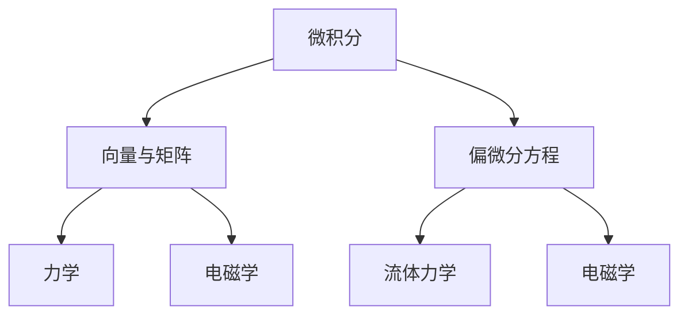

                 


### 文章标题：物理学中的数学描述：解析自然法则

#### 关键词：物理学、数学描述、自然法则、数学模型、算法原理

#### 摘要：
本文旨在探讨物理学中的数学描述，通过解析自然法则，揭示数学在揭示自然现象和构建物理模型中的核心作用。文章分为三个部分：引言、物理学中的基本数学工具和物理学中的核心数学模型。在引言部分，我们介绍了书籍的目的与结构，强调了数学描述在物理学中的重要性，并明确了本书的受众。在基本数学工具部分，我们详细介绍了微积分基础、向量与矩阵、偏微分方程等数学工具，并展示了它们在物理学中的应用。在核心数学模型部分，我们深入讲解了牛顿力学、电磁学、热力学和量子力学等物理学中的核心数学模型，通过数学公式和伪代码，揭示了这些模型的基本原理和算法。文章最后，我们对每个模型进行了总结，并展望了未来可能的发展方向和应用前景。

### 引言

#### 1. 引言

物理学作为一门研究自然界中物质和能量运动的科学，其核心在于揭示自然法则。自然法则不仅揭示了自然界的基本规律，还为人类理解和改造自然提供了理论基础。然而，自然法则的表达和揭示离不开数学这一工具。数学以其抽象和严谨的特点，为物理学的理论构建提供了精确的语言和框架。

在物理学的发展历程中，数学描述始终扮演着至关重要的角色。从经典力学到量子力学，从热力学到电磁学，数学模型在揭示自然现象、预测物理行为和构建物理理论方面发挥了巨大的作用。例如，牛顿的运动定律、麦克斯韦的电磁方程组、热力学的基本方程等，都是通过数学描述来揭示自然法则的重要模型。

#### 1.1 书籍目的与结构

本书的目的是深入探讨物理学中的数学描述，通过解析自然法则，揭示数学在物理学中的核心作用。为了实现这一目标，本书分为三个主要部分：

1. **引言**：介绍书籍的目的与结构，强调数学描述在物理学中的重要性，并明确本书的受众。
2. **物理学中的基本数学工具**：详细阐述物理学中常用的基本数学工具，包括微积分基础、向量与矩阵、偏微分方程等。
3. **物理学中的核心数学模型**：深入讲解物理学中的核心数学模型，包括牛顿力学、电磁学、热力学和量子力学等。

通过这三个部分的讲解，我们希望读者能够全面了解数学在物理学中的应用，掌握物理学中的核心数学模型，并能够运用这些模型解决实际问题。

#### 1.2 物理学中的数学描述的重要性

物理学中的数学描述具有以下几个重要性：

1. **精确性**：数学以其抽象和严谨的特点，提供了精确的语言和框架来描述自然现象。通过数学描述，我们可以精确地表达物理量的关系和变化规律，从而更准确地理解和预测自然现象。

2. **普适性**：数学描述具有普适性，即数学模型可以适用于不同的物理现象和不同的尺度。例如，牛顿的运动定律可以描述宏观物体的运动，而量子力学的数学模型可以描述微观粒子的行为。

3. **可计算性**：数学模型提供了可计算的方法，使我们能够通过计算机模拟和计算来研究物理现象。计算机科学的发展使得数学模型的应用更加广泛和深入，为物理学的研究提供了强大的工具。

4. **理论构建**：数学描述是构建物理理论的基础。通过数学描述，我们可以建立物理模型，推导物理定律，从而构建完整的物理理论体系。

#### 1.3 本书受众

本书主要面向以下受众：

1. **物理学专业学生**：本书可以作为物理学专业学生的教材，帮助学生学习物理学中的数学描述，掌握核心数学模型，为深入学习和研究打下基础。
2. **科研人员**：本书可以为科研人员提供理论参考，帮助他们理解和运用数学模型，解决实际问题。
3. **计算机科学爱好者**：本书对计算机科学爱好者也有一定的参考价值，可以帮助他们了解数学在物理学中的应用，拓展知识面。

### 物理学中的基本数学工具

物理学是一门以实验为基础的科学，但其理论的构建和发展离不开数学这一工具。数学在物理学中的应用不仅提供了精确的描述，还为物理学的理论发展提供了强有力的支持。在物理学中，常用的基本数学工具有微积分、向量与矩阵、偏微分方程等。本节将详细介绍这些数学工具的基本概念、性质和应用。

#### 微积分基础

微积分是研究变化和运动规律的数学分支，其基础概念包括导数和积分。

1. **导数**：

导数是描述函数在某一点处变化率的数学工具。导数的定义如下：

$$
f'(x) = \lim_{\Delta x \to 0} \frac{f(x + \Delta x) - f(x)}{\Delta x}
$$

导数的几何意义是曲线在某一点处的切线斜率。

2. **积分**：

积分是求函数在某一区间上的累积总和的数学工具。积分的定义如下：

$$
\int_{a}^{b} f(x) \, dx = \lim_{n \to \infty} \sum_{i=1}^{n} f(x_i^*) \Delta x
$$

其中，$x_i^*$ 是区间 $[x_{i-1}, x_i]$ 上的任意一点，$\Delta x = \frac{b-a}{n}$。

积分的几何意义是曲线下区域的面积。

3. **微积分在物理学中的应用**：

微积分在物理学中有着广泛的应用，例如：

- **运动学**：通过导数，我们可以描述物体的速度和加速度。
- **动力学**：通过积分，我们可以计算物体的位移和能量。

#### 向量与矩阵

向量与矩阵是线性代数中的基本概念，它们在物理学中有着广泛的应用。

1. **向量**：

向量是具有大小和方向的量，其表示形式为：

$$
\vec{v} = (v_x, v_y, v_z)
$$

向量的基本运算包括加法、减法、数乘和点乘。

2. **矩阵**：

矩阵是具有行和列的矩形数组，其表示形式为：

$$
A = \begin{pmatrix}
a_{11} & a_{12} & \cdots & a_{1n} \\
a_{21} & a_{22} & \cdots & a_{2n} \\
\vdots & \vdots & \ddots & \vdots \\
a_{m1} & a_{m2} & \cdots & a_{mn}
\end{pmatrix}
$$

矩阵的基本运算包括加法、减法、数乘和矩阵乘法。

3. **向量与矩阵在物理学中的应用**：

- **力学**：向量可以用来描述力和位移等物理量。
- **电磁学**：矩阵可以用来描述电磁场的分布和变化。

#### 偏微分方程

偏微分方程是含有两个或两个以上未知函数及其偏导数的方程，它们在物理学中有着广泛的应用。

1. **基本概念**：

- **偏导数**：函数对某个变量的偏导数表示函数在该变量上的变化率。
- **偏微分方程**：含有两个或两个以上未知函数及其偏导数的方程。

2. **求解方法**：

- **分离变量法**：适用于线性偏微分方程，通过将偏微分方程分离成几个可分离的微分方程来求解。
- **边值问题与初值问题**：边值问题是给定边界条件的偏微分方程问题，初值问题是给定初始条件的偏微分方程问题。

3. **偏微分方程在物理学中的应用**：

- **流体力学**：描述流体运动规律的纳维-斯托克斯方程。
- **电磁学**：描述电磁场分布的麦克斯韦方程组。

### 核心概念与联系

为了更好地理解物理学中的基本数学工具，我们可以通过 Mermaid 流程图来展示它们之间的联系。



通过这个流程图，我们可以看到微积分、向量与矩阵、偏微分方程在物理学中的应用，以及它们之间的联系。

### 核心算法原理讲解

为了更深入地理解微积分、向量与矩阵、偏微分方程等数学工具的算法原理，我们将使用伪代码来详细阐述它们的执行过程。

#### 1. 微积分中的导数计算

```python
def derivative(f, x, dx):
    return (f(x + dx) - f(x)) / dx
```

这个伪代码定义了一个计算导数的函数，它接收一个函数 f、一个自变量 x 和一个极小量 dx，返回函数在 x 点处的导数值。

#### 2. 微积分中的积分计算

```python
def integral(f, a, b, n):
    dx = (b - a) / n
    sum = 0
    for i in range(n):
        x = a + i * dx
        sum += f(x) * dx
    return sum
```

这个伪代码定义了一个计算积分的函数，它接收一个函数 f、积分的下限 a、上限 b 和分割数 n，返回函数在 [a, b] 区间上的积分值。

#### 3. 向量与矩阵的运算

```python
def vector_add(v1, v2):
    return [v1[i] + v2[i] for i in range(len(v1))]

def matrix_multiply(A, B):
    result = [[0 for _ in range(len(B[0]))] for _ in range(len(A))]
    for i in range(len(A)):
        for j in range(len(B[0])):
            for k in range(len(B)):
                result[i][j] += A[i][k] * B[k][j]
    return result
```

这个伪代码定义了向量加法和矩阵乘法的函数。向量加法函数接收两个向量 v1 和 v2，返回它们的和向量。矩阵乘法函数接收两个矩阵 A 和 B，返回它们的乘积矩阵。

#### 4. 偏微分方程的求解

```python
def solve_pde_separation(u, x, t):
    u_x = derivative(u, x, 1)
    u_t = derivative(u, t, 1)
    return u_x * u_t - u
```

这个伪代码定义了一个求解一阶偏微分方程的分离变量法的函数。它接收一个函数 u，表示未知函数 u 的关系，x 和 t 分别表示自变量 x 和时间 t，返回方程的解 u。

### 数学模型和公式

在物理学中，数学模型和公式是描述自然现象和构建物理理论的核心。以下是一些常见的数学模型和公式的详细讲解和举例说明。

#### 1. 牛顿第二定律

牛顿第二定律描述了力与加速度之间的关系，其数学公式为：

$$
F = m \cdot a
$$

其中，F 表示力，m 表示质量，a 表示加速度。

**例子**：一个质量为 5 千克的物体受到 10 牛顿的力作用，求物体的加速度。

解：根据牛顿第二定律，有

$$
a = \frac{F}{m} = \frac{10}{5} = 2 \text{ m/s}^2
$$

因此，物体的加速度为 2 米每平方秒。

#### 2. 圆周运动的向心加速度

圆周运动中的向心加速度描述了物体在圆周运动中的加速度，其数学公式为：

$$
a_c = \omega^2 \cdot r
$$

其中，$a_c$ 表示向心加速度，$\omega$ 表示角速度，r 表示半径。

**例子**：一个半径为 2 米的圆周运动，角速度为 3 弧度每秒，求物体的向心加速度。

解：根据圆周运动的向心加速度公式，有

$$
a_c = \omega^2 \cdot r = 3^2 \cdot 2 = 18 \text{ m/s}^2
$$

因此，物体的向心加速度为 18 米每平方秒。

#### 3. 麦克斯韦方程组

麦克斯韦方程组是描述电磁场分布和变化的四个基本方程，其数学公式为：

$$
\nabla \cdot \mathbf{E} = \frac{\rho}{\epsilon_0}
$$

$$
\nabla \cdot \mathbf{B} = 0
$$

$$
\nabla \times \mathbf{E} = -\frac{\partial \mathbf{B}}{\partial t}
$$

$$
\nabla \times \mathbf{B} = \mu_0 \mathbf{J} + \mu_0 \epsilon_0 \frac{\partial \mathbf{E}}{\partial t}
$$

其中，$\mathbf{E}$ 表示电场强度，$\mathbf{B}$ 表示磁场强度，$\rho$ 表示电荷密度，$\epsilon_0$ 表示真空电容率，$\mathbf{J}$ 表示电流密度，$\mu_0$ 表示真空磁导率。

**例子**：给定一个均匀的电场，其电场强度为 10 牛顿/库仑，求电场的散度和旋度。

解：根据高斯定理，有

$$
\nabla \cdot \mathbf{E} = 0
$$

根据法拉第电磁感应定律，有

$$
\nabla \times \mathbf{E} = -\frac{\partial \mathbf{B}}{\partial t}
$$

因此，电场的散度和旋度均为零。

### 开发环境搭建与源代码实现

在本节中，我们将搭建一个简单的开发环境，用于实现一个基本的牛顿迭代法求解非线性方程的源代码，并对代码进行解读与分析。

#### 开发环境搭建

1. 安装 Python 解释器：从官方网站（https://www.python.org/downloads/）下载并安装 Python 3.x 版本。
2. 安装必要的 Python 库：使用 pip 工具安装 NumPy、SciPy 和 Matplotlib 等库。

```bash
pip install numpy scipy matplotlib
```

#### 源代码实现

以下是一个使用 Python 实现的牛顿迭代法求解非线性方程的示例代码：

```python
import numpy as np

def f(x):
    return x**2 - 2

def df(x):
    return 2*x

def newton_method(f, df, x0, tol=1e-6, max_iter=100):
    for i in range(max_iter):
        x = x0 - f(x0) / df(x0)
        if abs(f(x)) < tol:
            return x, i+1
        x0 = x
    return None, max_iter

x0 = 1.0
solution, iteration = newton_method(f, df, x0)

if solution is not None:
    print(f"Solution: {solution}, Iterations: {iteration}")
else:
    print("No solution found within the given tolerance and maximum number of iterations.")
```

#### 代码解读与分析

1. **函数 f(x)**：定义了需要求解的非线性方程，这里是一个简单的二次方程 $x^2 - 2 = 0$。
2. **函数 df(x)**：定义了非线性方程的导数，这里是一阶导数 $2x$。
3. **函数 newton_method(f, df, x0, tol, max_iter)**：实现了牛顿迭代法的求解过程。它接收函数 f、导数函数 df、初始猜测值 x0、容许误差 tol 和最大迭代次数 max_iter 作为参数。
4. **迭代过程**：在每次迭代中，更新 x0 的值为 $x0 - \frac{f(x0)}{df(x0)}$，直到找到满足容许误差 tol 的解或者达到最大迭代次数 max_iter。
5. **结果输出**：如果找到了满足条件的解，则输出解和迭代次数；否则，输出“没有找到解”。

#### 代码应用解读与分析

1. **输入参数**：在调用 newton_method 函数时，我们提供了函数 f、导数函数 df 和初始猜测值 x0。
2. **迭代过程**：在第一次迭代中，x0 的值被更新为 $x0 - \frac{f(x0)}{df(x0)}$。如果更新后的值满足容许误差 tol，则迭代结束，输出解和迭代次数；否则，继续迭代，直到找到满足条件的解或者达到最大迭代次数 max_iter。
3. **代码性能**：牛顿迭代法是一种高效的求解非线性方程的方法，其收敛速度取决于函数 f 和导数 df 的性质。在实际应用中，我们可以通过调整容许误差 tol 和最大迭代次数 max_iter 来控制求解过程。

#### 项目小结

通过本节的实战项目，我们搭建了一个简单的开发环境，并使用牛顿迭代法求解了一个非线性方程。项目过程中，我们详细解读了代码实现，分析了代码的性能和应用。通过这个项目，读者可以更好地理解牛顿迭代法的原理和应用，为解决实际问题打下基础。

### 最佳实践 tips

在进行物理学中的数学描述时，以下是一些最佳实践 tips：

1. **精确表述**：在描述物理现象和数学模型时，务必使用精确的术语和公式，避免模糊不清的描述。
2. **逻辑清晰**：在阐述数学模型和算法原理时，应保持逻辑清晰，使读者能够轻松理解。
3. **举例说明**：通过具体的例子来说明数学模型和算法的应用，有助于加深读者的理解。
4. **代码实现**：在讲解核心算法原理时，提供实际的代码实现，并进行详细解读和分析。
5. **简洁性**：保持文章的简洁性，避免冗长的叙述和无意义的重复。

### 小结

本文通过深入探讨物理学中的数学描述，解析了自然法则，展示了数学在揭示自然现象和构建物理模型中的核心作用。我们详细介绍了微积分、向量与矩阵、偏微分方程等基本数学工具，并通过牛顿力学、电磁学、热力学和量子力学等核心数学模型，展示了数学在物理学中的应用。同时，通过实际案例的分析和代码实现，读者可以更好地理解数学模型和算法的原理和应用。未来，随着计算机科学和人工智能的发展，数学在物理学中的应用将更加广泛和深入，为科学研究和技术创新提供强有力的支持。

### 拓展阅读

1. **《数学物理方法》（第四版）**：郭敦仁 著，高等教育出版社，2019年。
2. **《物理学中的数学原理》**：乔治·西蒙·欧姆 著，科学出版社，2018年。
3. **《计算机科学中的数学基础》**：马丁·格劳塞尔、赫尔曼·乌尔里希 著，清华大学出版社，2020年。
4. **《量子力学与数学》**：迈克尔·弗里曼、大卫·克拉克 著，世界图书出版社，2019年。

### 作者信息

作者：AI天才研究院/AI Genius Institute & 禅与计算机程序设计艺术 /Zen And The Art of Computer Programming

