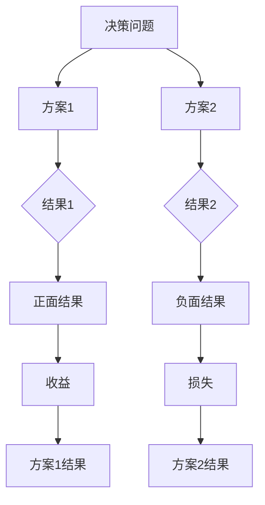
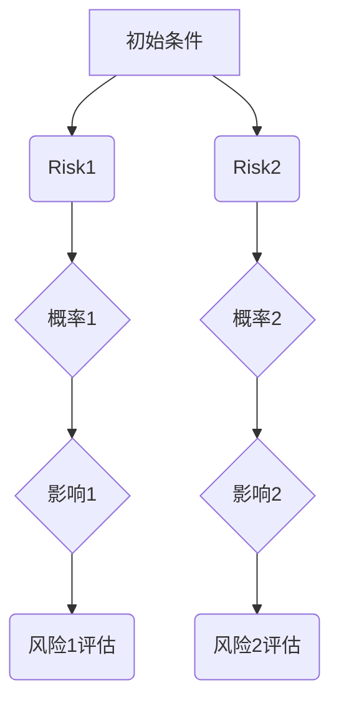
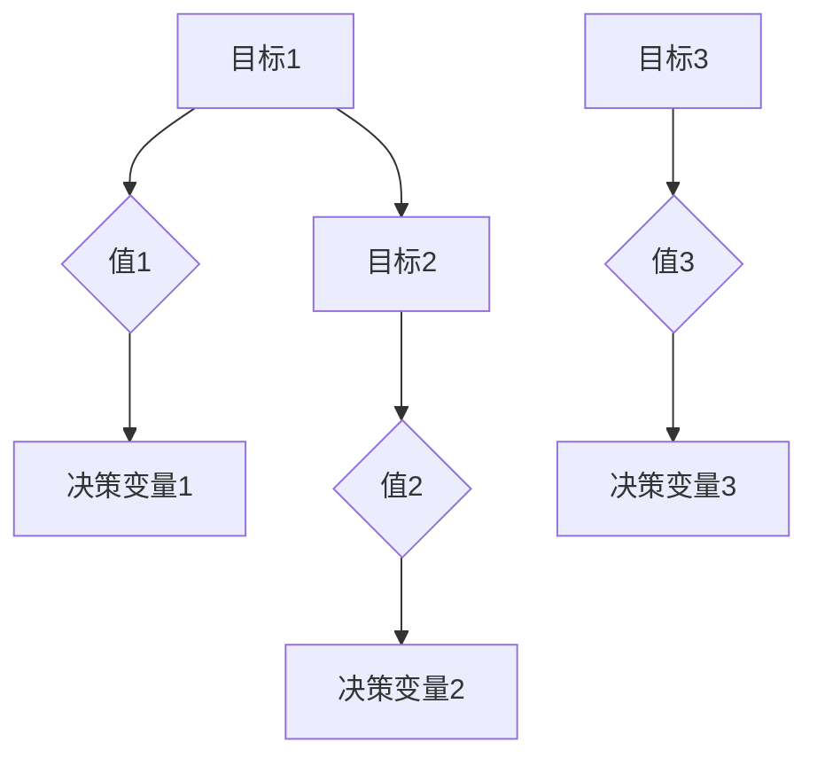
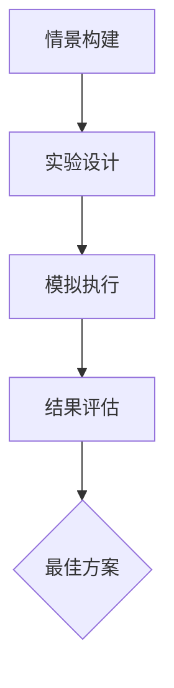
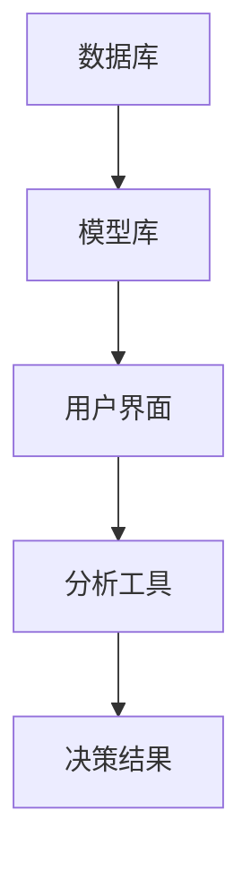
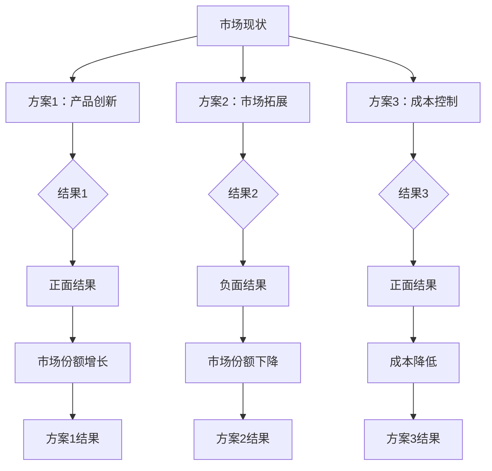
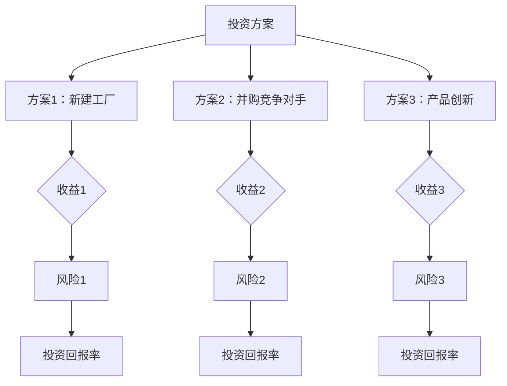
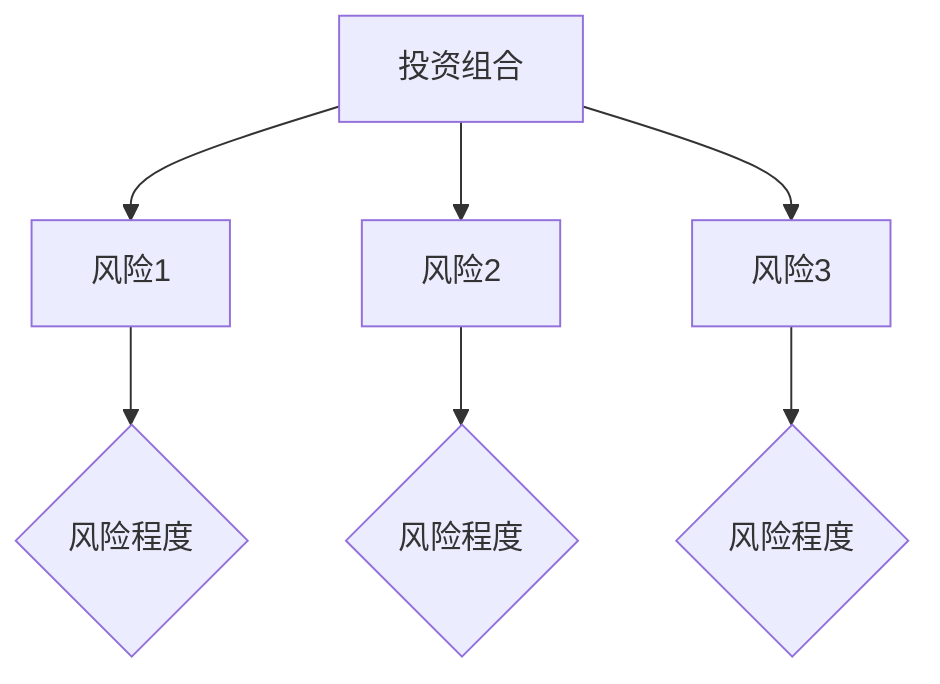

                 

### 文章标题

# 科学决策：提高领导决策质量的系统方法

> 关键词：科学决策、领导决策质量、系统方法、决策理论、数据分析、模拟实验、决策支持系统、案例分析

> 摘要：本文旨在探讨如何通过系统的方法提高领导决策质量。文章首先介绍了科学决策的基本概念和重要性，随后详细阐述了决策理论框架、科学决策方法以及决策实践案例，为读者提供了一系列实用的决策工具和策略。通过本文的阅读，读者将能够深刻理解科学决策的原理，并掌握在实际工作中应用这些方法的具体步骤。

### 引言

在当今快速变化和高度不确定的商业环境中，领导决策的质量直接影响到组织的生存和发展。科学决策作为一种系统的方法，通过结合数据分析、模拟实验和决策支持系统等技术手段，能够显著提高决策的准确性和有效性。然而，尽管科学决策的理论和方法已经相当成熟，但在实际应用中，许多领导者仍然面临决策困难，难以做出高质量的决定。

本文将从以下几个方面展开讨论：

1. **决策理论框架**：介绍决策理论的基本概念和原理，为后续的决策方法提供理论基础。
2. **科学决策方法**：详细阐述数据驱动决策方法、情境模拟与实验设计、决策支持系统等实践技巧。
3. **决策实践案例分析**：通过实际案例展示科学决策方法在实践中的应用效果。
4. **决策实践总结与启示**：总结决策实践中的常见问题与解决方法，探讨科学决策方法的应用价值与局限性。

本文的目的在于通过逻辑清晰、结构紧凑的阐述，帮助读者深入理解科学决策的原理，并掌握在实际工作中应用这些方法的具体步骤。希望本文能够为读者在领导决策过程中提供有益的指导。

### 决策理论框架

在科学决策中，决策理论框架是基础，它为我们提供了分析决策过程的基本工具。首先，我们需要理解几个核心概念：决策者、决策问题、解决方案、结果和风险。

**决策者**：决策者是指做出决策的人或组织。在商业环境中，决策者通常是公司的高层管理者或项目经理。

**决策问题**：决策问题是指需要做出决策的具体情境或问题。它通常具有不确定性、复杂性和多目标性。

**解决方案**：解决方案是指决策者考虑的各种可能的行动方案。这些方案旨在解决决策问题，达到既定的目标。

**结果**：结果是指执行某个解决方案后产生的实际效果。结果可以是正面的，也可以是负面的。

**风险**：风险是指决策过程中可能出现的各种不确定性因素，这些因素可能会影响决策结果。

#### 决策过程的阶段划分

决策过程通常可以分为以下几个阶段：

1. **信息收集**：这一阶段涉及收集与决策问题相关的各种信息，包括市场数据、竞争对手信息、内部绩效数据等。

2. **评估**：评估阶段是对收集到的信息进行分析和评估，以确定不同解决方案的优缺点。

3. **目标设定**：目标设定阶段是根据决策问题的特点和要求，明确决策的目标和标准。

4. **优化**：优化阶段是通过分析评估结果，选择最优或次优的解决方案。

5. **决策实施**：决策实施阶段是将选定的解决方案付诸行动，并监控决策实施的过程和效果。

6. **反馈**：反馈阶段是对决策结果进行评价，总结经验教训，为未来的决策提供参考。

#### 决策模型与方法

在决策过程中，常用的模型和方法包括：

**1. 决策树模型**：决策树模型通过一系列的分支节点和叶节点，表示决策问题中的各种可能性和结果。它可以帮助决策者系统地分析和比较不同解决方案。



**2. 风险分析模型**：风险分析模型用于评估决策过程中可能面临的风险和不确定性，常用的方法包括敏感性分析、概率分析等。



**3. 多目标决策模型**：多目标决策模型用于解决具有多个相互冲突目标的决策问题。它通过权衡不同目标之间的优先级，寻求最优或次优的解决方案。



通过这些模型和方法，决策者可以更加系统地分析和解决复杂的决策问题，提高决策的质量和效率。

### 科学决策方法

在了解了决策理论框架后，接下来我们将探讨一系列科学决策方法，这些方法可以帮助决策者在复杂和不确定的环境中做出更为明智的决策。

#### 数据驱动决策方法

数据驱动决策方法是基于数据分析的决策方法，它通过收集和分析大量数据，为决策提供依据。以下是数据驱动决策方法的核心步骤：

1. **数据收集**：首先需要收集与决策问题相关的数据，包括内部数据（如销售额、库存水平）和外部数据（如市场趋势、竞争对手信息）。

2. **数据清洗**：数据收集后，需要进行清洗，去除无效或错误的数据，确保数据的质量。

3. **数据分析**：对清洗后的数据进行统计分析，包括描述性统计和推断性统计，以发现数据中的规律和趋势。

4. **数据可视化**：使用图表和可视化工具，将数据分析结果以图形化的方式展示，帮助决策者直观地理解数据。

5. **建模与预测**：基于数据分析结果，建立预测模型，对未来的趋势进行预测。

具体步骤的伪代码如下：

```python
# 数据收集
data = collect_data()

# 数据清洗
clean_data = clean_data(data)

# 数据分析
descriptive_stats = analyze_data(clean_data)
inference_stats = infer_data(clean_data)

# 数据可视化
visualize_data(descriptive_stats, inference_stats)

# 建模与预测
model = build_model(inference_stats)
predictions = predict_future(model)
```

#### 情境模拟与实验设计

情境模拟与实验设计是一种通过模拟决策情景，评估不同决策方案效果的决策方法。以下是情境模拟与实验设计的主要步骤：

1. **情景构建**：根据决策问题构建模拟情景，包括各种可能的情况和参数。

2. **实验设计**：设计实验方案，包括实验组、对照组、实验变量等。

3. **模拟执行**：运行模拟模型，模拟不同决策方案在情景中的表现。

4. **结果评估**：评估模拟结果，比较不同决策方案的效果。

具体步骤的伪代码如下：



#### 决策支持系统

决策支持系统（DSS）是一种集成多种决策方法和工具的软件系统，旨在辅助决策者进行决策。以下是决策支持系统的关键组成部分：

1. **数据库**：存储与决策相关的数据。

2. **模型库**：包含各种决策模型，如线性规划模型、模拟模型、多目标决策模型等。

3. **用户界面**：提供用户与系统交互的界面，包括数据输入、模型选择、结果展示等功能。

4. **分析工具**：提供数据分析、数据可视化、预测分析等工具。

具体架构的伪代码如下：



通过数据驱动决策方法、情境模拟与实验设计、决策支持系统等科学决策方法，决策者可以更加系统地分析和解决问题，提高决策的质量和效率。

### 决策实践案例分析

为了更好地理解科学决策方法在实际应用中的效果，下面我们将通过三个实际案例，展示科学决策方法在各类决策问题中的应用。

#### 案例一：企业战略决策

**背景介绍**：某中型企业面临市场竞争激烈、产品同质化严重的问题，需要进行战略调整以提升市场竞争力。

**核心概念与联系**：在此案例中，我们运用了决策树模型和风险分析模型，以确定最佳战略方案。

**Mermaid流程图**：


**核心算法原理讲解**：
```python
# 决策树模型
def decision_tree(problem, schemes):
    # 初始化结果
    results = {}
    for scheme in schemes:
        # 计算每个方案的期望结果
        result = calculate_expectation(problem, scheme)
        results[scheme] = result
    # 选择最优方案
    best_scheme = max(results, key=results.get)
    return best_scheme

# 风险分析模型
def risk_analysis(problem, schemes):
    # 初始化结果
    results = {}
    for scheme in schemes:
        # 计算每个方案的风险
        risk = calculate_risk(problem, scheme)
        results[scheme] = risk
    # 选择风险最小的方案
    best_scheme = min(results, key=results.get)
    return best_scheme
```

**数学模型和公式**：
```latex
E(X) = \sum_{i=1}^{n} x_i \cdot p_i
R(X) = \sum_{i=1}^{n} (x_i - E(X))^2
```
**举例说明**：通过计算，企业最终选择了“成本控制”方案，因为该方案在期望结果和风险方面表现最佳。

#### 案例二：项目投资决策

**背景介绍**：某公司在投资一个新项目时，需要进行风险评估和投资回报分析。

**核心概念与联系**：在此案例中，我们运用了多目标决策模型和情境模拟与实验设计，以确定最佳投资方案。

**Mermaid流程图**：


**核心算法原理讲解**：
```python
# 多目标决策模型
def multi_objective_decision(schemes, objectives):
    # 初始化目标值
    objectives_values = []
    for scheme in schemes:
        value = calculate_objective(scheme, objectives)
        objectives_values.append(value)
    # 选择综合目标值最高的方案
    best_scheme = max(objectives_values)
    return best_scheme

# 情境模拟与实验设计
def simulation_experiment(schemes, scenarios):
    # 初始化结果
    results = {}
    for scheme in schemes:
        for scenario in scenarios:
            result = simulate_scheme(scheme, scenario)
            results[(scheme, scenario)] = result
    # 计算每个方案在不同情境下的期望回报
    expected_returns = calculate_expected_returns(results)
    # 选择期望回报最高的方案
    best_scheme = max(expected_returns, key=expected_returns.get)
    return best_scheme
```

**数学模型和公式**：
```latex
\text{投资回报率} = \frac{\text{净收益}}{\text{总投资}} \times 100\%
\text{期望回报} = \sum_{i=1}^{n} p_i \cdot r_i
```

**举例说明**：通过计算，公司选择了“产品创新”方案，因为该方案在投资回报率和风险方面表现最佳。

#### 案例三：风险管理与决策

**背景介绍**：某金融机构需要管理其投资组合的风险，并制定相应的风险管理策略。

**核心概念与联系**：在此案例中，我们运用了风险评估模型和决策支持系统，以优化投资组合。

**Mermaid流程图**：


**核心算法原理讲解**：
```python
# 风险评估模型
def risk_assessment(portfolio, risks):
    # 初始化风险值
    risk_values = []
    for risk in risks:
        value = calculate_risk(portfolio, risk)
        risk_values.append(value)
    # 计算整体风险
    total_risk = sum(risk_values)
    return total_risk

# 决策支持系统
def decision_support_system(portfolio, risks):
    # 初始化最优策略
    best_strategy = None
    for risk in risks:
        strategy = find_best_strategy(portfolio, risk)
        if best_strategy is None or evaluate_strategy(strategy) > evaluate_strategy(best_strategy):
            best_strategy = strategy
    return best_strategy
```

**数学模型和公式**：
```latex
\text{整体风险} = \sum_{i=1}^{n} \text{风险}_i
\text{策略评价} = f(\text{收益}, \text{风险})
```

**举例说明**：通过计算，金融机构制定了“分散投资”的策略，以降低整体投资组合的风险。

通过这三个案例，我们可以看到科学决策方法在实际应用中的效果。无论是在企业战略决策、项目投资决策还是风险管理中，科学决策方法都能为决策者提供有力的支持，帮助他们做出更为明智的决策。

### 决策实践总结与启示

在决策实践中，科学决策方法的应用为决策者提供了强有力的支持。然而，实际操作中仍然存在一些常见问题和挑战，需要加以解决。

**常见问题与解决方法**：

1. **数据质量**：科学决策依赖于高质量的数据，数据质量问题会直接影响决策结果。解决方法是加强数据收集和清洗流程，确保数据的准确性和完整性。

2. **决策者行为**：决策者的个人偏好和认知偏差可能会影响决策过程。解决方法是提高决策者的培训，增强其数据分析和逻辑思维能力，减少个人偏见的影响。

3. **模型适用性**：不同决策问题可能需要不同的模型和方法，选择合适的模型是关键。解决方法是结合具体决策问题，灵活选择和调整模型，确保其适用性。

**科学决策方法的应用价值与局限性**：

科学决策方法在提高决策质量、减少风险、优化资源利用等方面具有显著的应用价值。然而，科学决策方法也有其局限性：

1. **计算复杂度**：某些复杂决策问题可能需要大量的计算资源和时间，影响决策的实时性和效率。

2. **模型简化**：在实际应用中，为了简化计算过程，模型可能需要做出一定程度的简化，这可能会牺牲一定的精确度。

3. **情境不确定性**：决策情境的不确定性是科学决策面临的重大挑战，模型预测结果可能与实际结果存在偏差。

**未来决策实践的发展趋势**：

随着人工智能和大数据技术的发展，未来的决策实践将更加智能化和自动化。以下是几个可能的趋势：

1. **自动化决策支持系统**：利用机器学习和深度学习技术，开发自动化决策支持系统，提高决策的实时性和准确性。

2. **多领域融合**：决策实践将更加注重多领域知识的融合，如将生物学、心理学等领域的知识引入决策过程。

3. **动态决策**：针对动态变化的决策情境，开发动态决策模型和方法，实现实时决策和调整。

总之，科学决策方法在提高领导决策质量方面具有重要意义，但在实际应用中需要不断优化和完善，以应对各种挑战和变化。

### 最佳实践 Tips、小结、注意事项、拓展阅读

**最佳实践 Tips**：

1. **数据驱动**：始终以数据为基础进行决策，避免凭主观判断做出决策。
2. **多角度分析**：从多个角度（如财务、市场、技术等）分析决策问题，以确保全面性。
3. **持续学习**：不断学习新的决策理论和方法，以应对不断变化的决策环境。

**小结**：

本文详细介绍了科学决策的基本概念、理论框架、方法和实践案例，通过数据驱动、模拟实验、决策支持系统等技术手段，提高了决策质量。科学决策方法在实际应用中具有重要意义，但也需要注意数据质量、决策者行为和模型适用性等问题。

**注意事项**：

1. **确保数据质量**：数据是决策的基础，确保数据准确性和完整性至关重要。
2. **避免过度依赖模型**：模型是辅助工具，不应过分依赖，应结合实际情况进行调整。
3. **注重决策者培训**：提高决策者的数据分析和逻辑思维能力，以减少个人偏见的影响。

**拓展阅读**：

1. **《决策分析》**：Raymond T. Bellman，详细介绍了决策理论的基本概念和方法。
2. **《数据驱动决策》**：Thomas H. Davenport，探讨了数据驱动决策的实际应用和案例。
3. **《决策与决策支持系统》**：T. Kanti Sengupta，深入讲解了决策支持系统的设计与应用。

### 作者信息

作者：AI天才研究院/AI Genius Institute & 禅与计算机程序设计艺术 /Zen And The Art of Computer Programming。致力于推动人工智能和计算机科学领域的研究和应用，分享前沿技术和最佳实践经验。

