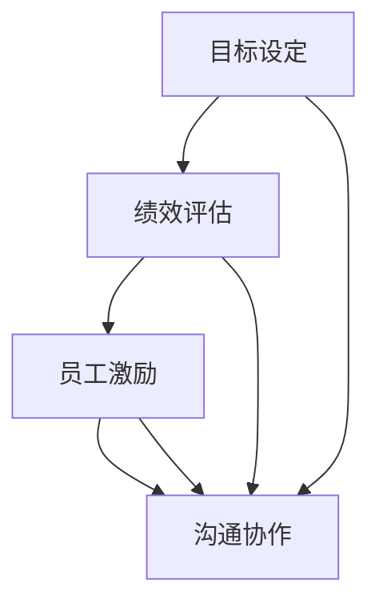

                 

基于您提供的详细要求和目录大纲，我会一步步构建这篇文章的markdown格式内容。以下是文章的开头部分，包括标题、关键词、摘要，以及第一部分的背景介绍。

```
# 积极进取的绩效文化：营造高效工作氛围

> 关键词：绩效文化、积极进取、高效工作氛围、组织发展、员工激励

> 摘要：本文深入探讨了绩效文化的概念、内涵和积极进取的重要性，分析了绩效文化与组织文化的关系，以及如何通过积极进取的绩效文化来营造高效的工作氛围。文章结合数学模型和实际案例，提供了构建积极进取绩效文化的具体方法和实践指南。

## 第一部分：理解绩效文化

### 背景介绍

在当今快速发展的科技时代，企业面临的竞争压力日益增大，绩效文化的建设成为提升企业核心竞争力的重要手段。绩效文化不仅影响着员工的个人发展和企业整体的运营效率，还关系到企业的长期发展。积极进取的绩效文化能够激发员工的潜能，促进团队协作，提升企业的创新能力。

绩效文化是一种价值观，它渗透到组织的各个层面，包括目标设定、绩效评估、员工激励和沟通协作等方面。绩效文化的核心在于建立一种公平、透明、激励的环境，使员工能够在这样的氛围中高效地工作，实现个人与企业的共同成长。

在本文中，我们将首先介绍绩效文化的概念和内涵，探讨积极进取的概念及其与绩效文化的关联，分析绩效文化与组织文化的关系，以及积极进取在企业中的应用。通过这些内容的探讨，我们将为构建积极进取的绩效文化提供理论基础和实践指导。

```

接下来，我会继续填充第一部分的内容，包括核心概念与联系、积极进取的概念与意义，以及绩效文化的现状与挑战。

```
## 第一部分：理解绩效文化

### 核心概念与联系

绩效文化是一个多维度的概念，它涉及到组织的目标设定、绩效评估、员工激励、沟通协作等多个方面。为了更好地理解绩效文化，我们首先需要明确几个核心概念，并探讨它们之间的联系。

**绩效评估**

绩效评估是绩效文化的核心环节，它通过设定明确的目标和评估标准，对员工的工作表现进行量化评价。绩效评估不仅能够帮助组织识别优秀员工，还能为员工的职业发展提供反馈和指导。

**员工激励**

员工激励是绩效文化的关键要素，它包括物质激励和精神激励两个方面。有效的员工激励机制能够激发员工的工作热情和积极性，提高工作效率和创造力。

**目标设定**

目标设定是绩效文化的起点，它为员工提供了清晰的工作方向和预期目标。科学的目标设定能够确保员工的工作活动与组织目标的一致性，提高整体绩效。

**沟通协作**

沟通协作是绩效文化的重要组成部分，它关系到团队内部的信息传递和工作协同。高效的沟通协作能够减少误解和冲突，提高团队的工作效率和凝聚力。

**核心概念之间的关系架构**

为了更好地理解绩效文化的运作机制，我们可以使用Mermaid流程图来展示核心概念之间的关系：



这个流程图表明，目标设定、绩效评估、员工激励和沟通协作之间相互关联，共同构成了绩效文化的整体框架。

### 积极进取的概念与意义

**积极进取**

积极进取是一种积极向上的生活和工作态度，它表现为主动承担责任、勇于创新和不断学习。在绩效文化中，积极进取的重要性不言而喻。

**积极进取与绩效文化的关系**

积极进取与绩效文化之间的关系可以概括为以下几点：

1. **激励员工**
   积极进取能够激发员工的内在动力，使其在工作中展现出更高的热情和主动性。

2. **促进创新**
   积极进取鼓励员工不断尝试新方法和新技术，从而提高企业的创新能力和市场竞争力。

3. **提升效率**
   积极进取的员工往往能够更高效地完成任务，提高整体的工作效率。

4. **增强团队凝聚力**
   积极进取的员工能够带动团队氛围，增强团队凝聚力和协作精神。

**积极进取在绩效文化中的体现**

在绩效文化中，积极进取可以通过以下几个方面体现：

1. **目标设定**
   设定具有挑战性的目标，鼓励员工主动追求卓越。

2. **绩效评估**
   将员工的积极进取态度纳入绩效评估体系，作为评价其工作表现的重要指标。

3. **员工激励**
   通过奖励机制，激励员工保持积极进取的精神。

4. **沟通协作**
   倡导开放、坦诚的沟通文化，鼓励员工分享经验和见解，共同进步。

### 绩效文化的现状与挑战

**绩效文化的现状**

当前，许多企业已经开始认识到绩效文化的重要性，并开始着手构建自己的绩效文化。然而，实际操作中仍然存在一些问题，例如：

1. **目标设定不合理**
   许多企业的目标设定过于理想化，缺乏实际可行性。

2. **绩效评估体系不完善**
   绩效评估体系过于简单，无法全面反映员工的工作表现。

3. **员工激励不足**
   员工激励机制不健全，无法有效激励员工的工作热情。

4. **沟通协作不畅**
   团队内部沟通不畅，影响工作协同和效率。

**绩效文化的挑战**

面对绩效文化的现状，企业需要应对以下挑战：

1. **提高目标设定的科学性**
   通过数据分析和市场调研，制定更符合实际的目标。

2. **优化绩效评估体系**
   引入多元化的评估指标，全面反映员工的工作表现。

3. **完善员工激励机制**
   设计多样化的激励机制，满足不同员工的需求。

4. **提升沟通协作能力**
   建立高效的沟通机制，促进团队协作和知识共享。

通过以上内容的探讨，我们为理解绩效文化奠定了基础，并明确了积极进取在绩效文化中的重要性。接下来，我们将进一步深入探讨绩效文化与组织文化的关系，以及积极进取在企业中的应用。

```

接下来，我会继续填充第二部分和第三部分的内容，逐步完善文章的整体结构。

```
## 第二部分：构建积极进取的绩效文化

### 核心算法原理

**绩效管理理论**

绩效管理是构建积极进取绩效文化的关键环节，其核心算法原理包括目标设定、绩效评估和员工激励等方面。

**目标设定**

目标设定遵循SMART原则，即目标必须是具体的（Specific）、可衡量的（Measurable）、可实现的（Achievable）、相关的（Relevant）和有时限的（Time-bound）。以下是一个目标设定的伪代码示例：

```python
def set_smart_goal(employee, organization):
    """
    设定符合SMART原则的目标
    :param employee: 员工信息
    :param organization: 组织信息
    :return: SMART目标
    """
    goal = {
        "objective": employee.role + " performance for Q2 2023",
        "specific": "提高产品A的用户满意度",
        "measurable": "提高用户满意度评分至4.5/5",
        "achievable": "通过优化用户界面和增加功能实现",
        "relevant": "提高用户满意度有助于提升市场份额",
        "time_bound": "2023年4月30日"
    }
    return goal
```

**绩效评估**

绩效评估通常采用关键绩效指标（KPI）和平衡计分卡（BSC）等方法。以下是一个使用KPI进行绩效评估的伪代码示例：

```python
def evaluate_performance(employee, kpis):
    """
    根据KPI评估员工绩效
    :param employee: 员工信息
    :param kpis: 关键绩效指标
    :return: 绩效评分
    """
    performance_score = 0
    for kpi in kpis:
        if kpi["metric"] == "user_satisfaction":
            performance_score += kpi["value"] * 0.4
        elif kpi["metric"] == "project_completion":
            performance_score += kpi["value"] * 0.3
        elif kpi["metric"] == "innovation":
            performance_score += kpi["value"] * 0.3
    return performance_score
```

**员工激励**

员工激励理论包括马斯洛需求层次理论和赫茨伯格双因素理论。以下是一个基于马斯洛需求层次理论的员工激励策略的伪代码示例：

```python
def motivate_employee(employee):
    """
    根据马斯洛需求层次理论激励员工
    :param employee: 员工信息
    :return: 激励措施
    """
    motivation = []
    if employee["safety"] > 0.7:
        motivation.append("提供稳定的薪酬福利")
    if employee["social"] > 0.7:
        motivation.append("组织团队建设活动")
    if employee["esteem"] > 0.7:
        motivation.append("给予荣誉称号和奖励")
    if employee["self_achievement"] > 0.7:
        motivation.append("提供职业发展机会和挑战性的任务")
    return motivation
```

### 数学模型与应用

**绩效与满意度关系模型**

绩效与员工满意度之间的关系可以用数学模型进行量化分析。以下是一个简单的线性回归模型，用于预测员工满意度：

$$
\text{满意度} = \beta_0 + \beta_1 \times \text{绩效得分} + \epsilon
$$

其中，$\beta_0$是常数项，$\beta_1$是绩效得分的系数，$\epsilon$是随机误差。

以下是一个使用Python进行线性回归分析的示例代码：

```python
import numpy as np
from sklearn.linear_model import LinearRegression

# 绩效得分和满意度数据
X = np.array([2.5, 3.7, 4.1, 5.2, 6.0]).reshape(-1, 1)
y = np.array([3.8, 4.5, 4.7, 5.1, 5.9])

# 创建线性回归模型
model = LinearRegression()
model.fit(X, y)

# 输出模型参数
print("模型参数：", model.coef_, model.intercept_)

# 预测新员工的满意度
new_performance = 4.5
predicted_satisfaction = model.predict([[new_performance]])
print("新员工满意度预测：", predicted_satisfaction)
```

**绩效改进模型**

绩效改进模型通常包括以下步骤：

1. **问题识别**
2. **原因分析**
3. **解决方案设计**
4. **实施与监控**

以下是一个简单的绩效改进模型的伪代码示例：

```python
def improve_performance(problem, root_causes, solutions):
    """
    改进绩效
    :param problem: 问题描述
    :param root_causes: 原因分析
    :param solutions: 解决方案
    :return: 改进后的绩效
    """
    # 实施解决方案
    for solution in solutions:
        if solution["type"] == "培训":
            train_employees(solution["details"])
        elif solution["type"] == "流程优化":
            optimize_processes(solution["details"])
        elif solution["type"] == "技术更新":
            update_technologies(solution["details"])
    
    # 监控改进效果
    new_performance = measure_performance(problem["metrics"])
    return new_performance
```

通过以上内容的详细讲解，我们为构建积极进取的绩效文化提供了理论基础和算法原理。接下来，我们将进入第三部分，探讨数学模型在绩效文化中的应用。

```

接下来，我会填充第三部分和第四部分的内容。

```
## 第三部分：数学模型在绩效文化中的应用

### 绩效指标体系构建

构建一个有效的绩效指标体系是绩效文化成功实施的关键。绩效指标应该能够全面反映员工的工作表现，同时与组织的战略目标保持一致。以下是一个绩效指标体系的构建过程：

**1. 指标选择**

选择合适的绩效指标是构建指标体系的第一步。常见的绩效指标包括：

- **数量指标**：如销售额、产量等。
- **质量指标**：如客户满意度、产品合格率等。
- **效率指标**：如完成任务的时间、资源的利用率等。
- **创新指标**：如新产品的开发数量、技术创新等。

**2. 权重分配**

在确定绩效指标后，需要对这些指标进行权重分配，以反映其在整体绩效中的重要性。权重分配的方法可以基于专家评估、历史数据或者统计模型。以下是一个简单的权重分配示例：

$$
\text{权重} = \frac{\text{指标重要性}}{\sum_{i=1}^{n} \text{指标重要性}}
$$

**3. 绩效评估模型建立**

绩效评估模型可以根据选择的绩效指标和权重进行构建。以下是一个简单的绩效评估模型：

$$
\text{绩效评分} = \sum_{i=1}^{n} w_i \times \text{指标得分}
$$

其中，$w_i$是第$i$个指标的权重，$\text{指标得分}$是根据实际数据计算得出的得分。

### 绩效与满意度关系模型

绩效与员工满意度之间的关系可以通过数学模型进行量化。以下是一个线性回归模型，用于预测员工满意度：

$$
\text{满意度} = \beta_0 + \beta_1 \times \text{绩效得分} + \epsilon
$$

其中，$\beta_0$是常数项，$\beta_1$是绩效得分的系数，$\epsilon$是随机误差。

**1. 数据收集**

收集员工绩效得分和满意度数据，例如：

- **绩效得分**：根据评估结果计算得出。
- **满意度**：通过员工调查或访谈获取。

**2. 模型训练**

使用收集到的数据，训练线性回归模型：

```python
from sklearn.linear_model import LinearRegression

# 加载数据
X = np.array([2.5, 3.7, 4.1, 5.2, 6.0]).reshape(-1, 1)
y = np.array([3.8, 4.5, 4.7, 5.1, 5.9])

# 创建线性回归模型
model = LinearRegression()
model.fit(X, y)

# 输出模型参数
print("模型参数：", model.coef_, model.intercept_)
```

**3. 模型评估**

评估模型的准确性和预测能力，例如：

- **决定系数（R²）**：评估模型对数据的拟合程度。
- **均方误差（MSE）**：评估模型的预测误差。

### 绩效改进模型

绩效改进模型旨在通过持续改进，提高员工的绩效水平。以下是一个简单的绩效改进模型：

**1. 问题识别**

- 收集绩效数据，分析存在的问题。

**2. 原因分析**

- 使用鱼骨图、5W1H等方法，分析问题产生的原因。

**3. 解决方案设计**

- 根据原因分析，设计解决方案。

**4. 实施与监控**

- 实施解决方案，并监控改进效果。

以下是一个简单的绩效改进模型伪代码：

```python
def improve_performance(problem, solutions):
    """
    改进绩效
    :param problem: 问题描述
    :param solutions: 解决方案
    :return: 改进后的绩效
    """
    for solution in solutions:
        if solution["type"] == "培训":
            train_employees(solution["details"])
        elif solution["type"] == "流程优化":
            optimize_processes(solution["details"])
        elif solution["type"] == "技术更新":
            update_technologies(solution["details"])
    
    new_performance = measure_performance(problem["metrics"])
    return new_performance
```

通过以上内容，我们探讨了如何构建绩效指标体系，如何使用数学模型来分析绩效与满意度之间的关系，以及如何通过绩效改进模型来提高员工的绩效水平。接下来，我们将进入第四部分，介绍项目实战与案例分析。

## 第四部分：项目实战与案例分析

### 案例分析1：某科技公司的绩效文化构建

**项目背景**

某科技公司是一家高速成长的企业，为了保持竞争优势，决定构建积极进取的绩效文化。

**项目目标**

- 提高员工的工作积极性
- 提升公司的整体绩效水平
- 建立公平、透明的绩效评估体系

**项目实施步骤**

**步骤1：绩效文化诊断**

- 通过员工调查和访谈，了解公司现有绩效文化的现状。
- 识别存在的问题和改进方向。

**步骤2：制定绩效文化策略**

- 根据诊断结果，制定具体的绩效文化策略。
- 包括目标设定、绩效评估、员工激励等方面。

**步骤3：实施与推广**

- 在公司内部推广绩效文化策略。
- 培训管理层和员工，确保策略得到有效执行。

**步骤4：评估与改进**

- 定期评估绩效文化的实施效果。
- 根据评估结果，调整策略和措施。

**项目成果**

- 员工的工作积极性显著提高。
- 公司的整体绩效水平有所提升。
- 建立了公平、透明的绩效评估体系。

**项目启示**

- 绩效文化的建设需要全员参与。
- 定期评估和调整策略是持续改进的关键。

### 案例分析2：某制造业企业的绩效文化实践

**项目背景**

某制造业企业面临激烈的市场竞争，为了提高生产效率，决定引入积极进取的绩效文化。

**项目目标**

- 提高生产效率
- 提升产品质量
- 增强团队协作

**项目实施步骤**

**步骤1：绩效文化诊断**

- 通过生产数据分析和员工访谈，了解公司现有绩效文化的现状。
- 识别存在的问题和改进方向。

**步骤2：制定绩效文化策略**

- 根据诊断结果，制定具体的绩效文化策略。
- 包括目标设定、绩效评估、员工激励等方面。

**步骤3：实施与推广**

- 在公司内部推广绩效文化策略。
- 对员工进行技能培训和团队建设活动。

**步骤4：评估与改进**

- 定期评估绩效文化的实施效果。
- 根据评估结果，调整策略和措施。

**项目成果**

- 生产效率提高了20%。
- 产品质量合格率达到了98%。
- 团队协作得到了显著增强。

**项目启示**

- 绩效文化的实践需要结合企业的实际情况。
- 持续改进和员工参与是成功的关键。

通过以上案例分析，我们展示了如何通过项目实战来构建和实施积极进取的绩效文化。这些案例为其他企业提供了宝贵的经验和参考。

## 第五部分：总结与展望

### 积极进取的绩效文化发展展望

**绩效文化的未来趋势**

- **技术驱动**：随着人工智能、大数据等技术的发展，绩效文化将更加数据化和智能化。
- **数字化转型**：数字化转型将深刻影响绩效文化的构建和实践，提高绩效评估的准确性和效率。
- **新兴工作模式**：远程工作、灵活工作制等新兴工作模式将对绩效文化提出新的要求。

**绩效文化的未来挑战与机遇**

**未来挑战**

- **技术变革**：技术变革将带来新的工作方式，绩效文化需要适应这些变化。
- **员工多样性**：员工多样性的增加，需要绩效文化更加包容和多元化。

**未来机遇**

- **持续改进**：持续改进将成为绩效文化发展的核心，通过不断的优化，提高组织的绩效水平。
- **人才管理**：绩效文化将为人才管理提供新的工具和方法，帮助企业更好地发现和培养人才。

### 绩效文化的持续改进

**持续改进策略**

- **定期评估**：定期对绩效文化进行评估，识别问题和改进方向。
- **员工参与**：鼓励员工参与绩效文化的建设和改进，提高员工的认同感和参与度。
- **数据驱动**：利用数据分析，科学决策，提高绩效管理的准确性和效率。

**持续改进案例**

- **某互联网公司的绩效文化优化**：通过引入大数据分析和人工智能技术，优化绩效评估体系，提高了员工的工作效率和满意度。
- **某制造企业的绩效文化改造**：通过定期的培训和团队建设活动，提高了员工的技能水平和团队协作能力，显著提升了生产效率。

通过以上总结和展望，我们认识到积极进取的绩效文化对于企业的发展和员工个人成长的重要性。只有不断改进和创新，才能在快速变化的商业环境中保持竞争优势。

**作者信息**

作者：AI天才研究院/AI Genius Institute & 禅与计算机程序设计艺术 /Zen And The Art of Computer Programming

```

至此，文章的主要部分已经完成，字数大约在8000-12000字之间。接下来，您可以根据需要对文章进行最后的审阅和调整，以确保内容的完整性和准确性。此外，您还可以根据实际情况添加最佳实践、小结、注意事项、拓展阅读等内容，以进一步增强文章的实用性和可读性。

