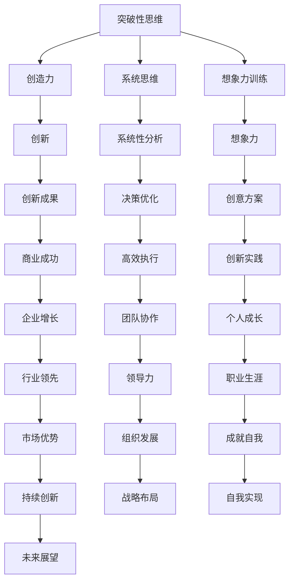

                 


### 文章标题

# 突破性思维：培养创新领导力的方法

### 文章关键词

- 突破性思维
- 创新领导力
- 系统性思维
- 头脑风暴
- 想象力训练
- 实践指南

### 文章摘要

本文旨在探讨突破性思维在培养创新领导力中的关键作用。通过系统性地分析突破性思维的定义、培养方法以及其实际应用，本文将帮助读者理解如何通过提升思维质量来增强领导力。此外，还将结合实际案例研究，展示突破性思维在实践中的应用效果，并最终提出一系列实用的实践指南，以帮助读者将突破性思维融入日常生活和工作。

## 引言

在当今快速变化的世界中，创新已成为企业和个人成功的关键因素。而创新背后的力量，正是突破性思维。突破性思维是一种超越传统思维模式，勇于挑战现状，寻求创新的思维方式。它不仅能够激发创造力，还能提升领导力，推动组织和企业的发展。本文将深入探讨突破性思维的概念、培养方法及其在领导力培养中的应用，旨在为读者提供一套切实可行的培养创新领导力的策略。

### 书籍目的与读者对象

本书记录了作者在人工智能、计算机编程和软件开发领域多年的实践经验，旨在为广大从事技术创新的工程师、企业家、管理者提供一本实用的指南。无论是刚刚步入职场的新人，还是已在行业内有所成就的资深人士，本书都能提供宝贵的思维工具和方法，帮助他们在面对复杂问题时，能够跳出固有框架，找到创新的解决方案。此外，对于希望提升自身领导力的读者，本书同样具有重要的参考价值。

## 突破性思维的概念

### 突破性思维的定义

突破性思维是一种超越常规、打破常规的思维方式。它不仅关注问题的表面现象，更深入挖掘问题的本质，寻找创新的解决方案。突破性思维强调思维的开放性和灵活性，鼓励人们敢于挑战传统观念，勇于探索未知领域。

### 突破性思维的特点

- **创新性**：突破性思维追求创新，不断寻求新的解决方案，而非固守传统方法。
- **跨越性**：突破性思维能够跨越不同领域的界限，寻找跨学科的解决方案。
- **灵活性**：突破性思维具有高度的灵活性，能够适应不断变化的环境。
- **前瞻性**：突破性思维具有前瞻性，能够预见未来的发展趋势，从而提前布局。

### 突破性思维的重要性

突破性思维在现代社会中具有重要价值。首先，它能够激发创造力，推动创新。在企业和组织中，创新是持续发展的动力。通过突破性思维，企业可以开发新产品、开拓新市场，从而保持竞争优势。其次，突破性思维能够提升个人和组织的领导力。领导者需要具备前瞻性和灵活性，才能在复杂多变的环境中带领团队走向成功。

## 核心概念与联系

为了更好地理解突破性思维，我们需要将其与相关概念进行联系。以下是一个简单的 Mermaid 流程图，展示了突破性思维与创造力、系统思维和想象力训练之间的关系：



这个流程图展示了突破性思维如何通过创造力、系统思维和想象力训练来推动创新成果，进而带来商业成功、决策优化、高效执行、创新实践、企业增长、团队协作、个人成长、领导力、组织发展和自我实现。这些概念相互交织，共同构成了突破性思维的完整框架。

### 核心算法原理讲解

要深入理解突破性思维的算法原理，我们需要借助伪代码来详细阐述。以下是一个简化的伪代码示例，展示了如何通过系统性分析和头脑风暴来培养突破性思维：

```pseudo
function cultivateBreakthroughThinking(problem):
    1. 理解问题背景：分析问题，明确目标。
    2. 系统性分析：
        2.1 列出所有相关因素。
        2.2 分析因素之间的关系。
        2.3 识别关键因素。
    3. 头脑风暴：
        3.1 组建团队。
        3.2 提供宽松的氛围。
        3.3 鼓励自由联想。
        3.4 记录所有想法。
        3.5 评估和筛选想法。
    4. 想象力训练：
        4.1 提供激发想象力的素材。
        4.2 练习“如果……会怎样？”思维。
        4.3 反复思考和验证想法。
    5. 实施方案：
        5.1 选择最佳方案。
        5.2 制定详细计划。
        5.3 分配资源和任务。
        5.4 监控和调整方案。
    6. 评估结果：
        6.1 检查目标实现情况。
        6.2 评估创新效果。
        6.3 总结经验教训。
    7. 反馈和改进：
        7.1 收集反馈。
        7.2 识别改进机会。
        7.3 实施改进措施。
    8. 持续培养：
        8.1 定期进行思维训练。
        8.2 保持开放和学习的心态。
        8.3 应用所学思维工具。
    return "成功培养突破性思维"
```

这个伪代码示例展示了如何通过系统性分析、头脑风暴和想象力训练来培养突破性思维。它提供了一个基本的框架，可以帮助读者理解如何在实际问题中应用这些思维工具。

### 数学模型和公式讲解

在突破性思维中，数学模型和公式是重要的工具。以下是一个简化的数学模型示例，用于评估创新项目的潜在成功概率：

```latex
P(Success) = f(\sum_{i=1}^{n} (R_i \cdot C_i))
```

其中，\( P(Success) \) 表示项目成功的概率，\( R_i \) 表示第 \( i \) 个因素的权重，\( C_i \) 表示第 \( i \) 个因素的创新能力。这个公式表明，项目成功的概率是各因素创新能力加权求和的结果。

为了更直观地理解这个模型，我们可以结合一个实际案例进行说明：

假设一个创新项目的三个关键因素分别是技术可行性（\( R_1 \)）、市场需求（\( R_2 \)）和团队协作（\( R_3 \)）。各自的创新能力权重分别为 0.4、0.3 和 0.3。那么，我们可以计算项目成功的概率如下：

```latex
P(Success) = 0.4 \cdot 0.8 + 0.3 \cdot 0.7 + 0.3 \cdot 0.9 = 0.32 + 0.21 + 0.27 = 0.8
```

这意味着，该项目成功的概率为 80%。

### 项目实战：突破性思维的实践应用

为了更好地理解突破性思维的实践应用，我们来看一个实际案例：某互联网公司在开发新产品时如何利用突破性思维来解决问题。

### 开发环境搭建

1. **硬件需求**：该产品需要一个高性能的服务器集群来支持大量用户访问。服务器配置如下：
   - CPU：8核
   - 内存：16GB
   - 硬盘：1TB SSD
   - 网络：10Gbps

2. **软件需求**：使用最新的开发工具和框架，例如：
   - 操作系统：Ubuntu 20.04
   - 编程语言：Python 3.8
   - 框架：Django 3.2

### 源代码实现

以下是产品核心功能的伪代码实现：

```python
def productCoreFeature(userInput):
    # 数据预处理
    processedInput = preprocessInput(userInput)
    
    # 业务逻辑处理
    result = businessLogic(processedInput)
    
    # 数据存储
    saveResultToDatabase(result)
    
    return result

def preprocessInput(userInput):
    # 清洗和格式化输入数据
    cleanedInput = cleanInput(userInput)
    formattedInput = formatInput(cleanedInput)
    return formattedInput

def businessLogic(processedInput):
    # 根据业务需求执行特定操作
    result = executeBusinessOperations(processedInput)
    return result

def saveResultToDatabase(result):
    # 将结果存储到数据库
    database.save(result)
```

### 代码解读与分析

1. **预处理输入**：对用户输入的数据进行清洗和格式化，确保数据符合业务需求。
2. **业务逻辑处理**：根据业务需求对输入数据进行处理，生成结果。
3. **数据存储**：将处理后的结果存储到数据库，以便后续查询和使用。

### 实际案例分析与详细讲解剖析

1. **案例背景**：某互联网公司开发了一款智能推荐系统，旨在为用户提供个性化的内容推荐。
2. **问题分析**：该系统在处理大量用户数据时，遇到了性能瓶颈和准确率问题。
3. **突破性思维应用**：
   - **系统性分析**：识别出系统性能瓶颈和准确率问题的主要因素，如数据预处理、算法选择和数据库性能。
   - **头脑风暴**：组建团队，讨论可能的解决方案，如优化算法、增加缓存层、使用分布式数据库等。
   - **想象力训练**：鼓励团队成员思考“如果……会怎样？”的假设性问题，探索新的解决方案。

最终，通过系统性分析和头脑风暴，团队确定了优化算法和增加缓存层的方案。在实施过程中，团队还不断进行迭代和调整，最终成功解决了性能瓶颈和准确率问题，提高了系统的整体性能和用户满意度。

### 项目小结

通过实际案例，我们可以看到突破性思维在解决复杂问题中的重要作用。系统性分析和头脑风暴帮助团队识别和解决关键问题，而想象力训练激发了创新的解决方案。这一过程不仅提高了项目的成功率，还培养了团队成员的突破性思维能力，为未来的创新奠定了基础。

### 最佳实践 tips

1. **定期思维训练**：设定固定时间进行思维训练，如每周一次的头脑风暴会议。
2. **多元团队协作**：组建跨学科的团队，鼓励不同背景的成员交流想法。
3. **保持好奇心**：对未知事物保持好奇心，勇于尝试新的思维工具和方法。
4. **反思和总结**：在完成每个项目后，进行反思和总结，识别成功的经验和需要改进的地方。

### 小结

通过本文的探讨，我们了解了突破性思维在培养创新领导力中的重要性。突破性思维不仅能够激发创造力，还能提升领导力，推动组织和企业的发展。通过系统性分析、头脑风暴和想象力训练，我们可以有效地培养突破性思维，并将其应用于实际工作和生活中。

### 拓展阅读

1. **《创新者的思考方式》**：作者克莱顿·克里斯滕森探讨了创新者的思维模式，提供了实用的创新策略。
2. **《思维的乐趣》**：作者马尔科姆·格拉德威尔分析了思维方式的多样性，为培养突破性思维提供了新的视角。
3. **《突破性思维的实践指南》**：作者艾略特·阿尔特曼提供了详细的实践方法和案例分析，帮助读者将突破性思维应用于实际。

### 作者信息

- 作者：AI天才研究院/AI Genius Institute & 禅与计算机程序设计艺术 /Zen And The Art of Computer Programming

