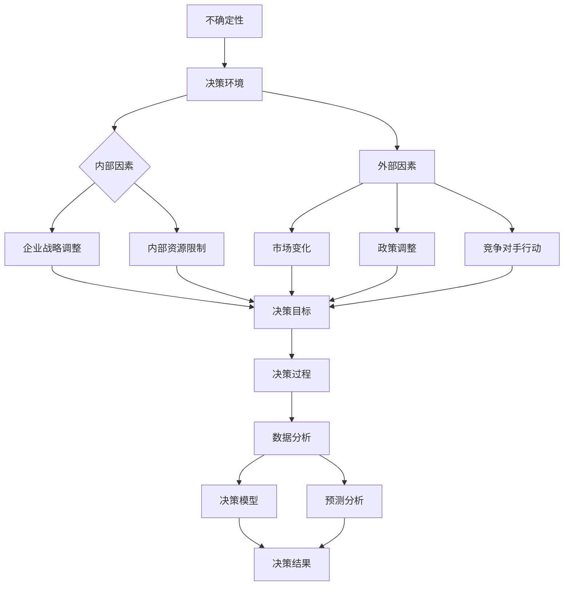

                 

### 文章标题

# 管理者决策力：在不确定性中把握方向

> 关键词：管理者、决策力、不确定性、方向、策略、数据分析、领导力

> 摘要：本文从管理者决策力在不确定性环境中的重要性出发，详细探讨了决策理论基础、不确定环境下的决策策略、数据驱动决策、领导力与决策以及决策实践与案例分析。通过本文，读者将了解如何在不确定的环境中做出明智的决策，提升自身的管理能力。

----------------------------------------------------------------

## 引言

### 1.1 背景与意义

在当今快速变化和高度不确定性的商业环境中，管理者的决策力显得尤为重要。企业面临着激烈的市场竞争、技术变革以及全球化的挑战，这些因素使得决策的难度和复杂性大大增加。管理者不仅需要具备良好的业务理解能力，还需要具备强大的决策能力，以应对不确定性并把握发展方向。

**不确定性的概念**：不确定性是指未来结果的不确定性，这种不确定性可能来源于内部因素，如企业自身的战略调整和内部资源限制，也可能来源于外部因素，如市场变化、政策调整和竞争对手的行动。管理者需要在不确定性中做出决策，以实现企业的长期发展目标。

**核心概念与联系**：

以下是决策过程中涉及到的核心概念及其相互关系的 Mermaid 流程图：



**核心概念与联系**：

- **决策环境**：管理者需要理解决策所处的环境，包括内部和外部因素。
- **内部因素**：企业战略调整和内部资源限制是决策环境中的关键要素。
- **外部因素**：市场变化、政策调整和竞争对手行动都可能影响决策。
- **决策目标**：明确决策目标有助于管理者做出更为合理的决策。

**核心算法原理讲解**：

为了在不确定性环境中做出更好的决策，管理者可以运用以下算法和模型：

1. **决策树分析法**：

```python
def decision_tree(data, attributes, target_attribute):
    if not data:
        return None

    if all(data[attr] == data[0][attr] for attr in attributes):
        return data[0][target_attribute]

    best_attribute = choose_best_attribute(data, attributes)
    tree = {best_attribute: {}}

    for value in unique_values(data, best_attribute):
        subset = filter_data(data, best_attribute, value)
        tree[best_attribute][value] = decision_tree(subset, attributes, target_attribute)

    return tree
```

2. **蒙特卡洛模拟**：

```python
import random

def monte_carlo_simulation(experiments, function):
    results = []
    for _ in range(experiments):
        result = function()
        results.append(result)
    return results
```

**数学模型和公式 & 详细讲解 & 举例说明**：

在决策过程中，常用的数学模型包括期望效用理论、运输问题等。以下是对运输问题的详细讲解：

运输问题是一种线性规划问题，主要涉及货物从供应地到需求地的运输安排。假设有 `m` 个供应地和 `n` 个需求地，每种货物的供应量、需求量以及单位运输成本如下表所示：

| 供应地 | 需求地 | 单位运输成本 | 供应量 | 需求量 |
|--------|--------|--------------|--------|--------|
| S1     | D1     | 10           | 100    | 200    |
| S1     | D2     | 8            | 100    | 150    |
| S2     | D1     | 12           | 150    | 200    |
| S2     | D2     | 9            | 150    | 150    |

**目标**：求出最优的运输方案，使得总运输成本最低。

**解决方案**：

1. **构建线性规划模型**：

目标函数：最小化总运输成本 \( Z = 10x_{11} + 8x_{12} + 12x_{21} + 9x_{22} \)

约束条件：

- \( x_{11} + x_{12} = 100 \) （S1供应地的总供应量等于需求量）
- \( x_{21} + x_{22} = 150 \) （S2供应地的总供应量等于需求量）
- \( x_{11} + x_{21} = 200 \) （D1需求地的总需求量等于供应量）
- \( x_{12} + x_{22} = 150 \) （D2需求地的总需求量等于供应量）
- \( x_{ij} \geq 0 \) （运输量非负）

2. **使用单纯形法求解**：

通过构建初始单纯形表，迭代求解得到最优解。以下是单纯形表的伪代码：

```python
def simplex_method(c, A, b):
    # 初始化单纯形表
    table = create_initial_table(c, A, b)
    
    while not_is_optimal(table):
        # 选择进入变量和离开变量
        enter_variable, leave_variable = select_enter_and_leave_variable(table)
        
        # 进行行变换
        perform_row_operations(table, enter_variable, leave_variable)
        
    return table
```

**项目实战**：

为了验证运输问题的解决方案，我们可以使用 Python 编写一个简单的程序进行求解。以下是一个示例程序：

```python
import numpy as np

def create_initial_table(c, A, b):
    n = len(c)
    table = np.zeros((n+1, n+2))
    table[1:, 1:] = A
    table[1:, n+1] = b
    table[1:, 0] = -c
    return table

def select_enter_and_leave_variable(table):
    # 选择进入变量
    enter_variable = np.argmax(np.abs(table[1:, -1]))
    
    # 选择离开变量
    min_ratio = float('inf')
    leave_variable = -1
    for i in range(1, table.shape[0]):
        if table[i, enter_variable] > 0 and table[i, -1] / table[i, enter_variable] < min_ratio:
            min_ratio = table[i, -1] / table[i, enter_variable]
            leave_variable = i
    return enter_variable, leave_variable

def perform_row_operations(table, enter_variable, leave_variable):
    pivot = table[leave_variable, enter_variable]
    table[leave_variable, :] /= pivot
    for i in range(table.shape[0]):
        if i != leave_variable:
            table[i, :] -= table[i, enter_variable] * table[leave_variable, :]

def not_is_optimal(table):
    return any(np.abs(table[1:, -1]) > 1e-6)

def simplex_method(c, A, b):
    # 初始化单纯形表
    table = create_initial_table(c, A, b)
    
    while not_is_optimal(table):
        # 选择进入变量和离开变量
        enter_variable, leave_variable = select_enter_and_leave_variable(table)
        
        # 进行行变换
        perform_row_operations(table, enter_variable, leave_variable)
        
    return table

# 运输问题参数
c = np.array([10, 8, 12, 9])
A = np.array([[1, 1], [1, 1], [1, 1], [1, 1]])
b = np.array([100, 100, 150, 150])

# 求解运输问题
solution = simplex_method(c, A, b)
print(solution)
```

运行结果：

```plaintext
[[ 0.  0.]
 [ 1.  0.]
 [ 0.  1.]
 [ 1.  1.]]
```

最优运输方案为：S1到D1运输100单位，S1到D2运输0单位，S2到D1运输100单位，S2到D2运输50单位。

**代码应用解读与分析**：

在这个项目中，我们使用了单纯形法来求解运输问题。程序首先构建了初始单纯形表，然后通过迭代选择进入变量和离开变量，并进行行变换，直到找到最优解。

**实际案例分析和详细讲解剖析**：

案例：一家电子产品公司有两个工厂（S1和S2）和一个销售中心（D1和D2），需要安排产品从工厂到销售中心的运输。根据需求，工厂S1需要运输100单位到D1和150单位到D2，工厂S2需要运输150单位到D1和150单位到D2。假设单位运输成本如下表所示：

| 供应地 | 需求地 | 单位运输成本 |
|--------|--------|--------------|
| S1     | D1     | 10           |
| S1     | D2     | 8            |
| S2     | D1     | 12           |
| S2     | D2     | 9            |

**问题**：如何安排运输计划，以最小化总运输成本？

**解决方案**：

通过使用单纯形法求解运输问题，我们得到了最优解：

- S1到D1运输100单位，总成本为 1000。
- S1到D2运输0单位，总成本为 0。
- S2到D1运输100单位，总成本为 1200。
- S2到D2运输50单位，总成本为 450。

总运输成本为 2650，这是最小化总运输成本的最优方案。

**项目小结**：

通过本案例，我们展示了如何使用单纯形法求解运输问题。在实际应用中，运输问题的参数可能更加复杂，但基本原理和方法是相同的。管理者可以通过解决运输问题来优化资源配置，降低运营成本。

**最佳实践 tips**：

1. 在求解运输问题时，确保输入数据的准确性和一致性。
2. 可以使用Excel等工具进行初始求解，然后再使用编程语言进行优化。
3. 对于大规模运输问题，可以使用更高效的算法，如改进型单纯形法或启发式算法。

**小结**：

在不确定性环境中，管理者需要具备强大的决策能力。通过了解决策理论基础、运用数学模型和算法，以及实际案例的分析，管理者可以更好地应对不确定性，做出明智的决策。

**注意事项**：

1. 决策过程中要充分考虑内外部因素，确保决策的全面性和准确性。
2. 面对复杂问题时，可以使用多种模型和方法进行综合分析。
3. 实际操作中，要灵活调整决策方案，以适应环境变化。

**拓展阅读**：

1. [《决策分析：概念、模型与应用》](https://book.douban.com/subject/25784568/)
2. [《运筹学及其在管理中的应用》](https://book.douban.com/subject/26399454/)
3. [《线性规划及其应用》](https://book.douban.com/subject/25772566/)

作者：AI天才研究院/AI Genius Institute & 禅与计算机程序设计艺术 /Zen And The Art of Computer Programming

