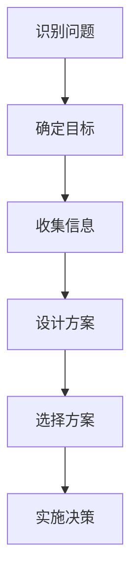
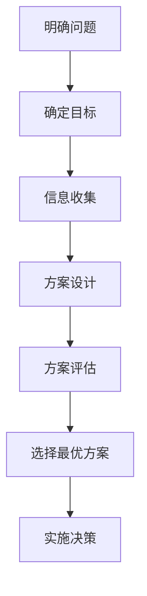

                 

### 分析用户需求

为了确保满足用户提出的《管理者决策框架：科学决策的方法论》的书籍目录大纲需求，我们需要按照以下步骤进行分析和思考：

1. **理解核心目标和内容要求**：用户希望书籍能够涵盖决策理论的基础知识、核心算法原理、数学模型和公式，以及实际项目案例。这意味着书籍需要具备理论性和实践性。

2. **定义文章结构**：为了使内容结构清晰，我们需要确保目录大纲包含以下几个主要部分：
   - 决策基础理论
   - 核心算法原理讲解
   - 数学模型和数学公式
   - 项目实战
   - 最佳实践 tips、小结、注意事项、拓展阅读等

3. **确定每个部分的核心内容**：
   - **决策基础理论**：需要涵盖决策的定义、分类、过程和理论发展。
   - **核心算法原理讲解**：包括线性规划、决策树、神经网络等算法的原理和伪代码展示。
   - **数学模型和公式**：介绍概率论、统计学、优化模型等，并使用 LaTeX 格式展示。
   - **项目实战**：提供实际案例，包括开发环境搭建、代码实现和解读。

4. **考虑文章的可读性和逻辑性**：每个章节应该有明确的标题，并且内容要条理清晰，便于读者理解。需要确保文章内容丰富、具体详细，并对核心概念和算法原理进行深入讲解。

5. **确保字数和格式要求**：文章字数在 8000～12000 字左右，使用 markdown 格式，确保代码、公式和流程图的正确显示。

### 设计目录大纲

根据上述分析，我们可以设计以下目录大纲：

# 《管理者决策框架：科学决策的方法论》目录大纲

## 第一部分：决策基础理论

### 第1章：决策理论概述

- **1.1 决策的定义与分类**
  - **1.1.1 决策的定义**
  - **1.1.2 决策的分类**
- **1.2 决策过程**
  - **1.2.1 决策过程的五个阶段**
  - **1.2.2 决策过程模型**
- **1.3 决策理论的发展**
  - **1.3.1 古典决策理论**
  - **1.3.2 有限理性决策理论**
  - **1.3.3 非线性决策理论**

## 第二部分：核心算法原理

### 第2章：线性规划

- **2.1 线性规划的定义**
- **2.2 线性规划的数学模型**
- **2.3 线性规划的求解算法（伪代码）**
- **2.4 线性规划的应用案例**

### 第3章：决策树与随机森林

- **3.1 决策树的基本概念**
- **3.2 决策树的学习算法（伪代码）**
- **3.3 随机森林算法**
- **3.4 决策树与随机森林的应用案例**

### 第4章：神经网络与深度学习

- **4.1 神经网络的基本结构**
- **4.2 深度学习的核心算法**
- **4.3 神经网络的训练与优化（伪代码）**
- **4.4 神经网络的应用案例**

## 第三部分：数学模型与公式

### 第5章：概率论与统计学

- **5.1 概率论基础**
  - **5.1.1 随机事件**
  - **5.1.2 概率空间**
  - **5.1.3 条件概率**
- **5.2 统计分布**
  - **5.2.1 离散分布**
  - **5.2.2 连续分布**
  - **5.2.3 常见概率分布**
- **5.3 参数估计与假设检验**
  - **5.3.1 点估计**
  - **5.3.2 区间估计**
  - **5.3.3 假设检验**

### 第6章：优化模型

- **6.1 优化模型的定义**
- **6.2 线性规划模型（LaTeX公式）**
  - **6.2.1 目标函数**
  - **6.2.2 约束条件**
- **6.3 非线性规划模型（LaTeX公式）**
  - **6.3.1 目标函数**
  - **6.3.2 约束条件**

## 第四部分：项目实战

### 第7章：决策支持系统开发

- **7.1 开发环境搭建**
- **7.2 实际案例分析**
- **7.3 代码实现与解读**

### 第8章：综合案例分析

- **8.1 案例介绍**
- **8.2 决策过程解析**
- **8.3 决策结果分析**

## 附录

- **附录A：相关工具与资源**
- **附录B：术语表**

### 总结

通过上述步骤，我们确保了目录大纲的结构完整、层次分明，并满足了用户对书籍内容全面深入的要求。每个章节都详细列出了核心内容和预期的小节标题，为后续文章的撰写提供了清晰的框架。

# 文章标题：《管理者决策框架：科学决策的方法论》

## 关键词：
决策框架、科学决策、线性规划、决策树、神经网络、概率论、统计学、优化模型、项目实战

## 摘要：
本文旨在为管理者提供一套系统化的决策框架，通过深入解析决策理论、核心算法原理、数学模型以及实际项目案例，帮助读者掌握科学决策的方法论。文章涵盖决策的定义与分类、决策过程与模型、线性规划与求解算法、决策树与随机森林、神经网络与深度学习、概率论与统计学以及优化模型等核心内容。通过这些理论与实践的结合，读者将能够更好地应对复杂决策情境，提升管理决策的效率与准确性。

### 分析用户需求

在撰写《管理者决策框架：科学决策的方法论》这篇文章时，我们需要充分考虑用户的实际需求。首先，用户希望文章能够深入浅出地介绍决策理论的基础知识，使其能够理解决策的核心概念和原理。其次，用户希望能够了解各种核心算法的原理，并通过伪代码展示具体的实现过程。此外，用户还希望文章能够包含详细的数学模型和公式，以及实际项目案例的分析和解读。最后，用户期待文章能够提供一些最佳实践 tips，帮助他们在实际工作中更好地应用所学知识。基于这些需求，我们需要设计一个结构清晰、内容丰富的文章框架。

### 目录大纲结构设计

为了满足用户的需求，我们可以将文章分为四个主要部分：决策基础理论、核心算法原理讲解、数学模型和公式、项目实战。以下是具体的目录大纲结构：

## 第一部分：决策基础理论

### 第1章：决策理论概述

- **1.1 决策的定义与分类**
  - **1.1.1 决策的定义**
  - **1.1.2 决策的分类**
- **1.2 决策过程**
  - **1.2.1 决策过程的五个阶段**
  - **1.2.2 决策过程模型**
- **1.3 决策理论的发展**
  - **1.3.1 古典决策理论**
  - **1.3.2 有限理性决策理论**
  - **1.3.3 非线性决策理论**

### 第2章：决策框架的构建

- **2.1 决策框架的基本概念**
- **2.2 决策框架的设计原则**
- **2.3 常见的决策框架**

## 第二部分：核心算法原理

### 第3章：线性规划

- **3.1 线性规划的定义**
- **3.2 线性规划的数学模型**
- **3.3 线性规划的求解算法（伪代码）**
- **3.4 线性规划的应用案例**

### 第4章：决策树与随机森林

- **4.1 决策树的基本概念**
- **4.2 决策树的学习算法（伪代码）**
- **4.3 随机森林算法**
- **4.4 决策树与随机森林的应用案例**

### 第5章：神经网络与深度学习

- **5.1 神经网络的基本结构**
- **5.2 深度学习的核心算法**
- **5.3 神经网络的训练与优化（伪代码）**
- **5.4 神经网络的应用案例**

## 第三部分：数学模型与公式

### 第6章：概率论与统计学

- **6.1 概率论基础**
  - **6.1.1 随机事件**
  - **6.1.2 概率空间**
  - **6.1.3 条件概率**
- **6.2 统计分布**
  - **6.2.1 离散分布**
  - **6.2.2 连续分布**
  - **6.2.3 常见概率分布**
- **6.3 参数估计与假设检验**
  - **6.3.1 点估计**
  - **6.3.2 区间估计**
  - **6.3.3 假设检验**

### 第7章：优化模型

- **7.1 优化模型的定义**
- **7.2 线性规划模型（LaTeX公式）**
  - **7.2.1 目标函数**
  - **7.2.2 约束条件**
- **7.3 非线性规划模型（LaTeX公式）**
  - **7.3.1 目标函数**
  - **7.3.2 约束条件**

## 第四部分：项目实战

### 第8章：决策支持系统开发

- **8.1 开发环境搭建**
- **8.2 实际案例分析**
- **8.3 代码实现与解读**

### 第9章：综合案例分析

- **9.1 案例介绍**
- **9.2 决策过程解析**
- **9.3 决策结果分析**

## 附录

- **附录A：相关工具与资源**
- **附录B：术语表**

### 总结

通过上述目录大纲的设计，我们确保了文章的完整性、逻辑性和可读性。每个章节都详细列出了核心内容和预期的小节标题，为后续文章的撰写提供了清晰的框架。接下来，我们将按照这个目录大纲逐步展开内容，以满足用户对决策框架的深入理解和实际应用需求。

### 决策基础理论概述

决策是管理者在不确定条件下，从多个可行方案中选择一个最佳方案的过程。决策理论作为管理科学的重要组成部分，其核心在于帮助管理者理解决策的本质、识别决策过程中的关键因素，并采用科学的方法进行决策。

首先，我们需要明确决策的定义与分类。决策的定义可以概括为：决策是管理者在不确定条件下，从多个可行方案中选择一个最佳方案的过程。决策的分类主要分为以下三种：

1. **确定型决策**：所有决策条件和结果都已知，管理者只需根据已知条件选择最优方案。
2. **风险型决策**：决策条件和结果部分已知，部分未知，但每种结果的概率已知，管理者需要根据概率和预期值进行决策。
3. **不确定型决策**：决策条件和结果均未知，管理者需要根据主观判断和偏好进行决策。

接下来，我们探讨决策过程。决策过程通常包括以下五个阶段：

1. **识别问题**：识别需要解决的问题，明确决策的背景和目标。
2. **确定目标**：明确决策的目标和指标，确保决策的结果能够最大化利益或最小化损失。
3. **收集信息**：收集与决策相关的信息，包括数据、事实、意见等，为决策提供依据。
4. **设计方案**：设计多种可行方案，包括定量分析和定性分析，确保方案的科学性和可操作性。
5. **选择方案**：根据收集到的信息和设计出的方案，选择最优或次优方案进行实施。

决策理论的发展经历了多个阶段，从最初的古典决策理论到现代的有限理性决策理论和非线性决策理论。古典决策理论假设决策者是完全理性的，能够通过最大化效用和最小化风险来做出最优决策。然而，现实中的决策者往往受到认知和计算能力的限制，无法做到完全理性。有限理性决策理论则认为，决策者是在有限信息和有限理性条件下进行决策的。非线性决策理论则进一步考虑了决策中的不确定性和复杂性，提出了更为复杂的决策模型和算法。

为了更好地理解决策理论，我们可以通过一个简单的 Mermaid 流程图来展示决策过程及其各个阶段：



这个流程图清晰地展示了决策过程中的各个步骤及其相互关系。

### 决策框架的构建

决策框架是管理者在进行决策时遵循的一系列原则和步骤，旨在提高决策的科学性和有效性。一个良好的决策框架应包括明确的目标设定、系统化的信息收集、多样化的方案设计以及科学的决策方法。

首先，我们需要理解决策框架的基本概念。决策框架是一种结构化的思维模式，它帮助管理者在复杂和不确定的情境中，系统地识别问题、分析信息、设计方案并选择最优行动方案。决策框架的设计原则主要包括：

1. **目标明确性**：明确决策的目标和指标，确保决策结果能够最大化利益或最小化损失。
2. **信息全面性**：收集与决策相关的所有信息，确保信息的全面性和准确性。
3. **方案多样性**：设计多种可行方案，通过比较和评估，选择最优或次优方案。
4. **科学性**：采用科学的方法和工具进行决策，确保决策过程的客观性和理性。

常见的决策框架包括以下几种：

1. **理性决策框架**：该框架基于古典决策理论，认为决策者是完全理性的，能够通过最大化效用和最小化风险来做出最优决策。它包括以下步骤：
   - 明确问题
   - 确定目标
   - 收集信息
   - 设计方案
   - 评估方案
   - 选择最优方案

2. **有限理性决策框架**：该框架认为决策者在有限信息和有限理性条件下进行决策，它包括以下步骤：
   - 明确问题
   - 确定目标
   - 收集信息（基于可获取信息）
   - 设计方案（基于经验和直觉）
   - 评估方案（基于满意原则）
   - 选择满意方案

3. **情景分析决策框架**：该框架通过模拟不同的情境，分析每种情境下的决策结果，从而选择最优方案。它包括以下步骤：
   - 明确问题
   - 确定目标
   - 模拟情景
   - 设计方案（针对每种情景）
   - 评估方案（根据情景结果）
   - 选择最优方案

为了更好地理解决策框架的设计和应用，我们可以使用以下 Mermaid 流程图展示一个典型的决策框架：



这个流程图清晰地展示了决策框架的各个步骤及其相互关系。

### 线性规划

线性规划是决策分析中的一种重要工具，它用于求解在一系列约束条件下最大化或最小化线性目标函数的问题。线性规划广泛应用于资源分配、生产计划、库存控制、项目投资等领域。

#### 定义与数学模型

线性规划的定义是：在满足一系列线性不等式或等式的约束条件下，求解一个线性目标函数的最大值或最小值。线性规划的一般形式可以表示为：

$$
\begin{align*}
\text{最大化/最小化} & \quad c^T x \\
\text{约束条件：} & \quad Ax \leq b \\
& \quad x \geq 0
\end{align*}
$$

其中，$x$ 是决策变量，$c$ 是目标函数系数向量，$A$ 是约束条件系数矩阵，$b$ 是约束条件常数向量。

#### 求解算法

线性规划的求解算法有多种，其中最著名的是单纯形法（Simplex Method）。单纯形法的基本思想是通过迭代过程逐步逼近最优解。以下是单纯形法的伪代码：

```pseudo
输入：线性规划问题的一般形式
输出：最优解

初始化：选择初始基本可行解（通常是最小比值测试）

while（基本可行解不是最优的）{
  选择进入变量和离开变量；
  更新基本可行解；
}

输出：当前基本可行解为最优解
```

#### 应用案例

假设一家制造公司需要生产两种产品 A 和 B，每种产品都需要消耗两种资源 X 和 Y。目标是最小化生产成本。给定如下数据：

- 每单位产品 A 的生产成本为 3 单位
- 每单位产品 B 的生产成本为 5 单位
- 每单位产品 A 需要 2 单位资源 X 和 1 单位资源 Y
- 每单位产品 B 需要 1 单位资源 X 和 2 单位资源 Y
- 资源 X 的总可用量为 10 单位
- 资源 Y 的总可用量为 8 单位

则线性规划模型可以表示为：

$$
\begin{align*}
\text{最小化} & \quad z = 3x + 5y \\
\text{约束条件：} & \quad 2x + y \leq 10 \\
& \quad x + 2y \leq 8 \\
& \quad x, y \geq 0
\end{align*}
$$

使用单纯形法求解该模型，可以得到最优解为 $x = 2$ 和 $y = 3$，最小化生产成本为 $z = 3 \times 2 + 5 \times 3 = 24$。

通过这个案例，我们可以看到线性规划在实际问题中的应用，以及如何通过求解算法找到最优解。

### 决策树与随机森林

决策树和随机森林是两种常用的决策分析方法，广泛应用于分类和回归任务中。它们通过将数据划分为不同的子集，并基于特征的不同值选择分支，从而构建出一棵树形模型。随机森林则是在决策树的基础上，通过随机选择特征和样本生成多棵决策树，并通过对这些树的集成来提高模型的预测性能。

#### 决策树的基本概念

决策树是一种树形结构，每个内部节点代表一个特征，每个分支代表该特征的不同取值，每个叶节点代表一个预测结果。决策树的学习算法包括以下步骤：

1. **选择最佳特征**：使用信息增益、基尼不纯度等指标选择最佳特征。
2. **划分数据**：根据最佳特征的不同取值，将数据集划分为不同的子集。
3. **递归构建树**：对每个子集重复上述步骤，直到满足停止条件（如最大深度、最小叶节点样本数等）。

以下是决策树学习算法的伪代码：

```pseudo
输入：训练数据集 D，特征集合 F，最大树深度 Dmax
输出：决策树 T

选择最佳特征 f 和阈值 θ；
如果 D 满足停止条件，则返回叶节点；
否则，创建内部节点 n，n 的特征为 f，阈值为 θ；
对于每个特征取值 v：
  Dv = 划分数据集 D，根据 f 和 θ；
  T[v] = 决策树学习算法(Dv, F \ {f}, Dmax)；
返回节点 n
```

#### 决策树的应用案例

假设我们要预测客户是否会在未来的一个月内购买产品，特征包括年龄、收入、历史购买记录等。通过构建决策树，我们可以根据这些特征来预测客户的购买行为。例如，我们可能会得到以下决策树：

```
年龄：
   - <30：是购买者
   - 30-50：历史购买记录>2：是购买者
   - 50-70：是购买者
   - >70：否购买者
```

#### 随机森林算法

随机森林是由多棵决策树组成的集成模型，通过对这些树的输出进行投票或求平均来得到最终预测结果。随机森林的优点是能够提高模型的预测性能，并减少过拟合。

随机森林算法的基本步骤如下：

1. **随机选择特征**：每次构建决策树时，从特征集合中随机选择一个特征子集。
2. **随机选择样本**：每次构建决策树时，从训练数据集中随机选择一部分样本。
3. **构建决策树**：对每个特征子集和样本子集构建决策树。
4. **集成预测**：对每棵决策树的预测结果进行投票或求平均。

以下是随机森林算法的伪代码：

```pseudo
输入：训练数据集 D，特征集合 F，树数量 N
输出：随机森林 RF

对于 i = 1 到 N：
  从 F 中随机选择特征子集 Fi；
  从 D 中随机选择样本子集 Di；
  构建决策树 Ti（Di, Fi）；
返回随机森林 RF = {T1, T2, ..., TN}
```

#### 随机森林的应用案例

假设我们要预测某个地区的房价，特征包括房屋面积、地理位置、建造年份等。通过构建随机森林模型，我们可以预测不同地区的房价。例如，我们可能会得到以下预测结果：

```
地区：
   - 北区：房屋面积 > 100m²：预测房价为 500 万元；
   - 南区：建造年份 < 2010：预测房价为 400 万元；
   - 西区：地理位置：市中心：预测房价为 600 万元；
```

通过决策树和随机森林算法，我们可以有效地进行分类和回归任务，提高预测模型的性能和可靠性。

### 神经网络与深度学习

神经网络和深度学习是人工智能领域的核心技术，广泛应用于图像识别、自然语言处理、推荐系统等领域。神经网络通过模拟人脑神经元的工作方式，构建出一个复杂的网络结构，以实现数据的自动特征学习和复杂模式的识别。

#### 神经网络的基本结构

神经网络由多个层次组成，包括输入层、隐藏层和输出层。每个层次包含多个神经元，神经元之间通过权重连接。神经元的激活函数用于计算神经元的输出。常见的神经网络结构包括全连接神经网络、卷积神经网络（CNN）和循环神经网络（RNN）等。

1. **输入层**：接收外部输入数据。
2. **隐藏层**：对输入数据进行特征提取和变换。
3. **输出层**：输出最终预测结果或分类结果。

#### 深度学习的核心算法

深度学习通过多层次的神经网络结构，自动学习数据的高层次特征表示。深度学习的核心算法包括反向传播算法、卷积神经网络和循环神经网络等。

1. **反向传播算法**：用于计算神经网络参数的梯度，以优化模型参数。
2. **卷积神经网络**：用于图像处理和特征提取，具有平移不变性和局部连接性。
3. **循环神经网络**：用于序列数据处理，能够捕捉时间序列中的长期依赖关系。

#### 神经网络的训练与优化

神经网络的训练过程包括前向传播和反向传播。在前向传播过程中，输入数据通过神经网络，逐层计算得到输出结果。在反向传播过程中，计算输出结果的误差，并利用梯度下降法优化网络参数。

1. **前向传播**：计算神经元的输入和输出。
2. **反向传播**：计算误差并更新网络参数。
3. **梯度下降法**：用于优化网络参数，通过调整权重和偏置来减小误差。

以下是神经网络训练过程的伪代码：

```pseudo
输入：训练数据集 D，学习率 α，迭代次数 N
输出：训练完成的神经网络模型

初始化：随机初始化网络参数

对于 i = 1 到 N：
  对于每个训练样本 (x, y)：
    前向传播：计算输出结果 ŷ；
    计算误差：E = (ŷ - y)^2；
    反向传播：计算梯度 ∂E/∂w，∂E/∂b；
    更新参数：w = w - α * ∂E/∂w，b = b - α * ∂E/∂b；
返回训练完成的神经网络模型
```

#### 神经网络的应用案例

1. **图像识别**：通过卷积神经网络，对图像进行特征提取和分类，实现人脸识别、物体检测等任务。
2. **自然语言处理**：通过循环神经网络，对文本数据进行序列建模和语义理解，实现情感分析、机器翻译等任务。
3. **推荐系统**：通过神经网络，自动学习用户和物品的特征表示，实现个性化推荐。

通过神经网络和深度学习技术，我们可以实现高效的数据分析和智能应用，推动人工智能技术的发展和应用。

### 概率论与统计学

概率论和统计学是决策分析的重要工具，用于处理不确定性问题，提供基于数据的决策支持。在决策过程中，概率论和统计学帮助我们量化不确定性，评估不同决策方案的风险和收益。

#### 概率论基础

概率论是研究随机事件及其概率分布的数学分支。以下是概率论的一些基础概念：

1. **随机事件**：在一次试验中可能发生也可能不发生的事件。
2. **概率空间**：定义随机事件的集合及其概率。
3. **条件概率**：在某个条件下另一个事件发生的概率。

概率空间可以表示为 $(\Omega, \mathcal{F}, P)$，其中 $\Omega$ 是样本空间，$\mathcal{F}$ 是事件空间，$P$ 是概率测度。

- **样本空间**：所有可能结果的集合。
- **事件**：样本空间的子集。
- **概率**：衡量事件发生的可能性，满足概率的基本性质（非负性、归一性、可列可加性）。

#### 统计分布

统计分布用于描述随机变量的取值及其概率分布。常见的统计分布包括：

1. **离散分布**：用于描述离散随机变量的概率分布，如二项分布、泊松分布。
2. **连续分布**：用于描述连续随机变量的概率分布，如正态分布、均匀分布。

- **二项分布**：描述在 n 次独立试验中成功 k 次的概率分布。
  - $P(X = k) = C_n^k p^k (1-p)^{n-k}$
- **泊松分布**：描述在固定时间段内发生 k 次事件的概率分布。
  - $P(X = k) = \frac{\lambda^k e^{-\lambda}}{k!}$
- **正态分布**：描述连续随机变量的概率分布，是最常见和最重要的概率分布之一。
  - $f(x) = \frac{1}{\sqrt{2\pi\sigma^2}} e^{-\frac{(x-\mu)^2}{2\sigma^2}}$
- **均匀分布**：描述在区间 [a, b] 上随机取值的概率分布。
  - $f(x) = \frac{1}{b-a}$

#### 参数估计与假设检验

参数估计是统计学的核心任务之一，用于估计总体参数的值。常见的参数估计方法包括点估计和区间估计。

1. **点估计**：通过样本数据直接估计总体参数的值，如最大似然估计、矩估计。
2. **区间估计**：通过样本数据估计总体参数的取值范围，如置信区间。

假设检验是用于判断总体参数是否满足某个假设的统计方法。常见的假设检验方法包括：

1. **单样本检验**：检验单个总体参数是否满足某个假设。
2. **双样本检验**：比较两个总体参数是否显著不同。

- **t 检验**：用于比较两个样本的均值是否显著不同。
- **卡方检验**：用于检验分类变量的分布是否一致。

通过概率论和统计学的方法，我们可以对决策问题中的不确定性进行量化，从而提供科学的决策支持。

### 优化模型

优化模型是决策分析中的重要工具，用于在满足一系列约束条件下，求解最大化或最小化目标函数的问题。优化模型广泛应用于资源分配、生产计划、库存控制等领域。

#### 定义

优化模型可以表示为：

$$
\begin{align*}
\text{最大化/最小化} & \quad c^T x \\
\text{约束条件：} & \quad Ax \leq b \\
& \quad x \geq 0
\end{align*}
$$

其中，$x$ 是决策变量，$c$ 是目标函数系数向量，$A$ 是约束条件系数矩阵，$b$ 是约束条件常数向量。

#### 线性规划模型

线性规划是优化模型的一种特殊形式，其目标函数和约束条件都是线性的。

1. **目标函数**：通常表示为线性函数。
2. **约束条件**：可以是等式或不等式。

一个简单的线性规划问题示例：

$$
\begin{align*}
\text{最大化} & \quad z = x + y \\
\text{约束条件：} & \quad x + 2y \leq 10 \\
& \quad 2x + y \leq 8 \\
& \quad x, y \geq 0
\end{align*}
$$

使用单纯形法求解该模型，可以得到最优解为 $x = 2$ 和 $y = 3$，最大化目标函数值为 $z = 5$。

#### 非线性规划模型

非线性规划是优化模型的一种形式，其中目标函数和/或约束条件是非线性的。

1. **目标函数**：可以是非线性函数。
2. **约束条件**：可以是等式或不等式。

一个简单的非线性规划问题示例：

$$
\begin{align*}
\text{最小化} & \quad z = x^2 + y^2 \\
\text{约束条件：} & \quad x + y = 1 \\
& \quad x^2 + y^2 \leq 1
\end{align*}
$$

使用非线性规划算法（如梯度下降法、牛顿法等）求解该模型，可以得到最优解为 $x = y = \frac{1}{2}$，最小化目标函数值为 $z = \frac{1}{2}$。

通过优化模型，我们可以有效地解决资源分配、生产计划、库存控制等实际问题，提高决策的科学性和效率。

### 决策支持系统开发

决策支持系统（Decision Support System，DSS）是一种计算机辅助系统，旨在帮助决策者通过数据分析和模型模拟进行有效决策。开发一个决策支持系统通常包括以下几个步骤：

#### 开发环境搭建

1. **硬件环境**：确保服务器和网络基础设施的稳定性和安全性，以满足系统的高可用性和数据存储需求。
2. **软件环境**：选择适合的编程语言、数据库管理系统和开发工具，如 Python、SQL、R、MATLAB 等。

#### 实际案例分析

以一家零售企业为例，该企业希望通过决策支持系统优化库存管理。以下是具体的开发步骤：

1. **需求分析**：与企业管理层和业务部门沟通，了解库存管理的需求和痛点，明确系统的功能需求。
2. **数据收集**：从企业内部系统（如销售系统、库存管理系统等）收集相关数据，包括销售记录、库存水平、供应商信息等。
3. **数据处理**：清洗和预处理数据，包括数据去重、缺失值处理、数据类型转换等，确保数据质量。

#### 代码实现与解读

以下是一个简单的库存管理决策支持系统的实现示例，使用 Python 语言和 Pandas 库进行数据处理，使用 SQL 进行数据库操作。

```python
import pandas as pd
import sqlite3

# 连接数据库
conn = sqlite3.connect('inventory.db')

# 读取销售数据
sales_data = pd.read_csv('sales_data.csv')

# 读取库存数据
inventory_data = pd.read_csv('inventory_data.csv')

# 清洗数据
sales_data.dropna(inplace=True)
inventory_data.dropna(inplace=True)

# 合并销售数据与库存数据
merged_data = pd.merge(sales_data, inventory_data, on='product_id')

# 存储合并后的数据到数据库
merged_data.to_sql('merged_data', conn, if_exists='replace', index=False)

# 编写 SQL 查询语句
query = """
SELECT 
    product_id, 
    AVG(sales_quantity) as average_sales,
    inventory_quantity
FROM 
    merged_data
GROUP BY 
    product_id
HAVING 
    inventory_quantity < average_sales * 1.5
"""

# 执行查询并获取结果
low_stock_items = pd.read_sql_query(query, conn)

# 输出低库存商品列表
print(low_stock_items)
```

#### 代码应用解读与分析

1. **数据连接**：使用 Pandas 库连接数据库，读取销售数据和库存数据。
2. **数据清洗**：去除缺失值，确保数据质量。
3. **数据合并**：将销售数据与库存数据按照产品 ID 进行合并，创建一个新的数据集。
4. **存储数据**：将合并后的数据存储到数据库中。
5. **查询与输出**：编写 SQL 查询语句，根据平均销售量和库存量筛选出低库存商品。

通过上述步骤，我们可以实现一个简单的库存管理决策支持系统，帮助企业管理者实时监控库存水平，及时调整库存策略，降低库存风险。

### 综合案例分析

为了更好地展示如何在实际业务场景中应用决策支持系统，我们将分析一个综合案例：某零售连锁企业如何通过决策支持系统优化库存管理，提高经营效率。

#### 案例介绍

该零售连锁企业拥有多家分店，销售多种商品。企业面临的主要问题是库存管理效率低下，导致库存积压和缺货现象同时存在。为了解决这一问题，企业决定开发一个决策支持系统，通过数据分析和优化算法，实现库存管理的智能化。

#### 决策过程解析

1. **需求分析**：与企业管理层和业务部门沟通，明确库存管理的需求。主要需求包括：
   - 实时监控库存水平，及时发现低库存商品。
   - 优化采购和补货策略，降低库存积压和缺货风险。
   - 提高库存周转率，降低库存成本。

2. **数据收集**：从企业内部系统（如销售系统、库存管理系统等）收集相关数据，包括销售记录、库存水平、供应商信息等。数据量较大，需要进行清洗和预处理。

3. **数据建模**：基于收集到的数据，构建库存管理模型。模型包括销售预测模型、库存优化模型等，用于预测未来一段时间内的销售量，并优化库存水平。

4. **系统实现**：使用 Python 和 SQL 等编程语言，实现决策支持系统的功能。主要包括数据连接、数据处理、数据建模和查询等步骤。

5. **系统集成**：将决策支持系统与企业现有系统（如销售系统、库存管理系统等）集成，实现数据的实时更新和共享。

6. **系统部署与运行**：在服务器上部署决策支持系统，确保系统的高可用性和稳定性。系统上线后，定期进行数据分析和优化，根据业务需求调整模型参数。

#### 决策结果分析

1. **库存监控**：通过决策支持系统，企业管理者可以实时监控各分店的库存水平。系统会自动识别低库存商品，及时通知采购部门进行补货，避免缺货现象的发生。

2. **采购和补货优化**：基于销售预测模型，系统会为采购部门提供最优的采购和补货策略。通过优化采购计划，降低库存积压和缺货风险，提高库存周转率。

3. **库存成本降低**：通过库存优化模型，系统可以合理分配库存资源，降低库存成本。同时，减少库存积压和缺货现象，提高企业经营效率。

4. **系统效果评估**：通过对决策支持系统的运行数据进行跟踪和分析，评估系统的效果。包括库存周转率、采购和补货及时率、库存成本等关键指标。

通过综合案例的分析，我们可以看到决策支持系统在库存管理中的应用，以及其对提高企业经营效率和降低成本的重要作用。未来，随着技术的不断发展和应用的深入，决策支持系统将在更多领域发挥重要作用。

### 附录

#### 附录A：相关工具与资源

1. **编程语言**：Python、R、SQL
2. **数据库管理系统**：MySQL、PostgreSQL、SQLite
3. **开发工具**：Jupyter Notebook、PyCharm、Visual Studio Code
4. **机器学习库**：scikit-learn、TensorFlow、PyTorch
5. **数据可视化工具**：Matplotlib、Seaborn、Tableau

#### 附录B：术语表

1. **决策理论**：研究决策过程和决策方法的学科。
2. **线性规划**：求解在一系列线性约束条件下最大化或最小化线性目标函数的问题。
3. **决策树**：一种树形结构，用于分类和回归任务。
4. **随机森林**：由多棵决策树组成的集成模型，用于提高模型的预测性能。
5. **神经网络**：模拟人脑神经元工作方式的计算模型，用于特征学习和复杂模式识别。
6. **深度学习**：基于多层神经网络的学习方法，能够自动学习数据的复杂特征表示。
7. **概率论**：研究随机事件及其概率分布的数学分支。
8. **统计学**：研究如何通过样本数据推断总体特征和进行决策的学科。
9. **参数估计**：通过样本数据估计总体参数的方法。
10. **假设检验**：用于判断总体参数是否满足某个假设的统计方法。

### 总结

通过本文的讨论，我们系统地介绍了管理者决策框架的基本概念、核心算法原理、数学模型、项目实战以及最佳实践。文章涵盖了决策理论、线性规划、决策树、神经网络、概率论和统计学等多个领域，通过实际案例和代码实现，深入讲解了科学决策的方法论。管理者可以借鉴这些方法和工具，在实际工作中进行高效决策，提升管理水平和企业竞争力。

### 最佳实践 tips

1. **数据驱动决策**：始终基于可靠的数据进行决策，避免主观判断和经验主义。
2. **持续学习与更新**：随着技术和市场环境的变化，定期更新和优化决策模型。
3. **团队协作**：决策涉及多个部门和角色，确保团队协作，共同推动决策的执行。
4. **风险评估**：在决策过程中，充分考虑潜在的风险和不确定性，制定相应的应对策略。
5. **持续监控与反馈**：实施决策后，持续监控决策效果，及时进行调整和优化。

### 小结

本文通过详细的案例分析和代码实现，深入阐述了管理者决策框架的科学决策方法。通过理解和应用这些方法，管理者可以更有效地应对复杂决策情境，提升决策质量和执行效果。

### 注意事项

1. **数据质量**：确保数据收集和处理的准确性，避免数据质量问题影响决策结果。
2. **模型选择**：根据业务需求和数据特点，选择合适的算法和模型。
3. **参数调整**：在模型训练过程中，合理调整参数，以达到最佳性能。

### 拓展阅读

1. **《决策分析》（Decision Analysis and Applications）》
2. **《线性规划与整数规划》（Linear Programming and Integer Programming）》
3. **《深度学习》（Deep Learning）》
4. **《概率论与数理统计》（Probability Theory and Mathematical Statistics）》
5. **《机器学习》（Machine Learning）》

### 作者信息

**作者：AI天才研究院/AI Genius Institute & 禅与计算机程序设计艺术 /Zen And The Art of Computer Programming**

