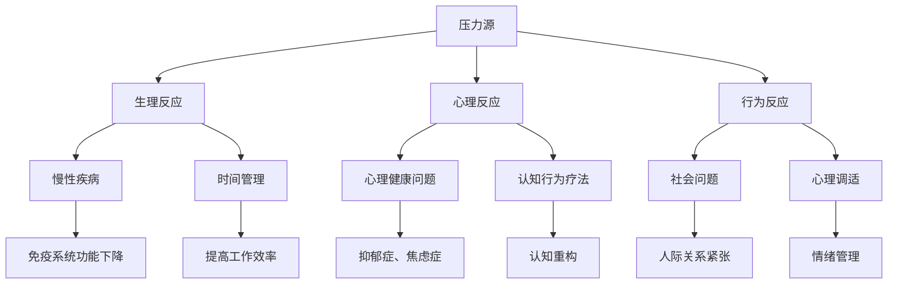

                 

### 文章标题

# 管理者压力调节：保持工作生活平衡

### 关键词

- 压力管理
- 工作生活平衡
- 管理者
- 心理调适
- 时间管理
- 健康生活

### 摘要

本文将探讨管理者在高压工作环境中如何实现工作与生活的平衡，从而有效调节压力。文章首先介绍了压力管理的核心概念，分析了工作压力的来源和影响。接着，提出了多种策略和方法，包括个人时间管理技巧、心理调适与情绪管理、健康生活方式等，帮助管理者建立平衡的工作生活模式。文章还通过实际案例和最佳实践分享，提供了实用的操作指南，旨在帮助管理者在繁忙的职场中找到心灵的宁静与生活的满足。

## 引言

在现代职场中，管理者常常面临巨大的工作压力和责任。他们不仅要应对日常的业务运营，还要管理团队、制定战略、解决问题，甚至承担决策失误带来的后果。这种高压环境可能导致身心疲惫，影响工作效率和健康。因此，管理者如何调节压力，保持工作生活平衡，成为一个至关重要的话题。

本文旨在探讨管理者压力调节的策略和方法，帮助他们应对职场压力，实现工作与生活的和谐统一。文章将从压力管理的核心概念入手，分析工作压力的来源和影响，然后提出多种调节压力的策略，包括时间管理、心理调适、健康生活方式等。通过实际案例和最佳实践分享，本文将为管理者提供实用的操作指南，帮助他们找到适合自己的压力调节方式，从而提高生活质量和工作效率。

## 压力管理的核心概念

### 压力的定义

压力（Stress）是一个广泛使用的心理学概念，通常指个体在面对环境要求或挑战时产生的身心紧张状态。这种紧张状态可能由外部压力源（例如工作压力、家庭问题、经济压力等）或内部因素（如焦虑、恐惧、挫折等）引起。压力的本质是对变化的适应需求，即个体需要应对新情况或挑战时产生的心理和生理反应。

### 压力的类型

压力可以分为以下几种类型：

1. **短期压力**：这种压力通常是暂时的，可能由突发事件或特定情境引起，如会议、考试、突发事故等。短期压力可能导致焦虑、紧张、失眠等症状，但通常不会对身心健康产生长期影响。

2. **长期压力**：这种压力持续较长时间，可能由长期的工作压力、家庭矛盾或健康问题引起。长期压力可能导致慢性疾病、免疫系统功能下降、心理健康问题等。

3. **心理压力**：这种压力主要涉及心理层面，如焦虑、恐惧、挫折等。心理压力可能导致情绪障碍、心理健康问题，如抑郁症、焦虑症等。

4. **生理压力**：这种压力涉及生理层面，如高血压、心脏病、免疫系统功能下降等。生理压力可能由长期的心理压力或生活方式不良引起。

### 压力的影响

压力对个体的影响是多方面的，包括生理、心理和社会三个方面：

1. **生理影响**：长期压力可能导致一系列生理问题，如高血压、心脏病、消化系统问题、免疫系统功能下降等。生理反应包括心率加快、血压升高、肌肉紧张等。

2. **心理影响**：压力可能导致心理问题，如焦虑、抑郁、情绪波动、注意力不集中等。长期压力还可能导致心理健康问题，如精神障碍、自杀倾向等。

3. **社会影响**：压力可能影响个体的社会关系，如家庭关系、朋友关系、职场关系等。长期压力可能导致人际关系紧张、社会支持系统削弱，从而影响个体的整体生活质量。

### 压力管理的核心概念

压力管理（Stress Management）是指通过一系列策略和方法，帮助个体应对压力，减轻压力带来的负面影响。核心概念包括：

1. **认知行为疗法**：这种疗法通过改变个体的认知模式和行为习惯，帮助个体更好地应对压力。例如，通过认知重构，个体可以更理性地看待压力事件，从而减少焦虑和紧张。

2. **心理调适**：心理调适是指通过心理技巧和策略，帮助个体调节情绪和心理状态。例如，冥想、放松训练、情绪管理等。

3. **时间管理**：时间管理是指通过合理安排时间，提高工作效率，减少不必要的压力。例如，制定日程计划、设定优先级、避免拖延等。

4. **健康生活方式**：健康生活方式包括健康的饮食、适量的运动、充足的睡眠等。这些健康习惯可以帮助个体提高免疫力，增强抗压能力。

### 核心概念之间的关系架构

以下是一个用Mermaid绘制的压力管理核心概念关系架构图：

通过这个关系架构图，我们可以更清晰地看到压力管理的各个方面及其相互之间的关系。

## 工作与生活的平衡策略

### 工作与生活平衡的重要性

工作与生活的平衡（Work-Life Balance）是指在工作时间和个人生活时间之间保持适当的比例，从而实现个人在工作、家庭、娱乐和自我发展等方面的需求。对管理者而言，工作与生活的平衡尤为重要，因为他们的工作往往涉及更多的责任和压力。以下是一些工作与生活平衡的重要性：

1. **提高工作效率**：当管理者能够合理安排工作时间和个人时间时，他们可以更专注地处理工作任务，提高工作效率。

2. **减少压力**：工作与生活的平衡可以帮助管理者减少工作压力，从而降低身心疲劳和心理负担。

3. **增强健康**：良好的工作与生活平衡有助于管理者保持健康的生活方式，如健康的饮食、适量的运动和充足的睡眠，从而提高身体素质和免疫力。

4. **改善家庭关系**：工作与生活的平衡可以帮助管理者花更多的时间与家人相处，增强家庭关系，减少家庭矛盾。

5. **提升生活质量**：工作与生活的平衡使管理者能够更好地平衡工作和个人生活，从而提升整体生活质量。

### 个人角色定位与目标设定

为了实现工作与生活的平衡，管理者首先需要明确自己的角色和目标。以下是一些关键步骤：

1. **自我评估**：管理者应该评估自己的工作职责、个人能力和兴趣爱好，明确自己在工作和生活中的角色。

2. **设定目标**：设定明确的短期和长期目标，这些目标应该与个人角色相一致。目标应该具体、可衡量、可实现、相关且有时间限制（SMART原则）。

3. **角色平衡**：确保工作角色和个人角色之间的平衡，避免某一角色占据过多时间和精力。

### 工作生活平衡的具体策略

以下是一些实用的策略，帮助管理者实现工作与生活的平衡：

1. **时间管理**：
   - 制定日程计划：合理安排每天的工作和生活时间，确保两者有足够的分隔。
   - 设定优先级：确定哪些工作任务最紧急和最重要，优先处理。
   - 避免拖延：及时处理工作任务，避免拖延导致压力积累。

2. **有效沟通**：
   - 与上级和同事保持良好的沟通，明确工作期望和职责分工。
   - 与家人和朋友保持沟通，及时分享工作和生活中的压力和困扰。

3. **心理调适**：
   - 进行心理调适训练，如冥想、放松训练、情绪管理等。
   - 寻求心理咨询，当压力和情绪问题无法自行解决时。

4. **健康生活**：
   - 保持健康的饮食和适量的运动，增强身体素质。
   - 确保有充足的睡眠，避免疲劳积累。

5. **休息与娱乐**：
   - 定期安排休息和娱乐时间，放松身心。
   - 参与兴趣爱好，丰富个人生活。

6. **工作弹性**：
   - 尽量争取工作时间的弹性，如远程办公、弹性工作时间等。
   - 与上级和同事协商，确保工作与个人生活的平衡。

### 个人案例分享

以下是一个管理者的个人案例，展示如何通过工作与生活平衡策略实现压力调节：

**案例**：李明是一位公司的项目经理，经常需要处理复杂的任务和紧张的项目进度。为了实现工作与生活的平衡，他采取了以下策略：

1. **时间管理**：他制定了详细的日程计划，每天安排固定的工作时间和个人时间。他使用时间管理工具，如待办事项列表和日历，确保工作任务的优先级和进度。

2. **有效沟通**：他与团队成员保持定期沟通，明确工作目标和职责分工。他定期与上级讨论项目进展和压力状况，寻求支持和建议。

3. **心理调适**：他每天进行冥想和深呼吸练习，帮助自己放松身心。当他感到压力过大时，他会寻求心理咨询师的帮助。

4. **健康生活**：他保持健康的饮食和适量的运动，每天晚上保证充足的睡眠。他还定期参与跑步和瑜伽等运动，保持身心健康。

5. **休息与娱乐**：他每周安排至少一天的时间用于休息和娱乐，如与家人朋友聚会、观看电影、阅读等。这些活动帮助他缓解压力，保持积极心态。

通过这些策略，李明成功实现了工作与生活的平衡，减轻了工作压力，提高了生活质量。

### 实际操作步骤

以下是一些具体的操作步骤，帮助管理者实现工作与生活平衡：

1. **评估当前状况**：首先，管理者应该评估自己的当前工作与生活状况，了解自己在哪些方面存在压力和不平衡。

2. **设定目标**：基于评估结果，设定明确的短期和长期目标，确保这些目标与个人角色和生活需求相一致。

3. **制定日程计划**：制定详细的日程计划，合理安排工作时间和个人时间。确保每天有足够的休息和娱乐时间。

4. **设定优先级**：确定哪些工作任务最紧急和最重要，优先处理。避免将所有任务同等对待，导致时间管理不当。

5. **学习时间管理技巧**：掌握时间管理技巧，如时间块、四象限时间管理法、番茄工作法等。这些技巧可以帮助更高效地管理时间。

6. **培养健康习惯**：保持健康的饮食、适量的运动和充足的睡眠。这些健康习惯有助于提高身体素质和抗压能力。

7. **寻求支持**：与上级和同事保持良好的沟通，寻求他们的支持和理解。同时，寻求家人和朋友的支持，共同应对工作与生活的压力。

8. **定期反思与调整**：定期反思自己的工作与生活状况，根据实际情况调整日程计划和目标。保持灵活性，根据需求进行调整。

通过以上操作步骤，管理者可以逐步实现工作与生活的平衡，有效调节压力，提高生活质量和工作效率。

## 个人时间管理的技巧

### 时间管理的重要性

时间管理是管理者实现工作与生活平衡的关键因素之一。有效的时间管理不仅能提高工作效率，还能减少不必要的压力，为个人生活腾出更多时间。以下是一些时间管理的重要性：

1. **提高工作效率**：通过合理安排时间，管理者可以更高效地完成任务，减少拖延和重复工作，从而节省时间。

2. **减少压力**：有效的时间管理可以帮助管理者避免因时间紧迫而导致的焦虑和压力，提高工作满意度。

3. **增强计划性**：时间管理使管理者能够更好地规划未来，提前预测潜在问题，从而采取预防措施。

4. **提高生活质量**：合理的时间管理使管理者能够更好地平衡工作和个人生活，从而提高生活质量。

### 常见时间管理工具

以下是一些常见的时间管理工具：

1. **日历应用**：如Google Calendar、Outlook Calendar等，可以帮助管理者制定日程计划，提醒重要事件。

2. **待办事项列表**：如Trello、Asana等，用于记录和跟踪任务进度，确保任务按时完成。

3. **时间块**：将一天的时间分成不同的时间块，每个时间块专注于一项任务。这种方法有助于提高专注度和效率。

4. **四象限时间管理法**：根据任务的紧急性和重要性，将任务分为四个象限，依次处理。这种方法帮助管理者优先处理重要但不紧急的任务。

5. **番茄工作法**：将工作时间分为25分钟的工作周期，每个周期后休息5分钟。这种方法有助于提高专注度，减少疲劳。

### 时间管理技巧

以下是一些实用的时间管理技巧：

1. **设定明确的目标**：在开始一天的工作前，设定清晰的目标，明确要完成的任务和优先级。

2. **避免拖延**：及时处理任务，避免将任务留到最后一刻。使用番茄工作法等技巧，提高工作专注度。

3. **定期检查和调整**：每天或每周定期检查日程计划，根据实际情况进行调整。这有助于保持时间管理的灵活性。

4. **学会拒绝**：当工作任务过多时，学会拒绝不重要的任务，专注于关键任务。

5. **灵活应对变化**：时间管理不是一成不变的，需要根据实际情况进行调整。学会灵活应对变化，保持时间管理的有效性。

### 个人时间管理计划

以下是一个个人时间管理计划的示例：

1. **每日计划**：
   - 早上7:00-8:00：准备工作和早餐
   - 8:00-9:30：处理邮件和待办事项
   - 9:30-12:00：专注于最重要的工作任务
   - 12:00-13:00：午餐和休息
   - 13:00-15:00：继续处理工作任务
   - 15:00-15:30：休息和放松
   - 15:30-18:00：处理剩余工作任务
   - 18:00-19:00：下班准备和放松
   - 19:00-20:00：家庭时间
   - 20:00-21:00：锻炼和晚餐
   - 21:00-22:00：个人学习和休闲

2. **每周计划**：
   - 每周至少安排一天的全天休息日，用于放松和娱乐。
   - 每周定期回顾和调整时间管理计划，确保计划与实际情况相符。

通过以上时间管理计划，管理者可以更好地平衡工作与生活，提高工作效率和生活质量。

## 心理调适与情绪管理

### 认知行为疗法

认知行为疗法（Cognitive Behavioral Therapy，CBT）是一种广泛应用于心理疾病治疗的心理治疗方法，其核心是通过改变个体的认知模式来调节情绪和行为。对于管理者而言，CBT是一种非常有效的心理调适工具，可以帮助他们应对工作压力和情绪问题。

#### 原理与步骤

1. **认知重构**：认知行为疗法的第一步是识别和改变消极的认知模式。管理者可以通过日记、反思等方式，识别自己消极的思维模式，如过度担忧、自我否定等。然后，通过认知重构，将这些消极思维转化为更积极、理性的认知。

2. **行为激活**：认知行为疗法还强调行为激活，即通过改变行为来调节情绪。管理者可以通过参与社交活动、运动、兴趣爱好等方式，增加积极的体验，从而改善情绪。

3. **技能训练**：CBT还包含一系列技能训练，如应对策略训练、情绪调节训练等。管理者可以通过这些训练，学会更有效地应对压力和负面情绪。

#### 实用技巧

1. **识别消极思维**：定期记录自己的思维和行为，识别消极思维模式。

2. **认知重构**：对消极思维进行重构，例如，将“我无法完成任务”重构为“我可以一步一步完成任务”。

3. **行为激活**：安排时间进行社交活动、运动和兴趣爱好，增加积极的体验。

4. **技能训练**：定期参与情绪调节训练，如冥想、放松训练等。

### 冥想与放松技巧

冥想和放松技巧是管理者调节情绪和压力的有效方法。以下是一些实用的冥想与放松技巧：

#### 冥想

1. **呼吸冥想**：通过深呼吸来放松身心，减少焦虑和压力。

2. **正念冥想**：专注于当下的感受，不加判断地接受自己的情绪和思想。

3. **指导性冥想**：通过倾听指导性冥想音频，放松身心，减少压力。

#### 放松技巧

1. **渐进性肌肉放松**：逐步放松身体各个部位的肌肉，从头部到脚部，减少紧张和压力。

2. **深呼吸放松**：通过深呼吸，减少焦虑和压力，放松身心。

3. **放松音乐**：听放松音乐，帮助身心放松，减少压力。

### 情绪管理技巧

情绪管理是管理者调节压力的重要方面。以下是一些实用的情绪管理技巧：

1. **情绪识别**：了解自己的情绪，学会识别和表达自己的情绪。

2. **情绪调节**：通过认知重构和放松技巧，调节负面情绪，如焦虑、愤怒等。

3. **情绪表达**：学会健康地表达情绪，避免情绪压抑。

### 实际案例

以下是一个管理者的实际案例，展示了如何通过心理调适与情绪管理技巧调节压力：

**案例**：张伟是一位公司的项目经理，工作压力大，常常感到焦虑和紧张。为了调节压力，他采取了一系列心理调适与情绪管理技巧：

1. **认知重构**：张伟学会了识别自己的消极思维，并将其重构为更积极的思维。例如，他将“我无法完成任务”重构为“我可以一步一步完成任务”。

2. **正念冥想**：每天晚上，张伟都会进行10分钟的呼吸冥想，帮助自己放松身心。

3. **放松音乐**：在工作间隙，张伟会听放松音乐，帮助自己缓解压力。

4. **情绪表达**：张伟学会了健康地表达情绪，与同事和家人分享自己的压力和情绪，寻求支持和理解。

通过这些技巧，张伟成功调节了压力，提高了生活质量和工作效率。

### 实际操作步骤

以下是一些具体的操作步骤，帮助管理者实现心理调适与情绪管理：

1. **识别消极思维**：定期记录自己的思维和行为，识别消极思维模式。

2. **认知重构**：对消极思维进行重构，将其转化为更积极、理性的认知。

3. **正念冥想**：每天安排一段时间进行呼吸冥想或正念冥想，放松身心。

4. **放松技巧**：定期进行渐进性肌肉放松、深呼吸放松等放松技巧，减少紧张和压力。

5. **情绪表达**：学会健康地表达情绪，与同事和家人分享压力和情绪。

6. **求助专业心理咨询**：当情绪问题无法自行解决时，寻求专业心理咨询师的帮助。

通过以上操作步骤，管理者可以逐步实现心理调适与情绪管理，有效调节压力，提高生活质量和工作效率。

## 健康生活与压力调节

### 健康生活的重要性

健康生活是管理者实现工作与生活平衡的关键因素之一。良好的健康习惯不仅有助于提高身体素质，还能增强抗压能力，从而有效调节压力。以下是一些健康生活的重要性：

1. **提高身体素质**：良好的健康习惯，如合理的饮食、适量的运动和充足的睡眠，可以提高身体素质，增强抵抗力。

2. **增强抗压能力**：健康的身体和心理状态有助于管理者更好地应对工作压力，减少焦虑和疲劳。

3. **改善生活质量**：健康的生活习惯使管理者能够更好地平衡工作与个人生活，从而提高整体生活质量。

4. **减少疾病风险**：良好的健康习惯可以降低慢性疾病的风险，如心脏病、高血压、糖尿病等。

### 饮食与压力调节

饮食在压力调节中扮演着重要角色。以下是一些关键点：

1. **均衡饮食**：摄入丰富的营养，确保身体获得所需的各种维生素和矿物质。多吃新鲜蔬菜、水果、全谷物和高质量蛋白质。

2. **减少刺激性食物**：避免摄入过多的咖啡因和糖分，这些物质可能导致焦虑和兴奋，加重压力。

3. **定时进食**：保持规律的饮食时间，避免暴饮暴食或饥饿感。

4. **增加抗压食物**：一些食物具有天然的抗压作用，如深海鱼类、坚果、蓝莓等。这些食物富含Omega-3脂肪酸、维生素C和抗氧化物质，有助于缓解压力。

### 运动与压力调节

适量的运动是调节压力的有效方法。以下是一些关键点：

1. **定期锻炼**：每周至少进行150分钟的中等强度运动，如快走、骑自行车、游泳等。这有助于释放压力，提高心情。

2. **选择喜欢的运动**：选择自己喜欢的运动项目，如瑜伽、跑步、健身等，这样可以更容易坚持。

3. **避免过度锻炼**：避免长时间高强度的锻炼，这可能导致身体疲劳和伤害。

4. **结合有氧和无氧运动**：有氧运动如跑步、游泳等有助于提高心肺功能，无氧运动如举重、瑜伽等有助于增强肌肉力量和灵活性。

### 睡眠与压力调节

充足的睡眠对于压力调节至关重要。以下是一些关键点：

1. **保持规律的睡眠时间**：每天保持相同的睡眠时间，有助于调整生物钟，提高睡眠质量。

2. **创造良好的睡眠环境**：保持睡眠环境安静、舒适和黑暗。避免在睡前使用电子设备，如手机和电脑，以减少光线和蓝光干扰。

3. **减少咖啡因和酒精摄入**：咖啡因和酒精可能会干扰睡眠，导致失眠。

4. **放松身心**：在睡前进行放松活动，如冥想、深呼吸、温暖的洗澡等，有助于放松身心，提高睡眠质量。

### 实践案例

以下是一个管理者的实践案例，展示如何通过健康生活调节压力：

**案例**：李女士是一位公司的销售经理，工作压力大，经常感到疲劳和焦虑。为了调节压力，她采取了一系列健康生活措施：

1. **饮食**：李女士每天保持均衡的饮食，摄入丰富的营养。她还减少了咖啡因和糖分的摄入，增加了抗压食物的摄入。

2. **运动**：每周，李女士都会安排两次瑜伽和三次快走。她发现运动不仅帮助她释放压力，还提高了她的睡眠质量。

3. **睡眠**：李女士每天晚上保持相同的睡眠时间，并在睡前进行深呼吸和冥想，以放松身心。

通过这些健康生活措施，李女士成功调节了压力，提高了生活质量和工作效率。

### 实际操作步骤

以下是一些具体的操作步骤，帮助管理者通过健康生活调节压力：

1. **均衡饮食**：每天摄入丰富的营养，减少刺激性食物的摄入。

2. **定期锻炼**：每周进行适量的运动，选择自己喜欢的运动项目。

3. **保持充足的睡眠**：每天保持规律的睡眠时间，创造良好的睡眠环境。

4. **放松身心**：在睡前进行放松活动，如冥想、深呼吸、温暖的洗澡等。

5. **定期体检**：定期进行体检，确保身体健康。

通过以上操作步骤，管理者可以逐步建立健康的习惯，有效调节压力，提高生活质量和工作效率。

## 压力调节的实践案例

### 案例一：成功的管理者压力调节实践

**背景**：王先生是一家大型企业的部门经理，负责管理数十名员工，工作繁忙且压力巨大。长期的工作压力导致他出现了失眠、焦虑等症状，严重影响了工作和生活。

**策略与方法**：
1. **时间管理**：王先生开始使用时间管理工具，如日历应用和待办事项列表，合理安排工作和个人时间，确保有足够的休息和娱乐时间。
2. **心理调适**：他定期进行冥想和深呼吸训练，减少焦虑和压力。同时，他寻求心理咨询师的帮助，学习认知行为疗法，改善自己的思维模式。
3. **健康生活**：王先生调整了饮食，增加了运动，每天晚上保持充足的睡眠。

**结果**：经过一段时间的努力，王先生的压力得到了显著缓解，失眠和焦虑症状消失，工作效率和工作满意度显著提高。

### 案例二：家庭支持在压力调节中的作用

**背景**：李女士是一位单亲妈妈，同时也是一家初创公司的创始人。她不仅要应对繁重的工作，还要照顾年幼的孩子，压力巨大。

**策略与方法**：
1. **家庭支持**：李女士的家人和朋友在压力调节中起到了关键作用。他们提供了情感支持和实际帮助，如照顾孩子、分担家务等。
2. **工作与家庭平衡**：李女士制定了明确的工作和家庭时间表，确保有足够的时间陪伴孩子，同时保持工作效率。
3. **情绪表达**：李女士学会了健康地表达情绪，与家人和朋友分享自己的压力和困扰。

**结果**：通过家庭支持和工作与家庭平衡策略，李女士的压力得到了有效调节，家庭关系更加和谐，工作效率和幸福感显著提高。

### 案例三：利用团队协作缓解压力

**背景**：张先生是一家大型企业的项目经理，负责多个重要项目的进度和质量。工作量大，任务紧急，压力巨大。

**策略与方法**：
1. **团队协作**：张先生鼓励团队成员积极参与项目规划和管理，共同分担工作压力。
2. **任务分解**：他将大任务分解为小任务，合理分配给团队成员，确保任务按时完成。
3. **沟通与反馈**：张先生定期与团队成员沟通，了解他们的工作进展和压力状况，提供支持和帮助。

**结果**：通过团队协作和任务分解，张先生的工作压力得到了显著缓解，项目进度和质量得到了保证，团队士气和工作氛围显著改善。

### 实践总结

以上案例展示了不同情境下管理者调节压力的有效策略和方法。无论是个人时间管理、心理调适、健康生活，还是家庭支持、团队协作，这些策略都为管理者提供了实用的操作指南，帮助他们应对职场压力，实现工作与生活的平衡。

## 最佳实践 Tips

### 1. 时间管理最佳实践

- **关键点**：合理安排工作和个人时间，确保有足够的休息和娱乐时间。
- **技巧**：使用日程计划和待办事项列表，设定明确的优先级，避免拖延。
- **应用场景**：每天早上制定日程计划，优先处理最重要和最紧急的任务。

### 2. 心理调适最佳实践

- **关键点**：学会认知行为疗法，通过改变思维模式调节情绪。
- **技巧**：定期进行冥想、深呼吸训练，寻求专业心理咨询帮助。
- **应用场景**：在感到焦虑或压力过大时，进行正念冥想或情绪调节训练。

### 3. 健康生活最佳实践

- **关键点**：保持良好的饮食习惯、适量运动和充足睡眠。
- **技巧**：定期进行体检，增加抗压食物的摄入，选择喜欢的运动项目。
- **应用场景**：每天进行适量的运动，如快走、跑步或瑜伽，保持健康的饮食习惯。

### 4. 家庭支持最佳实践

- **关键点**：建立良好的家庭支持系统，确保家庭成员之间相互理解和支持。
- **技巧**：定期与家人沟通，分享压力和困扰，寻求他们的支持和帮助。
- **应用场景**：在压力较大时，与家人和朋友分享自己的情绪，获得他们的理解和支持。

### 5. 团队协作最佳实践

- **关键点**：建立高效的团队协作机制，共同分担工作压力。
- **技巧**：合理分配任务，定期沟通，提供支持和反馈。
- **应用场景**：在项目进度紧张时，与团队成员共同讨论解决方案，分工合作，确保任务按时完成。

## 文章小结

本文详细探讨了管理者如何通过多种策略和方法调节压力，实现工作与生活的平衡。文章首先介绍了压力管理的核心概念，分析了工作压力的来源和影响。接着，提出了个人时间管理技巧、心理调适与情绪管理、健康生活方式等策略，帮助管理者有效调节压力。通过实际案例和最佳实践分享，本文为管理者提供了实用的操作指南，旨在帮助他们在繁忙的职场中找到心灵的宁静与生活的满足。

## 注意事项

- **持续性与适应性**：压力调节并非一蹴而就，管理者需要持续地实践和调整策略，以适应不断变化的工作和生活环境。
- **个性化**：不同的管理者可能有不同的压力源和调节方式，需要根据个人情况选择合适的策略。
- **灵活应对**：在面对突发事件和压力时，管理者需要灵活调整策略，保持心态平和。

## 拓展阅读

- **书籍推荐**：
  - 《时间管理的艺术》：David Allan
  - 《如何管理你的压力》：Stress Management：The Complete Guide
  - 《正面管教》：简·尼尔森
- **在线资源**：
  - **时间管理工具**：Google Calendar、Trello、Asana等
  - **冥想与放松资源**：YouTube上的冥想频道、HeadSpace、Headspace等应用程序
  - **健康生活指南**：健康饮食网站、健身应用程序、运动网站等

## 作者信息

作者：AI天才研究院/AI Genius Institute & 禅与计算机程序设计艺术 /Zen And The Art of Computer Programming

