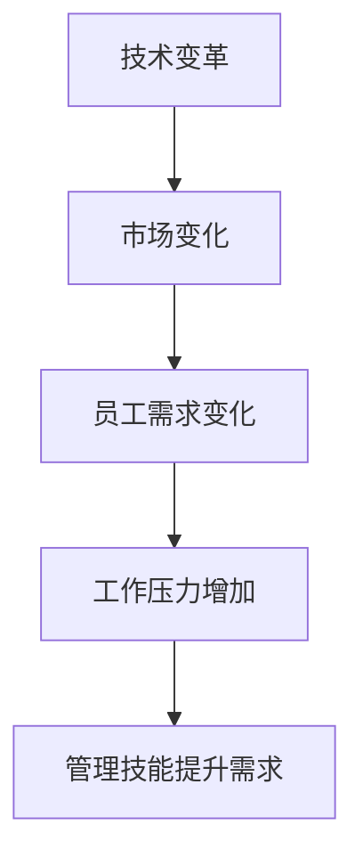
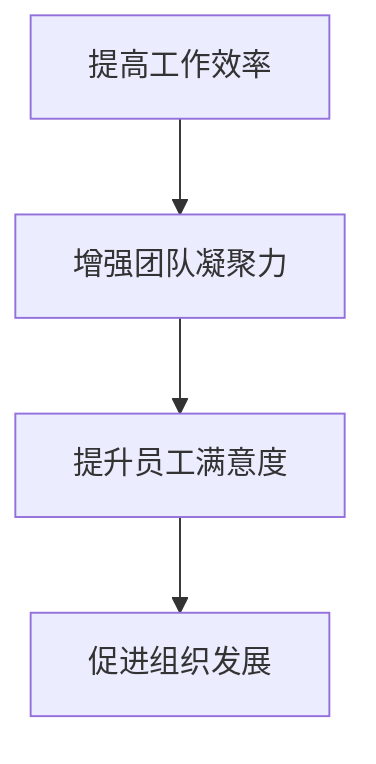
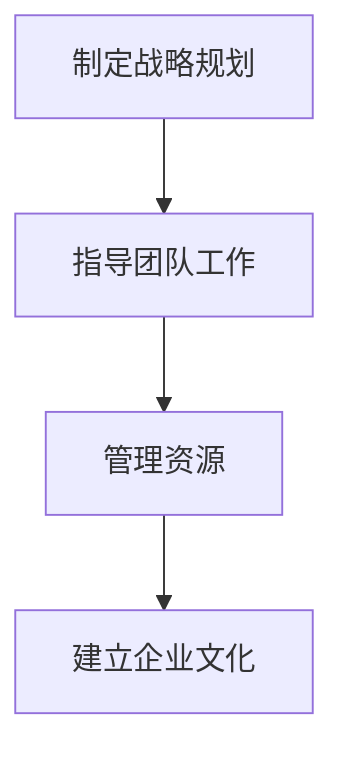
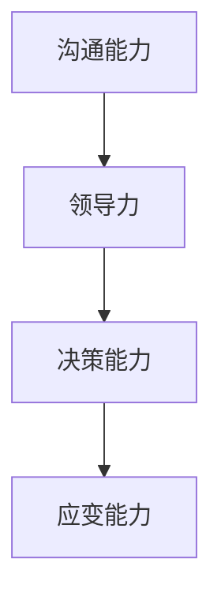

                 

### 文章标题：管理者如何有效管理人员：实用指南

#### 关键词：管理者，管理人员，管理技能，团队管理，领导力，激励

> 摘要：本文旨在为管理者提供一套实用的指南，以帮助他们在工作中更有效地管理团队。文章通过深入剖析人事管理、团队管理和指导反馈等核心管理技能，结合实际案例，为管理者提供了实用的策略和技巧。此外，文章还探讨了管理面临的挑战和解决策略，以及管理者应具备的素质。通过本文，管理者将能够更好地提升自身管理能力，推动团队的发展。

## 第一部分：引言

### 1.1 书籍背景

#### 1.1.1 管理者面临的挑战

在当今快速变化的工作环境中，管理者面临着越来越多的挑战。从技术变革到市场变化，管理者需要不断地适应新的环境和要求。以下是一个简单的流程图，展示了管理者面临的挑战：



#### 1.1.2 为什么需要有效的管理

有效的管理对于团队和组织的发展至关重要。它不仅能够提高工作效率，还能够增强团队的凝聚力。以下是一个简单的Mermaid流程图，展示了有效管理的好处：



### 1.2 管理者的角色

#### 1.2.1 管理者的职责

管理者是企业中至关重要的角色，他们需要承担多种职责，包括但不限于：

1. 制定战略规划
2. 指导团队工作
3. 管理资源
4. 建立企业文化

以下是一个简单的Mermaid流程图，展示了管理者的职责：



#### 1.2.2 管理者的技能与素质

管理者需要具备一系列技能和素质，包括：

1. 沟通能力
2. 领导力
3. 决策能力
4. 应变能力

以下是一个简单的Mermaid流程图，展示了管理者的技能与素质：



## 第二部分：基础管理技能

### 2.1 人事管理

人事管理是管理者的重要职责之一。以下是对人事管理的一些详细探讨。

#### 2.1.1 招聘与选拔

招聘与选拔是人事管理的第一步。以下是招聘流程的伪代码：

```python
def recruitment流程():
    定义职位需求()
    制定招聘计划()
    发布招聘信息()
    收集并筛选简历()
    安排面试()
    评估候选人()
    发出录用通知()
```

#### 2.1.2 员工培训与发展

员工培训与发展是提高员工能力和工作满意度的重要手段。以下是培训流程的伪代码：

```python
def 培训流程():
    制定培训计划()
    选择培训方法()
    组织培训活动()
    跟踪培训效果()
    提供职业发展机会()
```

### 2.2 团队管理

团队管理是管理者的重要职责之一。以下是对团队管理的一些详细探讨。

#### 2.2.1 团队组建与沟通

团队组建与沟通是团队管理的基础。以下是团队组建和沟通的伪代码：

```python
def 团队组建流程():
    确定团队目标()
    选择团队成员()
    建立团队规则()
    组织团队活动()

def 沟通技巧():
    提高倾听能力()
    使用清晰的语言()
    建立有效的沟通渠道()
```

#### 2.2.2 团队激励

团队激励是提高团队士气和工作满意度的重要手段。以下是激励策略的伪代码：

```python
def 激励策略():
    使用内容型激励理论()
    使用过程型激励理论()
    使用强化理论()
    设计激励计划()
```

### 2.3 指导与反馈

指导与反馈是管理者的重要职责之一。以下是对指导与反馈的一些详细探讨。

#### 2.3.1 指导的艺术

指导的艺术包括如何有效地指导员工，以下是一个简单的Mermaid流程图：

```mermaid
graph TB
A[设定明确的目标()] --> B[提供具体的指导()]
B --> C[给予及时的支持()]
C --> D[提供反馈和指导()]
```

#### 2.3.2 反馈的有效性

反馈的有效性对于员工的成长和发展至关重要。以下是一个简单的Mermaid流程图：

```mermaid
graph TB
A[提供及时的反馈()] --> B[使用积极的语言()]
B --> C[提供具体的建议()]
C --> D[提供持续的支持()]
```

## 第三部分：管理挑战与解决策略

### 3.1 领导力

领导力是管理者的重要素质之一。以下是对领导力的一些详细探讨。

#### 3.1.1 领导力的重要性

领导力的重要性体现在多个方面，以下是一个简单的Mermaid流程图：

```mermaid
graph TB
A[影响员工行为()] --> B[推动团队发展()]
B --> C[实现组织目标()]
C --> D[提升组织文化()]
```

#### 3.1.2 领导力培养

领导力的培养需要管理者不断地学习和实践，以下是一个简单的Mermaid流程图：

```mermaid
graph TB
A[自我认知()] --> B[情商培养()]
B --> C[领导力实践()]
C --> D[反馈和改进()]
```

### 3.2 激励与团队士气

激励和团队士气是管理者需要关注的重要方面。以下是对激励和团队士气的一些详细探讨。

#### 3.2.1 激励理论

激励理论包括多种类型，以下是一个简单的Mermaid流程图：

```mermaid
graph TB
A[内容型激励理论()] --> B[过程型激励理论()]
B --> C[强化理论()]
```

#### 3.2.2 增强团队士气

增强团队士气需要管理者采取多种策略，以下是一个简单的Mermaid流程图：

```mermaid
graph TB
A[组织团队活动()] --> B[提供奖励和认可()]
B --> C[解决团队问题()]
C --> D[建立良好的团队氛围()]
```

### 3.3 问题员工管理

问题员工管理是管理者需要面对的挑战之一。以下是对问题员工管理的一些详细探讨。

#### 3.3.1 问题员工识别

问题员工识别需要管理者具备敏锐的观察力和分析能力，以下是一个简单的Mermaid流程图：

```mermaid
graph TB
A[观察员工行为()] --> B[分析员工问题()]
B --> C[识别问题员工()]
```

#### 3.3.2 问题员工管理策略

问题员工管理策略需要管理者采取合适的措施，以下是一个简单的Mermaid流程图：

```mermaid
graph TB
A[了解员工需求()] --> B[提供支持和帮助()]
B --> C[制定改进计划()]
C --> D[监督和反馈()]
```

## 第四部分：总结与反思

### 4.1 管理者成长的路径

管理者成长是一个持续的过程，需要不断地学习和实践。以下是对管理者成长路径的一些详细探讨。

#### 4.1.1 经验积累

经验积累是管理者成长的重要一步，以下是一个简单的Mermaid流程图：

```mermaid
graph TB
A[积累实践经验()] --> B[总结经验教训()]
B --> C[持续学习和改进()]
```

#### 4.1.2 学习与实践

学习与实践是管理者成长的重要手段，以下是一个简单的Mermaid流程图：

```mermaid
graph TB
A[学习管理知识()] --> B[实践管理技能()]
B --> C[反馈和改进()]
```

### 4.2 管理者应具备的素质

管理者应具备一系列的素质，以下是对管理者应具备素质的一些详细探讨。

#### 4.2.1 沟通能力

沟通能力是管理者应具备的重要素质之一，以下是一个简单的Mermaid流程图：

```mermaid
graph TB
A[提高沟通技巧()] --> B[建立信任关系()]
B --> C[有效传达信息()]
```

#### 4.2.2 决策能力

决策能力是管理者应具备的另一重要素质，以下是一个简单的Mermaid流程图：

```mermaid
graph TB
A[收集信息()] --> B[分析问题()]
B --> C[制定决策()]
C --> D[执行决策()]
```

#### 4.2.3 领导能力

领导能力是管理者应具备的核心素质之一，以下是一个简单的Mermaid流程图：

```mermaid
graph TB
A[建立愿景()] --> B[激发员工潜力()]
B --> C[提供支持()]
C --> D[建立团队文化()]
```

## 附录

### 附录 A：常用管理工具与资源

以下是一些常用的管理工具和资源，以供管理者参考：

#### A.1 管理工具介绍

1. 人力资源管理系统：如SAP HR、Oracle HR等
2. 团队协作工具：如Slack、Microsoft Teams等
3. 沟通工具：如Zoom、Google Meet等

#### A.2 管理资源推荐

1. 书籍推荐：《管理的实践》、《领导者的语言》等
2. 网络资源推荐：如哈佛商学院在线课程、LinkedIn Learning等

### 作者信息

作者：AI天才研究院/AI Genius Institute & 禅与计算机程序设计艺术 /Zen And The Art of Computer Programming

