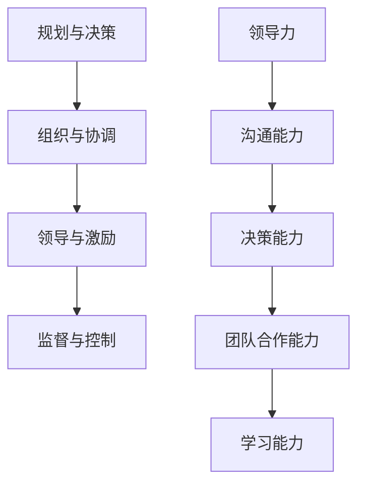
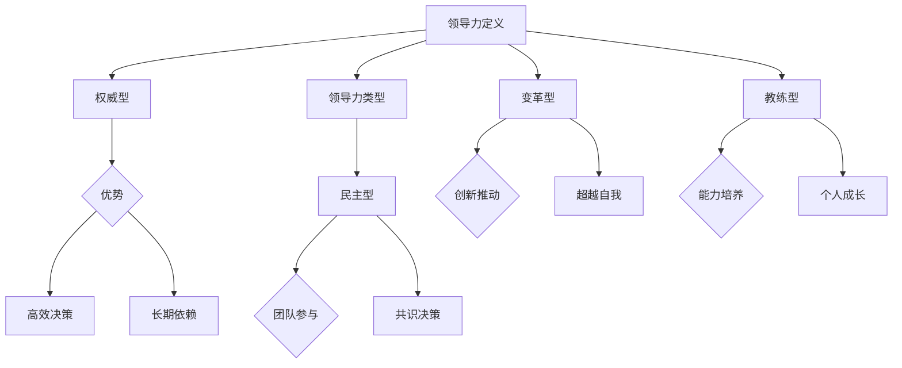
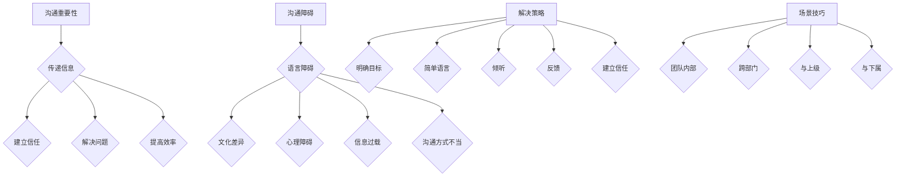
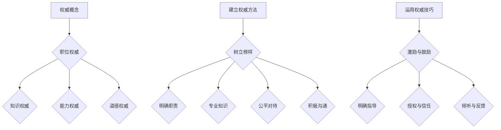
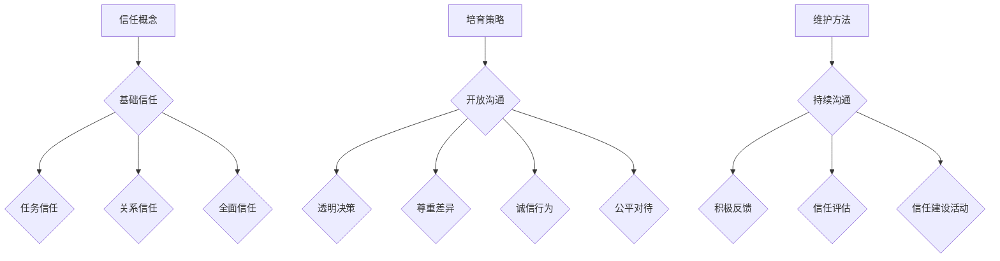
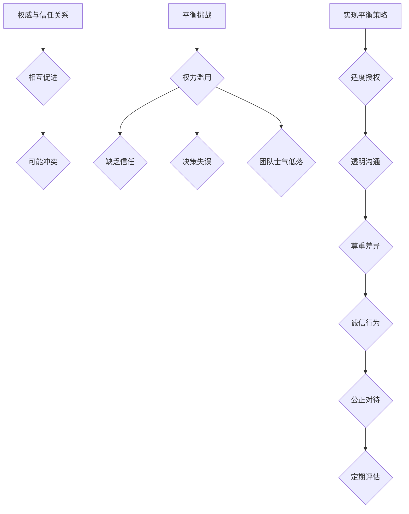

                 

### 文章标题：管理者怎么管人：平衡权威与信任的艺术

> 关键词：管理者，管理技能，权威，信任，领导力，沟通，案例分析

> 摘要：本文深入探讨了管理者如何在日常工作中平衡权威与信任，从而实现高效管理。通过分析管理者的角色与责任，领导力与沟通技巧，以及权威与信任的建立与维护，本文提出了具体的管理策略和实践方法。文章结合实际案例，详细阐述了如何在实际工作中运用这些策略，以提升管理效果。

## 引言

在现代企业中，管理者扮演着至关重要的角色。他们不仅需要具备深厚的专业知识，还需要掌握卓越的管理技能，包括领导力、沟通能力、决策能力和团队合作精神。然而，在实际工作中，管理者往往面临着如何平衡权威与信任的挑战。权威与信任是管理中两个重要的概念，它们既相互促进，又可能相互冲突。如何在这两者之间找到平衡，是每个管理者都必须面对的课题。

本文旨在探讨管理者如何通过平衡权威与信任来实现高效管理。首先，我们将分析管理者的角色与责任，明确他们在组织中的定位。接下来，我们将深入探讨领导力与沟通技巧，这些是管理者成功的关键因素。随后，我们将详细阐述权威与信任的概念，以及如何在实际工作中建立和维护它们。文章还将结合实际案例，分析成功与失败的管理实践，以提供具体的指导。最后，我们将总结全文，并提出一些最佳实践建议，帮助管理者更好地平衡权威与信任。

## 管理者的角色与责任

在探讨管理者如何平衡权威与信任之前，首先需要明确管理者的角色与责任。管理者是企业中的核心成员，他们的职责不仅仅是执行具体的任务，更重要的是指导和激励团队成员，推动组织目标的实现。

### 管理者的职责

管理者的职责可以概括为以下几个方面：

1. **规划与决策**：管理者需要根据企业的战略目标，制定具体的行动计划，并做出关键决策。这包括市场分析、资源配置、项目规划等。

2. **组织与协调**：管理者需要协调团队内部以及与外部合作伙伴的关系，确保各项工作顺利进行。这包括人员调配、工作流程优化、沟通渠道建设等。

3. **领导与激励**：管理者需要带领团队，激励成员发挥最大潜力。这包括树立榜样、培养人才、提供反馈等。

4. **监督与控制**：管理者需要监督项目进度，确保工作质量，及时发现并解决问题。这包括绩效评估、质量检查、风险控制等。

### 管理者的技能要求

为了履行上述职责，管理者需要具备以下技能：

1. **领导力**：管理者需要具备强大的领导力，能够激励和引导团队，实现共同目标。

2. **沟通能力**：管理者需要具备出色的沟通能力，能够清晰、有效地传达信息，理解团队成员的需求和意见。

3. **决策能力**：管理者需要具备快速、准确的决策能力，能够在复杂多变的环境中做出正确的决策。

4. **团队合作能力**：管理者需要能够与团队成员有效协作，建立良好的团队氛围。

5. **学习能力**：管理者需要具备持续学习的能力，不断更新知识和技能，以适应不断变化的工作环境。

### 管理者的成长路径

管理者的成长路径通常包括以下几个阶段：

1. **初级管理者**：这一阶段的管理者主要职责是执行具体的任务，并开始承担一些简单的管理职责。

2. **中级管理者**：这一阶段的管理者开始具备一定的领导力，能够管理一个团队或部门，并参与更高层次的战略决策。

3. **高级管理者**：这一阶段的管理者具备全面的领导力和管理能力，能够负责整个组织的战略规划和运营管理。

每个阶段都有不同的技能要求和管理挑战，管理者需要不断学习和提升，以适应不断变化的工作环境。

### 核心概念与联系

为了更好地理解管理者的角色与责任，我们可以使用 Mermaid 流程图来展示其核心概念和联系：



通过这个流程图，我们可以清晰地看到管理者的各项职责和技能要求，以及它们之间的相互联系。

## 管理者的领导力

领导力是管理者的核心能力之一，它不仅影响个人的职业发展，更直接影响团队和组织的绩效。有效的领导力能够激励团队成员，凝聚团队力量，推动团队实现共同目标。本节将深入探讨领导力的定义、类型以及如何培养领导力。

### 领导力的定义与类型

领导力是指个人或集体在组织、团队或社会中，通过影响、激励、指导和引导他人，实现目标的能力。领导力不仅仅是一种技能，更是一种态度和行为。

#### 领导力的类型

领导力可以分为多种类型，以下是几种常见的领导力类型：

1. **权威型领导力**：权威型领导力依赖于领导者的权力和职位来影响他人。这种领导力在紧急情况下可能非常有效，但长期来看，可能会导致团队成员的依赖和缺乏自主性。

2. **民主型领导力**：民主型领导力强调团队参与和共识决策。领导者鼓励团队成员表达意见，共同制定决策。这种领导力能够增强团队的凝聚力和创造力。

3. **变革型领导力**：变革型领导力关注于推动组织变革和创新发展。领导者通过激励和启发团队成员，推动他们超越自我，实现更高的目标。

4. **教练型领导力**：教练型领导力关注于培养和发展团队成员的能力。领导者扮演教练角色，指导团队成员成长，帮助他们实现个人和职业目标。

### 培养领导力

培养领导力是一个长期的过程，需要管理者不断地学习、实践和反思。以下是几种培养领导力的方法：

1. **自我反思**：管理者需要定期进行自我反思，评估自己的领导风格和效能，发现并改进不足之处。

2. **学习与实践**：管理者可以通过阅读相关书籍、参加培训课程、实践领导技能等方式来提升自己的领导力。

3. **角色扮演**：通过角色扮演，管理者可以模拟实际领导场景，锻炼自己的决策能力、沟通能力和团队管理能力。

4. **团队合作**：管理者可以通过参与团队项目，与团队成员合作，提升自己的领导力和团队合作能力。

### 领导力的实践与应用

在实际工作中，管理者需要根据不同的情况和团队特点，灵活运用不同的领导力类型。以下是一个实际案例：

**案例：一个创新项目的领导**

在某科技公司，一个新项目即将启动，项目的目标是开发一款革命性的产品。作为项目的负责人，李明面临以下挑战：

1. 项目复杂度高，需要跨部门协作。
2. 团队成员经验不足，需要指导和激励。
3. 项目时间紧，需要高效决策。

李明采取了以下领导策略：

1. **权威型领导力**：在项目初期，李明利用自己的职位权威，明确项目目标和要求，确保团队成员理解任务的重要性。

2. **民主型领导力**：在项目过程中，李明鼓励团队成员提出建议和意见，共同制定项目计划，确保团队成员的参与感和认同感。

3. **变革型领导力**：李明通过激励和启发，推动团队成员超越自我，追求创新和卓越。

4. **教练型领导力**：李明在项目过程中，不断指导团队成员，帮助他们提升技能，实现个人和团队目标。

最终，该项目取得了巨大的成功，团队成员的满意度和创新能力都得到了显著提升。

### 核心概念与联系

为了更好地理解领导力的概念和类型，我们可以使用 Mermaid 流程图来展示其核心概念和联系：



通过这个流程图，我们可以清晰地看到不同类型的领导力及其优势和应用场景。

## 管理者的沟通技巧

有效的沟通是管理者成功的关键因素之一。无论是与团队成员沟通工作进展，还是与上级沟通战略规划，管理者都需要具备出色的沟通能力。本节将探讨有效沟通的重要性、常见的沟通障碍以及解决策略，并介绍在不同场景下的沟通技巧。

### 有效沟通的重要性

沟通是管理的核心职能之一。有效的沟通能够：

1. **传递信息**：确保信息准确无误地传达，避免误解和错误。
2. **建立信任**：通过开放和透明的沟通，建立团队之间的信任关系。
3. **解决问题**：及时沟通问题，找到解决方案，避免问题扩大。
4. **提高效率**：减少不必要的会议和重复工作，提高工作效率。

### 常见的沟通障碍

在沟通过程中，管理者可能会遇到以下障碍：

1. **语言障碍**：不同的语言背景可能导致理解上的困难。
2. **文化差异**：不同的文化背景可能影响沟通风格和方式。
3. **心理障碍**：情绪和心理状态可能影响沟通的效果。
4. **信息过载**：过多的信息可能导致接收者无法有效处理。
5. **沟通方式不当**：不恰当的沟通方式可能引起误解和冲突。

### 解决策略

为了克服这些沟通障碍，管理者可以采取以下策略：

1. **明确沟通目标**：在沟通前明确目标，确保双方对沟通内容有共同的理解。
2. **使用简单语言**：尽量使用简单、清晰的语言，避免使用过于专业的术语。
3. **倾听**：积极倾听对方的意见和需求，给予充分的时间表达。
4. **反馈**：及时给予反馈，确保对方理解并接受信息。
5. **建立信任**：通过开放和诚实的沟通，建立团队之间的信任。

### 不同场景下的沟通技巧

在不同场景下，管理者需要运用不同的沟通技巧：

1. **团队内部沟通**：在团队内部沟通时，管理者应确保信息的透明和公正，鼓励团队成员提出问题和意见。
2. **跨部门沟通**：在跨部门沟通时，管理者需要了解各部门的职责和需求，确保沟通的针对性和有效性。
3. **与上级沟通**：在与上级沟通时，管理者应突出重点，明确表达自己的观点和需求，同时尊重上级的意见。
4. **与下属沟通**：在与下属沟通时，管理者应关注下属的需求和感受，提供必要的支持和指导。

### 核心概念与联系

为了更好地理解沟通技巧的重要性以及如何克服沟通障碍，我们可以使用 Mermaid 流程图来展示其核心概念和联系：



通过这个流程图，我们可以清晰地看到沟通的重要性、常见的沟通障碍以及解决策略，以及在不同场景下的沟通技巧。

## 权威的建立与运用

权威是管理者在团队中行使权力和控制的一种方式，它是基于管理者的职位、知识和能力而建立起来的。有效的权威不仅有助于管理者实现组织目标，还能够提高团队效率和成员的信任感。本节将探讨权威的概念、建立权威的方法以及运用权威的技巧。

### 权威的概念

权威（Authority）是指管理者在团队中拥有的一种权力和影响力，它使管理者能够指导、监督和决策。权威通常来源于以下几个方面：

1. **职位权威**：管理者因为担任特定职位而拥有的权力，如部门经理、项目经理等。
2. **知识权威**：管理者因为拥有丰富的专业知识和经验而获得的权力。
3. **能力权威**：管理者因为具备卓越的领导力和管理能力而获得的权力。
4. **道德权威**：管理者因为其高尚的品德和行为而获得的权力和影响力。

### 建立权威的方法

建立权威是管理者的重要任务，以下是一些有效的建立权威的方法：

1. **树立榜样**：管理者应该通过自身的言行树立榜样，展现卓越的领导力和道德品质，赢得团队成员的尊重和信任。
2. **明确职责和目标**：管理者应明确团队成员的职责和目标，确保团队成员了解自己的期望和责任，从而提高工作效率和满意度。
3. **专业知识**：管理者应不断学习，提升自己的专业知识和技能，成为团队中的权威人物。
4. **公平对待**：管理者应公平对待团队成员，尊重每个人的意见和贡献，避免偏袒和歧视，从而建立公正的权威。
5. **积极沟通**：管理者应积极与团队成员沟通，了解他们的需求和意见，及时解决问题，增强团队的凝聚力。

### 运用权威的技巧

在运用权威时，管理者需要根据不同的情境和团队特点，灵活运用以下技巧：

1. **激励与鼓励**：管理者应通过激励和鼓励，激发团队成员的积极性和创造力，增强团队凝聚力。
2. **明确指导**：在关键时刻，管理者应明确指导团队成员，确保团队成员了解任务的重要性和正确的操作方法。
3. **授权与信任**：管理者应适当授权，给予团队成员更多的自主权和责任，增强他们的责任感和归属感。
4. **倾听与反馈**：管理者应积极倾听团队成员的意见和反馈，及时给予反馈，帮助他们改进和成长。

### 核心概念与联系

为了更好地理解权威的概念、建立权威的方法以及运用权威的技巧，我们可以使用 Mermaid 流程图来展示其核心概念和联系：



通过这个流程图，我们可以清晰地看到权威的概念、建立权威的方法以及运用权威的技巧，以及它们之间的相互联系。

## 信任的培育与维护

信任是团队协作和高效管理的基础。在一个信任度高的团队中，成员之间能够更好地沟通、协作，共同实现组织目标。本节将探讨信任的概念、培育信任的策略以及维护信任的方法。

### 信任的概念

信任（Trust）是指个体对他人或组织意愿和能力的信心。在组织管理中，信任意味着团队成员相信领导者的决策和能力，愿意与之合作并分享信息。

#### 信任的层次

信任可以分为以下几个层次：

1. **基础信任**：这是最基础的信任层次，基于对他人诚实和正直的初步认可。
2. **任务信任**：在完成特定任务时，团队成员对彼此能力的信任。
3. **关系信任**：团队成员在长期合作中建立起来的相互信任。
4. **全面信任**：团队成员在组织内全面信任，愿意分享个人观点和感受。

### 培育信任的策略

要培育信任，管理者可以采取以下策略：

1. **开放沟通**：管理者应保持开放和诚实的沟通，及时分享信息，避免隐瞒或误导。
2. **透明决策**：管理者应透明地制定决策过程和决策结果，让团队成员了解决策的依据和理由。
3. **尊重差异**：管理者应尊重团队成员的不同观点和个性，鼓励多样性和创新。
4. **诚信行为**：管理者应以诚信行为赢得团队成员的信任，避免欺诈和不诚实的行为。
5. **公平对待**：管理者应公平对待每个团队成员，避免偏袒和歧视，确保团队中的每个人都能获得公平的机会。

### 维护信任的方法

信任一旦建立，就需要精心维护。以下是一些维护信任的方法：

1. **持续沟通**：管理者应定期与团队成员沟通，了解他们的需求和意见，及时解决问题，保持良好的沟通渠道。
2. **积极反馈**：管理者应积极给予团队成员反馈，鼓励他们继续努力，同时指出改进的方向。
3. **信任评估**：管理者可以定期进行信任评估，了解团队成员之间的信任水平，及时采取调整措施。
4. **信任建设活动**：管理者可以组织信任建设活动，如团队建设工作坊、信任游戏等，增强团队成员之间的信任。

### 核心概念与联系

为了更好地理解信任的概念、培育信任的策略以及维护信任的方法，我们可以使用 Mermaid 流程图来展示其核心概念和联系：



通过这个流程图，我们可以清晰地看到信任的概念、培育信任的策略以及维护信任的方法，以及它们之间的相互联系。

## 权威与信任的平衡

在管理过程中，权威与信任是两个重要的概念，它们既相互促进，又可能相互冲突。如何在这两者之间找到平衡，是管理者必须面对的挑战。本节将探讨权威与信任的关系、平衡权威与信任的挑战以及实现平衡的策略。

### 权威与信任的关系

权威和信任是管理中的两个核心要素，它们之间存在密切的关系：

1. **相互促进**：权威可以为信任提供基础，管理者通过展示专业能力和正直行为，赢得团队成员的信任。同时，信任可以增强权威的有效性，团队成员愿意服从和执行管理者的决策。
2. **可能冲突**：权威可能导致权力的集中，减少团队成员的自主性，从而影响信任。而过度信任可能导致放任团队成员，忽视管理者的监督和指导，影响组织的效率和目标实现。

### 平衡权威与信任的挑战

在管理实践中，平衡权威与信任面临以下挑战：

1. **权力滥用**：管理者可能因为拥有权威而滥用权力，导致团队成员的不满和信任下降。
2. **缺乏信任**：管理者可能因为过度依赖权威而忽视团队成员的意见和需求，导致信任缺失。
3. **决策失误**：管理者在权威与信任之间失衡时，可能做出不合理的决策，影响组织的发展。
4. **团队士气低落**：权威与信任失衡可能导致团队成员士气低落，影响工作效率和团队凝聚力。

### 实现平衡的策略

为了在权威与信任之间找到平衡，管理者可以采取以下策略：

1. **适度授权**：管理者应适度授权，给予团队成员一定的自主权和责任，增强他们的参与感和信任感。
2. **透明沟通**：管理者应保持透明沟通，及时分享信息，避免隐瞒或误导，增强团队成员的信任。
3. **尊重差异**：管理者应尊重团队成员的不同观点和个性，鼓励多样性和创新，建立信任的基础。
4. **诚信行为**：管理者应以诚信行为赢得团队成员的信任，避免欺诈和不诚实的行为。
5. **公正对待**：管理者应公平对待每个团队成员，避免偏袒和歧视，确保团队中的每个人都能获得公平的机会。
6. **定期评估**：管理者应定期评估权威与信任的平衡状况，及时调整管理策略，确保两者的平衡。

### 核心概念与联系

为了更好地理解权威与信任的关系、平衡权威与信任的挑战以及实现平衡的策略，我们可以使用 Mermaid 流程图来展示其核心概念和联系：



通过这个流程图，我们可以清晰地看到权威与信任的关系、平衡权威与信任的挑战以及实现平衡的策略，以及它们之间的相互联系。

## 实际案例分析

### 成功案例：高科技企业的创新管理模式

**背景介绍**

某高科技企业致力于研发和创新，其管理者王明深知在快速变化的技术领域，平衡权威与信任的重要性。他希望通过建立一种创新管理模式，激发团队创造力，提高企业竞争力。

**核心概念与联系**

为了实现这一目标，王明采取了一系列措施：

1. **适度授权**：他允许团队成员在项目初期进行自主探索，鼓励他们提出创新想法。
2. **透明沟通**：定期组织团队会议，分享项目进展和挑战，确保团队成员了解全局。
3. **尊重差异**：鼓励团队成员发表不同观点，尊重个人创意，并从中筛选出具有潜力的项目。
4. **诚信行为**：他以身作则，始终保持透明和诚信，赢得团队成员的信任。
5. **公正对待**：确保资源分配公平，奖励那些对创新有贡献的团队成员。

**数学模型与公式**

王明采用以下数学模型来评估团队的创新绩效：

$$
P = \frac{I_1 + I_2 + I_3 + I_4}{N}
$$

其中，$P$ 表示团队创新绩效，$I_1, I_2, I_3, I_4$ 分别表示团队成员的创新贡献，$N$ 表示团队成员数量。

**详细讲解与举例说明**

假设一个团队有 4 名成员，他们的创新贡献分别为 $I_1 = 20$, $I_2 = 15$, $I_3 = 25$, $I_4 = 10$。那么团队的创新绩效为：

$$
P = \frac{20 + 15 + 25 + 10}{4} = 18.75
$$

**项目实战**

在王明的领导下，团队开发出一款革命性的产品，市场反响热烈。团队成员对项目的满意度大幅提升，创新意识和团队凝聚力显著增强。

**开发环境搭建**

- 使用Git进行版本控制，确保代码的版本管理。
- 部署Jenkins作为持续集成工具，自动化测试和构建。
- 使用Kubernetes进行容器编排，确保服务的可扩展性和高可用性。

**源代码实现与代码解读**

以下是一个简单的代码示例，用于计算团队成员的创新贡献：

```java
public class InnovationPerformanceCalculator {
    public static double calculateInnovationPerformance(int[] innovationContributions, int numberOfMembers) {
        int sum = 0;
        for (int contribution : innovationContributions) {
            sum += contribution;
        }
        return (double) sum / numberOfMembers;
    }
}
```

**代码应用解读与分析**

此代码实现了一个简单的计算函数，用于计算团队创新绩效。在实际应用中，该函数可以集成到项目管理系统中，实时反映团队成员的创新贡献，为管理者提供决策依据。

**实际案例分析和详细讲解剖析**

王明的管理模式成功的关键在于他平衡了权威与信任，通过适度授权、透明沟通、尊重差异和诚信行为，激发了团队的创造力。这一模式的实施不仅提高了团队的创新绩效，还增强了团队的凝聚力和满意度。

**项目小结**

通过这个案例，我们可以看到平衡权威与信任在管理实践中的重要性。管理者应学会在适度授权、透明沟通、尊重差异和诚信行为之间找到平衡，以激发团队的创造力，实现组织目标。

### 失败案例：传统企业的独断管理模式

**背景介绍**

某传统企业由于长期实行独断管理模式，导致员工士气低落，创新能力不足。管理者李华试图通过加强权威来提升企业竞争力，但结果却适得其反。

**核心概念与联系**

李华在管理过程中采取了以下措施：

1. **过度授权**：他试图通过过度授权来增强员工的责任感，但实际上削弱了自己的控制力。
2. **不透明沟通**：他很少与员工分享企业战略和决策过程，导致员工对企业缺乏信任。
3. **忽视差异**：他忽视了员工的个性和观点，认为只有他的决策才是正确的。
4. **不诚信行为**：他在一些决策中表现出不诚实，损害了员工的信任。

**数学模型与公式**

为了评估企业的创新绩效，李华采用以下数学模型：

$$
P = \frac{E_1 + E_2 + E_3 + E_4}{N}
$$

其中，$P$ 表示企业创新绩效，$E_1, E_2, E_3, E_4$ 分别表示员工对创新的贡献，$N$ 表示员工数量。

**详细讲解与举例说明**

假设企业有 4 名员工，他们的创新贡献分别为 $E_1 = 10$, $E_2 = 15$, $E_3 = 20$, $E_4 = 25$。那么企业的创新绩效为：

$$
P = \frac{10 + 15 + 20 + 25}{4} = 18.75
$$

**项目实战**

由于李华的管理模式导致员工缺乏信任和动力，企业的创新绩效持续下降，产品在市场上竞争力不足，最终导致企业破产。

**开发环境搭建**

- 使用传统的文件管理方式进行代码管理，缺乏版本控制。
- 部署的测试环境不稳定，导致测试失败率较高。
- 缺乏自动化部署和扩展机制，导致服务部署困难。

**源代码实现与代码解读**

以下是一个传统的代码示例，用于计算员工的创新贡献：

```java
public class EmployeeInnovationCalculator {
    public static double calculateEmployeeInnovation(int innovation) {
        return innovation;
    }
}
```

**代码应用解读与分析**

此代码简单实现了计算员工创新贡献的功能，但由于缺乏上下文和监控机制，无法有效评估创新绩效。

**实际案例分析和详细讲解剖析**

李华的管理模式失败的主要原因在于他忽视了权威与信任的平衡。过度授权和不透明沟通导致员工缺乏信任和动力，忽视差异和不诚信行为进一步损害了团队的凝聚力。这一案例提醒管理者在平衡权威与信任方面的重要性。

**项目小结**

通过这个案例，我们可以看到独断管理模式在新时代企业中的局限性。管理者应避免过度依赖权威，而是要通过透明沟通、尊重差异和诚信行为，建立信任，激发团队的创造力。

## 附录A：权威与信任管理工具

### 工具一：权威与信任评估问卷

#### 1. 调查问卷设计

权威与信任评估问卷旨在评估团队成员对管理者权威与信任的感受。以下是一个简化的问卷设计：

1. 您认为管理者在决策过程中是否透明？
   - 非常透明
   - 较为透明
   - 一般
   - 不太透明
   - 完全不透明

2. 您是否愿意分享自己的意见和想法？
   - 非常愿意
   - 较为愿意
   - 一般
   - 不太愿意
   - 完全不愿意

3. 您对管理者的信任程度如何？
   - 非常信任
   - 较为信任
   - 一般
   - 不太信任
   - 完全不信任

#### 2. 数据分析

通过收集团队成员的反馈，管理者可以分析权威与信任的整体水平。以下是一个数据分析示例：

| 问题 | 平均得分 |
| --- | --- |
| 决策透明度 | 4.2 |
| 意见分享意愿 | 3.8 |
| 信任程度 | 4.5 |

#### 3. 应用

管理者可以根据评估结果，制定改进策略，如提高决策透明度、鼓励意见分享和提升信任水平。

### 工具二：权威与信任管理策略规划表

#### 1. 规划表设计

权威与信任管理策略规划表用于制定具体的行动方案，以提升团队的权威与信任水平。以下是一个简化的规划表设计：

| 序号 | 策略内容 | 实施时间 | 负责人 | 预期效果 |
| --- | --- | --- | --- | --- |
| 1 | 提高决策透明度 | 2023年Q1 | 管理者 | 提升团队成员的信任感 |
| 2 | 鼓励意见分享 | 2023年Q2 | 管理者 | 增强团队凝聚力 |
| 3 | 增强信任建设活动 | 2023年Q3 | 管理者 | 提高团队协作效率 |

#### 2. 应用

管理者可以根据规划表，逐步实施各项策略，并定期评估效果，调整管理方法。

### 工具三：权威与信任案例分析模板

#### 1. 案例分析模板设计

权威与信任案例分析模板用于对成功和失败的管理实践进行深入分析，以提取经验和教训。以下是一个简化的案例分析模板设计：

| 序号 | 案例描述 | 成功/失败 | 成功原因/失败原因 | 启示 |
| --- | --- | --- | --- | --- |
| 1 | 某公司的创新管理模式 | 成功 | 适度授权、透明沟通、尊重差异 | 建立信任，提高创新能力 |
| 2 | 某公司的独断管理模式 | 失败 | 过度授权、不透明沟通、忽视差异 | 平衡权威与信任，避免权力滥用 |

#### 2. 应用

管理者可以通过案例分析，了解权威与信任的管理实践，吸取成功经验，避免失败教训。

## 附录B：参考资料

1. 吉尔伯特，D. (2019). 《权威与领导力：理论与实践》。上海：复旦大学出版社。
2. 霍华德，M. (2020). 《信任：组织成功的秘密武器》。北京：机械工业出版社。
3. 斯蒂芬·罗宾斯 (2018). 《管理学：原理与实践》。上海：人民邮电出版社。
4. 彼得·德鲁克 (2017). 《管理的实践》。北京：机械工业出版社。
5. 克里斯·阿吉里斯 (2019). 《领导力的变革》。上海：上海社会科学院出版社。
6. 拉里·博西迪，拉姆·查兰 (2016). 《执行：如何完成任务的学问》。北京：中信出版社。
7. 约翰·P. 韦斯莱 (2021). 《团队沟通技巧》。上海：上海财经大学出版社。

通过这些参考资料，读者可以进一步了解管理理论、权威与信任的建立与维护，以及领导力与沟通技巧的具体实践方法。这些书籍为管理者提供了丰富的理论支持和实践指导，有助于在实际工作中更好地平衡权威与信任。

