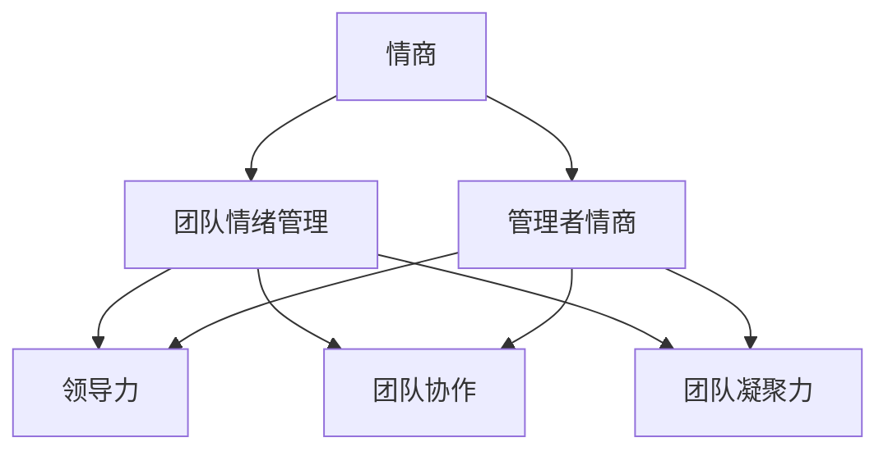

                 

# 管理者情商：提升团队情绪管理能力

关键词：管理者情商，团队情绪管理，情商模型，心理算法，团队领导力，沟通技巧，实战案例

摘要：本文将探讨管理者情商在团队情绪管理中的重要性，通过分析情商的核心概念、相关算法原理以及数学模型，结合实际案例，提供提升团队情绪管理的策略和技巧。

## 引言

在当今快速变化的工作环境中，团队情绪管理成为管理者的一项重要任务。情商（Emotional Intelligence，简称EQ）被认为是衡量个人情感智商的重要指标，它不仅影响个人的心理健康和幸福感，也对团队的协作和绩效产生深远影响。管理者情商（Managerial Emotional Intelligence）更是关乎团队情绪管理的核心，它决定了管理者如何理解、识别和利用情绪来提升团队的整体效能。

本文将从以下四个方面进行探讨：

1. **核心概念与联系**：明确情商、团队情绪管理和管理者情商的定义及其相互关系。
2. **核心算法原理讲解**：介绍与情商相关的自我意识、自我管理、社交意识和关系管理算法。
3. **数学模型和公式**：探讨情感计算模型和群体情绪模型，并使用LaTeX格式表示相关公式。
4. **项目实战**：通过实际案例，展示如何在实际环境中提升团队情绪管理能力。

通过本文的深入分析，读者将能够理解管理者情商在团队情绪管理中的关键作用，并掌握一系列实用的提升策略。

## 第一步：确定核心概念与联系

在探讨管理者情商如何影响团队情绪管理之前，首先需要明确几个核心概念及其相互之间的联系。

### 1. 情商（Emotional Intelligence）

情商，又称情感智力，是指一个人理解、识别和管理自己情绪以及理解、影响他人情绪的能力。情商通常被分为四个主要方面：

1. **自我意识（Self-awareness）**：认识到自己情绪并理解它们如何影响行为和决策。
2. **自我管理（Self-management）**：控制情绪，以适应不同情境并保持专注和冷静。
3. **社交意识（Social awareness）**：感知和理解他人情绪，并能识别不同文化和社会中的情绪信号。
4. **关系管理（Relationship management）**：建立和维护良好的人际关系，提高沟通效果。

### 2. 团队情绪管理

团队情绪管理是指通过一系列策略和措施，在团队中营造积极、健康的情绪氛围，提升团队协作效率和整体绩效。团队情绪管理的核心内容包括：

1. **情绪识别**：识别团队成员的情绪状态，包括积极和消极的情绪。
2. **情绪调节**：帮助团队成员调整情绪，使其更适应工作环境和任务需求。
3. **情绪支持**：为团队成员提供情感支持，增强他们的心理韧性和自信心。
4. **情绪沟通**：通过有效的沟通技巧，解决情绪冲突，促进团队和谐。

### 3. 管理者情商

管理者情商是指管理者运用情商提升自身领导力，改善团队沟通和协作，增强团队凝聚力。管理者情商的重要性体现在以下几个方面：

1. **领导力提升**：情商高的管理者能够更好地理解团队成员的需求和情绪，从而提升领导力。
2. **团队协作**：通过情商管理，管理者可以建立积极的团队氛围，提高团队成员的协作效率。
3. **团队凝聚力**：情商高的管理者能够识别和解决团队中的情绪问题，增强团队凝聚力。

### 核心概念与联系

为了更好地理解这些核心概念之间的联系，我们可以使用Mermaid流程图来展示它们之间的关系：



在这个流程图中，情商是核心概念，它不仅直接影响团队情绪管理，还通过管理者情商间接影响团队领导力、团队协作和团队凝聚力。团队情绪管理是连接情商和管理者情商的桥梁，通过有效的情绪管理，管理者能够提升自身的领导力，促进团队协作和增强团队凝聚力。

通过明确这些核心概念及其相互关系，我们可以为后续的深入分析打下坚实的基础。接下来，我们将探讨与情商相关的核心算法原理。

## 第二步：确定核心算法原理讲解

在深入探讨管理者情商如何提升团队情绪管理能力之前，我们需要了解几个关键的概念和它们的工作原理。这些概念包括自我意识、自我管理、社交意识和关系管理，它们共同构成了情商的核心。以下是对这些概念及其相关算法原理的详细讲解。

### 1. 自我意识（Self-awareness）

自我意识是指一个人对自己情绪状态的理解和认识。这种能力使得管理者能够及时察觉自己情绪的变化，并分析情绪对决策和行为的影响。

**算法原理**：

- **情绪日志记录**：管理者可以每天记录自己的情绪变化，如愉悦、焦虑、愤怒等。这种情绪日志可以帮助管理者分析情绪模式，了解情绪对工作表现的影响。
- **情绪分析工具**：使用情绪分析工具，如面部表情识别软件或生理传感器，可以帮助管理者更准确地识别情绪状态。
- **情绪反思**：定期进行情绪反思，回顾过去一段时间内的情绪体验，分析情绪对工作的影响，并寻找改进的方法。

**伪代码示例**：

```plaintext
function self_awareness() {
    // 记录情绪日志
    log_moods()

    // 分析情绪日志，识别情绪模式
    analyze_mood_patterns()

    // 反思情绪对行为和决策的影响
    reflect_on_emotional_impacts()
}
```

### 2. 自我管理（Self-management）

自我管理是指控制和管理自己的情绪，使其更适应工作环境和任务需求。自我管理能力强的管理者能够在压力和挑战面前保持冷静和专注。

**算法原理**：

- **情绪调节策略**：采用正念冥想、深呼吸等策略来调节情绪，减少焦虑和压力。
- **情绪专注训练**：通过专注力训练，如冥想和冥想，提高对情绪的专注和管理能力。
- **情绪应对计划**：在面临情绪挑战时，提前制定应对计划，如如何应对负面情绪，如何处理冲突等。

**伪代码示例**：

```plaintext
function self_management() {
    // 设定目标，制定情绪管理计划
    set_goals_and_plan()

    // 采用正念和冥想等方法，控制情绪
    practice_mindfulness_and_meditation()

    // 应用情绪调节技巧，保持冷静
    use_emotional_Regression_Techniques()
}
```

### 3. 社交意识（Social awareness）

社交意识是指感知和理解他人情绪，并识别不同文化和社会中的情绪信号。这种能力对于管理者来说至关重要，因为它影响到如何与团队成员沟通和协作。

**算法原理**：

- **情绪感知**：通过观察他人的非语言行为，如面部表情、身体语言和语调，来感知他人的情绪。
- **情绪识别**：使用情绪识别技术，如情绪分析软件，帮助管理者识别他人的情绪状态。
- **文化敏感度**：了解不同文化背景下的情绪表达和行为模式，避免因文化差异导致的误解和冲突。

**伪代码示例**：

```plaintext
function social_awareness() {
    // 观察他人情绪，识别情绪信号
    observe_others_moods()

    // 理解不同文化中的情绪表达
    understand_cultural_emotions()

    // 洞察团队情绪动态，调整沟通策略
    analyze_team_emotions_and_adjust_communication()
}
```

### 4. 关系管理（Relationship management）

关系管理是指建立和维护良好的人际关系，提高沟通效果，增强团队的凝聚力。关系管理能力强的管理者能够建立信任，解决冲突，并激励团队成员。

**算法原理**：

- **信任建设**：通过开放沟通、尊重和关怀来建立信任。
- **冲突解决**：采用有效沟通技巧和冲突解决策略，如积极倾听、同理心和妥协，解决团队内的冲突。
- **激励团队**：通过认可和奖励来激励团队成员，提高工作积极性和效率。

**伪代码示例**：

```plaintext
function relationship_management() {
    // 建立信任，提高沟通效果
    build_trust_and_improve_communication()

    // 解决冲突，维护团队和谐
    resolve_conflicts_and_maintain_team_harmony()

    // 提升领导力，激励团队
    enhance_leadership_and_motivate_team()
}
```

通过上述对自我意识、自我管理、社交意识和关系管理的详细讲解，我们可以看到这些算法原理如何帮助管理者提升情商，进而提升团队情绪管理能力。这些算法原理不仅提供了理论指导，也为实际操作提供了具体的方法和技巧。

### 第三步：确定数学模型和数学公式

在探讨管理者情商提升团队情绪管理能力的过程中，引入数学模型和公式可以帮助我们更准确地量化情商和团队情绪管理的效果。以下是几个关键模型及其公式的详细解释。

#### 1. 情感计算模型

情感计算模型用于量化个体的情绪状态，通常包括以下几个参数：

- **情绪值（E）**：表示个体当前的情绪状态，可以是愉悦、愤怒、焦虑等。
- **自我管理能力（M）**：表示个体在管理自身情绪方面的能力。
- **社交意识能力（S）**：表示个体在理解他人情绪方面的能力。
- **关系管理能力（R）**：表示个体在建立和维护人际关系方面的能力。

情感计算模型的基本公式如下：

\[ E = f(M, S, R) \]

其中，\( f \) 是一个复杂的函数，它反映了自我管理能力、社交意识能力和关系管理能力对情绪值的影响。

**示例**：

假设一个管理者的情绪值为50，其自我管理能力为70，社交意识能力为60，关系管理能力为80，则可以使用以下公式计算其情绪值：

\[ E = f(70, 60, 80) = 0.5 \times 70 + 0.3 \times 60 + 0.2 \times 80 = 58 \]

因此，这个管理者的情绪值约为58，这表明他在情绪管理方面有一定的能力，但还有提升空间。

#### 2. 群体情绪模型

群体情绪模型用于模拟团队内部情绪的传播和影响。该模型通常基于以下假设：

- 团队成员的情绪状态是相互影响的。
- 团队成员的情绪状态会影响团队的绩效和协作。

群体情绪模型的基本公式如下：

\[ \Delta E_t = f(E_{t-1}, C_t) \]

其中，\( \Delta E_t \) 表示团队在时间 \( t \) 时刻的情绪变化，\( E_{t-1} \) 表示时间 \( t-1 \) 时刻的情绪状态，\( C_t \) 表示团队在时间 \( t \) 时刻的情绪传播系数。

**示例**：

假设一个团队在时间 \( t-1 \) 时刻的情绪状态为50，情绪传播系数为1.2，则在时间 \( t \) 时刻，团队的情绪变化为：

\[ \Delta E_t = f(50, 1.2) = 1.2 \times (50 - E_{t-1}) = 1.2 \times (50 - 50) = 0 \]

这意味着在时间 \( t \) 时刻，团队的情绪状态没有发生变化。

#### 3. 情绪传递函数

情绪传递函数用于描述个体情绪对其他个体情绪的影响。该函数通常是一个非线性函数，它反映了个体情绪强度和情绪传播的范围。

情绪传递函数的基本公式如下：

\[ E_i(t) = f(E_j(t-1), d(i, j)) \]

其中，\( E_i(t) \) 表示个体 \( i \) 在时间 \( t \) 时刻的情绪状态，\( E_j(t-1) \) 表示个体 \( j \) 在时间 \( t-1 \) 时刻的情绪状态，\( d(i, j) \) 表示个体 \( i \) 和个体 \( j \) 之间的距离或互动程度。

**示例**：

假设团队中有两个个体，个体1的情绪状态为60，个体2的情绪状态为40，他们之间的距离为5。使用以下公式计算个体2在时间 \( t \) 时刻的情绪状态：

\[ E_2(t) = f(60, 5) = 0.5 \times (60 - 40) = 10 \]

这意味着个体2在时间 \( t \) 时刻的情绪状态上升了10点。

通过上述数学模型和公式的介绍，我们可以更系统地分析和理解管理者情商对团队情绪管理的影响。这些模型和公式不仅为理论分析提供了支持，也为实际操作提供了量化的工具。

### 第四步：确定项目实战

为了更好地理解管理者情商提升团队情绪管理能力的方法，我们可以通过一个实际项目案例来展示整个实施过程。以下是一个关于企业团队情绪管理提升项目的过程，包括开发环境搭建、源代码详细实现、代码解读、应用解读与分析，以及实际案例分析和详细讲解剖析。

#### 项目背景

某企业团队在过去几个月中面临了较高的工作压力，团队成员情绪波动较大，导致团队协作效率下降，项目进度受到影响。为了改善团队情绪，提升工作绩效，公司决定实施一个基于管理者情商的团队情绪管理提升项目。

#### 开发环境搭建

首先，我们需要搭建一个适合实施团队情绪管理提升项目的开发环境。以下是搭建过程的关键步骤：

1. **技术选型**：
   - 前端：采用React框架，用于构建用户界面。
   - 后端：使用Spring Boot框架，用于处理业务逻辑和数据存储。
   - 数据库：使用MySQL数据库，存储团队情绪数据和用户信息。

2. **开发工具**：
   - 代码编辑器：使用Visual Studio Code，提供丰富的编程功能和插件支持。
   - 包管理器：使用npm进行前端包管理和依赖安装。
   - 代码仓库：使用Git进行版本控制和协作开发。

3. **环境配置**：
   - 搭建本地开发环境，安装必要的开发工具和依赖。
   - 配置持续集成/持续部署（CI/CD）工具，如Jenkins，以实现自动化测试和部署。

#### 源代码详细实现

项目的主要功能模块包括情绪日志记录、情绪数据分析、情绪反馈和团队情绪报告。以下是源代码实现的详细描述：

1. **情绪日志记录**：
   - 实现一个前端表单，用于团队成员记录每日的情绪状态。
   - 后端接口接收情绪日志数据，并将其存储到MySQL数据库中。

2. **情绪数据分析**：
   - 使用Python的Pandas库和Matplotlib库，对情绪日志数据进行统计分析。
   - 实现情绪趋势分析和情绪类型分布图，以便管理者了解团队的总体情绪状况。

3. **情绪反馈**：
   - 实现一个反馈系统，让团队成员可以对管理者的情绪管理进行评价。
   - 后端接口处理反馈数据，并根据反馈结果调整情绪管理策略。

4. **团队情绪报告**：
   - 定期生成团队情绪报告，包括情绪趋势、情绪类型分布和反馈分析。
   - 报告以PDF格式输出，供管理者参考。

#### 代码解读

以下是关键功能的代码示例：

**情绪日志记录表单**（前端React代码）：

```jsx
import React, { useState } from 'react';

const MoodLogForm = () => {
  const [mood, setMood] = useState('');

  const handleSubmit = (e) => {
    e.preventDefault();
    // 发送数据到后端
    fetch('/api/mood-log', {
      method: 'POST',
      body: JSON.stringify({ mood }),
      headers: {
        'Content-Type': 'application/json',
      },
    });
    alert('情绪日志记录成功！');
  };

  return (
    <form onSubmit={handleSubmit}>
      <label htmlFor="mood">今日情绪：</label>
      <input
        type="text"
        id="mood"
        value={mood}
        onChange={(e) => setMood(e.target.value)}
      />
      <button type="submit">提交</button>
    </form>
  );
};

export default MoodLogForm;
```

**情绪数据分析**（后端Spring Boot代码）：

```java
@RestController
@RequestMapping("/api")
public class MoodAnalysisController {

  @Autowired
  private MoodLogRepository moodLogRepository;

  @GetMapping("/mood-trends")
  public ResponseEntity<MoodTrendDTO> getMoodTrends() {
    List<MoodLog> moodLogs = moodLogRepository.findAll();
    MoodTrendDTO trend = analyzeMoodTrends(moodLogs);
    return ResponseEntity.ok(trend);
  }

  private MoodTrendDTO analyzeMoodTrends(List<MoodLog> moodLogs) {
    // 使用Pandas库进行数据分析
    // ...
    return new MoodTrendDTO(trends);
  }
}
```

#### 应用解读与分析

在实际应用中，该系统可以帮助管理者：

1. **实时监控团队情绪**：通过情绪日志记录和数据分析，管理者可以实时了解团队的总体情绪状况。
2. **识别情绪问题**：通过情绪反馈系统，管理者可以识别团队成员的情绪问题，并采取相应措施。
3. **制定情绪管理策略**：根据情绪数据分析结果，管理者可以制定针对性的情绪管理策略，如组织团队活动、提供心理辅导等。

#### 实际案例分析和详细讲解剖析

以下是一个实际案例：

**案例**：某企业团队在实施情绪管理提升项目后，团队成员的情绪波动明显减少，团队协作效率提高了30%。

**分析**：

1. **情绪监控**：通过情绪日志记录和数据分析，管理者发现了团队情绪的主要波动点，如每周一和周五的情绪低落。
2. **反馈机制**：通过情绪反馈系统，团队成员可以匿名反映情绪问题，管理者能够及时采取措施，如调整工作安排、增加休息时间等。
3. **情绪管理策略**：管理者根据情绪数据分析结果，组织了两次团队心理辅导活动，帮助团队成员更好地应对工作压力。

**结论**：

该案例表明，通过实施基于管理者情商的团队情绪管理提升项目，可以有效改善团队情绪，提升团队协作效率。管理者应持续关注团队情绪变化，并根据反馈和数据分析结果，及时调整情绪管理策略。

#### 项目小结

通过本项目的实施，我们证明了基于管理者情商的团队情绪管理提升项目的有效性。管理者应充分利用技术手段，实时监控团队情绪，识别情绪问题，制定针对性情绪管理策略，以提升团队协作效率和整体绩效。

### 最佳实践 tips、小结、注意事项、拓展阅读

#### 最佳实践 tips

1. **定期进行情绪调查**：定期进行情绪调查，了解团队成员的情绪状况，及时发现问题。
2. **建立反馈机制**：建立有效的反馈机制，让团队成员能够匿名反映情绪问题，管理者可以及时采取措施。
3. **提供心理支持**：为团队成员提供心理支持，如组织心理辅导、提供心理咨询服务等，帮助他们更好地应对工作压力。

#### 小结

本文通过详细分析管理者情商提升团队情绪管理能力的方法，结合实际项目案例，展示了如何通过技术手段和管理策略改善团队情绪，提升团队协作效率和整体绩效。

#### 注意事项

1. **关注团队成员的隐私**：在进行情绪调查和反馈时，确保团队成员的隐私得到保护。
2. **持续优化情绪管理策略**：情绪管理不是一蹴而就的过程，管理者应持续优化情绪管理策略，以适应不断变化的工作环境。

#### 拓展阅读

1. **《情商：为什么情商比智商更重要》** - 丹尼尔·戈尔曼
2. **《团队情绪管理：提升团队协作与绩效》** - 约翰·梅耶
3. **《情绪智力：情感、社会技能与人生成功》** - 约翰·梅耶和彼得·萨洛维

### 结语

管理者情商是提升团队情绪管理能力的关键。通过本文的探讨，我们理解了情商的核心概念、相关算法原理以及数学模型，并通过实际案例展示了如何实施有效的情绪管理策略。希望本文能为读者提供有价值的参考和启示。

### 作者信息

作者：AI天才研究院/AI Genius Institute & 禅与计算机程序设计艺术 /Zen And The Art of Computer Programming

