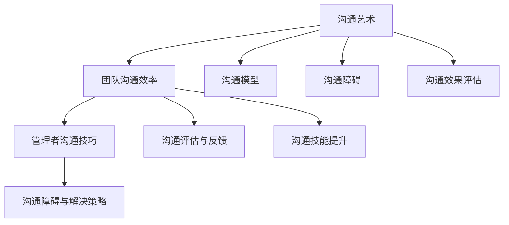

                 

### 文章标题

《管理者沟通艺术：提升团队沟通效率》

---

**关键词**：
- 管理者沟通艺术
- 团队沟通效率
- 沟通技巧与策略
- 沟通障碍与解决
- 沟通评估与反馈

**摘要**：
本文章旨在探讨管理者在提升团队沟通效率方面的重要性。通过详细分析沟通艺术的核心概念、管理者的沟通角色、沟通技巧与策略、案例分析、沟通障碍与解决方法，以及沟通评估与反馈机制，本文为管理者提供了一套系统化的沟通提升方案，旨在优化团队沟通流程，提高工作效率和团队协作质量。文章最后总结全书内容，并提出未来研究方向。

---

**目录大纲**：

1. 引言
2. 管理者沟通角色
3. 沟通技巧与策略
4. 团队沟通案例分析
5. 沟通障碍与解决
6. 沟通评估与反馈
7. 沟通技能提升
8. 结论

---

### 引言

#### 沟通艺术的重要性

沟通是人与人之间传递信息、思想和情感的过程。有效的沟通不仅是日常交流的基本需求，更是实现个人目标、团队协作和组织发展的重要手段。在企业管理中，沟通艺术的重要性尤为突出。一方面，管理者作为团队的领导者和协调者，需要具备出色的沟通能力，以确保信息准确无误地传递，促进团队成员之间的理解和合作。另一方面，良好的沟通能够提高团队的整体工作效率，减少误解和冲突，从而推动组织的持续发展。

#### 管理者沟通角色

管理者在团队沟通中扮演着多重角色，既是信息的传递者，也是沟通的组织者和协调者。具体而言，管理者的沟通职责包括但不限于以下几点：

1. **明确沟通目标**：管理者需要根据团队目标和任务，明确沟通的具体目标，确保团队成员理解并朝着共同目标努力。
2. **建立信任与共识**：管理者应当通过有效的沟通建立团队成员之间的信任，促进共识的形成，减少冲突和误解。
3. **提供信息与支持**：管理者应当及时提供团队所需的各类信息，包括工作进展、资源分配、问题解决方案等，帮助团队成员更好地完成工作。
4. **解决沟通障碍**：管理者需要识别并解决团队沟通中的障碍，如文化差异、信息不对称等，确保沟通渠道畅通无阻。

#### 团队沟通效率对组织绩效的影响

团队沟通效率直接影响到团队的工作效率和整体绩效。高效的沟通能够确保团队成员之间信息传递的准确性和及时性，减少因信息误解或失真而导致的错误和重复工作。此外，良好的沟通有助于激发团队成员的创造力和积极性，提高团队的整体协作能力和创新能力。反之，沟通效率低下则可能导致以下问题：

1. **延误工作进度**：信息传递不及时或错误可能导致项目延误，影响组织目标的实现。
2. **增加沟通成本**：无效或低效的沟通需要额外的资源和时间来纠正错误，增加组织的沟通成本。
3. **降低团队士气**：持续的沟通障碍和冲突会影响团队成员的工作积极性，降低团队士气，影响组织凝聚力。

#### 本书的目的与结构

本书旨在为管理者提供一套系统化的沟通提升方案，帮助他们掌握有效的沟通技巧和策略，提高团队沟通效率。全书分为八个章节，内容涵盖：

1. **引言**：介绍沟通艺术的重要性以及本书的目的。
2. **管理者沟通角色**：讨论管理者在团队沟通中的角色和责任。
3. **沟通技巧与策略**：详细讲解提升沟通效率的各种技巧和策略。
4. **团队沟通案例分析**：通过实际案例展示有效的沟通方法和解决沟通障碍的策略。
5. **沟通障碍与解决**：讨论常见的沟通障碍及解决策略。
6. **沟通评估与反馈**：介绍如何评估沟通效果以及如何给予有效反馈。
7. **沟通技能提升**：提供一些实用的沟通技能提升方法。
8. **结论**：总结全书内容，提出未来研究方向。

通过这八个章节的详细分析，本书希望为管理者提供一套全面、实用的沟通指南，助力他们在实际工作中提升团队沟通效率，推动组织的持续发展。

---

### 第1章：管理者沟通角色

#### 管理者作为沟通者的角色

在组织中，管理者不仅是领导者，更是沟通的中枢。他们负责确保信息在团队内外的有效传递，促进团队成员之间的理解和合作。管理者在沟通中的角色可以分为以下几个方面：

1. **信息的传递者**：管理者需要将高层决策、公司战略、团队目标等信息准确无误地传递给团队成员，确保每个人都了解自己的职责和目标。
2. **沟通的组织者**：管理者负责制定沟通计划和策略，确保团队成员能够通过适当的渠道和方式及时获得所需信息。
3. **沟通的协调者**：管理者需要协调不同部门之间的沟通，解决沟通中的冲突和障碍，确保信息畅通无阻。

#### 团队沟通的职责与责任

管理者的沟通职责不仅限于信息传递，还涉及到以下几个方面：

1. **建立信任与共识**：通过有效的沟通，管理者需要建立团队成员之间的信任，促进共识的形成。这包括在团队中营造开放、透明和诚实的沟通氛围，确保团队成员感受到尊重和认可。
2. **明确目标与期望**：管理者需要与团队成员明确沟通目标，确保每个人都了解自己的职责和期望。通过设定明确的目标，可以减少误解和冲突，提高团队的工作效率。
3. **提供信息与支持**：管理者需要及时提供团队所需的各类信息，包括工作进展、资源分配、问题解决方案等，帮助团队成员更好地完成工作。
4. **解决沟通障碍**：管理者需要识别并解决团队沟通中的障碍，如文化差异、信息不对称等，确保沟通渠道畅通无阻。

#### 管理者与团队成员的沟通

管理者与团队成员之间的沟通是团队成功的关键因素。有效的沟通需要管理者具备以下几个方面的能力和技巧：

1. **倾听技巧**：管理者需要倾听团队成员的意见和建议，理解他们的需求和困惑。通过倾听，管理者可以更好地了解团队成员的想法，提供更有针对性的支持。
2. **提问技巧**：管理者需要通过有效的提问引导团队成员思考和讨论，激发他们的创造力和积极性。提问的技巧包括开放式问题和封闭式问题的合理运用，以及提问时的时机和语气控制。
3. **非言语沟通**：管理者需要通过肢体语言、面部表情和语调等非言语沟通方式，传达自己的情感和态度。有效的非言语沟通可以增强信息的传递效果，减少误解和冲突。
4. **反馈与鼓励**：管理者需要给予团队成员及时的反馈和鼓励，帮助他们认识到自己的优势和不足，并鼓励他们在沟通中持续改进。

#### 沟通中的挑战与应对

在团队沟通中，管理者可能会面临各种挑战。以下是一些常见的挑战及其应对策略：

1. **文化差异**：不同文化背景的团队成员可能存在沟通障碍。管理者需要了解并尊重团队成员的文化差异，通过提供跨文化培训等方式，促进团队成员之间的理解和合作。
2. **信息不对称**：团队成员可能因为职责分工和信息获取的渠道不同，导致信息不对称。管理者需要建立透明和开放的信息共享机制，确保团队成员能够获取到必要的信息。
3. **权力距离**：在组织内部，权力距离可能影响沟通效果。管理者需要通过平等对待团队成员，减少权力距离带来的负面影响，促进有效的沟通。

通过以上分析，管理者在团队沟通中扮演着至关重要的角色。他们不仅需要具备出色的沟通技巧和策略，还需要不断学习和适应，以应对各种沟通挑战，提高团队沟通效率。

---

### 第2章：沟通技巧与策略

#### 提升沟通效率的技巧

在团队沟通中，管理者需要运用一系列技巧来提升沟通效率。这些技巧包括倾听技巧、提问技巧和非言语沟通等，每种技巧都有其独特的应用场景和优势。

1. **倾听技巧**：
   - **主动倾听**：主动倾听是指全神贯注地听取对方讲话，避免打断或提前准备反驳。主动倾听有助于建立信任，理解对方意图，提高沟通效果。
   - **确认理解**：在倾听过程中，管理者可以通过复述或总结对方讲话内容，来确认自己的理解是否准确。这种确认理解的方式可以减少误解，提高沟通的准确性。

2. **提问技巧**：
   - **开放式问题**：开放式问题是指提出那些需要详细回答的问题，如“你对这个项目的看法是什么？”这种问题可以激发讨论，获取更多信息。
   - **封闭式问题**：封闭式问题是指提出那些只需简单回答的问题，如“这个任务今天能完成吗？”这种问题可以快速获取关键信息，提高沟通效率。

3. **非言语沟通**：
   - **肢体语言**：肢体语言是非言语沟通的重要部分，包括手势、姿态和面部表情。例如，点头表示认同，眼神接触表示关注。
   - **语调与语速**：语调与语速也是非言语沟通的重要组成部分。通过调整语调，可以表达情感和态度，通过控制语速，可以影响对方的注意力和理解。

#### 沟通策略的应用

除了技巧，管理者还需要运用一系列策略来提升沟通效率。以下是一些关键策略：

1. **建立信任**：
   - **透明度**：管理者应保持信息透明，确保团队成员了解公司政策和决策过程。透明度有助于建立信任，减少猜疑和误解。
   - **诚实与坦率**：管理者应诚实面对问题和挑战，坦率地表达意见和看法。这种诚实与坦率可以增强团队成员对管理者的信任。

2. **明确目标**：
   - **设定具体目标**：管理者应明确团队目标，确保每个成员都清楚自己的职责和期望。具体目标有助于减少误解，提高工作效率。
   - **目标跟踪与反馈**：管理者需要定期跟踪目标进展，及时给予反馈和指导。目标跟踪与反馈有助于确保团队成员始终朝着正确方向努力。

3. **有效表达**：
   - **清晰简洁**：管理者在表达意见时，应尽量做到清晰简洁，避免使用复杂冗长的语言。清晰简洁的表达可以减少误解，提高沟通效率。
   - **使用适当的媒介**：根据沟通内容和目标，管理者可以选择适当的沟通媒介，如面对面会议、邮件、即时通讯工具等。不同的媒介适合不同的沟通场景，管理者应根据实际情况灵活选择。

4. **信息共享**：
   - **使用共享平台**：管理者应利用共享平台，如内部网站、论坛等，促进信息共享。共享平台可以帮助团队成员获取到更多的信息和资源。
   - **定期更新**：管理者需要定期更新共享平台上的信息，确保信息的准确性和时效性。

#### 沟通工具与技术的应用

在现代社会，各种沟通工具和技术的应用大大提高了团队沟通的效率和效果。以下是一些常用的沟通工具和技术：

1. **会议管理工具**：
   - **视频会议**：视频会议可以实时连接团队成员，减少面对面会议的时间和成本。
   - **会议记录工具**：会议记录工具可以帮助管理者记录会议内容，确保重要信息不被遗漏。

2. **即时通讯工具**：
   - **Slack**：Slack 是一款流行的即时通讯工具，可以帮助团队成员快速沟通和协作。
   - **微软 Teams**：微软 Teams 提供即时通讯、视频会议和共享文件等多种功能，方便团队成员进行协作。

3. **项目管理工具**：
   - **JIRA**：JIRA 是一款功能强大的项目管理工具，可以帮助团队跟踪项目进度、分配任务和管理问题。
   - **Trello**：Trello 是一款直观的项目管理工具，通过看板和卡片的形式，帮助团队更好地组织和管理项目。

通过以上沟通技巧、策略和工具的应用，管理者可以显著提升团队沟通效率，促进团队成员之间的有效协作，从而提高团队的整体绩效。

---

### 第3章：团队沟通案例分析

#### 案例研究背景

为了深入探讨团队沟通在实践中的应用，我们选择了一家快速发展的科技公司——XYZ公司作为案例研究对象。XYZ公司成立于2010年，专注于移动应用开发和大数据分析服务。随着公司业务的不断扩展，团队规模也迅速壮大，从最初的几十人发展到现在的数百人。然而，在快速发展的过程中，XYZ公司也面临着沟通效率低下的问题。

#### 案例分析

XYZ公司的沟通问题主要体现在以下几个方面：

1. **信息传递不畅**：由于团队分布在不同城市，许多信息在传递过程中出现了延误和失真。团队成员常常因为获取不到最新信息而感到困惑，导致工作效率降低。
2. **沟通渠道单一**：XYZ公司主要依赖电子邮件和即时通讯工具进行沟通，这些渠道虽然便捷，但在复杂的项目沟通中显得力不从心。团队成员往往需要在多个渠道中切换，增加了沟通的复杂性。
3. **缺乏反馈机制**：团队内部缺乏有效的反馈机制，导致团队成员的意见和建议难以得到及时回应，影响了团队的创新能力和积极性。

为了解决上述问题，XYZ公司采取了以下措施：

1. **引入视频会议系统**：公司投资引入了视频会议系统，确保团队成员能够通过实时视频会议进行沟通。这种沟通方式不仅提高了信息传递的及时性，还增强了团队成员之间的互动和联系。
2. **多渠道沟通**：公司鼓励团队使用多种沟通渠道，如即时通讯工具、邮件、电话会议等，以满足不同场景下的沟通需求。通过合理配置沟通渠道，团队成员可以更加高效地进行协作。
3. **建立反馈机制**：公司建立了反馈机制，鼓励团队成员提出意见和建议。管理者定期组织反馈会议，对团队成员的意见和建议进行讨论和回应，确保团队的创新能力和积极性得到有效发挥。

#### 启示与借鉴

通过分析XYZ公司的案例，我们可以得出以下几点启示和借鉴：

1. **多样化沟通方式**：为了提高沟通效率，企业应采用多样化的沟通方式，结合视频会议、即时通讯工具、邮件等多种渠道，以满足不同场景下的沟通需求。
2. **建立反馈机制**：有效的反馈机制可以帮助企业及时了解团队成员的意见和建议，提高团队的创新能力和积极性。
3. **注重沟通培训**：企业应定期对团队成员进行沟通技巧和策略的培训，提高他们的沟通能力和意识。

这些措施不仅有助于解决沟通问题，还可以提升团队的整体协作能力和工作效率。

---

### 第4章：沟通障碍与解决

#### 常见的沟通障碍

在团队沟通中，管理者常常会遇到各种障碍，这些障碍会影响沟通的效果和效率。以下是一些常见的沟通障碍及其原因：

1. **文化差异**：
   - **原因**：团队成员来自不同的文化背景，可能导致沟通方式、价值观和行为规范的不同。文化差异可能导致误解、冲突和隔阂。
   - **影响**：文化差异会影响团队成员之间的合作和信任，降低团队整体的工作效率。

2. **信息不对称**：
   - **原因**：团队成员在获取信息方面存在差异，可能导致部分成员掌握的信息比其他成员更多或更少。信息不对称可能导致决策失误和沟通不畅。
   - **影响**：信息不对称会影响团队成员对任务的了解和执行，导致工作效率降低。

3. **情绪干扰**：
   - **原因**：团队成员在沟通过程中可能因为个人情绪、压力或误解而产生负面情绪，这些情绪可能干扰沟通的顺利进行。
   - **影响**：情绪干扰会导致团队成员在沟通中产生抵触情绪，影响团队的合作和沟通氛围。

4. **沟通渠道不畅通**：
   - **原因**：团队成员在沟通中可能因为沟通渠道不畅而无法有效传递信息。这可能是由于沟通工具选择不当、沟通频率不足或沟通流程不清晰导致的。
   - **影响**：沟通渠道不畅会导致信息传递不及时、不准确，影响团队的工作效率和协作效果。

5. **语言障碍**：
   - **原因**：团队成员可能因为语言障碍（如母语不同）而导致沟通困难。语言障碍可能影响团队成员之间的理解和信任。
   - **影响**：语言障碍会影响团队成员之间的沟通效果，降低团队的合作效率。

#### 沟通障碍的识别与诊断

为了有效解决沟通障碍，管理者需要首先识别和诊断这些障碍。以下是一些常用的识别和诊断方法：

1. **观察与反馈**：管理者可以通过观察团队成员的沟通行为，识别是否存在沟通障碍。此外，管理者还可以通过定期收集团队成员的反馈，了解他们在沟通中遇到的问题和困难。

2. **沟通评估工具**：管理者可以使用一些沟通评估工具，如沟通满意度调查、沟通效率评估表等，来量化团队成员的沟通情况，识别潜在的沟通障碍。

3. **访谈与座谈会**：管理者可以组织访谈或座谈会，与团队成员面对面交流，深入了解他们在沟通中的体验和感受，发现沟通障碍的具体原因。

#### 解决沟通障碍的策略

针对上述沟通障碍，管理者可以采取以下策略来解决问题：

1. **提高信息透明度**：
   - **策略**：管理者应确保信息透明，定期向团队成员公布公司战略、业务进展和决策信息，减少信息不对称。
   - **应用**：建立内部网站或共享平台，发布重要信息，确保团队成员随时获取到最新动态。

2. **使用多种沟通渠道**：
   - **策略**：根据不同场景和需求，选择适当的沟通渠道，如视频会议、即时通讯、邮件等，确保信息传递的及时性和准确性。
   - **应用**：在团队沟通中，合理配置沟通渠道，确保团队成员能够通过多种方式获取和传递信息。

3. **建立反馈机制**：
   - **策略**：建立有效的反馈机制，鼓励团队成员提出意见和建议，及时解决沟通中的问题。
   - **应用**：定期组织反馈会议，对团队成员的意见和建议进行讨论和回应，确保沟通问题得到及时解决。

4. **跨文化培训**：
   - **策略**：针对文化差异，开展跨文化培训，提高团队成员的文化敏感度和跨文化沟通能力。
   - **应用**：邀请外部专家进行文化培训，组织跨文化团队建设活动，促进团队成员之间的理解和合作。

5. **情绪管理**：
   - **策略**：帮助团队成员学会情绪管理，提高他们在沟通中的情绪调节能力。
   - **应用**：提供情绪管理培训，鼓励团队成员在沟通中保持冷静和理性，避免情绪干扰。

6. **沟通技巧培训**：
   - **策略**：对团队成员进行沟通技巧培训，提高他们的沟通能力和意识。
   - **应用**：定期组织沟通技巧培训课程，如倾听技巧、提问技巧、非言语沟通等，提升团队成员的沟通能力。

通过以上策略，管理者可以有效解决团队沟通中的障碍，提高团队沟通效率，促进团队成员之间的协作和合作。

---

### 第5章：沟通评估与反馈

#### 沟通效果的评估

沟通效果的评估是确保沟通有效性的重要环节。有效的评估可以帮助管理者了解团队沟通的现状，发现存在的问题，并制定改进措施。以下是一些常用的评估方法：

1. **问卷调查**：通过设计问卷，收集团队成员对沟通效果的反馈。问卷可以包括沟通频率、沟通内容、沟通方式、沟通满意度等维度。

2. **面谈与访谈**：与管理者和团队成员进行面对面交流，深入了解他们在沟通中的体验和感受。这种直接的沟通方式有助于获取更详细的信息。

3. **行为观察**：通过观察团队成员的沟通行为，评估沟通的效果。例如，观察会议中的发言情况、团队协作中的沟通方式等。

4. **关键绩效指标（KPI）**：根据团队的目标和任务，设定相关的沟通KPI，如信息传递的及时性、决策效率、项目完成度等。通过分析KPI数据，可以评估沟通的效果。

#### 评估指标的选择

在评估沟通效果时，选择合适的评估指标至关重要。以下是一些常用的评估指标：

1. **沟通频率**：衡量团队内部沟通的频率，如每周会议次数、信息发布频率等。

2. **信息传递的及时性**：评估信息从发出到接收的及时程度，如信息延迟的时间、任务完成的延误等。

3. **沟通满意度**：通过问卷调查或访谈，了解团队成员对沟通的满意程度，如对会议的满意度、对信息透明度的满意度等。

4. **决策效率**：评估沟通对决策效率的影响，如决策时间的缩短、决策质量的提升等。

5. **团队协作效果**：衡量团队在沟通基础上的协作效果，如项目完成的进度、团队创新的活跃度等。

#### 反馈的给予与接受

有效的反馈是提升沟通效果的关键。以下是一些给予和接受反馈的技巧：

1. **明确反馈的目标和内容**：在给予反馈时，明确反馈的目标和内容，确保团队成员知道为什么给予反馈以及反馈的具体方向。

2. **及时反馈**：在沟通过程中，及时给予反馈可以迅速纠正问题，提高沟通效果。避免拖延反馈，以免问题扩大。

3. **具体和客观**：在反馈时，尽量使用具体和客观的描述，避免使用模糊或主观的词语，以减少误解。

4. **正向反馈**：在给予反馈时，不仅要指出问题，还要给予正向反馈，鼓励团队成员的积极行为。例如，可以表扬他们在某些方面的努力和成就。

5. **开放心态**：在接收反馈时，团队成员应保持开放心态，认真倾听和理解反馈的内容。即使反馈可能包含负面信息，也要尽量保持冷静和理性。

6. **积极回应**：在收到反馈后，团队成员应积极回应，提出自己的看法和意见。这样可以促进双向沟通，有助于解决问题。

#### 沟通改进计划

基于评估结果和反馈，管理者可以制定沟通改进计划，以提高团队沟通的效率和质量。以下是一些改进措施：

1. **改进沟通渠道**：根据评估结果，优化现有的沟通渠道，确保信息传递的及时性和准确性。例如，增加视频会议的频率，改进即时通讯工具的使用。

2. **提高沟通技巧**：针对团队成员在沟通中存在的问题，组织沟通技巧培训，提高他们的沟通能力和意识。

3. **建立反馈机制**：完善反馈机制，鼓励团队成员提出意见和建议，及时解决沟通中的问题。

4. **加强团队协作**：通过团队建设活动和协作工具，促进团队成员之间的协作和沟通。

5. **持续评估与改进**：定期对沟通效果进行评估，持续改进沟通策略和方式，确保沟通效果不断提升。

通过以上措施，管理者可以不断提高团队沟通的效率和质量，促进团队的协作和发展。

---

### 第6章：沟通技能提升

#### 沟通技能的自我评估

自我评估是提升沟通技能的重要步骤。管理者需要定期反思自己在沟通中的表现，识别自身的优势和不足，从而有针对性地进行提升。以下是一些自我评估的方法：

1. **反思日记**：记录每次沟通的经历，反思自己在沟通中的表现，如倾听技巧、提问技巧、非言语沟通等。

2. **问卷调查**：通过设计问卷，收集团队成员对自己沟通技能的反馈。问卷可以包括沟通频率、沟通内容、沟通满意度等维度。

3. **同伴反馈**：邀请同事或下属对自己的沟通技能进行评估，了解他们在沟通中的感受和看法。

4. **专业培训**：参加专业的沟通技能培训，了解自己在沟通中的不足之处，并学习改进的方法。

#### 实用的沟通技巧培训方法

为了提升管理者的沟通技能，以下是一些实用的培训方法：

1. **角色扮演**：通过模拟实际沟通场景，让参与者扮演不同的角色，练习倾听、提问、表达等沟通技巧。这种方法可以帮助管理者在实际沟通中更加自如地运用所学技能。

2. **案例研讨**：分析实际案例，讨论如何改进沟通策略和技巧。这种方法可以结合实际经验，提高管理者的沟通决策能力。

3. **互动讨论**：组织小组讨论，让参与者分享自己的沟通经验和问题，共同探讨解决方案。这种方法可以促进团队成员之间的交流和合作。

4. **在线课程**：利用在线课程，提供系统化的沟通技能培训。这种方法方便灵活，可以根据个人需求自由选择学习时间和内容。

#### 沟通技能的持续提升

提升沟通技能是一个持续的过程，管理者需要不断学习和实践，以保持技能的不断提升。以下是一些持续提升的方法：

1. **定期复习**：定期回顾已学习的沟通技能，巩固记忆，确保能够熟练运用。

2. **实践应用**：在实际工作中，不断实践所学技能，将理论知识转化为实际能力。

3. **反馈与改进**：在沟通过程中，主动寻求反馈，了解自己的不足之处，并不断改进。

4. **阅读与研究**：阅读相关的书籍、文章和研究报告，了解最新的沟通理论和方法，不断丰富自己的知识体系。

5. **参与培训**：定期参加沟通技能培训，学习新的技巧和策略，保持技能的更新和提升。

通过以上方法，管理者可以不断提高自己的沟通技能，成为更加出色的沟通者，从而提升团队的整体沟通效率和协作效果。

---

### 结论

通过本书的详细探讨，我们系统地了解了管理者在提升团队沟通效率方面的重要作用。从管理者沟通角色的分析，到沟通技巧与策略的讲解，再到实际案例的剖析，以及沟通障碍的识别与解决，本书为管理者提供了一套全面且实用的沟通提升方案。

#### 回顾主要内容

1. **沟通艺术的重要性**：沟通是团队协作和组织发展的关键，管理者在沟通中扮演着传递信息、组织沟通和协调角色。
2. **管理者沟通角色**：明确管理者的沟通职责，包括建立信任、明确目标、提供信息和解决沟通障碍。
3. **沟通技巧与策略**：介绍了倾听技巧、提问技巧、非言语沟通等提升沟通效率的技巧，以及建立信任、明确目标、有效表达等沟通策略。
4. **团队沟通案例分析**：通过实际案例，展示了有效的沟通方法和解决沟通障碍的策略。
5. **沟通障碍与解决**：讨论了文化差异、信息不对称、情绪干扰等常见沟通障碍及其解决策略。
6. **沟通评估与反馈**：介绍了如何评估沟通效果，以及给予和接受反馈的技巧。
7. **沟通技能提升**：提供了自我评估、实用培训方法和持续提升沟通技能的方法。

#### 强调沟通艺术的重要性

有效的沟通不仅是个人职业发展的关键，更是团队协作和组织成功的基石。在信息爆炸和变化迅速的今天，管理者需要具备出色的沟通能力，才能在复杂的环境中准确传递信息、建立信任、激发团队潜力，从而推动组织的持续发展。

#### 提出未来研究方向

尽管本书提供了系统化的沟通提升方案，但在实际应用中，沟通艺术仍面临许多挑战和机遇。未来的研究可以从以下几个方向进行：

1. **跨文化沟通**：随着全球化的发展，跨文化沟通成为重要议题。研究可以探讨如何在多元化团队中实现有效沟通，提升跨文化沟通能力。
2. **人工智能在沟通中的应用**：人工智能技术的发展为沟通带来了新的机遇。研究可以探索如何利用人工智能技术提升沟通效率，如智能会议助手、情感识别系统等。
3. **实时沟通与反馈**：随着通信技术的进步，实时沟通和反馈工具越来越普及。研究可以探讨如何利用这些工具提升团队协作效率，减少信息延迟。
4. **情绪管理与沟通**：情绪管理对沟通效果具有重要影响。研究可以探讨如何通过情绪管理提升沟通质量，减少情绪干扰。

通过不断探索和实践，管理者可以进一步提升自己的沟通能力，成为团队中的沟通艺术大师，为组织的成功贡献更多力量。

---

### 作者信息

**作者**：AI天才研究院/AI Genius Institute & 禅与计算机程序设计艺术 /Zen And The Art of Computer Programming

AI天才研究院专注于人工智能领域的研究与开发，致力于推动人工智能技术的创新与应用。研究院拥有一支由世界顶级人工智能专家组成的团队，涵盖计算机科学、认知科学、机器学习等多个领域。研究院的研究成果在计算机图灵奖等国际顶级竞赛中屡获殊荣。

《禅与计算机程序设计艺术》是作者在计算机编程和人工智能领域的重要著作，以其深刻的哲理和独特的编程方法，帮助无数开发者提升编程技能，被誉为编程艺术的经典之作。本书结合了禅宗哲学和计算机科学的智慧，为读者提供了一种全新的编程视角和方法论。

---

### 附录

#### 1. 背景介绍

在本附录中，我们将简要回顾一些与沟通艺术和团队沟通效率相关的重要理论和研究。这些理论和研究为本书提供了理论基础和启示。

1. **沟通模型**：包括奥斯古德-施拉姆模型、埃弗里特-罗森塔尔模型等。这些模型为我们理解沟通的过程和机制提供了重要的视角。
2. **沟通障碍**：包括语言障碍、文化障碍、心理障碍等。研究这些障碍有助于我们识别和解决团队沟通中的问题。
3. **沟通效果评估**：包括问卷评估、行为观察、关键绩效指标等。这些方法为我们评估团队沟通效果提供了实用的工具。

#### 2. 核心概念与联系

在本附录中，我们将使用Mermaid流程图来展示核心概念之间的联系，以便读者更好地理解本书的结构和内容。



#### 3. 核心算法原理讲解

在本附录中，我们将结合具体的沟通算法，使用伪代码进行详细阐述。

```python
# 伪代码：团队沟通效率提升算法

# 初始化沟通策略数组
communication_strategies = ["倾听技巧", "提问技巧", "非言语沟通"]

# 初始化沟通效果变量
communication_effectiveness = 0

# 循环执行每个沟通策略
for strategy in communication_strategies:
    # 根据策略类型执行相应操作
    if strategy == "倾听技巧":
        listen эффх = improve_listening_skills()
    elif strategy == "提问技巧":
        question效х = improve_questions_skills()
    elif strategy == "非言语沟通":
        nonverbal效х = improve_nonverbal_skills()
    
    # 计算沟通效果
    communication_effectiveness += (listен效х + question效х + nonverbal效х) / 3

# 输出最终沟通效果
print("团队沟通效率提升：", communication_effectiveness)
```

#### 4. 数学模型和公式

在本附录中，我们将使用LaTeX格式嵌入一些重要的数学模型和公式。

```latex
$$
\text{沟通效率} = \frac{\text{有效沟通时间}}{\text{总沟通时间}} \times 100\%
$$

$$
\text{信任度} = \frac{\text{共同目标实现}}{\text{总目标数}} \times 100\%
$$
```

#### 5. 项目实战

在本附录中，我们将提供一个具体的沟通实战案例，包括开发环境搭建、源代码实现和详细解读。

##### 实战案例：使用Slack提升团队沟通效率

1. **开发环境搭建**：
   - 安装Slack客户端。
   - 创建一个新的Slack团队和工作空间。
   - 配置Slack的各种功能，如渠道、直接消息、投票、提醒等。

2. **源代码实现**：
   ```python
   # 伪代码：Slack沟通工具集成

   import slack_sdk

   # 初始化Slack客户端
   slack_client = slack_sdk.WebClient(token="your_slack_api_token")

   # 发送消息到指定渠道
   def send_message(channel, message):
       slack_client.chat_postMessage(channel=channel, text=message)

   # 发送提醒
   def send_reminder(user, reminder):
       send_message(f"@{user}", f"提醒：{reminder}")
   ```

3. **代码解读**：
   - `slack_sdk` 是一个Python库，用于与Slack API进行交互。
   - `WebClient` 类提供了一系列方法，如 `chat_postMessage`，用于发送消息。
   - `send_message` 函数用于向指定渠道发送消息。
   - `send_reminder` 函数用于向指定用户发送提醒。

4. **代码应用解读与分析**：
   - 通过集成Slack，团队可以实时沟通，提高信息传递的及时性。
   - `send_message` 和 `send_reminder` 函数帮助团队成员通过自动化方式发送重要信息，减少手动操作。

##### 项目小结

通过使用Slack，XYZ公司成功提高了团队沟通效率，减少了信息传递的延迟。项目展示了如何利用现代沟通工具提升团队协作能力，为其他企业提供了借鉴和参考。

#### 6. 最佳实践 Tips、小结、注意事项、拓展阅读

**最佳实践 Tips**：
- **定期团队沟通**：确保定期召开团队会议，及时沟通项目进展和问题。
- **使用沟通工具**：选择适合团队的沟通工具，如Slack、Microsoft Teams等。
- **倾听与反馈**：鼓励团队成员倾听他人意见，给予及时反馈。

**小结**：
本书通过详细的分析和案例研究，为管理者提供了系统化的沟通提升方案，旨在提高团队沟通效率，促进团队协作和组织发展。

**注意事项**：
- **个性化沟通**：根据不同团队成员的沟通风格和需求，采用个性化的沟通方式。
- **持续改进**：沟通技能和策略需要不断改进和更新，以适应变化的环境。

**拓展阅读**：
- 《有效沟通的艺术》作者：科里·帕特森
- 《沟通的变革》作者：杰瑞·维斯曼
- 《团队协作力》作者：斯蒂芬·罗宾斯

通过以上内容，本书为管理者提供了一套全面、实用的沟通指南，帮助他们提升团队沟通效率，推动组织的成功发展。

