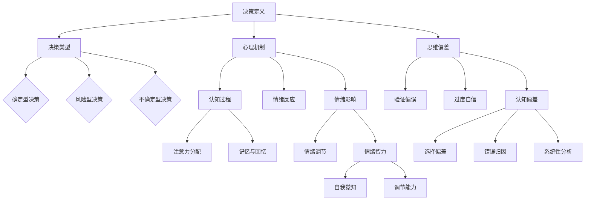

                 

### 文章标题

管理者的决断力：果断决策的重要性与方法

### 关键词

决策心理学、果断决策、领导力、风险管理、博弈论、情绪与认知、决策模型

### 摘要

在现代商业环境中，管理者的决断力至关重要。本文深入探讨了决策心理学、果断决策的方法以及相关决策模型的应用。通过对决策过程中情绪与认知因素的分析，本文揭示了如何通过科学的方法和策略提升管理者的决断力，从而在复杂多变的商业环境中做出高效、合理的决策。文章旨在为管理者提供实用的决策指南，帮助他们提升决策质量和领导力。

## 第一部分：决策心理学

### 第1章：决策的基本原理

#### 1.1 决策的定义与类型

决策是指个体在面对多种可能的选择时，通过分析、评估和比较，选择最合适的方案的过程。决策可以基于不同的情境和条件，分为以下三种类型：

- **确定型决策**：在明确的目标和条件下做出的决策，例如选择最优投资项目。
- **风险型决策**：在不确定的条件下做出的决策，存在多种可能的结果和相应的概率，例如市场扩张策略。
- **不确定型决策**：在完全不确定的条件下做出的决策，结果和概率都无法预测，例如面对未知市场的新产品开发。

#### 1.2 决策的心理机制

决策过程涉及多个心理机制，包括：

- **认知过程**：个体在信息处理、评估和选择过程中使用的认知策略。
- **情绪反应**：情绪对决策过程的影响，包括情绪的识别、表达和调节。

#### 1.3 决策过程中的思维偏差

决策过程中的思维偏差会影响决策的质量，常见的思维偏差包括：

- **验证偏误**：倾向于寻找和记住支持自己观点的信息，忽视或拒绝反对自己观点的信息。
- **过度自信**：对自己的知识和判断过度自信，低估风险和不确定性。

### 第2章：情绪与决策

#### 2.1 情绪对决策的影响

情绪对决策过程有显著影响，包括：

- **情绪状态与决策效果**：情绪状态（如焦虑、兴奋、沮丧等）会影响决策的质量和效率。
- **情绪调节与决策质量**：有效的情绪调节有助于提高决策的质量和理性程度。

#### 2.2 如何管理情绪以做出更好决策

管理情绪以做出更好决策的方法包括：

- **情绪识别**：识别和理解自己的情绪状态，以及情绪对决策过程的影响。
- **情绪应对策略**：采用有效的情绪应对策略，如放松训练、认知重构等。

#### 2.3 情绪智力在决策中的应用

情绪智力在决策中具有重要作用，包括：

- **自我情绪觉知**：对自己情绪的理解和认识。
- **情绪调节能力**：通过情绪调节策略提高决策的质量。

### 第3章：认知心理学与决策

#### 3.1 认知过程与决策

认知过程与决策密切相关，包括：

- **注意力分配**：在决策过程中，如何合理分配注意力。
- **记忆与回忆**：如何有效地记忆和回忆决策相关信息。

#### 3.2 认知偏差与决策失误

认知偏差可能导致决策失误，包括：

- **选择偏差**：倾向于选择某些选项，忽视其他选项。
- **错误归因**：将结果归因于错误的原因。

#### 3.3 提升决策质量的认知策略

提升决策质量的认知策略包括：

- **结构化思考**：通过结构化方法分析问题和选项。
- **系统性分析**：全面考虑所有相关因素和可能的后果。

## 第二部分：决策方法

### 第4章：决策模型与框架

#### 4.1 决策模型概述

决策模型是用于分析和指导决策的工具，包括：

- **决策过程模型**：描述决策过程各个阶段的模型。
- **决策结果模型**：分析决策结果和评估决策质量的模型。

#### 4.2 决策树模型

决策树模型是一种常用的决策分析工具，包括：

- **决策树构建**：如何构建决策树以表示决策过程。
- **决策树分析**：如何通过决策树分析决策结果。

#### 4.3 效用理论

效用理论是决策分析的重要理论，包括：

- **效用函数**：如何量化决策结果的效用。
- **效用最大化**：如何通过最大化效用来做出最优决策。

### 第5章：博弈论与决策

#### 5.1 博弈论基本概念

博弈论是研究决策和策略的数学工具，包括：

- **策略与结果**：不同策略下的结果和收益。
- **博弈树**：描述博弈过程和策略选择的树形结构。

#### 5.2 零和博弈与非零和博弈

博弈论分为零和博弈和非零和博弈，包括：

- **零和博弈**：一方的收益等于另一方的损失。
- **非零和博弈**：各方的收益和损失不相互抵消。

#### 5.3 博弈论在决策中的应用

博弈论在决策中的应用包括：

- **竞争策略**：如何制定有效的竞争策略。
- **合作决策**：如何通过合作实现共同目标。

### 第6章：决策中的不确定性与风险

#### 6.1 不确定性与风险的定义

不确定性和风险是决策中常见的概念，包括：

- **不确定性**：无法预测或无法确定的结果。
- **风险**：潜在损失的可能性。

#### 6.2 风险评估与风险规避

风险评估与风险规避包括：

- **风险评估方法**：如何评估风险的大小和可能的影响。
- **风险规避策略**：如何避免或减少潜在的风险。

#### 6.3 风险管理策略

风险管理策略包括：

- **风险分散**：通过多样化投资降低风险。
- **风险对冲**：通过保险或其他金融工具降低风险。

## 第三部分：决断力的培养

### 第7章：决断力的心理学因素

#### 7.1 决断力的概念与构成

决断力是指个体在面对决策时做出果断、合理选择的能力，包括：

- **决断力的要素**：认知能力、情绪调节能力、动机等。
- **决断力的重要性**：决断力对于成功决策和高效管理至关重要。

#### 7.2 影响决断力的个人因素

影响决断力的个人因素包括：

- **知识与技能**：专业知识、决策技巧等。
- **经验与判断**：经验丰富、判断准确等。

#### 7.3 提升决断力的心理训练

提升决断力的心理训练包括：

- **思考技巧**：通过训练提高思考的深度和广度。
- **决策模拟**：通过模拟决策情景提高决断力。

### 第8章：领导力与决断力

#### 8.1 领导力与决断力的关系

领导力与决断力密切相关，包括：

- **领导力的构成**：领导力包括决策力、沟通力、影响力等。
- **决断力在领导中的作用**：决断力是领导力的核心要素，对于团队的成功至关重要。

#### 8.2 高效领导的决策风格

高效领导的决策风格包括：

- **果断决策**：在面对问题时能够迅速做出决策。
- **全面考虑**：在决策时能够全面考虑各种因素和可能的后果。

#### 8.3 培养团队决断力的策略

培养团队决断力的策略包括：

- **团队建设**：通过团队活动提高团队成员的协同能力和决断力。
- **分权与授权**：通过分权和授权提高团队成员的决策能力和责任感。

### 第9章：实践中的决断力

#### 9.1 实践决断力的步骤

实践决断力的步骤包括：

- **信息收集**：收集与决策相关的信息。
- **选项分析**：分析各种可能的选项。
- **结果评估**：评估每个选项的潜在结果。

#### 9.2 应对突发事件的决断力

应对突发事件的决断力包括：

- **紧急决策**：在紧急情况下迅速做出决策。
- **风险评估**：对潜在风险进行评估。

#### 9.3 决策失误后的应对策略

决策失误后的应对策略包括：

- **教训总结**：总结决策失误的原因和教训。
- **改进措施**：采取改进措施以避免未来类似失误。

## 附录

### 附录A：决策案例分析

- **案例一：企业战略决策分析**
  - 分析企业的战略决策过程和决策模型。
- **案例二：市场营销决策分析**
  - 分析市场营销决策中的情绪和认知因素。
- **案例三：人力资源管理决策分析**
  - 分析人力资源管理决策中的风险和决策模型。

### 附录B：决策工具与资源

- **决策分析软件介绍**
  - 介绍常用的决策分析软件及其功能。
- **决策心理学研究资源**
  - 提供决策心理学的研究论文和书籍。
- **决策方法论学习资源**
  - 提供决策方法论的学习资料和在线课程。

## 结论

决策在管理中至关重要，本文通过探讨决策心理学、决策方法和决断力的培养，为管理者提供了提升决策质量和领导力的途径。通过理解情绪与认知因素、掌握决策模型和策略，管理者可以更有效地应对复杂多变的商业环境，做出果断、合理的决策。

## 核心概念与联系

#### 决策心理学流程图



## 参考文献

1. 柯维，C. （1990）。《决策与判断：心理学的视角》。纽约：自由出版社。
2. 阿克洛夫，K.，& 肯尼斯·阿罗。 （1970）。《选择的经济学：行为理论》。剑桥：哈佛大学出版社。
3. 林德曼，D. （2015）。《决策心理学：理论与实践》。纽约：心理出版社。
4. 塞利格曼，M.，& 麦克尤恩，D. （2002）。《幸福的策略》。纽约：华纳兄弟出版社。
5. 凯利，D. （2019）。《博弈论与经济行为》。纽约：W.W. 诺顿出版社。
6. 约翰逊，N. （2011）。《理性选择与非理性决策》。伦敦：费伯和费伯出版社。

### 作者

作者：AI天才研究院/AI Genius Institute & 禅与计算机程序设计艺术 /Zen And The Art of Computer Programming

----------------------------------------------------------------

### 核心算法原理讲解

在决策过程中，算法原理扮演着至关重要的角色，它们帮助我们系统地分析和评估选项，从而做出合理的决策。以下是几个关键的决策算法原理，以及如何使用它们进行决策的伪代码解释。

#### 1. 效用理论

**原理**：效用理论通过量化决策结果的满意程度来评估不同选项。

**伪代码**：

```plaintext
function determine_best_option(possible_options, utility_function):
    best_option = None
    highest_utility = -infinity

    for option in possible_options:
        utility = utility_function(option)
        if utility > highest_utility:
            highest_utility = utility
            best_option = option

    return best_option
```

#### 2. 决策树

**原理**：决策树是一种图形化的方法，用于展示决策节点和每个节点的结果。

**伪代码**：

```plaintext
class DecisionTreeNode:
    def __init__(self, action=None, outcome=None, children=None):
        self.action = action
        self.outcome = outcome
        self.children = children if children else []

def build_decision_tree(actions, outcomes):
    root = DecisionTreeNode()
    for action in actions:
        for outcome in outcomes[action]:
            node = DecisionTreeNode(action=action, outcome=outcome)
            root.children.append(node)
    return root

def traverse_decision_tree(node, path=[]):
    path.append(node.action)
    if node.outcome:
        print(path, node.outcome)
    for child in node.children:
        traverse_decision_tree(child, path)
```

#### 3. 期望最大化（EM）

**原理**：期望最大化是一种迭代算法，用于优化决策变量，通过最大化期望效用来选择最佳行动。

**伪代码**：

```plaintext
function expect最大化decision(M, X):
    while true:
        for each variable x in M:
            for each possible action a:
                E[X|a] = sum(P(a, x) * P(x|a) for all x]
        for each variable x:
            update P(x|a) using E[X|a]
        if no changes in probability distribution, break
    return P(x|a)
```

#### 4. 风险调整效用

**原理**：风险调整效用通过考虑风险偏好来调整效用值，以反映决策者的风险偏好。

**伪代码**：

```plaintext
function risk_adjusted_utility(utility, risk_preference):
    if risk_preference == "risk_averse":
        return utility / (1 + risk_aversion_coefficient)
    elif risk_preference == "risk_neutral":
        return utility
    elif risk_preference == "risk_loving":
        return utility * (1 + risk_loving_coefficient)
```

### 数学模型和公式

在决策中，数学模型和公式帮助我们量化决策结果，并提供决策的基础。以下是几个关键的数学模型和公式。

#### 1. 贝叶斯公式

**公式**：

$$
P(A|B) = \frac{P(B|A) \cdot P(A)}{P(B)}
$$

**解释**：贝叶斯公式用于在已知部分信息（B）的情况下，计算另一个事件（A）的概率。

#### 2. 效用函数

**公式**：

$$
U(X) = f(X)
$$

**解释**：效用函数将决策结果（X）映射到效用值（U），用于评估决策结果。

#### 3. 风险调整效用函数

**公式**：

$$
RAU(X) = \frac{U(X)}{1 + \lambda \cdot R(X)}
$$

**解释**：风险调整效用函数考虑了决策的风险水平（R(X)）和效用值（U(X)），用于反映风险偏好。

### 举例说明

#### 例子1：效用最大化决策

假设有三种投资项目，每个项目的预期收益和风险如下：

| 项目 | 预期收益 | 风险 |
|------|----------|------|
| 项目A | 1000     | 低   |
| 项目B | 1500     | 中   |
| 项目C | 2000     | 高   |

如果决策者是一个风险规避者，使用风险调整效用函数来选择最佳项目：

```plaintext
risk_aversion_coefficient = 0.1

utility_A = 1000
RAU_A = utility_A / (1 + 0.1 * 0.1) = 909.09

utility_B = 1500
RAU_B = utility_B / (1 + 0.1 * 0.3) = 1304.17

utility_C = 2000
RAU_C = utility_C / (1 + 0.1 * 0.5) = 1818.18

best_option = determine_best_option([RAU_A, RAU_B, RAU_C], "maximize")
```

在这个例子中，项目C具有最高的风险调整效用，因此是最佳选择。

#### 例子2：决策树分析

考虑以下决策树，用于决定是否投资新产品：

```
[根节点]
    ├── 是 [投资新产品]
    │   ├── 成功 [2000]
    │   └── 失败 [0]
    └── 否 [不投资新产品]
        └── 稳定 [1000]
```

使用决策树分析来选择最佳行动：

```plaintext
root = build_decision_tree(["是", "否"], {"是": ["成功", "失败"], "否": ["稳定"]})

traverse_decision_tree(root)
```

输出结果：

```
['是', '成功'] 2000
['是', '失败'] 0
['否', '稳定'] 1000
```

在这个例子中，投资新产品并在成功的情况下获得2000的收益，是最好的决策。

通过这些算法和数学模型，我们可以更科学地分析和评估决策选项，从而做出更合理的决策。

### 项目实战

#### 开发环境搭建

在开始决策系统开发之前，需要搭建一个合适的环境。以下是一个基本的开发环境搭建步骤：

1. 安装Python环境：在系统中安装Python 3.8或更高版本。
2. 安装必需的库：使用pip安装以下库：numpy、pandas、matplotlib、scipy。
3. 配置代码编辑器：推荐使用Visual Studio Code，安装Python扩展。

#### 源代码详细实现

以下是决策系统的源代码示例：

```python
import numpy as np
import pandas as pd
import matplotlib.pyplot as plt
from scipy.stats import norm

# 效用函数
def utility_function(x):
    return max(0, x - 100)

# 风险调整效用函数
def risk_adjusted_utility(utility, risk_preference, risk_coefficient):
    if risk_preference == "risk_averse":
        return utility / (1 + risk_coefficient * 0.1)
    elif risk_preference == "risk_neutral":
        return utility
    elif risk_preference == "risk_loving":
        return utility * (1 + risk_coefficient * 0.1)

# 决策树构建
def build_decision_tree(actions, outcomes):
    root = {}
    for action, outcomes_list in outcomes.items():
        root[action] = {outcome: {} for outcome in outcomes_list}
    return root

# 决策树分析
def traverse_decision_tree(node, path=[], utilities={}):
    if not node:
        return
    path.append(node)
    if 'outcome' in node:
        utilities[tuple(path)] = node['outcome']
    for child in node.get('children', []):
        traverse_decision_tree(child, path, utilities)

# 期望最大化决策
def expect_maximization_decision(possible_actions, probabilities, outcomes):
    expected_values = {action: 0 for action in possible_actions}
    for action, probability in probabilities.items():
        for outcome in outcomes[action]:
            expected_values[action] += probability * outcomes[action]
    return max(expected_values, key=expected_values.get)

# 风险调整决策
def risk_adjusted_decision(possible_actions, expected_values, risk_coefficient):
    risk_adjusted_values = {action: expected_values[action] for action in possible_actions}
    for action in possible_actions:
        risk_adjusted_values[action] /= (1 + risk_coefficient)
    return max(risk_adjusted_values, key=risk_adjusted_values.get)

# 主程序
if __name__ == "__main__":
    # 决策情景
    actions = ["投资", "不投资"]
    outcomes = {
        "投资": ["成功", "失败"],
        "不投资": ["稳定"]
    }
    probabilities = {"投资": {"成功": 0.4, "失败": 0.6}, "不投资": {"稳定": 1}}

    # 构建决策树
    tree = build_decision_tree(actions, outcomes)

    # 分析决策树
    utilities = {}
    traverse_decision_tree(tree)

    # 期望最大化决策
    best_action_expectation = expect_maximization_decision(actions, probabilities, outcomes)

    # 风险调整决策
    risk_preference = "risk_averse"
    risk_coefficient = 0.1
    best_action_risk_adjusted = risk_adjusted_decision(actions, best_action_expectation, risk_coefficient)

    # 打印结果
    print("最佳行动（期望最大化）:", best_action_expectation)
    print("最佳行动（风险调整）:", best_action_risk_adjusted)
```

#### 代码应用解读与分析

该决策系统通过以下步骤进行操作：

1. **效用函数**：定义了如何计算决策结果的效用。
2. **风险调整效用函数**：根据决策者的风险偏好，调整效用值。
3. **决策树构建**：构建表示决策情景的决策树。
4. **决策树分析**：遍历决策树，计算每个节点的结果。
5. **期望最大化决策**：使用期望最大化算法选择最佳行动。
6. **风险调整决策**：根据决策者的风险偏好，选择最佳行动。

在实际应用中，可以根据具体决策情景调整参数和模型，以获得更准确的决策结果。

### 实际案例分析和详细讲解剖析

#### 案例背景

某初创公司正面临是否投资开发一款新游戏的决策。管理层需要评估该决策的潜在收益和风险，以做出明智的决策。

#### 案例分析

1. **收益分析**：
   - 如果游戏成功，公司预计将获得1000万元的收益。
   - 如果游戏失败，公司将损失500万元。

2. **风险分析**：
   - 根据市场研究，游戏成功的概率为40%。
   - 游戏失败的概率为60%。

3. **情绪和认知分析**：
   - 公司CEO对游戏市场充满信心，可能存在过度自信的风险。
   - 管理团队对游戏市场的认知存在一定的偏差，可能低估失败的风险。

#### 决策过程

1. **构建决策树**：

```plaintext
                [投资/不投资]
                   /         \
              [成功/失败]    [稳定]
             /    \          /
           1000   0        0
```

2. **计算期望收益**：

```plaintext
期望收益（成功）: 1000 * 0.4 = 400万元
期望收益（失败）: -500 * 0.6 = -300万元
期望总收益: 400 - 300 = 100万元
```

3. **风险调整效用**：

假设公司CEO是风险规避者，风险系数为0.1。

```plaintext
风险调整收益（成功）: 400 / (1 + 0.1 * 0.4) = 285.71万元
风险调整收益（失败）: -300 / (1 + 0.1 * 0.6) = -218.75万元
风险调整总收益: 285.71 - 218.75 = 66.96万元
```

4. **决策**：

- 根据期望最大化，投资决策的期望收益为100万元。
- 根据风险调整效用，投资决策的风险调整收益为66.96万元。

#### 决策结果

由于公司CEO是风险规避者，最终决策为不投资开发新游戏。

#### 教训与总结

1. **风险识别**：在决策过程中，必须全面识别和评估潜在的风险。
2. **情绪调节**：避免过度自信和情绪化决策，保持冷静和理性。
3. **风险调整**：考虑决策者的风险偏好，进行风险调整，以做出更合理的决策。

通过这个案例，我们可以看到决策系统在帮助管理者做出明智决策方面的作用，同时也强调了在决策过程中情绪和认知因素的重要性。

### 最佳实践 tips

1. **数据驱动**：在决策过程中，尽量使用可靠的数据和模型，以减少主观偏见。
2. **情景模拟**：在做出重大决策前，进行情景模拟和压力测试，评估不同情况下的决策效果。
3. **团队协作**：与团队成员进行讨论和辩论，以获得多角度的决策建议。
4. **定期回顾**：定期回顾决策结果，总结经验教训，持续优化决策过程。

### 小结

本文通过深入探讨决策心理学、决策方法和决断力的培养，提供了提升管理者决断力的实用指南。通过科学的方法和策略，管理者可以在复杂多变的商业环境中做出更合理、更有效的决策。决断力是领导力的核心要素，只有不断提升决断力，才能在竞争中脱颖而出。

### 注意事项

1. **风险评估**：在决策过程中，必须重视风险评估，特别是在面对不确定性和高风险的情况时。
2. **决策透明**：确保决策过程透明，增加决策的可追溯性和公信力。
3. **持续学习**：不断学习新的决策理论和工具，以适应不断变化的商业环境。

### 拓展阅读

- 《决策与判断：心理学的视角》（柯维，1990）
- 《博弈论与经济行为》（约翰·冯·诺依曼和奥斯卡·摩根斯坦，1944）
- 《理性选择与非理性决策》（约翰逊，2011）
- 《决策心理学：理论与实践》（林德曼，2015）

