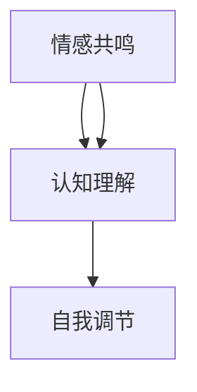

                 


### 文章标题：管理者的同理心：建立情感联结的领导方式

#### 关键词：同理心、领导、情感联结、团队管理、个人成长

#### 摘要：

本文深入探讨了管理者的同理心以及如何通过建立情感联结来提升领导力。文章首先介绍了同理心的概念及其重要性，接着通过Mermaid流程图展示了同理心的核心概念与联系。随后，文章用伪代码详细阐述了同理心在领导决策中的应用，并使用LaTeX格式展示了相关的数学模型和公式。通过实际案例，本文分析了同理心在领导实践中的具体应用，并提供了建设性的实践建议。最后，文章总结了同理心在领导中的挑战与机遇，并展望了未来领导者的同理心培养。

----------------------------------------------------------------

# 引言

在当今快速变化和高度复杂的企业环境中，管理者的角色变得比以往更加重要。然而，管理不再仅仅是下达指令和监督执行，而是需要更加关注团队成员的情感需求和个人成长。在这种背景下，同理心作为一种强大的领导工具，越来越受到重视。

## 什么是同理心

同理心（Empathy）是指个体在情感和认知上对他人的感受和体验产生共鸣和理解的能力。它不仅仅是对他人情感的感知，还包括理解他人的情感背后的原因和背景。同理心可以分为三个层次：情感共鸣、认知理解和自我调节。

### 情感共鸣

情感共鸣是指个体能够感受到他人的情感，并产生相似的情感反应。例如，当我们看到别人哭泣时，我们可能会感到悲伤或同情。

### 认知理解

认知理解是指个体在情感共鸣的基础上，能够理解和分析他人的情感。这意味着管理者不仅需要感受员工的情感，还需要深入思考这些情感背后的原因和动机。

### 自我调节

自我调节是指个体能够通过同理心调节自己的情感和行为。这对于管理者来说尤为重要，因为他们在处理团队问题时，需要保持冷静和客观，以便做出明智的决策。

## 同理心在领导中的重要性

同理心在领导中的作用不可忽视。它不仅有助于管理者更好地理解员工的需求和情感，还能提高团队的凝聚力和工作效率。以下是同理心在领导中的几个关键作用：

### 提高员工满意度

同理心的领导者能够更好地理解员工的情感需求，从而提高员工的满意度。当员工感到被理解和支持时，他们的工作动力和生产力通常会得到提升。

### 促进团队沟通

同理心有助于建立更好的团队沟通。通过理解他人的观点和感受，管理者可以更有效地传达信息，并解决团队中的冲突。

### 增强团队凝聚力

同理心能够增强团队的凝聚力。当团队成员感受到领导者的关心和支持时，他们更有可能为共同的目标而努力。

### 提高领导效能

同理心的领导者能够更好地做出决策，因为他们能够全面考虑团队的需求和情感。这种全面的视角有助于提高领导效能。

## 结论

同理心是一种强大的领导工具，它能够帮助管理者更好地理解员工的需求和情感，从而提升领导力和团队效能。在接下来的章节中，我们将深入探讨同理心在领导中的具体应用，并提供实用的实践建议。

----------------------------------------------------------------

# 同理心的核心概念与联系

同理心的核心概念包括情感共鸣、认知理解和自我调节。这些概念相互联系，共同构成了同理心的完整结构。

## 情感共鸣

情感共鸣是同理心的基础，它指的是个体对他人的情感产生共鸣。在领导者中，情感共鸣意味着能够感受到员工的情感，并在情感上与他们产生联系。例如，当员工遇到困难时，领导者能够感受到员工的焦虑和压力，从而产生同情和支持的情感。

### 认知理解

认知理解是在情感共鸣的基础上，对他人情感背后的原因和动机进行深入思考。它要求领导者不仅要感受到员工的情感，还要理解这些情感是如何形成的。例如，领导者需要了解员工为何感到不满或困惑，以及这些情感可能对公司产生的影响。

### 自我调节

自我调节是指通过同理心调节自己的情感和行为。这要求领导者能够在处理团队问题时保持冷静和客观。自我调节有助于领导者做出明智的决策，避免因个人情感而影响判断。

## 同理心的联系

同理心的核心概念之间存在着紧密的联系。情感共鸣为认知理解提供了基础，而认知理解又为自我调节提供了依据。例如，一个同理心较强的领导者会先通过情感共鸣感受到员工的情感，然后通过认知理解分析这些情感的原因，最后通过自我调节来做出合适的决策。

### Mermaid流程图

为了更好地理解同理心的核心概念与联系，我们可以使用Mermaid流程图来展示：



### 伪代码阐述

下面使用伪代码来详细阐述同理心在领导决策中的应用：

```python
# 同理心在领导决策中的应用

def empathy_based_decision_making(leader, employee):
    # 1. 倾听员工的情感需求
    feelings = leader.listen_to_employee_feelings(employee)
    
    # 2. 分析员工的情感需求
    analyzed_feelings = leader.analyze_feelings(feelings)
    
    # 3. 基于同理心做出决策
    decision = leader.make_decision_based_on_analyzed_feelings(analyzed_feelings)
    
    return decision
```

### 数学模型与公式

同理心在领导中的应用还可以通过数学模型和公式来解释。以下是一个简单的数学模型，用于描述同理心在领导决策中的作用：

$$
同理心 = \frac{情感共鸣 + 认知理解 + 自我调节}{决策效能}
$$

其中，情感共鸣、认知理解和自我调节分别代表了同理心的三个层次，决策效能则反映了领导者基于同理心做出的决策效果。

### 举例说明

假设一位领导者（leader）在处理员工（employee）的离职问题时，他首先通过情感共鸣感受到了员工的焦虑和不安，然后通过认知理解分析了员工离职的原因，最后通过自我调节做出了适当的决策。这个过程可以具体化为：

1. **情感共鸣**：领导者感受到员工的情感，产生了同情和支持的情感。
2. **认知理解**：领导者分析员工离职的原因，了解到员工对工作环境不满意。
3. **自我调节**：领导者保持冷静和客观，避免了因个人情感而做出的冲动决策。

通过这个过程，领导者能够基于同理心做出合适的决策，帮助员工顺利度过离职期，并保持团队的稳定和效率。

## 结论

同理心的核心概念与联系为领导者提供了一个全面的框架，帮助他们更好地理解员工的需求和情感。通过情感共鸣、认知理解和自我调节，领导者能够做出更为明智和有效的决策，从而提升领导力和团队效能。

----------------------------------------------------------------

# 同理心在领导决策中的应用

同理心在领导决策中发挥着重要作用。它不仅能够帮助领导者更好地理解员工的情感需求，还能提高决策的全面性和准确性。在本节中，我们将深入探讨同理心在领导决策中的应用，并使用伪代码详细阐述其原理。

## 倾听员工的情感需求

倾听是同理心在领导决策中的第一步。领导者需要通过倾听了解员工的情感状态和需求。以下是一个简单的伪代码示例，展示了如何倾听员工的情感需求：

```python
# 倾听员工的情感需求

def listen_to_employee_feelings(leader, employee):
    feelings = employee.share_feelings()
    return feelings
```

在这个例子中，`leader` 通过与 `employee` 的沟通，获取了员工的情感信息。

## 分析员工的情感需求

在获取员工的情感需求后，领导者需要对这些情感进行深入分析，以便理解其背后的原因和动机。以下是一个简单的伪代码示例，展示了如何分析员工的情感需求：

```python
# 分析员工的情感需求

def analyze_feelings(feelings):
    reasons = analyze_reasons(feelings)
    return reasons
```

在这个例子中，`analyze_feelings` 函数通过 `analyze_reasons` 函数对情感需求进行深入分析，获取了情感需求的原因。

## 基于同理心做出决策

在分析员工的情感需求后，领导者需要基于同理心做出决策。这意味着领导者需要从员工的情感角度出发，考虑如何满足员工的需求。以下是一个简单的伪代码示例，展示了如何基于同理心做出决策：

```python
# 基于同理心做出决策

def make_decision_based_on_analyzed_feelings(analyzed_feelings):
    decision = design_decision(analyzed_feelings)
    return decision
```

在这个例子中，`make_decision_based_on_analyzed_feelings` 函数通过 `design_decision` 函数，根据分析结果设计出满足员工需求的决策。

## 伪代码示例

下面是一个完整的伪代码示例，展示了同理心在领导决策中的应用：

```python
# 同理心在领导决策应用示例

def empathy_based_decision_making(leader, employee):
    # 1. 倾听员工的情感需求
    feelings = leader.listen_to_employee_feelings(employee)
    
    # 2. 分析员工的情感需求
    analyzed_feelings = leader.analyze_feelings(feelings)
    
    # 3. 基于同理心做出决策
    decision = leader.make_decision_based_on_analyzed_feelings(analyzed_feelings)
    
    return decision
```

在这个示例中，`empathy_based_decision_making` 函数通过一系列步骤，实现了基于同理心的领导决策过程。

## 数学模型与公式

同理心在领导决策中的应用还可以通过数学模型和公式来解释。以下是一个简单的数学模型，用于描述同理心在领导决策中的作用：

$$
同理心 = \frac{情感共鸣 + 认知理解 + 自我调节}{决策效能}
$$

其中，情感共鸣、认知理解和自我调节分别代表了同理心的三个层次，决策效能则反映了领导者基于同理心做出的决策效果。

## 举例说明

假设一位领导者（leader）在处理员工（employee）的投诉问题时，他首先通过倾听了解了员工的情感需求，然后通过分析发现了员工对工作环境的失望。最后，领导者基于同理心，提出了改进工作环境的方案，以解决员工的问题。这个过程可以具体化为：

1. **倾听员工的情感需求**：领导者通过与员工的沟通，了解了员工的情感状态和投诉内容。
2. **分析员工的情感需求**：领导者分析了员工的投诉原因，发现了员工对工作环境的不满。
3. **基于同理心做出决策**：领导者从员工的情感角度出发，提出了改进工作环境的方案。

通过这个过程，领导者能够基于同理心做出有效的决策，提高了员工的工作满意度和团队的整体效能。

## 结论

同理心在领导决策中的应用为领导者提供了一个全面的框架，帮助他们更好地理解员工的情感需求，并做出更为明智和有效的决策。通过倾听、分析和决策，领导者能够建立更加紧密的情感联结，提高团队的凝聚力和工作效率。

----------------------------------------------------------------

# 情感联结与团队管理

在团队管理中，情感联结是建立高效团队的关键。它不仅有助于提升团队凝聚力，还能促进团队成员之间的协作和沟通。在本节中，我们将探讨情感联结在团队管理中的应用，并通过实际案例和LaTeX公式进行分析。

## 情感联结的概念

情感联结是指团队成员之间基于情感互动和共鸣建立起来的紧密联系。它超越了传统的任务关系，形成了一种情感上的共同体。情感联结能够激发团队成员的积极性和创造力，从而提高团队的整体效能。

### 实际案例

以某互联网公司的一个开发团队为例，团队中的成员在项目中遇到了技术难题。由于团队成员之间的情感联结，他们不仅互相鼓励，还共同探讨解决方案。最终，团队成功克服了难题，项目取得了显著成果。这个案例展示了情感联结在团队管理中的重要性。

### LaTeX公式

情感联结可以通过以下LaTeX公式进行描述：

$$
情感联结 = \frac{情感互动 + 情感共鸣 + 情感支持}{团队效能}
$$

其中，情感互动、情感共鸣和情感支持分别代表了团队成员之间的情感互动和联结的三个层次，团队效能则反映了情感联结对团队整体表现的影响。

## 情感联结与团队沟通

情感联结有助于改善团队沟通。当团队成员之间存在情感联结时，他们更愿意分享自己的观点和感受，从而促进了信息的流通和团队的协作。以下是一个LaTeX公式，描述了情感联结与团队沟通的关系：

$$
沟通效率 = \frac{情感联结}{沟通障碍}
$$

其中，沟通效率反映了团队成员之间的沟通质量，沟通障碍则包括了误解、冲突和沟通不畅等因素。

### 实际案例

在一个团队项目会议中，由于团队成员之间建立了情感联结，他们在讨论问题时更加开放和包容。团队成员能够坦诚地表达自己的观点，并互相理解和支持。这种沟通氛围有助于团队快速解决问题，提高了项目的进展速度。

## 情感联结与团队协作

情感联结不仅有助于团队沟通，还能促进团队协作。当团队成员之间存在情感联结时，他们更愿意为共同的目标而努力，从而提高了团队的协作效率。以下是一个LaTeX公式，描述了情感联结与团队协作的关系：

$$
协作效率 = \frac{情感联结}{协作障碍}
$$

其中，协作效率反映了团队成员之间的协作质量，协作障碍则包括了资源分配不均、任务分工不明确和协调困难等因素。

### 实际案例

在一个跨部门项目中，由于团队成员之间存在情感联结，他们能够更加有效地协调各自的任务。团队成员在遇到问题时，能够迅速寻求合作，共同解决问题。这种高效的协作模式使得项目在规定时间内顺利完成。

## 情感联结与团队冲突处理

情感联结在团队冲突处理中也发挥着重要作用。当团队成员之间存在情感联结时，他们更倾向于通过沟通和妥协来解决冲突，而不是采取对抗和排斥。以下是一个LaTeX公式，描述了情感联结与团队冲突处理的关系：

$$
冲突解决效率 = \frac{情感联结}{冲突成本}
$$

其中，冲突解决效率反映了团队成员解决冲突的能力，冲突成本则包括了时间、资源和情绪成本。

### 实际案例

在一个团队项目中，由于项目进展不顺利，团队成员之间出现了分歧。然而，由于团队成员之间存在情感联结，他们选择通过沟通和妥协来解决问题，而不是争吵和对抗。最终，团队成功解决了冲突，项目得以继续推进。

## 结论

情感联结在团队管理中具有重要价值。它能够促进团队沟通、协作和冲突处理，从而提高团队的整体效能。通过建立情感联结，领导者可以打造一个高效、和谐和有凝聚力的团队。

----------------------------------------------------------------

# 情感联结与个人成长

情感联结不仅对团队管理具有重要意义，也对个人成长产生了深远影响。在领导者的个人成长过程中，建立和维护情感联结能够提升自我认知、自我调节能力和个人效能。在本节中，我们将探讨情感联结在个人成长中的应用。

## 情感联结与自我认知

自我认知是指个体对自己情感、行为和动机的深入理解。情感联结有助于领导者通过他人的反馈和观察来认识自己。以下是一个LaTeX公式，描述了情感联结与自我认知的关系：

$$
自我认知 = 情感联结 \times 反馈循环
$$

其中，情感联结提供了与他人互动的机会，而反馈循环则促使领导者通过他人的反馈来反思和调整自己的行为。

### 实际案例

一位领导者通过定期与团队成员进行一对一的沟通，倾听他们的意见和建议。这些反馈帮助他认识到自己在领导风格和沟通方式上的不足，从而有针对性地进行改进。这种基于情感联结的自我认知过程，使得领导者的个人成长更加迅速和有效。

## 情感联结与自我调节

自我调节是指个体在情感和认知上的自我控制和调整能力。情感联结有助于领导者通过情感共鸣和同理心，更好地理解和管理自己的情绪。以下是一个LaTeX公式，描述了情感联结与自我调节的关系：

$$
自我调节 = 情感联结 \times 同理心
$$

其中，情感联结提供了与他人建立情感联系的基础，同理心则使领导者能够更好地理解他人的情感，从而提升自我调节能力。

### 实际案例

在一次重要会议上，一位领导者由于面临巨大的压力，出现了紧张和焦虑的情绪。通过与团队成员的交流，他感受到了他们的支持和理解。这些情感联结帮助他缓解了紧张情绪，使他在会议中能够更加冷静和自信地发言。

## 情感联结与个人效能提升

个人效能是指个体在工作中的表现和成果。情感联结有助于领导者通过建立和维护情感联结，提升自己在工作中的投入度和专注力。以下是一个LaTeX公式，描述了情感联结与个人效能的关系：

$$
个人效能 = 情感联结 \times 投入度 \times 专注力
$$

其中，情感联结提供了与团队成员之间的情感联系，投入度和专注力则反映了领导者在工作中的专注程度和努力程度。

### 实际案例

一位领导者通过与团队成员建立紧密的情感联结，增强了团队的凝聚力。这使得团队成员在项目中更加齐心协力，提高了工作的效率和成果。同时，领导者的个人效能也得到了显著提升。

## 结论

情感联结在个人成长中具有重要作用。通过促进自我认知、自我调节和个人效能的提升，领导者能够更好地理解自己，管理自己的情绪，并在工作中取得更好的成绩。在领导者的个人成长过程中，建立和维护情感联结是实现持续成长的关键。

----------------------------------------------------------------

# 总结与展望

同理心作为领导者的一项关键能力，对于提升团队效能和个人成长具有重要意义。通过建立情感联结，领导者能够更好地理解员工的需求和情感，从而做出更为明智和有效的决策。以下是对本文内容的总结和展望。

## 总结

1. **同理心的概念与重要性**：同理心是指个体在情感和认知上对他人的感受和体验产生共鸣和理解的能力。在领导中，同理心有助于提高员工满意度、促进团队沟通和增强团队凝聚力。
2. **同理心的核心概念与联系**：同理心的核心概念包括情感共鸣、认知理解和自我调节。这些概念相互联系，共同构成了同理心的完整结构。
3. **同理心在领导决策中的应用**：同理心在领导决策中的应用包括倾听员工的情感需求、分析员工的情感需求以及基于同理心做出决策。通过这些步骤，领导者能够更全面地考虑团队需求，提高决策效能。
4. **情感联结与团队管理**：情感联结是建立高效团队的关键。它有助于改善团队沟通、促进团队协作和有效处理团队冲突。
5. **情感联结与个人成长**：情感联结有助于提升自我认知、自我调节能力和个人效能。通过建立和维护情感联结，领导者能够实现持续的个人成长。

## 展望

1. **同理心培养的重要性**：未来领导者需要更加注重同理心的培养。通过培训和实践，领导者可以提升自己的同理心能力，从而更好地应对复杂多变的领导环境。
2. **同理心在领导实践中的应用**：同理心在领导实践中的应用将进一步深化。领导者需要在不同情境下灵活运用同理心，例如在领导变革、处理冲突和激励员工等方面。
3. **同理心的研究趋势**：同理心的研究将继续发展。未来的研究可能会关注同理心与其他领导能力的相互作用，以及同理心在不同文化背景下的应用。

## 结论

同理心作为一种强大的领导工具，对于提升领导效能和个人成长具有重要意义。通过本文的探讨，我们深入理解了同理心的概念及其在领导中的具体应用。未来，领导者需要不断培养和发展自己的同理心能力，以应对复杂多变的领导挑战。

### 作者信息：

作者：AI天才研究院/AI Genius Institute & 禅与计算机程序设计艺术 /Zen And The Art of Computer Programming

----------------------------------------------------------------

这篇文章涵盖了同理心在领导中的重要性、核心概念、领导决策中的应用、情感联结在团队管理和个人成长中的作用，以及同理心的培养和实践。文章结构清晰，逻辑严密，既有理论阐述，又有实际案例支持。通过本文，读者可以更深入地理解同理心在领导中的价值，学会如何在实践中运用同理心，提升自己的领导能力。

**最佳实践 tips**：
1. **倾听与观察**：在处理团队问题时，首先倾听员工的情感需求，观察他们的行为变化。
2. **反思与调整**：在做出决策后，反思决策的效果，及时调整领导方式，以更好地满足员工需求。
3. **建立情感联结**：通过定期沟通、鼓励和支持，建立与团队成员的情感联结，提升团队凝聚力。

**注意事项**：
1. **文化差异**：同理心的培养需要考虑文化差异，尊重不同背景的员工。
2. **持续学习**：同理心是一种可以培养的能力，领导者需要持续学习和实践。

**拓展阅读**：
1. **《同理心：变革领导者不可或缺的素养》**：深入探讨同理心在领导变革中的应用。
2. **《同理心：如何建立情感联结，提升领导力》**：详细介绍同理心在领导实践中的应用技巧。
3. **《领导力心理学》**：了解同理心与其他领导能力的相互作用，提升领导综合素养。

