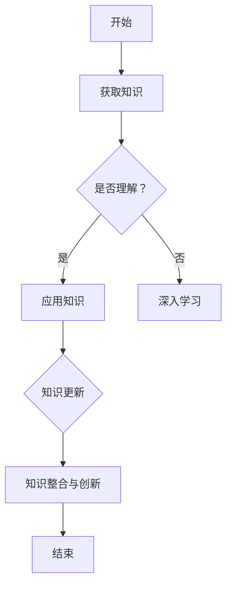

                 


## 《管理者的学习能力：保持知识更新的方法》目录大纲

### 文章标题：管理者的学习能力：保持知识更新的方法

### 关键词：管理者，学习能力，知识更新，学习方法，持续学习

### 摘要：
本文旨在探讨管理者如何通过提升学习能力来保持知识的更新。在快速变化的技术和市场环境中，管理者需要不断学习新知识，以适应不断变化的环境和挑战。本文首先介绍了管理者为何需要保持学习能力，并探讨了知识更新的重要性。接着，文章详细阐述了学习的核心概念、原理和算法，包括常用的学习策略和技巧。此外，文章还提供了数学模型和公式来帮助理解学习效率和知识更新的过程。通过实际案例和项目实战，文章展示了如何将理论应用于实践。最后，文章提出了时间管理技巧、学习资源选择策略，并讨论了持续学习的实践和挑战。全文以专业、简洁、易懂的技术语言，为管理者提供了一套有效的知识更新方法。

### 第一部分：引言和背景

#### 第1章：管理者为何需要保持学习能力

**1.1 管理者的角色与责任**

管理者的角色不仅仅局限于日常的运营管理，还涉及到战略规划、决策制定、团队领导以及持续的个人和职业发展。在信息技术、全球化、市场波动等多种因素的共同作用下，管理者的职责变得更加复杂和多样化。

**1.1.1 管理者面临的挑战**

随着技术进步和行业变革，管理者需要面对以下挑战：

1. **技术变革**：新技术的发展日新月异，管理者必须了解和掌握这些新技术，以便在竞争中保持优势。
2. **市场变化**：市场的快速变化要求管理者具备敏锐的市场洞察力和灵活的应对策略。
3. **团队管理**：有效管理和激励团队成员，是确保团队高效运作的关键。
4. **个人发展**：管理者需要不断提升自己的专业能力和管理技能，以适应不断变化的工作环境。

**1.1.2 保持学习能力的必要性**

在上述挑战面前，保持学习能力成为管理者不可或缺的能力。学习能力不仅是管理者职业发展的基石，也是应对复杂问题的有力工具。具体来说，保持学习能力有以下几个方面的必要性：

1. **知识更新**：随着技术的发展，管理者需要不断学习新的知识和技能，以跟上时代的步伐。
2. **创新思维**：学习新知识能够激发管理者的创新思维，有助于提出新的解决方案和改进措施。
3. **领导力提升**：通过学习，管理者能够更好地理解和应对团队成员的需求，提升领导力。
4. **战略决策**：丰富的知识储备有助于管理者做出更加准确和有效的战略决策。

**1.2 学习能力的定义与特征**

学习能力是指个体获取、理解、应用和创造知识的能力。具体来说，学习能力包括以下几个方面的特征：

1. **知识获取**：能够主动获取新知识和信息，并将其内化为自己的知识体系。
2. **知识理解**：能够理解和分析新知识，将其与已有的知识体系相结合。
3. **知识应用**：能够将所学知识应用于实际问题解决和决策制定。
4. **知识创造**：能够创造新的知识和思想，为团队和组织带来创新和突破。

**1.2.1 学习能力的基本要素**

1. **好奇心**：好奇心是推动个体主动学习的重要动力。
2. **毅力**：持续的学习需要坚韧不拔的毅力，以克服各种困难和挑战。
3. **批判性思维**：批判性思维有助于管理者在复杂环境中做出理性分析和决策。
4. **沟通能力**：有效的沟通能力有助于管理者将所学知识传达给团队成员。

**1.2.2 学习能力的重要性**

学习能力的重要性体现在以下几个方面：

1. **职业发展**：保持学习能力能够帮助管理者在职业生涯中不断提升，实现个人和职业目标。
2. **团队效能**：管理者通过学习，能够为团队带来新的视角和思路，提升团队整体效能。
3. **组织竞争力**：管理者的学习能力直接影响组织的创新能力和市场竞争力。
4. **社会贡献**：通过持续学习，管理者能够为社会发展做出更大的贡献。

#### 第2章：知识更新的概念

**2.1 知识更新的定义**

知识更新是指个体或组织通过学习新知识和技能，以适应不断变化的环境和需求的过程。知识更新不仅仅是学习新知识，还包括对已有知识的更新和改进。

**2.1.1 知识更新的含义**

1. **知识拓展**：通过学习新知识，管理者能够拓展自己的知识面，掌握更多的专业知识和技能。
2. **知识深化**：对已有知识的深入理解和应用，能够提高管理者的专业水平和决策能力。
3. **知识整合**：将不同领域的知识进行整合，形成全新的见解和解决方案。
4. **知识创新**：通过创新思维，将知识转化为创新成果，为团队和组织带来新的突破。

**2.2 知识更新的驱动力**

知识更新的驱动力主要包括以下几个方面：

1. **技术进步**：新技术的不断涌现，迫使管理者不断学习新的技术和工具。
2. **市场变化**：市场的快速变化，要求管理者具备敏锐的市场洞察力和灵活的应对策略。
3. **行业变革**：行业的变革和转型，需要管理者具备相应的专业知识和技能。
4. **个人发展**：管理者通过学习，提升自己的专业能力和管理技能，以适应不断变化的工作环境。

**2.3 知识更新的挑战**

在知识更新的过程中，管理者面临以下几个方面的挑战：

1. **知识过载**：随着信息的爆炸性增长，管理者难以在海量信息中筛选出真正有价值的内容。
2. **知识遗忘**：随着时间的推移，管理者可能会遗忘所学知识，导致知识储备的流失。
3. **知识滞后**：技术进步和市场变化速度过快，管理者可能无法及时更新知识，导致知识滞后。
4. **学习成本**：持续学习需要投入大量的时间和精力，管理者需要平衡学习与工作的关系。

#### 第2章：学习与知识更新的关系

**2.1 核心概念介绍**

学习与知识更新密切相关，是知识管理的核心组成部分。学习是指个体通过获取、理解和应用知识的过程，而知识更新则是指个体或组织在现有知识的基础上，通过不断学习新知识、改进和整合现有知识，以适应不断变化的环境和需求的过程。

**2.2 学习与知识更新的流程图**

为了更好地理解学习与知识更新的关系，我们可以通过Mermaid流程图来展示这一流程：



**2.3 学习与知识更新的流程解析**

1. **获取知识**：个体通过阅读、学习、培训、交流等方式获取新知识。
2. **理解知识**：个体对获取的知识进行理解和分析，判断其是否与已有知识体系相符合。
3. **应用知识**：将理解后的知识应用于实际工作和生活中，通过实践来验证和巩固所学知识。
4. **知识更新**：通过应用知识，发现新问题和挑战，进一步更新和改进已有知识。
5. **知识整合与创新**：将新知识和已有知识进行整合，形成新的见解和解决方案，实现知识创新。

#### 第3章：核心算法原理讲解

**3.1 学习方法的分类**

学习方法可以分为以下几类：

1. **主动学习方法**：个体通过自主学习、探索和实践来获取知识。
2. **被动学习方法**：个体通过接受教育、培训和指导来获取知识。
3. **混合学习方法**：结合主动学习和被动学习方法，以达到最佳学习效果。

**3.2 常见学习策略和技巧**

常见的学习策略和技巧包括：

1. **分散学习**：将学习内容分散到多个时间段进行，以提高学习效果。
2. **深度学习**：对学习内容进行深入分析和理解，以达到深入掌握的目的。
3. **实践学习**：通过实际操作和练习来巩固所学知识。
4. **反思学习**：对学习过程进行反思和总结，以提高学习效果。

**3.3 伪代码示例**

以下是一个简单的伪代码示例，用于说明学习方法的实现：

```plaintext
function 学习(知识内容):
    获取知识(知识内容)
    理解知识(知识内容)
    应用知识(知识内容)
    if 知识更新:
        更新知识(知识内容)
    end if
    反思学习(学习过程)
    返回 学习效果
end function
```

**3.4 数学模型和数学公式**

为了更好地理解学习效率和知识更新的过程，我们可以使用数学模型和数学公式来描述。

1. **学习效率计算方法**

   学习效率可以用以下公式来计算：

   $$ 效率 = \frac{掌握的知识量}{投入的时间} $$

   其中，掌握的知识量表示个体在一段时间内所获取的知识量，投入的时间表示个体用于学习的时间。

2. **知识更新模型**

   知识更新模型可以用以下公式来描述：

   $$ 更新速率 = \frac{新知识的获取量}{原有知识的总量} $$

   其中，更新速率表示知识更新的速度，新知识的获取量表示个体在一段时间内获取的新知识量，原有知识的总量表示个体原有的知识量。

   $$ 知识更新量 = 更新速率 \times 时间 $$

   其中，知识更新量表示个体在一段时间内的知识更新量。

3. **LaTeX 数学公式展示**

   LaTeX 数学公式可以使用以下格式进行展示：

   $$ 
   \begin{align*}
   E &= mc^2 \\
   F &= ma \\
   \end{align*}
   $$

   其中，$E$ 表示能量，$m$ 表示质量，$c$ 表示光速，$F$ 表示力，$a$ 表示加速度。

#### 第4章：数学模型和数学公式

**4.1 学习效率的计算方法**

学习效率是衡量个体学习效果的重要指标，其计算方法如下：

$$
效率 = \frac{掌握的知识量}{投入的时间}
$$

其中，$掌握的知识量$ 是指个体在特定时间内通过学习获取的知识量，$投入的时间$ 则是用于学习的时间。

**4.2 知识更新的数学模型**

知识更新是指个体或组织在现有知识基础上，通过学习新知识来提升知识水平。知识更新的数学模型可以描述为：

$$
更新速率 = \frac{新知识的获取量}{原有知识的总量}
$$

其中，$更新速率$ 表示知识更新的速度，$新知识的获取量$ 是指在一定时间内获取的新知识量，$原有知识的总量$ 是指个体或组织在更新前所拥有的知识总量。

**4.3 知识更新量的计算**

知识更新量可以用以下公式计算：

$$
知识更新量 = 更新速率 \times 时间
$$

其中，$知识更新量$ 是指在特定时间内知识更新的总量，$更新速率$ 是每单位时间内知识更新的量，$时间$ 是知识更新的时间周期。

**4.4 LaTeX 数学公式展示**

为了更直观地展示数学公式，我们可以使用 LaTeX 语言进行表示。以下是一个简单的示例：

$$
\begin{align*}
\text{效率} &= \frac{\text{掌握的知识量}}{\text{投入的时间}} \\
\text{更新速率} &= \frac{\text{新知识的获取量}}{\text{原有知识的总量}} \\
\text{知识更新量} &= \text{更新速率} \times \text{时间}
\end{align*}
$$

通过上述公式，我们可以更清晰地理解学习效率和知识更新的过程。

#### 第5章：项目实战

**5.1 实际案例：一名管理者如何保持学习能力**

为了更好地理解管理者如何保持学习能力，我们以一位名叫约翰的管理者为例。约翰是一名负责技术团队的高级经理，他在职业生涯中始终保持着对新技术和新知识的强烈好奇心。

**5.1.1 约翰的学习经历**

1. **初始阶段**：约翰在工作初期，对技术的掌握较为薄弱。他意识到要成为一名优秀的管理者，必须不断学习新技术。于是，他开始利用业余时间学习编程语言、数据库管理以及项目管理等相关知识。

2. **发展阶段**：随着工作年限的增加，约翰积累了丰富的技术和管理经验。然而，他并未因此而满足，而是继续关注行业动态，参加各类技术会议和研讨会，与业内专家交流，不断提升自己的专业素养。

3. **成熟阶段**：在约翰的职业生涯中，他逐渐形成了自己的一套学习方法。他通过阅读技术书籍、参与在线课程、编写技术博客等方式，不断更新和扩展自己的知识体系。

**5.1.2 约翰的学习方法**

1. **主动学习**：约翰倾向于主动学习，他会选择自己感兴趣的主题进行深入学习。这种方法帮助他快速掌握新知识，并将其应用于实际工作中。

2. **分散学习**：为了避免一次性投入过多的时间和精力，约翰会将学习内容分散到多个时间段进行。这样，他可以在不影响日常工作的情况下，持续提升自己的知识水平。

3. **实践学习**：约翰强调实践的重要性。他会在学习新知识后，立即尝试将其应用于实际项目，通过实践来巩固和深化所学知识。

4. **反思学习**：约翰会在学习过程中进行反思，总结自己的学习方法和经验，以便在下一次学习中更好地发挥效果。

**5.2 代码实际案例：一个用于自我评估和持续学习的工具**

为了帮助管理者更好地评估自己的学习效果，我们开发了一个名为“自我评估工具”的软件。该工具可以帮助管理者检测自己在知识更新过程中的进步，并提供改进建议。

**5.2.1 开发环境搭建**

1. **语言选择**：为了确保工具的通用性，我们选择使用 Python 语言进行开发。Python 语言具有简单易学、功能强大的特点，非常适合开发此类工具。

2. **依赖库**：我们使用了一些常用的 Python 库，如 NumPy、Pandas 和 Matplotlib。这些库提供了丰富的数据分析和可视化功能，有助于我们更好地展示评估结果。

3. **环境配置**：在开发环境中，我们需要安装 Python 解释器和相关库。可以使用虚拟环境（如 virtualenv）来隔离项目依赖，确保项目的稳定性。

**5.2.2 源代码详细实现和代码解读**

以下是一个简单的示例代码，用于展示自我评估工具的基本功能：

```python
import pandas as pd
import numpy as np
import matplotlib.pyplot as plt

# 数据准备
data = {
    '日期': ['2021-01-01', '2021-02-01', '2021-03-01', '2021-04-01'],
    '学习时长（小时）': [5, 7, 8, 6],
    '掌握知识量': [20, 25, 30, 22]
}

df = pd.DataFrame(data)

# 学习效率计算
df['学习效率'] = df['掌握知识量'] / df['学习时长（小时）']

# 可视化展示
plt.figure(figsize=(10, 5))
plt.plot(df['日期'], df['学习效率'], marker='o')
plt.title('学习效率趋势图')
plt.xlabel('日期')
plt.ylabel('学习效率')
plt.grid(True)
plt.show()
```

**5.2.3 代码解读与分析**

1. **数据准备**：我们首先创建了一个包含日期、学习时长和掌握知识量的 DataFrame，用于存储和管理数据。

2. **学习效率计算**：通过计算掌握知识量与学习时长的比值，得到学习效率。这有助于管理者了解自己在特定时间段内的学习效果。

3. **可视化展示**：使用 Matplotlib 库绘制学习效率趋势图，帮助管理者直观地了解自己的学习进度和效果。

**5.3 项目小结**

通过实际案例和代码实现，我们可以看到管理者如何通过自我评估工具来监测自己的学习效果。这种方法不仅有助于管理者发现自己的优势和不足，还可以为制定下一步的学习计划提供依据。同时，项目实战也展示了如何将理论知识应用于实际场景，为管理者提供了实用的学习工具和方法。

#### 第6章：技巧和策略

**6.1 时间管理技巧**

在繁忙的工作中，管理者需要合理安排时间，确保有足够的时间用于学习。以下是一些有效的时间管理技巧：

1. **优先级排序**：将任务按照重要性和紧急性进行排序，优先处理最重要和最紧急的任务。

2. **时间块管理**：将时间划分为不同的时间块，每个时间块专注于一项任务，以避免任务切换带来的效率损失。

3. **避免拖延**：设定明确的目标和截止日期，以避免拖延。可以使用番茄工作法来提高工作效率。

4. **利用碎片时间**：充分利用碎片时间，如通勤时间、等待时间等，进行阅读、听讲座或学习相关材料。

**6.2 学习资源的选择和利用**

管理者在选择学习资源时，应考虑以下几点：

1. **权威性**：选择权威的书籍、课程和资料，以确保学习内容的准确性和可靠性。

2. **实用性**：选择与自身工作相关的内容，以提高学习效率和应用效果。

3. **多样化**：选择多种类型的学习资源，如书籍、在线课程、研讨会、讲座等，以满足不同学习需求。

4. **评价和推荐**：参考他人评价和推荐，选择受欢迎和具有实用价值的学习资源。

**6.3 学习社区的参与**

参与学习社区可以带来以下好处：

1. **知识共享**：通过参与讨论和分享经验，可以获取新的见解和知识。

2. **人脉拓展**：结识志同道合的学习者，有助于拓展人脉和建立合作关系。

3. **学习动力**：与其他学习者共同进步，可以激发学习动力和热情。

4. **反馈和指导**：在社区中寻求反馈和指导，有助于提高学习效果和解决学习过程中的问题。

#### 第7章：持续学习的实践和挑战

**7.1 学习过程中的障碍和解决方案**

在持续学习的过程中，管理者可能会遇到以下障碍：

1. **时间不足**：工作繁忙，难以抽出时间进行学习。

   **解决方案**：合理规划时间，利用碎片时间进行学习。例如，利用通勤时间、午休时间等进行阅读或听讲座。

2. **知识过载**：信息爆炸，难以筛选出有价值的学习内容。

   **解决方案**：设定明确的学习目标，关注与工作相关的知识。同时，利用学习社区和他人推荐，筛选优质学习资源。

3. **缺乏动力**：长期学习容易产生厌倦情绪。

   **解决方案**：设定短期和长期的学习目标，以保持学习动力。此外，通过分享学习成果和与他人交流，增强学习兴趣。

**7.2 管理者如何平衡工作与学习**

管理者需要平衡工作与学习，以下是一些建议：

1. **时间管理**：合理安排工作时间，确保有足够的时间进行学习。

2. **学习与工作的融合**：将学习内容与工作实际相结合，提高学习效果和应用价值。

3. **设定明确的目标**：设定明确的学习目标和计划，以避免学习过程中的迷茫和困惑。

4. **寻求支持**：向团队成员寻求支持和合作，共同学习和进步。

5. **持续反思**：定期反思学习过程和学习效果，调整学习方法和策略，以适应不断变化的环境和需求。

#### 第8章：持续学习的建议

**8.1 总结关键点**

1. **保持学习动力**：设定明确的学习目标，保持持续的学习动力。
2. **合理规划时间**：合理安排时间，确保有足够的时间进行学习。
3. **选择优质资源**：选择与工作相关、权威性高的学习资源，提高学习效果。
4. **实践与反思**：将学习内容应用于实际工作，通过实践和反思不断调整和优化学习方法。

**8.2 持续学习的实践建议**

1. **制定学习计划**：制定长期和短期的学习计划，明确学习目标和进度。
2. **参与学习社区**：加入学习社区，与他人交流和分享经验，拓展人脉和知识。
3. **定期自我评估**：定期对学习效果进行自我评估，以了解自己的进步和不足，及时调整学习策略。
4. **持续更新知识**：关注行业动态和技术趋势，定期更新自己的知识和技能。
5. **实践与反馈**：将所学知识应用于实际工作，通过实践和反馈不断优化学习效果。

**8.3 注意事项**

1. **避免盲目学习**：选择与工作相关的知识和技能，避免盲目学习。
2. **保持学习态度**：保持谦虚和开放的学习态度，积极接受新知识和观点。
3. **平衡学习与工作**：合理安排时间，避免学习占用过多工作时间，影响工作进度。

**8.4 拓展阅读**

1. **《终身学习：如何成为一个持续学习者》**
2. **《深度学习：模式识别与人工智能》**
3. **《学习的艺术：如何高效地学习与思考》**
4. **《Python编程：从入门到实践》**

#### 附录

**10.1 学习资源推荐**

1. **在线课程平台**：Coursera、edX、Udacity、网易云课堂
2. **技术博客网站**：GitHub、Stack Overflow、Medium、CSDN
3. **电子书资源**：Kindle、Project Gutenberg、Google Books
4. **专业论坛和社区**：GitHub、Stack Overflow、Reddit、LinkedIn

**10.2 术语表**

- 学习能力：个体获取、理解和应用知识的能力。
- 知识更新：通过学习新知识和技能，提升个人或组织知识水平的过程。
- 主动学习：个体通过自主学习、探索和实践来获取知识。
- 被动学习：个体通过接受教育、培训和指导来获取知识。
- 深度学习：对学习内容进行深入分析和理解，以达到深入掌握的目的。
- 分散学习：将学习内容分散到多个时间段进行，以提高学习效果。
- 实践学习：通过实际操作和练习来巩固所学知识。
- 反思学习：对学习过程进行反思和总结，以提高学习效果。

**10.3 参考文献**

1. Anderson, J. (2014). 《终身学习：如何成为一个持续学习者》.
2. Mitchell, T. (2017). 《深度学习：模式识别与人工智能》.
3. Brown, P. (2014). 《学习的艺术：如何高效地学习与思考》.
4. Zelle, B. (2015). 《Python编程：从入门到实践》.
5. Microsoft. (2021). 《管理者的能力提升指南》.
6. LinkedIn Learning. (2020). 《高效学习技巧：如何快速提升自己》.
7. Coursera. (2021). 《人工智能与机器学习》课程。

