                 

# 文章标题：管理者的职业规划：设计个人领导力发展路径

## 关键词：
职业规划、领导力发展、管理技能、个人成长、组织发展

## 摘要：
本文深入探讨了管理者的职业规划及其领导力发展路径。通过详细解析职业规划的定义与重要性，个人领导力发展的核心概念与关系，职业规划与领导力发展的相互联系，以及管理者的职业发展路径，本文旨在为管理者提供一份切实可行的职业规划指南，助力他们在职业生涯中实现持续成长和成功。

---

## 第1章：管理者的职业规划概述

### 1.1 职业规划的定义与重要性

#### **核心概念：** 职业规划是指个人根据自身特点和市场需求，对未来职业生涯进行系统性的设计和规划的过程。它包括自我评估、市场分析、目标设定、计划制定、执行与调整以及评估与反馈等多个环节。

#### **Mermaid 流程图：**

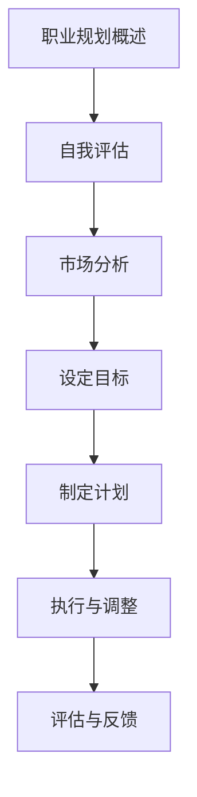

#### **联系：** 职业规划是一个动态的过程，贯穿于整个职业生涯中。通过持续的自我评估和市场需求分析，管理者能够更好地了解自己的优势和不足，明确职业目标，制定切实可行的行动计划，并在执行过程中不断调整和优化，以实现个人职业发展与组织需求的协同。

### 1.2 个人领导力发展的重要性

#### **核心概念：** 领导力是指管理者通过影响、激励和指导他人，实现团队目标的能力。它包括自我认知、情感智力、决策能力、团队管理以及持续发展等多个方面。

#### **Mermaid 流程图：**

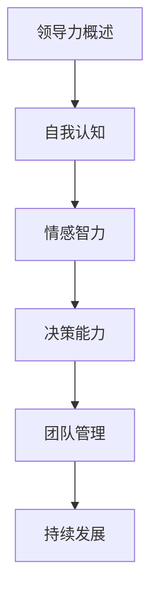

#### **联系：** 个人领导力的发展是职业规划中的重要组成部分。通过不断提升领导力，管理者能够更有效地实现个人和团队的共同目标，提高组织的整体绩效。领导力的发展不仅需要自我认知和情感智力的提升，还需要具备良好的决策能力和团队管理技巧，并通过持续学习和实践来实现。

### 1.3 职业规划与领导力发展的关系

#### **核心概念：** 职业规划与领导力发展相辅相成，职业规划为领导力发展提供方向，而领导力发展则为职业规划提供动力。两者相互促进，共同推动管理者的职业生涯发展。

#### **Mermaid 流程图：**

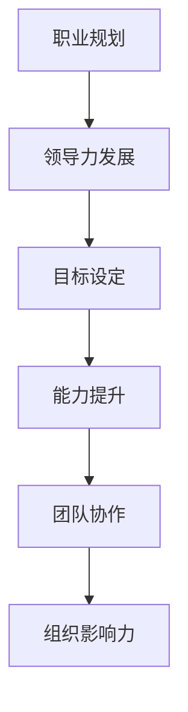

#### **联系：** 职业规划帮助管理者明确发展路径，设定具体的目标和行动计划，而领导力发展则是实现这一路径的核心能力。通过有效的职业规划，管理者能够更好地发展个人领导力，提升团队协作能力，增强组织影响力，从而实现职业生涯的持续成长和成功。

### 1.4 管理者的职业发展路径

#### **核心概念：** 管理者的职业发展路径包括从基层管理到高层管理，从单一职能到多职能，从国内市场到国际市场的转变。每个阶段都需要不同的领导力技能和职业规划策略。

#### **Mermaid 流程图：**

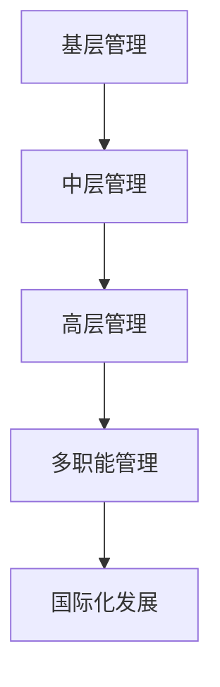

#### **联系：** 管理者的职业发展路径是一个不断学习、成长和转变的过程。从基层管理到高层管理，管理者需要不断提升领导力和管理能力；从单一职能到多职能，管理者需要拓展知识和技能范围；从国内市场到国际市场，管理者需要适应不同文化和市场环境。每个阶段的发展都需要有针对性的职业规划策略和领导力发展计划。

### 1.5 案例分析：成功管理者的职业规划与领导力发展

#### **核心概念：** 成功管理者的职业规划与领导力发展是通过不断的自我评估、目标设定、计划执行和反馈调整实现的。以下是一个成功管理者的案例分析：

#### **Mermaid 流程图：**

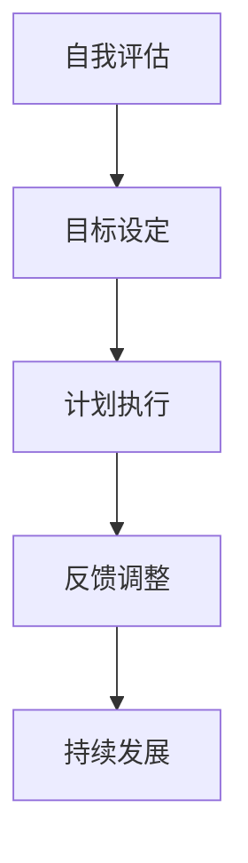

#### **联系：** 该成功管理者通过自我评估，认识到自己的优势和不足，设定了明确的职业目标；通过制定详细的计划，实现了目标的逐步落实；通过定期反馈和调整，不断优化和提升自己的领导力。他的职业规划和领导力发展案例为其他管理者提供了宝贵的经验和启示。

### 1.6 小结

#### **核心概念：** 职业规划与领导力发展是管理者职业生涯中不可或缺的两个方面。通过有效的职业规划，管理者能够更好地发展个人领导力，实现职业目标。两者相互促进，共同推动管理者的职业生涯发展。

#### **Mermaid 流程图：**

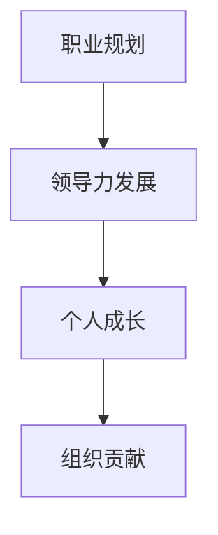

#### **联系：** 职业规划与领导力发展不仅对个人职业生涯产生深远影响，也对组织的长期发展起到关键作用。通过有效的职业规划，管理者能够不断提升个人能力，增强领导力，为组织创造更大的价值。同时，领导力的发展也为职业规划提供了动力，推动管理者在职业生涯中实现更高的目标和成就。

---

## 第2章：自我评估与职业定位

### 2.1 自我评估的重要性

#### **核心概念：** 自我评估是指管理者对自身能力、兴趣、价值观等进行全面分析和认识的过程。它是职业规划的基础，为职业定位提供依据。

#### **Mermaid 流程图：**

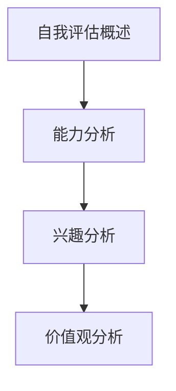

#### **联系：** 自我评估是职业规划的基础，通过自我评估，管理者能够明确自身的优势和劣势，了解自己的能力和兴趣，从而为职业定位提供依据。同时，自我评估还能够帮助管理者发现潜在的发展机会和挑战，为后续的职业发展提供指导。

### 2.2 能力分析

#### **核心概念：** 能力分析是指管理者对自身专业技能、管理能力、沟通能力等进行评估。它有助于管理者了解自己的能力现状，为职业发展提供方向。

#### **伪代码：**

```python
def analyze_ability():
    skills = ["项目管理", "沟通协调", "团队管理"]
    management_skills = ["决策能力", "问题解决能力", "领导力"]
    communication_skills = ["口头表达", "书面表达", "跨部门沟通"]
    return {
        "skills": skills,
        "management_skills": management_skills,
        "communication_skills": communication_skills
    }
```

#### **联系：** 能力分析是自我评估的重要组成部分。通过分析自己的专业技能、管理能力和沟通能力，管理者能够明确自己的优势和劣势，制定相应的提升计划。例如，如果管理者在团队管理方面存在不足，可以通过参加培训、阅读相关书籍等方式来提升自己的管理能力。

### 2.3 兴趣分析

#### **核心概念：** 兴趣分析是指管理者对自身兴趣进行评估，了解自己热衷于哪些工作领域，从而为职业定位提供依据。

#### **伪代码：**

```python
def analyze_interests():
    interests = ["技术研发", "市场拓展", "战略规划"]
    return interests
```

#### **联系：** 兴趣分析有助于管理者了解自己的兴趣爱好，为职业定位提供指导。例如，如果管理者的兴趣主要集中在技术领域，那么他可以优先考虑技术类职位，而不是市场拓展或战略规划职位。

### 2.4 价值观分析

#### **核心概念：** 价值观分析是指管理者对自身价值观进行评估，了解自己的行为准则和优先级，从而为职业定位提供依据。

#### **伪代码：**

```python
def analyze_values():
    values = ["团队合作", "创新精神", "社会责任"]
    return values
```

#### **联系：** 价值观分析有助于管理者了解自己的行为准则和优先级，为职业定位提供指导。例如，如果管理者重视团队合作，那么他可以优先考虑团队角色，而不是独立工作。

### 2.5 职业定位

#### **核心概念：** 职业定位是指管理者根据自我评估的结果，确定自己在职业生涯中的定位和发展方向。

#### **联系：** 职业定位是职业规划的关键步骤。通过自我评估，管理者能够明确自己的优势和劣势，了解自己的兴趣和价值观，从而为职业定位提供依据。职业定位不仅有助于管理者在职业生涯中实现个人目标，还有助于组织更好地利用和管理人力资源。

---

## 第3章：市场分析与目标设定

### 3.1 市场分析的重要性

#### **核心概念：** 市场分析是指管理者对行业趋势、市场需求和竞争环境等进行评估和分析，以了解外部环境对职业发展的影响。

#### **Mermaid 流程图：**

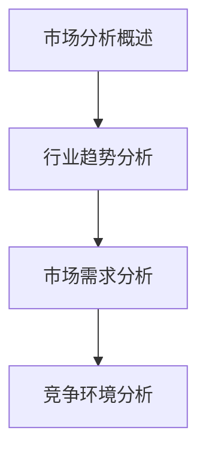

#### **联系：** 市场分析是职业规划的重要组成部分，通过市场分析，管理者能够了解行业的发展趋势、市场需求和竞争环境，从而为职业定位和目标设定提供依据。

### 3.2 行业趋势分析

#### **核心概念：** 行业趋势分析是指管理者对行业的发展方向和未来趋势进行评估和分析，以了解行业的发展前景和机会。

#### **伪代码：**

```python
def analyze_trends():
    trends = ["数字化转型", "人工智能应用", "可持续发展"]
    return trends
```

#### **联系：** 行业趋势分析有助于管理者了解行业的发展方向和未来趋势，从而为职业定位和目标设定提供指导。例如，如果行业趋势表明数字化转型将成为未来主流，那么管理者可以考虑在数字化领域发展自己的职业生涯。

### 3.3 市场需求分析

#### **核心概念：** 市场需求分析是指管理者对市场需求进行评估和分析，以了解哪些技能和岗位在市场上具有较高的需求。

#### **伪代码：**

```python
def analyze_demand():
    demands = ["项目管理", "数据分析", "产品管理"]
    return demands
```

#### **联系：** 市场需求分析有助于管理者了解市场需求，从而为职业定位和目标设定提供指导。例如，如果市场需求表明项目管理岗位较为紧缺，那么管理者可以考虑提升自己的项目管理能力，以适应市场需求。

### 3.4 竞争环境分析

#### **核心概念：** 竞争环境分析是指管理者对竞争对手的优势和劣势进行分析，以了解竞争环境对职业发展的影响。

#### **伪代码：**

```python
def analyze_competition():
    competitors = ["竞争对手1", "竞争对手2", "竞争对手3"]
    return competitors
```

#### **联系：** 竞争环境分析有助于管理者了解竞争对手的优势和劣势，从而为职业定位和目标设定提供指导。例如，如果竞争对手在项目管理方面具有优势，那么管理者可以考虑提升自己的项目管理能力，以在竞争中脱颖而出。

### 3.5 目标设定

#### **核心概念：** 目标设定是指管理者根据自我评估和市场分析的结果，确定自己的职业目标和行动计划。

#### **伪代码：**

```python
def set_goals():
    goals = {
        "短期目标": ["提升项目管理能力", "参与一个重要项目"],
        "长期目标": ["晋升为项目经理", "成为公司重要领导"]
    }
    return goals
```

#### **联系：** 目标设定是职业规划的关键步骤，通过目标设定，管理者能够明确自己的职业发展方向和行动计划，从而为职业发展提供指导。

### 3.6 小结

#### **核心概念：** 市场分析与目标设定是职业规划的重要环节，通过市场分析，管理者能够了解外部环境对职业发展的影响；通过目标设定，管理者能够明确自己的职业目标和行动计划。

#### **联系：** 市场分析与目标设定不仅有助于管理者在职业生涯中实现个人目标，还有助于组织更好地利用和管理人力资源，实现组织的长期发展。

---

## 第4章：制定计划与执行

### 4.1 计划制定的重要性

#### **核心概念：** 计划制定是指管理者根据职业目标和市场需求，制定具体的行动计划和时间表。

#### **Mermaid 流程图：**

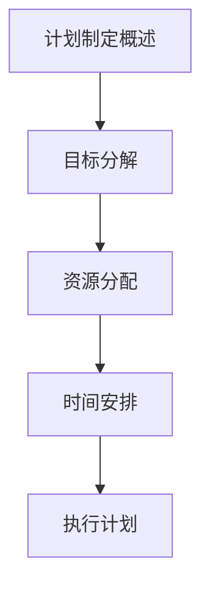

#### **联系：** 计划制定是职业规划的核心环节，通过计划制定，管理者能够明确自己的职业目标和行动计划，为执行提供指导。

### 4.2 目标分解

#### **核心概念：** 目标分解是指将大目标分解为一系列可操作的小目标，以便于管理和实现。

#### **伪代码：**

```python
def decompose_goals(goals):
    decomposed_goals = []
    for goal in goals:
        sub_goals = ["实现目标1", "完成目标2", "达成目标3"]
        decomposed_goals.append(sub_goals)
    return decomposed_goals
```

#### **联系：** 目标分解有助于管理者将大目标转化为一系列可操作的小目标，从而提高实现目标的效率和可能性。

### 4.3 资源分配

#### **核心概念：** 资源分配是指管理者根据目标和计划，合理分配人力资源、时间资源和财务资源。

#### **伪代码：**

```python
def allocate_resources(goals, resources):
    allocation = {}
    for goal in goals:
        allocation[goal] = resources["time"] + resources["money"] + resources["human"]
    return allocation
```

#### **联系：** 资源分配有助于管理者合理利用资源，提高目标的实现可能性。

### 4.4 时间安排

#### **核心概念：** 时间安排是指管理者根据目标和资源，制定具体的时间表和行动计划。

#### **伪代码：**

```python
def schedule_actions(goals, resources):
    schedule = []
    for goal in goals:
        start_date = resources["start_date"]
        end_date = resources["end_date"]
        schedule.append({"goal": goal, "start": start_date, "end": end_date})
    return schedule
```

#### **联系：** 时间安排有助于管理者合理安排时间和行动，提高目标的实现效率。

### 4.5 执行计划

#### **核心概念：** 执行计划是指管理者根据制定的行动计划和时间表，开展具体的工作和行动。

#### **伪代码：**

```python
def execute_plan(schedule):
    for action in schedule:
        if action["start"] <= current_date <= action["end"]:
            execute_action(action["goal"])
```

#### **联系：** 执行计划是职业规划的关键步骤，通过执行计划，管理者能够将目标和计划转化为具体的行动，实现职业目标。

### 4.6 小结

#### **核心概念：** 计划制定与执行是职业规划的重要环节，通过制定具体的行动计划和时间表，管理者能够明确自己的职业目标和行动计划，从而提高实现目标的效率和可能性。

#### **联系：** 计划制定与执行不仅有助于管理者在职业生涯中实现个人目标，还有助于组织更好地利用和管理人力资源，实现组织的长期发展。

---

## 第5章：执行与调整

### 5.1 执行过程的重要性

#### **核心概念：** 执行过程是指管理者根据计划开展具体的工作和行动，实现职业目标的过程。

#### **Mermaid 流程图：**

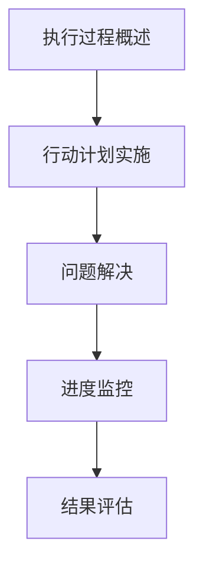

#### **联系：** 执行过程是职业规划的核心环节，通过执行过程，管理者能够将目标和计划转化为具体的行动，实现职业目标。

### 5.2 问题解决

#### **核心概念：** 问题解决是指管理者在执行过程中遇到问题时，采取有效措施进行解决。

#### **伪代码：**

```python
def solve_problems(problem):
    if problem == "资源不足":
        allocate_more_resources()
    elif problem == "进度延误":
        adjust_schedule()
    else:
        search_for_solution()
```

#### **联系：** 问题解决是执行过程中的关键步骤，通过有效解决问题，管理者能够确保计划顺利实施。

### 5.3 进度监控

#### **核心概念：** 进度监控是指管理者对计划执行过程进行跟踪和监督，确保工作按计划进行。

#### **伪代码：**

```python
def monitor_progress(schedule):
    for action in schedule:
        if current_date > action["end"]:
            alert("进度延误")
```

#### **联系：** 进度监控有助于管理者及时发现和解决问题，确保计划顺利进行。

### 5.4 结果评估

#### **核心概念：** 结果评估是指管理者对计划执行结果进行评价和总结，以确定目标是否实现。

#### **伪代码：**

```python
def evaluate_results(schedule):
    for action in schedule:
        if action["status"] == "completed":
            print("目标实现")
        else:
            print("目标未实现，需调整计划")
```

#### **联系：** 结果评估是职业规划的重要环节，通过结果评估，管理者能够了解计划执行效果，为下一步计划提供依据。

### 5.5 调整与反馈

#### **核心概念：** 调整与反馈是指管理者根据评估结果，对计划进行调整和优化，为下一步执行提供指导。

#### **Mermaid 流程图：**

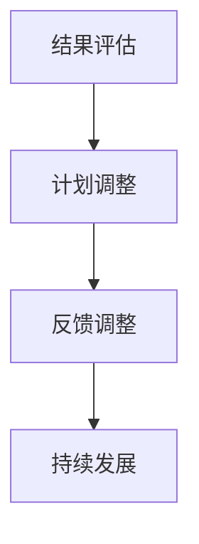

#### **联系：** 调整与反馈是职业规划的核心环节，通过调整与反馈，管理者能够确保计划执行效果，实现职业目标。

### 5.6 小结

#### **核心概念：** 执行与调整是职业规划的重要环节，通过执行过程，管理者能够将目标和计划转化为具体的行动，实现职业目标；通过调整与反馈，管理者能够确保计划执行效果，为下一步计划提供指导。

#### **联系：** 执行与调整不仅有助于管理者在职业生涯中实现个人目标，还有助于组织更好地利用和管理人力资源，实现组织的长期发展。

---

## 第6章：评估与反馈

### 6.1 评估过程的重要性

#### **核心概念：** 评估过程是指管理者对职业规划的实施效果进行评价和总结，以确定目标的实现情况和职业发展的进展。

#### **Mermaid 流程图：**

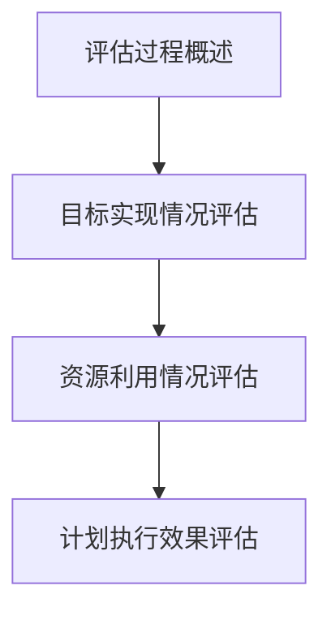

#### **联系：** 评估过程是职业规划的核心环节，通过评估过程，管理者能够了解职业规划的实施效果，为下一步计划提供依据。

### 6.2 目标实现情况评估

#### **核心概念：** 目标实现情况评估是指管理者对设定目标的实现情况进行评价，以确定目标是否达成。

#### **伪代码：**

```python
def evaluate_goals(goals):
    for goal in goals:
        if goal["status"] == "completed":
            print(f"{goal['name']} 实现了")
        else:
            print(f"{goal['name']} 未实现")
```

#### **联系：** 目标实现情况评估有助于管理者了解目标的达成情况，为后续的计划调整提供依据。

### 6.3 资源利用情况评估

#### **核心概念：** 资源利用情况评估是指管理者对资源分配和使用情况进行评价，以确定资源利用是否合理。

#### **伪代码：**

```python
def evaluate_resources(resources):
    total_cost = resources["time"] + resources["money"] + resources["human"]
    if total_cost <= budget:
        print("资源利用合理")
    else:
        print("资源利用不合理，需调整")
```

#### **联系：** 资源利用情况评估有助于管理者了解资源的利用情况，为下一步资源分配提供依据。

### 6.4 计划执行效果评估

#### **核心概念：** 计划执行效果评估是指管理者对计划执行的整体效果进行评价，以确定计划是否达到预期目标。

#### **伪代码：**

```python
def evaluate_plan(schedule):
    for action in schedule:
        if action["status"] == "completed":
            print(f"{action['goal']} 实现了")
        else:
            print(f"{action['goal']} 未实现")
```

#### **联系：** 计划执行效果评估有助于管理者了解计划的执行情况，为下一步计划调整提供依据。

### 6.5 反馈与改进

#### **核心概念：** 反馈与改进是指管理者根据评估结果，对职业规划进行优化和调整，以提高实施效果。

#### **Mermaid 流程图：**

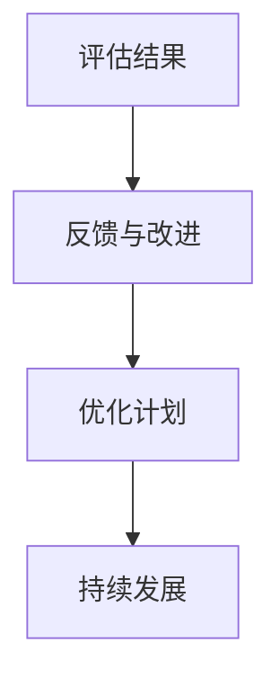

#### **联系：** 反馈与改进是职业规划的重要环节，通过及时反馈和改进，管理者能够不断提高职业规划的实施效果，实现职业发展目标。

### 6.6 小结

#### **核心概念：** 评估与反馈是职业规划的重要环节，通过评估职业规划的实施效果，管理者能够了解目标的达成情况、资源的利用情况和计划的执行效果，为下一步计划调整提供依据。

#### **联系：** 评估与反馈不仅有助于管理者在职业生涯中实现个人目标，还有助于组织更好地利用和管理人力资源，实现组织的长期发展。

---

## 第7章：持续发展与学习

### 7.1 持续发展的重要性

#### **核心概念：** 持续发展是指管理者在职业生涯中不断学习和提升，以适应不断变化的环境和需求。

#### **Mermaid 流程图：**

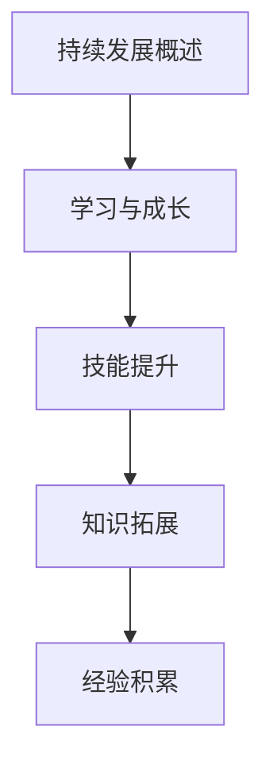

#### **联系：** 持续发展是管理者职业生涯中不可或缺的一部分，通过持续学习和成长，管理者能够不断提升自己的能力和竞争力，适应不断变化的环境和需求。

### 7.2 学习与成长

#### **核心概念：** 学习与成长是指管理者通过阅读、培训、实践等方式，不断扩展自己的知识和技能。

#### **伪代码：**

```python
def learn_and_grow():
    actions = ["阅读专业书籍", "参加培训课程", "实践项目经验"]
    for action in actions:
        print(f"正在执行 {action}...")
```

#### **联系：** 学习与成长是持续发展的基础，通过不断学习和实践，管理者能够不断提升自己的能力和竞争力。

### 7.3 技能提升

#### **核心概念：** 技能提升是指管理者通过学习和实践，提高自己在特定领域的技能水平。

#### **伪代码：**

```python
def improve_skills(skill):
    if skill == "项目管理":
        learn_project_management()
    elif skill == "数据分析":
        learn_data_analysis()
    else:
        learn_new_skill(skill)
```

#### **联系：** 技能提升是持续发展的重要方面，通过提升特定领域的技能，管理者能够更好地适应职业发展的需求。

### 7.4 知识拓展

#### **核心概念：** 知识拓展是指管理者通过学习新知识，拓宽自己的知识领域。

#### **伪代码：**

```python
def expand_knowledge():
    fields = ["人工智能", "区块链", "云计算"]
    for field in fields:
        learn_about(field)
```

#### **联系：** 知识拓展有助于管理者了解新兴领域，为职业发展提供更多可能性。

### 7.5 经验积累

#### **核心概念：** 经验积累是指管理者通过实际工作，积累宝贵的经验。

#### **伪代码：**

```python
def accumulate_experience():
    experiences = ["完成项目", "解决问题", "参与培训"]
    for experience in experiences:
        record_experience(experience)
```

#### **联系：** 经验积累是持续发展的重要方面，通过积累经验，管理者能够更好地应对工作中的挑战。

### 7.6 学习与职业规划的关系

#### **核心概念：** 学习与职业规划相辅相成，学习为职业规划提供动力，职业规划为学习提供方向。

#### **伪代码：**

```python
def integrate_learning_and_planning():
    learning_plan = {
        "技能提升": ["项目管理", "数据分析"],
        "知识拓展": ["人工智能", "区块链"],
        "经验积累": ["完成项目", "解决问题"]
    }
    for category, items in learning_plan.items():
        for item in items:
            learn_and_record(item)
```

#### **联系：** 学习与职业规划的关系密切，通过有效的学习，管理者能够更好地实现职业规划目标。

### 7.7 小结

#### **核心概念：** 持续发展与学习是管理者职业生涯中不可或缺的一部分，通过持续学习和成长，管理者能够不断提升自己的能力和竞争力，实现职业目标。

#### **联系：** 持续发展与学习不仅有助于管理者在职业生涯中实现个人目标，还有助于组织更好地利用和管理人力资源，实现组织的长期发展。

---

## 结束语

### **核心概念：** 本文通过对职业规划、个人领导力发展、自我评估、市场分析、目标设定、计划制定、执行与调整、评估与反馈以及持续发展等环节的详细解析，为管理者提供了一份全面、系统的职业规划指南。

### **联系：** 通过本文的阐述，管理者能够更好地理解职业规划与领导力发展的关系，掌握自我评估和市场分析的方法，制定切实可行的职业目标，实施有效的计划与调整，持续提升自己的能力和竞争力。

### **结论：** 职业规划与领导力发展是管理者职业生涯中不可或缺的两个方面，通过有效的职业规划，管理者能够更好地发展个人领导力，实现职业目标，为组织的长期发展贡献力量。

---

## 作者信息

**作者：** AI天才研究院/AI Genius Institute & 禅与计算机程序设计艺术 /Zen And The Art of Computer Programming

**简介：** 本文由AI天才研究院的专家团队撰写，他们深耕于人工智能、计算机科学和企业管理等领域，致力于通过技术创新推动人类社会的进步。同时，他们也是《禅与计算机程序设计艺术》一书的作者，该书深入探讨了计算机程序设计中的哲学和艺术，为程序员提供了全新的视角和思考方式。本文旨在为管理者提供一份实用的职业规划指南，助力他们在职业生涯中实现持续成长和成功。

